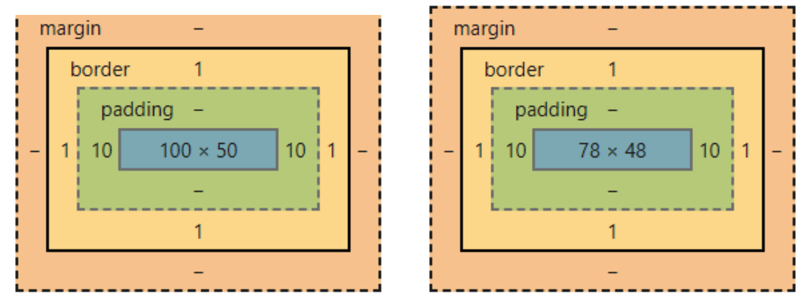
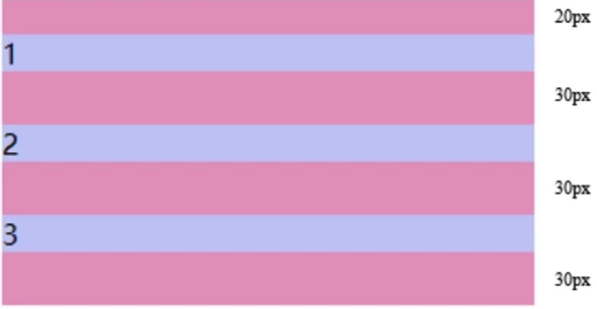
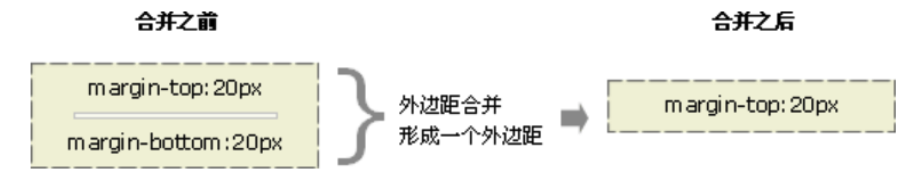
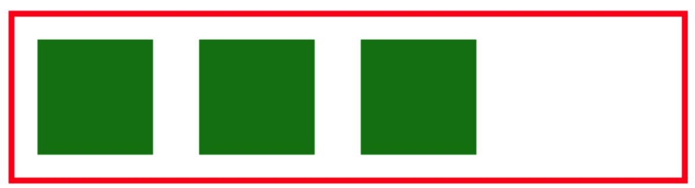

[toc]

# 盒模型

## 盒模型类别

```css
box-sizing:border-box/content-box;
```

编写页面代码时应尽量使用标准的W3C模型(需在页面中**声明DOCTYPE类型**)，这样可以避免多个浏览器对同一页面的不兼容。 因为若不声明DOCTYPE类型，IE浏览器会将盒子模型解释为IE盒子模型，FireFox等会将其解释为W3C盒子模型；若在页面中声明了DOCTYPE类型，所有的浏览器都会把盒模型解释为W3C盒模型。

## 盒子模型渲染出来的宽度

渲染出来的宽度就是当前padding+border+width的宽度，所以

content-box渲染出来的宽度就是设置的width+padding+border,而border-box渲染出来就是width设置的宽度

例如：

```CSS
//content-box
div{
    width:100px;
    height:50px;
    box-sizing:content-box;
    padding:0 10px;
    border:1px solid red;
    background:black;
}
```



- content-box实际渲染结果为100+20+2=122px
- 而border-box实际渲染结果为100px,实际内容宽度为100-2-20=78px

## 用JS获取宽高

- dom.style.width/height : 只能取出内联样式的宽和高 
- dom.currentStyle.width/height 获取即时计算的样式，但是只有 IE 支持，要想支持其他浏览器，可以通过下面的方式
- window.getComputedStyle(dom).width: 兼容性更好

## 外边距重叠

margin重叠三个条件:

+ 同属于一个BFC
+ 相邻垂直
+ 块级元素。
+ 而且没有阻挡（比如padding，border,非空内容）

### 相邻兄弟节点之间边距重叠(垂直方向)

```html
<style>
#margin {
    background: #e7a1c5;
    width: 300px;
    display:block;
}
#margin > p {
    display:block;
    height:50px;
    background: #c8cdf5;
    margin: 20px auto 30px;
}
</style>
<section id="margin">
    <p>1</p>
    <p>2</p>
    <p>3</p>
</section>
```



### 父子元素之间高度坍塌

子元素多余的外边距会被父元素的外边距截断。

```html
<style>
  .parent {
    background: #E7A1C5;
    height:110px;
  }
  .parent .child {
    background: #C8CDF5;
    height: 100px;
    margin-top: 10px;

  }
</style>
<section class="parent">
  <article class="child"></article>
</section>
```


### 空元素的边界重叠

假设有一个空元素，它有外边距，但是没有边框或填充。在这种情况下，上外边距与下外边距就碰到了一起，它们会发生合并



### 解决方案

+ 父元素加一个border
+ 使用padding
+ 父元素overflow:hidden（兄弟之间无法解决，只能解决父子之间）
+ 兄弟之间的一个套一个父级div，并设置overflow:hidden,但是两个相邻的p都套了div，两个div之间还是有兄弟元素之间的外边距重叠

```
<!-- 解决垂直方向边距重叠，增加父元素并设置overflow属性为hidden -->
<div style="overflow:hidden">    
    <p class="new">2</p>
</div>
```


# 元素垂直居中

基本设置

```html
//html部分
<div class="container" id="extral-container">
    <div class="container-item" id="extral-item">需要居中的元素</div>
</div>

//css部分
.container{
    width:200px;
    height:200px;
    background:red;
}
.container-item{
    width:100px;
    height:100px;
    background:green;
}
```

## 行内元素水平垂直居中

```CSS
text-align: center;
line-height: 100px;
```

## (1)absolute+负margin或者用calc原理相同(宽高确定)

```css
#extral-container{
    position:relative
}
#extral-item{
   position:absolute;
   top:50%;
   left:50%;
   margin-left:-50px;
   margin-top:-50px;
}
```

或者

```css
#extral-item{
    position:absolute;
    top:calc(50% - 50px);
    left:calc(50% - 50px);
}
```

## (2)absolute+margin:auto(宽高确定)

```css
#extral-container{
    position:relative
}
#extral-item{
   position:absolute;
   top:0;
   left:0;
   bottom:0;
   right:0;
   margin:auto;
}
```

## (3)absolute+translate(不需要已知宽高，translate是相对于自身元素的)

```css
#extral-container{
    position:relative
}
#extral-item{
    position:absolute;
    top: 50%;
    left: 50%;
    transform: translate(-50%, -50%);
}
```

## (4)flex(不需要已知宽高)

```css
#extral-container{
    display:flex;
    justify-content:center;
    align-items:center;
}
```

## (5)grid(不需要设置宽高)

```css
#extral-container{
    display:grid;
}
#extral-item{
    align-self:center;
    justify-self: center;
}
```

## (6)table(不需要知道宽高，但父元素设置为table-cell,子元素需要设置inline-block)

```css
#extral-container{
    display: table-cell;
    text-align: center;
    vertical-align: middle;
}
#extral-item{
   display:inline-block;
}
```

## (7)display:flex/grid+margin:auto(不需要设置宽高)

************************

# 格式化上下文

FC是一种渲染规则，它是页面中的一块渲染区域，并且有一套渲染规则，它决定了其子元素将如何定位，以及和其他元素的关系和相互作用

## BFC

BFC 就是块级格式上下文，是页面盒模型布局中的一种 CSS 渲染模式，相当于一个独立的容器，里面的元素和外部的元素相互不影响。创建 BFC 的方式有：

- 根元素
- float不为none
- overflow不为不为visible
- display为 table-cell|table-caption|inline-block|inline-flex|flex| <font color="red">flow-root</font>
- position的值不为relative和static

### 作用

- 清除浮动, 原理：触发父div的BFC属性，使下面的子div都处在父div的同一个BFC区域之内

  ```CSS
  //解决浮动父元素坍塌问题
  .parent {
      overflow:hidden;
  }
  .float {
      float:left;
  }
  
  <div class='parent'>
      <div class='float'>浮动元素</div>
  </div>
  ```

- 可以阻止元素被浮动元素覆盖
- 分属于不同的BFC时，可以阻止margin重叠

## IFC

是由所包含的子元素来创建，只有在一个区域内仅包含可水平排列的元素时才会生成，这些子元素可以是文本、inline-level元素或inline-block-level元素。

特性

- IFC内部的元素，按从左到右、从上到下的顺序排布；
- IFC内部的每个元素，都可以通过设置**vertical-align属性**，来调整在垂直方向上的对齐；
- 包含这些内部元素的矩形区域，形成的每一行，被称为line box（行框）。高度由其包含行内元素中最高的实际高度计算而来（不受到竖直方向的padding/margin影响)

# 布局

## float

浮动元素会脱离文档流并向左/向右浮动，直到碰到父元素或者另一个浮动元素。float脱离普通流是为了图文环绕效果，不清除浮动block会出现在浮动元素的下方被遮挡，父元素高度坍塌，但是inline-block,inline,float都不会被遮挡

### 浮动的特征


- 浮动会导致父元素高度坍塌

  ```html
  // css
  .box-wrapper {
    border: 5px solid red;
  }
  .box-wrapper .box {
    float: left; 
    width: 100px; 
    height: 100px; 
    margin: 20px; 
    background-color: green;
  }
  
  // html
  <div class="box-wrapper">
    <div class="box"></div>
    <div class="box"></div>
    <div class="box"></div>
  </div>
  ```

  

### 清除浮动

clear 的元素只能通过**调整自身**来使自己不要和浮动元素排列在一起。

如果在子元素上清除浮动

```html
<div class="box-wrapper">
    <div class="box"></div>
    <div class="box"></div>
    <div class="box" style="clear:both;"></div>
</div>
```


+ clear清除浮动，最后添加一个空元素:  因为父容器现在必须考虑非浮动子元素的位置，而后者肯定出现在浮动元素下方，所以显示出来，父容器就把所有子元素都包括进去了。

  ```html
  <div class="box-wrapper">
      <div class="box"></div>
      <div class="box"></div>
      <div class="box"></div>
      <div style="clear:both;"></div>
  </div>
  ```

+ 父元素加伪元素

  ```css
  // 全浏览器通用的clearfix方案【推荐】
  // 引入了zoom以支持IE6/7
  // 同时加入:before以解决现代浏览器上边距折叠的问题
  .clearfix:before,
  .clearfix:after {
      display: block;
      content: " ";
  }
  .clearfix:after {
      clear: both;
  }
  //兼容ie6：激活父元素的"hasLayout"属性，让父元素拥有自己的布局
  .clearfix{
      zoom: 1;//或者height：1%；
  }
  ```

  

+ 父级div定义 overflow: auto|hidden: 缺点：一个是IE6不支持，另一个是一旦子元素的大小超过父容器的大小，就会出显示问题。

+ 父元素也改为浮动元素

  ```html
  <div style="float:left;">
      <div style="float:left;width:45%;"></div>
      <div style="float:right;width:45%;"></div>
  </div>
  ```

+ 兄弟之间清除浮动

下一标签直接清浮动兄弟标签浮动时，在下一标签的属性中直接写入清除clear:both; 

这样就可以清除以上标签的浮动而不用加入空标签来清除浮动。

### <font color="red">css中的flow-root属性</font>

display:flow-root;是一种新的布局方式，它在块级布局方式的基础上对子元素的浮动float属性进行了修正(父元素上使用display: flow-root)。

```
display: flow-root,都会变成块级元素，同时这个元素会建立新的块级格式上下文，也就是业界常说的BFC。
```

