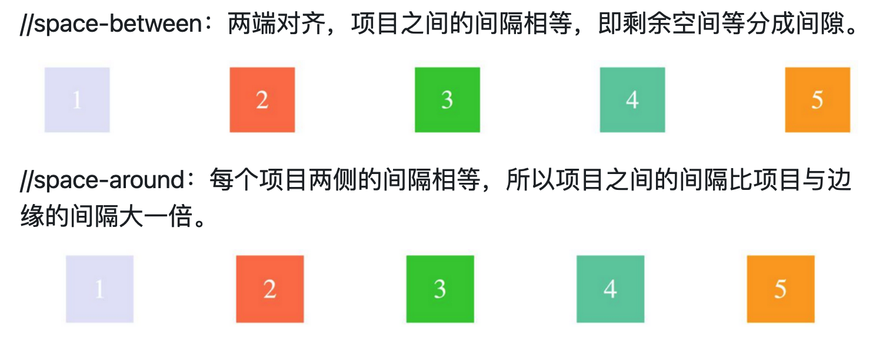
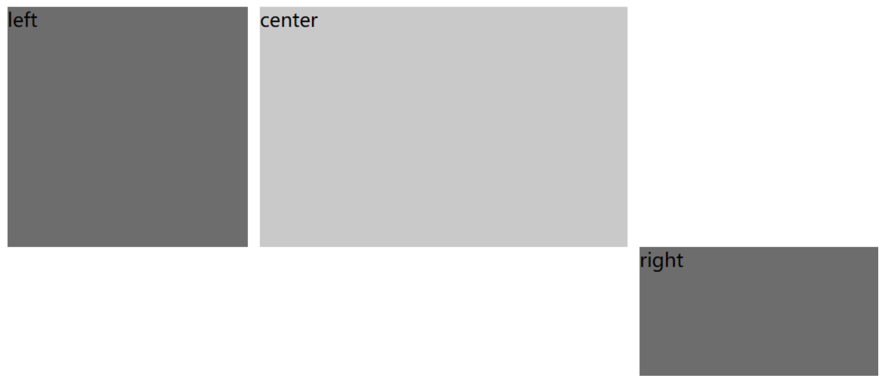
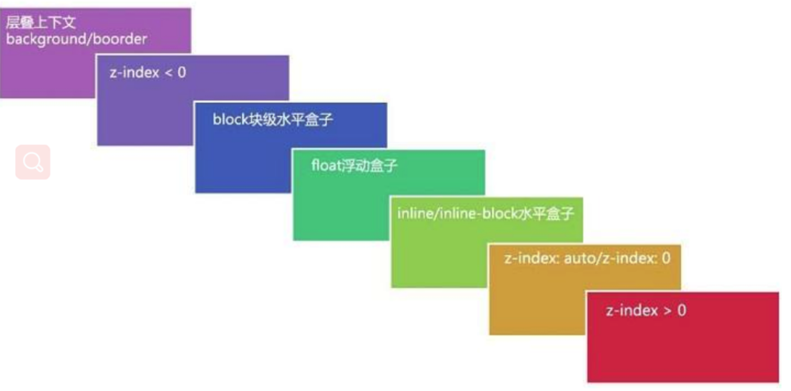

[toc]

# 盒模型

## 盒模型类别

```css
box-sizing:border-box/content-box;
```

编写页面代码时应尽量使用标准的W3C模型(需在页面中**声明DOCTYPE类型**)，这样可以避免多个浏览器对同一页面的不兼容。 因为若不声明DOCTYPE类型，IE浏览器会将盒子模型解释为IE盒子模型，FireFox等会将其解释为W3C盒子模型；若在页面中声明了DOCTYPE类型，所有的浏览器都会把盒模型解释为W3C盒模型。

## 盒子模型渲染出来的宽度

+ content-box的width就是内容的宽度，实际渲染的宽度是width+padding+border
+ Border-box的width本身就是内容宽度+padding+border,是实际渲染出来的宽度

```CSS
div{
    width:100px;
    height:50px;
    box-sizing:content-box;
    padding:0 10px;
    border:1px solid red;
    background:black;
}
```


- content-box实际渲染结果为100+20+2=122px
- 而border-box实际渲染结果为100px,实际内容宽度为100-2-20=78px

## 用JS获取宽高

- dom.style.width/height : 只能取出内联样式的宽和高 
- dom.currentStyle.width/height 获取即时计算的样式，但是只有 IE 支持，要想支持其他浏览器，可以通过下面的方式
- window.getComputedStyle(dom).width: 兼容性更好

## offsetHeight、clientHeight、scrollHeight

+ offsetHeight:  内容高度 + padding + borde
+ clientHeight: padding+内容高度
+ scrollHeight: padding+实际内容尺寸

## 外边距重叠

margin重叠三个条件:

+ 同属于一个BFC
+ 相邻垂直
+ 块级元素。
+ 而且没有阻挡（比如padding，border,非空内容）

### 相邻兄弟节点之间边距重叠(垂直方向)

```html
<style>
#margin {
    background: #e7a1c5;
    width: 300px;
    display:block;
}
#margin > p {
    display:block;
    height:50px;
    background: #c8cdf5;
    margin: 20px auto 30px;
}
</style>
<section id="margin">
    <p>1</p>
    <p>2</p>
    <p>3</p>
</section>
```


### 父子元素之间高度坍塌

子元素多余的外边距会被父元素的外边距截断。

```html
<style>
  .parent {
    background: #E7A1C5;
    height:110px;
  }
  .parent .child {
    background: #C8CDF5;
    height: 100px;
    margin-top: 10px;

  }
</style>
<section class="parent">
  <article class="child"></article>
</section>
```


### 空元素的边界重叠

假设有一个空元素，它有外边距，但是没有边框或填充。在这种情况下，上外边距与下外边距就碰到了一起，它们会发生合并


### 解决方案

+ 父元素加一个border
+ 使用padding
+ 父元素overflow:hidden（兄弟之间无法解决，只能解决父子之间）
+ 兄弟之间的一个套一个父级div，并设置overflow:hidden,但是两个相邻的p都套了div，两个div之间还是有兄弟元素之间的外边距重叠

# 布局

## 什么是文档流

normal flow普通/正常/标准都行

所谓普通/标准流，就是块级元素一个一排地从上向下堆放，行内元素从左往右地堆放，这就是一个标准的流程

## flex布局

+ 缺点

兼容性较差，pc端浏览器支持情况比较差 IE11或更低版本不支持flex或仅支持部分

### flex容器

(当时设置 flex 布局之后，子元素的 float、clear、vertical-align 的属性将会失效)

```
.container {
    display: flex | inline-flex;       //可以有两种取值
}
```

### flex的属性

+ Flex-direction: row | row-reverse | column | column-reverse;
+ flex-wrap(决定容器内项目是否可换行):  nowrap | wrap | wrap-reverse;
+ flex-flow: flex-direction 和 flex-wrap 的简写形式
+ justify-content：定义了项目在主轴的对齐方式。

```css
.container {
    justify-content: flex-start | flex-end | center | space-between | space-around;
}
// space-between：两端对齐，项目之间的间隔相等，即剩余空间等分成间隙。
//space-around：每个项目两侧的间隔相等，所以项目之间的间隔比项目与边缘的间隔大一倍。
```



+ align-items: 定义了项目在交叉轴上的对齐方式

  ```
  .container {
      align-items: flex-start | flex-end | center | baseline | stretch;
  }
  ```

默认值为 stretch，假设容器高度设置为 100px，而项目都没有设置高度的情况下，则项目的高度也为 100px。

+ align-content:

  定义了多根轴线的对齐方式，如果项目只有一根轴线，那么该属性将不起作用
  当 flex-wrap 设置为 wrap 的时候，容器可能会出现多条轴线，这时候， 就需要去设置多条轴线之间的对齐方式了。

  ```
  .container {
      align-content: flex-start | flex-end | center | space-between | space-around | stretch;
  }
  ```

​      默认为stretch，多条轴线平分空间，也可以设置其他值，比如设置了center

### flex-item的属性

+ order： 定义项目在容器中的排列顺序，数值越小，排列越靠前，默认值为 0

  ```
  .item {
      order: <integer>;
  }
  ```

+ flex-basis:定义了在分配多余空间之前，项目占据的主轴空间，浏览器根据这个属性，计算主轴是否有多余空间

  ```
  .item {
      flex-basis: <length> | auto;
  }
  // 默认值：auto，即项目本来的大小, 这时候 item 的宽高取决于 width 或 height 的值。
  ```

当主轴为水平方向的时候，当设置了 flex-basis，项目的宽度设置值会失效，flex-basis 需要跟 flex-grow 和 flex-shrink 配合使用才能发挥效果。

+ flex-grow: 定义项目的放大比例

  ```
  .item {
      flex-grow: <number>;
  }
  ```

    + 默认值为 0，即如果存在剩余空间，也不放大

  + 如果所有项目的 flex-grow 属性都为1 则它们将等分剩余空间。(如果有的话)

  + 如果一个项目的 flex-grow 属性为 2，其他项目都为 1，则前者占据的剩余空间将比其他项多一倍。

  + 如果当所有项目以 flex-basis 的值排列完后发现空间不够了，且 flex-wrap：nowrap 时，此时 flex-grow 则不起作用了

+ flex-shrink: 定义了项目的缩小比例

  ```
  .item {
      flex-shrink: <number>;
  }
  ```
  + 默认值: 1，即如果空间不足，该项目将缩小，负值对该属性无效。
  + 如果一个项目的 flex-shrink 属性为 0，其他项目都为 1，则空间不足时，前者不缩小。

  ### 简写说明flex

  ```js
  默认===>0 1 auto
  flex:none===> 0 0 auto
  flex:auto===> 1 1 auto
  flex:1 ==>1 1 auto
  
  ```

  flex-grow, flex-shrink 和 flex-basis的简写

  flex 的默认值是 0 1 auto。

  ### align-self

  允许单个项目有与其他项目不一样的对齐方式

  ```
  .item {
       align-self: auto | flex-start | flex-end | center | baseline | stretch;
  }
  ```
  默认值为 auto，表示继承父元素的 align-items 属性，如果没有父元素，则等同于 stretch。


##  position布局

### position为sticky

```css
nav {
    position: -webkit-sticky;
    position: sticky;
    top: 0;
}
```
+ -webkit要兼容性处理
+ 效果：当在页面中的时候，relative显示正常位置，当即将滚动出页面时，fixed，固定在头部

### position:fixed失效

position:fixed 的元素将相对于屏幕视口（viewport）的位置来指定其位置。并且元素的位置在屏幕滚动时不会改变。

```js
position:fixed失效
指定了 position:fixed 的元素却无法相对于屏幕视口进行定位。

当元素祖先的 transform 属性非 none 时，定位容器由视口改为该祖先。
```

+ 任何非 none 的 transform 值都会导致一个**堆叠上下文**（Stacking Context）和包含块（Containing Block）的创建。

+ 由于堆叠上下文的创建，该元素会影响其子元素的固定定位。设置了 position:fixed 的子元素将不会基于 viewport 定位，而是基于这个父元素。


```js
chrome浏览器下下述 3 种方式目前都会使得 position:fixed 定位的基准元素改变，但是其它内核浏览器不一定：

transform 属性值不为 none 的元素
perspective 值不为 none 的元素
在 will-change 中指定了任意 CSS 属性
```

### position:absolute是相对于哪个元素定位

绝对定位元素相对的元素是它最近的一个祖先，该祖先满足：position的值必须是：relative、absolute、fixed，若没有这样的祖先则相对于body进行定位。

## float

浮动元素会脱离文档流并向左/向右浮动，直到碰到父元素或者另一个浮动元素。float脱离普通流是为了图文环绕效果，不清除浮动block会出现在浮动元素的下方被遮挡，父元素高度坍塌，但是inline-block,inline,float都不会被遮挡

### 浮动的特征


- 浮动会导致父元素高度坍塌

  ```html
  // css
  .box-wrapper {
    border: 5px solid red;
  }
  .box-wrapper .box {
    float: left; 
    width: 100px; 
    height: 100px; 
    margin: 20px; 
    background-color: green;
  }
  
  // html
  <div class="box-wrapper">
    <div class="box"></div>
    <div class="box"></div>
    <div class="box"></div>
  </div>
  ```

  

### 清除浮动

clear 的元素只能通过**调整自身**来使自己不要和浮动元素排列在一起。

如果在子元素上清除浮动

```html
<div class="box-wrapper">
    <div class="box"></div>
    <div class="box"></div>
    <div class="box" style="clear:both;"></div>
</div>
```


+ clear清除浮动，最后添加一个空元素:  因为父容器现在必须考虑非浮动子元素的位置，而后者肯定出现在浮动元素下方，所以显示出来，父容器就把所有子元素都包括进去了。

  ```html
  <div class="box-wrapper">
      <div class="box"></div>
      <div class="box"></div>
      <div class="box"></div>
      <div style="clear:both;"></div>
  </div>
  ```

+ 父元素加伪元素

  ```css
  // 全浏览器通用的clearfix方案【推荐】
  // 引入了zoom以支持IE6/7
  // 同时加入:before以解决现代浏览器上边距折叠的问题
  .clearfix:before,
  .clearfix:after {
      display: block;
      content: " ";
  }
  .clearfix:after {
      clear: both;
  }
  //兼容ie6：激活父元素的"hasLayout"属性，让父元素拥有自己的布局
  .clearfix{
      zoom: 1;//或者height：1%；
  }
  ```

  

+ 父级div定义 overflow: auto|hidden: 缺点：一个是IE6不支持，另一个是一旦子元素的大小超过父容器的大小，就会出显示问题。

+ 父元素也改为浮动元素

  ```html
  <div style="float:left;">
      <div style="float:left;width:45%;"></div>
      <div style="float:right;width:45%;"></div>
  </div>
  ```

+ 兄弟之间清除浮动

下一标签直接清浮动兄弟标签浮动时，在下一标签的属性中直接写入清除clear:both; 

这样就可以清除以上标签的浮动而不用加入空标签来清除浮动。

### <font color="red">css中的flow-root属性</font>

display:flow-root;是一种新的布局方式，它在块级布局方式的基础上对子元素的浮动float属性进行了修正(父元素上使用display: flow-root)。

```
display: flow-root,都会变成块级元素，同时这个元素会建立新的块级格式上下文，也就是业界常说的BFC。
```


# 实现三栏布局（左右固定200px,中间自适应）

## (1)flex布局

```HTML
<style>
  .container{
    display:flex;
  } 
  .left{
    width:200px;
    height:300px;
    background:red
  }
  .right{
    width:200px;
    height:300px;
    background:green;
  }
  .center{
    flex:1;
    background:yellow
  }
</style>
</head>
<body>
<div class="container">
   <div class="left">left</div>
   <div class="center">center</div>
   <div class="right">right</div>
</div>
```

 存在问题：自适应部分宽度过宽的时候出现滚动条，左右被压缩为内容宽度，且不管内容多少宽度，最大都只能为200px;

```html
<div class="container">
   <div class="left">left</div>
   <div class="center">
     <div style="width:2000px">
       center
     </div>
   <div class="right">right</div>
</div>
```
解释：

>```
>flex实质为flex-grow,flex-shrink,flex-basis三个属性的全部
>左右没有设置flex,相当于flex:none,也就是
>.item {
>    flex-grow: 0;
>    flex-shrink: 1;
>    flex-basis: auto;
>}
>auto就是实际的的宽度，不放大，可缩小。
>flex：1的实质
>.item {
>    flex-grow: 1;
>    flex-shrink: 1;
>    flex-basis: 0%;
>}
>当计算完总宽度-左宽度-右宽度，其它空间均为中间部分，因此实现了自适应
>```
>
>当总宽度不足的时候，左右两边被压缩，中间原本自适应元素的flex-basis相当于被撑开，中间元素等同于
>
>```
>flex-basis:2000px;
>flex-grow:1;
>flex-shrink: 1;
>```
>

## (2)position布局

中间的容器不使用position:absolute
（如果要使用，position:absolute,left:200px;right:200px）

```html
<style>
   .container{
     position:relative
   } 
   .left{
     position:absolute;
     top:0;
     left:0;
     width:200px;
     height:300px;
     background:red;
   }
   .right{
     position:absolute;
     right:0px;
     top:0px;
     width:200px;
     height:300px;
     background:green;

   }
   .center{
    margin:0 200px;
    background-color: yellow;
    height: 200px;
   }
</style>
</head>
<body>
<div class="container">
    <div class="left">left</div>
    <div class="center">center</div>
    <div class="right">right</div>
</div>
```

存在问题: padding:0 200px,如果中间容器需要一个边框，会出现什么问题==> 左右边框看不到，应该用margin:0 200px;

## (3)float布局

```html

<style>
  .container{
    overflow:hidden
  } 
  .left{
    float: left;
    background-color: gray;
    width: 200px;
    height: 200px;
  }
  .center{
    height: 200px;
    background-color: lightgray;
    margin-left: 210px;
    margin-right: 210px;
  }
  .right{
    float: right;
    background-color: gray;
    width: 200px;
    height: 200px;
  }
</style>
</head>
<body>
<div class="container">
   <div class="left">left</div>
   <div class="center">center</div>
   <div class="right">right</div>
</div>
```

存在的问题



正确的使用方式
+ 主容器padding
+ 左右设置负的margin

```html

   <style>
       .container{
         padding:0 200px;
       } 
       .left{
        float: left;
        background-color: gray;
        width: 200px;
        height: 200px;
        margin-left:-200px;
       }
       .center{
        width:100%;
        height: 200px;
        background-color: lightgray;
        float:left;
        
       }
       .right{
        float: right;
        background-color: gray;
        width: 200px;
        height: 200px;
        margin-right:-200px;
       }
    </style>
</head>
<body>
<div class="container">
   <div class="left">left</div>
   <div class="center">center</div>
   <div class="right">right</div>
</div>
```

## (4)table(大容器display:table且宽度100%，子容器全部display:table-cell)

```html
 <style>
   .container{
     display:table;
     width:100%;
   } 
   .left{
     display:table-cell;
     width:200px;
     background:red;
   }
   .center{
     display:table-cell; 
     background:yellow;      
   }
   .right{
     display:table-cell;
     width:200px;
     background:green;
   }
</style>
</head>
<body>
<div class="container">
   <div class="left">left</div>
   <div class="center">center</div>
   <div class="right">right</div>
</div>
```

## (5)网格布局（父元素直接设置diaplay:grid并设置行和列）

```html
<style>
  .container{
    display:grid;
    grid-template-rows: 100%;
    grid-template-columns: 200px auto 200px;
    width:100%;
  } 
  .left{
    background:red;
  }
  .center{
    background:yellow;      
  }
  .right{
    background:green;
  }
</style>
</head>
<body>
<div class="container">
   <div class="left">left</div>
   <div class="center">center</div>
   <div class="right">right</div>
</div>
```


# 元素垂直居中

基本设置

```html
//html部分
<div class="container" id="extral-container">
    <div class="container-item" id="extral-item">需要居中的元素</div>
</div>

//css部分
.container{
    width:200px;
    height:200px;
    background:red;
}
.container-item{
    width:100px;
    height:100px;
    background:green;
}
```

## 行内元素水平垂直居中

```CSS
text-align: center;
line-height: 100px;
```

## (1)absolute+负margin或者用calc原理相同(宽高确定)

```css
#extral-container{
    position:relative
}
#extral-item{
   position:absolute;
   top:50%;
   left:50%;
   margin-left:-50px;
   margin-top:-50px;
}
```

或者

```css
#extral-item{
    position:absolute;
    top:calc(50% - 50px);
    left:calc(50% - 50px);
}
```

## (2)absolute+margin:auto(宽高确定)

```css
#extral-container{
    position:relative
}
#extral-item{
   position:absolute;
   top:0;
   left:0;
   bottom:0;
   right:0;
   margin:auto;
}
```

## (3)absolute+translate(不需要已知宽高，translate是相对于自身元素的)

```css
#extral-container{
    position:relative
}
#extral-item{
    position:absolute;
    top: 50%;
    left: 50%;
    transform: translate(-50%, -50%);
}
```

## (4)flex(不需要已知宽高)

```css
#extral-container{
    display:flex;
    justify-content:center;
    align-items:center;
}
```

## (5)grid(不需要设置宽高)

```css
#extral-container{
    display:grid;
}
#extral-item{
    align-self:center;
    justify-self: center;
}
```

## (6)table(不需要知道宽高，但父元素设置为table-cell,子元素需要设置inline-block)

```css
#extral-container{
    display: table-cell;
    text-align: center;
    vertical-align: middle;
}
#extral-item{
   display:inline-block;
}
```

## (7)display:flex/grid+margin:auto(不需要设置宽高)

```css
#extral-container{
    display: flex;
}
#extral-item{
   margin: auto
}
```


************************

# 格式化上下文

FC是一种渲染规则，它是页面中的一块渲染区域，并且有一套渲染规则，它决定了其子元素将如何定位，以及和其他元素的关系和相互作用

## BFC

BFC 就是块级格式上下文，是页面盒模型布局中的一种 CSS 渲染模式，相当于一个独立的容器，里面的元素和外部的元素相互不影响。创建 BFC 的方式有：

- 根元素
- float不为none
- overflow不为不为visible
- display为 table-cell|table-caption|inline-block|inline-flex|flex| <font color="red">flow-root</font>
- position的值不为relative和static

### 作用

- 清除浮动, 原理：触发父div的BFC属性，使下面的子div都处在父div的同一个BFC区域之内（准确说不是清除，是因为浮动元素也是BFC，两个BFC互不影响）

  ```CSS
  //解决浮动父元素坍塌问题
  .parent {
      overflow:hidden;
  }
  .float {
      float:left;
  }
  
  <div class='parent'>
      <div class='float'>浮动元素</div>
  </div>
  ```

- 可以阻止元素被浮动元素覆盖

- 分属于不同的BFC时，可以阻止margin重叠

## IFC

是由所包含的子元素来创建，只有在一个区域内仅包含可水平排列的元素时才会生成，这些子元素可以是文本、inline-level元素或inline-block-level元素。

特性

- IFC内部的元素，按从左到右、从上到下的顺序排布；
- IFC内部的每个元素，都可以通过设置**vertical-align属性**，来调整在垂直方向上的对齐；
- 包含这些内部元素的矩形区域，形成的每一行，被称为line box（行框）。高度由其包含行内元素中最高的实际高度计算而来（不受到竖直方向的padding/margin影响)

# 画图

## 画三角形

+ 其中border-top的值可以覆盖之前border的值，从而改变三角形的高

```html
<style>
div{
  width:0;
  height:0;
  border:100px solid transparent;
  border-top:200px solid red;  
}
</style>
<div></div>
```

+ 使用 clip-path 

```css
.triangle {
  width: 100px;
  height: 100px;
  background-color: red;
  clip-path: polygon(0% 100%, 50% 0%, 100% 100%);
}

// polygon表示的是多边形路径， 第一个是横坐标，第二个是纵坐标， 分别是(0% 100%）, （50% 0%）, （100% 100%)三个点链接
```

+ transform

```css
div{
  width: 0;
  height: 0;
  border-style: solid;
  border-width: 50px 50px 0 0;  // 上边框，右边框， 下边框，左边框(关键在于没有左边框)
  border-color: red transparent transparent transparent; // 上边框的颜色
  transform: rotate(45deg);
}

//  border-width是只有左上角的三角， 再旋转过来
```


## 画梯形

- 设置宽高

```html
<style>
div{
  width:50px;
  height:50px;
  border:100px solid transparent;
  border-top:100px solid red;  
}
</style>
<div></div>
```

## 圆形

- 半径是100px,border-radius设置超过了100px还是按照100px,
- border-radius: x1 x2 x3 x4,分别代表左上，右上，右下，左下，只有两个参数是左上右下与右上左下，类似margin的参数规则

```HTML
div{
  width:200px;
  height:200px;
  border-radius:200px;
  background:red;     
}
```

## 扇形

```HTML
<style>
    div{
      width:200px;
      height:200px;
      border-radius:200px 0px 0px;
      background:red;     
    }
  </style>
<div></div>
```

## 椭圆

- border-radius：水平半径/垂直半径

```HTML
div{
  width:100px;
  height:50px;
  background:red;
  border-radius:50px/25px;    
}
```

# 层叠上下文

- z-index仅在定位元素（定义了position属性，且属性值为非static值的元素）上有效果。
- 不仅仅是直接比较两个元素的z-index值的大小，这个堆叠顺序实际由元素的层叠上下文、层叠等级共同决定。而一旦元素发生堆叠，这时就能发现某个元素可能覆盖了另一个元素或者被另一个元素覆盖。 



- 装饰-->布局-->内容 左上角"层叠上下文background/border"指的是层叠上下文元素的背景和边框。

## 层叠上下文是什么

z轴，离屏幕的远近，层叠上下文(stacking context)，是HTML中一个三维的概念。在CSS2.1规范中，每个盒模型的位置是三维的，分别是平面画布上的X轴，Y轴以及表示层叠的Z轴。一般情况下，元素在页面上沿X轴Y轴平铺，我们察觉不到它们在Z轴上的层叠关系。

## 层叠等级

- 普通元素的层叠等级优先由其所在的层叠上下文决定。
- 层叠等级的比较只有在当前层叠上下文元素中才有意义。不同层叠上下文中比较层叠等级是没有意义的。

例子

```html
  <div>  
    <p class="a">a</p>  
    <p class="b">b</p>  
  </div> 

  <div>  
    <p class="c">c</p>  
  </div> 
```

因为p.a、p.b、p.c三个的父元素div都没有设置z-index，所以不会产生层叠上下文，所以.a、.b、.c都处于由html标签产生的“根层叠上下文”中，属于同一个层叠上下文，此时谁的z-index值大，谁在上面。

## position元素为什么在前边

position设置之后有了层叠上下文，且默认为z-index:auto,在离屏幕较近的地方


# 重绘和回流

## 重绘

+ 元素外观的改变：颜色背景色
+ 元素的尺寸、位置不变，不会影响其他元素的位置

## 重排

重新计算尺寸和布局， 可能会影响其他元素的位置

如何减少重排

+ 集中修改样式， 或者集中在class里
+ 使用createDocuentFragment批量操作dom
+ 修改之前先display：none脱离文档流
+ 使用BFC，避免影响其他元素
+ 使用节流和防抖
+ 优化动画，使用css3的requestAnimationFrame
