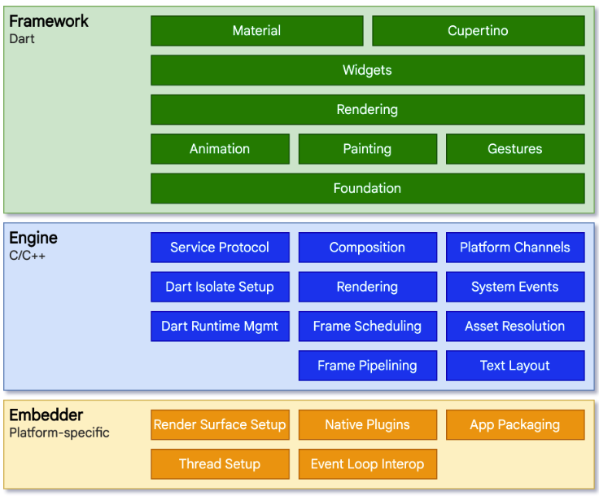

[toc]


# 跨端技术分析

## 原生绘制

直接调用系统提供的SDK API开发的应用程序，是某一平台（Android、IOS）特有的应用

优点：

+ 可访问平台全部功能（GPS、摄像头）；
+ 速度快、性能高、可以实现复杂动画及绘制，整体用户体验好；

缺点：

+ 平台特定，开发成本高， 比如IOS和Android要维护两套代码，人力成本随之变大；
+ 内容固定，动态化弱，大多数情况下，有新功能更新时只能发版；

## 跨平台开发

一套代码，各平台通用

### web绘制

也叫 HTMLybrid App

纯前端开发，原生应用作为壳子工程提供内置浏览器组件，核心业务通过h5实现，通过webView渲染；

调用原生的能力需要有协议的规定， 也就是 JsBridge， 才能使用到原生的能力

### 原生绘制

类前端基础技术栈开发，绘制和渲染是原生绘制，比如React Native、Weex，主要原理是利用虚拟DOM映射为原生控件

优点

1. 采用 Web 开发技术栈，社区庞大、上手快、开发成本相对较低。
2. 原生渲染，性能相比 H5 提高很多。
3. 动态化较好，支持热更新。

不足：

1. 渲染时需要 JavaScript 和原生之间通信，在有些场景如拖动可能会因为通信频繁导致卡顿。
2. JavaScript 为脚本语言，执行时需要解释执行 （这种执行方式通常称为 JIT，即 Just In Time，指在执行时实时生成机器码），执行效率和编译类语言（编译类语言的执行方式为 AOT ，即 Ahead Of Time，指在代码执行前已经将源码进行了预处理，这种预处理通常情况下是将源码编译为机器码或某种中间码）仍有差距。
3. 由于渲染依赖原生控件，不同平台的控件需要单独维护

### 自绘引擎

自带渲染引擎，原生只提供了画布，在高性能的前提下能多端保持高度一致的呈现效果，flutter

优点如下：

1. 性能高；由于自绘引擎是直接调用系统API来绘制UI，所以性能和原生控件接近。
2. 灵活、组件库易维护、UI外观保真度和一致性高；由于UI渲染不依赖原生控件，也就不需要根据不同平台的控件单独维护一套组件库，所以代码容易维护。

# Flutter

为什么使用flutter

+ 原生架构效率提升有限
+ 人力紧张
+ 多端，多技术栈的效率问题
+ 需要保障产品的良好性能，交互视觉
+ 需要覆盖多业务形态：Android， IOS， 桌面端
+ 需要成熟度高、快速上手

缺点：

动态缺失

## 架构



+ Framework: 用dart编程， 基础组件库
+ Engine: 绘制
+ Embedder: 兼容不同平台

## 资料

《Flutter实战·第二版》(https://book.flutterchina.club/)https://book.flutterchina.club/chapter2/first_flutter_app.html

https://flutter.cn/docs/development/ui/layout

## 安装

+ Android studio  注意java的path_room, 注意zsh的配置
+ xcode
+ flutter：Flutter Widget Snippets 插件
+ [cocoapods](https://cocoapods.org/)(pod) <= 12.x
+ vscode
  + 安装flutter插件：vscode前三个
  + 查看-命令- **File>New Flutter Project** 新建flutter
  + 查看-命令- choose flutter select device
  + flutter run
  + 热更新：在命令行输入r
  + 启动，右上角小三角-run without debugger(或者查看-命令-run without debugge)

## widget简介

```JS
// 导入组件库
import 'package:flutter/material.dart';
void main() {
  runApp(
    const Center(
      child: Text(
        'Hello, world!',
        textDirection: TextDirection.ltr,
      ),
    ),
  );
}
```

+ 根组件要放在runApp里作为入口
+ 框架会强制让根 widget 铺满整个屏幕

## 相关快捷键

- 创建widget：
  - 创建StatelessWidget：stless
  - 创建StatefulWidget：stful

# 绘制原理

## UI更新流程

+ 请求帧（schedulerFrame）：当页面需要更新时，请求在下一帧更新UI
+ 处理帧（drawFrame）：帧信号来临，开始更新UI
+ buildScope（更新三棵树）：根据最新的UI配置信息（Widget）更新三棵树
+ 布局（layout）：对UI组件进行布局，确定组件的大小和位置
+ 绘制：：绘制页面元素并渲染到屏幕上，又可以细分为以下几步：
  + 图层合成标志更新（flushCompositingBits）：涉及到图层（Layer）的概念，主要是用于在绘制时，将需要统一变换的图层合到一个图层中
  + 绘制（flushPaint）：绘制组件，最终会生成一个Layer Tree
  + 合成帧（compositeFrame）：将绘制产物交给系统，最终渲染到屏幕上


#  基础开发

## 组件引入

```d
import 'package:soda_bd_flutter_i18n/ui/page/home/page/workbench_page/widgets/commercial_offer/test.dart';

child: Test(),
```

新组件

```DART
import 'dart:ui';
import 'package:flutter/material.dart';

class StrategyDetail extends StatelessWidget {
  const StrategyDetail({ Key? key }) : super(key: key);

  @override
  Widget build(BuildContext context) {
    return const Placeholder();
  }
}
```

## 样式

### 边距

```dart
margin:const EdgeInsets.all(16),
padding: const  EdgeInsets.all(16),
// 或者直接由padding的widget
Padding()
```


### 边框

```dart
decoration: BoxDecoration(
        color: Colors.white,
        borderRadius: BorderRadius.circular(20.0),
        border:Border(
          bottom: BorderSide(
            color: Colors.red,
            width:1.0,
            style: BorderStyle.solid
          )
        ),
        boxShadow: const [
          BoxShadow(
            color: Colors.grey,
            blurRadius: 5,
            spreadRadius: 0.5,
            offset: Offset(1,5),
            blurStyle: BlurStyle.outer
          )
        ]
      ),
```

### 文字

```dart
Text(
		'营销活动营销活动营销活动营销活动营销活动营销活动营销活动营销活动营销活动营销活动营销活动营销活动营销活动营销活动',
		style: TextStyle(
					fontSize: 16,
					fontWeight: FontWeight.w700,
					fontFamily: 'DiDiSans-Pro-Bold',
		),
  // 文字省略号
		maxLines: 2,
		overflow: TextOverflow.ellipsis,
),
```


### 其他

#### 按钮设置

```dart
ElevatedButton(
	onPressed: null,
	child: const Text('查看', style: TextStyle(color:Colors.red)),
	style: ButtonStyle(
			shape: MaterialStateProperty.all<RoundedRectangleBorder>(
						RoundedRectangleBorder(
								borderRadius: BorderRadius.circular(10), // 修改圆角半径为10
						),
			),
	)
)
```

#### 查看调试点击

```
onTap: () {
// 展示达标标准popup
_showBottomSheet(context, '23424');
    debugPrint('我被点击了');
},
```


