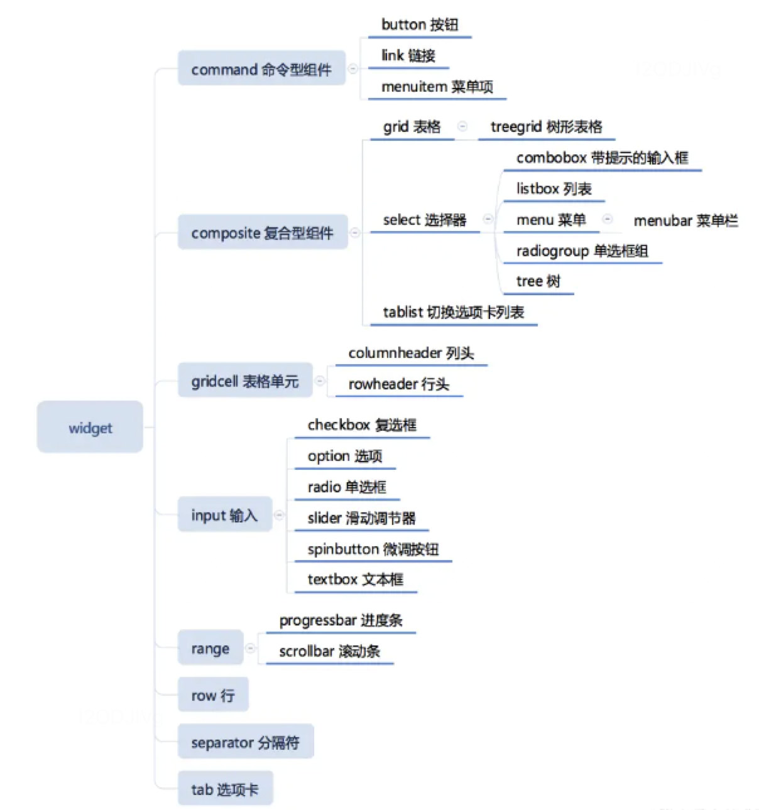

[toc]

# html代码第一行的作用

> HTML 代码的第一行用于声明文档的类型，并且告诉浏览器使用哪种 HTML 的标准来解析页面

# html里的meta属性

meta标签一般放在`head`部分, 用来传达信息

+ 如果设置了 `name`属性，`meta` 元素提供的是文档级别的元数据，应用于整个页面。
+ 如果设置了 `http-equiv`属性，`meta` 元素则是编译指令，提供的信息与类似命名的 HTTP 头部相同。
+ 如果设置了 `charset`属性，`meta` 元素是一个字符集声明，告诉文档使用哪种字符编码。
+ 如果设置了 `itemprop` 属性，`meta` 元素提供用户定义的元数据。

## name

`name`和`content`一起使用，前者表示要表示的元数据的`名称`，后者是元数据的`值`。

```html
// 作者机构名称
<meta name="author" content="aaa@mail.abc.com">
// 描述
<meta name="description" content="这里是网站描述">
// 关键词
<meta name="keyword" content="keyword1,keyword2">
// 视口
<meta name="viewport" content="width=device-width, initial-scale=1.0">
// 爬虫行为：none:搜索引擎将会忽略此网页
<meta name="robots" content="all">
// 指定双核浏览器的渲染方式， 如360浏览器
<meta name="renderer" content="webkit"> //默认webkit内核

```

## http-equiv

`http-equiv`也是和`content`一起使用，前者表示要表示的元数据的`名称`，后者是元数据的`值`。

```html
// 做IE浏览器适配,告诉浏览器，以当前浏览器支持的最新版本来渲染
<meta http-equiv="X-US-Compatible" content="IE=edge"> 
// 声明文档类型和字符集
<meta http-equiv="Content-Type" content="text/html"> 
// a标签自动启动DNS解析
<meta http-equiv="x-dns-prefetch-control" content="on> 

```


# 语义化

html5 新增了语义化标签 header、nav、section、aside、footer、aside、article

- div + css 能解决布局问题，但是可读性不好，语义化读者更容易读懂
- SEO 搜索引擎优化， 机器更容易读懂
- 更好地支持各种终端，例如无障碍阅读和有声小说等

# ARIA

可访问性丰富的互联网应用程序（Accessible Rich Internet Applications）是一组用于提高Web应用程序可访问性的技术规范

+ ARIA属性主要用于通过标记HTML元素来提供有关元素的附加语义信息
+ 便于辅助技术（如屏幕阅读器）更好地理解和处理页面内容， 可将文本和图像内容呈现为语音或盲文输出

## role

- Widget 角色：主要是各种可交互的控件。
- 结构角色：文档的结构。
- 窗体角色：弹出的窗体。




# SVG

```html
<svg xmlns="http://www.w3.org/2000/svg" width="300" height="150">
   <!-- 在这里添加SVG图形元素 -->
</svg>
```

 SVG是一种基于XML的矢量图形格式，用于描述二维图形

+ 可以使用CSS样式表和JavaScript来控制图形
+ SVG图形中的元素可以响应事件，使其适用于交互性的图形。
+ 图形在不同分辨率的屏幕上都能保持清晰

# canvas元素

Canvas 元素是 HTML5 提供的一个用于绘图的标签，它有一个相关的 2D 绘图上下文，通过这个上下文对象，我们可以在 Canvas 上进行各种图形、文本和图像的绘制。

```js
var canvas = document.getElementById('myCanvas');
var context = canvas.getContext('2d');

// 将图像绘制到 Canvas 上。
context.drawImage(image, dx, dy);
// 填充矩形。
context.fillRect(x, y, width, height);
// 在 Canvas 上绘制文本。
context.fillText(text, x, y);
// 填充路径
context.fill();
```

## **图片转换为 Canvas**

```JS
var image = document.getElementById('sourceImage');
var canvas = document.getElementById('canvas');
var context = canvas.getContext('2d');

// 当图片加载完成后执行转换操作
image.onload = function() {
  // 将图片绘制到 canvas 上
  context.drawImage(image, 0, 0, canvas.width, canvas.height);
};
```

## **Canvas 转换为图片**

```js
function canvasToImage() {
    // 获取 canvas 元素和上下文
    var canvas = document.getElementById('canvas');
    var context = canvas.getContext('2d');

    // 创建新的图片对象
    var image = new Image();

    // 将 canvas 上的内容绘制到新的图片对象上
    image.src = canvas.toDataURL('image/png');

    // 创建一个新的窗口显示生成的图片
    var newWindow = window.open();
    newWindow.document.write('');
  }
```

# 图片

## 图片格式

+ JPEG

  ```
  特点： 无损压缩，适用于照片和图像。
  优势： 文件相对较小，保留较好的图像质量。
  不足： 不支持透明度。
  ```

+ **PNG**

  ```
  特点： 无损压缩，支持透明度。
  优势： 适用于图标、图形和需要透明背景的图像。
  不足： 文件相对较大，不适合存储照片。
  ```

+ GIF

  ```
  特点： 无损压缩，支持透明度，支持简单动画。
  优势： 适用于简单的动画和图形。
  不足： 色彩表受限，不适用于存储照片。
  ```

+ WebP

  ```
  特点： 有损和无损压缩，支持透明度，提供更小的文件大小。
  优势： 通常比 JPEG 和 PNG 文件更小，保持相对较好的图像质量。
  不足： 在一些老旧的浏览器中支持较差。
  ```

+ SVG

  ```
  特点： 矢量图形格式，可无限缩放而不失真。
  优势： 适用于图标、图形，支持交互和动画。
  不足： 不适用于存储复杂的位图图像。
  ```

  

# 块级元素和内联元素

块级元素diaplay:block/table独占一行：div、h1、table、ul、ol、p

内联元素diaplay:inline/inline-block: span、input、img、button等
