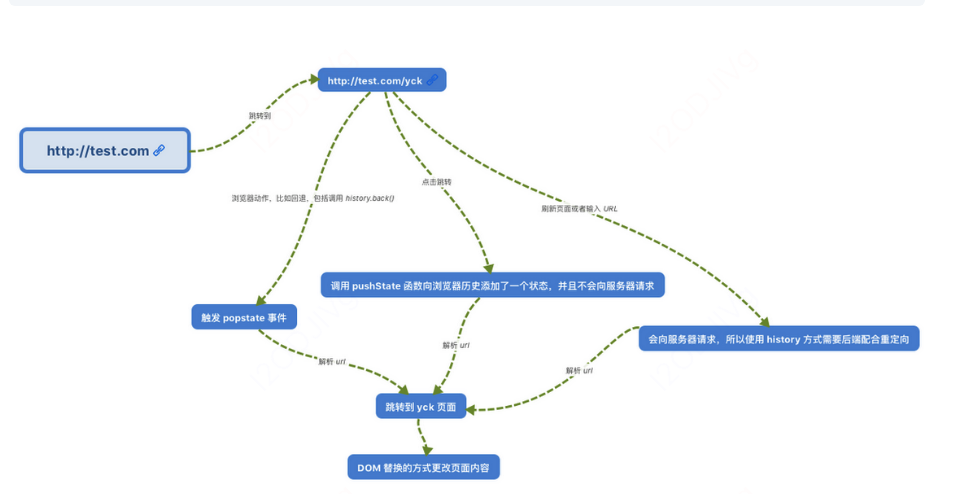

[toc]
# 1.React的适用场景

## 单页面与多页面的优缺点比较

单页面

指只有一个主页面的应用，浏览器一开始要加载所有必须的 html, js, css。所有的页面内容都包含在这个所谓的主页面中。但在写的时候，还是会分开写（页面片段），然后在交互的时候由路由程序动态载入，单页面的页面跳转，仅刷新局部资源。多应用于pc端。

单页面的优点：
+ 用户体验好，快，内容的改变不需要重新加载整个页面，基于这一点服务端渲染对服务器压力较小
+ 前后端分离
+ 页面效果会比较炫酷（比如切换页面内容时的专场动画）

单页面的缺点
+ 不利于seo
+ 导航不可用，如果一定要导航需要自行实现前进、后退。（由于是单页面不能用浏览器的前进后退功能，所以需要自己建立堆栈管理）
+ 初次加载时耗时多
+ 页面复杂度提高很多

## MVC

+ 视图（View）：用户界面。
+ 控制器（Controller）：业务逻辑
+ 模型（Model）：数据保存


+ View 传送指令到 Controller
+ Controller 完成业务逻辑后，要求 Model 改变状态
+ Model 将新的数据发送到 View，用户得到反馈

## MVP


+ 各部分之间的通信，都是双向的。
+ View 与 Model 不发生联系，都通过 Presenter 传递。
+ View 非常薄，不部署任何业务逻辑，称为"被动视图"（Passive View），即没有任何主动性，而 Presenter非常厚，所有逻辑都部署在那里。

## MVVM


+ 基本与MVP相同，唯一的区别是，它采用双向绑定（data-binding）：View的变动，自动反映在 ViewModel，反之亦然,react需要使用事件用onchange,setstate来改变数据

## MVC和MVVM的区别

+ Model用于封装和应用程序的业务逻辑相关的数据以及对数据的处理方法；
+ View作为视图层，主要负责数据的展示；
+ Controller定义用户界面对用户输入的响应方式，它连接模型和视图，用于控制应用程序的流程，处理用户的行为和数据上的改变。

> MVC将响应机制封装在controller对象中，当用户和你的应用产生交互时，控制器中的事件触发器就开始工作了。
> MVVM把View和Model的同步逻辑自动化了。以前Controller负责的View和Model同步不再手动地进行操作，而是交给框架所提供的数据绑定功能进行负责，只需要告诉它View显示的数据对应的是Model哪一部分即可。也就是双向数据绑定，就是View的变化能实时让Model发生变化，而Model的变化也能实时更新到View。

## React与Vue区别

共同点

```
1.都是组件化
2.都是数据驱动视图
3.都是用vdom去驱动dom
```
区别
+ 1.react使用jsx,拥抱js,vue更贴近html,使用模板
+ 2.react函数式编程，每次修改都是通过setState, vue声明式编程,data-nn=
```js
//react
this.setState({  
  message: this.state.message.split('').reverse().join('')  
});
//vue
this.message = this.message.split('').reverse().join(''); 
```
+ 3.vue初学者友好，react一些操作都要自己操作，比如SCU
+ 4.大型应用需要用react,库44.8KB 几乎是vue的两倍
+ 同时适用于Web端和原生APP的框架，请选择React，React Native是一个使用Javascript构建移动端原生应用程序（iOS，Android）的库。 它与React.js相同，只是不使用Web组件，而是使用原生组件。
+ react的生态更好
+ react更好的可测试性
# 2.基本使用

## JSX

### 变量

```js
//变量
{this.state.data}
//style
style={{width:30}}
className=''
//组件
<List datas={this.state.data}/>
```
### 判断与渲染

```js
1.if...else
2. ?  :
3. && 与 ||
```

```js
map
key,必填，不能是index和random
```
### JSX的本质

```
（可以答出通过React.createElement编译为Vdom,再通过patch去渲染。React.createElement的参数形式）
```

JSX 是JavaScript XML 的简写
+ 实质是编译为React.createElement(也就是h函数)，返回一个虚拟节点
+ 第一个参数，可以是组件（首字母必须大写），也可以是html的tag（小写）
+ 第三个参数可以是数组或参数

```js
//react.createElement('html的tag',属性（没有则为null）,child1,child2,chil3...)

const imgElem = <div>
    <p>我的头像</p>
    
    
</div>

var imgElem = React.createElement("div", null, ,React.createElement("p", null, "\u6211\u7684\u5934\u50CF"),
React.createElement("img", {
  src: "xxxx.png"
}), 
React.createElement("img", {
  src: (void 0).state.imgUrl
}));
```


```js
// react.createElement(组件名,属性（没有则为null）,child1,child2,chil3...)
var componentElem = React.createElement("div", null, React.createElement(List, null));
```


```js
//react.createElement('html的tag',属性（没有则为null）,[child1,child2,chil3])

const componentElem =<ul>
      array.map((val)=>{
        <li key={val}>hello</li>
        })
      </ul>

var componentElem = React.createElement("ul", null, "array.map((val)=>", React.createElement("li", {
  key: val
}, "hello"), ")");
```
### 优点：防止注入攻击

```js
const title = response.potentiallyMaliciousInput;
// 直接使用是安全的：
const element = <h1>{title}</h1>;
```
React DOM 在渲染所有输入内容之前，默认会进行转义。它可以确保在你的应用中，永远不会注入那些并非自己明确编写的内容。所有的内容在渲染之前都被转换成了字符串。这样可以有效地防止 XSS（cross-site-scripting, 跨站脚本）攻击。
## setState

### 不可变值

意思就是在setstate之前，不能把原有的state的值修改掉

```js
// 第一，state 要在构造函数中定义
this.state = {
    count: 0
}
 // 第二，不要直接修改 state ，使用不可变值 
this.state.count++ // 错误,在setState之前已经把state的值改变了
this.setState({
  count: this.state.count  
})
```
注意，不能直接对 this.state.list 进行 push pop splice等，这样会把原list和新list同时都进行了修改，如果需要进行复杂操作，可以把list先通过 this.state.list5.slice()拷贝一份，操作后再setState
```js
 // 拷贝再操作
const list5Copy = this.state.list5.slice()
list5Copy.splice(2, 0, 'a') // 中间插入/删除

this.setState({
     list1: this.state.list1.concat(100), // 追加
     list2: [...this.state.list2, 100], // 追加
     list3: this.state.list3.slice(0, 3), // 截取
     list4: this.state.list4.filter(item => item > 100), // 筛选
     list5: list5Copy // 其他操作
 })
```

```js
//对象
this.setState({
     obj1: Object.assign({}, this.state.obj1, {a: 100}),
     obj2: {...this.state.obj2, a: 100}
 })
```

### 可能是异步更新

一般是异步，只有setTimeout和自定义事件里是同步
```js
直接使用是异步，获取不到最新state
在setState后的箭头函数，
自定义函数，
setTimeout里可以同步获取
```

```js
this.setState({ count: this.state.count + 1 })
console.log('1', this.state.count) // 0
```

```js
setTimeout(() => {
    this.setState({ count: this.state.count + 1 })
    console.log('4', this.state.count) // 3
})
```
### 可能会被合并

+ 对象会合并
+ 函数不会合并

```js
// 传入对象，会被合并（类似 Object.assign ）。执行结果只一次 +1
this.setState({
    count: this.state.count + 1
})
this.setState({
    count: this.state.count + 1
})
this.setState({
    count: this.state.count + 1
})
```

```js
// 传入函数，不会被合并。执行结果是 +3
this.setState((prevState, props) => {
    return {
        count: prevState.count + 1
    }
})
this.setState((prevState, props) => {
    return {
        count: prevState.count + 1
    }
})
this.setState((prevState, props) => {
    return {
        count: prevState.count + 1
    }
})
}
```
### setState 什么时候是同步的，什么时候是异步的？

```
总结：setState本身不是由异步代码写的，还是同步代码，只不过它是通过isBatchingUpdates判断是否同步更新，如果这个值为false,那么同步更新，如果为true，就先存入到dirtycomponents中去，而batchUpdates会更改isBatchingUpdates的值，当在处理通过react引发的事件处理的情况下，batchUpdates改变isBatchingUpdates值为true,里边执行的setTimeout导致的改变存入了dirtyComponents,函数执行结束后isBatchingUpdates值为false,同步更新，函数内部取不到更新的值，其它情况比如自定义事件，setTimeout这些就可以同步更新
```

在React中，如果是由React引发的事件处理（比如通过onClick引发的事件处理），调用setState不会**同步更新**this.state，除此之外的setState调用会同步执行this.state 。（绕过React通过addEventListener直接添加的事件处理函数，通过setTimeout/setInterval产生的异步调用。）

setState的“异步”并**不是说内部由异步代码实现**，其实本身执行的过程和代码都是同步的，只是合成事件和钩子函数的调用顺序在更新之前，导致在合成事件和钩子函数中没法立马拿到更新后的值，形式了所谓的“异步”，当然可以通过第二个参数 setState(partialState, callback) 中的callback拿到更新后的结果。


**如何处于isBatchingUpdates为true**

+ 是在“管理”入口命中的
+ 比如生命周期中函数，React中注册的事件

```js
isBatchingUpdates 默认值为 false，当 react 自身的事件处理函数或 react 生命周期触发时，isBatchingUpdates 会被赋值为 true，当更新完成时又会被复原为 false。
```
**如何处于isBatchingUpdates为false**

+ setTimeout,setTimeInterval
+ async
+ 自定义DOM事件

### setState()输出例子

```js
class Example extends React.Component {
  constructor() {
    super();
    this.state = {
      val: 0
    };
  }
  
  componentDidMount() {
    this.setState({val: this.state.val + 1});
    console.log(this.state.val);    // 第 1 次 log

    this.setState({val: this.state.val + 1});
    console.log(this.state.val);    // 第 2 次 log

    setTimeout(() => {
      this.setState({val: this.state.val + 1});
      console.log(this.state.val);  // 第 3 次 log

      this.setState({val: this.state.val + 1});
      console.log(this.state.val);  // 第 4 次 log
    }, 0);
  }

  render() {
    return null;
  }
};

```
结果 0，0，3，4

解析:注意合并更新了一次的
```
1、第一次和第二次都是在 react 自身生命周期内，触发时isBatchingUpdates 为 true，所以并不会直接执行更新 state，而是加入了 dirtyComponents，所以打印时获取的都是更新前的状态 0。

2、两次 setState 时，获取到 this.state.val 都是 0，所以执行时都是将 0 设置成 1，在 react 内部会被合并掉，只执行一次。设置完成后 state.val 值为 1。

3、setTimeout 中的代码，触发时 isBatchingUpdates 为 false，所以能够直接进行更新，所以连着输出 2，3。

输出： 0 0 2 3
```

# 3.基本组件

## 组件类型

### 函数/无状态/展示组件

+ 输入props,输出JSX，没有state,没有生命周期，没有实例，没有this（项目里验证路由，占位）

```
function List(){
    const {list} =this.props
    return <h2>h</h2>
}
```

### 类/有状态组件

可以通过setState改变状态
### 受控组件

在组件的状态属性中维护状态
+ input，textarea用的是value,多选用的是checked
+ e.target.value
+ label用{/* 用 htmlFor 代替 for */}

```js
// 受控组件（非受控组件，后面再讲）
return <div>
    <p>{this.state.name}</p>
    <label htmlFor="inputName">姓名：</label>
    <input id="inputName" value={this.state.name} onChange={this.onInputChange}/>
 </div>
```

```js
// 不能用<textarea>{this.state.data}</textarea>
<textarea value={this.state.info} onChange={this.onTextareaChange}/>
```
+ 能用受控组件就用受控组件，它符合react设计原则，数据驱动视图
+ 涉及必须的DOM操作，用非受控组件，主要应用有文件上传，富文本，因为涉及到了DOM交互
+ 使用方法，新建ref元素，元素绑定，获取
+ defaultValue,不能用value，它只是初始的时候借用了this.state，实际数据放在元素本身上


```js
constructor(props) {
    super(props)
    this.state = {
    }
    this.nameInputRef = React.createRef() // 创建 ref
}
...
{/* 使用 defaultValue 而不是 value ，使用 ref */}
<input defaultValue={this.state.name} ref={this.nameInputRef}/>
...
alertName = () => {
    const elem = this.nameInputRef.current // 通过 ref 获取 DOM 节点
    alert(elem.value) // 不是 this.state.name
}
```
file文件上传

```js
alertFile = () => {
    const elem = this.fileInputRef.current // 通过 ref 获取 DOM 节点
    alert(elem.files[0].name)
}
```

### 非受控组件

在非受控组件中，Ref用于直接从DOM访问表单值。不受父组件props的控制。
+ ref={this.input} （也可以是this.my...自己的名称）
+ this.input = React.createRef() （constructor里,创建）
+ 读取this.input.current.value
```js
this.handleSubmit = this.handleSubmit.bind(this);
this.input = React.createRef() // 创建 ref
 handleSubmit(event) {
      alert('A name was submitted: ' + this.input.current.value);
      event.preventDefault();
    }
...
 <Form.Control type="text" placeholder="Todo Item" ref={this.input}/>
 <Button variant="primary" onClick={this.handleSubmit} type="submit">Add</Button>
```
### 容器组件

容器组件是处理获取数据、订阅 redux 存储等的组件。它们包含展示组件和其他容器组件
## 组件之间通信

### props通信方式

+ protoType类型限制
+ 父组件向子组件通讯: 父组件可以向子组件通过传 props 的方式，向子组件进行通讯
子组件向父组件通讯:
+ props+回调的方式,父组件向子组件传递props进行通讯，此props为作用域为父组件自身的函数，子组件调用该函数，将子组件想要传递的信息，作为参数，传递到父组件的作用域中

### 兄弟组件通信

找到这两个兄弟节点共同的父节点,结合上面两种方式由父节点转发信息进行通信
#### 子组件为何不可以修改父组件传递的 Prop

原因很简单，一个父组件下不只有你一个子组件。
同样，使用这份 prop 数据的也不只有你一个子组件。
如果每个子组件都能修改 prop 的话，将会导致修改数据的源头不止一处。

所以我们需要将修改数据的源头统一为父组件，子组件像要改 prop 只能委托父组件帮它。从而保证数据修改源唯一

### 跨层级通信: Context上下文

（应用场景，核心API）
+ 公共信息如何让传递给每个组件，如语言，主题
+ props太繁琐
+ redux太小题大做
+ 比如三层组件，APP最外层state维护主题颜色，第二层组件 <Toolbar />，第三层<ThemedButton />
+ <ThemeLink />，需要定义一个静态变量，再应用

```js
//APP最外层组件
// 创建 Context 填入默认值（任何一个 js 变量）
const ThemeContext = React.createContext('light')

class App extends React.Component {
    constructor(props) {
        super(props)
        this.state = {
            theme: 'light'
        }
    }
    render() {
        return <ThemeContext.Provider value={this.state.theme}>
            <Toolbar />
            <hr/>
            <button onClick={this.changeTheme}>change theme</button>
        </ThemeContext.Provider>
    }
    changeTheme = () => {
        this.setState({
            theme: this.state.theme === 'light' ? 'dark' : 'light'
        })
    }
}
```

```js
//<Toolbar />不进行操作
// 中间的组件再也不必指明往下传递 theme 了。
function Toolbar(props) {
    return (
        <div>
            <ThemedButton />
            <ThemeLink />
        </div>
    )
}
```
class组件使用context

```js
// 底层组件 - class 组件
class ThemedButton extends React.Component {
    // 指定 contextType 读取当前的 theme context。
    // static contextType = ThemeContext // 也可以用 ThemedButton.contextType = ThemeContext
    render() {
        const theme = this.context // React 会往上找到最近的 theme Provider，然后使用它的值。
        return <div>
            <p>button's theme is {theme}</p>
        </div>
    }
}
ThemedButton.contextType = ThemeContext // 指定 contextType 读取当前的 theme context。
```
函数组件没有this,使用方法

```js
// 底层组件 - 函数是组件
function ThemeLink (props) {
    // const theme = this.context 
    // 会报错。函数式组件没有实例，即没有 this
    // 函数式组件可以使用 Consumer
    return <ThemeContext.Consumer>
        { value => <p>link's theme is {value}</p> }
    </ThemeContext.Consumer>
}
```
+ 核心API

```js
//定义
const Atext = React.createContext('moren')
<Atext.Provider>...</Atext.Provider>
//使用
static B=Atext
const value=B.context
...
<Atext.Consumer>...</Atext.Consumer>
```
### Portals传送门

+ 默认是层级嵌套，父-->子
+ 如何把组件渲染到父组件外

```js
应用：
需要fixed,因此需要逃离父组件挂载到body上
oveflow:hidden
父组件z-index过小
```

```js
// // 正常渲染
// return <div className="modal">
//     {this.props.children} {/* vue slot */}
// </div>

// 使用 Portals 渲染到 body 上。
// fixed 元素要放在 body 上，有更好的浏览器兼容性。
return ReactDOM.createPortal(
    <div className="modal">{this.props.children}</div>,
    document.body // DOM 节点
)
```

### 发布订阅模式:

发布者发布事件，订阅者监听事件并做出反应,我们可以通过引入event模块进行通信
### 全局状态管理工具:

借助Redux或者Mobx等全局状态管理工具进行通信
## 组件生命周期

生命周期分为三个阶段,分别是挂载阶段、更新阶段、卸载阶段


### Initialization 初始化

constructor()，React借用class类的constructor充当初始化钩子。
+ 接收父组件传入的参数super(props)
+ 初始化组件的state以及事件处理方法

```js
React规定constructor有三个参数，分别是props、context和updater。

+ props是属性，它是不可变的。
+ context是全局上下文。
+ updater是包含一些更新方法的对象，this.setState最终调用的是this.updater.enqueueSetState方法，this.forceUpdate最终调用的是this.updater.enqueueForceUpdate方法，所以这些API更多是React内部使用，暴露出来是以备开发者不时之需。
```

### Mounting 挂载

componentWillMount() 和 componentDidMount()，只会在页面第一次挂载的时候执行，state变化时，不会重新执行

+ componentWillMount()
```
componentWillMount() 是组件挂载到DOM之前的生命周期钩子。
+ 在这个阶段调用this.setState不会引起额外的render处理
+ 此阶段只能获取数据，不能获取真实的dom
+ 可以在服务端被调用用于服务端渲染，唯一一个可以同步修改state的地方

componentWillMount和挂载是同步执行的，意味着执行完这个钩子，立即挂载。而向服务器请求数据是异步执行的。所以无论请求怎么快，都要排在同步任务之后再处理
```


+ render() : 页面挂载；

```
+ 千万不要在render生命周期钩子里调用this.setState，因为this.setState会引发render，这下就没完没了了，render并没有完成挂载操作，而是进行构建抽象UI的工作
+ 唯一一个必须写的部分，其它生命周期函数都可以省略
+ 只是使用state和props构建UI,不负责实际的渲染
```
+ componentDidMount() : 
```
+ 在组件即将被挂载到页面的时刻自动执行，只能执行一次
+ 用于发起请求和dom操作
```

### Updation 组件更新

```js
//props变化的更新
componentWillReceiveProps()==>shouldComponentUpdate()
==>componentWillUpdate()
==>render()==>componentDidUpdate()
```
```js
//state变化的更新
shouldComponentUpdate()==>componentWillUpdate()
==>render()==>componentDidUpdate()
```
+ componentWillReceiveProps(nextProps) : props独有的生命周期，执行条件如下：

```
只能由props引起
1.组件要从父组件接收参数；
2.只要父组件的render()被执行了，子组件的该生命周期就会执行；
3.如果这个组件第一次存在于父组件中，不会执行；
4.如果这个组件之前已经存在于父组件中，才会执行；
```
+ shouldComponentUpdate(nextProps,nextState) : 
```
受到props和state的影响，该生命周期要求返回一个bool类型的结果，如果返回true组件正常更新，如果返回false组件将不会更新；
```

```
如果开发者调用this.forceUpdate强制更新，React组件会无视这个钩子。
```

```
PureComponent基类，它与Component基类的区别是PureComponent自动实现了一个shouldComponentUpdate生命周期钩子。但只是浅层比较。
```


+ componentWillUpdate(nextProps,nextState) : 
```
组件被更新之前执行，如果shouldComponentUpdate()返回false，将不会被被执行；
```


+ componentDidUpdate() : 组件更新完成之后执行；

### Unmounting 组件卸载

```js
componentWillUnmount() : 当组件即将被从页面中剔除的时候，会被执行；
组件中用到的事件监听器、订阅器、定时器都要在这里销毁。

componentDidMount() {
    document.addEventListener('click', () => {});
}
```

### React的请求应该放在哪个生命周期中?

componentDidmount,
如果有特殊需求需要提前请求,也可以在特殊情况下在constructor中请求:

+ 不在componentWillMount

```
1.js请求异步，不会等待请求完成返回结果再去渲染
2.组件在服务端渲染时，componentWillMount会被调用两次，一次在服务端，一次在客户端，componentDidMount能够保证在任何情况都只被调用一次
其次,在React 16进行React Fiber重写后,componentWillMount可能在一次渲染中多次调用.
3.componentDidMount已经挂载完毕，操作dom是安全的
```
## 组件更新流程

+ setState(newstate)===>dirtycomponent(可能有更新的子组件)
+ props
+ render()生成newVnode
+ patch(vnode,newVnode)

```
patch分为两步
协调算法，diff的js计算
commit:将diff结果渲染为DOM
```
JS单线程，JS与DOM渲染公用一个线程,如果不区分阶段，比如动画，计算与渲染会导致阻塞，可以采用Fiber架构

## 新生命周期


### 修改的原因

React将diff的过程叫做Reconciliation，以前这一过程是一气呵成的，Fiber机制把它改成了异步，把任务切成很小的片，每执行一片就把控制权交还给主线程，待主线程忙完手头的活再来执行剩下的任务。挂载和更新之前的生命周期钩子就有可能不执行或者多次执行，它的表现是不可预期的。(高优先级的任务出现打断现有任务导致被执行多次)

### 废弃的生命周期

+ componentWillMount
+ componentWillReceiveProps
+ componentWillUpdate

```
需要UNSAFE_componentWillMount,UNSAFE_componentWillReceiveProps和UNSAFE_componentWillUpdate方法兼容
```
### static getDerivedStateFromProps(props, state)

+ 是一个**静态方法生命周期钩子**，定义的时候得在方法前加一个static关键字，或者直接挂载到class类上。根据父组件传来的props按需更新自己的state，这种state叫做衍生state。返回的对象就是要增量更新的state。原本生命周期是被设计成初始化、父组件更新和接收到props才会触发，现在只要渲染就会触发，也就是初始化和更新阶段都会触发。

> 实例方法和静态方法:
> 实例方法，挂载在this上或者挂载在prototype上，class类不能直接访问该方法，使用new关键字实例化之后，实例可以访问该方法。
> 静态方法，直接挂载在class类上，或者使用新的关键字static，实例无法直接访问该方法。

+ 为什么要设置为静态方法
> 开发者就访问不到this也就是实例了，也就不能在里面调用实例方法或者setsState了

### getSnapshotBeforeUpdate(prevProps, prevState)

组件==即将挂载==时调用，注意，是即将挂载。

> 有一些状态，比如网页滚动位置，不需要它持久化，只需要在组件更新以后能够恢复原来的位置即可。getSnapshotBeforeUpdate生命周期钩子返回的值会被componentDidUpdate的第三个参数接收，我们可以利用这个通道保存一些不需要持久化的状态，用完即可舍弃。
> 很显然，它是用来取代componentWillUpdate生命周期钩子的。

### componentDidCatch(error, info)

```
主要用来捕获错误并进行相应处理
定制一个只有componentDidCatch生命周期钩子的ErrorBoundary组件，它只做一件事：如果捕获到错误，则显示错误提示，如果没有捕获到错误，则显示子组件。
```

```js
import React, { Component } from 'react';

class ErrorBoundary extends Component {
    state = { hasError: false };

    render() {
        if (this.state.hasError) {
            return <h1>Something went wrong.</h1>;
        }
        return this.props.children;
    }

    componentDidCatch(error, info) {
        this.setState({ hasError: true });
    }
}

export default ErrorBoundary;
```

```js
import React from 'react';
import ErrorBoundary from './ErrorBoundary';
import MyWidget from './MyWidget';

const App = () => {
    return (
        <ErrorBoundary>
            <MyWidget />
        </ErrorBoundary>
    );
}

export default App;
```

# 4.事件

## bind(this)

this的默认值为undefined，如果使用bind(this)改变指向，会出错，不能设置this.setState
```js
// this - 使用 bind
 constructor(props) {
        super(props)
        this.state = {
        }
        // 修改方法的 this 指向
        this.clickHandler1 = this.clickHandler1.bind(this)
    }
    
clickHandler1() {
    // console.log('this....', this) // this 默认是 undefined
    this.setState({
        name: 'lisi'
    })
}
return <p onClick={this.clickHandler1}>
        {this.state.name}
    </p>
```
另一种写法

```js
//不推荐，因为这种每次点击都要执行一次绑定，上边的方法绑定一次即可
return <p onClick={this.clickHandler1.bind(this)}>
         {this.state.name}
    </p>
```
推荐，静态写法，箭头函数，this指向当前实例

```js
// 静态方法，this 指向当前实例
clickHandler2 = () => {
    this.setState({
        name: 'lisi'
    })
}
```
## Event

```js
 return <a href="https://imooc.com/" onClick={this.clickHandler3}>
 click me
 </a>
```
没有传入参数，则默认有一个event，但它不是原生event，而是合成event
+ event 是 SyntheticEvent ，模拟出来 DOM 事件所有能力，跨端跨浏览器兼容
+ event.nativeEvent 是原生事件对象
+ 所有的事件，都被挂载到 document 上，而不是当前元素
+ 和 DOM 事件不一样，和 Vue 事件也不一样
```js
clickHandler3 = (event) => {
    event.preventDefault() // 阻止默认行为
    event.stopPropagation() // 阻止冒泡
    console.log('target', event.target) // 指向当前元素，即当前元素触发
    console.log('current target', event.currentTarget) // 指向当前元素，假象！！！

    // 注意，event 其实是 React 封装的。可以看 __proto__.constructor 是 SyntheticEvent 组合事件
    console.log('event', event) // 不是原生的 Event ，原生的 MouseEvent,也就是event.nativeEvent
    console.log('event.__proto__.constructor', event.__proto__.constructor)

    // 原生 event 如下。其 __proto__.constructor 是 MouseEvent
    console.log('nativeEvent', event.nativeEvent)
    console.log('nativeEvent target', event.nativeEvent.target)  // 指向当前元素，即当前元素触发
    console.log('nativeEvent current target', event.nativeEvent.currentTarget) // 指向 document ！！！
}
```
+ 传自定义参数（默认可以传event）

```js
return <ul>{this.state.list.map((item, index) => {
    return <li key={item.id} onClick={this.clickHandler4.bind(this, item.id, item.title)}>
        index {index}; title {item.title}
    </li>
})}</ul>

// 传递参数
clickHandler4(id, title, event) {
    console.log(id, title)
    console.log('event', event) // 最后追加一个参数，即可接收 event
}
```

+ div触发事件，冒泡到document
+ document合成合成事件
+ 判断target所在组件，绑定关系，发放事件

```js
react会将jsx上所有节点的onClick事件绑定到document上，然后为渲染出来的DOM添加一个空函数noop作为点击事件的处理函数。在document监听到点击事件的时候，会去fiber树上搜集之前jsx上添加的真正的处理函数，并存入数组，依次执行。
```

### 为什么要用合成事件机制

+ 更好的兼容平台（自己实现了事件机制），跨端跨浏览器
+ 全挂载到dom上，减少内存消耗，避免频繁的解绑（比如ul父元素代理）
+ 方便事件的统一管理
# 5.性能优化

```
1.减少bind(this)的使用
2.及时销毁自定义事件
3.大组件懒加载
4.SCU
5.webpack层面优化
6.图片懒加载，前端通用性能优化
7.使用SSR
```
## SCU：shouldComponentUpdata

要与不可变值结合
+ 默认为true
```js
shoulComponentUpdata(nextProps,nextState){
    if(nextProps.count!==nextState.count){
        return true //可以渲染
    }else{
        return false //不重复渲染
    }
}
```
如何优化

+ 默认父组件更新，子组件无条件更新
+ SCU默认返回true
```js
<Tabbar>
  <Input/>
  <Footer/>
</Tabbar>
```
Input组件发生变化，Tarbar组件发生变化，此时没有设置Footer组件的SCU，会自动也实现更新，实际上不是必须更新的
### 为什么react不把SCU直接纳入react自动执行

```
1.因为也可以不进行性能优化
2.setState时候已经违反了不可变值规则，使得前后的state中数组对象已经完全一样了，地址一样，那么此时如果还采取了深度比较，就不会进行更新，导致了bug
```
其实不建议深度，深度比较要递归，性能不好
```js
// 增加 shouldComponentUpdate
shouldComponentUpdate(nextProps, nextState) {
    // _.isEqual 做对象或者数组的深度比较（一次性递归到底）
    if (_.isEqual(nextProps.list, this.props.list)) {
        // 相等，则不重复渲染
        return false
    }
    return true // 不相等，则渲染
}
}
```
### immutable.js

彻底拥抱immutable
+ 基于共享数据，但不是深拷贝
+ 学习成本
## 异步加载组件(性能优化)

+ import()
+ React.Lazy懒加载
+ React.Suspense 加载前显示

```js
const ContextDemo = React.lazy(() => import('./ContextDemo'))

class App extends React.Component {
    constructor(props) {
        super(props)
    }
    render() {
        return <div>
            <p>引入一个动态组件</p>
            <hr />
            <React.Suspense fallback={<div>Loading...</div>}>
                <ContextDemo/>
            </React.Suspense>
        </div>

        // 1. 强制刷新，可看到 loading （看不到就限制一下 chrome 网速）
        // 2. 看 network 的 js 加载
    }
}
```
首先import加载其它组件，然后用React.lazy包装起来，<React.Suspense fallback={<div>Loading...</div>}> ，fallback为完全加载之前项显示的任何内容
# 6.路由react-router

## 前端路由

```
<Router/>
<Link/>
```
hash模式（默认）

```
http://abc.com/#/user/10
//<HashRouter>
```

```
www.test.com/##/ 就是 Hash URL，当 ## 后面的哈希值发生变化时，不会向服务器请求数据，可以通过 hashchange 事件来监听到 URL 的变化，从而进行跳转页面。
```

H5 history模式，需要后端支持

```
http://abc.com/user/10
//<BrowserRouter>
```

+ 动态路由

```js
<Router path="/path:id" component={}/>
```
获取

```js
import {useParams} from 'react-router-dom'
...
const {id}=useParams
```
原理

DOM渲染完成之后，给window添加onhashchange事件监听页面hash的变化，并且在state属性中添加了route属性，代表当前页面的路由。

+ 当点击链接，页面hash改变时，触发绑定在 window 上的 onhashchange 事件；
+ 在 onhashchange 事件中改变组件的 state中的 route 属性，react组件的state属性改变时，自动重新渲染页面；
+ 页面随着 state 中的route属性改变，自动根据不同的hash给Child变量赋值不同的组件，进行渲染。

## <Link> 标签和 <a> 标签有什么区别

Link做了3件事情：
+ 有onclick那就执行onclick
+ click的时候阻止a标签默认事件（这样子点击<a href="/abc">123</a>就不会跳转和刷新页面）
+ 取得跳转href（即是to），用history（前端路由两种方式之一，history & hash）跳转，此时只是链接变了，并没有刷新页面


```
 在一个SPA里点击一个链接按钮后，redux里的数据都丢了。后来才发现，不知道谁写了一个a,没有用Link。相当于重新打开了一个SPA。
```

## 懒加载

```js
import {Lazy,Suspense} from 'react'

const Home = Lazy(()=>import('../routers/home'))

<Router>
  <Suspense fallback={<div>loading</div>}>
     <Switch>
        <Route path="/home" component={Home}>
        ...
     <Switch>
  </Suspense>
<Router>
```
## react-router原理

实现URL与UI界面的同步。其中在react-router中，URL对应Location对象，而UI是由react components来决定的，这样就转变成location与components之间的同步问题


### react-router具体实现

+ 组件层面描述实现过程
> 在react-router中最主要的component是Router RouterContext Link，history库起到了中间桥梁的作用
> 
+ browserHistory进行路由state管理,主要通过sessionStorage

```js
//保存　路由state(router state)
function saveState(key, state) {
  ...
  window.sessionStorage.setItem(createKey(key), JSON.stringify(state));
}
//读取路由state
function readState(key) {
  ...
  json = window.sessionStorage.getItem(createKey(key));
  return JSON.parse(json);
}
```
+ 其中saveState函数传进来的state是个json对象，如：

```
{route: '/about'} ///假设此时的location为'/about',使用的history库 知道如何去监听浏览器地址栏的变化， 并解析这个 URL 转化为 location 对象
```
+ 进行路由匹配，最终渲染对应的组件

```js
const About = React.createClass({/*...*/}) //About 组件
const Inbox = React.createClass({/*...*/}) //Inbox 组件
const Home = React.createClass({/*...*/}) //Home组件
 render() {
    let Child
    switch (this.state.route) {
      case '/about': Child = About; break;
      case '/inbox': Child = Inbox; break;
      default:      Child = Home;
    }

    return (
      <div>
        <h1>App</h1>
        <ul>
          <li><a href="#/about">About</a></li>
          <li><a href="#/inbox">Inbox</a></li>
        </ul>
        <Child/>
      </div>
    )
  }
})

React.render(<App />, document.body)
```

# 7.虚拟DOM

```
1.h函数
2.patch
3.vnode结构
```

```
1.只比较同级，不跨级比较
2.tag不相同，直接删除重建，不深度比较
3.tag与key相同，则认为是相同节点，不深度比较
```
## 虚拟 DOM 到底是什么

```
就是一个普通的 JavaScript 对象，
包含了 tag、props、children 三个属性。
```

```js
<div id="app">
  <p class="text">hello world!!!</p>
</div>
//上面的 HTML 转换为虚拟 DOM 如下：
{
  tag: 'div',
  props: {
    id: 'app'
  },
  chidren: [
    {
      tag: 'p',
      props: {
        className: 'text'
      },
      chidren: [
        'hello world!!!'
      ]
    }
  ]
}
```
+ 原生DOM创建需要满足浏览器各种要求，比如DOM事件
+ 虚拟DOM对比，只更新变化的DOM，不是整个页面全部重新渲染

## h函数（使用h函数转换为虚拟节点）

+ 观察主流的虚拟 DOM 库（snabbdom、virtual-dom），通常都有一个 h 函数，也就是 React 中的 React.createElement，以及 Vue 中的 render 方法中的 createElement，另外 React 是通过 babel 将jsx转换为h函数渲染的形式，而 Vue 是使用 vue-loader 将模版转为 h 函数渲染的形式
+ h 函数接受是三个参数，分别代表是 DOM 元素的标签名、属性、子节点，最终返回一个虚拟 DOM 的对象。

```js
import { createElement } from './createElement'

let oldEle = createElement('div', { class: 'father' }, [
    createElement('h1', { style:'color:red' }, ['son1']),
    createElement('h2', { style:'color:blue' }, ['son2']),
    createElement('h3', { style:'color:red' }, ['son3'])
])
document.body.appendChild(oldEle.render())
```

## 虚拟DOM的渲染

虚拟 DOM 可以渲染到多个平台
+ 浏览器平台render(vdom)

```
1.将虚拟 DOM 渲染成真实DOM的render(vdom)
 (1)判断传入的vdom,如果为字符串或数字，创建真实文本节点，否则创建元素节点
 (2)每个节点添加标签，属性（className要变为class）
（3）遍历子节点
2.插入到对应的根节点。
```

```js
class Component {
  vdom = null // 组件的虚拟DOM表示
  $el  = null // 虚拟DOM生成的真实节点

  state = {
    text: 'Initialize the Component'
  }

  render() {
    const { text } = this.state
    return (
      <div>{ text }</div>
    )
  }
}

function createElement (app, component) {
  const vdom = component.render()
  component.vdom = vdom
  component.$el = render(vdom) // 将虚拟 DOM 转换为真实 DOM
  app.appendChild(component.$el)
}

const app = document.getElementById('app')
const component = new Component
createElement(app, component)
```
## Virtual DOM 真的比操作原生 DOM 快吗？

尤大大答案：
+ **没有任何框架可以比纯手动的优化 DOM 操作更快**，因为框架的 DOM 操作层需要应对任何上层 API 可能产生的操作，它的实现必须是普适的。针对任何一个 benchmark，我都可以写出比任何框架更快的手动优化，但是那有什么意义呢？在构建一个实际应用的时候，你难道为每一个地方都去做手动优化吗？出于**可维护性**的考虑，这显然不可能。框架给你的保证是，你在不需要手动优化的情况下，我依然可以给你提供过得去的性能。
+ React 的基本思维模式是每次有变动就整个重新渲染整个应用。如果没有 Virtual DOM，简单来想就是直接重置 innerHTML。但是React每次知识更新DOM需要变动的地方，而innerHTML则是需要每次全部重新更新所有HTML，纯js的操作开销还是比innerHTML要小

# 8.diff 算法是什么

+ 就是比对新老 VDOM 的变化，然后将变化的部分更新到视图上。对应到代码上，就是一个 diff 函数，返回一个 patches （补丁）。然后使用 patch 方法，将变动渲染到视图中,在真实DOM上操作的

```js
const before  = h('div', {}, 'before text')
const after   = h('div', {}, 'after text')

const patches = diff(before, after)
```

```js
const newVdom = this.render()
const patches = diff(this.vdom, newVdom)
patch(this.$el, patches)
```
## 传统diff算法复杂度为什么为O(n^3)

从一棵树转化为另外一棵树，有很多方式，我们要找到最少的，是一个最小编辑距离的问题，主要有三种操作（leetcode上）


```
删除 删除一个节点，将它的children交给它的父节点
插入 在children中 插入一个节点
修改 修改节点的值
```
由于树是一种递归的数据结构，因此最简单的树的比较算法是递归处理。
```js
//传统diff算法的具体步骤
// 存储比较结果
let result = []
// 比较两棵树
const diffTree = function (beforeTree, afterTree) {
  // 获取较大树的 长度
  let count = Math.max(beforeTree.children.length, afterTree.children.length)
  // 进行循环遍历
  for (let i = 0; i < count; i++) {
    const beforeChildren = beforeTree.children[i]
    const afterChildren = afterTree.children[i]
    // 如果原树没有，新树有，则添加
    if (beforeChildren === undefined) {
      result.push({
        type: 'add',
        element: afterChildren
      })
      // 如果原树有，新树没有，则删除
    } else if (afterChildren === undefined) {
      result.push({
        type: 'remove',
        element: beforeChildren
      })
      // 如果节点名称对应不上，则删除原树节点并添加新树节点
    } else if (beforeChildren.tagName !== afterChildren.tagName) {
      result.push({
        type: 'remove',
        elevation: beforeChildren
      })
      result.push({
        type: 'add',
        element: beforeChildren
      })
      // 如果节点名称一样，但内容改变，则修改原树节点的内容
    } else if (beforeChildren.innerTHML !== afterChildren.innerTHML) {
      // 如果没有其他子节点，则直接改变
      if (beforeChildren.children.length === 0) {
        result.push({
          type: 'changed',
          beforeElement: beforeChildren,
          afterElement: afterChildren,
          html: afterChildren.innerTHML
        });
      } else {
        // 否则进行递归比较
        diffTree(beforeChildren, afterChildren)
      }
    }
  }
  // 最后返回结果
  return result
}
```
循环遍历的方式，树的递归复杂度O(n^2),循环O（n）,复杂度高达O(n^3),n为节点数目

## react的diff优化，复杂度O(n)

三个方面进行了优化

```
tree diff
component diff
element diff
```
+ 树的分层比较


```
进行层级控制，只会对相同颜色框内的节点进行比
较，即同一个父节点下的所有子节点。当发现节点
不存在，则该节点和其子节点都会被删除。这样是
需要遍历一次dom树，就完成了整个dom树的对比
```
+ 组件比较
```
1.如果是同一类型的组件，按照原策略继续比较 虚拟树。
2.如果不是，替换整个组件下的所有子节点。
3.可以使用shouldComponentUpdate() 来判断是否需要进行diff
```
+ 元素diff

```
当节点处于同一层级时，React diff 提供了三种节点操作，分别为：INSERT_MARKUP（插入）、MOVE_EXISTING（移动）和 REMOVE_NODE（删除）。
```
===> 允许开发者对同一层级的同组子节点，添加唯一 key 进行区分

### 为什么要使用key

+ 准确回答描述

```
key是给每个vnode唯一的id，可以更准确，更快速的拿到oldvnode里对应的vnode节点，从而减少不必要的元素重渲染。

+ 更准确：带key就不是就地复用了，在sameNode函数a.key==b.key对比中就可以避免就地复用
+ 更快速：利用key的唯一性生成map对象获取对应节点，速度比遍历方式更快
```
# 9.如何理解fiber

Fiber：重写了react中核心算法——reconciliation(协调)。一种将 recocilation （递归 diff），拆分成无数个小任务的算法；它随时能够停止，恢复。停止恢复的时机取决于当前的一帧（16ms）内，还有没有足够的时间允许计算。
## reconciliation(协调)算法

在操作真正的 DOM 之前，先通过 VDOM 前后对比得出需要更新的部分，再去操作真实的 DOM，减少了浏览器多次操作 DOM 的成本。这一过程，官方起名 reconciliation，可翻译为协调算法
## 卡顿原因

reconciler（现被称为 stack reconciler ）采用自顶向下递归，从根组件或 setState() 后的组件开始，更新整个子树。如果组件树不大不会有问题，但是当组件树越来越大，递归遍历的成本就越高，持续占用主线程，这样主线程上的布局、动画等周期性任务以及交互响应就无法立即得到处理，造成顿卡的视觉效果。
## 工作原理

任务拆分

### 拆什么

原本的协调算法，是对比出所有虚拟DOM的差异，再统一传递进行渲染，但加上虚拟DOM比较过程，Diff其实就是一些计算，是可拆分的
### 怎么拆

以一个 fiber为单位来进行拆分，fiber tree 是根据 VDOM tree 构造出来的，树形结构完全一致，只是包含的信息不同

Fiber 依次通过 return、child 及 sibling 的顺序对 ReactElement 做处理，将之前简单的树结构，变成了基于单链表的树结构，维护了更多的节点关系。


### 执行顺序

主要分为两个阶段（phase）：
+ render / reconciliation (interruptible)

```
自顶向下构建一颗完整的 Fiber Tree， 在 rerender 的过程中，
根据之前生成的树，构建名为 workInProgress 的 Fiber Tree 用于更新操作。
```
+ commit (not interruptible)

react 根据之前生成的 Fiber Tree 开始构建workInProgress Tree。在构建的过程中，以一个 fiber 节点为单位自顶向下对比，如果发现根节点没有发生改变，根据其 child 指针，把 List 节点复制到 workinprogress Tree 中。 每处理完一个 fiber 节点，react 都会检查当前时间片是否够用，如果发现当前时间片不够用了，就是会标记下一个要处理的任务优先级，根据优先级来决定下一个时间片要处理什么任务。

react 通过依次对比 fiber 节点发现 List，Item2，Item3 发生了变化，就会在对应生成的 workInProgress Tree 中打一个 Tag，并且推送到 effect list 中


# 10.redux

## 基本概念

+ dispatch(action)

+ reducer

+ store state:state会返回全新的对象

+ subscribe 订阅,触发通知

+ React 本身只涉及UI层，如果搭建大型应用，必须搭配一个前端框架。

  

Flux 的最大特点，就是数据的"单向流动"。

```js
1.用户访问 View
2.View 发出用户的 Action
3.Dispatcher 收到 Action，要求 Store 进行相应的更新
4.Store 更新后，发出一个"change"事件
5.View 收到"change"事件后，更新页面
```
## redux与flux的区别

Flux 中 Store 是各自为战的，每个 Store 只对对应的 View 负责，每次更新都只通知对应的View：
Redux 中各子 Reducer 都是由根 Reducer 统一管理的，每个子 Reducer 的变化都要经过根 Reducer 的整合：

## react-reducer

+ Provider
+ connect

### react-reducer处理异步事件的原理

延迟事件的派发。

其中的原理：是因为他们用了applymiddleware()包装了store的dispatch方法，拥有可以处理异步的能力。
## 中间件

在 Redux 中，同步的表现就是：Action 发出以后，Reducer 立即算出 State。那么异步的表现就是：Action 发出以后，过一段时间再执行 Reducer。

那怎么才能 Reducer 在异步操作结束后自动执行呢？Redux 引入了中间件 Middleware 的概念。

```js
const store = createStore(
  reducer,
  applyMiddleware(thunk, promise, logger)
);
```


这个方法主要就是把所有的中间件组成一个数组，依次执行。也就是说，任何被发送到 store 的 action 现在都会经过thunk，promise，logger 这几个中间件了。

+ redux-thunk
+ redux-promise
+ redux-saga
一般处理数据，dispatch,reducer再显示在view，如果想在中间加一些逻辑，就在dispatch上进行改造,派发给 redux Store 的 action 对象，会被 Store 上的多个中间件依次处理.
+ 代码中，在createStore的过程中传入中间件
+ applyMiddleware机制

```js
export default function applyMiddleware(...middlewares) {
  return createStore => (...args) => {
    // 利用传入的createStore和reducer和创建一个store
    const store = createStore(...args)
    let dispatch = () => {
      throw new Error(
      )
    }
    const middlewareAPI = {
      getState: store.getState,
      dispatch: (...args) => dispatch(...args)
    }
    // 让每个 middleware 带着 middlewareAPI 这个参数分别执行一遍
    const chain = middlewares.map(middleware => middleware(middlewareAPI))
    // 接着 compose 将 chain 中所有匿名函数，组装成一个新的函数，即新的 dispatch
    dispatch = compose(...chain)(store.dispatch)
    return {
      ...store,
      dispatch
    }
  }
}
```

```
applyMiddleware 这个函数的核心就在于在于组合 compose，通过将不同的 middlewares 一层一层包裹到原生的 dispatch 之上，然后对 middleware 的设计采用柯里化的方式，以便于compose ，从而可以动态产生 next 方法以及保持 store 的一致性。
```
### redux-thunk

```js
function createThunkMiddleware(extraArgument) {
  return ({ dispatch, getState }) => next => action => {
    if (typeof action === 'function') {
      return action(dispatch, getState, extraArgument);
    }
    return next(action);
  };
}
const thunk = createThunkMiddleware();
thunk.withExtraArgument = createThunkMiddleware;
export default thunk;

//redux-thunk 中间件的功能也很简单。首先检查参数 action 的类型，如果是函数的话，就执行这个 action 函数，并把 dispatch, getState, extraArgument 作为参数传递进去，否则就调用 next 让下一个中间件继续处理 action 。
```

```js
function getWeather(url, params) {
    return (dispatch, getState) => {
        fetch(url, params)
            .then(result => {
                dispatch({
                    type: 'GET_WEATHER_SUCCESS', payload: result,
                });
            })
            .catch(err => {
                dispatch({
                    type: 'GET_WEATHER_ERROR', error: err,
                });
            });
        };
}

```
### redux-promise

### redux-saga

它通过创建 Sagas 将所有异步操作逻辑存放在一个地方进行集中处理，以此将react中的同步操作与异步操作区分开来，以便于后期的管理与维护。

redux-saga相当于在Redux原有数据流中多了一层，通过对Action进行监听，从而捕获到监听的Action，然后可以派生一个新的任务对state进行维护（这个看项目本身的需求)，通过更改的state驱动View的变更。

## 为什么Redux 的 reducer 中不能做异步操作（Redux中为什么不能有副作用的操作,为什么设置为纯函数）

设计为纯函数：对于相同的输入，永远会得到相同的输出，而且没有任何可观察的副作用，也不依赖外部环境的状态。

> 原因：Redux只通过比较新旧两个对象的**存储位置**来比较新旧两个对象是否相同（浅比较）。如果你在reducer内部直接修改旧的state对象的属性值，那么新的state和旧的state将都指向同一个对象。因此Redux认为没有任何改变，返回的state将为旧的state。两个state相同的话，页面就不会重新渲染了。

> 因为比较两个Javascript对象所有的属性是否相同的的唯一方法是对它们进行深比较。但是深比较在真实的应用当中代价昂贵，因为通常js的对象都很大，同时需要比较的次数很多。因此一个有效的解决方法是作出一个规定：无论何时发生变化时，开发者都要**创建一个新的对**象，然后将新对象传递出去。同时，当没有任何变化发生时，开发者发送回旧的对象。也就是说，新的对象代表新的state。

```
更改state的函数必须是纯函数，纯函数既是
统一输入就会统一输出，没有任何副作用；如果是
异步则会引入额外的副作用，导致更改后的state
不可预测；
```
+ 违背了设计的初衷

```
Redux的设计参考了Flux的模式，作者希望保存应
用的历史状态，实现应用状态的可预测。所以要求
reducer是纯函数也是自然而然的事情，使用纯函
数才能保证相同的输入得到相同的输入，保证状态
的可预测。

currentState = currentReducer(currentState, action)

要在reducer中加入异步的操作，如果你只是单纯
想执行异步操作，不会等待异步的返回

如果想把异步操作的结果反应在state中，首先整
个应用的状态将变的不可预测，违背Redux的设计
原则，因为异步操作是成功还是失败不可预测，什
么时候进行异步操作也不可预测；当异步操作成功
或失败时，如果不 dispatch(action), Redux 
就不能捕获到异步的结果从而进行相应的操作
,其次，此时的currentState将会是promise之类而
不是我们想要的应用状态
```
## Redux 和 Vuex 的设计思想

把组件之间需要共享的状态抽取出来，遵循特定的约定，统一来管理，让状态的变化可以预测。

**共同点**

首先两者都是处理全局状态的工具库，大致实现思想都是：全局state保存状态---->dispatch(action)
------>reducer(vuex里的mutation)----> 生成newState; 整个状态为同步操作；

**区别**

最大的区别在于处理异步的不同，vuex里面多了一步commit操作，在action之后commit(mutation)之前处理异步，而redux里面则是通过中间件处理

## redux的provider原理

+ Provider实现原理是使用React的隐藏属性Contexts实现。
+ Provider是容器组件，主要作用是接收Store，在它的子组件</APP>中可以使用connect实现关联Store。

# 11.高阶组件

## mixin(React已经废弃)

传入一个组件，进行拼装，返回一个新的组件，装饰器模式
+ 只有在使用==createClass来创建React组件==时才可以使用
```js
var LogMixin = {
  log: function() {
    console.log('log');
  },
  componentDidMount: function() {
    console.log('in');
  },
  componentWillUnmount: function() {
    console.log('out');
  }
};

var User = React.createClass({
  mixins: [LogMixin],
  render: function() {
    return (<div>...</div>)
  }
});

var Goods = React.createClass({
  mixins: [LogMixin],
  render: function() {
    return (<div>...</div>)
  }
});

```
Mimin危害
+ 1.Mixin 可能会相互依赖，相互耦合，不利于代码维护
+ 2.不同的Mixin中的方法可能会相互冲突
+ Mixin非常多时，组件是可以感知到的，甚至还要为其做相关处理，这样会给代码造成滚雪球式的复杂性
4.===>推荐按使用高阶组件

## HOC

什么是高阶组件

高阶组件可以看作React对装饰模式的一种实现，是一个接受组件组作输入并返回组件的函数。

```js
function HOCFactory(WrappedComponent) {
  return class HOC extends React.Component {
    render(){
      return <WrappedComponent {...this.props} />
    }
  }
}
```
+ 代码复用，代码模块化
+ 增删改props
+ 渲染劫持(这里的渲染劫持并不是你能控制它渲染的细节，而是控制是否去渲染。)

## React Render Props

把state当作props传递过去
+ App外层<Mouse render={
+ 公共组件{this.props.render(this.state)}
```js
const App = (props) => (
    <div style={{ height: '500px' }}>
        <Mouse render={
            /* render 是一个函数组件 */
            ({ x, y }) => <h1>The mouse position is ({x}, {y})</h1>
        }/>
        
    </div>
)
```

```js
class Mouse extends React.Component {
    constructor(props) {
        super(props)
        this.state = { x: 0, y: 0 }
    }
  
    handleMouseMove = (event) => {
      this.setState({
        x: event.clientX,
        y: event.clientY
      })
    }
  
    render() {
      return (
        <div style={{ height: '500px' }} onMouseMove={this.handleMouseMove}>
            {/* 将当前 state 作为 props ，传递给 render （render 是一个函数组件） */}
            {this.props.render(this.state)}
        </div>
      )
    }
}
```
**比较**
+ HOC模式简单，但增加了层级
+ props.render较为模式简单，有学习成本

# 12.hooks

https://www.jspang.com/detailed?id=50#toc310

```js
import React, { useState } from 'react';
function Example(){
    const [ count , setCount ] = useState(0);
    return (
        <div>
            <p>You clicked {count} times</p>
            <button onClick={()=>{setCount(count+1)}}>click me</button>
        </div>
    )
}
export default Example;
```
## 存在问题(提出原因)

+ 有状态的组件复用较为复杂，解决方法有两种，渲染属性和HOC
+ this指向问题，需要绑定到当前实例this，否则为undefined
+ 生命周期函数比较乱
+ 渲染属性（Render Props）

```js
import Cat from 'components/cat'
class DataProvider extends React.Component {
  constructor(props) {
    super(props);
    this.state = { target: 'Zac' };
  }

  render() {
    return (
      <div>
        {this.props.render(this.state)}
      </div>
    )
  }
}

...
<DataProvider>
  {data => (
    <Cat target={data.target} />
  )}
</DataProvider>
```
## useState

声明状态值

```js
const [count, setCount] = useState(0);
```
useState是react自带的一个hook函数，它的作用就是用来声明状态变量。

所以上边代码声明了一个状态变量count，把它的初始值设为0，同时提供了一个可以更改count的函数setCount。

+ 声明多个状态值

```js
function ExampleWithManyStates() {
  const [age, setAge] = useState(42);
  const [fruit, setFruit] = useState('banana');
  const [todos, setTodos] = useState([{ text: 'Learn Hooks' }]);
```
在使用useState的时候只赋了初始值，并没有绑定任何的key,那React是怎么保证多个useState找到它自己对应的state呢？

```
React是根据useState出现的顺序来确定的
```
===》React Hooks不能出现在条件判断语句中，因为它必须有完全一样的渲染顺序。保证多个useState的相互独立的。

使用状态值

```
//不需要写成{this.state.count}这样。
<p>You clicked {count} times</p>
```
更新状态

```
<button onClick={() => setCount(count + 1)}>
    Click me
  </button>
```
与setState的区别

```
this.setState做的是合并状态后返回一个新状态，而useState是直接替换老状态后返回新状态。
```
## useEffect

基本使用

useEffect就相当于声明周期函数钩子的集合体。
```js
// 类似于componentDidMount 和 componentDidUpdate:
  useEffect(() => {
    // 更新文档的标题
    document.title = `You clicked ${count} times`;
  });
```
+ react首次渲染和之后的每次渲染都会调用一遍传给useEffect的函数。而之前我们要用两个声明周期函数来分别表示首次渲染（componentDidMount），和之后的更新导致的重新渲染（componentDidUpdate）。
+ useEffect中定义的副作用函数的执行不会阻碍浏览器更新视图，也就是说这些函数是异步执行的，而之前的componentDidMount或componentDidUpdate中的代码则是同步执行的。有好处也有坏处吧，比如我们要根据页面的大小，然后绘制当前弹出窗口的大小，如果时异步的就不好操作了。

解绑函数

定时器要清空，避免发生内存泄漏;比如登录状态要取消掉，避免下次进入信息出错，componentWillUnmount操作也可以理解成解绑副作用。

```js
function Index() {
    useEffect(()=>{
        console.log('useEffect=>老弟你来了！Index页面')
        return ()=>{
            console.log('老弟，你走了!Index页面')
        }
    })
    return <h2>JSPang.com</h2>;
  }
```
可以用return一个函数进行解绑，但是每次状态发生变化，useEffect都进行了解绑。可能会使得返回函数里的操作执行多次。

## 如何跳过一些不必要每次执行的effect hooks

使用useEffect的第二个参数
```js
useEffect(() => {
  document.title = `You clicked ${count} times`;
}, [count]); // 只有当count的值发生变化时，才会重新执行`document.title`这一句
```

如何使得useEffect在mount时才执行

useEffect在组件mount时执行，但也会在组件更新时执行。我们只想在组件mount时请求数据。我们可以传递一个空数组作为useEffect的第二个参数，这样就能避免在组件更新执行useEffect，只会在组件mount时执行。useEffect的第二个参数可用于定义其依赖的所有变量。如果其中一个变量发生变化，则useEffect会再次运行。如果包含变量的数组为空，则在更新组件时useEffect不会再执行，因为它不会监听任何变量的变更。

## useReducer

使用

```js
import React, { useReducer } from 'react';


function ReducerDemo(){
    const [ count , dispatch ] =useReducer((state,action)=>{
        switch(action){
            case 'add':
                return state+1
            case 'sub':
                return state-1
            default:
                return state
        }
    },0)
    return (
       <div>
           <h2>现在的分数是{count}</h2>
           <button onClick={()=>dispatch('add')}>Increment</button>
           <button onClick={()=>dispatch('sub')}>Decrement</button>
       </div>
    )

}

export default ReducerDemo
```
## useContext与useRedux实现类似redux的功能

app.js

```JS
import React, { useReducer } from 'react';
import ShowArea from './ShowArea';
import Buttons from './Button';
import { Color } from './color';   //引入Color组件

function Example6(){
    return (
        <div>
            <Color>
                <ShowArea />
                <Buttons />
            </Color>

        </div>
    )
}
export default Example6
```
color.js
+ 作为外层容器包裹子组件
+ context实现内容传输共享
+ reducer支配组件树的内容

```js
import React, { createContext,useReducer } from 'react';

export const ColorContext = createContext({})

export const UPDATE_COLOR = "UPDATE_COLOR"

const reducer= (state,action)=>{
    switch(action.type){
        case UPDATE_COLOR:
            return action.color
        default:
            return state
    }
}


export const Color = props=>{
    const [color,dispatch]=useReducer(reducer,'blue')
    return (
        <ColorContext.Provider value={{color,dispatch}}>
            {props.children}
        </ColorContext.Provider>
    )
}
```
button.js

```js
import React ,{useContext} from 'react';
import {ColorContext,UPDATE_COLOR} from './color'

function Buttons(){
    const { dispatch } = useContext(ColorContext)
    return (
        <div>
            <button onClick={()=>{dispatch({type:UPDATE_COLOR,color:"red"})}}>红色</button>
            <button onClick={()=>{dispatch({type:UPDATE_COLOR,color:"yellow"})}}>黄色</button>
        </div>
    )
}

export default Buttons
```
show区域

```js
import React , { useContext } from 'react';
import { ColorContext } from './color';

function ShowArea(){
    const {color} = useContext(ColorContext)
    return (<div style={{color:color}}>字体颜色为{color}</div>)

}

export default ShowArea
```

## useMemo

useMemo主要用来解决使用React hooks产生的无用渲染的性能问题。使用function的形式来声明组件，失去了shouldCompnentUpdate（在组件更新之前）这个生命周期，也就是说我们没有办法通过组件更新前条件来决定组件是否更新。而且在函数组件中，也不再区分mount和update两个状态，这意味着函数组件的每一次调用都会执行内部的所有逻辑，就带来了非常大的性能损耗。useMemo和useCallback都是解决上述性能问题的，useMemo的第二个参数保证一定条件下才执行更新


```js
import { useState, useMeno } from 'react';
import ReactDOM from 'react-dom';

function Time() {
	return <p>{Date.now()}</p>;
}

function Counter() {
  const [count, setCount] = useState(0);
  
  const memoizedChildComponent = useMemo((count) => {
    return <Time />;
  }, [count]);

  return (
    <div>
      <h1>{count}</h1>
      <button onClick={() => setCount(count + 1)}>+</button>
      <div>{memoizedChildComponent}</div>
    </div>
  );
}
```
## useContext

原因

之前的父子之间可以用props的方式传递值，但是Context的作用就是对它所包含的组件树提供全局共享数据的一种技术。

使用方法


```js
import React, { useState , createContext , useContext } from 'react';
//===关键代码
const CountContext = createContext()

function Example4(){
    const [ count , setCount ] = useState(0);

    return (
        <div>
            <p>You clicked {count} times</p>
            <button onClick={()=>{setCount(count+1)}}>click me</button>
            {/*======关键代码 */}
            <CountContext.Provider value={count}>
               <Counter />
            </CountContext.Provider>

        </div>
    )
}

function Counter(){
  const count = useContext(CountContext)  //一句话就可以得到count
  return (<h2>{count}</h2>)
}
export default Example4;
```

## useRef

useRef在工作中虽然用的不多，但是也不能缺少。它有两个主要的作用:

+ 用useRef获取React JSX中的DOM元素，获取后你就可以控制DOM的任何东西了。但是一般不建议这样来作，React界面的变化可以通过状态来控制。
+ 用useRef来保存变量，这个在工作中也很少能用到，我们有了useContext这样的保存其实意义不大，但是这是学习，也要把这个特性讲一下。

```js
import React, { useRef} from 'react';
function Example8(){
    const inputEl = useRef(null)
    const onButtonClick=()=>{ 
        inputEl.current.value="Hello ,JSPang"
        console.log(inputEl) //输出获取到的DOM节点
    }
    return (
        <>
            {/*保存input的ref到inputEl */}
            <input ref={inputEl} type="text"/>
            <button onClick = {onButtonClick}>在input上展示文字</button>
        </>
    )
}
export default Example8
```

### 编写自定义函数ues开头，获取浏览器窗口的尺寸

编写函数，函数中先用useState设置size状态，然后编写一个每次修改状态的方法onResize，这个方法使用useCallback，目的是为了缓存方法(useMemo是为了缓存变量)。 然后在第一次进入方法时用useEffect来注册resize监听时间。为了防止一直监听所以在方法移除时，使用return的方式移除监听。最后返回size变量就可以了。

```js
import React, { useState ,useEffect ,useCallback } from 'react';

function useWinSize(){
    const [ size , setSize] = useState({
        width:document.documentElement.clientWidth,
        height:document.documentElement.clientHeight
    })

    const onResize = useCallback(()=>{
        setSize({
            width: document.documentElement.clientWidth,
            height: document.documentElement.clientHeight
        })
    },[]) 
    useEffect(()=>{
        window.addEventListener('resize',onResize)
        return ()=>{
            window.removeEventListener('resize',onResize)
        }
    },[])

    return size;

}

export default useWinSize
```
调用

```js
import React from 'react';

import useWinSize from './ShowArea'
function Example9(){

    const size = useWinSize()
    return (
        <div>页面Size:{size.width}x{size.height}</div>
    )
}

export default Example9
```

# 13.服务端渲染(SSR)

服务端渲染就是让服务端生成html字符串，然后把生成好的html字符串发送给浏览器，浏览器收到html后进行渲染，而客户端只做DOM的事件绑定。React服务端渲染（简称SSR），也就是在服务器端直接渲染React组件，使用户在**首屏**便能感受到Dom树的存在，在页面html文件生成的同时，Dom结构也就存在了。

## 为什么要使用服务端渲染

+ 搜索引擎优化（seo):因React组件采用js在浏览器中渲染，实际搜索引擎爬虫爬到的数据也就是图一中的没有DOM结构的数据。及其不友好.
+ 可以解决首屏白屏问题,Js渲染的组件需要消耗性能，故在性能较差的终端中，浏览器端渲染组件所消耗的时间就会比较长。在浏览器执行js渲染组件时，对用户而言，就是所谓的白屏。

## 服务端渲染原理

1、客户端发起请求
2、Nodejs服务器分析页面数据结构并渲染React组件
3、客户端展示html

```
express执行ReactDOMServer.renderToStaticMarkup方法，将组件在服务端渲染为页面DOM结构字符串.
```

```
router.get('/urlpath', function(req, res, next) {
    const html=ReactDOMServer.renderToStaticMarkup(<App />);
    res.render(‘pageejs’, { title:"服务端渲染",content: html });
});

```
# 14.如何设计实现无缝轮播

思路

+ 每次轮播元素动画执行到末尾的时候迅速让其位置恢复原位，造成视觉上的无缝轮播
+ 将轮播元素复制一份，第一个item元素轮播执行完后将其删除后添加在整个轮播列表的最后，造成循环轮播


```
<!DOCTYPE html>
<html lang="en">
<head>
    <meta charset="UTF-8">
    <meta name="viewport" content="width=device-width, initial-scale=1.0">
    <meta http-equiv="X-UA-Compatible" content="ie=edge">
    <title>轮播</title>
    <style>
        *{
            padding: 0;
            margin: 0;
            list-style: none;
        }
        #continer{
            width: 300px;
            height: 200px;
            position: relative;
            margin: 20px auto;
            border: 1px solid;
            overflow: hidden;
        }
        #lunbo{
            width: 9999em;
            height: 100%;
            position: absolute;
            top: 0;
            left: 0;
        }
        li{
            float: left;
            width: 300px;
            height: 200px;
            text-align: center;
            line-height: 200px;
            color: brown;
            font-size: 30px;
        }
    </style>
</head>
<body>
    <div id="continer">
        <ul class="ul" id="lunbo">
            <li class="list">1</li>
            <li class="list">2</li>
            <li class="list">3</li>
            <li class="list">4</li>
            <li class="list">5</li> 
        </ul>
    </div>
</body>
<script src="./js/jquery3.0.min.js"></script>
<script>
    let selectNum = 0
    function lunboFun (selectNum, time) {
        $('#lunbo').animate({
            'left': -1 * selectNum * 300
        }, time, () => {
            selectNum++
            setTimeout(() => {
                if (selectNum > 4) {
                    selectNum = 0
                    $('ul li:last').css({
                        'position': 'absolute'
                    }, 0)
                    $('ul li:last').animate({
                        'left': -300
                    }, 0)
                    $('#lunbo').animate({
                        'left': 300
                    }, 0)
                } else if (selectNum <3) {
                    $('ul li:last').css({
                        'position': 'relative',
                        'left': 0
                    }, 0)
                }
                lunboFun(selectNum, 1000)
            }, 2000)
        });
    }
    lunboFun(selectNum, 1000)

</script>
</html>
```

***********
## 其它
### CSS模块化
安装依赖 style-loader、css-loader

```
render() {
    var colorCss = require('./style/style.css')   
    return (
      <div className="App">
        <p className={colorCss.blueColor}></p>
        <p >这是一段文字，哈哈</p>
      </div>
    );
}
```

