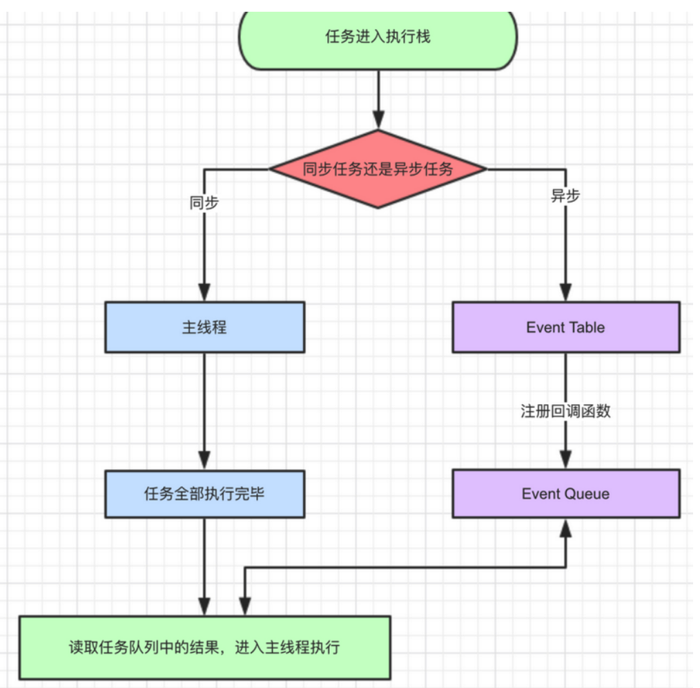

## 事件循环EventLoop

### 执行与运行

```
1.执行依赖于环境，如浏览器，node，使它能够与外界交互。
Chrome 提供了 window、DOM，而 Node.js 则是 require、process 等等。
2.运行指JS引擎解析执行代码，完成内存分配、垃圾回收等；
Chrome 和 Node.js 都使用了 V8 引擎：V8 实现并提供了 ECMAScript 标准中的所有数据类型、操作符、对象和方法（注意并没有 DOM）。
```

JS是单线程的，顺序执行代码，放入对应主线程栈或者事件队列，一切javascript版的"多线程"都是用单线程模拟出来的

### Event Loop的分类

javascript事件循环EventLoop是javascript的执行机制，是实现异步的一种机制 Event Loop 分为两种，一种存在于 Browsing Context 中，还有一种在 Worker 中。

- 浏览器上下文，是指一种用来将 Document 展现给用户的环境。例如浏览器中的 tab，window 或 iframe 等，通常都包含 Browsing Context。
- Worker 是指一种独立于 UI 脚本，可在后台执行脚本的 API。常用来在后台处理一些计算密集型的任务。

### 浏览器的EventLoop

是在 HTML 标准中定义的



- 同步和异步任务分别进入不同的执行"场所"，同步的进入主线程，异步的进入Event Table并注册函数。
- 当指定的事情完成时（其它线程去完成），Event Table会将这个函数移入Event Queue。
- 主线程内的任务执行完毕为空，会去Event Queue读取对应的函数，进入主线程执行。 上述过程会不断重复，也就是常说的Event Loop(事件循环)。

###  如何判断主线程执行栈为空？
==js引擎==存在monitoring process进程，会持续不断的检查主线程执行栈是否为空，一旦为空，就会去Event Queue那里检查是否有等待被调用的函数。


```
let data = [];
$.ajax({
    url:www.javascript.com,
    data:data,
    success:() => {
        console.log('发送成功!');
    }
})
console.log('代码执行结束');
```

+ ajax进入Event Table，注册回调函数success。
+ 执行console.log('代码执行结束')。
+ ajax事件完成，回调函数success进入Event Queue。
+ 主线程从Event Queue读取回调函数success并执行。

************************************
### setTimeOut
#### 1.setTimeOut为什么时间延迟不准确
有时候明明写的延时3秒，实际却5，6秒才执行，因为setTimeout这个函数，是经过指定时间后，把要执行的任务加入到Event Queue中，但是同步任务耗时如果超过指定时间还没完成，那么必须等待同步任务完成才能从Event Queue读取，导致耗时过长

```
setTimeout(() => {
    task()
},3000)

sleep(10000000)
```

+ task()进入Event Table并注册,计时开始。
+ 执行sleep函数，很慢，非常慢，计时仍在继续。
+ 3秒到了，计时事件timeout完成，task()进入Event Queue，但是sleep也太慢了吧，还没执行完，只好等着。
+ sleep终于执行完了，task()终于从Event Queue进入了主线程执行

#### 2.setTimeout(fn,0)

+ ==不会立即执行==，setTimeout(fn,0)还是放在了Event Queue，但是必须等待主线程执行栈为空才能执行。
+ 即便主线程为空，0毫秒实际上也是达不到的。根据HTML的标准，==最低是4毫秒==。

***********************************
#### setInterval
对于setInterval(fn,ms)来说，不是每过ms秒会执行一次fn，而==是每过ms秒，会有fn进入Event Queue==。一旦setInterval的回调函数fn执行时间超过了延迟时间ms，那么就完全看不出来有时间间隔了

*********************************

### 宏任务与微任务
异步事件包括宏任务与微任务
+ macro-task(宏任务)：包括整体代码script，setTimeout，setInterval、I/O、UI交互事件、postMessage、MessageChannel、setImmediate(Node.js 环境)
+ micro-task(微任务)：Promise，process.nextTick
+ 执行顺序，宏任务==>微任务==>下一个宏任务==...

```
console.log('1');

setTimeout(function() {
    console.log('2');
    process.nextTick(function() {
        console.log('3');
    })
    new Promise(function(resolve) {
        console.log('4');
        resolve();
    }).then(function() {
        console.log('5')
    })
})
process.nextTick(function() {
    console.log('6');
})
new Promise(function(resolve) {
    console.log('7');
    resolve();
}).then(function() {
    console.log('8')
})

setTimeout(function() {
    console.log('9');
    process.nextTick(function() {
        console.log('10');
    })
    new Promise(function(resolve) {
        console.log('11');
        resolve();
    }).then(function() {
        console.log('12')
    })
})
```

结果
遇到宏任务就挂起，所以两个setTimeOut是两个事件循环
+ 第一次事件循环 1 7 6 8
+ 第二次循环 2 4 3 5
+ 第三次循环 9 11 10 12

**************************************
### async的事件循环
await之前的都认为是同步事件，async+await相当于promise的语法糖

```
async function async1() {
	console.log('async1 start');
	await async2();
	console.log('async1 end');
}
```
相当于

```
async function async1() {
	console.log('async1 start');
	Promise.resolve(async2()).then(() => {
                console.log('async1 end');
        })
}
```

例1
```
async function async1() {
    console.log('async1 start');
    await async2();
    console.log('async1 end');
}
async function async2() {
    console.log('async2');
}
console.log('script start');
setTimeout(function() {
    console.log('setTimeout');
}, 0)
async1();
new Promise(function(resolve) {
    console.log('promise1');
    resolve();
}).then(function() {
    console.log('promise2');
});
console.log('script end');
\\
script start
async1 start
async2
promise1
script end
async1 end
promise2
setTimeout
```

例2
```
async function async1() {
        console.log('async1 start') 
        await async2()
        console.log('async1 end') 
    }
    async function async2() {
        console.log('async2 start') 
        await async3()
        console.log('async2 end') 
    }
    async function async3() {
        console.log('async3 start') 
        await async4()
        console.log('async3 end')
    }
    async function async4() {
        console.log('async4') 
    }
    console.log('script start')
    setTimeout(function () {
        console.log('settimeout')
    })
    async1()
    new Promise(function (resolve) {
        console.log('promise1') 
        resolve()
    }).then(function () {
        console.log('promise2') 
    })
    console.log('script end')
//
script start
async1 start
async2 start
async3 start
async4
promise1
script end
async3 end
promise2
async2 end
async1 end
settimeout
```

例3

```
console.log('1')
async function async1() {
  console.log('2')
  await 'await的结果'
  console.log('5')
}

async1()
console.log('3')

new Promise(function (resolve) {
  console.log('4')
  resolve()
}).then(function () {
  console.log('6')
})

1
2
3
4
5
6
Promise {<fulfilled>: undefined}
```

例4

```
setTimeout(function () {
  console.log('9')
}, 0)
console.log('1')
async function async1() {
  console.log('2')
  await async2()
  console.log('8')
}
async function async2() {
  return new Promise(function (resolve) {
    console.log('3')
    resolve()
  }).then(function () {
    console.log('6')
  })
}
async1()

new Promise(function (resolve) {
  console.log('4')
  resolve()
}).then(function () {
  console.log('7')
})
console.log('5')
// 1 2 3 4 5 6 7 8 undefined 9
```

**********************
### Node中的EventLoop
Node.js 的运行机制如下:
+ V8 引擎解析 JavaScript 脚本。解析后的代码，调用 Node API。
+ libuv 库负责 Node API 的执行。它将不同的任务分配给不同的线程，形成一个 Event Loop（事件循环），以异步的方式将任务的执行结果返回给 V8 引擎。
+ V8 引擎再将结果返回给用户。

#### 1.libuv 引擎中的事件循环
分为6个阶段


外部输入数据–>轮询阶段(poll)–>检查阶段(check)–>关闭事件回调阶段(close callback)–>定时器检测阶段(timer)–>I/O 事件回调阶段(I/O callbacks)–>闲置阶段(idle, prepare)–>轮询阶段（按照该顺序反复运行）…

```
//答题宏任务执行顺序
1. timers定时器：本阶段执行已经安排的 setTimeout() 和 setInterval() 的回调函数。
2. pending callbacks待定回调：执行延迟到下一个循环迭代的 I/O 回调。
3. idle, prepare：仅系统内部使用。
4. poll 轮询：检索新的 I/O 事件;执行与 I/O 相关的回调（几乎所有情况下，除了关闭的回调函数，它们由计时器和 setImmediate() 排定的之外），其余情况 node 将在此处阻塞。
5. check 检测：setImmediate() 回调函数在这里执行。
6. close callbacks 关闭的回调函数：一些准备关闭的回调函数，如：socket.on('close', ...)。
```

```
console.log('start')
setTimeout(() => {
  console.log('timer1')
  Promise.resolve().then(function() {
    console.log('promise1')
  })
}, 0)
setTimeout(() => {
  console.log('timer2')
  Promise.resolve().then(function() {
    console.log('promise2')
  })
}, 0)
Promise.resolve().then(function() {
  console.log('promise3')
})
console.log('end')
//start=>end=>promise3=>timer1=>timer2=>promise1=>promise2
```
与浏览器不同点，两个setTimeOut是同时执行的，而浏览器里它们属于两个宏任务，要先执行timer1以及它的微任务，再去执行下一个timer，但是node11之后与浏览器表现一致了

```
function test () {
   console.log('start')
    setTimeout(() => {
        console.log('children2')
        Promise.resolve().then(() => {console.log('children2-1')})
    }, 0)
    setTimeout(() => {
        console.log('children3')
        Promise.resolve().then(() => {console.log('children3-1')})
    }, 0)
    Promise.resolve().then(() => {console.log('children1')})
    console.log('end') 
}

test()


// 以上代码在node11以下版本的执行结果(先执行所有的宏任务，再执行微任务)
// start
// end
// children1
// children2
// children3
// children2-1
// children3-1

// 以上代码在node11及浏览器的执行结果(顺序执行宏任务和微任务)
// start
// end
// children1
// children2
// children2-1
// children3
// children3-1
```

### process.nextTick
这个函数其实是独立于 Event Loop 之外的，它有一个自己的队列，当每个阶段完成后，如果存在 nextTick 队列，就会清空队列中的所有回调函数，并且==优先于其他 microtask 执行==。

```
setTimeout(() => {
 console.log('timer1')
 Promise.resolve().then(function() {
   console.log('promise1')
 })
}, 0)
process.nextTick(() => {
 console.log('nextTick')
 process.nextTick(() => {
   console.log('nextTick')
   process.nextTick(() => {
     console.log('nextTick')
     process.nextTick(() => {
       console.log('nextTick')
     })
   })
 })
})
// nextTick=>nextTick=>nextTick=>nextTick=>timer1=>promise1
```
**************************************
### Node 与浏览器的 Event Loop 差异
浏览器环境下，microtask 的任务队列是每个 macrotask 执行完之后执行。而在 Node.js 中，microtask 会在事件循环的各个阶段之间执行，也就是一个阶段执行完毕，就会去执行 microtask 队列的任务。

