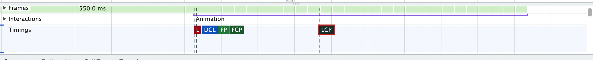
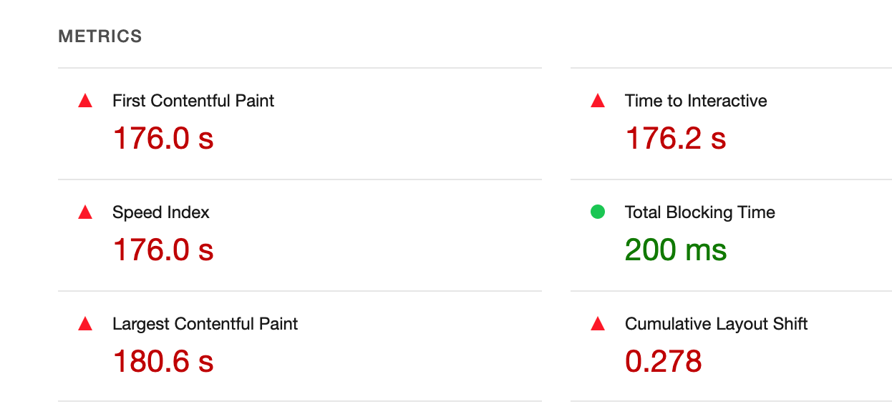

[toc]

# 性能优化指标

+ FT(first paint):首屏加载时间，如果这个时间长，是因为资源加载慢
+ FCP(first contentfull paint):首屏内容加载时间
+ DCL(DOM contentLoaded):DOM内容加载时间
+ LCP(Largest contentfull paint):最大内容加载时间
+ L(Load) 加载时间，则是渲染慢

## 性能优化检测工具

+ chrome的performance Dev

  ```
  chrome的performance工具，开始录制，获取结果，在timing可以看到各个性能指标所需的时间
  ```

  

+ chrome的lighthouse,可以分析网页性能，并给出修改的意见

  