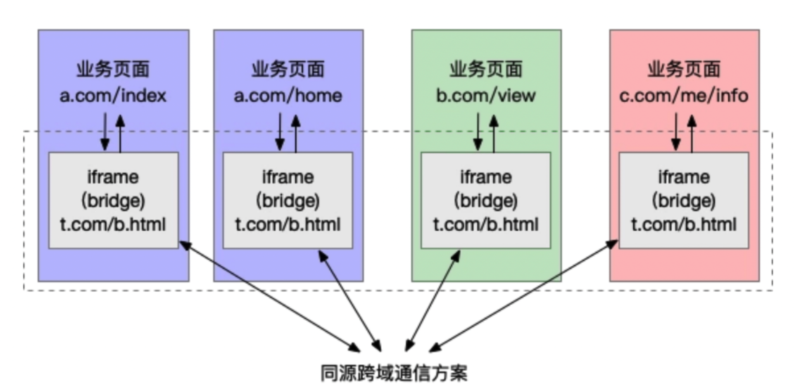
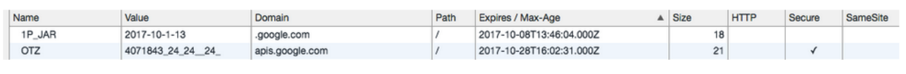
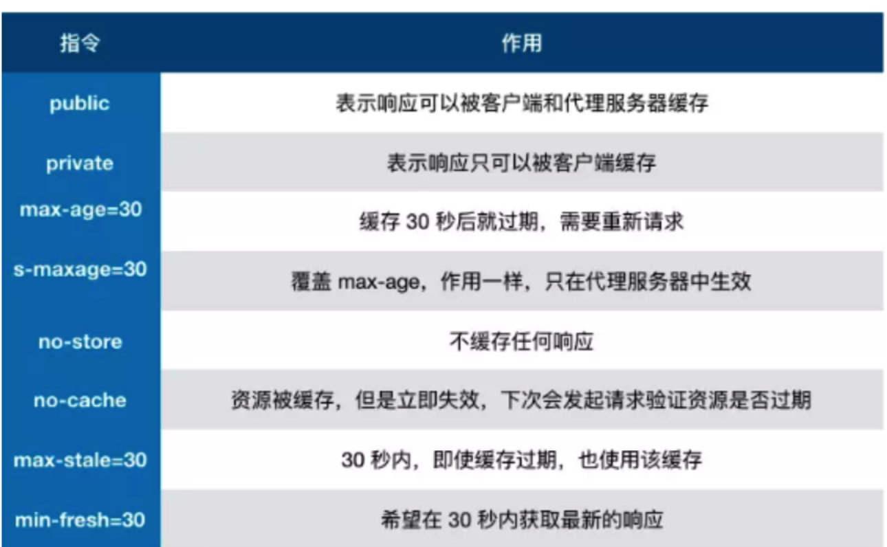
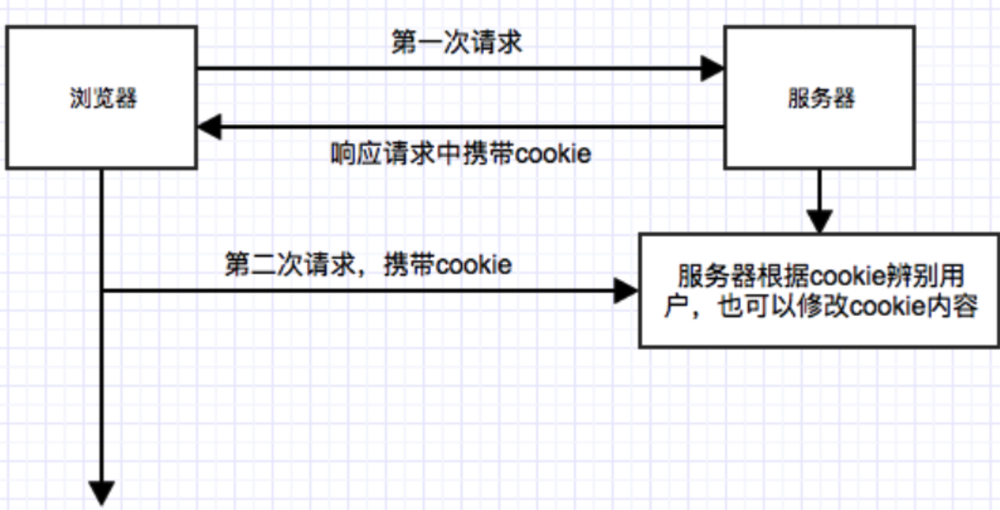
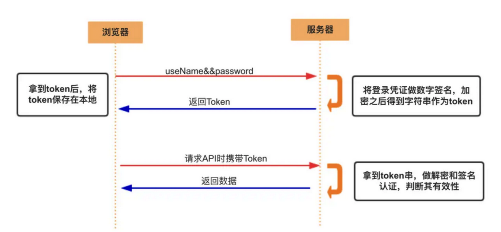
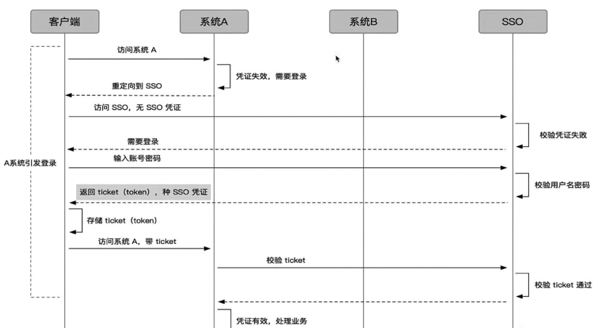
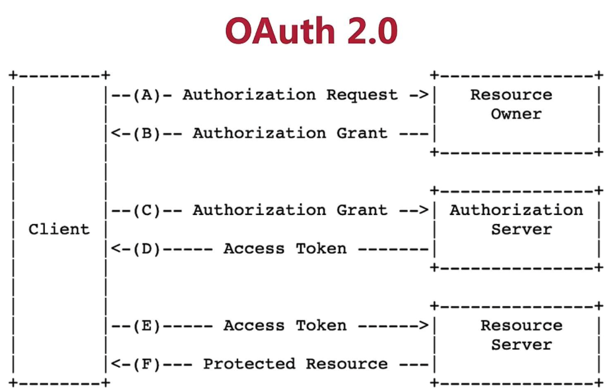
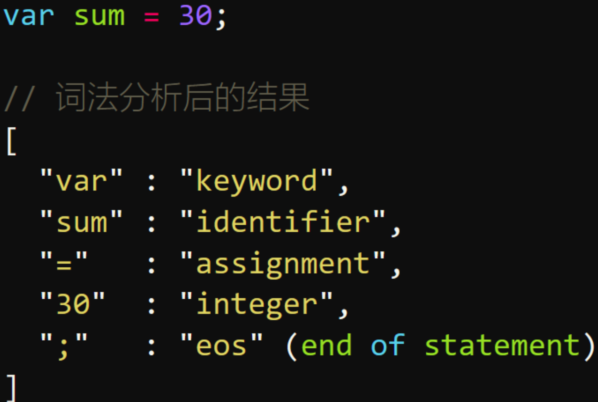
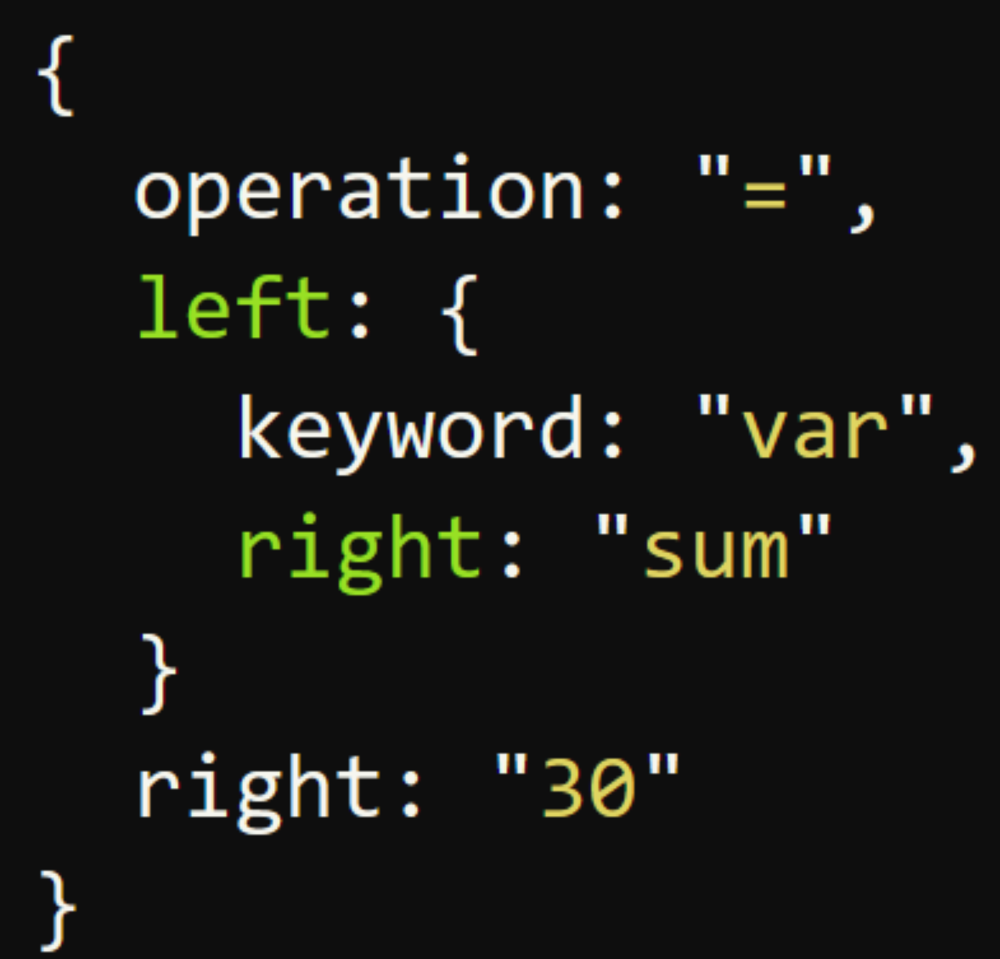

[toc]

# 跨域

## 什么是跨域

浏览器有同源策略，不允许ajax访问其他接口，主要防止CSRF攻击，因为如果一个网站登录状态，其他网站没有同源限制，可以通过ajax获取到数据，不安全。

而且其出现主要是由于前后端分离，早期前后端代码部署在同一个服务器，后来逐渐分开了web服务器，数据服务器，资源服务器等等等。。

- 跨域条件：协议，域名，端口有一个不同就是跨域，即便两个不同的域名指向同一个ip地址，也非同源。
- 有三个标签允许跨域加载资源

```
 // 用于打点统计
<link href = xxx>
<script src=xxx>
// link script可以引用CDN的对象，比如boot.cdn.xxx
// script 可以用于JSONP
```

- 跨域限制

```
Cookie、LocalStorage、IndexedDB 等存储性内容
DOM 节点
AJAX 请求发送后，结果被浏览器拦截了
```

## 跨域方式

### 1.JSONP

JSONP原理

- 加载http...../ch.html
- 服务器不一定真正有一个ch.html,因为服务器可以根据请求，动态生成一个文件返回，同理，js文件可能不存在
- 返回内容格式callback(...),是一个函数，注意使用名称要一致

#### 简单应用

```js
//客户端获取其他源的内容
<script type="text/javascript">
    function jsonp(data){
       console.log('data',data)//data {num1: "js", num2: "json"}
}
</script>

<script type="text/javascript" src="a.json?callback=jsonp"></script>  
// a.json中
jsonp({"num1":"js","num2":"json"})
//发送内容给服务端，服务端再设置，读取num这个值
<script type="text/javascript">
    function jsonp(data){
       console.log('发送成功')
}
</script>
<script type="text/javascript" src="http://api.com?num=1&callback=jsonp"></script>  
```

#### 用promise封装

动态创建script，callback=func,后端 拼接为func(data)

```js
// index.html
function jsonp({ url, params, callback }) {
  return new Promise((resolve, reject) => {
    let script = document.createElement('script')
    window[callback] = function(data) {
      resolve(data)
      document.body.removeChild(script)
    }
    params = { ...params, callback } // wd=b&callback=show
    let arrs = []
    for (let key in params) {
      arrs.push(`${key}=${params[key]}`)
    }
    script.src = `${url}?${arrs.join('&')}`
    document.body.appendChild(script)
  })
}
jsonp({
  url: 'http://localhost:3000/say',
  params: { wd: 'Iloveyou' },
  callback: 'show'
}).then(data => {
  console.log(data)
})
```

上面这段代码相当于向http://localhost:3000/say?wd=Iloveyou&callback=show这个地址请求数据，然后后台返回show('我不爱你')，最后会运行show()这个函数，打印出'我不爱你'

```js
// server.js
let express = require('express')
let app = express()
app.get('/say', function(req, res) {
  let { wd, callback } = req.query
  console.log(wd) // Iloveyou
  console.log(callback) // show
  res.end(`${callback}('我不爱你')`)
})
app.listen(3000)
```

#### 缺点

- jsonp:支持浏览器与服务器双向通信，兼容性好，但是只支持get，有get的缺点

### 2.服务端设置http header

```
response.setHeader("Access-Control-Allow-Origin","http....ch.com,...")//允许跨域的域名
response.setHeader("Access-Control-Allow-Headers","X-Requested-With")
response.setHeader("Access-Control-Allow-Method","PUT,POST")

response.setHeader("Access-Control-Allow-Credentials","true")//接收跨域的cookie
```

### 3.postmessage

- postmessage要通过window使用
- 传值用window.postmessage,获取值用addEventListener('message',function(){})
- window.opener.postMessage
- iframe.contentWindow.postMessage

```js
 http://localhost:3000/a.html页面向http://localhost:4000/b.html传递“我爱你”,然后后者传回"我不爱你"。
 
// a.html，a中嵌入b，a通过iframe发送信息
<iframe src="http://localhost:4000/b.html" frameborder="0" id="frame" onload="load()"></iframe> //等它加载完触发一个事件
//内嵌在http://localhost:3000/a.html
<script>
  function load() {
    let frame = document.getElementById('frame')
    frame.contentWindow.postMessage('我爱你', 'http://localhost:4000') //发送数据
    window.onmessage = function(e) { //接受返回数据
      console.log(e.data) //我不爱你
    }
  }
</script>

// b.html
  window.onmessage = function(e) {
    console.log(e.data) //我爱你
    e.source.postMessage('我不爱你', e.origin)
 }
```

新开窗口的例子

```js
//A页面通过 window.open获得 B页面的句柄，向 B页面发送信号，并监听 B页面回传回来的信号
<!-- A页面 -->
<div id="msg"></div>
<script>
  window.onload = () => {
    var opener = window.open('http://127.0.0.1:9001/b.html')
    // setTimeout 是为了等到真正获取到 opener的句柄再发送数据
    setTimeout(() => {
      // 只对 域名为 http://127.0.0.1:9001的页面发送数据信号
      opener.postMessage('red', 'http://127.0.0.1:9001');
    }, 0)
    
    window.addEventListener('message', event => {
      if(event.origin === 'http://127.0.0.1:9001'){
        document.getElementById('msg').innerHTML = event.data
      }
    })
  }
</script>
```

B页面接收 A页面的信号，并通过事件句柄反向对 A页面发送数据信号

```js
<div id="box">color from a.html</div>
<script type="text/javascript">
  window.addEventListener('message', event => {
    // 通过origin属性判断消息来源地址
    // 只有当数据信号来源于 http://127.0.0.1:9001的服务器才接收
    if(event.origin === 'http://127.0.0.1:9001'){
      // 获取信息员的数据信号
      document.getElementById('box').style.color = event.data
      // 通过 event.source向信号源反向发送数据
      event.source.postMessage('got your color!', event.origin)
    }
  })
</script>
```

postmessage的方法需要验证源

```js
//iframe的例子
//父向子页面传值
//父页面
var o=document.getElementsByTagName('iframe')[0];
o.contentWindow.postMessage('Hello World',"*");
//子页面
window.addEventListener('onmessage',function(e){ 
  if(e.domain=='1.com'){
    if(e.data=='Hello World'){
         e.source.postMessage('Hello',"*");
         //反过来向父页面传消息
    }else{
      alert(e.data);
}
}
})
```



页面与 iframe 通信非常简单，首先需要在页面中监听 iframe 发来的消息，做相应的业务处理：

```
/* 业务页面代码 */
window.addEventListener('message', function (e) {
    // …… do something
});
```

当页面要与其他的同源或非同源页面通信时，会先给 iframe 发送消息：

```
/* 业务页面代码 */
window.frames[0].window.postMessage(mydata, '*');
```

iframe 收到消息后，会使用某种跨页面消息通信技术在所有 iframe 间同步消息，例如下面使用的 Broadcast Channel：

```
/* iframe 内代码 */
const bc = new BroadcastChannel('AlienZHOU');
// 收到来自页面的消息后，在 iframe 间进行广播
window.addEventListener('message', function (e) {
    bc.postMessage(e.data);
});    
```

其他 iframe 收到通知后，则会将该消息同步给所属的页面：

```
/* iframe 内代码 */
// 对于收到的（iframe）广播消息，通知给所属的业务页面
bc.onmessage = function (e) {
    window.parent.postMessage(e.data, '*');
};
```

### 4.websocket

```
var ws=new WebSocket('wss/....org')
ws.onopen=function(e){
    ws.send('...')
}
ws.onmessage=function(e){
    console.log(e.data)
    ws.close()
}
ws.onclose=function(){}
```

### 5.document.domain主域相同而子域不同

- 在http://www.a.com/a.html和http://script.a.com/b.html两个文件中分别加上document.domain = ‘[a.com](http://a.com/)’；然后通过a.html文件中创建一个iframe，去控制iframe的contentDocument

```
//a.html
document.domain = 'a.com';
var ifr = document.createElement('iframe');
ifr.src = 'http://script.a.com/b.html';
ifr.style.display = 'none';
document.body.appendChild(ifr);
ifr.onload = function(){
    var doc = ifr.contentDocument || ifr.contentWindow.document;
    // 在这里操纵b.html
    alert(doc.getElementsByTagName("h1")[0].childNodes[0].nodeValue);
};

//b.html
document.domain = 'a.com';
```

### 6. Node中间件代理(两次跨域)

同源策略是浏览器需要遵循的标准，而如果是服务器向服务器请求就无需遵循同源策略。


# iframe通信

+ 通过postMessage进行通信
+ 发送消息是通过要发送的元素postMessage, window.iframe1.contentWindow.postMessage, window.parent.postMessage('world', '*')
+ 接收消息是通过监听message事件
+ postMessage有跨域限制


代码如下

```html
//a页面
<body>
  <p>
    这里是父级页面a
    <button id = "btn1">发送信息给b</button>
  </p>
  <iframe id="iframe1" src="./b.html"></iframe>
</body>
<script>
  const btn = document.getElementById('btn1');
  btn1.addEventListener('click',()=>{
    console.log('父级页面a发送信息')
    window.iframe1.contentWindow.postMessage('hello','*')
    //第一个参数是内容，第二个参数可以限制发给哪些域，不是所有url都可以接收到这个消息
  })
  window.addEventListener('message', (e) => {
    console.log('父级页面a接收信息')
    console.log('origin', e.origin, e.data)
    //e.origin可以判断发送过来消息的源，判断是否合法
  })
</script>
```

```html
//b页面
<body>
  <p>
    这里是内嵌页面b
    <button id="btn1">发送信息给a</button>
  </p>
</body>
<script>
  const btn = document.getElementById('btn1');
    btn1.addEventListener('click', () => {
      console.log('内嵌页面b发送信息')
      window.parent.postMessage('world', '*')
    })
    window.addEventListener('message', (e) => {
      console.log('内嵌页面b接收信息')
      console.log('origin', e.origin, e.data)
    })
</script>
```

# 同源页面通信

满足同源策略，同一原始域和用户代理下的所有窗口、iFrames等进行交互，属于同源通信。(比如两个同源的tab页面进行通信)

### 1.BroadcastChannel

使用的场景，如，用户同时依次打开某个网站的几个页面，然后在其中一个页面 A进行登录操作，那么其他的页面就可以通过 BroadcastChannel收到来自页面 A的登录状态，从而能够完成多个页面自动同步登录状态的目的。

```js
//发送页面
const cast = new BroadcastChannel('mychannel')
// data 可以是任何 JS数据类型
const data = 'I\'m from Page A'
// 广播信号
cast.postMessage(data)
```

```js
//接收页面
// B页面监听同源下所有页面发送出的“广播”
//  BroadcastChannel的参数，即channel号必须与想要监听的广播源相同，这里是 mychannel
const cast = new BroadcastChannel('mychannel')
// 接收信号
cast.onmessage = function (e) {
  console.log(e.data) // => I'm from Page A
}
// 关闭连接
cast.close()
```

### 2.postMessage(支持跨域)

### 3.Localstorage

Chrome、Edge等浏览器下的这个 storage事件必须由其他同源页面触发

```js
// A页面
window.onstorage = function(e) {
  console.log(e.newValue); // previous value at e.oldValue
};
// B页面
localStorage.setItem('key', 'value');
```

注意：设置相同的localstorage只会在发生改变时触发

```js
localStorage.setItem('lily', '7');
localStorage.setItem('lily', '7');
```

接收到的e

```js
//主要通过e.newValue获取
isTrusted: true, key: "lily", oldValue: "7", newValue: "8", url: "https://www.nowcoder.com/interview/ai/cover?jobTagId=644".....
```

### 4.SharedWorker

Web worker分为两种：专用线程 dedicated web worker、共享线程 shared web worker 专用线程随当前页面的关闭而结束；这意味着 专用线程只能被创建它的页面访问；与之相对应的 共享线程可以被多个页面访问（包括多个标签页和 iframe），不过这些页面**必须是同源的**，即 共享线程支持的是 同源通信

```js
// worker.js
// 共享的数据
let shareData = 0
// 监听主线程的连接
onconnect = function(e) {
  const port = e.ports[0]
  port.onmessage = function(e) {
    if (e.data === 'get') {
      // 向连接的主线程发送信号
      port.postMessage(shareData)
    } else {
      // 将主线程发来的数据设置为 worder内的 共享数据
      shareData = e.data
    }
  }
}
```

A页面设置 SharedWorker中的数据字段

```js
<input type="text" id="textInput" />
<input type="button" value="设置共享数据" />

<script>
  const worker = new SharedWorker('worker.js')
  const inputEle = document.querySelector('#textInput')

  inputEle.onchange = () => {
    console.log('Message posted to worker')
    // 向 worker 发送数据信号
    worker.port.postMessage(inputEle.value)
  }
</script>
```

B页面获取 SharedWorker中的数据字段

```js
<div id="result"></div>
<button id="btn">获取 SharedWorker中的共享数据</button>
<script>
  const worker = new SharedWorker('worker.js')
  var result = document.querySelector('#result')
  // 发送获取获取 SharedWorder 中共享数据的请求
  document.getElementById('btn').addEventListener('click' , () => {
    // 向 worker发送信号
    worker.port.postMessage('get')
  })
  // 接收从 SharedWorder发送来的共享的数据
  worker.port.onmessage = e => {
    console.log('Message received from worker')
    // 在页面上显示获取到的 worker共享数据
    result.textContent = e.data
  }
</script>
```

最终，在 A页面中设置的值，或被 B页面获取到， **像是存储**，一个页面在公共区域存了一个数据，另外一个页面想要了，需要主动发送get去获取，可能并不是适合于页面通信，当然了，SharedWorker本来就不是用于页面通信的，所以没有预期的效果也是情有可原的.

### 5.websocket

要用到websocket的服务器，后端广播

### 6.IndexDB(支持跨页面)

IndexedDB 是一种低级 API，用于客户端**存储大量结构化数据**(包括 文件、blobs)，该API使用索引来实现对该数据的高性能搜索，区别于 LocalStorage只能存储字符串，IndexedDB可以存储 **JS所有的数据类型**，包括 null、undefined等，是 HTML5规范里新出现的 API IndexedDB 是一种使用浏览器存储大量数据的方法.它创造的数据可以被查询，并且**可以离线使用**。IndexedDB对于那些需要存储大量数据，或者是需要离线使用的程序是非常有效的解决方法

```
与 Shared Worker 方案类似，消息发送方将消息存至 IndexedDB 中；接收方（例如所有页面）则通过轮询去获取最新的信息。
```


# 浏览器缓存

## 原因

对于一个数据请求来说，可以分为发起网络请求、后端处理、浏览器响应三个步骤。浏览器缓存可以帮助我们在第一和第三步骤中优化性 能。比如说直接使用缓存而不发起请求，或者发起了请求但后端存储的数据和前端一致，那么就没有必要再将数据回传回来，这样就减少了 响应数据 （有缓存不发起请求，请求后内容一致就不再传输回来了）

- 优点

```
+ 减少冗余数据的传输
+ 提高页面的加载速度
```

为了解决HTTP协议无状态的这个缺点（无状态是指无法记住请求的状态，比如登录了一个网站，然后访问网站提交其他信息时，它无法判别你的身份，需要你每次都得带上自己的用户名密码才判别是否有资格发送请求）,本地存储可以协助进行身份认证

## 本地存储方式

### localStorage 和 sessionStorage 以及 cookie 的区别

| 比较     | cookie                     | localstorage               | sessionstorage                               |
| -------- | -------------------------- | -------------------------- | -------------------------------------------- |
| 生命周期 | expires/max-age            | 长期存储                   | 会话关闭消失                                 |
| 容量     | 4kb                        | 5M                         | 5M                                           |
| API      | 一般需要JSON.stringify     | 友好                       | 友好                                         |
| 跨域     | 在所有同源窗口中都是共享的 | 在所有同源窗口中都是共享的 | 不在不同的浏览器窗口中共享，即使是同一个页面 |

### 1.cookie

#### Cookie使用

- JS里

```
document.cookie='name:yoly'
```

- 服务端

```
setCookie来设置，要设置多个cookie时，得多写几个setCookie。
客户端会在请求头自动带上Cookies
```

+ 用法：
  + cookie可以用于本地存储，但是每次都携带同样的内容，请求时间会增加，存储现在还是更推荐localstorage和sessionstorage
  + cookie可用于身份认证的过程

#### cookie的属性



- name:cookie的名称
- value:需要进行编码处理
- domain:cookie生效的域名，二级域名可以使用一级域名cookie，但是不能使用三级域名的cookie

```
像淘宝首页设置的 Domain 就是 .taobao.com，这样无论是a.taobao.com还是b.taobao.com都可以使用 Cookie。
```

​      注意不能跨域设置cookie

```
//比如阿里域名下的页面把 Domain 设置成百度是无效的：
Set-Cookie: qwerty=219ffwef9w0f; Domain=baidu.com; Path=/; Expires=Wed, 30 Aug 2020 00:00:00 GMT
```

- path:cookie生效的路径，一般默认当前路径/，这个路径必须出现在要请求的资源的路径中才可以发送 Cookie 首部

```
比如设置Path=/docs，
/docs/Web/下的资源会带 Cookie 首部，
/test则不会携带 Cookie 首部。
```

- expires:cookie的过期时间

```
Set-Cookie: id=a3fWa; Expires=Wed, 21 Oct 2015 07:28:00 GMT;
缺省的时候，值为session,会话性缓存，值保存在客户端内存当中，浏览器关闭的时候失效
Expires=Wed, 21 Oct 2015 07:28:00 GMT;
保存在硬盘当中，直到过期的时候才会被清理，是持久性的缓存
Set-Cookie: id=a3fWa; Max-Age=604800;
表示还有多久失效，失效的秒数
// Max-Age 可以为正数、负数、甚至是 0。
当max-Age 属性为正数时，浏览器会将其持久化，即写到对应的 Cookie 文件中。
当 max-Age 属性为负数，则表示该 Cookie 只是一个会话性 Cookie。
当 max-Age 为 0 时，则会立即删除这个 Cookie。
假如 Expires 和 Max-Age 都存在，Max-Age 优先级更高。
```

- httpOnly:用户端不可更改，不能通过 JS 访问 Cookie，减少 XSS 攻击
- secure 只能在协议为 HTTPS 的请求中携带
- same-site规定浏览器不能在跨站请求中携带 Cookie，减少 CSRF 攻击

```
跨站与跨域区别
Cookie中的「同站」判断就比较宽松：只要两个 URL 的 eTLD+1 相同即可，不需要考虑协议和端口。其中，eTLD 表示有效顶级域名，注册于 Mozilla 维护的公共后缀列表（Public Suffix List）中，例如，.com、.co.uk、.github.io 等。eTLD+1 则表示，有效顶级域名+二级域名，例如taobao.com等。

举几个例子，www.taobao.com和www.baidu.com是跨站，www.a.taobao.com和www.b.taobao.com是同站，a.github.io和b.github.io是跨站(注意是跨站)。
Strict仅允许一方请求携带 Cookie，即浏览器将只发送相同站点请求的 Cookie，即当前网页 URL 与请求目标 URL 完全一致。
Lax允许部分第三方请求携带 Cookie
None无论是否跨站都会发送 Cookie

之前默认是 None 的，Chrome80 后默认是 Lax。
```

修改之后会影响

```
//跨域
Post表单，iframe跨站，AJAX，Image
```

**注意**

```
HTTP 接口不支持 SameSite=none,需要在https下
部分浏览器不能加 SameSite=none，需要提前检测
```

#### 作用

```
会话状态管理（如用户登录状态、购物车、游戏分数或其它需要记录的信息）
个性化设置（如用户自定义设置、主题等）
浏览器行为跟踪（如跟踪分析用户行为等）
```

#### 优缺点

- 存储量太小，只有4kb
- 所有http请求都带着cookie,影响资源获取的效率
- API简单，需要封装才能满足不同的需求document.cookie=...

优化

- 在同域名的资源请求时，浏览器会默认带上本地的cookie，针对这种情况，在某些场景下是需要 优化的。

```
1.客户端在域名A下有cookie（这个可以是登陆时由服务端写入的）
2.然后在域名A下有一个页面，页面中有很多依赖的静态资源（都是域名A的，譬如有20个静态资源） 此时就有一个问题，页面加载，请求这些静态资源时，浏览器会默认带上cookie 也就是说，这20个静态资源的http请求，每一个都得带上cookie，而实际上静态资源并不需要cookie验证 此时就造成了较为严重的浪费，而且也降低了访问速度（因为内容更多了）
```

解决方案：多域名拆分

```
1.将静态资源分组，分别放到不同的子域名下 2.子域名请求时，是不会带上父级域名的cookie的，所以就避免了浪费
```

#### 如果浏览器中禁止了 Cookie

如何保障整个机制的正常运转。

```
1.请求URL携带，URL重写
xxx?SessionID=123456...
如果客户端支持Cookie，又通过URL重写，Tomcat仍然会解析Cookie中的SessionID并覆盖URL中的SessionID
2.Token与JWT
```

------

### 2.webstorage

（1）提供一种在cookie之外存储会话数据的路径。（2）提供一种存储大量可以跨会话存在的数据的机制。

#### localStorage

- 生命周期

```
可以为localstorage设置当前时间与设置过期时间，然后通过比较localstorage的时间决定是否删除，实现cookie短期存储
```

cookie在每次请求的时候将所有信息带入HTTP，但是有一部分是不需要的，比如样式文件，放在本地即可

#### session Storage

与localStorage相似，但是有生命周期，而且只要浏览器关闭，就会被清空，因此localStorage用的比较多

- 设置

> 添加：window.localStorage.setItem('name':'yoly')
> 查看：window.localStorage.getItem('name')
> 删除：window.localStorage.removeItem('name')

- 注意： window.localStorage.setItem('name':JSON.stringify({name:yoly}))


## 缓存位置

```
Service worker-->内存-->硬盘-->push cache-->发起请求
```

当依次查找缓存且都没有命中的时候，才会去请求网络。

### Service Worker

是运行在浏览器背后的独立线程，一般可以用来实现缓存功能。使用 Service Worker的话，传输协议必须为 HTTPS。因为 Service Worker 中涉及到请求拦截，所以必须使用 HTTPS 协议来保障安全。Service Worker 的缓存与浏览器其他内建的缓存机制不同，**它可以让我们自由控制缓存哪些文件、如何匹配缓存、如何读取缓存，并且缓存是持续性的。**

Service Worker 实现缓存功能一般分为三个步骤：首先需要先注册 Service Worker，然后监听到 install 事件以后就可以缓存需要的文件，那么在下次用户访问的时候就可以通过拦截请求的方式查询是否存在缓存，存在缓存的话就可以直接读取缓存文件，否则就去请求数据。

当 Service Worker 没有命中缓存的时候，我们需要去调用 fetch 函数获取数据。也就是说，如果我们没有在 Service Worker 命中缓存的话，会根据缓存查找优先级去查找数据。但是不管我们是从 Memory Cache 中还是从网络请求中获取的数据，浏览器都会显示我们是从 Service Worker 中获取的内容。

### Memory Cache内存

读取内存中的数据肯定比磁盘快,内存缓存虽然读取高效，可是缓存持续性很短，**会随着进程的释放而释放**。 一旦我们关闭 Tab 页面，内存中的缓存也就被释放了。

需要注意的事情是，内存缓存在缓存资源时**并不关心返回资源的HTTP缓存头Cache-Control是什么**值，同时资源的匹配也并非仅仅是对URL做匹配，还可能会对Content-Type，CORS等其他特征做校验。

### Disk Cache硬盘：

它**会根据 HTTP Herder 中的字段判断哪些资源需要缓存**，哪些资源可以不请求直接使用，哪些资源已经过期需要重新请求。并且即使在跨站点的情况下，相同地址的资源一旦被硬盘缓存下来，就不会再次去请求数据。绝大部分的缓存都来自 Disk Cache。

### Push Cache推送缓存：

当以上三种缓存都没有命中时，它才会被使用。它只在**会话**（Session）中存在，一旦会话结束就被释放，并且缓存时间也很短暂，在Chrome浏览器中只有5分钟左右，同时它也并非严格执行HTTP头中的缓存指令。


## 缓存策略

强缓存：不会向服务器发送请求，直接从缓存中读取资源，在chrome控制台的Network选项中可以看到该请求返回**200**的状态码，并且**Size显示from disk cache或from memory cache**强缓存可以通过设置两种 HTTP Header 实现：Expires 和 Cache-Control

### 强缓存

- **Expires**

缓存过期时间，用来指定资源到期的时间，是服务器端的具体的时间点。在响应http请求时告诉浏览器在过期时间前浏览器可以直接从浏览器缓存取数据，而无需再次请求。

Expires 是 HTTP/1 的产物，**受限于本地时间**，如果修改了本地时间，可能会造成缓存失效。Expires: Wed, 22 Oct 2018 08:41:00 GMT表示资源会在 Wed, 22 Oct 2018 08:41:00 GMT 后过期，需要再次请求。

- **Cache-Control**

Cache-Control 可以在请求头或者响应头中设置，并且可以组合使用多种指令：



> 客户端缓存内容，是否使用缓存则需要经过协商缓存来验证决定。表示不使用 Cache-Control的缓存控制方式做前置验证，而是**依然缓存，但要使用 Etag 或者Last-Modified字段来控制缓存**。需要注意的是，no-cache这个名字有一点误导。设置了no-cache之后，并不是说浏览器就不再缓存数据，只是浏览器在使用缓存数据时，需要先确认一下数据是否还跟服务器保持一致。

no-store：

> 所有内容都不会被缓存，即不使用强制缓存，也不使用协商缓存

### 协商缓存

Last-Modified和If-Modified-Since

> 浏览器在第一次访问资源时，服务器返回资源的同时，在response header中添加 Last-Modified的header，值是这个资源在服务器上的最后修改时间，浏览器接收后缓存文件和header；浏览器下一次请求这个资源，浏览器检测到有 Last-Modified这个header，于是添加If-Modified-Since这个header，**值就是Last-Modified中的**值；服务器再次收到这个资源请求，会根据 If-Modified-Since 中的值与服务器中这个资源的最后修改时间对比，如果没有变化，返回304和空的响应体，直接从缓存读取，如果If-Modified-Since的时间小于服务器中这个资源的最后修改时间，说明文件有更新，于是返回新的资源文件和200

缺点

- 因为 Last-Modified 只能以秒计时，如果在不可感知的时间内修改完成文件，那么服务端会认为资源还是命中了，不会返回正确的资源
- 如果本地打开缓存文件，即使没有对文件进行修改，但还是会造成 Last-Modified 被修改，服务端不能命中缓存导致发送相同的资源

ETag和If-None-Match

> Etag是服务器响应请求时，返回**当前资源文件的一个唯一标识**(由服务器生成)，只要资源有变化，Etag就会重新生成。浏览器在下一次加载资源向服务器发送请求时，会将上一次返回的Etag值放到request header里的If-None-Match里，服务器只需要比较客户端传来的If-None-Match跟自己服务器上该资源的ETag是否一致，就能很好地判断资源相对客户端而言是否被修改过了。

Etag与Last-Modified的比较

```
1.Etag优先级高
2.Etag压迫根据文件计算hash值，Last-Modified只需要记录时间，计算性能更优
3.在精确度上，Etag要优于Last-Modified。
```

### 缓存优先级

- 先判断Cache-Control，在Cache-Control的max-age之内，直接返回200 from cache；
- 没有Cache-Control再判断Expires，再Expires之内，直接返回200 from cache； Cache-Control=no-cache或者不符合Expires，浏览器向服务器发送请求；
- 服务器同时判断ETag和Last-Modified，都一致，返回304，有任何一个不一致，返回200。

## 实际使用缓存场景

- 对于某些不需要缓存的资源，可以使用 Cache-control: no-store ，表示该资源不需要缓存
- 对于频繁变动的资源，可以使用 Cache-Control: no-cache 并配合 ETag 使用，表示该资源已被缓存，但是每次都会发送请求询问资源是否更新
- 对于代码文件来说，通常使用 Cache-Control: max-age=31536000 并配合策略缓存使用，然后对文件进行指纹处理，一旦文件名变动就会立刻下载新的文件

## 用户行为对浏览器缓存的影响

所谓用户行为对浏览器缓存的影响，指的就是用户在浏览器如何操作时，会触发怎样的缓存策略。主要有 3 种：

- 打开网页，地址栏输入地址： 查找 disk cache 中是否有匹配。如有则使用；如没有则发送网络请求。
- 普通刷新 (F5)：因为 TAB 并没有关闭，因此 memory cache 是可用的，会被优先使用(如果匹配的话)。其次才是 disk cache。
- 强制刷新 (Ctrl + F5)：浏览器不使用缓存，因此发送的请求头部均带有 Cache-control: no-cache(为了兼容，还带了 Pragma: no-cache),服务器直接返回 200 和最新内容。


# 登录方案

原因：HTTP无状态，每次都要重新认证用户身份，会比较麻烦

## 1.方案1：cookie+session方案

其实就是用户的真实内容存在服务端，只给用户一个key， 校验的时候通过id去服务端存储的地方去做判断有没有这个key, 这种方案能够实现比较方便的用户管理，

+ 优点：可以直接在session里不存某个用户，实现该用户的封禁效果

+ 缺点：多进程、多服务器的时候，不好同步，需要使用第三方缓存，比如redis
+ 默认有跨域限制

### cookie

使用方法：

+ 每次请求的时候自动带上cookie

+ 服务端向客户端set-cookie,大小限制在4kb

+ cookie有跨域的限制，不能跨域去共享、传递cookie

  (比如，内嵌iframe的场景互相之间cookie不能共享、前端向后端发送ajax请求的时候cookie也不能跨域，所以需要后端设置```withcredential = true```)

注意事项

+ 现代浏览器开始禁止引入的第三方js设置cookie，主要目的是为了保护用户隐私，打击第三方广告

  例如，以下场景，有人发布了一篇博文，关于手机的，内部内嵌了JD的广告，那么当一个用户访问了这一篇博文，此时JD的js把手机这个内容写到了cookie里，当用户打开自己设备上的JD软件时，JD读取自己写入的手机这个cookie，从而在JD页面给用户推荐大量关于手机的广告

+ cookie新增了属性```SameSite:Strict/Lax/None``` 值可以自己选择

### session

- Session机制：当服务器收到请求需要创建session对象时，首先会检查客户端请求中是否包含sessionid。如果有sessionid，服务器将根据该id返回对应session对象。如果客户端请求中没有sessionid，服务器会创建新的session对象
- 如果用户禁用cookie，则要使用URL重写，可以通过response.encodeURL(url) 进行实现；API对encodeURL的结果为，当浏览器支持Cookie时，url不做任何处理；当浏览器不支持Cookie的时候，将会重写URL将SessionID拼接到访问地址后。

### cookie与session的不同

Cookie 和 Session 的区别

- 安全性： Session 比 Cookie 安全，Session 是存储在服务器端的，Cookie 是存储在客户端的。
- 存取值的类型不同：Cookie 只支持存字符串数据，想要设置其他类型的数据，需要将其转换成字符串，Session 可以存任意数据类型。
- 有效期不同： Cookie 可设置为长时间保持，比如我们经常使用的默认登录功能，Session 一般失效时间较短，客户端关闭（默认情况下）或者 Session 超时都会失效。
- 存储大小不同： 单个 Cookie 保存的数据不能超过 4K，Session 可存储数据远高于 Cookie，但是当访问量过多，会占用过多的服务器资源。

### 具体流程



1.在登陆页面，用户登陆了此时，服务端会生成一个session，session中有对于用户的信息（如用户名、密码等） 
2.然后会有一个sessionid（相当于是服务端的这个session对应的key）
3.然后服务端在返回信息中写入set-cookie:sessionid=xxx,... 然后浏览器本地就有这个cookie了
4.以后访问同域名下的页面时，自动带上cookie，自动检验，在有效时间内无需二次登陆

## 2.方案2: token方案

token是自定义的，需要自己进行存储， 没有跨域限制

Authorization: "Basic 用户名和密码的base64加密字符串"



```
一般token可以产生随机数来生成，但是为了防止单点失败，可以使用

uid(用户唯一的身份标识)、time(当前时间的时间戳)、sign（签名，token 的前几位以哈希算法压缩成的一定长度的十六进制字符串）
```

请求过程

```
1.客户端使用用户名跟密码请求登录
2.服务端收到请求，去验证用户名与密码
3.验证成功后，服务端会生成一个随机数，利用secret和加密算法(如：HMAC-SHA256)对payload(如账号密码)生成一个字符串(token)，返回前端
4.客户端收到 token 以后，会把它存储起来，比如放在 cookie 里或者 localStorage 里
5.客户端每次向服务端请求资源的时候需要带着服务端签发的 token
6.服务端收到请求，用同样的算法解密，查看token是否过期,也可以通过token中的uid和其他参数比较验证用户的合法性
```

特点

```
服务端无状态化、可扩展性好，服务端不需要保存用户信息，但是需要计算
支持移动端设备
安全
支持跨程序调用
```

## 3.方案3： JWT方案

JWT(JSON Web Token),JSON格式的令牌，不保存 session 数据了，所有数据都保存在客户端

+ 优点：不占据服务端内存
+ 缺点：
  + 无法快速封禁某个用户，除非在服务端设置白名单
  + 万一服务端秘钥丢失了，那么用户信息就全部丢失了
  + 体积比较大

```
{
	“姓名”: “张三”,
	“角色”: “管理员”,
	“到期时间”: “2018年7月1日0点0分”
}
```

- JWT的原理是，服务器认证以后，生成一个 JSON 对象，发回给用户，以后，用户与服务端通信的时候，都要发回这个 JSON 对象。服务器完全只靠这个对象认定用户身份。为了防止用户篡改数据，服务器在生成这个对象的时候，会加上签名，客户端收到服务器返回的 JWT，可以储存在 Cookie 里面，也可以储存在 localStorage。此后，客户端每次与服务器通信，都要带上这个 JWT。你可以把它放在 Cookie 里面自动发送，但是这样不能跨域，所以更好的做法是放在 HTTP 请求的头信息Authorization字段里面。

```
Authorization: Bearer 
另一种做法是，跨域的时候，JWT 就放在 POST 请求的数据体里面。
```

- JWT的格式

```
JWT 的三个部分依次如下。

Header（头部）

    {
      "alg": "HS256",//加密算法
      "typ": "JWT"//类型
    }

Payload（负载）（用户一些信息存放）
Signature（签名）：需要指定一个密钥（secret）。这个密钥只有服务器才知道，不能泄露给用户。然后，使用 Header 里面指定的签名算法（默认是 HMAC SHA256）
```

JWT 的最大缺点是，由于服务器不保存 session 状态，因此无法在使用过程中废止某个 token，或者更改 token 的权限。也就是说，一旦 JWT 签发了，在到期之前就会始终有效，除非服务器部署额外的逻辑。

## 4.如何实现单点登录

> session存在问题：单机当然没有问题，如果是服务器集群，或者是跨域的服务导向架构，就要求 session 数据共享，每台服务器都能够读取 session。
>
> 举例来说，A 网站和 B 
> 网站是同一家公司的关联服务。现在要求，用户只要在其中一个网站登录，再访问另一个网站就会自动登录，请问怎么实现

### (1)session

数据持久化，写入数据库或别的持久层。各种服务收到请求后，都向持久层请求数据。这种方案的优点是架构清晰，缺点是工程量比较大。另外，持久层万一挂了，就会单点失败。

### (2)cookie设置document.domain解决

A与B在同一域名，a.c.com与b.c.com可以用cookie设置document.domain解决

### (3)SSO



### (4)OAuth 2.0




OAuth（Open Authorization）是一个关于授权（authorization）的开放网络标准，允许用户授权第三 方应用访问他们存储在另外的服务提供者上的信息，而不需要将用户名和密码提供给第三方移动应用或分享他们数据的所有内容。

应用场景

+ 原生app授权：app登录请求后台接口，为了安全认证，所有请求都带token信息，如果登录验证、请求后台数据。
+ 前后端分离单页面应用：前后端分离框架，前端请求后台数据，需要进行oauth2安全认证，比如使用vue、react后者h5开发的app
+ 第三方应用授权登录，比如QQ，微博，微信的授权登录。

# 浏览器

## BOM(浏览器对象模型)

### 1.navigator

```
var us = navigator.userAgent //判断浏览器类型
var isChrome = us.indexOf('Chrome')
console.log(isChrome)
```

uerAgent是一个很长的字符串

```
"Mozilla/5.0 (iPhone; CPU iPhone OS 10_3_1 like Mac OS X) AppleWebKit/603
```

### location对象

既是window的对象，也是argument的对象, window.location与document.location是等价的

#### location的属性

完整url:[http://www.wrox.com:80/files?q=java](http://www.wrox.com/files?q=java)

| 属性              | 例子                                    |
| ----------------- | --------------------------------------- |
| location.hash     | #test                                   |
| location.host     | [www.wrox.com:80](http://www.wrox.com/) |
| location.hostname | [www.wrox.com](http://www.wrox.com/)    |
| location.port     | 80                                      |
| location.protocol | http                                    |

不太熟悉的

| 属性              | 例子                                                         |
| ----------------- | ------------------------------------------------------------ |
| location.search   | ?q=java                                                      |
| location.pathname | /files                                                       |
| location.href     | /[http://www.wrox.com:80/files?q=java](http://www.wrox.com/files?q=java) |

其它

```
1.window.location.toString():作用与window.location.href相同，获取完整url
2.window.location.origin:http://localhost:3000,协议，域名，端口号
```

#### 查询字符串参数

//http://localhost:3000/boss?q=k&m=9

- 问号之后的内容
- 1.window.location.search (?q=k&m=9问号以及之后的内容)
- 2.window.location.search.substring(1) (q=k&m=9)=====>字符串不能用split

### history对象

```
history.go(-2) 后退两页
history.back()
history.forward()
```

### window对象

是浏览器的一个实例，既是访问浏览器窗口的接口，又是Global对象

#### 系统对话框

是同步的，显示这些对话框，代码停止执行，关闭之后代码继续执行

```
//alert
alert('hello')
//confirm 选择，按了确认和取消键进行不同的操作
if(confirm('你确定吗')){
    alert('你点击了确认')
}else{
    alert('你点击了取消')
}
//prompt 提示信息与用户文本输入
var result=prompt('你的名字是什么')
if(result!==null){
    console.log('你好',result)
}
```

------

## V8引擎

JS是解释型语言，所以它无需提前编译，而是由解释器实时运行

### a.b.c.d 和 a['b']['c']['d']，哪个性能更高？

a.b.c.d 比 a['b']['c']['d'] 性能高点，后者还要考虑 [ ] 中是变量的情况，再者，从两种形式的结构来看，显然编译器解析前者要比后者容易些，自然也就快一点。

### 引擎对JS的处理

```
核心的 即时编译器将源码编译成机器码运行
```

- 读取代码，进行词法分析，然后将代码分解成词元（token）



+ 对词元进行语法分析，然后将代码整理成抽象语法树(AST)



+ 使用翻译器（translator），将代码转为字节码（bytecode）

- 使用字节码解释器（bytecode interpreter），将字节码转为机器码

最终计算机执行的就是机器码。为了提高运行速度，，不同浏览器策略可能还不同，有的浏览器就省略了字节码的翻译步骤，直接转为机器码（如chrome的v8）

### JS的预处理阶段

在正式执行JS前，还会有一个预处理阶段

- 分号补全,如果不写分号在代码压缩为一行的时候可能会导致出错

```
function buquan(){
    return
    {
        'a':'a'
    }
}
//分号补全
function buquan(){
    return;
    {
        'a':'a'
    };
}
//结果为undefined
```

- 变量提升，在代码执行前先进行解析

```js
var a=9;
console.log(a)
var class='12'
```

```js
function fn()}{
//var web 变量提升，在这里声明了，if语句还是起了作用
   if(false){
    var web='hh' 
}
console.log(web)//undefined
}
//函数，会报错
function(a=b,b=3) {} //报错
```

##### 3.JS的执行阶段

- 1.执行上下文

```
JS有执行上下文
1.浏览器首次载入脚本，它将创建全局执行上下文，并压入执行栈栈顶（不可被弹出）
2.然后每进入其它作用域就创建对应的执行上下文并把它压入执行栈的顶部
3.一旦对应的上下文执行完毕，就从栈顶弹出，并将上下文控制权交给当前的栈。
这样依次执行（最终都会回到全局执行上下文）
```

每一个执行上下文，都有三个重要属性:

```
+ 变量对象(Variable object ， VO)
+ 作用域链(Scopechain)
+ this
```

- 2.VO（变量对象）和AO（活动对象）

```
VO中会存放一些变量信息（如声明的变量，函数， arguments参数等等
AO（ activationobject)，当函数被调用者激活，AO就被创建了。
```

- 3.作用域链
- 4.this this是执行上下文环境的一个属性，而不是某个变量对象的属性

### Service Worker

#### 1.是什么

Service Worker 是运行在浏览器背后的独立线程，脱离浏览器窗体的JS线程

- window以及DOM都是不能访问的，此时我们可以使用self访问全局上下文。
- 设计为完全异步，同步API（如XHR和localStorage）不能在Service Worker中使用
- 必须是https协议或者localhost

#### 作为消息中转站页面间通信

- 注册serviceWorker

```
navigator.serviceWorker.register('../util.sw.js').then(function () {
    console.log('Service Worker 注册成功');
});
/* ../util.sw.js Service Worker 逻辑 */
self.addEventListener('message', function (e) {
    console.log('service worker receive message', e.data);
    e.waitUntil(
        self.clients.matchAll().then(function (clients) {
            if (!clients || clients.length === 0) {
                return;
            }
            clients.forEach(function (client) {
                client.postMessage(e.data);
            });
        })
    );
});
```

在 Service Worker 中监听了message事件，获取页面（从 Service Worker 的角度叫 client）发送的信息。然后通过self.clients.matchAll()获取当前注册了该 Service Worker 的所有页面，通过调用每个client（即页面）的postMessage方法，向页面发送消息。这样就把从一处（某个Tab页面）收到的消息通知给了其他页面。

- 页面监听 Service Worker 发送来的消息：

```
/* 页面逻辑 */
navigator.serviceWorker.addEventListener('message', function (e) {
    const data = e.data;
    const text = '[receive] ' + data.msg + ' —— tab ' + data.from;
    console.log('[Service Worker] receive message:', text);
});
navigator.serviceWorker.controller.postMessage(mydata);
```

## 跨域

### 跨域请求(CORS跨域资源共享)

#### 简单请求

- 使用下列方法之一：

```
GET HEAD POST
```

- Content-Type 的值仅限于下列三者之一：

```
text/plain
multipart/form-data
application/x-www-form-urlencoded 
```

- HTTP头

```
只能是 Accept/ Accept-Language/
Conent-Language/ Content-Type 等 
```

简单请求就是普通 **HTML Form 在不依赖脚本的情况下**可以发出的请求，比如表单的 method 如果指定为 POST ，可以用 enctype 属性指定用什么方式对表单内容进行编码，合法的值就是前述这三种。

#### 复杂请求

普通 HTML Form 无法实现的请求。比如 PUT 方法、需要其他的内容编码方式、自定义头之类的。 对于复杂请求来说，首先会发起一个预检请求，该请求是 option 方法的，通过该请求来知道服务端是否允许跨域请求。

##### 复杂请求能否加速

优化OPTIONS预检请求的发送，CORS中**Access-Control-Max-age**可以设置缓存的时间，表示多少秒内不会对同一个非简单请求去发送预检请求，这样的话就能够减少重复多次发送options请求的往返时间

#### Ajax原生实现 true（异步）或 false（同步）

```
//考虑兼容问题： 
if(window.XMLHttpRequest){ 
  var xhr = new XMLHTTPRequest(); 
}else{ 
  var xhr = new ActiveXObject(); 
} 
xhr.open("get/post", "请求地址", true);
xhr.send(null); //为空一定要发送null 
xhr.onreadystatechange = function(){   
  if(xhr.readyState == 4){
    document.getElementById().innerHTML = xhr.responseText; } }
//xhr的readyState有5个数值 
0: 未初始化，此时XMLHTTPRequest对象已经创建，还没有调用open(); 
1: 已经创建请求，调用open函数，但是还没有调用send发送；
2: 请求已经发送，正在处理中，此时已经接受了response的报文头部；
3: 请求处理中，此时已经接收了部分报文体，response中的部分数据已经可以使用； 
4: 响应完成，可以使用报文的全部信息 ``` 注意：为了防止缓存(304)，调用open时，在第二个参数请求地址后添加一个随机数，保证每次访问的地址不同，避免因为缓存导致请求的文件发生改变，而页面并未随之改变(因为使用了缓存的数据)。 
//设置请求头部发送时的文本格式，因为post方法只能通过表单格式发送 xhr.setRequestHeader("Content-Type", "application/x-www-form-urlencoded");
 //send方法中的参数是报文体，而post方法传递是通过报文体，调用send方法传递的参数是以kv对形式的字符串，类似query string xhr.send("k=v&k=v"); 
```

获取响应

```
responseText 获得字符串形式的响应数据。
responseXML 获得XML 形式的响应数据。 
```

同步

```
xhr.open("GET","info.txt",false);
xhr.send();
document.getElementById("myDiv").innerHTML=xhr.responseText; //获取数据直接显示在页面上 
```

异步

```
xhr.onreadystatechange=function() { 
  if (xhr.readyState==4 &&xhr.status==200){     document.getElementById("myDiv").innerHTML=xhr.responseText; } } 
```

#### jquery ajax

```
$.ajax({ 
  type: 'POST', 
  url: url,
  data: data, 
  dataType: dataType, 
  success: function() {}, 
  error: function() {} }) 
```

#### fetch

- 基于Promise设计
- 当接收到一个代表错误的 HTTP 状态码时，从 fetch()返回的 Promise 不会被标记为 reject， 即使该 HTTP 响应的状态码是 404 或 500。相反，它会将 Promise 状态标记为 resolve （但是会将 resolve 的返回值的 ok 属性设置为 false ）， 仅当网络故障时或请求被阻止时，才会标记为 reject。
- 默认情况下, fetch 不会从服务端发送或接收任何 cookies, 如果站点依赖于用户 session，则会导致未经认证的请求（要发送 cookies，必须设置 credentials 选项）.

```
fetch(url) .then(response => { 
  if (response.ok) { return response.json(); } }) .then(data => console.log(data)) .catch(err => console.log(err)) 
```

#### 4.axios 它是promise对XHR的一个封装。

------

### Web Worker

#### 1.简介

Web Worker (工作线程) 是 HTML5 中提出的概念，分为两种类型，专用线程（Dedicated Web Worker） 和共享线程（Shared Web Worker）。专用线程仅能被创建它的脚本所使用，而共享线程能够在不同的脚本中使用。

- 可以在页面主运行的 JavaScript 线程中加载运行另外单独的一个或者多个 JavaScript 线程；JavaScript 的 ==“多线程” ==技术
- Web Worker 的意义在于可以将一些耗时的数据处理操作从主线程中剥离，使主线程更加专注于页面渲染和交互。

```
懒加载
文本分析
流媒体数据处理
canvas 图形绘制
图像处理
```

注意事项

```
1.有同源限制
2.无法访问 DOM 节点
3.运行在另一个上下文中，无法使用Window对象
4.Web Worker 的运行不会影响主线程，但与主线程交互时仍受到主线程单线程的瓶颈制约。换言之，如果 Worker 线程频繁与主线程进行交互，主线程由于需要处理交互，仍有可能使页面发生阻塞
```

#### 判断浏览器是否支持

```
if (window.Worker) {
    // 是否支持专用线程
}
...
if (window.SharedWorker) {
    // 是否支持共享线程
}
```

#### 线程

**线程创建**

有同源限制

```
var worker = new Worker('worker.js')
var sharedWorker = new SharedWorker('shared-worker.js')
var myWorker = new Worker("my_task.js");

// my_task.js中的代码 
var i = 0;
function timedCount(){
    i = i+1;
    postMessage(i);
    setTimeout(timedCount, 1000);
}
timedCount();
// 在当前页面创建一个Webserver
var myTask = `
    var i = 0;
    function timedCount(){
        i = i+1;
        postMessage(i);
        setTimeout(timedCount, 1000);
    }
    timedCount();
`;

var blob = new Blob([myTask]);
var myWorker = new Worker(window.URL.createObjectURL(blob));
```

**数据传递**

- 通过 postMessage() 方法发送消息，通过 onmessage 事件接收消息。
- Worker 与其主页面之间只能单纯的传递数据，不能传递复杂的引用类型：如通过构造函数创建的对象等。并且，传递的数据也是经过拷贝生成的一个副本，在一端对数据进行修改不会影响另一端。

**专用线程数据传递**

```
// 主线程
var worker = new Worker('worker.js')
worker.postMessage([10, 24])
worker.onmessage = function(e) {
    console.log(e.data)
}

// Worker 线程
onmessage = function (e) {
    if (e.data.length > 1) {
        postMessage(e.data[1] - e.data[0])
    }
}
```

在 Worker 线程中，self 和 this 都代表子线程的全局对象

```
//监听onmessage事件写法
// 写法 1
self.addEventListener('message', function (e) {
})
// 写法 2
this.addEventListener('message', function (e) {
})
addEventListener('message', function (e) {
})
// 写法 4
onmessage = function (e) {
}
```

另一种传递方式：转而不是拷贝

```
var uInt8Array = new Uint8Array(1024*1024*32); // 32MB
for (var i = 0; i < uInt8Array .length; ++i) {
  uInt8Array[i] = i;
}

console.log(uInt8Array.length); // 传递前长度:33554432

var myTask = `
    onmessage = function (e) {
        var data = e.data;
        console.log('worker:', data);
    };
`;

var blob = new Blob([myTask]);
var myWorker = new Worker(window.URL.createObjectURL(blob));
myWorker.postMessage(uInt8Array.buffer, [uInt8Array.buffer]);

console.log(uInt8Array.length); // 传递后长度:0
```

**共享线程数据传递**

端口号

```
// 主线程
var sharedWorker = new SharedWorker('shared-worker.js')
sharedWorker.port.postMessage([10, 24])
sharedWorker.port.onmessage = function (e) {
    console.log(e.data)
}

// Worker 线程
onconnect = function (e) {
    let port = e.ports[0]
    port.onmessage = function (e) {
        if (e.data.length > 1) {
            port.postMessage(e.data[1] - e.data[0])
        }
    }
}
```

**关闭 Worker**

```
// 主线程
worker.terminate()
// Dedicated Worker 线程中
self.close()
// Shared Worker 线程中
self.port.close()
```

**错误处理**

onerror 和 onmessageerror

```
// 主线程
worker.onerror = function () {}
// 主线程使用专用线程
worker.onmessageerror = function () {}
// 主线程使用共享线程
worker.port.onmessageerror = function () {}
// worker 线程
onerror = function () {}
```

**加载外部脚本**

```
importScripts('script1.js', 'script2.js')
```

**嵌入式 Worker**

目前没有一类标签可以使 Worker 的代码像 `<script>`元素一样嵌入网页中，但我们可以通过 ==Blob() ==将页面中的 Worker 代码进行解析。

```
<script id="worker" type="javascript/worker">
// 这段代码不会被 JS 引擎直接解析，因为类型是 'javascript/worker'

// 在这里写 Worker 线程的逻辑
</script>
<script>
    var workerScript = document.querySelector('#worker').textContent
    var blob = new Blob(workerScript, {type: "text/javascript"})
    var worker = new Worker(window.URL.createObjectURL(blob))
</script>
//在当前页面新建了myWorker线程
var myTask = `
    onmessage = function (e) {
        var data = e.data;
        data.push('hello');
        console.log('worker:', data); // worker: [1, 2, 3, "hello"]
        postMessage(data);
    };
`;

var blob = new Blob([myTask]);
var myWorker = new Worker(window.URL.createObjectURL(blob));

myWorker.onmessage = function (e) {
    var data = e.data;
    console.log('page:', data); // page: [1, 2, 3, "hello"]
    console.log('arr:', arr); // arr: [1, 2, 3]
};

var arr = [1,2,3];
myWorker.postMessage(arr);
```

#### 9.Worker 中可以使用的函数和类

时间相关

```
clearInterval()
clearTimeout()
setInterval()
setTimeout
```

Worker 相关

```
importScripts()
close()
postMessage()
```

存储相关

```
Cache
IndexedDB
```

网络相关

```
Fetch
WebSocket
XMLHttpRequest
```

#### 典型应用场景

典型应用场景

- 1、数学运算：用来做后台计算，对CPU密集型的场景再适合不过了。
- 2、图像处理 通过使用从<canvas>中获取的数据，可以把图像分割成几个不同的区域并且把它们推送给并行的不同Workers来做计算，对图像进行像素级的处理，再把处理完成的图像数据返回给主页面。
- 3、大数据的处理 目前mvvm框架越来越普及，基于数据驱动的开发模式也越愈发流行，未来大数据的处理也可能转向到前台，这时，将大数据的处理交给Web Worker吧。

**WebServer实际操作**

- 跨域，需要启动本地服务器，主页面为main.html,server为worker.js

```
var http = require('http');
var fs = require('fs');//引入文件读取模块


var server= http.createServer(function(req,res){

    var url = req.url; 
    //客户端输入的url，例如如果输入localhost:8888/index.html
    //那么这里的url == /index.html 
    var file ='./' + url;
    console.log(url);
    //E:/PhpProject/html5/websocket/www/index.html 
    fs.readFile( file , function(err,data){
        if(err){
            res.writeHeader(404,{
                'content-type' : 'text/html;charset="utf-8"'
            });
            res.write('<h1>404错误</h1><p>你要找的页面不存在</p>');
            res.end();
        }else{
            res.writeHeader(200,{
                'content-type' : 'text/html;charset="utf-8"'
            });
            res.write(data);//将index.html显示在客户端
            res.end();

        }

    });
}).listen(8081);

console.log('服务器开启成功');
```

main.html

```
var worker = new Worker('./worker.js');
worker.addEventListener('message', function (e) {
    console.log('MAIN: ', 'RECEIVE', e.data);
 });
 worker.postMessage('Hello Worker, I am main.js');
```

worker.js

```
onmessage = function (e) {
    console.log('WORKER TASK: ', 'RECEIVE', e.data);
    // 发送数据事件
    postMessage('Hello, I am Worker');
}
```

浏览器输出

```
WORKER TASK:  RECEIVE Hello Worker, I am main.js
main.html:19 MAIN:  RECEIVE Hello, I am Worker
```

**共享线程**

```
// main.js
var myWorker = new SharedWorker("worker.js");
myWorker.port.start();
myWorker.port.postMessage("hello, I'm main");
myWorker.port.onmessage = function(e) {
  console.log('Message received from worker');
}
// worker.js
onconnect = function(e) {
  var port = e.ports[0];
  
  port.addEventListener('message', function(e) {
    var workerResult = 'Result: ' + (e.data[0] * e.data[1]);
    port.postMessage(workerResult);
  });
  port.start();
}
```

## PWA技术(渐进式网页应用)

https://juejin.im/post/6844903821294977032 https://juejin.im/post/6844903599445639181

### Service Worker

service worker是实现PWA的核心，service worker是一个独立的浏览器线程，不会对当前程序的执行线程造成阻塞，通过service worker可以实现页面离线访问、用户消息推送等功能。 cacheStorage 缓存，它提供了一个ServiceWorker类型的工作者或window范围可以访问的所有命名缓存的主目录, 并维护字符串的映射名称到相应的 Cache 对象

### Manifest

定义了一个基于 JSON 的 List

- 能够将你浏览的网页添加到你的手机屏幕上
- 在 Android 上能够全屏启动，不显示地址栏 （ 由于 Iphone 手机的浏览器是 Safari ，所以不支持哦）
- 控制屏幕 横屏 / 竖屏 展示
- 定义启动画面
- 可以设置你的应用启动是从主屏幕启动还是从 URL 启动
- 可以设置你添加屏幕上的应用程序图标、名字、图标大小

### Push Notification

Push：服务器端将更新的信息传递给 SW ，Notification： SW 将更新的信息推送给用户。
