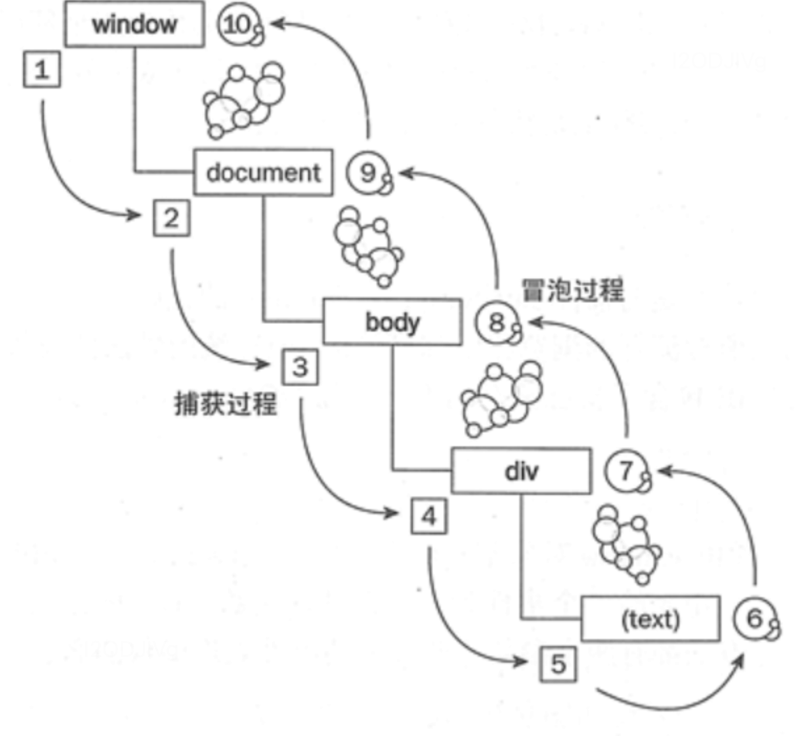

[toc]

# 事件循环EventLoop

## 执行与运行

```
1.执行依赖于环境，如浏览器，node，使它能够与外界交互。
Chrome 提供了 window、DOM，而 Node.js 则是 require、process 等等。
2.运行指JS引擎解析执行代码，完成内存分配、垃圾回收等；
Chrome 和 Node.js 都使用了 V8 引擎：V8 实现并提供了 ECMAScript 标准中的所有数据类型、操作符、对象和方法（注意并没有 DOM）。
```

JS是单线程的，顺序执行代码，放入对应主线程栈或者事件队列，一切javascript版的"多线程"都是用单线程模拟出来的

## 单线程与异步

+ js是单线程的（浏览器与node都是）
+ <font color="red">浏览器中js执行与DOM渲染是共用一个线程，会阻塞</font>
+ ==》异步，事件循环

# Event Loop的分类

javascript事件循环EventLoop是javascript的执行机制，是实现异步的一种机制 Event Loop 分为两种，一种存在于 Browsing Context 中，还有一种在 Worker 中。

- 浏览器上下文，是指一种用来将 Document 展现给用户的环境。例如浏览器中的 tab，window 或 iframe 等，通常都包含 Browsing Context。
- Worker 是指一种独立于 UI 脚本，可在后台执行脚本的 API。常用来在后台处理一些计算密集型的任务。

## 浏览器的EventLoop

是在 HTML 标准中定义的


- 同步和异步任务分别进入不同的执行"场所"，同步的进入主线程，异步的进入Event Table并注册回调函数。
- 当指定的异步事情完成时（其它线程去完成），Event Table会将这个回调函数移入Event Queue。
- 主线程内的任务执行完毕为空，会去Event Queue读取对应的函数，进入主线程执行。 上述过程会不断重复，也就是常说的Event Loop(事件循环)。

## 如何判断主线程执行栈为空？

js引擎存在monitoring process进程，会持续不断的检查主线程执行栈是否为空，一旦为空，就会去Event Queue那里检查是否有等待被调用的函数。


```
let data = [];
$.ajax({
    url:www.javascript.com,
    data:data,
    success:() => {
        console.log('发送成功!');
    }
})
console.log('代码执行结束');
```

+ ajax进入Event Table，注册回调函数success。
+ 执行console.log('代码执行结束')。
+ ajax事件完成，回调函数success进入Event Queue。
+ 主线程从Event Queue读取回调函数success并执行。

## setTimeOut

### 1.setTimeOut为什么时间延迟不准确

有时候明明写的延时3秒，实际却5，6秒才执行，因为setTimeout这个函数，是经过指定时间后，把要执行的任务加入到Event Queue中，但是同步任务耗时如果超过指定时间还没完成，那么必须等待同步任务完成才能从Event Queue读取，导致耗时过长

```js
setTimeout(() => {
    task()
},3000)

sleep(10000000)
```

+ task()进入Event Table并注册,计时开始。
+ task()必须等同步任务sleep执行完毕才能执行

### 2.setTimeout(fn,0)

+ 不会立即执行，setTimeout(fn,0)还是放在了Event Queue，但是必须等待主线程执行栈为空才能执行。
+ 即便主线程为空，0毫秒实际上也是达不到的。根据HTML的标准，最低是4毫秒。

### 3.setInterval

对于setInterval(fn,ms)来说，不是每过ms秒会执行一次fn，而是每过ms秒，会有fn进入Event Queue。一旦setInterval的回调函数fn执行时间超过了延迟时间ms，那么就完全看不出来有时间间隔了

### 4.如何实现准确的setTimeout延时

时间补偿:  多次执行setTimeout，有阻塞任务的时候后一次的定时任务时间越来越长， 所以可以记录上一次定时任务的实际执行时间，然后下一次执行的时候认为修改定时的时间间隔达到修正时间的目的， 如果是单次定时任务，改为while计算时间执行即可

```js
function timer(){
  const start = new Date().getTime()
  while(true){
    const now = new Date().getTime()
    if(now-start > 50){
        cosnole.log('[log]还行任务')
    }
    return;
  }
}
timer()
```


```js
function timer(){
  var speed = 50,
      counter = 1,
      start=new Date().getTime();
  function instance(){
    var real = counter*speed
    ideal=(new Date().getTime() - start)
    var diff = idea'-real;
    if(ideal<3500){
      wundow.setTimeout(function(){instance()}, speed-diff)
    }
  }
  window.setTimeout(function(){instance()}, speed)
}

timer()
```


## 宏任务与微任务

异步事件包括宏任务与微任务
+ macro-task(宏任务)：包括整体代码script，setTimeout，setInterval、I/O、UI交互事件、postMessage、MessageChannel、setImmediate(Node.js 环境)、mutationObserve(Mutation Observer API 用来监视 DOM 变动。DOM 的任何变动，比如节点的增减、属性的变动、文本内容的变动，这个 API 都可以得到通知。)
+ micro-task(微任务)：Promise，process.nextTick
+ 执行顺序，宏任务==>微任务==>下一个宏任务==...
+ <font color="red">微任务在dom渲染之前执行，宏任务在dom渲染之后执行</font>

```js
console.log('1');

setTimeout(function() {
    console.log('2');
    process.nextTick(function() {
        console.log('3');
    })
    new Promise(function(resolve) {
        console.log('4');
        resolve();
    }).then(function() {
        console.log('5')
    })
})
process.nextTick(function() {
    console.log('6');
})
new Promise(function(resolve) {
    console.log('7');
    resolve();
}).then(function() {
    console.log('8')
})

setTimeout(function() {
    console.log('9');
    process.nextTick(function() {
        console.log('10');
    })
    new Promise(function(resolve) {
        console.log('11');
        resolve();
    }).then(function() {
        console.log('12')
    })
})
```

结果
遇到宏任务就挂起，所以两个setTimeOut是两个事件循环
+ 第一次事件循环 1 7 6 8
+ 第二次循环 2 4 3 5
+ 第三次循环 9 11 10 12

宏任务微任务与dom渲染顺序

```js
  const p = document.createElement('p')
  p.innerHTML = '2'
  document.body.appendChild(p)
  const list = document.getElementsByTagName('p')
  console.log('length', list.length)

  console.log('start')
  setTimeout(()=>{
    const list = document.getElementsByTagName('p')
    console.log('length of setTimeout', list.length)
    alert('阻塞setTimeout')
  })
  Promise.resolve().then(()=>{
    const list = document.getElementsByTagName('p')
    console.log('length of promise', list.length)
    alert('阻塞promise')
  })
  console.log('end')
```

页面执行

```
length 2
start
end
length of promise 2
弹出阻塞promise
弹出阻塞setTimeout
页面展示1 2两个p对应元素
```


**************************************
### async的事件循环
await之前的都认为是同步事件，async+await相当于promise的语法糖

```js
async function async1() {
	console.log('async1 start');
	await async2();
	console.log('async1 end');
}
```
相当于

```js
async function async1() {
	console.log('async1 start');
	Promise.resolve(async2()).then(() => {
                console.log('async1 end');
        })
}
```

例1
```js
async function async1() {
    console.log('async1 start');
    await async2();
    console.log('async1 end');
}
async function async2() {
    console.log('async2');
}
console.log('script start');
setTimeout(function() {
    console.log('setTimeout');
}, 0)
async1();
new Promise(function(resolve) {
    console.log('promise1');
    resolve();
}).then(function() {
    console.log('promise2');
});
console.log('script end');
\\
script start
async1 start
async2
promise1
script end
async1 end
promise2
setTimeout
```

promise里的立即执行，then里的放起来

例2

```js
async function async1() {
  console.log('async1 start') 
  await async2()
  console.log('async1 end') 
}
async function async2() {
  console.log('async2 start') 
  await async3()
  console.log('async2 end') 
}
async function async3() {
  console.log('async3 start') 
  await async4()
  console.log('async3 end')
}
async function async4() {
  console.log('async4') 
}
console.log('script start')
setTimeout(function () {
  console.log('settimeout')
})
async1()
new Promise(function (resolve) {
  console.log('promise1') 
  resolve()
}).then(function () {
  console.log('promise2') 
})
console.log('script end')
//
script start
async1 start
async2 start
async3 start
async4
promise1
script end
async3 end
promise2
async2 end
async1 end
settimeout
```

????

例3

```js
console.log('1')
async function async1() {
  console.log('2')
  await 'await的结果'
  console.log('5')
}

async1()
console.log('3')

new Promise(function (resolve) {
  console.log('4')
  resolve()
}).then(function () {
  console.log('6')
})

1
2
3
4
5
6
Promise {<fulfilled>: undefined}
```

例4

```js
setTimeout(function () {
  console.log('9')
}, 0)
console.log('1')
async function async1() {
  console.log('2')
  await async2()
  console.log('8')
}
async function async2() {
  return new Promise(function (resolve) {
    console.log('3')
    resolve()
  }).then(function () {
    console.log('6')
  })
}
async1()

new Promise(function (resolve) {
  console.log('4')
  resolve()
}).then(function () {
  console.log('7')
})
console.log('5')
// 1 2 3 4 5 6 7 8 undefined 9
```

## Node中的EventLoop

Node.js 的运行机制如下:
+ V8 引擎解析 JavaScript 脚本。解析后的代码，调用 Node API。
+ libuv 库负责 Node API 的执行。它将不同的任务分配给不同的线程，形成一个 Event Loop（事件循环），以异步的方式将任务的执行结果返回给 V8 引擎。
+ V8 引擎再将结果返回给用户。
+ <font color="red">nodejs的宏任务和微任务分为不同的类型，而且有不同的优先级</font>

### libuv 引擎中的事件循环

分为6个阶段

外部输入数据–>轮询阶段(poll)–>检查阶段(check)–>关闭事件回调阶段(close callback)–>定时器检测阶段(timer)–>I/O 事件回调阶段(I/O callbacks)–>闲置阶段(idle, prepare)–>轮询阶段（按照该顺序反复运行）…

```js
//答题宏任务执行顺序
1. timers定时器：本阶段执行已经安排的 setTimeout() 和 setInterval() 的回调函数。
2. pending callbacks待定回调：执行延迟到下一个循环迭代的 I/O 回调。
3. idle, prepare：仅系统内部使用。
4. poll 轮询：检索新的 I/O 事件;执行与 I/O 相关的回调（几乎所有情况下，除了关闭的回调函数，它们由计时器和 setImmediate() 排定的之外），其余情况 node 将在此处阻塞。
5. check 检测：setImmediate() 回调函数在这里执行。
6. close callbacks 关闭的回调函数：一些准备关闭的回调函数，如：socket.on('close', ...)。
```

```js
console.log('start')
setTimeout(() => {
  console.log('timer1')
  Promise.resolve().then(function() {
    console.log('promise1')
  })
}, 0)
setTimeout(() => {
  console.log('timer2')
  Promise.resolve().then(function() {
    console.log('promise2')
  })
}, 0)
Promise.resolve().then(function() {
  console.log('promise3')
})
console.log('end')
//start=>end=>promise3=>timer1=>timer2=>promise1=>promise2
```
与浏览器不同点，两个setTimeOut是同时执行的，而浏览器里它们属于两个宏任务，要先执行timer1以及它的微任务，再去执行下一个timer，但是node11之后与浏览器表现一致了

```js
function test () {
   console.log('start')
    setTimeout(() => {
        console.log('children2')
        Promise.resolve().then(() => {console.log('children2-1')})
    }, 0)
    setTimeout(() => {
        console.log('children3')
        Promise.resolve().then(() => {console.log('children3-1')})
    }, 0)
    Promise.resolve().then(() => {console.log('children1')})
    console.log('end') 
}

test()


// 以上代码在node11以下版本的执行结果(先执行所有的宏任务，再执行微任务)
// start
// end
// children1
// children2
// children3
// children2-1
// children3-1

// 以上代码在node11及浏览器的执行结果(顺序执行宏任务和微任务)
// start
// end
// children1
// children2
// children2-1
// children3
// children3-1
```

### process.nextTick
这个函数其实是独立于 Event Loop 之外的，它有一个自己的队列，当每个阶段完成后，如果存在 nextTick 队列，就会清空队列中的所有回调函数，并且==优先于其他 microtask 执行==。

```js
setTimeout(() => {
 console.log('timer1')
 Promise.resolve().then(function() {
   console.log('promise1')
 })
}, 0)
process.nextTick(() => {
 console.log('nextTick')
 process.nextTick(() => {
   console.log('nextTick')
   process.nextTick(() => {
     console.log('nextTick')
     process.nextTick(() => {
       console.log('nextTick')
     })
   })
 })
})
// nextTick=>nextTick=>nextTick=>nextTick=>timer1=>promise1
```
**************************************
### Node 与浏览器的 Event Loop 差异
浏览器环境下，microtask 的任务队列是每个 macrotask 执行完之后执行。而在 Node.js 中，microtask 会在事件循环的各个阶段之间执行，也就是一个阶段执行完毕，就会去执行 microtask 队列的任务。


# 常见的定时器函数

setsetTimeout()和setInterval()的事件可能都不会特别准确没具体原因与JS运行机制有关

## setTimeout()

```
setTimeout(function(){...},delay)
```

## setInterval()

```
setInterval(function(){...},delay)
```

setTimeout()方法在等待指定的毫秒数之后执行一个函数。setInterval()可以重复执行

**setTimeout()实现setInterval**

```js
function mysetinterval(fn,delay){
    function interval(){
        fn();
        setTimeout(interval,delay)
    }
    setTimeout(interval,delay)
}
function myfn(){
    console.log('1')
}

mysetinterval(myfn,1000)
```

# requestAnimationFrame

+ 浏览器会在每一帧渲染前调用该函数, 浏览器每秒最多只能重绘60次，适合处理需要在每一帧之间进行更新的任务，如动画、渲染等。

```js
//回调函数会在重绘之前调用
requestID = window.requestAnimationFrame(callback); 
// 取消
cancelAnimationFrame(...);
```

比如，长列表分批次进行渲染

```js
var total = 100000;
var size = 100;
var count = total / size;
var done = 0;
var ul = document.getElementById('list');

function addItems() {
    var li = null;
    var fg = document.createDocumentFragment();
    for (var i = 0; i < size; i++) {
        li = document.createElement('li');
        li.innerText = 'item ' + (done * size + i);
        fg.appendChild(li);
    }
    ul.appendChild(fg);
    done++;
    if (done < count) {
        requestAnimationFrame(addItems);
    }
};
requestAnimationFrame(addItems);
```

对setInterval进行改进

```js
function setInterval(callback, interval) {
  let timer
  const now = Date.now
  let startTime = now()
  let endTime = startTime
  const loop = () => {
    //重绘前调用一次loop
    timer = window.requestAnimationFrame(loop)
    //执行loop
    endTime = now()
    if (endTime - startTime >= interval) {
      startTime = endTime = now()
      callback(timer)
    }
  }
  //结束后调用下一次loop
  timer = window.requestAnimationFrame(loop)
  return timer
}
let a = 0
setInterval(timer => {
  console.log(1)
  a++
  //取消调用
  if (a === 3) cancelAnimationFrame(timer)
}, 1000)
<div class="md-section-divider"></div>
```

## requestIdleCallback

- 用于在浏览器的空闲时间执行任务，以防止阻塞主线程。适合执行一些不紧急但耗时的任务，如后台数据同步、缓存预热等

```js
requestIdleCallback(function (deadline) {
    // 执行任务逻辑
});
```


# 防抖和节流

防止重复点击： 防抖、节流、 以及给页面添加loading, 接口请求前loading， 最终loading结束

# 事假绑定

```js
// 事件绑定
function addEvent(element, eType, handle, bol) {
    if(element.addEventListener){           //如果支持addEventListener
        element.addEventListener(eType, handle, bol);
    }else if(element.attachEvent){          //如果支持attachEvent
        element.attachEvent("on"+eType, handle);
    }else{                                  //否则使用兼容的onclick绑定
        element["on"+eType] = handle;
    }
}

// 事件解绑
function removeEvent(element, eType, handle, bol) {
    if(element.addEventListener){
        element.removeEventListener(eType, handle, bol);
    }else if(element.attachEvent){
        element.detachEvent("on"+eType, handle);
    }else{
        element["on"+eType] = null;
    }
```

# js事件的捕获和冒泡

## 事件流

事件流主要分为三种

- 事件冒泡流(IE事件流)：事件开始时由最具体的元素(文档中嵌套最深的那个节点)接收，然后逐级向上传播到较为不具体的节点(文档)
- 事件捕获流(Netscape事件流)：不太具体的节点最先接收到事件，而最具体的节点应该最后接收到事件(在事件到达预定目标之前捕获到)
- DOM事件流：事件流包括三个阶段，事件捕获阶段，处于目标阶段，事件冒泡阶段。首先发生的是事件捕获，为截获事件提供了机会；然后是实际的目标接收事件；最后是冒泡阶段，可以在这个阶段对事件做出响应。
- DOM是树形结构，从上到下捕获，事件执行，再冒泡



## IE和DOM事件流的区别

+ 执行的顺序不一样：事件俺的执行顺序不一样
+ IE和DOM事件侦听函数的区别：

```js
IE使用: 
[Object].attachEvent("name_of_event_handler", fnHandler); //绑定函数 
[Object].detachEvent("name_of_event_handler", fnHandler); //移除绑定 

DOM使用： 
[Object].addEventListener("name_of_event", fnHandler, bCapture); //绑定函数 
[Object].removeEventListener("name_of_event", fnHandler, bCapture); //移除绑定 
```
+ 事件参数不一样和this指向不一样

```js
addEventListener方法，this关键字仍然指向被绑定的DOM元素

IE下利用attachEvent注册的处理函数调用时this指向不再是先前注册事件的元素，这时的this为window对象了
```

 ## 事件冒泡

```js
<div id="s1">s1
 <div id="s2">s2</div>
</div>

<script>
s1.addEventListener("click",function(e){ 
  console.log("s1 冒泡事件"); },false);
s2.addEventListener("click",function(e){ 
  console.log("s2 冒泡事件");},false);
s1.addEventListener("click",function(e){ 
  console.log("s1 捕获事件");},true);
s2.addEventListener("click",function(e){
  console.log("s2 捕获事件");},true);
</script>


//s1 捕获事件
//s2 冒泡事件
//s2 捕获事件
//s1 冒泡事件

点击s2，click事件从document->html->body->s1->s2(捕获前进)这里在s1上发现了捕获注册事件，则输出"s1 捕获事件"到达s2，已经到达目的节点。

s2上注册了冒泡和捕获事件，先注册的冒泡后注册的捕获，则先执行冒泡，输出"s2 冒泡事件"
再在s2上执行后注册的事件，即捕获事件，输出"s2 捕获事件"

下面进入冒泡阶段，按照s2->s1->body->html->documen(冒泡前进)
在s1上发现了冒泡事件，则输出"s1 冒泡事件"
```

## 阻止默认事件

### 1)return false

```js
ele.onclick = function() {
    ……                         //你的代码
    return false;              //通过返回false值阻止默认事件行为
}
```

return false实际上做了3件事情：\
+ event.preventDefault();
+ event.stopPropagation();
+ 停止回调函数执行并立即返回。

### 2)event.preventDefault( ); 

阻止通过 addEventListener( ) 添加的事件的默认事件

### 3)event.returnValue = false;

阻止通过 attachEvent( ) 添加的事件的默认事件（此事件为ie浏览器特有）

### 4)stopPropagation

只会阻止【该元素的当前事件（冒泡或者捕获）】的传播，不会阻止该节点的其他click事件的监听函数。

```js
element.addEventListener('click', function (event) {
  event.stopPropagation();
  console.log(1);
});

element.addEventListener('click', function(event) {
  // 会触发
  console.log(2);
});
```
### 5)stopImmediatePropagation

彻底阻止这个事件的传播，不再触发后面所有click的监听函数，注意：是针对该事件，比如你在click里写了这个方法，那【使用该方法之后】的该元素上绑定的方法将失效，但是别的mousedown，mouseover方法等还是生效的。

```js
element.addEventListener('click', function (event) {
  // 会触发
  console.log(‘改方法内的可以执行’);
  event.stopImmediatePropagation();
  // 会触发
  console.log(1);
});

element.addEventListener('click', function(event) {
  // 不会被触发
  console.log(2);
});
其它事件会触发
```
### 6).冒泡Event.bubbles，Event.eventPhase

Event.bubbles

是一个布尔值，默认不冒泡，不支持冒泡的事件
+ UI事件（load, unload, scroll, resize）
+ 焦点事件（blur, focus）
+ 鼠标事件（mouseleave, mouseenter）

Event.eventPhase

+ 0，事件目前没有发生。
+ 1，事件目前处于捕获阶段，即处于从祖先节点向目标节点的传播过程中。
+ 2，事件到达目标节点，即Event.target属性指向的那个节点。
+ 3，事件处于冒泡阶段，即处于从目标节点向祖先节点的反向传播过程中。
## mouseover 和 mouseenter 的区别

两者的区别是是否支持冒泡，两者功能类似，都是鼠标移动到某个元素上时会触发。
+ mouseenter不支持冒泡，因此当鼠标移动到元素的子元素上时，父元素上可触发mouseover和mouseout事件，但不会触发mouseenter和mouseleave事件。

# 事件委托

利用事件冒泡的特性，通过在父元素上统一处理多个子元素的事件的技术， 适用于在处理大量动态生成的子元素时的事件绑定

```html
<div id="div1">
  <a href="#">a1</a>
  <a href="#">a2</a>
  <a href="#">a3</a>
  // 会随时增加更多的a标签
</div>
```

```js
var  div1 = document.getElememntById('div1')
div1.addEventListener('click',function(e){
  var  target = e.target //判别实际点击的元素
  if(target.nodeName==="A"){// 判断实际点击的是否是a标签
      alert(target.innerHTML)
  }
})
```

优点

+ 减少事件注册,节省内存，能够提升整体性能。
+ 简化了dom节点更新时,相应事件的更新（用过 jquery 的都知道，动态加入的元素，事件需要重新绑定）。

## e.target和 e.currentTarget的区别 

+ e.target表示触发事件的元素
+ e.currentTarget表示当前正在处理事件的元素
+ 事件处理函数中的 this 等同于 e.currentTarget

## vue 和 react 中的事件委托优化

+ vue

  ```
  提供了一些事件修饰符，可以用于优化事件处理过程
  .stop修饰符可以阻止事件冒泡
  .prevent修饰符可以阻止浏览器默认的行为，比如跳转、表单提交等
  .once修饰符可以监听一次性事件，当事件触发后，只会执行一次事件处理函数
  ```

+ react

  ```
  React 在处理事件时，会使用合成事件系统，事件都委托到了委托到了 document这个顶级 DOM 上React 并不需要显式地实现事件委托，可以直接在子元素上绑定事件，React 会在内部进行事件委托的处理
  
  + 性能优化：可以减少事件处理器的数量，提高性能
  + 简化代码：直接在子元素上绑定事件处理器即可，React 会在内部处理事件委托
  + 方便的事件对象：React 的合成事件对象是原生事件对象的跨浏览器封装。这样，不论在什么浏览器环境下，开发者都能够获取到一致的事件对象，不用担心兼容性问题。
  ```

  

