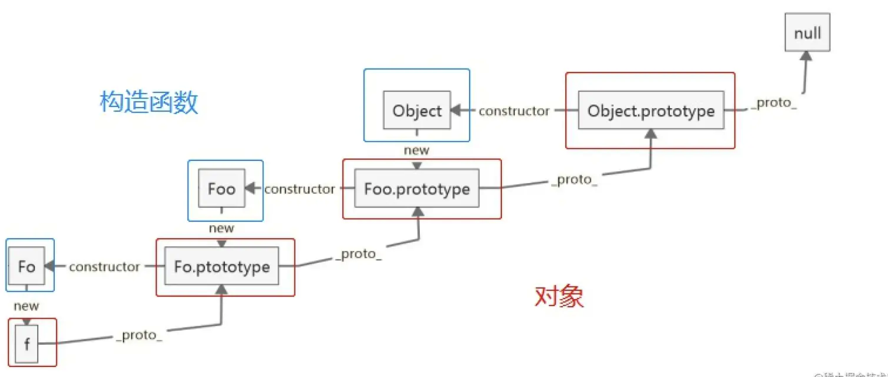

[toc]

# 1.原型链

## 原型

对象有一个__proto__属性，指向一个对象，就是原型。

- 存在没有原型的对象

```js
//完全的数据字面量字典，只有数字，没有原型
//注意写法，name的属性是对象
let newobj=Object.create(null,{'name':{value:'lily'}})
console.log(newobj) //{name: "lily"}

//易错
let newobj=Object.create({'name':'lily'})
console.log(newobj) //{}
```

- 在原型上定义方法要注意constructor的指向

```js
function User(name){
     this.name=name;
}
//也可以分别写User.prototype.get=...
User.prototype={
     constructor:User,
     get(){},
     set(){}
}
```

- this和原型没有关系，永远指向调用方法的对象

### 自定义原型对象

Object.setPrototypeOf,Object.getPrototypeOf

```js
let child={name:'child'}
let parent={name:'father',getname(){console.log(this.name)}}
Object.setPrototypeOf(child,parent)
console.log(child.getname())//child
```

### 原型判断

+ instanceof

A instanceof B: ```A.__proto__ ...=B.prototype```:判断的是构造函数的prototype是不是在A的原型链上

+ isPrototypeOf

b.isPrototypeOf(a)判断b本身在不在a的原型链上

```js
let b={name:'b'};
let a={name:'a'}
a.__proto__=b
console.log(b.isPrototypeOf(a)) //true
console.log(Object.isPrototypeOf(a)) //false
console.log(Object.prototype.isPrototypeOf(a)) //true
```

+ in与hasOwnProperty

in检测属性是否在对象及其原型链上，hasOwnProperty,只检查是否在对象本身上

## 原型链


```__proto__```是对象所独有的，并且__proto__是一个对象指向另一个对象，也就是他的原型对象。我们也可以理解为父类对象。它的作用就是当你在访问一个对象属性的时候，如果该对象内部不存在这个属性，那么就回去它的__proto__属性所指向的对象（父类对象)上查找，如果父类对象依旧不存在这个属性，那么就回去其父类的__proto__属性所指向的父类的父类上去查找。以此类推，直到找到 null。而这个查找的过程，也就构成了我们常说的原型链。

### __proto__与Object.create()

__proto__是相当于读和写的结合，当为一个对象时，时相当于写的操作，否则不成功，而且建议用Object.setPrototypeOf和getPrototypeOf()

```js
let user1={name:'user1'}
user1.__proto__={
     show(){
          console.log(this.name)
     }
}
user1.__proto__='user2';
user1.show() //user1
```

如果一定要设置名字为__proto__的属性，那么需要没有原型，不会继承__proto__方法，用Object.create(),只有数据，没有原型，此时可以设置

```
let user1=Object.create(null)
user1.__proto__='user2';
console.log(user1.__proto__) //user2
```

## 继承

面向对象，继承

改变构造函数的原型，不叫继承，而**是原型的继承**

```js
function User(){}
   User.proto.name=function(){console.log(this.name)
}

function Admin=function()

Admin.proto=User.prototype

const user=new User()
const admin=new Admin()

//此时user与admin都有name方法，但是定义其它方法互相会有影响，如
user.prototype.role=function(){console.log('user')}
admin.prototype.role=function(){console.log('admin')}
//公用原型，原型上的方法后定义的把原定义的覆盖掉了
//应该使用原型才是继承
Admin.prototype.__proto__=User.prototype
```


 另一种方式，Object.create(),

```
Admin.prototype=Object.create(User.prototype)
//直接原型上设置会造成constructor属性的丢失，最好认为修正
Admin.prototype.constructor=Admin
//但这届设置会使得constructor使用in的时候被遍历

Object.defineProperty(Admin.prototype,'constructor',{
    value:Admin,
    
})
```

Object.create()的内部实现

```
var f = function() { }
f.prototype = Car
return new f()
```

用__proto__是改变了原来原型对象的父级，Object.create()是改变了原型

#### 使用mixin实现多继承

JS里不存在多继承，只能一级一级的继承，不能同时继承A和B，只能先继承A，A再继承B

minxin用对象的方式，使得被继承方法的两个方法之间不用产生联系

```
function User(name,age){
    this.name=name,
    this.age=age
}

function Admin(name,age){
     User.call(this,name,age)
}
ownextend(Admin,User)

const adress={
     getadress(){
          console.log('获取地址')
     }
}

const ajax={
     getajax(){
          console.log('获取后台')
     }
}

let user=new Admin('lisi',28);
Admin.prototype.getadress=adress.getadress; 
Admin.prototype.getajax=ajax.getajax;
//另一种写法 Object.assign(Admin.prototype,adress,ajax)
console.log(user.getadress(),user.getajax())////获取地址，获取后台

function ownextend(child,father){
     child.prototype=Object.call(father.prototype);
     Object.defineProperty(child.prototype,'constructor',{
          value:father,
          enumerable:false
     })
}
```

minxin每部又调用，原型

```
const ajax={
     getajax(){
          return '获取后台'
     }
}

const adress={
     __proto__:ajax,
     getadress(){
          console.log(this.__proto__.getajax()+'获取地址')
     }
}

let user=new Admin('lisi',28);
Admin.prototype.getadress=adress.getadress; 
Admin.prototype.getajax=ajax.getajax;

console.log(user.getadress())//获取后台获取地址
```

this.__proto__可以替换为super,super指当前对象的原型

```
console.log(super.getajax()+'获取地址')
```

#### 1.原型链继承(一般不用)

主要思想，子类的原型=父类的实例，基于原型链，既是父类的实例，也是子类的实例

```js
function Father2(){
    this.colors=['1','a']
}
function Child2(){
}
Child2.prototype=new Father2()
var ch=new Child2()
ch.colors.push('9')
var ch2=new Child2()
console.log(ch2.colors)  //['1','a','9']
var fa2=new Father2()
console.log(fa2.colors)  //['1','a']
```

存在的问题

- 无法向父类传值
- 子类之间修改某些引用变量的时候，会全部受到影响
- 无法实现多继承

#### 2.构造函数继承

主要思想，子类里：父类.call(this,参数)，使用父类的构造函数来增强子类实例，等于是复制父类的实例属性给子类，没用到原型

```
function Father(){
    this.colors=['1','3','5']
}
function Child(){
    Father.call(this)
}
var ch1=new Child()
ch1.colors.push('red')
console.log(ch1.colors) //["1", "3", "5", "red"]

var ch2=new Child()
console.log(ch2.colors)//["1", "3", "5"]
```

优点：

- 子类每次都创建一个新的实例，值互不影响
- call第二个参数可以传值
- 可以实现多继承 缺点： 构造函数，都是this.getitem=function(){}这种，函数无法复用，只能继承父类实例的属性和方法，不能继承原型上的属性和方法。

------

#### 3.组合继承(常用)

主要思想： 子类里：1.父类.call(this,参数)进行传值,修改某些量; 2.函数定义在原型上，然后子类.原型=父类的实例实现复用

```
function Father(name){
    this.colors=['1','3','5']
    this.name=name
}
function Child(name){
    Father.call(this,name)
}
Child.prototype=new Father()

Child.prototype.getName=function(){
    console.log(this.name)
}

var ch1=new Child('1')
ch1.colors.push('red')
console.log(ch1.colors) //["1", "3", "5", "red"]
console.log(ch1.getName()) //1

var ch1=new Child('2')
console.log(ch1.colors) //["1", "3", "5"]
console.log(ch1.getName())//2

var fa=new Father()
console.log(fa.getName()) //undefined
```

缺点：调用了两次父类构造函数，生成了两份实例

#### 4.原型式继承

主要思想 object.create

```
function object(o){
    function F(){}
    F.prototype=o
    return new F()
}
//创建一个空构造函数，传入的对象作为它的原型，返回新实例，相当于浅拷贝
```

后来把object规范为了object.create()

```
var father={
    name:'li',
    friends:['1','2']
}

father.friends.push('father')
var ch1=Object.create(father)
ch1.name="ch1"
ch1.friends.push('ch1')
console.log(ch1.name,ch1.friends) // ch1 (4)["1", "2", "father", "ch1"]

var ch2=Object.create(father)
ch2.name="ch2"
console.log(ch2.name,ch2.friends)//ch2 (4)["1", "2", "father", "ch1"]
```

- 引用类型的值会互相影响

------

#### 5.寄生式继承

主要思想：object重写，加上对函数的支持

```
var father={
    name:'li',
    friends:['1','2']
}

function createAnother(o){
    var clone=object(o)
    clone.sayhi=function(){
        alert('hi')
    }
    return clone
}

var ch=createAnother(o)
o.sayhi()
```

------

#### 6.寄生组合式(最有效)

主要思想：通过寄生方式，砍掉父类的实例属性，这样，在调用两次父类的构造的时候，就不会初始化两次实例方法/属性

```
function Cat(name){
  Animal.call(this);
  this.name = name || 'Tom';
}
(function(){
  // 创建一个没有实例方法的类
  var Super = function(){};
  Super.prototype = Animal.prototype;
  //将实例作为子类的原型
  Cat.prototype = new Super();
})();
// Test Code
var cat = new Cat();
console.log(cat.name);
console.log(cat.sleep());
console.log(cat instanceof Animal); // true
console.log(cat instanceof Cat); //true
function Parent(value) { 
  this.val = value
} 
Parent.prototype.getValue = function() {
  console.log(this.val)
} 
function Child(value) { 
  Parent.call(this, value) 
} 
Child.prototype = Object.create(Parent.prototype, {  constructor: { 
  value: Child, 
  enumerable: false, 
  writable: true, 
  configurable: true 
} 
}) 
const child = new Child(1)
child.getValue() // 1 23. 
child instanceof Parent // true
```

------

### class类

内部还是原型的继承

#### 书写

- 方法之间不用逗号
- 用new实例化
- 原本属性用this分别为每个实例创建属性，方法在原型上功能共用，减少内存的使用，class的方法则直接放在了原型上

```
class Parent { 
  constructor(value) { 
    this.val = value 
  } 
  getValue() { 
    console.log(this.val) 
  } 
} 
class Child extends Parent { 
  constructor(value) { 
      super(value) 
      this.val = value 
  } 
} 
let child = new Child(1) 
child.getValue() // 1 
child instanceof Parent // tru
```

#### class声明的方法不能被遍历

原本的方法声明的方法用for...in可以被遍历到，需要用hasOwnProperty删除，而现在在class里定义的方法直接不能被遍历到。只能遍历出特征。

#### class运行在严格模式

class里使用的是严格模式，也就是this不被得到window，对函数外的特征进行修改

#### 静态属性

直接在构造函数上的属性

```js
function User(url){
     this.url=url
}
User.url='lili'

let user1=new User('zhangsan')
console.log(user1) //User{url: "zhangsan"}
console.log(User.url) //'lili'
```

static，外界访问不到

```js
class User{
     static url='lili'
}

let user1=new User()
console.log(user1) //User{}
console.log(User.url) //'lili'
```

------

#### 属性的保护

外界能对属性进行修改

```
class User{
   age='34'
   constructor(url){
        this.url=url
   }
}

let user1=new User('lisi')
user1.name='zhangsan'
user1.age='55'
console.log(user1) //User{age: "55", url: "lisi", name: "zhangsan"}
受保护的属性：类及其子类可以访问，外部必须设置set,get方法才能访问
```

- 使用命名规则保护属性,下划线人为默认不进行改变，但是实际上可以修改

```
_age='24'
```

- 使用symbol，在类及其子类可以使用

```
let Host=new Symbol();
class User{
   [Host]='34'
   constructor(url){
        this.url=url
   }
}

let user1=new User('lisi')
console.log(user1[Host])  //报错，symbol每次都是唯一的
```

- 使用weakMap(),用当前对象作为key，所以外界无法获取到

```
let Host=new WeakMap();
class User{
   constructor(url){
        this.url=url;
        Host.set(this,'54')

   }
}

let user1=new User('lisi')
console.log(user1)  //User{url: "lisi"}
```

- pricate私有属性完全属于某一个类，子类也无法使用

```
加#号

#host='llll'

私有方法
#getname=()=>{}
```

------

### ES5与ES6继承的区别

- 原型链继承

```
function Hero(name){
    this.name = name;
}
Hero.prototype.sayName = function(){
    console.log('my name is',this.name)
}

function smallHero(){
    Hero.call(this,name)
    this.age = 30
}
smallHero.prototype = new Hero('spiderman');
var s1 = new smallHero()
s1.sayName()  //my name is spiderman;
```

- ES6实现继承的写法 主要思想：constructor,super,extends

```
class Parent { 
  constructor(value) { 
    this.val = value 
  } 
  getValue() { 
    console.log(this.val) 
  } 
} 
class Child extends Parent { 
  constructor(value) { 
      super(value) 
      this.val = value 
  } 
} 
let child = new Child(1) 
child.getValue() // 1 
child instanceof Parent // tru
注意书写方法啊，{}，constructor,函数与constructor写法相同
```

------

#### super

super相当于实现了Father.call(this,name)

```
class Father{
     show(){
          console.log(this.name)
     }
}

class Child extends Father{
     constructor(name){
          super();
          this.name=name
     }
     show(){
          super.show()
     }
}

let child1=new Child('lisi')
child1.show() //lisi
let hd={
     name:'hd.name',
     show(){
          console.log(this.name)
     }
}

let xj={
     __proto__:hd,
     name:'xj.name',
     show(){
          this.__proto__.show.call(this)
     }
}

xj.show()//xj.name
```

但是多层继承不行，只能使用两层，因为多层都使用 /this.**proto**.show.call(this)/，那么如果hd里这么写，this会再次调用本身造成死循环，super()则不会出现这个问题

- super()必须在constructor()里使用，可以把值传递给父类，相当于Father.call(this,name),而且必须在子类的this.age之前，因为子类里的优先级需要高于父级，可以重写

------

主要区别

- 原型链区别

```
//原型链继承里的
=smallHero.__proto__ === Function.prototype
//ES6的class里的
smallHero11.__proto__ === Hero , 子类可以直接通过 proto 寻址到父类
```

- class的暂时性死区

```
const bar = new Bar(); // it's ok
function Bar() {
  this.bar = 42;
}

const foo = new Foo(); // ReferenceError: Foo is not defined
class Foo {
  constructor() {
    this.foo = 42;
  }
}
```

- class 声明内部会启用严格模式，未声明的变量报错。

```
// 引用一个未声明的变量
function Bar() {
  baz = 42; // it's ok
}
const bar = new Bar();

class Foo {
  constructor() {
    fol = 42; // ReferenceError: fol is not defined
  }
}
const foo = new Foo();
```

- class里所有方法都不可枚举

```
// 引用一个未声明的变量
function Bar() {
  this.bar = 42;
}
Bar.answer = function() {
  return 42;
};
Bar.prototype.print = function() {
  console.log(this.bar);
};
const barKeys = Object.keys(Bar); // ['answer']
const barProtoKeys = Object.keys(Bar.prototype); // ['print']

class Foo {
  constructor() {
    this.foo = 42;
  }
  static answer() {
    return 42;
  }
  print() {
    console.log(this.foo);
  }
}
const fooKeys = Object.keys(Foo); // []
const fooProtoKeys = Object.keys(Foo.prototype); // []
```

- class 的所有方法（包括静态方法和实例方法）都没有原型对象 prototype，所以也没有[[construct]]，不能使用 new 来调用。

```
function Bar() {
  this.bar = 42;
}
Bar.prototype.print = function() {
  console.log(this.bar);
};

const bar = new Bar();
const barPrint = new bar.print(); // it's ok

class Foo {
  constructor() {
    this.foo = 42;
  }
  print() {
    console.log(this.foo);
  }
}
const foo = new Foo();
const fooPrint = new foo.print(); // TypeError: foo.print is not a constructor
```

- 必须使用new调用class

```
function Bar() {
  this.bar = 42;
}
const bar = Bar(); // it's ok

class Foo {
  constructor() {
    this.foo = 42;
  }
}
const foo = Foo(); // TypeError: Class constructor Foo cannot be invoked without 'new'
```

- class 内部无法重写类名。

```
function Bar() {
  Bar = 'Baz'; // it's ok
  this.bar = 42;
}
const bar = new Bar();
// Bar: 'Baz'
// bar: Bar {bar: 42}  

class Foo {
  constructor() {
    this.foo = 42;
    Foo = 'Fol'; // TypeError: Assignment to constant variable
  }
}
const foo = new Foo();
Foo = 'Fol'; // it's ok
```

- ES5 和 ES6 子类 this 生成顺序不同。ES5 的继承先生成了子类实例，再调用父类的构造函数修饰子类实例，ES6 的继承先生成父类实例，再调用子类的构造函数修饰父类实例。


# 2.**静态方法**

```js
function Persion() {
	this.name = 1
}
// 静态属性
Persion.name = 'Persion
```

- 静态方法是定义在类本身上的，不会被实例继承，而是通过类名直接调用。

- 实例方法通常是定义在类的原型上的，它们会被实例继承，可以通过实例直接调用，也可以通过原型链查找调用。

  ```js
  class MyClass {
    static myStaticMethod() {
      console.log('This is a static method');
    }
  }
  
  // 调用静态方法
  MyClass.myStaticMethod();
  ```

  

