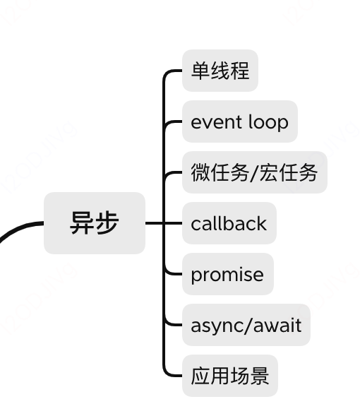
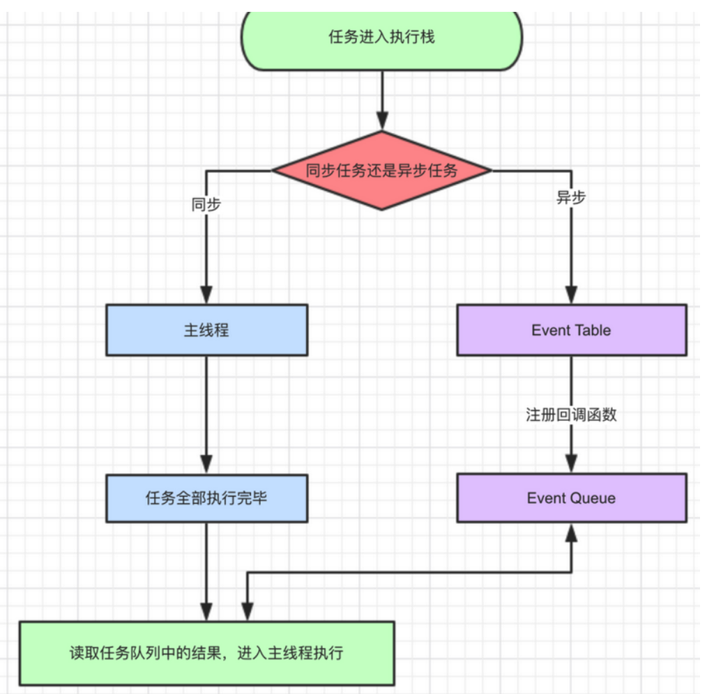
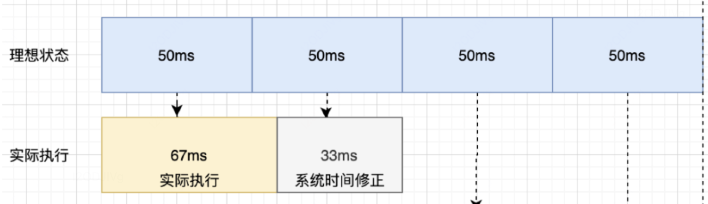
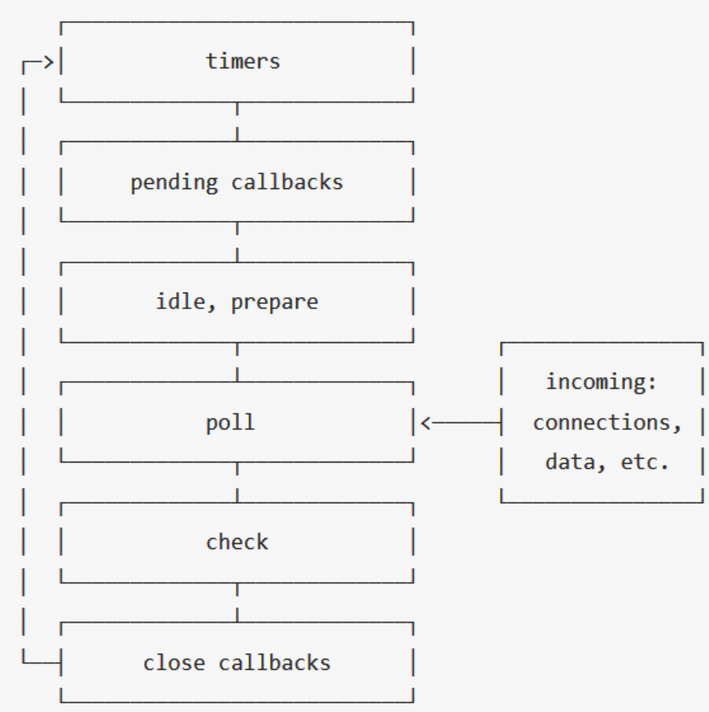

[toc]

# 总览




# 异步加载

## async和defer的区别

相同点
+ 加载文件时不阻塞页面渲染
+ 使用这两个属性的脚本中不能调用document.write方法
+ 有脚本的onload的事件回调

不同点

>JS引擎进行词法分析构建DOM树，到script的时候会停下来去加载和运行js代码
>
>但是async和defer是在解析DOM树的过程遇到后异步去加载js代码，
>
>然后defer是DOM解析完成后再去运行，async是js加载完之后就去运行

# 事件循环EventLoop

## 浏览器的进程模型

进程：

+ 程序运行需要专属的内存空间，可以简单理解为进程
+ 每个应用至少有一个进程
+ 进程之间相互独立，即使需要通信，也需要双方同意

线程：

+ 一个进程至少有一个线程，进程开启后会自动创建一个线程来运行代码，这个线程是主线程
+ 一个程序需要同时执行多块代码，主进程会启动更多的线程来执行代码， 一个进程有多个线程

浏览器的进程和线程

+ 浏览器是多进程多线程的应用程序
+ 浏览器多进程:为了防止连环崩溃，会自动启动多进程，可以浏览器的任务管理器看到浏览器启动了多少进程
  + 浏览器进程： 负责界面展示(回退前进等)、用户交互、子进程管理等， 会启动多个线程执行不同的任务
  + 网络进程： 加载网络资源，会启动多个线程处理不同的网络任务
  + 渲染进程： 会开启渲染主线程，负责支持HTML,CSS,JS代码， 默认情况下浏览器会为每个标签页开启一个渲染进程，保证标签页之间互不影响（后续可能会改变，比如站点的概念，同站点共用一个渲染进程）

渲染主线程如何工作

+ 解析html
+ 解析css
+ 计算样式
+ 布局
+ 处理突出
+ 每秒页面绘制60次
+ 执行全局js代码
+ 支持计数器回调函数
+ 其他

渲染主线程如何协调这些工作：

+ 排队，事件循环

## 单线程与异步

JS是单线程的，顺序执行代码，放入对应主线程栈或者事件队列，一切javascript版的"多线程"都是用单线程模拟出来的

+ js是单线程的（浏览器与node都是）
+ <font color="red">浏览器中js执行与DOM渲染是共用一个线程，会阻塞</font>, 因为js可以修改dom，所以必须是一个线程
+ ==》异步，异步是基于回调来实现的
+ ==》异步回调的实现原理是EventLoop

## Event Loop的实现原理

+ 同步代码，放在call stack里一步一步执行
+ 遇到异步，比如请求，会先等待时机，时机到了会把回调函数放到异步队列callback queue里
+ 如果call stack为空，同步代码执行完成，先执行微任务， 尝试dom渲染
+ 然后轮询查找异步队列，移动到call stack里执行
+ 轮询执行

# Event Loop的分类

javascript事件循环EventLoop是javascript的执行机制，是实现异步的一种机制 Event Loop 分为两种，一种存在于 Browsing Context 中，还有一种在 Worker 中。

- 浏览器上下文，是指一种用来将 Document 展现给用户的环境。例如浏览器中的 tab，window 或 iframe 等，通常都包含 Browsing Context。
- Worker 是指一种独立于 UI 脚本，可在后台执行脚本的 API。常用来在后台处理一些计算密集型的任务。

## 浏览器的EventLoop

是在 HTML 标准中定义的



- 同步和异步任务分别进入不同的执行"场所"，同步的进入主线程，异步的进入Event Table并注册回调函数。
- 当指定的异步事情完成时（其它线程去完成），Event Table会将这个回调函数移入Event Queue。
- 主线程内的任务执行完毕为空，会去Event Queue读取对应的函数，进入主线程执行。 上述过程会不断重复，也就是常说的Event Loop(事件循环)。

## 如何判断主线程执行栈为空？

js引擎存在monitoring process进程，会持续不断的检查主线程执行栈是否为空，一旦为空，就会去Event Queue那里检查是否有等待被调用的函数。


```
let data = [];
$.ajax({
    url:www.javascript.com,
    data:data,
    success:() => {
        console.log('发送成功!');
    }
})
console.log('代码执行结束');
```

+ ajax进入Event Table，注册回调函数success。
+ 执行console.log('代码执行结束')。
+ ajax事件完成，回调函数success进入Event Queue。
+ 主线程从Event Queue读取回调函数success并执行。

## setTimeOut

### 1.setTimeOut为什么时间延迟不准确

有时候明明写的延时3秒，实际却5，6秒才执行，因为setTimeout这个函数，是经过指定时间后，把要执行的任务加入到Event Queue中，但是同步任务耗时如果超过指定时间还没完成，那么必须等待同步任务完成才能从Event Queue读取，导致耗时过长

```js
setTimeout(() => {
    task()
},3000)

sleep(10000000)
```

+ task()进入Event Table并注册,计时开始。
+ task()必须等同步任务sleep执行完毕才能执行

### 2.setTimeout(fn,0)

+ 不会立即执行，setTimeout(fn,0)还是放在了Event Queue，但是必须等待主线程执行栈为空才能执行。
+ 即便主线程为空，0毫秒实际上也是达不到的。根据HTML的标准，最低是4毫秒。

### 3.setInterval

对于setInterval(fn,ms)来说，不是每过ms秒会执行一次fn，而是每过ms秒，会有fn进入Event Queue。一旦setInterval的回调函数fn执行时间超过了延迟时间ms，那么就完全看不出来有时间间隔了

### 4.如何实现准确的setTimeout延时

时间补偿:  多次执行setTimeout，有阻塞任务的时候后一次的定时任务时间越来越长， 所以可以记录上一次定时任务的实际执行时间，然后下一次执行的时候认为修改定时的时间间隔达到修正时间的目的， 如果是单次定时任务，改为while计算时间执行即可

```js
function timer(){
  const start = new Date().getTime()
  while(true){
    const now = new Date().getTime()
    if(now-start > 50){
        cosnole.log('[log]还行任务')
    }
    return;
  }
}
timer()
```




```js
function timer(){
  var speed = 50,
      counter = 1,
      start=new Date().getTime();
  function instance(){
    var real = counter*speed
    ideal=(new Date().getTime() - start)
    var diff = idea'-real;
    if(ideal<3500){
      wundow.setTimeout(function(){instance()}, speed-diff)
    }
  }
  window.setTimeout(function(){instance()}, speed)
}

timer()
```


## 宏任务与微任务

异步事件包括宏任务与微任务

+ macro-task(宏任务)：包括整体代码script，setTimeout，setInterval、I/O、UI交互事件、postMessage、MessageChannel、setImmediate(Node.js 环境)、mutationObserve(Mutation Observer API 用来监视 DOM 变动。DOM 的任何变动，比如节点的增减、属性的变动、文本内容的变动，这个 API 都可以得到通知。)
+ micro-task(微任务)：Promise，process.nextTick
+ 执行顺序，宏任务==>微任务==>下一个宏任务==...
+ <font color="red">微任务在dom渲染之前执行，宏任务在dom渲染之后执行（因为js和dom渲染是共用一个线程的）</font>

```js
console.log('1');

setTimeout(function() {
    console.log('2');
    process.nextTick(function() {
        console.log('3');
    })
    new Promise(function(resolve) {
        console.log('4');
        resolve();
    }).then(function() {
        console.log('5')
    })
})
process.nextTick(function() {
    console.log('6');
})
new Promise(function(resolve) {
    console.log('7');
    resolve();
}).then(function() {
    console.log('8')
})

setTimeout(function() {
    console.log('9');
    process.nextTick(function() {
        console.log('10');
    })
    new Promise(function(resolve) {
        console.log('11');
        resolve();
    }).then(function() {
        console.log('12')
    })
})
```

结果
遇到宏任务就挂起，所以两个setTimeOut是两个事件循环

+ 第一次事件循环 1 7 6 8
+ 第二次循环 2 4 3 5
+ 第三次循环 9 11 10 12

宏任务微任务与dom渲染顺序

```js
  const p = document.createElement('p')
  p.innerHTML = '2'
  document.body.appendChild(p)
  const list = document.getElementsByTagName('p')
  console.log('length', list.length)

  console.log('start')
  setTimeout(()=>{
    const list = document.getElementsByTagName('p')
    console.log('length of setTimeout', list.length)
    alert('阻塞setTimeout')
  })
  Promise.resolve().then(()=>{
    const list = document.getElementsByTagName('p')
    console.log('length of promise', list.length)
    alert('阻塞promise')
  })
  console.log('end')
```

页面执行

```
length 2
start
end
length of promise 2
弹出阻塞promise
弹出阻塞setTimeout
页面展示1 2两个p对应元素
```

## async/await的事件循环

await之前的都认为是同步事件，async+await相当于promise的语法糖

```js
async function fn(){
   return 100
}

(async function(){
  const a = fn() // promise
  cosnt b = await fn() // 100
})()
```


```js
async function async1() {
	console.log('async1 start');
	await async2();
	console.log('async1 end');
}
相当于
async function async1() {
	console.log('async1 start');
	Promise.resolve(async2()).then(() => {
                console.log('async1 end');
        })
}
```

例1: promise里的立即执行，then里的放起来

```js
async function async1() {
    console.log('async1 start');
    await async2();
    console.log('async1 end');
}
async function async2() {
    console.log('async2');
}
console.log('script start');
setTimeout(function() {
    console.log('setTimeout');
}, 0)
async1();
new Promise(function(resolve) {
    console.log('promise1');
    resolve();
}).then(function() {
    console.log('promise2');
});
console.log('script end');
//
script start
async1 start
async2
promise1
script end
async1 end
promise2
setTimeout
```

例2

```js
async function async1() {
  console.log('async1 start') 
  await async2()
  console.log('async1 end') 
}
async function async2() {
  console.log('async2 start') 
  await async3()
  console.log('async2 end') 
}
async function async3() {
  console.log('async3 start') 
  await async4()
  console.log('async3 end')
}
async function async4() {
  console.log('async4') 
}
console.log('script start')
setTimeout(function () {
  console.log('settimeout')
})
async1()
new Promise(function (resolve) {
  console.log('promise1') 
  resolve()
}).then(function () {
  console.log('promise2') 
})
console.log('script end')
//
script start
async1 start
async2 start
async3 start
async4
promise1
script end
async3 end
promise2
async2 end
async1 end
settimeout
```

例3： await后是数字直接返回

```js
(async function(){
  console.log('start')  // 打印start
  const a = await 100
  console.log('a', a)   // 打印a 100
  const  b = await Promise.resolve(200)
  console.log('b', b)   // 打印b 200
  const  c = await Promise.reject(300) // await后的都放在then里，但是reject无法触发then, 只能返回Promise {<rejected>: 300}， 其后不执行
  console.log('c', c)
  console.log('end')
})()
```


## Node中的EventLoop

Node.js 的运行机制如下:

+ V8 引擎解析 JavaScript 脚本。解析后的代码，调用 Node API。
+ libuv 库负责 Node API 的执行。它将不同的任务分配给不同的线程，形成一个 Event Loop（事件循环），以异步的方式将任务的执行结果返回给 V8 引擎。
+ V8 引擎再将结果返回给用户。
+ <font color="red">nodejs的宏任务和微任务分为不同的类型，而且有不同的优先级</font>

### libuv 引擎中的事件循环

分为6个阶段

外部输入数据–>轮询阶段(poll)–>检查阶段(check)–>关闭事件回调阶段(close callback)–>定时器检测阶段(timer)–>I/O 事件回调阶段(I/O callbacks)–>闲置阶段(idle, prepare)–>轮询阶段（按照该顺序反复运行）…

```js
//答题宏任务执行顺序
1. timers定时器：本阶段执行已经安排的 setTimeout() 和 setInterval() 的回调函数。
2. pending callbacks待定回调：执行延迟到下一个循环迭代的 I/O 回调。
3. idle, prepare：仅系统内部使用。
4. poll 轮询：检索新的 I/O 事件;执行与 I/O 相关的回调（几乎所有情况下，除了关闭的回调函数，它们由计时器和 setImmediate() 排定的之外），其余情况 node 将在此处阻塞。
5. check 检测：setImmediate() 回调函数在这里执行。
6. close callbacks 关闭的回调函数：一些准备关闭的回调函数，如：socket.on('close', ...)。
```

```js
console.log('start')
setTimeout(() => {
  console.log('timer1')
  Promise.resolve().then(function() {
    console.log('promise1')
  })
}, 0)
setTimeout(() => {
  console.log('timer2')
  Promise.resolve().then(function() {
    console.log('promise2')
  })
}, 0)
Promise.resolve().then(function() {
  console.log('promise3')
})
console.log('end')
//start=>end=>promise3=>timer1=>timer2=>promise1=>promise2
```

与浏览器不同点，两个setTimeOut是同时执行的，而浏览器里它们属于两个宏任务，要先执行timer1以及它的微任务，再去执行下一个timer，但是node11之后与浏览器表现一致了

```js
function test () {
   console.log('start')
    setTimeout(() => {
        console.log('children2')
        Promise.resolve().then(() => {console.log('children2-1')})
    }, 0)
    setTimeout(() => {
        console.log('children3')
        Promise.resolve().then(() => {console.log('children3-1')})
    }, 0)
    Promise.resolve().then(() => {console.log('children1')})
    console.log('end') 
}

test()


// 以上代码在node11以下版本的执行结果(先执行所有的宏任务，再执行微任务)
// start
// end
// children1
// children2
// children3
// children2-1
// children3-1

// 以上代码在node11及浏览器的执行结果(顺序执行宏任务和微任务)
// start
// end
// children1
// children2
// children2-1
// children3
// children3-1
```

### process.nextTick

这个函数其实是独立于 Event Loop 之外的，它有一个自己的队列，当每个阶段完成后，如果存在 nextTick 队列，就会清空队列中的所有回调函数，并且==优先于其他 microtask 执行==。

```js
setTimeout(() => {
 console.log('timer1')
 Promise.resolve().then(function() {
   console.log('promise1')
 })
}, 0)
process.nextTick(() => {
 console.log('nextTick')
 process.nextTick(() => {
   console.log('nextTick')
   process.nextTick(() => {
     console.log('nextTick')
     process.nextTick(() => {
       console.log('nextTick')
     })
   })
 })
})
// nextTick=>nextTick=>nextTick=>nextTick=>timer1=>promise1
```

**************************************

### Node 与浏览器的 Event Loop 差异

浏览器环境下，microtask 的任务队列是每个 macrotask 执行完之后执行。而在 Node.js 中，microtask 会在事件循环的各个阶段之间执行，也就是一个阶段执行完毕，就会去执行 microtask 队列的任务。



# 常见的定时器函数

setsetTimeout()和setInterval()的事件可能都不会特别准确没具体原因与JS运行机制有关

## setTimeout()

```
setTimeout(function(){...},delay)
```

## setInterval()

```
setInterval(function(){...},delay)
```

setTimeout()方法在等待指定的毫秒数之后执行一个函数。setInterval()可以重复执行

**setTimeout()实现setInterval**

```js
function mysetinterval(fn,delay){
    function interval(){
        fn();
        setTimeout(interval,delay)
    }
    setTimeout(interval,delay)
}
function myfn(){
    console.log('1')
}

mysetinterval(myfn,1000)
```

# requestAnimationFrame

+ 浏览器会在每一帧渲染前调用该函数, 浏览器每秒最多只能重绘60次，适合处理需要在每一帧之间进行更新的任务，如动画、渲染等。

```js
//回调函数会在重绘之前调用
requestID = window.requestAnimationFrame(callback); 
// 取消
cancelAnimationFrame(...);
```

比如，长列表分批次进行渲染

```js
var total = 100000;
var size = 100;
var count = total / size;
var done = 0;
var ul = document.getElementById('list');

function addItems() {
    var li = null;
    var fg = document.createDocumentFragment();
    for (var i = 0; i < size; i++) {
        li = document.createElement('li');
        li.innerText = 'item ' + (done * size + i);
        fg.appendChild(li);
    }
    ul.appendChild(fg);
    done++;
    if (done < count) {
        requestAnimationFrame(addItems);
    }
};
requestAnimationFrame(addItems);
```

对setInterval进行改进

```js
function setInterval(callback, interval) {
  let timer
  const now = Date.now
  let startTime = now()
  let endTime = startTime
  const loop = () => {
    //重绘前调用一次loop
    timer = window.requestAnimationFrame(loop)
    //执行loop
    endTime = now()
    if (endTime - startTime >= interval) {
      startTime = endTime = now()
      callback(timer)
    }
  }
  //结束后调用下一次loop
  timer = window.requestAnimationFrame(loop)
  return timer
}
let a = 0
setInterval(timer => {
  console.log(1)
  a++
  //取消调用
  if (a === 3) cancelAnimationFrame(timer)
}, 1000)
<div class="md-section-divider"></div>
```

## requestIdleCallback

- 用于在浏览器的空闲时间执行任务，以防止阻塞主线程。适合执行一些不紧急但耗时的任务，如后台数据同步、缓存预热等

```js
requestIdleCallback(function (deadline) {
    // 执行任务逻辑
});
```


# JS 异步解决方案的发展历程以及优缺点。

异步编程的语法目标，就是怎样让它更像同步编程。
主要方式：

+ 回调函数
+ 事件监听
+ 发布/订阅
+ Promise

+ Generator

## 1.并发和并行区别

> 并发：宏观上同时完成任务，实质上是通过任务之间的切换完成的

> 并行：实际上就是同时完成多个任务

## 2.回调函数（callback）


```js
ajax('XXX1', () => {
    // callback 函数体
    ajax('XXX2', () => {
        // callback 函数体
        ajax('XXX3', () => {
            // callback 函数体
        })
    })
})
```
优点：解决了同步的问题, 必须挨个排队执行

缺点：

+ 回调地狱,需要自己去理清楚执行顺序
+ 回调是否执行，执行了多少次,是同步还是异步执行的难以判断(内部混杂了同步异步的函数，比如如果有缓存，执行同步，没有缓存就去请求，执行异步，混杂向外只暴露一个接口)
+ 错误难以获取，不能直接使用try...catch(因为异步操作，只有一个执行上下文，难以寻找错误)
+ 不能直接return把执行结果给外层， 因为每一次只会把执行结果给调用的函数， 回调函数实际上只有最内层能拿到最终的结果

## 3.Promise

Promise就是为了解决callback的问题而产生的。实现了链式调用，也就是说每次 then 后返回的都是一个全新 Promise，如果我们在 then 中 return ，return 的结果会被 Promise.resolve() 包装

```js
ajax('XXX1')
  .then(res => {
      // 操作逻辑
      return ajax('XXX2')
  }).then(res => {
      // 操作逻辑
      return ajax('XXX3')
  }).then(res => {
      // 操作逻辑
  })
```
优点：解决了回调地狱的问题

缺点：

+ 无法捕获错误

```js
// promise的传参应该是resolve和reject两个函数， 传递null会有语法错误，代码停止运行，不能打印233333
const promise = new Promise(null);
console.log(233333);
// promise内部产生错误，会传递给默认的reject函数， promise状态变为rejected, 通过下一步的then或者catch捕获， 但是没有提供的话就会继续执行，打印2333333
let promise = new Promise(() => {
    throw new Error('error')
});
console.log(2333333);
```

+ 单一值

```js
//每次向then传递的都为单一的值，promise.all有两个promise对象， 给then的只能是一个数组
Promise.all([Promise.resolve(1), Promise.resolve(2)])
.then(([x, y]) => {
    console.log(x, y);
});
```

+ 无法取消

```
一旦开始，无法取消
```


## 4.Generator

+ 特点：生成器，可以解决回调地狱的问题，可以控制函数的执行, 在函数的某些部分停止, 可以配合 co 函数库使用, 

```js
function* helloWorldGenerator() {
  yield 'hello';
  yield 'world';
  return 'ending';
}

var hw = helloWorldGenerator();
```

```JS
hw.next()// { value: 'hello', done: false }
hw.next()// { value: 'world', done: false }
hw.next()// { value: 'ending', done: true }
hw.next()// { value: undefined, done: true }
```

`Generator函数`被调用时并不会执行，只有当调用next方法时才会执行, 即函数可以暂停，也可以恢复执行。

每次调用遍历器对象的next方法，就会返回一个有着value和`done`两个属性的对象。`value`属性表示当前的内部状态的值，是yield表达式后面那个表达式的值；`done`属性是一个布尔值，表示是否遍历结束。

以下是一个示例

+ 关键字yield来实现调用另外的Generator函数。如果一个Generator函数A执行过程中，进入（调用）了另一个Generator函数B，那么会一直等到Generator函数B全部执行完毕后，才会返回Generator函数A继续执行。

```js
function *foo(x) { 
  let y = 2 * (yield (x + 1)) 
  let z = yield (y / 3) 
  return (x + y + z) 
}
let it = foo(5)
console.log(it.next())   // => {value: 6, done: false}
console.log(it.next(12)) // => {value: 8, done: false}
console.log(it.next(13)) // => {value: 42, done: true}
```

+ 第一次调用next, 第一个 `yield` 语句 `(x + 1)` 将 `x` 增加1
+ 第二次调用next，yield输入参数12，会赋值给第一个yield处， 则y=2*12，停在yield (y / 3) ，也就是24/3=8
+ 第三次调用next, 第二个yield赋值13， 则z=13，y=24,x=5,和为42

## 5.Async/await

async、await 是异步的终极解决方案, 

优点：

+ 代码清晰，不用像 Promise 写一大堆 then 链，处理了回调地狱的问题
+  可以被try,catch捕获

缺点：await 将异步代码改造成同步代码，如果**多个异步操作没有依赖性**而使用 await 会导致性能上的降低。


```js
async function test() {
  // 以下代码没有依赖性的话，完全可以使用 Promise.all 的方式
  // 如果有依赖性的话，其实就是解决回调地狱的例子了
  await fetch('XXX1')
  await fetch('XXX2')
  await fetch('XXX3')
}
```
+ setTimeout、Promise、Async/Await 的区别

  + settimeout的回调函数放到宏任务队列里
  + promise.then里的回调函数会放到相应宏任务的微任务队列里；
  + async函数表示函数里面可能会有异步方法，await后面跟一个表达式，async方法执行时，遇到await会立即执行表达式，然后把表达式后面的代码放到微任务队列里

### 实现原理

async 是Generator函数的语法, 并进行了改进， async函数就是将 Generator 函数的星号（*）替换成async，将yield替换成await

改进的部分：

+ 无需手动执行 next() 方法
+ 语义更好理解
+ async 函数返回值是 Promise 对象


***************************
# promise

promise只有三种状态pending、fullfilled、rejected, 状态不能重复更改， **Promise.resolve()与Promise.reject()** 用于创建已确定状态的Promise对象，方便快速返回成功的或失败的结果

## 1.Promise基本使用

解决回调的部分问题
+ 回调执行多次===> Promise的resolve只能执行一次
+ 回调函数有没有执行===> Promise.race
+ 无法判定回调是否被执行==>then里规定了异步执行顺序

```js
new Promise((resolve, reject) => {
  resolve('success')
  // 无效
  reject('reject')
})
```

### catch

+ rejected状态才会触发catch的回调函数， pending状态不会触发then和catch
+ catch返回的为resolve或者reject

### promise.then

+ promise的then，如果有return，会被promise.resolve包裹，返回依然为promise
+ then的返回为resolve或者reject
+ resolved状态才会触发then的回调函数

### catch和then的调用示例

```js
// case1
Promise.resolve().then(()=>{
  console.log('1')  // resolve打印1
}).catch(()=>{
   console.log('2')
}).then(()=>{
   console.log('3') // then返回为resolve不执行catch打印3
)
// case2
Promise.resolve().then(()=>{
  console.log('1')           // resolve打印1
  throw new Error('error')   // 报错结果为reject
}).catch(()=>{
   console.log('2')          // reject触发catch， 打印2
}).then(()=>{
   console.log('3')         // catch返回为resolve, 打印3
)
// case3
Promise.resolve().then(()=>{
  console.log('1')           // resolve打印1
  throw new Error('error')   // 报错结果为reject
}).catch(()=>{
   console.log('2')          // reject触发catch， 打印2，返回为resolve
}).catch(()=>{
   console.log('3')        
)

```

### promise.all

参数是promise对象数组。只有当所有Promise都变为fulfilled时，返回的Promise才会变为fulfilled，并且结果是一个包含所有Promise结果的数组；只要有一个Promise变为rejected，则整体Promise也会立即变为rejected，返回第一个rejected Promise的理由。

```js
const p1 = new Promise((resolve, reject) => {
    resolve(1);
});
const p2 = new Promise((resolve, reject) => {
    resolve(2);
});
const p3 = new Promise((resolve, reject) => {
    resolve(3);
});

Promise.all([p1, p2, p3]).then(data => { 
    console.log(data); // [1, 2, 3] 结果顺序和promise实例数组顺序是一致的
}, err => {
    console.log(err);
});
```

### Promise.race

在传入的 Promise 数组中任何一个 Promise 解决（resolve）或拒绝（reject）时，会立即以那个率先改变状态的 Promise 的结果为准来解决或拒绝。

```js
function timerPromisefy(delay) {
    return new Promise(function (resolve, reject) {
        setTimeout(function () {
            resolve(delay);
        }, delay);
    });
}
var startDate = Date.now();

Promise.race([
    timerPromisefy(10),
    timerPromisefy(20),
    timerPromisefy(30)
]).then(function (values) {
    console.log(values); // 10
});
```

### Promise.allSettle

它等待所有Promise都达到settled状态（即无论是fulfilled还是rejected）。一旦所有Promise都决断了，返回的Promise会变成fulfilled，并且结果是一个数组，包含了每个输入Promise的结果描述对象，这些对象具有`status`（'fulfilled'或'rejected'）和对应的`value`或`reason`属性


## 2.如何中断promise的执行

### 第一个then强行报错

一种方法是在then 1中直接抛错, 这样就不会执行then 2, then 3, 直接跳到catch方法打印err(但此方法并没有实际中断)

```js
Promise.resolve().then(() => {
    console.log('then 1')
    throw new Error('xxx')
}).then(() => {
    console.log('then 2')
}).then(() => {
    console.log('then 3')
}).catch((err) => {
    console.log(err)
})
```
### then 1中return 一个新的Promise

在then 1中return 一个新的Promise,但不改变其状态,这样该Promise就一直处于pedding状态,即不会执行后面任何方法，因为Promises/A+标准：原Promise对象的状态将跟新对象保持一致。


```js
Promise.resolve().then(() => {
    console.log('then 1')
    return new Promise(() => {})
}).then(() => {
    console.log('then 2')
}).then(() => {
    console.log('then 3')
}).catch((err) => {
    console.log(err)
})
```
### Promise.race竞速方法

让其它不执行

```js
let p1 = new Promise((resolve, reject) => {
    resolve('ok1')
})
 
let p2 = new Promise((resolve, reject) => {
    setTimeout(() => {resolve('ok2')}, 10)
})
 
Promise.race([p2, p1]).then((result) => {
    console.log(result) //ok1
}).catch((error) => {
    console.log(error)
})
```


## 3.手写Promise

promise翻译是承诺，它有三种状态，状态只能从pending变为resolved或者rejected
+ pending 等待中
+ fulfilled已执行
+ rejected 已拒绝

### 基本要求

不需要写出promise A+, 但是要会初始化/调用方法， then和catch的链式调用， API比如relove,reject,all,race等

```js
// 初始化
const p1= new myPromise((resolve, reject)=>{
   resolve(100)
   // 异步写法
   // setTimeout(()=>{
   //  resolve(200)
   // }, 0)
})
// 链式调用
const p11 = p1.then((data)=>{
  return data+1
})
const p12 = p1.catch((err)=>{
  console.log('err')
})
// API
const p2 = myPromise.resolve(300)
const p3 = myPromise.reject(‘错误’)
const p4 = myPromise.all([p1,p2])
const p5 = myPromise.race([p1,p2])
```

### 基本Promise

>1.new Promise传入的是一个函数（resolve, reject）=>{},  ,并且函数参数有resolve和reject, 需要分别实现实现resolve和reject的逻辑
>
>2.resolve逻辑：promise状态变化，并且接收resolve传入的value值
>
>3.reject逻辑：promise状态变化，并且接收reject传入的reason值
>
>4.resolve和reject可能是被setTimeout包裹延迟执行的，所以必须搜集延迟执行的函数，在resolve和reject状态变化的时候统一执行

```js
var peomise1=new Mypromise((resolve,reject)=>{
    resolve(100)
     // 异步写法
     // setTimeout(()=>{
     //  resolve(200)
     // }, 0)
    // pending变为了resolved， 不能再执行reject了
    reject(200)
})

// 定义promise的三种状态
const PENDING='pending'
const RESOLVED='resolved'
const REJECTED='rejected'
class Mypromise{
    state= PENDING
    resolvedcallback=[] // 成功状态下的回调函数
    rejectedcallback=[] // 失败状态下的回调函数
    value=undefined // 成功后的值
    reason=undefined // 失败后的值
    constructor(fn){
           const resolve= (value)=>{  // 2.resolve的时候状态改变，并且接收resolve(value)参数
              if(that.state=== PENDING){
                  that.state=RESOLVED
                  that.value=value
                  that.resolvedcallback.map((cb)=>cb(that.value)}  // 4.setTiemout里执行resolve需要被搜集起来放在resolvedcallback， 状态变化的时候执行
              console.log('resolve',that.value)
          }
            cosnt reject=(reason)=>{  // 3.reject的时候状态改变，并且接收reject(reason)参数
                if(that.state === PENDING){
                    that.state=REJECTED
                    that.reason=reason           that.rejectedcallback.map((cb)=>cb(that.value))
                }
                console.log('reject',that.value)
            }            
            try{
                fn(resolve,reject)  // 1.new Promise传入的是一个函数,并且函数参数有resolve和reject,分别进行实现（resolve, reject）=>{}，传入的函数需要加try..catch
            }catch(e){
                reject(e)
            }
      
    }
}
```
+ then和catch

```js
观察者模式
then收集依赖，放入回调函数数组里 ->异步触发resolve -> resolve执行依赖
then接收两个参数分别是resolve和reject
catch是阉割版的then, 只能接收reject
then返回的是一个新的promise
```


```js
class Mypromise(fn){
  constructor(){
    XXX
  }
  then(onfullfilled,onrejected){
     onfullfilled = typeof onfullfilled ==='function'? onfullfilled: (v)=>v
     onrejected = typeof onrejected ==='function'? onrejected: (e)=>e
     // pending状态把回调函数存储起来，并且传入上一步的value值或者reason值
    if(this.state===PENDING){
        const p1 = new Promise((resolve,reject)=>{
          this.resolvedcallback.push(()=>{
            try{
              cosnt newValue = onfullfilled(this.value)
              resolve(newValue)
            }catch(err){
               reject(err)
            }
          })
          this.rejectedcallback.push(()=>{
            try{
              cosnt newReason = onrejected(this.reason)
              reject(newReason)
            }catch(err){
               reject(err)
            }
          })
        })
        return p1
      } 
  }
  
  catch(onrejected){
    return this.then(null, onrejected)
  }
}

```

+ resolve和reject

```js
Mypromise.resolve = function(value){
   return new Mypromise((resolve, reject)=>{ resolve(value)})
}

Mypromise.reject = function(value){
   return new Mypromise((resolve, reject)=>{ reject(value)})
}
```


### 基础promise改造

```
Mypromise.prototype.then=function(onfullfilled,onrejected){
    const that =this
    if(that.state===PENDING){
        that.resolvedcallback.push(onfullfilled)
        that.rejectedcallback.push(onrejected)
    }
    if(that.state===RESOLVED){
        onfullfilled(that.value)
    }
    if(that.state===REJECTED){
        onrejected(that.value)
    }
}

var peomise1=new Mypromise((resolve,reject)=>{
    resolve(100)
    reject(200)
}).then(data=>{console.log(data)})
```

#### resolve和reject函数

作用： 修改state状态，执行搜集到的回调函数

+ 改造resolve和reject函数，resolve判断是否为promise类型，是则执行then
+ resolve和reject用setTimeout包裹

```js
//resolve函数
function resolve(value) {
  //resolve判断是否为promise类型，是则执行then
  if (value instanceof MyPromise) {
      return value.then(resolve, reject) 
   } 
   setTimeout(()=>{//保证执行顺序
        //只有状态为等待中才可以进行状态改变并遍历回调函数数组
        if (that.state === PENDING) { 
            that.state = RESOLVED 
            that.value = value 
            that.resolvedCallbacks.map(cb => cb(that.value))
            console.log('resolve',value)
        }
       },0)
     } 

//reject函数
function reject(value) { 
  setTimeout(()=>{
    if (that.state === PENDING) {
      that.state = REJECTED 
      that.value = value 
      that.rejectedCallbacks.map(cb => cb(that.value))
    }
  },0)
} 
```

#### then

+ then需要支持链式调用，then返回的值需要被包裹为promise形式，才能继续调用then方法

```js
if (that.state === PENDING) { 
  // that.resolvedCallbacks.push(onFulfilled) 
  return ( promise2 = new MyPromise((resolve, reject) => { 
    that.resolvedCallbacks.push(() => { 
        try { 
            const x = onFulfilled(that.value) 
            resolutionProcedure(promise2, x, resolve, reject)
         } catch (r) { 
              reject(r) 
         } 
     }) 
  // that.rejectedCallbacks.push(onRejected) 
     that.rejectedCallbacks.push(() => { 
        try { 
            const x = onRejected(that.value)
            resolutionProcedure(promise2, x, resolve, reject)
            } catch (r) { 
              reject(r) 
           } 
      }) 
   }))
    console.log('then pending')
} 
```

####  promise状态透传

promise A+规定 then方法必须返回一个promise实例， 在 Promise 链中，如果某个 Promise 没有绑定相应的回调函数（onFulfilled 或 onRejected），那么它会将状态和值或原因传递给下一个 Promise，以确保错误不被静默丢弃， 可以被捕获和处理。

then得到的值需要进一步统一处理，实现兼容多种 Promise 的 resolutionProcedure 函数

```js
// promise2,then的我们需要的返回，x为then执行onFulfilled或onRejected返回值，可能是普通值，也可能是promise
//resolve,reject为promise2的对应resolve和reject
function resolutionProcedure(promise2, x, resolve, reject) { 
    if (promise2 === x) { 
        return reject(new TypeError('Error')) 
    } 
}
//避免巡回引用问题，promise2与x不能相等
let p = new MyPromise((resolve, reject) => { 
resolve(1)
})
let p1 = p.then(value => { return p1})
```

+ 进一步判断x的类型
+ 如果x为普通值，直接resolve
+ 如果x为promise，那么它必然有一个then方法，判断x.then的类型，如果是普通值（then链结束），resolve处理，如果为function，那么调用它的then方法，并改变调用次数的值，然后递归调用，直到最终成为一个普通值

```js
function resolutionProcedure(promise2, x, resolve, reject) { 
    if (promise2 === x) { 
        return reject(new TypeError('Error')) 
    } 
   //首先创建一个变量 called 用于判断是否已经调用过函数
    let called = false
    //判断为是函数或者对象（promise）
    if (x !== null && (typeof x === 'object' || typeof x === 'function')) { 
         try { 
            let then = x.then //判断类型
            if (typeof then === 'function') { //判断得到x.then为函数，说明它是promise里的then方法, 
              //使用x.then方法
                then.call(  x, y => { 
                  //如果已经调用过，直接返回
                  if (called) return 
                  //没有调用过，标记为调用过
                   called = true 
                  //由于成功的返回y还可能是promise，所以需要递归
                  resolutionProcedure(promise2, y, resolve, reject) 
                 }, e => {  
                     if (called) return 
                          called = true 
                          reject(e) 
                 }) 
              //判断得到x.then不为函数，直接resolve
             } else { 
                resolve(x)
             } 
         } catch (e) { 
             if (called) return 
             called = true 
             reject(e) 
           } 
    } else { 
      //不是对象或者函数（不是promise，值直接传入resolve中）
       resolve(x) 
    } 
}
```


### Promise A+

```js
// 定义promise的三种状态
const PENDING='pending'
const RESOLVED='resolved'
const REJECTED='rejected'

// 自定义promise， 接收fn作为参数， fn 包含两个参数 resolve 和 reject，分别用于在异步操作成功或失败时改变 Promise 的状态。
function MyPromise(fn){
   const that = this
   that.state= PENDING        // 初始状态
   that.resolvedCallbacks=[]  // 成功回调数组
   that.rejectedCallbacks=[]  // 失败回调数组
   that.value=null
  
  // resolve函数：用于改变状态以及保证回调函数执行
  function resolve(value) { 
    if (value instanceof MyPromise) { //值必须是promise， 执行then搜集成功的毁掉函数
      return value.then(resolve, reject) 
    } 
    setTimeout(()=>{//保证执行顺序
      if (that.state === PENDING) { 
        //只有状态为等待中才可以进行状态改变并遍历回调函数数组
        that.state = RESOLVED 
        that.value = value 
      }
    },0)
  } 
  //reject函数：用于改变状态以及保证回调函数执行
  function reject(value) { 
    setTimeout(()=>{
      if (that.state === PENDING) {
        that.state = REJECTED 
        that.value = value 
        that.rejectedCallbacks.map(cb => cb(that.value))
      }
    },0)
  } 
  
  try{
    fn(resolve,reject)
  }catch(e){
    reject(e)
  }
}

// then 搜集回调函数
MyPromise.prototype.then=function(onFulfilled,onRejected){
    const that =this
    onFulfilled = typeof onFulfilled === 'function' ? onFulfilled : v => v 
    onRejected = typeof onRejected === 'function' ? onRejected : r => {throw r } 
    if (that.state === PENDING) { 
     // that.resolvedCallbacks.push(onFulfilled) 
     return ( promise2 = new MyPromise((resolve, reject) => { 
        that.resolvedCallbacks.push(() => { 
                try { 
                    const x = onFulfilled(that.value) 
                    resolutionProcedure(promise2, x, resolve, reject)
                  } catch (r) { 
                      reject(r) 
                  } 
        }) 
      // that.rejectedCallbacks.push(onRejected) 
         that.rejectedCallbacks.push(() => { 
              try { 
                  const x = onRejected(that.value)
                  resolutionProcedure(promise2, x, resolve, reject)
               } catch (r) { 
                  reject(r) 
               } 
           }) 
      }))
  } 
  
  //如果状态为resolved，执行函数
  if (that.state === RESOLVED) { 
     return (promise2 = new MyPromise((resolve, reject) => { 
       setTimeout(() => { 
          try { 
              const x = onFulfilled(that.value) 
              resolutionProcedure(promise2, x, resolve, reject) 
            } catch (reason) { 
                 reject(reason) 
             } 
         })
     })) 
  }

  // //如果状态为reject，执行函数
   if (that.state === REJECTED) { 
       return (promise2 = new MyPromise((resolve, reject) => { 
           setTimeout(() => { 
               try { 
                 const x = onRejected(that.value) 
                 resolutionProcedure(promise2, x, resolve, reject) 
                } catch (reason) { 
                    reject(reason) 
               } 
          })
      })) 
   }
 } 

// promise2,then的我们需要的返回，x为then执行onFulfilled或onRejected返回值，可能是普通值，也可能是promise
//resolve,reject为promise2的对应resolve和reject

这是一个内部函数，用于处理 Promise 的状态透传和值传递。它处理了各种情况，包括 Promise 链中的透传、返回 Promise、错误处理等。这个函数确保了 Promise/A+ 规范的要求，包括状态透传和错误处理。

function resolutionProcedure(promise2, x, resolve, reject) { 
    if (promise2 === x) { 
        return reject(new TypeError('Error')) 
    } 
    //首先创建一个变量 called 用于判断是否已经调用过函数
    let called = false 
    //判断为是函数或者对象（promise）
    if (x !== null && (typeof x === 'object' || typeof x === 'function')) {
         try { 
            // 判断得到x为函数或者对象（promise类型）
            let then = x.then //判断类型
            //判断得到x.then为函数，说明它是promise里的then方法
            if (typeof then === 'function') { 
                then.call(  x, y => { //使用x.then方法
                   if (called) return //如果已经调用过，直接返回
                    called = true //没有调用过，标记为调用过
   //由于成功的返回y还可能是promise，所以需要递归
                     resolutionProcedure(promise2, y, resolve, reject) 
                   }, e => {  
                       if (called) return 
                          called = true 
                          reject(e) 
                   }) 
             } else { //判断得到x.then不为函数，直接resolve
                resolve(x)
             } 
         } catch (e) { 
             if (called) return 
             called = true 
             reject(e) 
             } 
    } else { //不是对象或者函数（不是promise，值直接传入resolve中）
        resolve(x) 
    } 
}

const p1 = new MyPromise((resolve, reject) => {
  resolve(1)          //同步executor测试
}).then(res => {
    console.log(res)
    return 2          //链式调用测试
  })

  .then()             //值穿透测试
  .then(res => {
    console.log(res)
    return new MyPromise((resolve, reject) => {
      resolve(3)      //返回Promise测试
    })
  })
  .then(res => {
    console.log(res)
    throw new Error('reject测试')   //reject测试
  })
  .then(() => {}, err => {
    console.log(err)
  })
// 1 
// 2 
// 3 
// Error: reject测试
```

## 4.实现 promiseify 方法

作用：把异步函数转换为promise,直接可以使用then

```js
let Promise = require('./bluebird');
let fs = require("fs");

var readFile = Promise.promisify(fs.readFile);
readFile("1.txt", "utf8").then(function(data) {
    console.log(data);
})
```
写法

+ 返回一个promise
+ 内部将原来参数后面拼接一个回调函数参数，在回调函数里执行这个promise的reslove方法把结果传出去，promiseify就实现了

```js
MyPromise.promisify = function(fn) {
    return function() {
        var args = Array.from(arguments);
        return new MyPromise(function(resolve, reject) {
            fn.apply(null, args.concat(function(err) {
                err ? reject(err) : resolve(arguments[1])
            }));
        })
    }
}
```
## 5.手写race方法

+ **Promise.resolve(p)**用于处理传入值不为Promise的情况
+ 直接forEach即可
```js
let race=function(promises){
  return new Promise((resolve,reject)=>{
    let resolved = false // 标记
    const p1 = promises.forEach(item=>{
      //同时执行Promise,如果有一个Promise的状态发生改变,就变更新MyPromise的状态
       item.then(data=>{
         if(!resolved){
           resolve(data)
           resolved = true
         }
       })catch(e=>{
         reject(e)
    })
    })
  })
  return p1
}

let p1 = new Promise((resolve, reject) => {
    setTimeout(() => {
        resolve('success2')
    }, 1000)
})
let p2 = new Promise((resolve, reject) => {
    setTimeout(() => {
        reject('reject')
    }, 500)
})
// 调用
race([p1, p2]).then(res => {
    console.log(res);
}).catch(err => {
    console.error(err);
})
```

## 6.手写all方法

+ 输入是promise数组， 返回也是promise, 并且结果是传入的promise数组的结果
+ 当所有的任务都执行完成时，Promise.all()返回resolve，但当有一个失败(reject)，则返回失败的信息，即使其他promise执行成功，也会返回失败。
+ 需要先把所有方法搜集到一个数组里
+ promise.resolve()包裹
```js
function promiseAll(promises) {
  return new Promise((resolve, reject) => {
    if (!Array.isArray(promises)) {
      reject(new TypeError('promises must be an array'));
      return;
    }

    const results = [];  // 存储promises所有结果
    let completedPromises = 0;

    promises.forEach((promise, index) => {
      Promise.resolve(promise)
        .then((result) => {
          results[index] = result;
          completedPromises++;

          if (completedPromises === promises.length) {
            resolve(results);
          }
        })
        .catch(reject);
    });

    if (promises.length === 0) {
      resolve(results);
    }
  });
}

// 示例使用
const promise1 = Promise.resolve(1);
const promise2 = new Promise((resolve) => setTimeout(() => resolve(2), 1000));
const promise3 = Promise.reject('Error occurred');

promiseAll([promise1, promise2, promise3])
  .then((results) => console.log('All promises resolved:', results))
  .catch((error) => console.error('At least one promise rejected:', error));
```
## 7.手写finally

finally()方法返回一个Promise。在promise结束时，无论结果是fulfilled或者是rejected，都会执行指定的回调函数。在finally之后，还可以继续then。并且会将值原封不动的传递给后面的then

```js
Promise.prototype.finally = function (callback) {
  let P = this.constructor;
  return this.then(
    value  => P.resolve(callback()).then(() => value),
    reason => P.resolve(callback()).then(() => { throw reason })
  );
};
```

```
为什么需要Promise.resolve(callback()).then(() => value)
而不能直接执行callback, return value

因为callback如果是个异步操作，返回promise呢.希望等callback执行完再接着执行
```

## 8.catch,all,resolve,reject,race

```js
//catch方法其实就是执行一下then的第二个回调
catch(rejectFn) {
  return this.then(undefined, rejectFn)
}
```

```js
//静态的resolve方法
static resolve(value) {
  if(value instanceof MyPromise) return value // 根据规范, 如果参数是Promise实例, 直接return这个实例
  return new MyPromise(resolve => resolve(value))
}
```

```js
//静态的reject方法
static reject(reason) {
  return new MyPromise((resolve, reject) => reject(reason))
}
```

## promise写图片加载

```JS
function loadImg(src){
  return new Promise((resolve, reject)=>{
     const img = document.createElement('img')
     img.onload=()=>{
       resolve(img)
     }
     img.onerror=()=>{
       reject('失败')
     }
  })
}
```


# async函数

async/await是为了消灭异步的写法， 它只是一个语法糖， 实际上还是基于event loop，还是遵守js单线程的异步规则， async fn(), 会先直接执行fn, 然后执行async， 也就是async后的代码都放在then里等待执行

```js
// case1
async function asyn1(){
  cosnole.log('asyn1 start')  // 2.1 打印asyn1 start
  await asyn2()               // 2.2 立刻执行 asyn2， 打印asyn2，然后其后代码都放到then里去执行
  cosnole.log('asyn1 end')    //4.同步代码执行完成，打印asyn1 end
}

async function asyn2(){
  cosnole.log('asyn2')
}
cosnole.log('script start') // 1.打印script start
await asyn1()               // 2.立刻执行asyn1
cosnole.log('script end')   // 3.打印script end

// case2
async function asyn1(){
  cosnole.log('asyn1 start')  // 2.1 打印asyn1 start
  await asyn2()               // 2.2 立刻执行 asyn2， 打印asyn2，然后其后代码都放到then里去执行
  cosnole.log('asyn1 end')    // 4.同步执行完成，立即执行asyn1 end
  await asyn3()               // 5.立即执行asyn3,打印asyn3，其后代码继续放在then里
  cosnole.log('asyn1 end2')   // 6.打印asyn1 end2
}

async function asyn2(){
  cosnole.log('asyn2')
}

async function asyn3(){
  cosnole.log('asyn3')
}
cosnole.log('script start') // 1.打印script start
await asyn1()               // 2.立刻执行asyn1
cosnole.log('script end')   // 3.打印script end
```


## spawn的实现

async 函数就是将 Generator 函数的星号（*）替换成 async，将 yield 替换成 await。async 函数的实现，就是将 Generator 函数和自动执行器，包装在一个函数里。

```js

async function fn(args){
 // ...
}
// 等同于
function fn(args){ 
  return spawn(function*() {
    // ...
  }); 
}
```
spawn函数的实现

```js
function spawn(genF) {
  return new Promise(function(resolve, reject) {
    var gen = genF();
    function step(nextF) {
      try {
        var next = nextF();
      } catch(e) {
        return reject(e); 
      }
      if(next.done) {
        return resolve(next.value);
      } 
      Promise.resolve(next.value).then(function(v) {
        step(function() { return gen.next(v); });      
      }, function(e) {
        step(function() { return gen.throw(e); });
      });
    }
    step(function() { return gen.next(undefined); });
  });
}
```

