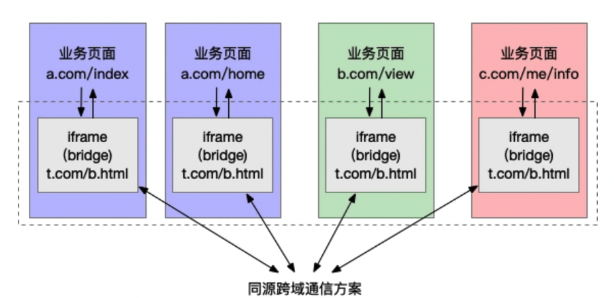

[toc]

# iframe通信

+ 通过postMessage进行通信
+ 发送消息是通过要发送的元素postMessage, window.iframe1.contentWindow.postMessage, window.parent.postMessage('world', '*')
+ 接收消息是通过监听message事件
+ postMessage有跨域限制


代码如下

```html
//a页面
<body>
  <p>
    这里是父级页面a
    <button id = "btn1">发送信息给b</button>
  </p>
  <iframe id="iframe1" src="./b.html"></iframe>
</body>
<script>
  const btn = document.getElementById('btn1');
  btn1.addEventListener('click',()=>{
    console.log('父级页面a发送信息')
    window.iframe1.contentWindow.postMessage('hello','*')
    //第一个参数是内容，第二个参数可以限制发给哪些域，不是所有url都可以接收到这个消息
  })
  window.addEventListener('message', (e) => {
    console.log('父级页面a接收信息')
    console.log('origin', e.origin, e.data)
    //e.origin可以判断发送过来消息的源，判断是否合法
  })
</script>
```

```html
//b页面
<body>
  <p>
    这里是内嵌页面b
    <button id="btn1">发送信息给a</button>
  </p>
</body>
<script>
  const btn = document.getElementById('btn1');
    btn1.addEventListener('click', () => {
      console.log('内嵌页面b发送信息')
      window.parent.postMessage('world', '*')
    })
    window.addEventListener('message', (e) => {
      console.log('内嵌页面b接收信息')
      console.log('origin', e.origin, e.data)
    })
</script>
```

# 同源页面通信

满足同源策略，同一原始域和用户代理下的所有窗口、iFrames等进行交互，属于同源通信。(比如两个同源的tab页面进行通信)

### 1.BroadcastChannel

使用的场景，如，用户同时依次打开某个网站的几个页面，然后在其中一个页面 A进行登录操作，那么其他的页面就可以通过 BroadcastChannel收到来自页面 A的登录状态，从而能够完成多个页面自动同步登录状态的目的。

```js
//发送页面
const cast = new BroadcastChannel('mychannel')
// data 可以是任何 JS数据类型
const data = 'I\'m from Page A'
// 广播信号
cast.postMessage(data)
```

```js
//接收页面
// B页面监听同源下所有页面发送出的“广播”
//  BroadcastChannel的参数，即channel号必须与想要监听的广播源相同，这里是 mychannel
const cast = new BroadcastChannel('mychannel')
// 接收信号
cast.onmessage = function (e) {
  console.log(e.data) // => I'm from Page A
}
// 关闭连接
cast.close()
```

### 2.postMessage(支持跨域)

### 3.Localstorage

Chrome、Edge等浏览器下的这个 storage事件必须由其他同源页面触发

```js
// A页面
window.onstorage = function(e) {
  console.log(e.newValue); // previous value at e.oldValue
};
// B页面
localStorage.setItem('key', 'value');
```

注意：设置相同的localstorage只会在发生改变时触发

```js
localStorage.setItem('lily', '7');
localStorage.setItem('lily', '7');
```

接收到的e

```js
//主要通过e.newValue获取
isTrusted: true, key: "lily", oldValue: "7", newValue: "8", url: "https://www.nowcoder.com/interview/ai/cover?jobTagId=644".....
```

### 4.SharedWorker

Web worker分为两种：专用线程 dedicated web worker、共享线程 shared web worker 专用线程随当前页面的关闭而结束；这意味着 专用线程只能被创建它的页面访问；与之相对应的 共享线程可以被多个页面访问（包括多个标签页和 iframe），不过这些页面**必须是同源的**，即 共享线程支持的是 同源通信

```js
// worker.js
// 共享的数据
let shareData = 0
// 监听主线程的连接
onconnect = function(e) {
  const port = e.ports[0]
  port.onmessage = function(e) {
    if (e.data === 'get') {
      // 向连接的主线程发送信号
      port.postMessage(shareData)
    } else {
      // 将主线程发来的数据设置为 worder内的 共享数据
      shareData = e.data
    }
  }
}
```

A页面设置 SharedWorker中的数据字段

```js
<input type="text" id="textInput" />
<input type="button" value="设置共享数据" />

<script>
  const worker = new SharedWorker('worker.js')
  const inputEle = document.querySelector('#textInput')

  inputEle.onchange = () => {
    console.log('Message posted to worker')
    // 向 worker 发送数据信号
    worker.port.postMessage(inputEle.value)
  }
</script>
```

B页面获取 SharedWorker中的数据字段

```js
<div id="result"></div>
<button id="btn">获取 SharedWorker中的共享数据</button>
<script>
  const worker = new SharedWorker('worker.js')
  var result = document.querySelector('#result')
  // 发送获取获取 SharedWorder 中共享数据的请求
  document.getElementById('btn').addEventListener('click' , () => {
    // 向 worker发送信号
    worker.port.postMessage('get')
  })
  // 接收从 SharedWorder发送来的共享的数据
  worker.port.onmessage = e => {
    console.log('Message received from worker')
    // 在页面上显示获取到的 worker共享数据
    result.textContent = e.data
  }
</script>
```

最终，在 A页面中设置的值，或被 B页面获取到， **像是存储**，一个页面在公共区域存了一个数据，另外一个页面想要了，需要主动发送get去获取，可能并不是适合于页面通信，当然了，SharedWorker本来就不是用于页面通信的，所以没有预期的效果也是情有可原的.

### 5.websocket

要用到websocket的服务器，后端广播

### 6.IndexDB(支持跨页面)

IndexedDB 是一种低级 API，用于客户端**存储大量结构化数据**(包括 文件、blobs)，该API使用索引来实现对该数据的高性能搜索，区别于 LocalStorage只能存储字符串，IndexedDB可以存储 **JS所有的数据类型**，包括 null、undefined等，是 HTML5规范里新出现的 API IndexedDB 是一种使用浏览器存储大量数据的方法.它创造的数据可以被查询，并且**可以离线使用**。IndexedDB对于那些需要存储大量数据，或者是需要离线使用的程序是非常有效的解决方法

```
与 Shared Worker 方案类似，消息发送方将消息存至 IndexedDB 中；接收方（例如所有页面）则通过轮询去获取最新的信息。
```


# 跨域


## 什么是跨域

浏览器有同源策略，不允许ajax访问其他接口，主要防止CSRF攻击，因为如果一个网站登录状态，其他网站没有同源限制，可以通过ajax获取到数据，不安全。

而且其出现主要是由于前后端分离，早期前后端代码部署在同一个服务器，后来逐渐分开了web服务器，数据服务器，资源服务器等等等。。

- 跨域条件：协议，域名，端口有一个不同就是跨域，即便两个不同的域名指向同一个ip地址，也非同源。
- 有三个标签允许跨域加载资源

```
 // 用于打点统计
<link href = xxx>
<script src=xxx>
// link script可以引用CDN的对象，比如boot.cdn.xxx
// script 可以用于JSONP
```

- 跨域限制

```
Cookie、LocalStorage、IndexedDB 等存储性内容
DOM 节点
AJAX 请求发送后，结果被浏览器拦截了
```

## 跨域方式

### 1.JSONP

JSONP原理

- 加载http...../ch.html
- 服务器不一定真正有一个ch.html,因为服务器可以根据请求，动态生成一个文件返回，同理，js文件可能不存在
- 返回内容格式callback(...),是一个函数，注意使用名称要一致

#### 简单应用

```js
//客户端获取其他源的内容
<script type="text/javascript">
    function jsonp(data){
       console.log('data',data)//data {num1: "js", num2: "json"}
}
</script>

<script type="text/javascript" src="a.json?callback=jsonp"></script>  
// a.json中
jsonp({"num1":"js","num2":"json"})
//发送内容给服务端，服务端再设置，读取num这个值
<script type="text/javascript">
    function jsonp(data){
       console.log('发送成功')
}
</script>
<script type="text/javascript" src="http://api.com?num=1&callback=jsonp"></script>  
```

#### 用promise封装

动态创建script，callback=func,后端 拼接为func(data)

```js
// index.html
function jsonp({ url, params, callback }) {
  return new Promise((resolve, reject) => {
    let script = document.createElement('script')
    window[callback] = function(data) {
      resolve(data)
      document.body.removeChild(script)
    }
    params = { ...params, callback } // wd=b&callback=show
    let arrs = []
    for (let key in params) {
      arrs.push(`${key}=${params[key]}`)
    }
    script.src = `${url}?${arrs.join('&')}`
    document.body.appendChild(script)
  })
}
jsonp({
  url: 'http://localhost:3000/say',
  params: { wd: 'Iloveyou' },
  callback: 'show'
}).then(data => {
  console.log(data)
})
```

上面这段代码相当于向http://localhost:3000/say?wd=Iloveyou&callback=show这个地址请求数据，然后后台返回show('我不爱你')，最后会运行show()这个函数，打印出'我不爱你'

```js
// server.js
let express = require('express')
let app = express()
app.get('/say', function(req, res) {
  let { wd, callback } = req.query
  console.log(wd) // Iloveyou
  console.log(callback) // show
  res.end(`${callback}('我不爱你')`)
})
app.listen(3000)
```

#### 缺点

- jsonp:支持浏览器与服务器双向通信，兼容性好，但是只支持get，有get的缺点

### 2.服务端设置http header

```
response.setHeader("Access-Control-Allow-Origin","http....ch.com,...")//允许跨域的域名
response.setHeader("Access-Control-Allow-Headers","X-Requested-With")
response.setHeader("Access-Control-Allow-Method","PUT,POST")

response.setHeader("Access-Control-Allow-Credentials","true")//接收跨域的cookie
```

### 3.postmessage

- postmessage要通过window使用
- 传值用window.postmessage,获取值用addEventListener('message',function(){})
- window.opener.postMessage
- iframe.contentWindow.postMessage

```js
 http://localhost:3000/a.html页面向http://localhost:4000/b.html传递“我爱你”,然后后者传回"我不爱你"。
 
// a.html，a中嵌入b，a通过iframe发送信息
<iframe src="http://localhost:4000/b.html" frameborder="0" id="frame" onload="load()"></iframe> //等它加载完触发一个事件
//内嵌在http://localhost:3000/a.html
<script>
  function load() {
    let frame = document.getElementById('frame')
    frame.contentWindow.postMessage('我爱你', 'http://localhost:4000') //发送数据
    window.onmessage = function(e) { //接受返回数据
      console.log(e.data) //我不爱你
    }
  }
</script>

// b.html
  window.onmessage = function(e) {
    console.log(e.data) //我爱你
    e.source.postMessage('我不爱你', e.origin)
 }
```

新开窗口的例子

```js
//A页面通过 window.open获得 B页面的句柄，向 B页面发送信号，并监听 B页面回传回来的信号
<!-- A页面 -->
<div id="msg"></div>
<script>
  window.onload = () => {
    var opener = window.open('http://127.0.0.1:9001/b.html')
    // setTimeout 是为了等到真正获取到 opener的句柄再发送数据
    setTimeout(() => {
      // 只对 域名为 http://127.0.0.1:9001的页面发送数据信号
      opener.postMessage('red', 'http://127.0.0.1:9001');
    }, 0)
    
    window.addEventListener('message', event => {
      if(event.origin === 'http://127.0.0.1:9001'){
        document.getElementById('msg').innerHTML = event.data
      }
    })
  }
</script>
```

B页面接收 A页面的信号，并通过事件句柄反向对 A页面发送数据信号

```js
<div id="box">color from a.html</div>
<script type="text/javascript">
  window.addEventListener('message', event => {
    // 通过origin属性判断消息来源地址
    // 只有当数据信号来源于 http://127.0.0.1:9001的服务器才接收
    if(event.origin === 'http://127.0.0.1:9001'){
      // 获取信息员的数据信号
      document.getElementById('box').style.color = event.data
      // 通过 event.source向信号源反向发送数据
      event.source.postMessage('got your color!', event.origin)
    }
  })
</script>
```

postmessage的方法需要验证源

```js
//iframe的例子
//父向子页面传值
//父页面
var o=document.getElementsByTagName('iframe')[0];
o.contentWindow.postMessage('Hello World',"*");
//子页面
window.addEventListener('onmessage',function(e){ 
  if(e.domain=='1.com'){
    if(e.data=='Hello World'){
         e.source.postMessage('Hello',"*");
         //反过来向父页面传消息
    }else{
      alert(e.data);
}
}
})
```



页面与 iframe 通信非常简单，首先需要在页面中监听 iframe 发来的消息，做相应的业务处理：

```
/* 业务页面代码 */
window.addEventListener('message', function (e) {
    // …… do something
});
```

当页面要与其他的同源或非同源页面通信时，会先给 iframe 发送消息：

```
/* 业务页面代码 */
window.frames[0].window.postMessage(mydata, '*');
```

iframe 收到消息后，会使用某种跨页面消息通信技术在所有 iframe 间同步消息，例如下面使用的 Broadcast Channel：

```
/* iframe 内代码 */
const bc = new BroadcastChannel('AlienZHOU');
// 收到来自页面的消息后，在 iframe 间进行广播
window.addEventListener('message', function (e) {
    bc.postMessage(e.data);
});    
```

其他 iframe 收到通知后，则会将该消息同步给所属的页面：

```
/* iframe 内代码 */
// 对于收到的（iframe）广播消息，通知给所属的业务页面
bc.onmessage = function (e) {
    window.parent.postMessage(e.data, '*');
};
```

### 4.websocket

```
var ws=new WebSocket('wss/....org')
ws.onopen=function(e){
    ws.send('...')
}
ws.onmessage=function(e){
    console.log(e.data)
    ws.close()
}
ws.onclose=function(){}
```

### 5.document.domain主域相同而子域不同

- 在http://www.a.com/a.html和http://script.a.com/b.html两个文件中分别加上document.domain = ‘[a.com](http://a.com/)’；然后通过a.html文件中创建一个iframe，去控制iframe的contentDocument

```
//a.html
document.domain = 'a.com';
var ifr = document.createElement('iframe');
ifr.src = 'http://script.a.com/b.html';
ifr.style.display = 'none';
document.body.appendChild(ifr);
ifr.onload = function(){
    var doc = ifr.contentDocument || ifr.contentWindow.document;
    // 在这里操纵b.html
    alert(doc.getElementsByTagName("h1")[0].childNodes[0].nodeValue);
};

//b.html
document.domain = 'a.com';
```

### 6. Node中间件代理(两次跨域)

同源策略是浏览器需要遵循的标准，而如果是服务器向服务器请求就无需遵循同源策略。
