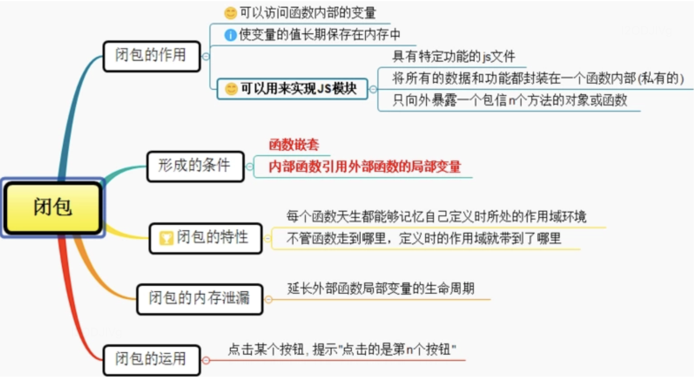

[toc]

# 执行上下文

全局代码、函数代码、eval代码,JS会进行一个“准备工作”，比如变量提升。<span style="background-color: yellow;">是当前js代码被解析和执行时所处的环境</span>就是执行上下文。

## 执行上下文栈

- JavaScript执行在单线程上，所有的代码都是排队执行。
- 一开始浏览器执行全局的代码时，首先创建全局的执行上下文，压入执行栈的顶部。
- 每当进入一个函数的执行就会创建函数的执行上下文，并且把它压入执行栈的顶部。当前函数执行完成后，当前函数的执行上下文出栈，并等待垃圾回收。
- 浏览器的JS执行引擎总是访问栈顶的执行上下文。全局上下文只有唯一的一个，它在浏览器关闭时出栈。

## 2.执行上下文的类型

+ 全局执行上下文，
创建一个全局对象，在浏览器中这个全局对象就是 window 对象。一个程序中只能存在一个全局执行上下文。
+ 函数执行上下文，每次调用函数时，都会为该函数创建一个新的执行上下文。每个函数都拥有自己的执行上下文，但是只有在函数被调用的时候才会被创建。
+ Eval执行上下文

## 3.执行上下文的生命周期

创建阶段→执行阶段→回收阶段

```js
1.函数执行，执行上下文入栈
2.上下文创建
（1）生成变量（只有arguments有值）
（2）生成作用域
（3）确定this指向
2.上下文执行
（1）变量赋值
 (2) 函数引用
（3）执行其他代码
3.函数执行完毕，执行上下文出栈
```

## 4.变量对象
+ 变量对象(VO)：执行环境中定义的所有变量和函数
+ 活动对象(AO):活动对象是在进入函数上下文时刻被创建的，它通过函数的 arguments 属性初始化

```
1.全局上下文的变量对象初始化是全局对象
2.函数上下文的变量对象初始化只包括 Arguments 对象
3.在进入执行上下文时会给变量对象添加形参、函数声明、变量声明等初始的属性值
4.在代码执行阶段，会再次修改变量对象的属性值
```
例子

```js
function foo() {
    console.log(a); 
    a = 1;
}
foo(); // Uncaught ReferenceError: a is not defined,活动对象只有argument

function bar() {
    a = 1;
    console.log(a);
}
bar(); // 1，在全局作用域找到了
```


# 作用域

## 分类

+ 全局作用域
+ 函数作用域
+ 块级作用域

## 自由变量

+ 一个变量在当前作用域没有被定义，但是被使用了
+ 向上级作用域，一层一层寻找，直到找到为止
+ 全局作用域还没找到，报错XXX is not defined

## this

this：要在函数被执行才能确定指向，执行上下文被创建时才能确认值，会根据执行上下文变化而发生指向的改变。

### 判断this的指向

+ 优先级new
+ call/apply/bind
+ obj.foo()
+ foo 这种调用方式
+ 箭头函数的 this 一旦被绑定，就不会再被任何方式所改变

```js
function fn(){
  console.log('[log]', this)
}
fn() // window

fn.call({x:100}) //{x:100}
cosnt fn2 = fn.bind({x:200})
fn2()  //{x:200}

const test = {
   name: 'test',
   sayHi(){
     console.log('[log]this', this) // 当前对象
   }
  wait(){
    setTimeout(function(){
      console.log('[log]this', this) // 执行时候this已经指向window
    })
  }
  wait2(){
    setTimeout(()=>{
      console.log('[log]this', this) // 当前对象，箭头函数this永远指向定义时候的作用域
    })
  }
}
```

### 箭头函数的this

箭头函数其实是没有 this 的，箭头函数中的 this 只取决包裹箭头函数的第一个普通函数的 this

```js
function a() { 
    return () => { 
        return () => { 
            console.log(this) 
        } 
        }}
console.log(a()()())//Window{postMessage: ƒ, blur: ƒ, focus: ƒ, close: ƒ, parent: Window,…}
```

包裹箭头函数的第一个普通函数为a函数，因此this为windows

### new的this

```js
function fn(){
    console.log(this.a)
}
var c=new fn() //undefined
```

this被永远绑定在了c上，结果为undefined

### bind,apply,call的实现

由第一个绑定的参数决定，方法.call(this的绑定对象), 如果传入为空，null,undefined，指向为window

+ fn.apply(obj,arguments) 或者 fn.apply(obj,[a,b,c])
+ fn.call(obj,a,b,c)
+ fn.bind(obj)

```js
let a = {} 
let fn = function () { console.log(this) } 
fn.bind().bind(a)() // windows
```

第一个绑定为空，因此this仍然为window

```js
let a = { name: 'yck' } 
function foo() { console.log(this.name) } 
foo.bind(a)() // => 'yck'
```

```js
function fn1(name){
    alert(name)  //zhangsan
    console.log(this.name) //undefined
}
fn1.call({x:100},'zhangsan')
用call里的第一个参数作为this的值 
```

### 元素绑定事件，事件触发后，执行的函数中的this，指向的是当前元素

```js
window.onload = function() {
  let $btn = document.getElementById('btn');
  $btn.onclick = function(){
    alert(this); // this -> 当前触发
  }
}
```

### call的实现

 fn.call(obj,a,b,c)要把函数fn的this绑定到对象obj上，让obj可以指向fn

 + 函数原型上添加myCall方法
 + context为传入的对象或者没有，传入默认为window对象
 + 把函数fn的this赋值给context.fn,使得传入的对象可以执行fn
 + 获取参数，slice(1)之后的为参数
 + 执行
 + 删除context.fn,返回

传入obj,arg1,arg2,...

```js
Function.prototype.myCall = function(context){ 
  if (typeof this !== 'function') {
    throw new TypeError('Error') 
  } 
  context = context || window 
  context.fn = this //this为函数fn的this
  const args = [...arguments].slice(1) 
  const result = context.fn(...args)
  delete context.fn 
  return result
}
```

### apply()实现

传入obj,arguments,arguments可能没有传入，需要判断

```js
Function.prototype.myApply = function(context) { 
  if (typeof this !== 'function') { 
    throw new TypeError('Error')
  } 
  context = context || window
  context.fn = this 
  let result 
  // 处理参数和 call 有区别 
  if (arguments[1]) { 
    result = context.fn(...arguments[1])
    } else {
    result = context.fn()
  } 
  delete context.fn 
  return result
} 
```

### bind()实现

+ bind返回的是一个函数
+ bind的参数可以分多次传入

```js
Function.prototype.bind = function(){
  // fn.bind的fn
	var fn = this;
  // 参数解析为数组
	var args = Array.prototye.slice.call(arguments);
  // 第一个参数是要绑定的函数
	var context = args.shift();

	return function(){
		return fn.apply(context, args.concat(Array.prototype.slice.call(arguments)));
	};
};
```

```
不需要额外设置属性
```


# 作用域链

 作用域，是指变量的生命周期（一个变量在哪些范围内保持一定值）。
+ 作用域是指程序源代码中定义变量的区域。
+ 作用域规定了如何查找变量，也就是确定当前执行代码对变量的访问权限。
+ JavaScript 采用词法作用域(lexical scoping)，也就是静态作用域，函数的作用域在函数**定义的时候**就决定了

```js
var value = 1;

function foo() {
    console.log(value);
}

function bar() {
    var value = 2;
    foo();
}

bar();

// 结果是1，执行foo(),先从 foo 函数内部查找是否有局部变量 value，如果没有，就根据书写的位置，查找上面一层的代码，也就是 value 等于 1，所以结果会打印 1。
```

+ 没有块级作用域
+ 延长作用域链，with，try...catch

```js
//with，指定的对象location被添加到作用域链的顶端
with(location){
    var url=href //q其实是location.herf
}
```

## 1.块级作用域

没有块级作用域的缺点
+ 全局污染

```
可能引入第三方插件，里边有一个全局变量，自己写的代码也定义了全局同名变量，就会造成影响
===》严格模式，不声明就会出错
```
+ 代码污染

```js
var i=99
for(var i=0;i<5;i++){
console.log(i)//0 1 2 3 4
}
console.log(i) //5
```
+ 变量提升造成影响

```js
 变量会提升到window,使得window的属性受到到影响
var screenLeft='gg'
console.log(window.screenLeft) 影响原有的属性
```

创造块级作用域
+ function立即执行函数

```JS
（function(){
   var $=(window.$={})
   $.web='hi
}.bind(window)()）
// 外部只能$.web访问
```
+ let的块级作用域

```
{
  let web='hi'
}
```

## 作用域链

 在编译的时候确定的

当查找变量的时候，会先从当前上下文的变量对象中查找，如果没有找到，就会从父级(词法层面上的父级)执行上下文的变量对象中查找，一直找到全局上下文的变量对象，也就是全局对象。这样由**多个执行上下文的变量对象构成的链表**就叫做作用域链。

函数的作用域在函数定义的时候就决定了。
这是因为函数有一个内部属性 **[[scope]]**，当函数创建的时候，就会**保存所有父变量对象到其中**，你可以理解 [[scope]] 就是所有父变量对象的层级链，但是注意：[[scope]] 并不代表完整的作用域链！

```js
 
function foo() {
    function bar() {
        ...
    }
}
// 函数创建时

foo.[[scope]] = [
  globalContext.VO
];

bar.[[scope]] = [
    fooContext.AO,
    globalContext.VO
];
```


# 闭包



## 1.闭包是什么

函数作为参数被传递

```js
function print(fn){
  let a=200
  fn()
}

let a = 100
function fn(){
  console.log(a)
}
print(fn) // 返回100，自由变量是在函数被定义的地方寻找（自由变量：函数内部没有的变量）
```

函数作为返回值被返回

```js
function create(){
  let a = 100
  return function(){
    cosnole.log(a)
  }
}

let fn  = create()
let a= 200
fn()  // 返回100，自由变量是在函数被定义的地方寻找（自由变量：函数内部没有的变量）
```


```js
var a=200;
function f1(){
    var a = 999;
    function f2(){
      console.log(a);
    }
    return f2; // f1返回了f2的引用
}
var result = f1(); // result就是f2函数了
result(); //输出999
```

闭包就是函数f2，即能够读取其他函数内部变量的函数。由于在JavaScript语言中，只有函数内部的子函数才能读取内部变量，因此可以把闭包简单理解成“定义在一个函数内部的函数”。闭包最大的特点，就是它可以“记住”诞生的环境，比如f2记住了它诞生的环境f1，所以从f2可以得到f1的内部变量。

## 2.闭包的内存泄露

一般情况下，函数执行会形成一个新的私有的作用域，当私有作用域中的代码执行完成后，我们当前作用域都会主动的进行释放和销毁。 但当遇到函数执行返回了一个引用数据类型的值，并且在函数的外面被一个其他的东西给接收了，这种情况下一般形成的私有作用域都不会销毁。比如闭包返回引用类型的值function

```JS
function fn(){
  var num=100;
  return function(){
   }
}
var f=fn();

// 解决方法，让引用类型的值指向null

function outer(){
  var num=0;
  return function add(){
     num++;//内部函数有引用，作为add函数的一部分了
     console.log(num);
  };
 }
 
var func1=outer();
func1();//实际上是调用add函数， 输出1
func1();//输出2 因为outer函数内部的私有作用域会一直被占用
var func2=outer();
func2();// 输出1  每次重新引用函数的时候，闭包是全新的。
func2();// 输出2 
```

## 3.实际开发中闭包的应用

### 模仿块级作用域

外界不能访问,创建JS模块

```html
//index.html文件
<script type="text/javascript" src="myModule.js"></script>
<script type="text/javascript">
  myModule2.doSomething()
  myModule2.doOtherthing()
</script>
```


```js
//myModule.js文件
(function () {
  var msg = 'Beijing'//私有数据
  //操作数据的函数
  function doSomething() {
    console.log('doSomething() '+msg.toUpperCase())
  }
  function doOtherthing () {
    console.log('doOtherthing() '+msg.toLowerCase())
  }
  //向外暴露对象(给外部使用的两个方法)
  window.myModule2 = {
    doSomething: doSomething,
    doOtherthing: doOtherthing
  }
})()
```

### 构造私有变量

外界不能访问,需要暴露接口，只能用构造函数的方式暴露接口

```js
function Person(){
    var name;
    this.setName=function(value){
        name=value
    }
    this.getName=function(){
        return name
    }
}

var person=new Person()
console.log(person.name) //undefined
console.log(person.setName('lili')) //undefined
console.log(person.getName()) //lili
console.log(person.name) //undefined
```

### 单例模式(只有一个实例)

```js
function SetManager(name) {
    this.manager = name;
}

SetManager.prototype.getName = function() {
    console.log(this.manager);
};

var SingletonSetManager = (function() {
    var manager = null;
    return function(name) {
        if (!manager) {
            manager = new SetManager(name);
        }
        return manager;
    } 
})();

SingletonSetManager('a').getName(); // a
SingletonSetManager('b').getName(); // a
SingletonSetManager('c').getName(); // a
```

### 解决setTimeout类似问题

var定义函数问题

```js
//每隔1000ms输出一个6，因为 setTimeout是异步函数，先执行循环得到作用域中i为6
  for (var i = 1; i <= 5; i++) { 
       setTimeout(function timer() { 
            console.log(i) 
       },i*1000)
  }

// 原因：var没有块级作用域，放在了window下，为6，然后再执行5次setTimeout
```

解决方法：制造函数作用域

```js
//1.闭包，将i传入了函数内部
  for (var i = 1; i <= 5; i++) { 
      (function(j){
        setTimeout(function timer() { 
            console.log(j) 
       },j*1000)
      })(i)
  }//1 2 3 4 5
```

```js
// 2.let每次循环都创建了独立的作用域,再独立作用域里执行setTimeout
  for (let i = 1; i <= 5; i++) { 
       setTimeout(function timer() { 
            console.log(i) 
       },i*1000)
  }//1 2 3 4 5
```

```js
// 3.setTimeout函数本身第三个参数
  for (let i = 1; i <= 5; i++) { 
       setTimeout(function timer(j) { 
            console.log(j) 
       },i*1000,i)
  }//1 2 3 4 5
```

示例：创建10个a, 点击弹出序号

```js
let a
for(let i-0;i<10;i++){
   a = document.createElement('a')
   a.innerHTML =i
   a.addEventListener('click',function(e){
     e.preventDefault()
     alert(i)
   })
}
// 注意循环不能用var，否则会弹出最后的结果10，而不是i, 需要块级作用域
```


