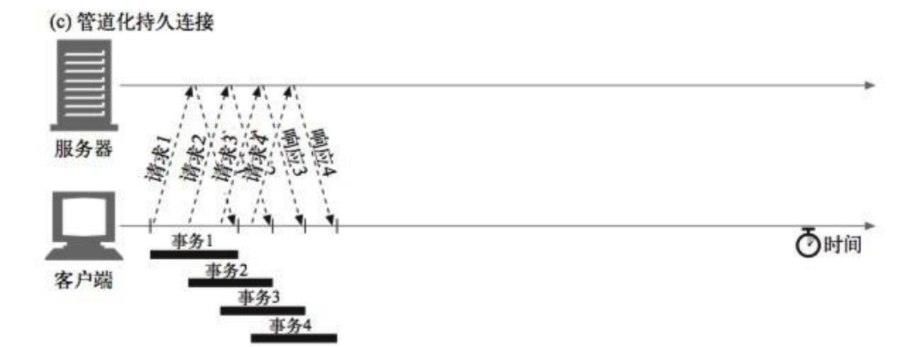

[toc]
# 网络相关
## 网络请求

### 简单请求

- 使用下列方法之一：

```
GET HEAD POST
```

- Content-Type 的值仅限于下列三者之一：

```
text/plain
multipart/form-data
application/x-www-form-urlencoded 
```

- HTTP头

```
只能是 Accept/ Accept-Language/
Conent-Language/ Content-Type 等 
```

简单请求就是普通 **HTML Form 在不依赖脚本的情况下**可以发出的请求

### 简单请求跨域请求

+ 浏览器直接发出CORS请求， 就是在头信息之中，增加一个`Origin`字段

+ 服务器返回响应

  + 如果服务器允许Origin源请求， 则在响应头中带

    ```js
    Access-Control-Allow-Origin: http://api.bob.com
    // 请求的时候xhr.withCredentials = true， 是否允许携带cookie信息
    Access-Control-Allow-Credentials: true  
    Access-Control-Expose-Headers: FooBar
    Content-Type: text/html; charset=utf-8
    ```

### 复杂请求

普通 HTML Form 无法实现的请求， 需要其他请求方法， 比如 PUT 方法、需要其他的内容编码方式、自定义头之类的。 对于复杂请求来说，首先会发起一个预检请求， 该请求是 option 方法的

复杂请求能否加速

优化OPTIONS预检请求的发送，CORS中**Access-Control-Max-age**可以设置缓存的时间，表示多少秒内不会对同一个非简单请求去发送预检请求，这样的话就能够减少重复多次发送options请求的往返时间

### ajax、fetch和axios

+ ajax(asynchronous js and XML)一种技术统称

```js
function getXHR(){
  var xhr = null;
  if(window.XMLHttpRequest) {// 兼容 IE7+, Firefox, Chrome, Opera, Safari
    xhr = new XMLHttpRequest();
  } else if (window.ActiveXObject) {
    xhr = new ActiveXObject();
  }else{
      alert('您的浏览器不支持ajax请求')
  }
  return xhr;
}

var xhr = getXHR();
xhr.open('GET', 'https:baidu.com',true);  //设置请求方式，url，以及是否异步
xhr.onreadystatechange=function(){   //设置回调监听函数
   if(xhr.readyState==4){
        if(xhr.status==200){
            var data=xhr.responseText;
            console.log(data);
   }
  }
}

xhr.onerror = function() {
  console.log("Oh, error");
};
xhr.send();  //发送请求
```

+ Fetch:浏览器原生的api,和XMLHttpRequest是一个级别的，支持promise

```
function ajax2(url){
  return fetch(url).then(res=>res.json())
}
```

+ axios:第三方库,内部是使用XMLHttpRequest和fetch实现的

### 发送数据埋点请求的时候为什么使用的是 1x1 像素的透明 gif 
主要应用于只需要向服务器发送数据(日志数据)的场合，且无需服务器有消息体回应。比如收集访问者的统计信息。

一般做法是服务器用一个1x1的gif图片来作为响应，当然这有点浪费服务器资源。因此用header来响应比较合适，目前比较合适的做法是服务器发送"204 No Content"，即“服务器成功处理了请求，但不需要返回任何实体内容”。

另外该脚本的位置一般放在页面最后以免阻塞页面渲染,并且一般情况下也不需要append到DOM中。通过它的onerror和onload事件来检测发送状态。

```
<script type="text/javascript">
 var thisPage = location.href;
 var referringPage = (document.referrer) ? document.referrer : "none";
 var beacon = new Image();
 beacon.src = "http://www.example.com/logger/beacon.gif?page=" + encodeURI(thisPage)
 + "&ref=" + encodeURI(referringPage);
</script>
```
这样做和ajax请求的区别在于：
+ 1.只能是get请求，因此可发送的数据量有限。
+ 2.只关心数据是否发送到服务器，服务器不需要做出消息体响应。并且一般客户端也不需要做出响应。
+ 3.实现了跨域。
+ 简单、安全、相比PNG/JPG体积小，1px 透明图，对网页内容的影响几乎没有影响，这种请求用在很多地方，比如浏览、点击、热点、心跳、ID颁发等等（最小的BMP文件需要74个字节，PNG需要67个字节，而合法的GIF，只需要43个字节）
************
## 七层协议
+ 应用层：为特定应用程序提供数据传输服务， FTP,SMTP,SNMP.
+ 表示层：对上层信息进行变换，保证一个主机应用层信息被另一个主机的应用程序理解，表示层的数据转换包括数据的加密、压缩、格式转换。
+ 会话层：管理主机之间的会话进程，即负责建立、管理、终止。
+ 传输层：提供端对端的接口，TCP ,UDP,UGP 
+ 网络层：为数据包选择路由，IP,ICMP（Internet控制报文协议）,IGMP ,OSPF内部网关协议
+ 数据链路层， 传输有地址的帧，错误检测功能ARP,RARP 
+ 物理层，传输有地址的帧，错误检测功能
### 基于TCP的协议
+ 21/tcp FTP 文件传输协议
+ 25/tcp SMTP 简单邮件传输协议
+ 80/tcp HTTP 超文本传送协议 (WWW)
+ Telnet：它是一种用于远程登陆的端口
+ POP3：Post Office Protocol 3的简称,即邮局协议的第3个版本，它是和SMTP对应，POP3用于接收邮件。

### 基于UDP的协议
+ DNS：用于域名解析服务（因为无连接，速度快）
+ SNMP：简单网络管理协议，使用161号端口，是用来管理网络设备的。由于网络设备很多，无连接的服务就体现出其优势。
+ OICQ：OICQ程序既接受服务，又提供服务，这样两个聊天的人才是平等的。
+ RIP：路由选择信息协议（RIP）是一种在网关与主机之间交换路由选择信息的标准

# 运输层TCP/UDP

IP层只负责主机到主机，实际上是应该实现端到端，进程之间的通信，使用端口号标识不同的进程，因为不同的主机，进程标识符可能不同，需要进行格式上的统一，使用套接字进行标识

```js
socket=<IP地址：端口号>
```
## 1.TCP与UDP区别

| TCP                    | UDP                                |
| ---------------------- | ---------------------------------- |
| 字节流，有序           | 报文，无序（既不合并，也不拆分）   |
| 面向连接               | 面向无连接、                       |
| 单播                   | 单播，多播，广播                   |
| 拥塞控制，可靠         | 没有拥塞控制，恒定速度发送，不可靠 |
| 头部开销较大，20个字节 | 头部开销小，8个字节                |
## 2.TCP如何保证可靠连接

不错，不丢，不乱
+ 差错检测：TCP将保持它首部和数据的检验和。这是一个端到端的检验和，目的是检测数据在传输过程中的任何变化。如果收到段的检验和有差错，TCP将丢弃这个报文段和不确认收到此报文段（希望发端超时并重发）。
+ 超时重发和确认机制：当TCP发出一个报文段后，它启动一个定时器，等待目的端确认收到这个报文段。如果不能及时收到一个确认，将重发这个报文段。当TCP收到发自TCP连接另一端的数据，它将发送一个确认。
+ 缓存机制：每个分组都会有一个序列号，对于后一个序列号分组先到的情况，接收端会先进行缓存，等待前一个序列号到达，然后一起交付上层。
+ 对失序数据进行重新排序，然后才交给应用层
既然TCP报文段作为IP数据报来传输，而IP数据报的到达可能会失序，因此TCP报文段的到达也可能会失序。 如果必要，TCP将对收到的数据进行重新排序，将收到的数据以正确的顺序交给应用层。
+ 对于重复数据，能够丢弃重复数据
既然IP数据报会发生重复，TCP的接收端必须丢弃重复的数据。

## 3.tcp/ip的并发限制

+ 串行连接：浏览器对同一域名下并发的tcp连接是有限制的（2-10个不等),但在HTTP1.0里，由于HTTP是无连接的(即每次连接只能处理一个请求，收到响应后立即断开连)，需要每个请求都发起一个TCP链接
+ 持久连接：一个TCP链接内允许发送多个HTTP请求，节约资源，但是持久连接采用阻塞模式，下次请求必须等到上次响应返回后才能发起，如果上次的请求还没返回响应内容，下次请求就只能等着（就是常说的队头阻塞）。
+ 管道化持久连接： 管道化则可以不用等待响应返回而发送下个请求并按顺序返回响应，现代浏览器并未默认开启管道化。管道化持久连接也可以复用同一个tcp连接，并且可以不用等待发出多个http请求，但是==响应必须按顺序==返回。
  
+ HTTP/2.0多路复用：每个HTTP请求都有一个序列标识符，这样浏览器可以并发多个请求，服务器接收到数据后，再根据序列标识符重新排序成不同的请求报文，而不会导致数据错乱。同样，服务端也可以并发返回多个响应给浏览器，浏览器收到后根据序列标识重新排序并归入各自的请求的响应报文。
+ WebSocket： WebSocket是HTML5提出的一种客户端和服务端通讯的全双工协议，由客户端发起请求，建立连接之后不仅客户端可以主动向服务端发送请求，服务端可以主动向客户端推送信息。

## 4.TCP的队头阻塞

HTTP2.0是解决了HTTP的队头阻塞，在同一个TCP链接里可以发送多个请求， 但是TCP 是一种面向流的协议，它按照顺序传输数据，因此在某些情况下，当一个数据包丢失或延迟时，会导致整个连接的数据都被阻塞。也就是TCP层的队头阻塞， 需要使用拥塞算法去解决。

### 流量控制

    在同一时刻，A的发送窗口并不总是和B的接受窗口一样大（网络传输的滞后性和拥塞窗口）
    接收端根据自己当前接受缓存区情况，通过窗口字段控制发送端的发送速率。是个端到端的问题。

### 拥塞控制

网络的各个部分性能不匹配， 拥塞控制就是防止过多的数据注入到网络中，使网络中的路由器或链路不过载。拥塞控制是一个全局性的过程。（流量控制是个端到端的问题）。

+ 慢开始

  ```
  TCP连接刚建立时，会以较小的拥塞窗口开始发送数据，并在每个往返时间内逐渐增加窗口大小，以便测试网络的容量。
  + 从小到大增加cwnd窗口，最开始为一个MSS，每收到一个新报文确认，加一个MSS
  + 初始值等于16个MSS，小于使用慢开始算法， 当出现拥塞（重传计时器超时，就将门限设为当时cwnd的一半。
  ```

+ 拥塞避免

  ```
  一旦慢启动阶段完成，TCP 进入拥塞避免阶段。在这个阶段，拥塞窗口按线性方式增加，以便在网络中找到适当的带宽。
  ```

+ 快重传

  ```
  接收方每收到一个失序的报文段后就立即发送之前正确收到报文段的重复确认包，而不是等待自己发送数据报时才捎带确认。
  发送方只要收到三个重复确认就立即重传对方尚未收到的报文段，而不必等待为丢失的包的重传计时器到期。提高性能百分之20
  ```

+ 快恢复

  ```
  快恢复：当发送方收到3个重复确认时，就将cwnd减半，然后执行拥塞避免算法。而不执行慢开始算法
  ```

+ 超时重传：

  ```
  如果发送方在超时时间内未收到确认，它将重新发送数据。这是一种保守的拥塞控制方法，但在网络非常拥挤时可能导致性能下降。
  ```

### 4.TCP
#### 性能指标
性能指标 RTT。该指标表示发送端发送数据到接收到对端数据所需的往返时间。
#### TCP首部


+ 源端口，目的端口各2字节
+ 序号：4字节，tcp字节流每个字节都按照顺序编号
+ 确认号：4字节，期望对方发来的报文段的第一个数据字节的序号
+ 数据偏移：半个字节 指明首部有多长  因此最长15*4=60字节 （首部长度）
+ 保留：6位，6个控制位，

```
URG（urgent），与紧急指针配合，当URG=1时，应尽快传送，可不按原来的顺序发送
ACK（acknowledge）：在连接建立后所有传送的报文都必须把ACK置为1
PUSH：当PUSH置为1时，提醒接收方快速响应，不必等缓存区满才发送（很少使用）
RST： 为1表示TCP连接出现严重故障，必须释放后重连。还可以用来拒绝一个非法的报文段或拒绝连接
SYN：在连接建立时用来同步序号。当SYN=1，ACK=0时，表明这是一个syn请求连接报文，若对方同意连接，则应在响应的报文段中使SYN=1，ACK=1。SYN=1表示这是一个连接请求或连接接受报文。
FIN：为1时，表示此报文段的发送方的数据已发送完毕，并要求释放运输连接。
```
+ 窗口： 2字节，表明自己的接受窗口，表明从本报文首部的确认号器，自己目前允许对方发送的数据量（流量控制需求) 经常动态变化，最大2的16次方-1,64K
+ 校验和：2字节
+ 紧急指针：2字节，当URG为1时有效，指明紧急数据末尾在报文段中的位置


#### 三次握手


+ 第一次握手
客户端向服务端发送连接请求报文段。该报文段中包含自身的数据通讯初始序号。请求发送后，客户端便进入 SYN-SENT 状态。

+ 第二次握手
服务端收到连接请求报文段后，如果同意连接，则会发送一个应答，该应答中也会包含自身的数据通讯初始序号，发送完成后便进入 SYN-RECEIVED 状态。

+ 第三次握手
当客户端收到连接同意的应答后，还要向服务端发送一个确认报文。客户端发完这个报文段后便进入 ESTABLISHED 状态，服务端收到这个应答后也进入 ESTABLISHED 状态，此时连接建立成功。

```
客户端和服务端存储相同的 cookie，下次握手时发出 cookie 达到减少 RTT 的目的。
```
**为什么要三次握手**


```
1 如果客户端，发送的SYN请求连接在网络中滞留过久，可客户端重传SYN连接，并传完数据关闭连接之后，
之前滞留的SYN到达服务器，服务器以为又建立新的连接，向客户端发送确认，
但客户端不会理睬服务器的请求，而服务器却以为连接建立成功，等待客户端发送数据，浪费资源。
```


```
2 第二次服务端发来的确认报文，客户端没收到，并且客户端不再向服务端请求连接了，服务端却以为建立好了连接，浪费资源。
```

####  四次挥手

+ 第一次握手
若客户端 A 认为数据发送完成，则它需要向服务端 B 发送连接释放请求。
+ 第二次握手
B 收到连接释放请求后，会告诉应用层要释放 TCP 链接。然后会发送 ACK 包，并进入 CLOSE_WAIT 状态，此时表明 A 到 B 的连接已经释 放，不再接收 A 发的数据了。但是因为 TCP 连接是双向的，所以 B 仍旧可以发送数据给 A。
+ 第三次握手B 如果此时还有没发完的数据会继续发送，完毕后会向 A 发送连接释放请求，进入LAST_ACK状态
+ 第四次握手
A 收到释放请求后，向 B 发送确认应答，**此时 A 进入 TIME-WAIT 状态。该状态会持续 2MSL**（大段生存期，指报文段在网络中生存的时 间，超时会被抛弃） 时间，若该时间段内没有 B 的重发请求的话，就进入 CLOSED 状态。

**为什么ACK和FIN要分开发送**
此时ACK表示关闭A向B发送连接，但是B要向A继续发送完自己的信息再关闭B到A的通道

**为什么 A 要进入 TIME-WAIT 状态，等待 2MSL 时间后才进入 CLOSED 状态？**

```
为了保证 B 能收到 A 的确认应答。若 A 发完确认应答后直接进入 CLOSED 状态，如果确认应答因为网络问题一直没有到达，那么会造成 B 不能正常关闭。
```
#### A、B 机器正常连接后，B 机器突然重启，问 A 此时处于 TCP 什么状态

因为B会在重启之后进入tcp状态机的listen状态，只要当a重新发送一个数据包（无论是syn包或者是应用数据），b端应该会主动发送一个带rst位的重置包来进行连接重置，所以a应该在syn_sent状态


#### 滑动窗口协议是TCP协议的精髓：
+ TCP要求接收方必须有累计确认的功能，接收方可以在合适的时候发送确认（推迟时间不应超过0.5秒），也可以在自己有数据发送是捎带上（不常用）。
接收方一般都是采用累积确认的方式。也就是说接收方不必对收到的分组逐个发送确认。而是在收到几个分组后，对按序到达的最后一个分组发送确认。如果收到了这个分组确认信息，则表示到这个分组为止的所有分组都已经正确接收到了。 
+ 累积确认的优点是容易实现，即使确认丢失也不必重传。但缺点是，不能正确的向发送方反映出接收方已经正确收到的所以分组的信息。比如发送方发送了前5个分组，而中间的第3个分组丢失了，这时候接收方只能对前2个发出确认。而不知道后面3个分组的下落，因此只能把后面的3个分组都重传一次，这种机制叫Go-back-N（回退N），表示需要再退回来重传已发送过的N个分组。
+ ARQ（自动重传协议，停等ARQ，go-back-n ARQ，选择ARQ），混合ARQ
    在混合ARQ中，数据报文传送到接收方之后，即使出错也不会被丢弃。接收方指示发送方重传出错报文的部分或者全部信息，将再次收到的报文信息与上次收到的报文信息进行合并，以恢复报文信息。

**超时重传：**
    自适应重传时间(滑动平均RTTS+4RTTd），多次重传倍增。重传时CWND拥塞窗口变为1了，只需要重传一个MSS。
    新的 RTTS = ( 1 - α)×(旧的 RTTS)＋α(新的 RTT 样本)
    新的 RTTD = (1-β)×(旧的RTTD)+β×|RTTS﹣新的 RTT 样本|
    
**选择确认：**
    需在首部选项添加允许SACK选项，不常用
**TCP何时发包：**
    当发送缓存中达到MSS字节时，就组装成TCP报文段发送；
    发送方一个计时器期限到了，将一个长度不超过MSS报文段发送出去
    发送方指定PUSH字段
#### 流量控制：
    在同一时刻，A的发送窗口并不总是和B的接受窗口一样大（网络传输的滞后性和拥塞窗口）
    接收端根据自己当前接受缓存区情况，通过窗口字段控制发送端的发送速率。是个端到端的问题。


# HTTP相关

无状态===> cookie
无连接===> keep-alive/管线化

| HTTP1.0            | HTTP1.1                                            | HTTP2.0                  | HTTP3.0                    |
| ------------------ | -------------------------------------------------- | ------------------------ | -------------------------- |
| 只支持Get,post请求 | 支持缓存、长连接、更多新请求方法、host区分不同服务 | 服务端推送               |                            |
|                    | 队头阻塞                                           | 多路复用                 |                            |
|                    | HTTP头部很大                                       | 头部压缩                 |                            |
|                    | 明文传输                                           | 二进制传输               |                            |
|                    |                                                    | 多路复用丢包需要全部重传 | QUIC只需要重传出问题的请求 |

## 1.HTTP的特点

+ 简单快速：客户向服务器请求服务时，只需传送请求方法和路径。
+ 灵活：HTTP允许传输任意类型的数据对象。
+ 无状态：就是每个请求都是独立的，与前面的请求和后面的请求都是没有直接联系的。协议本身并不保留之前一切的请求或 响应报文的信息。这是为了更快地处理大量事务，确保协议的可伸缩性，而特意把 HTTP 协议设计成如此简单的。
+ 无连接：无连接的含义是限制每次连接只处理一个请求。服务器处理完客户的请求，并收到客户的应答后，即断开连接。采用这种方式可以节省传输时间。

## 2.HTTP版本

### HTTP 1.0

最基本的版本，开启TCP进行请求，请求完毕HTTP关闭，只支持Get,post请求
### HTTP 1.1

+ 加入缓存策略（cache-control/Etag），Entity tag，If-modified-Since, If-Match, If-None-Match
+ 默认开启长连接 keep-alive,一次tcp连接可以多次请求， 请求之间可以并行发送，不用等到上一个请求响应返回才发起下一个请求
+ 部分请求 range，状态码206
+ Host以区分同一个物理主机中的不同虚拟主机的域名
+ 支持新的方法put,delete等

HTTP 1.1缺陷

+ 高延迟--带来页面加载速度的降低，主要原因在于队头阻塞浪费了带宽

```
队头阻塞是指当顺序发送的请求序列中的一个请求因为某种原因被阻塞时，在后面排队的所有请求也一并被阻塞，会导致客户端迟迟收不到数据。
```
队头阻塞解决方案

```
1. 长连接
2. 管线化
3. CSS sprite
4. base64
```

+ 无状态特性--带来的巨大HTTP头部

```
报文Header一般会携带"User Agent""Cookie""Accept""Server"等许多固定的头字段，多达几百字节甚至上千字节
```
+ 明文传输--带来的不安全性
+ 并发数受限

```
连接数过多。我们假设Apache设置了最大并发数为300，因为浏览器限制，浏览器发起的最大请求数为6（Chrome），也就是服务器能承载的最高并发为50，当第51个人访问时，就需要等待前面某个请求处理完成。
```

### HTTP 2.0

+ 多路复用：可以在一个TCP内同时发起多个请求，由帧的标识符进行区分，单个连接上可以并行交错的请求和响应，之间互不干扰
+ 二进制机制：文本的方式传输数据(键值对或者纯文本)==>二进制编码方式
+ header压缩技术

```
使用文本的形式传输 header，在 header 携带 cookie 的情况下，可能每次都需要重复传输几百到几千的字节
 HPACK 压缩格式对传输的 header 进行编码，减少了 header 的大小。
采用了首部表，一个用于存储请求的同公用部分，其它首部表仅存储请求之间的差异部分
```
+ 服务端 Push：主动推送资源，这里的服务端推送指把客户端所需要的css/js/img资源伴随着index.html一起发送到客户端，省去了客户端重复请求的步骤（从缓存中取）
+ 请求优先级（如果流被赋予了优先级，它就会基于这个优先级来处理，由服务器决定需要多少资源来处理该请求。）

### HTTP 3.0

> HTTP/2.0 使用了多路复用，一般来说同一域名下只需要使用一个 TCP 连接。但当这个连接中出现了丢包的情况，那就会导致整个 TCP 都要开始等待重传，也就导致了后面的所有数据都被阻塞了。反而对于 HTTP/1.0 来说，可以开启多个 TCP 连接，出现丢包反倒只会影响其中一个连接，剩余的 TCP 连接还可以正常传输数据。

解决：
+ QUIC（Quick UDP Internet Connections）：基于UDP的协议,不同的流之间的数据传输真正实现了相互独立互不干扰，某个流的数据包在出问题需要重传时，并不会对其他流的数据包传输产生影响。
+ 多路复用： HTTP/2 的多路复用虽然解决了 HTTP/1.x 的请求阻塞问题，但仍然受到 TCP 头部阻塞的影响。由于 QUIC 是基于 UDP 的，因此 HTTP/3 能够避免 TCP 中的头部阻塞问题
+ 纠错机制：QUIC 的丢包恢复机制比 TCP 更为高效。QUIC 可以在丢包情况下快速恢复，不需要等待重传超时，从而降低延迟并提高数据传输的可靠性。


## 3.HTTP报文

请求报文 是由请求行、请求首部和内容实体构成。
响应报文 是由状态行、响应首部和内容实体构成。

#### 请求行


```
 GET /images/logo.gif HTTP/1.1，基本由请求方法、URL、协议版本组成
```
##### 请求方法

+ GET：get方法一般用于获取服务器资源
+ POST：post方法一般用于传输实体主体
+ PUT：put方法一般用于传输文件
+ DELETE：delete方法用于删除文件
+ HEAD：head方法用于获取报文首部，不返回报文主体
+ OPTIONS：options方法用于询问请求URI资源支持的方法
+ TRACE：回显服务器收到的请求，主要用于测试或诊断。
+ CONNECT：HTTP/1.1 协议中预留给能够将连接改为管道方式的代理服务器。
+ PATCH：是对 PUT 方法的补充，用来对已知资源进行局部更新 。

###### head方法

HEAD和GET本质是一样的，区别在于HEAD不含有呈现数据，而**仅仅是HTTP头信息**。有的人可能觉得这个方法没什么用，其实不是这样的。想象一个业务情景：欲判断某个资源是否存在，我们通常使用GET，但这里用HEAD则意义更加明确。
###### put请求
这个方法比较少见。HTML表单也不支持这个。本质上来讲， PUT和POST极为相似，都是向服务器发送数据，但它们之间有一个重要区别，**PUT通常指定了资源的存放位置**，而POST则没有，POST的数据存放位置由服务器自己决定。举个例子：如一个用于提交博文的URL，/addBlog。如果用PUT，则提交的URL会是像这样的”/addBlog/abc123”，其中abc123就是这个博文的地址。而如果用POST，则这个地址会在提交后由服务器告知客户端。目前大部分博客都是这样的。显然，PUT和POST用途是不一样的。具体用哪个还取决于当前的业务场景。

###### options 方法
options请求是用于请求服务器对于某些接口等资源的支持情况的，包括各种请求方法、头部的支持情况，仅作查询使用。是浏览器自发发起的请求，之后才是真正的ajax请求
+ 触发条件

```
1、跨域请求，非跨域请求不会出现options请求
2、自定义请求头
3、请求头中的content-type是application/x-www-form-urlencoded，multipart/form-data，text/plain之外的格式
```


###### get与post的区别
+ GET 请求的请求参数是添加到 head 中，可以在 url 中可以看到；POST 请求的请求参数是添加到BODY中,在url 中不可见。
+ GET 请求参数需要使用 encodeURIComponent 进行编码，必须用 & 符号隔开。
请求的url有长度限制，这个限制由浏览器和 web 服务器决定和设置的。例如IE浏览器对 URL的最大限制为2083个字符，如果超过这个数字，提交按钮没有任何反应。因为GET请求的参数是添加到URL中，所以GET请求的URL的长度限制需要将请求参数长度也考虑进去。而POST请求不用考虑请求参数的长度。
+ GET请求产生一个数据包;  POST请求产生2个数据包,在火狐浏览器中，产生一个数据包。这个区别点在于浏览器的请求机制，先发送请求头，再发送请求体。因为GET没有请求体，所以就发送一个数据包，而POST包含请求体，所以发送两次数据包，但是由于火狐机制不同，所以发送一个数据包。

```
实际做了一个注册的post请求，在chrome,fiefox上都没有出现这个问题，都是只一次就可以发送成功返回200
网上查询了一些资料，看到一种解释，发一次和发两次不是HTTP协议的内容，而是TCP处理文档流可以自主进行切分，与所使用的框架的处理市有关的，在Ruby里有存在发两次的现象
```

+ 由于GET请求的参数是在url中，所以可以直接在浏览器中打开
+ GET 请求会被浏览器主动缓存下来，留下历史记录，而 POST 默认不会。
+ get请求要求传参是ASCII字符，URL编码，post支持更多种编码方式。
+ GET在浏览器回退时是无害的，而POST会再次提交请求。

#### 首部字段


##### 通用首部

+ Cache-Control

> 控制缓存的行为,控制缓存的行为：no-cache（强制向服务器再次验证）、no-store（不做任何缓存）、max-age=111111（资源可缓存最大时间 秒）、public（客户端、代理服务器都可利用缓存）、private（代理服务器不可用缓存）

+ Connection

> 浏览器想要优先使用的连接类型，比如 keep-alive ,close

+ Pragma
> 兼容http1.0，与Cache-Control：no-cache含义一样。但只用在客户端发送的请求中，告诉所有的中间服务器不返回缓存。形式唯一：Pragma：no-cache

+ Date
> 表明创建http报文的日期和时间

+ Trailer
> 会事先说明在报文主体后记录了哪些首部字段，该首部字段可以应用在http1.1版本分块传输编码中。

+ Transfer-Encoding：chunked （分块传输编码）
> 规定传输报文主体时采用的编码方式，http1.1的传输编码方式只对分块传输编码有效

+ Upgrade：
> 升级一个成其他的协议，需要额外指定Connection：Upgrade。服务器可用101状态码作为相应返回。

+ Via：
> 追踪客户端和服务器之间的请求和响应报文的传输路径。可以避免请求回环发生，所以在经过代理时必须要附加这个字段。

##### 请求首部字段
+ Accept：
> 通知服务器，用户代理能够处理的媒体类型及媒体类型的相对优先级
> q表示优先级的权重值，默认为q = 1.0，范围是0~1（可精确到小数点后3位，1为最大值）
> 当服务器提供多种内容时，会先返回权重值最高的媒体类型

+ Accept-Charset
> 支持的字符集及字符集的相对优先顺序，跟Accept一样，用q来表示相对优先级。这个字段应用于内容协商机制的服务器驱动协商。

+ Accept-Encoding：
> 支持的内容编码及内容编码的优先级顺序，q表示相对优先级。
> 内容编码：gzip、compress、deflate、identity（不执行压缩或者不会变化的默认编码格式）。
> 可以使用*作为通配符，指定任意的编码格式。

+ Accept-Language：
> 能够处理的自然语言集，以及相对优先级。

##### 响应首部字段
+ content-type
> Accept代表发送端（客户端）希望接受的数据类型。比如：Accept：text/xml,代表客户端希望接受的数据类型是xml类型
+ Content-Type代表发送端（客户端|服务器）发送的实体数据的数据类型。
比如：Content-Type：text/html;
代表发送端发送的数据格式是html。

```
multipart/form-data ： 需要在表单中进行文件上传时，就需要使用该格式

<form action="url" enctype="multipart/form-data" method="post"></form>

```

```
application/x-www-form-urlencoded
浏览器的原生 form 表单的格式，提交的数据按照 key1=val1&key2=val2 的方式进行编码，key 和 val 都进行了 URL 转码。

POST http://www.example.com HTTP/1.1
Content-Type: application/x-www-form-urlencoded;charset=utf-8
title=test&sub%5B%5D=1&sub%5B%5D=2&sub%5B%5D=3
```
+ Referrer Policy:
>对应请求头的Referrer字段，是否显示
>no-referrer-when-downgrade，这是默认值。当从https网站跳转到http网站或者请求其资源时（安全降级HTTPS→HTTP），不显示referrer的信息，其他情况（安全同级HTTPS→HTTPS，或者HTTP→HTTP）则在referrer中显示完整的源网站的URL信息。
+ no-referrer：不显示referrer的任何信息在请求头中。

+ Vary
> 有时候，同一个 URL 可以提供多份不同的文档，
> 这就要求服务端和客户端之间有一个选择最合适版本的机制，这就是内容协商。
> 协商方式有两种，一种是**服务端把文档可用版本列表发给客户端让用户选**，
> 这可以使用 300 Multiple Choices 状态码来实现。这种方案有不少问题，首先多一次网络往返；其次服务端同一文档的某些版本可能是为拥有某些技术特征的客户端准备的，而普通用户不一定了解这些细节。举个例子，服务端通常可以将静态资源输出为压缩和未压缩两个版本，
> 压缩版显然是为支持压缩的客户端而准备的，但如果让普通用户选，很可能选择错误的版本。
> HTTP 的内容协商通常使用另外一种方案：服务端**根据客户端发送的请求头中某些字段自动发送最合适的版本**。可以用于这个机制的请求头字段又分两种：内容协商专用字段（Accept 字段）、其他字段。


#### 长连接与短连接

```
//请求头包含connection,开启长连接，而服务端的返回报文头中，也会包含相同的内容。
Connection: keep-alive
//HTTP1.1需要显式关闭
connection:close
```

+ http1.0中，默认使用的是短连接，也就是说，浏览器每进行一次http操作，就建立一次连接，任务结束就中断连 接，譬如每一个静态资源请求时都是一个单独的连接
+ http1.1起，默认使用长连接，使用长连接会有这一行Connection:keep-alive，在长连接的情况下，当一个网页打开完成后，客户端和服务端之间用于传输http的tcp连接不会关闭，如果客户端再次访问这个服务器的页面，会继 续使用这一条已经建立的连接
+ keep-alive==不会永远保持==，它有一个持续时间，一般在服务器中配置（如apache），另外长连接需要 客户端和服务器都支持时才有效。

**HTTP服务器不会自动断开，如何让判断数据已经接收完毕**
+ 使用消息首部字段Conent-Length
+ 使用消息首部字段ransfer-Encoding：chunked：发起请求时不知道消息的具体大小，数据传输结束的时候，最后的一个数据块chunk的长度是0。

> chunk编码将数据分成一块一块的发出。Chunked编码将使用若干个Chunk串连而成，由一个标明长度为0 的chunk标示结束。
## 4.状态码

### 1XX指示信息

表示请求已接收，继续处理

> 101 协议升级，主要用于升级到websocket，也可以用于http2

### 2XX 成功

> 200 OK，表示从客户端发来的请求在服务器端被正确处理 
>
> 204 No content，表示请求成功，但响应报文不含实体的主体部分,比如复杂请求发布的预检请求，第一步发回的就是204
>
> 205 Reset Content，表示请求成功，但响应报文不含实体的主体部分，但是与 204 响应不同在于要求请求方重置内容 
>
> 206 Partial Content，进行范围请求

### 3XX 重定向

> 301 moved permanently，永久性重定向，表示资源已被分配了新的 URL ,服务器会返回location字段，包含的是新的地址。
>
> 302 found，临时性重定向，表示资源临时被分配了新的 URL , 尽量使用301跳转，因为302会造成网址劫持，可能被搜索引擎判为可疑转向，甚至认为是作弊。(从网站A（网站比较烂）上做了一个302跳转到网站B（搜索排名很靠前），这时候有时搜索引擎会使用网站B的内容，但却收录了网站A的地址，这样在不知不觉间，网站B在为网站A作贡献，网站A的排名就靠前了。)
>
> 303 see other，表示资源存在着另一个 URL，应使用 GET 方法获取资源 （对于301/302/303响应，几乎所有浏览器都会删除报文主体并自动用GET重新请求）
>
> 304 not modified，请求的服务器资源未改变，使用缓存即可，协商缓存是304，强缓存是200 from Disk
>
> 307 temporary redirect，临时重定向，和302含义类似，但是期望客户端保持请求方法不变向新的地址发出请求（默认为变为get方法请求）

### 4XX 客户端错误

> 400 bad request，客户端请求有错（譬如可以是安全模块拦截）请求报文存在语法错误
>
> 401 unauthorized，表示发送的请求需要有通过 HTTP 认证的认证信息 
>
> 403 forbidden，   表示请求的资源被服务器拒绝了，可能是文件系统的访问权限，或者是未授权的IP发起请求
>
> 404 not found，表示在服务器上没有找到请求的资源

### 5XX 服务器错误

> 500 internal sever error，表示服务器端在执行请求时发生了错误 
>
> 501 Not Implemented，表示服务器不支持当前请求所需要的某个功能 
>
> 502 Bad Gateway，一般是由于上游服务的故障引起的
>
> 503 service unavailable，表明服务器暂时处于超负载或正在停机维护，无法处理请求
>
> 504 nginx 访问上游服务超时

## 5. 206分片上传原理

表示服务器已经成功处理了部分 GET 请求， 响应中仅包含请求范围的部分内容， 分片上传是一种将大文件分成小块（分片）并逐个上传的上传策略， 可以有效地处理大文件上传时的网络不稳定、中断和恢复等问题

### 具体步骤

+ 客户端发起范围请求： Range: bytes=500-999
+ 服务器处理范围请求： 解析range， 获取到需要的资源范围
+ 返回206状态码： 响应头包含Content-Range: bytes 500-999/2000
+ 客户端处理响应：根据Content-Range内容重组资源，继续请求

# Web服务器

一台服务器可以作为源服务器，也可以作为中转服务器，甚至可以在一台服务器上搭建多个不同域名的网站。
## 虚拟主机

利用虚拟主机的功能，可以在一台物理服务器（一个IP地址）上虚拟出多个主机，每个主机映射一个独立的域名。因此，当用户访问域名http://www.laogeng.com/时，DNS域名系统会将其解析成IP地址，根据IP找到物理服务器，然后再通过请求首部的HOST字段确认对应的虚拟主机。
## 代理服务器

代理服务器就是客户端和服务端之间的“中间商”，即HTTP请求通过代理服务器转发给服务器，再将服务器的响应返回给客户端的行为。代理服务器可以用来作为缓存服务器，也可以用来隐藏用户身份（正向代理）或者服务器身份（反向代理）增加安全性。
+ 正向代理：由客户端向代理服务器发出请求，并指定目标访问服务器，然后，代理服务器向源服务器转交需求，并将获得的内容返回给客户端。需要注意的是，在正向代理过程中==隐藏了真实请求的客户端==，即服务端不知道正式请求客户是谁。
+ 反向代理，是从客户端发向反向代理出请求，反向代理服务器收到需求后判断请求走向何处，然后再将结果反馈给客户端。同样需要注意的是，在反向代理过程中，隐藏了内部服务器的信息，用户不需要知道是具体哪一台服务器提供的服务。
+ 反向代理解决跨域问题：
> 本地服务在浏览器向本地服务发起请求 --> 本地代理转发 --> 目标服务器 --> 响应数据后通过代理伪装成本地服务器请求的返回值 --> 浏览器接受到目标服务器的数据(react项目里)

# HTTPS

## HTTP与HTTPS的区别

HTTP+加密+认证+完整性保护HTTPS

| 对比     | HTTP                                                         | HTTPS                                                        |
| -------- | ------------------------------------------------------------ | ------------------------------------------------------------ |
| 协议     | 运行在 TCP 之上，明文传输，客户端与服务器端都无法验证对方的身份 | 身披 SSL( Secure Socket Layer )外壳的 HTTP，运行于 SSL 上，SSL 运行于 TCP 之上， 是添加了加密和认证机制的 HTTP。 |
| 端口     | 80                                                           | 443                                                          |
| 资源消耗 | 较少                                                         | 由于加解密处理，会消耗更多的 CPU 和内存资源                  |
| 开销     | 无需证书                                                     | 需要证书，而证书一般需要向认证机构购买                       |
| 加密机制 | 无                                                           | 共享密钥加密和公开密钥加密并用的混合加密机制                 |


#### 缺点
TCP连接，外加TCL连接，两次握手连接，造成了时间的延迟，而且没有解决TCP的队头阻塞问题
#### 前端加密的常见场景和方法
目的：明文转换为密文或者其它东西，或者提高他人获取明文信息的难度

+ 密码传输

```
1.前端加密，后端解密
前端使用Base64/Unicode+1等方式加密为非明文，后端解密后使用MD5/MD6存储
2.前端直接MD5/MD6,后端将加密过一次的密码再次MD5/MD6加密，存储
```
+ HTTPS
+ 反爬虫

```
文本内容进行展示层加密，使得爬虫结果为乱码
比如图形 12345
但是在写网页的时候写54321对应位12345，这样爬虫爬不到正确信息
```

## HTTPS加密技术

+ 对称加密：唯一密钥key1可用来加密也可用来解密。服务端第一次发送key1给客户端，客户端再用key1去加密明文发送给服务端，如果第一次传输密钥被第三方截获就会有安全问题。（比如算法：DES、3DES、AES、Blowfish、IDEA、RC5、RC6）
+ 非对称加密：服务端会生成一对密钥，一个私钥保存在服务端，仅自己知道，另一个是公钥，公钥可以自由发布供任何人使用。客户端的明文通过公钥加密后的密文需要用私钥解密。非对称密钥在加密和解密的过程的使用的密钥是不同的密钥。（比如算法：RSA、Elgamal、背包算法、Rabin）
+ 混合加密：服务端先把非对称加密的公钥key1发送给客户端，然后客户端用公钥key1加密对称加密的秘钥key2发送给服务端，这样客户端和服务端都获取到了对称加密的秘钥key2, 之后的传输中都使用key2加密， 缺点：中间人可以自己生成非对称加密公钥替换掉服务端公钥发送给客户端，而此时客户端无法验证公钥的可信性。
+ SSL：server生成一个公钥和私钥，把公钥发送给第三方认证机构（CA）；CA把公钥进行MD5加密，生成数字签名；再把数字签名用CA的私钥进行加密，生成数字证书。CA会把这个数字证书返回给server；浏览器和CA是打通的，会对数字证书进行验证，首先，浏览器本身会内置CA的公钥，会用这个公钥对数字证书解密，验证是否是受信任的CA生成的数字证书；

##### TLS(Transport Layer Security)安全层传输协议握手过程

+ 1.浏览器请求建立SSL链接，并向服务端发送一个随机数–Client random和客户端支持的加密方法，比如RSA加密，此时 是明文传输。 
+ 2.服务端从中选出一组加密算法与Hash算法，回复一个随机数–Server random，并将自己的身份信息以证书的形式发回 给浏览器 （证书里包含了网站地址，非对称加密的公钥，以及证书颁发机构等信息） 
+ 3.浏览器收到服务端的证书后进行验证，并使用内置CA的公钥解密得到服务端公钥，加密信息生成对称加密的取Premastersecret
+ 4.服务端收到浏览器的回复 ，利用已知的加解密方式与自己的私钥进行解密，获取Premastersecret
+ 5.浏览器解密并计算握手消息的HASH，如果与服务端发来的HASH一致，此时握手过程结束


##### SSL(Secure Socket Layer，安全套接层)位于哪一层

```
会话层
```

SSL协议位于TCP/IP协议与各种应用层协议之间，SSL协议可分为两层： SSL记录协议（SSL Record Protocol）：它建立在可靠的传输协议（如TCP）之上，为高层协议提供数据封装、压缩、加密等基本功能的支持。 SSL握手协议（SSL Handshake Protocol）：它建立在SSL记录协议之上，用于在实际的数据传输开始前，通讯双方进行身份认证、协商加密算法、交换加密密钥等

##### 为什么要用混合加密的方式
对称加密的加密解密使用同一个公钥，如果一方需要把加密使用的公钥发送给另一方，就容易被中间人劫持到公钥，从而影响安全

##### 为什么不能一直沿用非对称加密
加密算法开销大

##### 数字签名与数字证书
+ 原因：

+ 数字签名与数字证书


##### 客户端如何验证证书的合法性

```
（1）首先浏览器读取证书中的证书所有者、有效期等信息进行校验，校验证书的网站域名是否与证书颁发的域名一致，校验证书是否在有效期内
（2）浏览器开始查找操作系统中已内置的受信任的证书发布机构CA，与服务器发来的证书中的颁发者CA比对，用于校验证书是否为合法机构颁发
（3）如果找不到，浏览器就会报错，说明服务器发来的证书是不可信任的。
（4）如果找到，那么浏览器就会从操作系统中取出颁发者CA 的公钥(多数浏览器开发商发布版本时，会事先在内部植入常用认证机关的公开密钥)，然后对服务器发来的证书里面的签名进行解密
（5）浏览器使用相同的hash算法计算出服务器发来的证书的hash值，将这个计算的hash值与证书中签名做对比
（6）对比结果一致，则证明服务器发来的证书合法，没有被冒充


1.如果数字签名被篡改，那么数字签名就无法用服务端私钥解开
2.如果网站公钥被篡改，那么将网站公钥和网站信息采用相同的hash得到的数字签名A会与现在的数字签名B不同
```


# 实时推送方案

## 1.轮询

轮询是客户端和服务器之间会一直进行连接，每隔一段时间就询问一次。

缺点：

+ 连接数会很多，一个接受，一个发送
+ 每次发送请求都会有Http的Header（http数据包的头部数据量往往很大，通常有400多个字节，但是真正被服务器需要的数据却很少，有时只有10个字节左右），会消耗流量，也会消耗CPU的利用率

```js
// 1.html
<div id="clock"></div>
<script>
    let clockDiv = document.getElementById('clock');
    setInterval(function(){
        let xhr = new XMLHttpRequest;
        xhr.open('GET','/clock',true);
        xhr.onreadystatechange = function(){
            if(xhr.readyState == 4 && xhr.status == 200){
                console.log(xhr.responseText);
                clockDiv.innerHTML = xhr.responseText;
            }
        }
        xhr.send();
    },1000);
</script>
```
## 2.长轮询

客户端发送HTTP给服务器之后，看有没有新消息，如果没有新消息，就一直等待。当有新消息的时候，才会返回给客户端， 避免了频繁的请求，节约带宽资源

缺点：

+ 需要考虑超时断开连接如何处理
+ 需要解决多个用户与服务端同时建立连接的高并发问题

## 3.iframe流（streaming）

iframe流方式是在页面中插入一个隐藏的iframe，利用其src属性在服务器和客户端之间创建一条长连接，服务器向iframe传输数据（通常是HTML，内有负责插入信息的javascript），来实时更新页面。


缺点： 客户端只请求一次，然而服务端却是源源不断向客户端发送数据，这样服务器维护一个长连接会增加开销。

```HTML
<body>
    <div id="clock"></div>
    <iframe src="/clock" style="display:none"></iframe>
</body>


//iframe流 
let express = require('express')
let app = express()
app.use(express.static(__dirname))
app.get('/clock', function(req, res) {
  setInterval(function() {
    let date = new Date().toLocaleString()
    res.write(`
       <script type="text/javascript">
         parent.document.getElementById('clock').innerHTML = "${date}";//改变父窗口dom元素
       </script>
     `)
  }, 1000)
})
app.listen(8080)
```
## 4.websocket方案

+ websocket是真正的双向连接，与HTTP长连接不同，WebSocket可以更灵活的控制连接关闭的时机，而不是HTTP协议的Keep-Alive一到，服务端立马就关闭
+ http轮询：客户端发起请求，服务端会一直等，产生阻塞，而websocket则双向都可以发送请求

# websocket

介绍：

+ 支持端到端的通信
+ 可以客户端发起请求，也可以服务端发起请求
+ 主要用于：消息通知，聊天室，协同编辑

## 1.如何与客户端建立连接

+ 客户端先发起一个http请求， 包含一个 **Upgrade** 请求头来告知服务端客户端想要建立一个 WebSocket 连接。

  ```js
  status code: 101 Switching protocols
  Connection: Upgrade	// 表示该连接要升级协议
  Sec-WebSocket-Version: 13	// 表示 websocket 协议的版本
  Upgrade: websocket	// 表示要升级到 websocket 协议
  Sec-WebSocket-Key
  ```

+ 服务器返回WebSocket握手响应，响应头中包含Upgrade: websocket和Connection: Upgrade等字段，告知客户端已接受WebSocket协议。

  ```
  Connection: Upgrade
  Sec-WebSocket-Accept: ZUip34t+bCjhkvxxwhmdEOyx9hE=
  Upgrade: websocket
  ```

+ 升级到Websocket协议再进行通信

## 2.Websocket与Http的区别

|        | Websocket               | http                  |
| ------ | :---------------------- | :-------------------- |
| 协议名 | Ws://  可以双端发起请求 | http://  单端发起请求 |
| 跨域   | 没有跨域限制            | 有跨域限制            |
| 通信   | Send、onmessage         | Req, res              |

## 3.代码如何实现

前端

```js
// 创建WebSocket对象，参数是WebSocket服务器的URL
const ws = new WebSocket("ws://127.0.0.1:8000");

// 监听WebSocket连接建立事件
ws.onopen = () => {
  console.log("WebSocket连接已建立");
  // 向服务器发送消息
  ws.send("Hello, WebSocket!");
};

// 监听WebSocket消息事件
ws.onmessage = (event) => {
  const data = event.data;
  console.log("收到消息：" + event.data);
};

// 监听WebSocket连接关闭事件
ws.onclose = () => {
  console.log("WebSocket连接已关闭");
};
```

服务端

```js
const {WebSocketServer} = require('ws')

cosnt wsServer = new WebSocketServer({port:3000})
wsServer.on('connection',ws=>{
  console.log('已经连接')
  ws.on('message',msg=>{
    cosnole.log('收到了信息'， msg.toString())
    ws.send('发送信息给客户端'， msg.toString())
  })
})
```

实际使用中，直接使用socket.io更简单， Socket.io 支持如下方式的通信方式，根据浏览器的支持程度，自动选择使用哪种技术进行通信：

```
WebSocket
Flash Socket
AJAX long-polling
AJAX multipart streaming
Forever IFrame
JSONP polling
```

+ 心跳保活

  在实际使用 WebSocket 中，长时间不通消息可能会出现一些连接不稳定的情况，这些未知情况导致的连接中断会影响客户端与服务端之前的通信，为了防止这种的情况的出现，有一种心跳保活的方法：客户端就像心跳一样每隔固定的时间发送一次 ping ，来告诉服务器，我还活着，而服务器也会返回 pong ，来告诉客户端，服务器还活着。ping/pong 其实是一条与业务无关的假消息，也称为心跳包。


### 聊天室怎么实现

多人聊天， 实际上是每个人分别和服务端建立websocket通信，然后服务端负责把每个人说的话转发给其他所有人

```js
const {WebSocketServer} = require('ws')

cosnt list = new Set() // 存储每一个ws
cosnt wsServer = new WebSocketServer({port:3000})
wsServer.on('connection',curws=>{
  console.log('已经连接')
  list.add(curws)
  curws.on('message',msg=>{
    cosnole.log('收到了信息'， msg.toString())
    list.forEach(ws=>{
      ws.send('发送信息给客户端'， msg.toString())
     }
    })
  })
})
```

