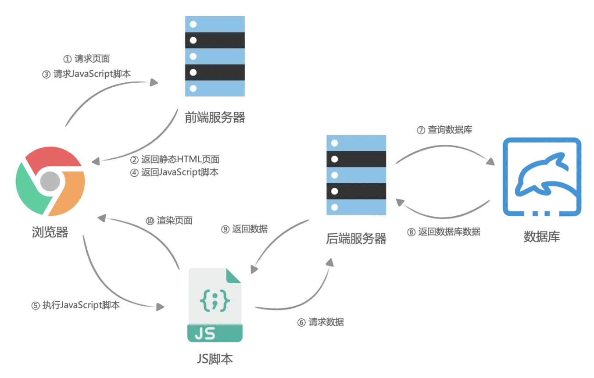
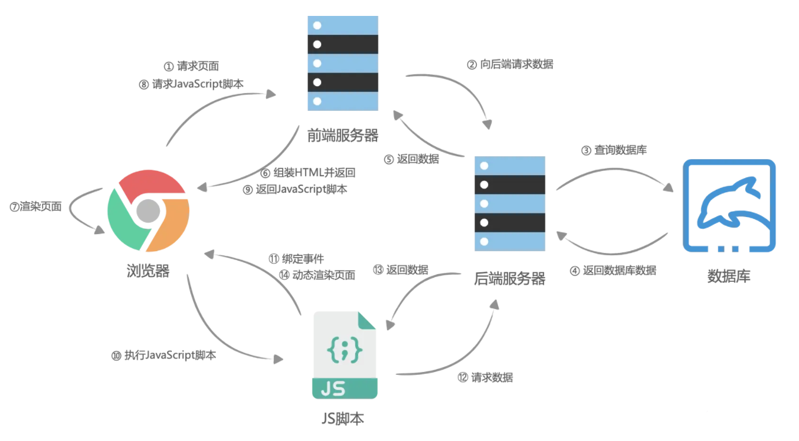

[toc]

# 简介

简介：一个基于 [Vue.js](https://vuejs.org/) 的服务端渲染应用框架

官网地址：https://www.nuxtjs.cn/guide

# 渲染方式介绍

## 客户端渲染

流程： 浏览器向服务器请求静态资源==>服务端返回空html==>客户端加载资源, 解析js进行页面渲染==>向服务端请求数据



优点：

>+ 页面中间切换快，体验好：页面切换不需要向服务器再请求资源
>+ 一定程度上减少了后端服务器的压力

缺点：

>- 首屏可能会白屏：一开始是一个空的html页面，加载资源之后才会显示，用户首次加载需要先下载SPA框架及应用程序的代码，然后再渲染页面，有可能出现白屏。
>- 不利于SEO（通过 Ajax 获取内容，抓取工具并不会等待异步完成后再行抓取页面内容。）

## 服务端渲染

流程： 浏览器向服务器请求站点==>服务器请求api获取数据拼接html字符串==》浏览器解析渲染字符串

可以在浏览器的doc调试窗口看到完整的页面html

优点：

>+ 利于SEO
>+ 没有白屏

缺点：

>- 服务器资源占用多
>- 用户体验不好：每次路由跳转重新服务器渲染再下发

## 同构渲染

流程：

首次渲染： 服务端生成html静态字符串下发==》客户端解析并渲染==》客户端激活

非首次渲染： 完全遵循客户端渲染



优点：结合了客户端渲染和服务端渲染的优点

> 有利于SEO
>
> 无白屏问题
>
> 首屏加载时间缩短
>
> 服务器占用资源中度

缺点：

> - 服务端性能消耗，SSR中使用的渲染程序自然会占用更多的CPU和内存资源
> - 开发受限，一些外部拓展库可能不支持在服务端操作,一套代码两套执行环境，比如服务端没有window、document对象，需要额外增加判断，在客户端才执行某些代码
> - 学习成本
> - 构建部署更复杂，服务器渲染应用程序，需要处于 Node.js server 运行环境。

### 服务端如何渲染html字符串

服务端负责把虚拟dom拼接为html静态字符串

+ 需要判断type， 如果是组件，那么要先把组件渲染为虚拟dom再操作
+ 普通元素：
  + 需要判断是不是自闭合的标签，自闭合标签没有children
  + 需要考虑props是否合法，以及值需要进行转义防止xss
  + 只是生成静态的html， props里有事件转化的时候过滤掉
+ 服务端只负责生成静态字符串，生成的字符串不挂载到app元素，也不负责更新， 所以vue的生命周期服务端不会执行beforeUpdate、updated、beforeMount、mounted、beforeUnmount、unmounted

### 客户端激活

客户端把拿到的服务端html静态字符串解析为dom之后， 还要执行一次客户端的渲染，把虚拟dom和已经渲染的dom建立联系，方便后续更新， 以及给dom上补充上事件的处理

+ 建立虚拟dom和已有dom的联系而不是再重新生成全部的dom：vnode.el = node
+ dom上从虚拟dom里找出来事件进行挂载

## 编写注意事项

### 组件的生命周期

客户端和服务端都执行的只有created， 服务端不会执行beforeUpdate、updated、beforeMount、mounted、beforeUnmount、unmounted， 所以只在客户端执行的代码最好放在这些生命周期里或者用环境变量提前做一下判断

```js
if (process.client) {
  XXXX
}
```

或者用<no-ssr>或者<client-only>包裹, 包裹的内容只在客户端渲染，区别是<no-ssr>适用于整个组件树，<client-only> 适用于单个组件

```vue
<no-ssr>
  <!-- 这里的内容只在客户端渲染，而不进行服务器端渲染 -->
  <your-client-side-component></your-client-side-component>
</no-ssr>
```

### 第三方模块要确保能在客户端和服务端运行

第三方模块可能包含只能在客户端执行的api, 比如window， 所以要确保可以适配服务端

```js
<script>
let storage
if (!import.meta.env.SSR) {
// 用于客户端
storage = import('./storage.js')
else {
// 用于服务端
storage = import('./storage-server.js')
  } 
 }
 export default {
// ...
}
</script>
```

### 避免交叉请求引起的状态污染

避免组件内部的全局变量污染

```js
 <script>
// 模块级别的全局变量 
let count = 0
export default { 
 create() {
   count++ 
 }
} 
</script>
```

如果上面这段组件的代码在浏览器中运行，则不会产生任何问题，因为浏览器与用户是一对一的关系，每一个浏览器都是独立的。但如果这段代码 在服务器中运行，情况会有所不同，因为服务器与用户是一对多的关系。当用户 A 发送请求到服务器时，服务器会执行上面这段组件的代码，即执行 count++。接着，用户 B 也发送请求到服务器，服务器再次执行上面这段组件的代码，此时的 count 已经因用户 A 的请求自增了一次，因此对于用 户 B 而言，用户 A 的请求会影响到他，于是就会造成请求间的交叉污染。所以，在编写组件代码时，要额外注意组件中出现的全局变量。