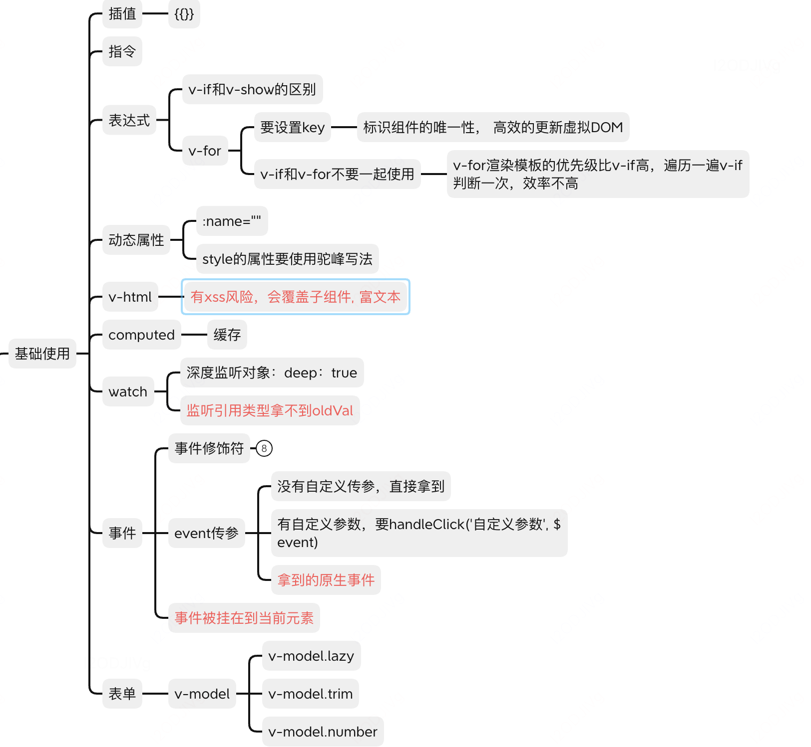
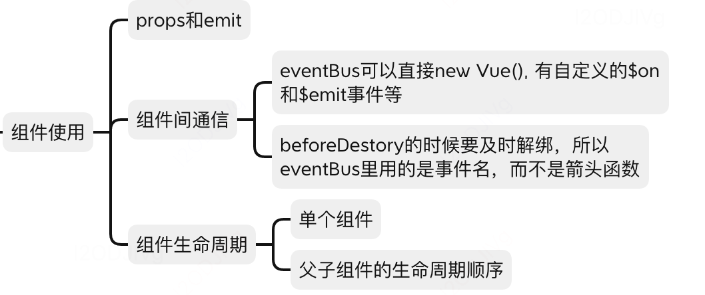
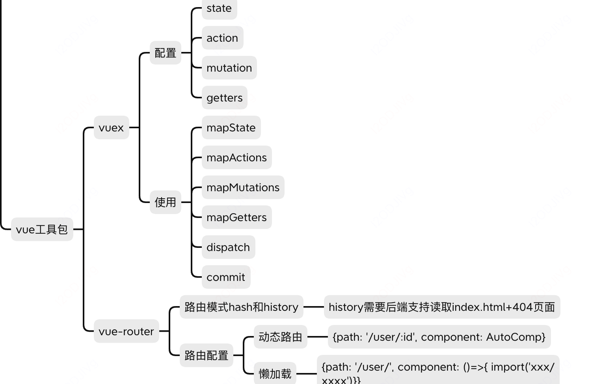
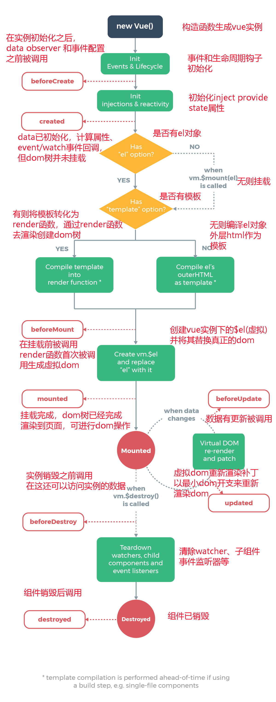
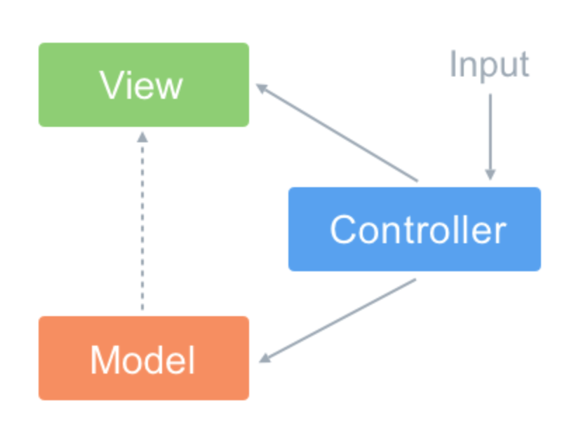
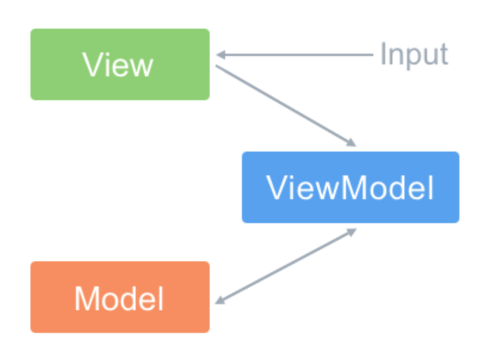
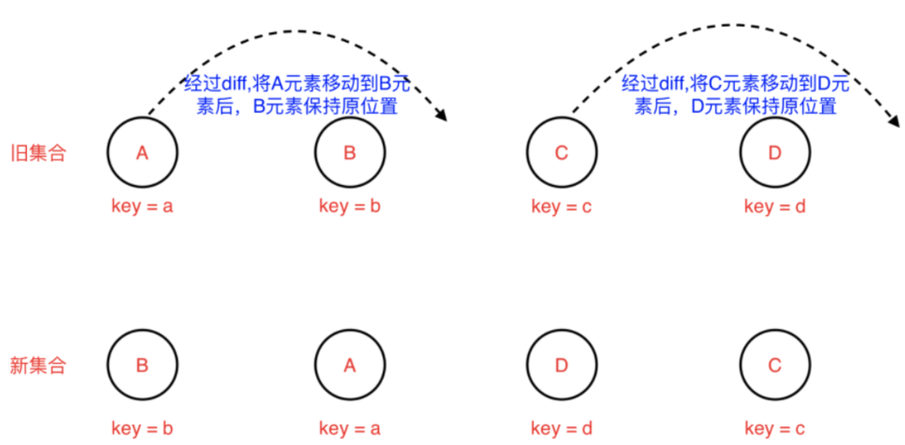
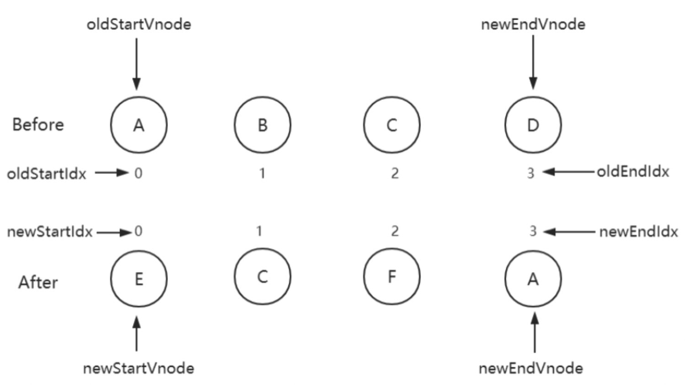
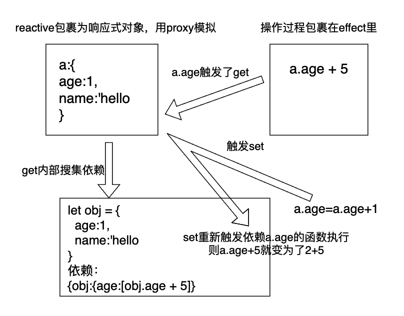

[toc]
# 总结vue2

## 基本使用



### computed

有缓存，如果computed的值是一个v-model绑定的值，那么必须有get和set方法

### watch

监听引用类型要深度监听， deep: true

**引用类型没办法直接拿到oldValue的值，因为引用类型在内存的地址不变，oldValue和newValue指向同一个地址， 虽然能监测到值的变化，但是并不会缓存旧的值**

### v-if和v-show

+ 更新不是很频繁，用v-if,

+ 更新很频繁,用v-show,利用的是display:none

### v-for 循环遍历

+ key要标识唯一性
+ v-for和v-if不能同时使用：v-for优先级高于v-if， 先循环再判断效率不高

### 事件

+ 事件传参event

  + 没有自定义传参，直接拿到

  + 有自定义参数，要handleClick('自定义参数', $event)
  + event就是js原生的事件（和react不一样）

+ 事件被挂载在哪
  + Event.target和Event.currentTarget是相同的， 事件触发和事件注册是同一个元素
+ 事件修饰符
  + .stop：等同于JavaScript中的event.stopPropagation()，防止事件冒泡
  + .self：只会触发自己范围内的事件，不包含子元素
  + .capture：与事件冒泡的方向相反，事件捕获由外到内
  + .prevent：等同于JavaScript中的event.preventDefault()，防止执行预设的行为（如果事件可取消，则取消该事件，而不停止事件的进一步传播）
  + .once：只会触发一次
  + .ctrl: alt或者shift一同按下触发
  + .ctrl.exact: 只有ctrl按下触发
  + .exact:没有任何系统修饰符按下的时候才触发

## 组件使用



## vue高级特性

### 自定义v-model

使用

```vue
<customModel v-model="text">
```

customModel内部实现

```vue
<template>
  <input :value="text" @input="$emit('change', $event.target.value)">
</template>
<script>
export default {
  model: { //默认的是value, change
    prop: "text",
    event: "change"
  }
}
</script>
```

### nextTick

vue是异步渲染的， data更新后，dom没有立刻更新，而是会将data的更改进行整合再渲染， 要获取更新后的dom， 要从nextTick里获取

### slot

+ 父组件想往子组件里取插入些内容

  ```vue
  // 父组件
  <slotChildre :url="">
     <p>父组件想插入的内容</p>
  </slotChildre>
  
  // 子组件slotChildre
  <div>
    <slot></slot>
  </div>
  ```

+ 作用域插槽：子组件里的值怎么给到父组件

  ```vue
  // 父组件
  <slotChildre>
    <templat v-slot="slotProp">
      {{slotProp.slotData}}
    </templat>
  </slotChildre>
  
  // 子组件slotChildre
  <div>
    <slot :slotData="website"></slot>
  </div>
  ```

+ 具名插槽

  ```vue
  // 父组件
  <slotChildre>
    <templat v-slot="title">
    </templat>
  </slotChildre>
  
  // 子组件slotChildre
  <div>
    <slot name="title"></slot>
  </div>
  ```

### mixin

+ 多个组件有相同的逻辑，抽离出来， 使用的时候组件引入进行混合
+ mixin不是完美的解决方案，有问题，
  + 变量来源不明确, 不利于阅读
  + 多个mixin可能造成命名冲突，不能融合，生命周期里的处理会融合
  + mixin和组件之间可能存在多对多的关系，对应关系会非常复杂
+ composition API可以弥补这些问题

```js
// myMixin
export default {
   data(){
     return {}
   }, 
   method
   mounted
}

// 引用
import myMixin from 'xxx'
export default{
  mixins: ['myMixin']
}
```

## vue工具包




# 组件生命周期



+ **beforeCreate**

在实例初始化之后，数据观测(data observer) 和 event/watcher 事件配置之前被调用。在当前阶段 data、methods、computed 以及 watch 上的数据和方法都不能被访问

+ **created** 

  实例已经创建完成之后被调用。在这一步，实例已完成数据观测(data observer)，属性和方法的运算， watch/event 事件回调。这里没有$el,如果非要想与 Dom 进行交互，可以通过 vm.$nextTick 来访问 Dom

+ **beforeMount**: 在挂载开始之前被调用：相关的 render 函数首次被调用。

+ **mounted** :在挂载完成后发生，在当前阶段，真实的 Dom 挂载完毕，数据完成双向绑定，可以访问到 Dom 节点

+ **beforeUpdate**

​		数据更新时调用，发生在虚拟 DOM 重新渲染和打补丁（patch）之前。可以在这个钩子中进一步地更改状态，这不会触发附加		的重渲染过程

+ **updated**

  发生在更新完成之后，当前阶段组件 Dom 已完成更新。要注意的是避免在此期间更改数据，因为这可能会导致无限循环的更新，该钩子在服务器端渲染期间不被调用。

+ **beforeDestroy**

  实例销毁之前调用。在这一步，实例仍然完全可用。我们可以在这时进行善后收尾工作，比如清除计时器、清除自定义事件。

+ **destroyed**

  Vue 实例销毁后调用。调用后，Vue 实例指示的所有东西都会解绑定，所有的事件监听器会被移除，所有的子实例也会被销毁。 该钩子在服务器端渲染期间不被调用。

## 父子组件的生命周期

+ 加载渲染过程

  >->父beforeCreate -> 父created -> 父beforeMount
  >
  >->子beforeCreate -> 子created -> 子beforeMount -> 子mounted
  >
  >-> 父mounted

+ 子组件更新过程

  >->父beforeUpdate
  >
  >-> 子beforeUpdate -> 子updated
  >
  >-> 父updated

+ 父组件更新过程

  >父beforeUpdate -> 父updated

+ 销毁过程

  >-> 父beforeDestroy
  >
  >-> 子beforeDestroy -> 子destroyed
  >
  >-> 父destroyed

## keep-alive生命周期

**activated** keep-alive 专属，组件被激活时调用

**deactivated** keep-alive 专属，组件被销毁时调用

比如tab切换组件就会需要这两个生命周期

## 异步请求在哪一步发起

可以在钩子函数 created、beforeMount、mounted 中进行异步请求，因为在这三个钩子函数中，data 已经创建，可以将服务端端返回的数据进行赋值。

如果异步请求不需要依赖 Dom 推荐在 created 钩子函数中调用异步请求，因为在 created 钩子函数中调用异步请求有以下优点：

- 能更快获取到服务端数据，减少页面  loading 时间；
- ssr  不支持 beforeMount 、mounted 钩子函数，所以放在 created 中有助于一致性；

# 组件通信

## （1）父子通信，props & emit

Level1为父组件，Level2为子组件

+ 父组件->子组件  props
+ 子组件->父组件 事件+emit（传递出去要用到this,传递回来的事件在setup）
+ vue2不需要单独写emits:['showChildMsg'],

```vue
// Level1父组件
<template>
  <div class="container">
    level1
    <Level2 :msg="state.parentMsg" @showChildMsg="showChildMsg"/>
  </div>
</template>

<script lang="ts">
import { defineComponent, reactive, ref} from "vue";
import Level2 from "./Level2.vue";

export default defineComponent({
  name: "Level1",
  components: {
    Level2
  },
  setup() {
    const state = reactive({
      parentMsg:'你好，这里是level1'
    });
    const showChildMsg= (childMsg:String)=>{
      console.log('childMsg', childMsg)
    }
    return {
      state,
      showChildMsg
    };
  },
  method:{
  }
});
</script>
<style scoped>
</style>
```

```vue
// Level2子组件
<template>
  <!-- eslint-disable -->
  <div class="container">
    level2, {{ msg }}
    <button @click="sendMsgToParent('这里是level2')">传递信息给level</button>
  </div>
</template>

<script lang="ts">
/* eslint-disable */
import { defineComponent, reactive, ref} from "vue";
export default defineComponent({
  name: "Level2",
  props:{
    msg:{
      type: String,
      default: 'hello'
    }
  },
  setup() {
    // @ts-ignore
    const state = reactive({
    });
    return {
      state,
    };
  },
  emits:['showChildMsg'],
  methods:{
    sendMsgToParent(toParentContent:String){
      this.$emit('showChildMsg',toParentContent)
    }
  }
});
</script>
<!-- Add "scoped" attribute to limit CSS to this component only -->
<style scoped>
</style>

```

## （2）父子，祖孙通信 $attrs

+ $attrs可以获取上一级传递过来的所有属性
+ inheritAttrs:false,避免属性附着到单节点上
+ v-bind="$attrs"把当前以及上级的attrs都透传到下一级
+ vue3不再有$listeners

```vue
//父组件Level1，传递了参数A\B\C,和对应的方法getA,getB,getC
<template>
  <!-- eslint-disable -->
  <div class="container">
    <Level2 :A="A" 
            :B="B"
            :C="C"
            @getA="getA"
            @getB="getB"
            @getC="getC"
    />
  </div>
</template>

<script lang="ts">
/* eslint-disable */
import { defineComponent, reactive} from "vue";
import Level2 from "./Level2.vue";

export default defineComponent({
  name: "Level1",
  components: {
    Level2
  },
  data(){
    return {
      A:'level1A',
      B:'level1B',
      C:'level1C'
    }
  },
  methods:{
    getA(){
      console.log('A')
    },
    getB(){
      console.log('B')
    },
    getC(){
      console.log('C')
    }
  }
});
</script>
<!-- Add "scoped" attribute to limit CSS to this component only -->
<style scoped>
</style>

```

```vue
子组件Level2只接收A和getA,那么其他参数可以在this.$attrs里获取的到
<template>
  <!-- eslint-disable -->
  <div class="container">
    <p>level2</p>
  </div>
</template>

<script lang="ts">
/* eslint-disable */
import { defineComponent, reactive, ref} from "vue";
export default defineComponent({
  name: "Level2",
  props:{
    A:{
      type: String,
      default: 'a'
    }
  },
  emits:['getA'],
  // inheritAttrs:false,
  created(){
    console.log('$attrs',Object.keys(this.$attrs))
  }
});
</script>
<!-- Add "scoped" attribute to limit CSS to this component only -->
<style scoped>
</style>
```

此时created的this.$attrs可以获取到['B', 'C', 'onGetB', 'onGetC']，而且此时Level2只有一个节点（有多个节点不会出现此现象），其他没有被接收的节点都附着在该节点上

```vue
<div class="container" b="level1B" c="level1C">      <p>level2</p>
</div>
```

此时也可以通过设置使得其他没有引入的属性不能附着在节点上

```js
inheritAttrs:false,
```

假设Level2有另一个子组件Level3,那么在Level3上可以通过v-bind="$attrs"把Level1和Level2的属性都传递过去

```js
<template>
  <!-- eslint-disable -->
  <div class="container">
    <p>level2</p>
    <Level3 v-bind="$attrs"></Level3>
  </div>
</template>
```

## （3）父子通信$parent

通过this.$parent获取父组件

```
 mounted(){
     console.log('parent',this.$parent)
  }
 ...
 结果
 Proxy {getA: ƒ, getB: ƒ, getC: ƒ, …}
```

## （4）.ref通信

ref可以获取到子组件的引用

```Vue
// Level1组件有Level2和Level3两个子组件
<template>
  <!-- eslint-disable -->
  <div class="container">
    <Level2 ref="l2"
    />
    <Level3 ref="l3"/>
  </div>
</template>

<script lang="ts">
/* eslint-disable */
import { defineComponent} from "vue";
import Level2 from "./Level2.vue";
import Level3 from "./Level3.vue";
export default defineComponent({
  name: "Level1",
  components: {
    Level2,
    Level3
  },
  data(){
    return {
    }
  },
  methods:{
  },
  mounted(){
     console.log('level1',this.$refs)
  }
});
</script>
<!-- Add "scoped" attribute to limit CSS to this component only -->
<style scoped>
</style>

```

可以拿到level2和level3的引用

```
level1 Proxy {l2: Proxy, l3: Proxy}
```

## （5）祖孙多层级通信provide

+ provide注入元素，inject引用元素，可以跨层级,Level1,Level2,Level3是层层嵌套的三层，level1注入，level3可以不通过level2直接拿到
+ provide有两种方法传递，一种只传值，provide:{helllo:this.hello}一种通过函数的方式传递引用，可以实现响应式

```vue
//Level1
<template>
  <!-- eslint-disable -->
  <div class="container">
    <Level2 />
  </div>
</template>

<script lang="ts">
/* eslint-disable */
import { defineComponent, computed} from "vue";
import Level2 from "./Level2.vue";
export default defineComponent({
  name: "Level1",
  components: {
    Level2
  },
  data(){
    return {
      hello: '这里是l1'
    }
  },
  provide(){
    return {
      l1Content: computed(()=>this.hello)
    }
  },
});
</script>

```

```vue
//Level2
<template>
  <!-- eslint-disable -->
  <div class="container">
    <p>level2</p>
    <Level3/>
  </div>
</template>

<script lang="ts">
/* eslint-disable */
import { defineComponent} from "vue";
import Level3 from "./Level3.vue";
export default defineComponent({
  name: "Level2",
  components: {
    Level3
  }
});
</script>
```

```vue
//Level3
<template>
  <!-- eslint-disable -->
  <div class="container" >
    level3,{{l1Content}}
  </div>
</template>

<script lang="ts">
/* eslint-disable */
import { defineComponent} from "vue";

export default defineComponent({
  name: "Level3",
  components: {
  },
  inject:['l1Content'],
  methods:{
  },
  mounted(){
  }
});
</script>
```

## （6）任意组件通信自定义事件

- 一个在method里自定义事件

```js
addTitleHandler(title) {
    // eslint-disable-next-line
    console.log('on add title', title)
}
...
mounted() {
    // 绑定自定义事件
    event.$on('onAddTitle', this.addTitleHandler)
},
```

- 另一个组件里使用

```js
event.$emit('onAddTitle', this.title)
```

- 其中的event

```js
import event from './event'
// Vue本身可以自定义事件
import Vue from 'vue'
export default new Vue()
```

```js
beforeDestroy() {
    // 及时销毁，否则可能造成内存泄露
    event.$off('onAddTitle', this.addTitleHandler)
}
```

+ 在vue3，没有new Vue(),需要使用第三方插件，比如mitt,npm install mitt --save

```
// utils/event.js
import mitt from 'mitt'
export default new mitt()
```

组件使用，emit触发事件，on监听，off销毁,且注意函数名相同，不能用箭头函数

```js
import event from '../utils/event.js';
 mounted(){
    event.emit('Level1show','hhhh')
  }
...
另一个组件
import event from '../utils/event.js';

export default defineComponent({
  name: "Level3",
  methods:{
    showMsg(msg:any){
      console.log('Level1Content',msg)
    }
  },
  mounted(){
    event.on('Level1show',this.showMsg)
  },
  unmounted(){
     event.off('Level1show',this.showMsg)
  }
});
```

## （7）.vuex

## （8）slot传参

组件WeekScheduleContent，有一个插槽tableCard

```vue
<slot
  name="tableCard"
  :cardData="card"
/>
```

在调用WeekScheduleContent时，插槽的组件visit-card内部想获取WeekScheduleContent的数据，那么WeekScheduleContent通过：cardData传值， 插槽组件通过 #tableCard="card"接受到数据

```vue
<WeekScheduleContent>
  <template #tableCard="card">
          <visit-card
            :visit-info="card.cardData"
            @changeVisitInfo="changeVisitInfo"
          />
  </template>
</WeekScheduleContent>
```


# 1.基础

## (1)MVC 和 MVVM 区别

Vue 没有完全遵循 MVVM 

+ MVC

  

+ Model（模型）：通常模型对象负责在数据库中存取数据

+ View（视图）：是应用程序中处理数据显示的部分。

+ Controller（控制器）：控制更新，是应用程序中处理用户交互的部分。当用户有输入时，会通过控制器去更新数据，并且通知视图 进行更新。==》控制器承担的责任太大

MVVM




+ ViewModel 层：做了两件事达到了数据的双向绑定
  + 将【模型】转化成【视图】，即将后端传递的数据转化成所看到的页面。实现的方式是：数据绑定。
  + 将【视图】转化成【模型】，即将所看到的页面转化成后端的数据。实现的方式是：DOM 事件监听。
+ 以 Vue 框架来举例，ViewModel 就是组件的实例。View 就是模板，Model 的话在引入 Vuex 的情况下是完全可以和组件分离的

MVVM 与 MVC 最大的区别就是：它实现了 View 和 Model 的自动同步，也就是当 Model 的属性改变时，我们不用再自己手动操作 Dom 元素，来改变 View 的显示，而是改变属性后该属性对应 View 层显示会自动改变（对应Vue数据驱动的思想）

### Vue 没有完全遵循 MVVM 

- 严格的 MVVM 要求 View 不能和 Model 直接通信，而 Vue 提供了$refs 这个属性，让 Model 可以直接操作 View，违反了这一规定，所以说 Vue 没有完全遵循 MVVM。

## (2)命令式和声明式

+ 命令式：强调每一个过程中的操作， 比如jq和js原生的实现

  >比如要实现这么一个功能：
  >
  >- 获取 id 为 app 的标签
  >- 把标签的文本内容设置为 'click me'
  >- 给标签添加点击事件，点击后弹出提示 'hello'
  >
  >$('#app')
  > .text('click me')
  >   .on('click', () => { alert('hello') })
  >
  >

+ 声明式： 关注结果，基本不感知过程，比如vue

  ```vue
  <div @click="alert('hello')">click me</div>
  ```

+ 优缺点(jq和vue哪个更好)

  >+ 命令式的代码在性能上优于声明式的代码，声明式也在内部做很多操作来实现命令式的功能, 比如vue的虚拟dom成本就包括：找出差异的性能消耗+直接修改的性能消耗
  >+ 一般人无法一直写出最优的代码，而声明式可以以最小的成本计算虚拟dom的差异，减少心智负担
  >+ 声明式的维护成本更低

## (3)运行时和编译时

+ 运行时就是render函数接收的内容，一个树形结构，把树形结构通过render可以转化为真实的dom
  + 没办法分析用户输入的内容
+ 编译时：把html代码通过compiler直接转化为js版本的实现（利用createElement等),完全不支持树形结构
  + 缺少灵活性
+ 编译运行时：由compiler+render组成，既可以把树形结构直接传入render，也支持把html通过compiler转化为树形结构，再传入render

## (4)三大框架数据驱动的简单对比

+ angular:脏检查，组件每次更新检查所有依赖，会产生大量冗余的检查

+ vue响应式

  ```js
  数据劫持 & 依赖搜集
  vue1:页面中每使用一个{{}}，就创建一个监听器，监听这个变量，数据变化，通知页面
  vue2:引入虚拟dom，而且响应式是组件级别的，减少监听器的数量
  ```

+ react

  ```
  采用了不可变数据：始终保持state的原值不变，要改变就需要copy一份出去
  而vue是在原值上直接修改的
  ```

## (5)vue和react有什么异同

+ Vue 的表单可以使用 v-model支持双向绑定，相比于 React 来说开发上更加方便，当然了 v-model 其实就是个语法糖，本质上和 React 写表单 的方式没什么区别。
+ 改变数据方式不同，Vue 修改状态相比来说要简单许多，React 需要使用 setState 来改变状态
+ React 16以后，有些钩子函数会执行多次，这是因为引入 Fiber 的原因
+  React 需要使用 JSX，有一定的上手成本，但是完全可以通过 JS 来控制页面，更加的灵活。Vue 使用了模板语法，相比于 JSX 来说没有那么灵活，但是完全可以脱离工具链，通过直接编写 render 函数就能在浏览器中运行。 在生态上来说，两者其实没多大的差距，当然 React 的用户是远远高于 Vue 的。
+ 在上手成本上来说，Vue 一开始的定位就是尽可能的降低前端开发的门槛，然而 React 更多的是去改变用户去接受它的概念和思想，相较于 Vue 来说上手成本略高。

>vue2的options API对应于react的 React class component
>
>vue3的composition API 对应于react的React Hooks
>
>React和Vue越来越接近

## (6)虚拟 DOM 

注：新生代svetle不再使用虚拟dom

由于在浏览器中操作 DOM 是很昂贵的。频繁的操作 DOM，会产生一定的性能问题。Virtual DOM 本质就是用一个原生的 JS 对象去描述一个 DOM 节点，是对真实 DOM 的一层抽象。

**优点：**

1. 保证性能下限： 框架的虚拟 DOM 需要适配任何上层 API 可能产生的操作，它的一些 DOM 操作的实现必须是普适的，所以它的性能并不是最优的；但是比起粗暴的 DOM 操作性能要好很多，因此框架的虚拟 DOM 至少可以保证在你不需要手动优化的情况下，依然可以提供还不错的性能，即保证性能的下限；
2. 无需手动操作 DOM： 我们不再需要手动去操作 DOM，只需要写好 View-Model 的代码逻辑，框架会根据虚拟 DOM 和 数据双向绑定，帮我们以可预期的方式更新视图，极大提高我们的开发效率；
3. 跨平台： 虚拟 DOM 本质上是 JavaScript 对象,而 DOM 与平台强相关，相比之下虚拟 DOM 可以进行更方便地跨平台操作，例如服务器渲染、weex 开发等等。

**缺点:**

1. 无法进行极致优化： 虽然虚拟 DOM + 合理的优化，足以应对绝大部分应用的性能需求，但在一些性能要求极高的应用中虚拟 DOM 无法进行针对性的极致优化。
2. 首次渲染大量 DOM 时，由于多了一层虚拟 DOM 的计算，会比 innerHTML 插入慢。

## (7).vue2、vue3、react的diff算法

diff算法是为了进行前后vdom树的比较，并且在其他领域就已经用到过

+ 严格对比两棵树，时间复杂度会达到O(n^3)

  ```
  遍历老的虚拟 DOM树
  遍历新的虚拟DOM树
  比较，查找完差异后，计算最小转换方式
  ```

+ diff算法的优化：只需要遍历一次

  ```
  1.只进行同层的比较，不进行跨层比较
  2.同层比较标签名tag（比如div和p），不同就删除重建，不再去比较内部细节
  3.如果标签名相同，key 也相同，就会认为是相同节点，也不继续按这个树状结构做深度比较
  ```

+ react的diff:仅向右移

  ```
  新旧dom进行对比时，仅仅进行向右移动的diff，比如：
  新集合B在旧集合里有，但需要左移，所以该元素保持不动
  新集合A在旧集合里有，需要右移，所以该元素右移动
  遍历重复操作直到最后一个元素
  对于新集合里新的元素，直接添加
  对于旧集合里不再存在的元素，直接删除
  ```

  

+ vue2的diff算法：双端比较

  ```
  新旧dom进行对比时，存在4个指针，进行对比，这种做法相比于仅右移，可以减少节点移动的次数
  old头与new头对比
  old头与new尾对比
  old尾与new头对比
  old尾与new尾对比
  对比之后进行移动，都不相同则使用key进行对比移动
  如果还是没有，就进行节点的新建和删除
  然后四个指针向中间移动，一旦StartIdx>EndIdx表明oldCh和newCh至少有一个已经遍历完了，就会结束比较
  ```

  

+ Vue3的diff算法：最长递增子序列

  ```
  什么是最长递增子序列，比如[3,5,7,1,2,3]，则它的最长递增子序列就是[3,5,7,8]那么就可以不移动这个最长递增子序列，而去移动其他元素
  以下图为例，还是存在4个指针，移动到四个指针两两对比都无法匹配的时候，查找最长递增子序列进行移动，新的集合最长递增子序列是[2,3,4],那么保持这三个不动，其他元素进行新增，移动，删除
  ```

### v-for 为什么要加 key

**更准确**：因为带 key 就不是就地复用了，在 sameNode 函数 a.key === b.key 对比中可以避免就地复用的情况。所以会更加准确。

**更快速**：利用 key 的唯一性生成 map 对象来获取对应节点，比遍历方式更快


源码文件

- https://github.com/vuejs/vue

```json
├─ src                         // 主要源码所在位置，核心内容
│   ├─ compiler                // 模板编译相关文件，将 template 编译为 render 函数
│       ├─ codegen             // 把AST(抽象语法树)转换为Render函数
│       ├─ directives          // 生成Render函数之前需要处理的东西
│       ├─ parser              // 模板编译成AST
│   ├─ core                    // Vue核心代码，包括了内置组件、全局API封装、Vue实例化、响应式原理、vdom(虚拟DOM)、工具函数等等。
│       ├─ components          // 组件相关属性，包含抽象出来的通用组件 如：Keep-Alive
│       ├─ global-api          // Vue全局API，如Vue.use(),Vue.nextTick(),Vue.config()等，包含给Vue构造函数挂载全局方法(静态方法)或属性的代码。 链接：https://012-cn.vuejs.org/api/global-api.html
│       ├─ instance            // 实例化相关内容，生命周期、事件等，包含Vue构造函数设计相关的代码
│       ├─ observer            // 响应式核心目录，双向数据绑定相关文件。包含数据观测的核心代码
│       ├─ util                // 工具方法
│       └─ vdom                // 虚拟DOM相关的代码，包含虚拟DOM创建(creation)和打补丁(patching)的代码
│   ├─ platforms               // vue.js和平台构建有关的内容 不同平台的不同构建的入口文件也在这里 （Vue.js 是一个跨平台的MVVM框架）
│       ├── web                // web端 （渲染，编译，运行时等，包括部分服务端渲染）
│       │   ├── compiler       // web端编译相关代码，用来编译模版成render函数basic.js
│       │   ├── entry-compiler.js               // vue-template-compiler 包的入口文件
│       │   ├── entry-runtime-with-compiler.js  // 独立构建版本的入口，它在 entry-runtime 的基础上添加了模板(template)到render函数的编译器
│       │   ├── entry-runtime.js                // 运行时构建的入口，不包含模板(template)到render函数的编译器，所以不支持 `template` 选项，我们使用vue默认导出的就是这个运行时的版本。
│       │   ├── entry-server-basic-renderer.js  // 输出 packages/vue-server-renderer/basic.js 文件
│       │   ├── entry-server-renderer.js        // vue-server-renderer 包的入口文件
│       │   ├── runtime        // web端运行时相关代码，用于创建Vue实例等
│       │   ├── server         // 服务端渲染（ssr）
│       │   └── util           // 工具类相关内容
│       └─ weex                // 混合运用 weex框架 (一端开发，三端运行: Android、iOS 和 Web 应用) 2016年9月3日~4日 尤雨溪正式宣布以技术顾问的身份加盟阿里巴巴Weex团队， 做Vue和Weex的整合 让Vue的语法能跨三端
│   ├─ server                  // 服务端渲染相关内容（ssr）
│   ├─ sfc                     // 转换单文件组件（*.vue）
│   └─ shared                  // 共享代码 全局共享的方法和常量

```

## (8)vue模板编译原理

Vue 其实提供了两个构建版本。

- `vue.js`： 完整版本，包含了模板编译的能力；
- `vue.runtime.js`： 运行时版本，不提供模板编译能力，需要通过 vue-loader 进行提前编译。

vue的模版编译实际上就是把模版编译为render函数，也就是把

```HTML
<div id="test">
  <p>hello</p>
</div>
```

编译为

```js
render(h) {
  return h('div', { id: 'test' }, [h('p','hello')])
},
```

+ parse-模版字符串转化为element AST: 词法分析: 根据有限状态机，可以逐个字段读取模版字符串，判断是开始标签，还是结束标签，内容是什么，最终转化为

```json
{
  tagName: 'div',
  attrs: [],
  unarySlash: '',
  start: 0,
  end: 5
}
{
  tagName: 'div',
  attrs: [],
  unarySlash: '',
  start: 0,
  end: 5
}
```

但是此时没有层级关系

+ 根据开始结束的栈，确定层级关系，是开始标签，就压入栈后，其后的元素是它的child，如果是结束标签就出栈，回到上一个层级的child，最后转化为


+ element AST转化为js AST

+ js AST转化为render函数


# 2.响应式

响应式是什么

- 检测到数据的变化并对这种变化做出响应的机制，
- 对象采用`Object.defineProperty()`的方式定义数据拦截，当数据被访问或发生变化时，我们感知并作出响应；数组则通过覆盖数组对象原型的7个变更方法 ，使这些方法可以额外的做更新通知
- 数据响应式加上虚拟`DOM`和`patch`算法，开发人员只需要操作数据，关心业务，完全不用接触繁琐的DOM操作，从而大大提升开发效率，降低开发难度

## vue2的响应式

数据一旦变化，视图立即触发更新

数据劫持+观察者模式

+ 对象通过 Object.defineProperty 将属性进行劫持（只会劫持已经存在的属性），新增或删除属性时需要用户使用`Vue.set/delete`这样特殊的`api`才能生效
+ 数组则是通过重写数组方法进行劫持
+ 当页面使用对应属性时，每个属性都拥有自己的 dep 属性，存放他所依赖的 watcher（依赖收集），当属性变化后会通知自己对应的 watcher 去更新(派发更新)

```js
cosnt data ={}
cosnt name = 'test'

Object.defineProperty(data, "name", {
  get: function(){
     return name
  }
  set: function(newVal){
    name = newVal
  }
})
```


```js
class Observer {
  // 观测值
  constructor(value) {
    this.walk(value);
  }
  walk(data) {
    // 对象上的所有属性依次进行观测
    let keys = Object.keys(data);
    for (let i = 0; i < keys.length; i++) {
      let key = keys[i];
      let value = data[key];
      defineReactive(data, key, value);
    }
  }
}
// Object.defineProperty数据劫持核心 兼容性在ie9以及以上
function defineReactive(data, key, value) {
  observe(value); // 递归关键
  // --如果value还是一个对象会继续走一遍odefineReactive 层层遍历一直到value不是对象才停止
  //   思考？如果Vue数据嵌套层级过深 >>性能会受影响
  Object.defineProperty(data, key, {
    get() {
      console.log("获取值");
      //需要做依赖收集过程 这里代码没写出来
      return value;
    },
    set(newValue) {
      if (newValue === value) return;
      console.log("设置值");
      //需要做派发更新过程 这里代码没写出来
      value = newValue;
    },
  });
}
export function observe(value) {
  // 如果传过来的是对象或者数组 进行属性劫持
  if (
    Object.prototype.toString.call(value) === "[object Object]" ||
    Array.isArray(value)
  ) {
    return new Observer(value);
  }
}

```

## 如何监测数组变化

数组考虑性能原因没有用 defineProperty 对数组的每一项进行拦截，而是选择对 7 种数组（push,shift,pop,splice,unshift,sort,reverse）方法进行重写(AOP 切片思想)

所以在 Vue 中修改数组的索引和长度是无法监控到的。必须通过以上7种方法

```js
// src/obserber/array.js
// 先保留数组原型
const arrayProto = Array.prototype;
// 然后将arrayMethods继承自数组原型
// 这里是面向切片编程思想（AOP）--不破坏封装的前提下，动态的扩展功能
export const arrayMethods = Object.create(arrayProto);
let methodsToPatch = [
  "push",
  "pop",
  "shift",
  "unshift",
  "splice",
  "reverse",
  "sort",
];
methodsToPatch.forEach((method) => {
  arrayMethods[method] = function (...args) {
    //   这里保留原型方法的执行结果
    const result = arrayProto[method].apply(this, args);
    // 这句话是关键
    // this代表的就是数据本身 比如数据是{a:[1,2,3]} 那么我们使用a.push(4)  this就是a  ob就是a.__ob__ 这个属性就是上段代码增加的 代表的是该数据已经被响应式观察过了指向Observer实例
    const ob = this.__ob__;

    // 这里的标志就是代表数组有新增操作
    let inserted;
    switch (method) {
      case "push":
      case "unshift":
        inserted = args;
        break;
      case "splice":
        inserted = args.slice(2);
      default:
        break;
    }
    // 如果有新增的元素 inserted是一个数组 调用Observer实例的observeArray对数组每一项进行观测
    if (inserted) ob.observeArray(inserted);
    // 之后咱们还可以在这里检测到数组改变了之后从而触发视图更新的操作
    return result;
  };
});
```

## Vue3.0 和 2.0 的响应式原理区别

Vue3.x 改用 Proxy 替代 Object.defineProperty。因为 Proxy 可以直接监听对象和数组的变化，并且有多达 13 种拦截方法

### Object.defineProperty

数据劫持是Object.defineProperty,在MDN中的定义

> `Object.defineProperty()`方法会直接在一个对象上定义一个新属性，或者修改一个对象的现有属性，并返回此对象。
>
> 它的语法是传入三个参数：
>
> Object.defineProperty(obj, prop, descriptor)
>
> - obj：要定义属性的对象。
> - prop：要定义或修改的属性的名称或 Symbol 。
> - descriptor：要定义或修改的属性描述符。
>
> 第三个参数可以取值
>
> + configurable：用来描述属性是否可配置（改变和删除），为true才可以被修改和删除,不设置时默认值为false
> + enumerable：用来描述属性是否能出现在`for in`或者`Object.keys()`的遍历中,不设置时默认值为false
> + writable：用来描述属性的值是否可以被重写，值为false时属性只能读取,不设置时默认值为false
> + value：属性的值
> + get：属性的getter函数，当访问该属性时，会调用此函数,不设置时，默认值为undefined。
> + set：当属性值被修改时，会调用此函数。该方法接受一个参数，会传入赋值时的 this 对象,不设置时，默认值为undefined.

```js
var user = {};

var initName = ''
Object.defineProperty(user, "name", {
    get: function(){
        console.log('get name')
        return initName
    },
    set: function(val){
        console.log('set name')
        initName = val
    }
});
// get name
console.log(user.name)
// set name
user.name = 'new'

```

#### 劫持数组

可以把数组的索引看成是属性进行劫持

```js
var list = [1,2,3]

list.map((elem, index) => {
    Object.defineProperty(list, index, {
        get: function () {
            console.log("get index:" + index);
            return elem;
        },
        set: function (val) {
            console.log("set index:" + index);
            elem = val;
        }
    });
});

// set index:2
list[2] = 6
// get index:1
console.log(list[1])
```

如果要对数组新增元素push方法，那么就是新增的元素并不会触发监听事件，为此，Vue的解决方案是劫持`Array.property`原型链上的7个函数，我们通过下面的函数简单进行劫持：

```js
const arrayProto = Array.prototype
export const arrayMethods = Object.create(arrayProto)

/**
 * Intercept mutating methods and emit events
 */
;[
  'push',
  'pop',
  'shift',
  'unshift',
  'splice',
  'sort',
  'reverse'
]
.forEach(function (method) {
  // cache original method
  const original = arrayProto[method]
  def(arrayMethods, method, function mutator (...args) {
    const result = original.apply(this, args)
    const ob = this.__ob__
    let inserted
    switch (method) {
      case 'push':
      case 'unshift':
        inserted = args
        break
      case 'splice':
        inserted = args.slice(2)
        break
    }
    if (inserted) ob.observeArray(inserted)
    // notify change
    ob.dep.notify()
    return result
  })
})

在Array.__proto__上 进行了方法重写或者添加
并且对添加属性的方法如push，unshift，splice所添加进来的新属性进行手动观察， if (inserted) ob.observeArray(inserted)
```

另外，由于 JavaScript 的限制， Vue 不能检测以下变动的数组：

> 当你利用索引直接设置一个项时，例如： vm.items[indexOfItem] = newValue
> 当你修改数组的长度时，例如： vm.items.length = newLength

#### 缺陷

+ 虽然`Object.defineProperty`能够劫持对象的属性，但是需要对对象的每一个属性进行遍历劫持；
+ 如果对象上有新增的属性，则需要对新增的属性再次进行劫持，这也是为什么Vue给对象新增属性需要通过`$set`的原因，其原理也是通过`Object.defineProperty`对新增的属性再次进行劫持。
+ 如果属性是对象，还需要深度遍历。
+ 无法检测数组元素的变化，需要进行数组方法的重写
+ 无法检测数组的长度的修改
+ defineProperty 会污染原对象，修改时是修改原对象

### Proxy

相较于Object.defineProperty劫持某个属性，Proxy则更彻底，不在局限某个属性，而是直接对整个对象进行代理

```js
var target = {}

var proxyObj = new Proxy(
    target,
    {
        get: function (target, propKey, receiver) {
            console.log(`getting ${propKey}!`);
            return Reflect.get(target, propKey, receiver);
        },
        set: function (target, propKey, value, receiver) {
            console.log(`setting ${propKey}!`);
            return Reflect.set(target, propKey, value, receiver);
        },
        deleteProperty: function (target, propKey) {
            console.log(`delete ${propKey}!`);
            delete target[propKey];
            return true;
        }
    }
);
//setting count!
proxyObj.count = 1;
//getting count!
//1
console.log(proxyObj.count)
//delete count!
delete proxyObj.count

```

Proxy直接代理了`target`整个对象,不仅能够监听到属性的增加，还能监听属性的删除,不管是数组下标或者数组长度的变化，还是通过函数调用，Proxy都能很好的监听到变化.

#### 优化结果


整体上，比`Vue 2.x` 内存占用少一半以上，总体速度快一倍以上。

+ 相比vue 2有1.3到2倍的性能优势。
+ 服务器渲染也完全重写，从模板编译到服务器渲染生成完全不同的渲染函数，可以比vue 2快2~3倍。


## reactive响应式

例子:

```js
 setup() {
    let a = reactive({
      age: 1,
      name:'hello'
    });
    setInterval(() => {
      a.age += 1;
    }, 500);
    let b = computed(()=>{return a.age + 5 })
    return {
      b,
    };
  },
```

内部原理：

+ reactive可以把一个对象a进行包裹，变成响应式的对象
+ b变量依赖于a变量的age的值
+ 当获取到a的age变化时，b重新执行函数age+5从而实现随着a的变化而变化



### 1.reactive包裹

reactive内主要功能是把原对象利用proxy变成响应式对象，并且要执行依赖搜集和依赖被触发后的操作

```tsx
// reactive.ts
export function reactive(obj:any){
  return new Proxy(obj,{
    get(target,key){
      const res = Reflect.get(target,key)
      // effect内函数触发依赖搜集
      return res
    },
    set(target,key,value){
      const res = Reflect.set(target,key,value)
      // 依赖执行
      return res
    }
  })
}
```

并且可以确认的是，被包裹变为响应式对象后和原对象是不同的,但是还是可以执行get和set操作

### 2.effect操作

effect主要操作就是可以触发内部的函数立即执行

```tsx
import {effect} from './../reactive';
import {reactive} from './../reactive';
describe('effect',()=>{
  it('efffect执行',()=>{
    const a={name:'yoly',age:1}
    const reactiveA= reactive(a)
    let nextA
    effect(()=>{
      nextA = reactiveA.age + 5
    })
    expect(nextA).toBe(6)

  })
})
```

```tsx
// effect.ts
export function effect(fn){
 fn()
}
```

可以把立即执行的函数过程抽离出来

### 3.依赖搜集

+ 在get里触发依赖搜集

```tsx
get(target,key){
      const res = Reflect.get(target,key)
      // effect内函数触发依赖搜集
      track(target,key)
      return res
    },
```

+ effect里写具体的track函数，因为要保存执行的函数，这个函数在effect里才有,考虑为空的情况，最终将依赖搜集为{target:{key:[fn]}}的形式

```tsx
var Fn //全局变量，用于保存可执行对象effectObj

class ReactiveEffect{
  private _fn:any;
  constructor(fn){
    this._fn = fn
  }
  run(){
    Fn = this //指向的就是effectObj
    this._fn()
  }
}

// 依赖搜集
const targetMap = new Map()
export function track(target, key) {
  let depsMap = targetMap.get(target)
  if (!depsMap) {
    depsMap = new Map()
    targetMap.set(target, depsMap)
  }
  let deps = depsMap.get(key)
  if (!deps) {
    deps = new Set()
    depsMap.set(key, deps)
  }
  deps.add(Fn)

export function effect(fn){
 const effectObj = new  ReactiveEffect(fn)
 effectObj.run()
}
```

+ 其中，这个传入进来的fn是需要可以可以立即执行的，这里传入effectObj这个对象，并把它作为依赖搜集里实际保存的值，所以童年过全局变量Fn保存这个effectObj对象，并且存放在依赖里

### 4.触发依赖执行

当函数执行时，a.age=a.age+5, a.age会触发get，依赖搜集之后，紧接着赋值操作，会触发set，此时进行值的更新，从而实现响应式的更新

```tsx
//reactive.ts里进行依赖执行
set(target,key,value){
      const res = Reflect.set(target,key,value)
      // 依赖执行
      trigger(target,key)
      return res
    }
```

那么在effect.ts里进行依赖触发，更新值的操作

```tsx
//执行target对应key上的所有函数
export function trigger(target,key){
  let FnArr = targetMap.get(target).get(key)
  for(const itemFn of FnArr){
    itemFn.run()
  }
}
```

# 3.vue双向绑定的实现

双向数据绑定通常是指我们使用的`v-model`指令的实现，是`Vue`的一个特性，也可以说是一个`input`事件和`value`的语法糖。 `Vue`通过`v-model`指令为组件添加上`input`事件处理和`value`属性的赋值。。

##  v-model原理

`v-model` 实际上就是 `$emit('input')` 以及 `props:value` 的组合语法糖，只要组件中满足这两个条件，就可以在组件中使用 `v-model`。

- checkbox 和 radio 使用 props:checked 和 $emit('change') 事件；
- select 使用 props:value和 $emit('change')
- 其他都是使用 props:value和 $emit('input')

在普通标签上

```js
<input v-model="test" />  
==========等效=========
<input v-bind:value="test" v-on:input="test = $event.target.value" />
```

在组件上

组件上使用`v-model`本质上是子父组件通信的语法糖

```vue
<currency-input v-model="price"></currentcy-input>
<!--上行代码是下行的语法糖
 <currency-input :value="price" @input="price = arguments[0]"></currency-input>
-->

<!-- 子组件定义 -->
Vue.component('currency-input', {
 template: `
  <span>
   <input
    ref="input"
    :value="value"
    @input="$emit('input', $event.target.value)"
   >
  </span>
 `,
 props: ['value'],
})
```


# 6.vue-router路由

## 路由模式实现原理

监听url的变化

## hash模式

location.hash 的值实际就是 URL 中#后面的东西 它的特点在于：hash 虽然出现 URL 中，但不会被包含在 HTTP 请求中，对后端完全没有影响，因此改变 hash 不会重新加载页面。

通过hashchange事件监听，感知页面变化，达到“更新视图但是不重新发起请求”的要求，但是不美观

```js
window.addEventListener("hashchange", funcRef, false); 
```

## history模式

主要使用HTML5 新推出的功能， history.pushState 和 history.replaceState 改变 URL

这两个方法应用于浏览器的历史记录站，在当前已有的 back、forward、go 的基础之上，它们提供了对历史记录进行修改的功能。这两个方法有个共同的特点：当调用他们修改浏览器历史记录栈后，虽然当前 URL 改变了，但浏览器不会刷新页面，这就为单页应用前端路由“更新视图但不重新请求页面”提供了基础。

 History 模式在用户手动输入地址或者刷新页面的时候会发起 URL 请求，可能出现404（刷新）， 所以项目后端可以在nginx里进行路由配置，没有路径对应的资源的时候，默认加载index.html


两种模式对比

+ Hash 模式只可以更改 # 后面的内容，History 模式可以通过 API 设置任意的同源 URL
+ History 模式可以通过 API 添加任意类型的数据到历史记录中，Hash 模式只能更改哈希值，也就是字符串
+ Hash 模式无需后端配置，并且兼容性好。History 模式在用户手动输入地址或者刷新页面的时候会发起 URL 请求，后端需要配置 1index.html 页面用于匹配不到静态资源的时候

## 动态路由

 类似{ path: "/user/:id", component: **User** }

## 路由钩子函数

路由钩子的执行流程, 钩子函数种类有:全局守卫、路由守卫、组件守卫

```js
全局守卫
	beforeEach: 在路由变化前被调用。
	beforeResolve: 在 beforeEach 后被调用，解析完异步组件。
	afterEach: 在路由变化后被调用。
  // 可以进行性能指标的埋点

组件守卫
  beforeRouteEnter: 在路由进入前被调用。
  beforeRouteUpdate: 在当前路由改变，但是该组件被复用时调用。
  beforeRouteLeave: 在离开当前路由时被调用。
	
路由守卫
  beforeEnter: 在路由配置中使用。
  beforeRouteEnter: 在路由进入前被调用。
  beforeRouteUpdate: 在当前路由改变，但是该组件被复用时调用。
  beforeRouteLeave: 在离开当前路由时被调用。

```


**完整的导航解析流程:**

+ 导航被触发
+ 在失活的组件里调用 beforeRouteLeave 守卫。
+ 调用全局的 beforeEach 守卫。
+ 在重用的组件里调用 beforeRouteUpdate 守卫。
+ 在路由配置里调用 beforeEnter。
+ 解析异步路由组件。
+ 在被激活的组件里调用 beforeRouteEnter。
+ 调用全局的 beforeResolve。
+ 导航被确认。
+ 调用全局的 afterEach 钩子。
+ 触发 DOM 更新。
+ 调用 beforeRouteEnter 守卫中传给 next 的回调函数，创建好的组件实例会作为回调函数的参数传入。

## 路由懒加载

路由懒加载是一种优化手段，它可以延迟加载页面组件，从而减小初始页面加载时的文件体积，提升网页性能。

### 实现原理

+ **动态 import()：** 在 JavaScript 中，`import()` 是动态模块导入的语法，它返回一个 Promise 对象。通过使用 `import()`，可以在运行时动态加载模块。
+ **分割代码块（Chunk）：** 当使用 `import()` 导入模块时，打包工具（例如 Webpack）会将导入的模块单独打包成一个文件，形成一个独立的代码块（Chunk）。
+ **懒加载触发时机：** 路由懒加载通常与路由配置结合使用。当用户访问某个懒加载路由时，相关的 JavaScript chunk文件才会被下载。
+ **异步加载：** 浏览器会在空闲时异步下载这个文件，而不会阻塞其他页面的加载。


# 7.keep-alive组件的用法

https://www.jianshu.com/p/480c52580c8a

```xml
（1）一般keep-alive组件和<router-view>结合使用：
<keep-alive>
    <router-view></router-view>
</keep-alive>
（2）keep-alive也可以和一些动态组件结合使用：
<keep-alive>
  <component :is="view"></component>
</keep-alive>

作用：<keep-alive> 包裹动态组件或者router-view时，会缓存不活动的组件实例，而不是销毁它们，
也就是被<keep-alive>包裹的组件，当加载之后，再次被加载时不会重新渲染，而是使用离开这个组件时保留的缓存；
```

参数

```js
include:可以指定包裹在keep-alive中的组件允许被缓存；
exclude:可以指定包裹在keep-alive中的组件不允许被缓存；
max:最多可以缓存多少组件实例。一旦这个数字达到了，在新实例被创建之前，已缓存组件中最久没有被访问的实例会被销毁掉。
```

（1）缓存了子组件的什么东西

+ 缓存了**子组件的 Vue 实例**和子组件上次渲染的真实DOM

（2）keep-alive如何缓存子组件

在 keep-alive 组件的 Vue 实例中有一个 cache 属性，该属性是一个对象，这个对象用来缓存子组件的 vnode，vnode 有个 componentInstance 属性，这个 componentInstance 属性就是缓存的 Vue 实例，在 componentInstance 属性中有个 $el 属性，这个 $el 属性是缓存的真实 DOM。

（3）keep-alive生命周期

**activated** keep-alive 专属，组件被激活时调用

**deactivated** keep-alive 专属，组件被销毁时调用

## 抽象组件

```js
export default {
  name: 'keep-alive',
  abstract: true,
```

抽象组件没有真实的节点，抽象组件不会渲染成 DOM 元素，也不会出现在父组件链中，而只是作为中间的数据过度层处理，在keep-alive中是对组件缓存做处理

## 接收的参数

```js
props: { //接收三个参数,
    include: patternTypes, //缓存白名单，允许缓存
    exclude: patternTypes, //缓存黑名单，不允许缓存
    max: [String, Number]  //缓存的最大实例数量
}
```

## 缓存初始化与卸载

```js
created () {
  this.cache = Object.create(null) //缓存的组件
  this.keys = [] //缓存组件的key数组
},

  destroyed () {
    for (const key in this.cache) {
      pruneCacheEntry(this.cache, key, this.keys) //删除缓存中所有vnode
    }
  },
```

删除缓存中的组件

```js
function pruneCacheEntry (cache, key, keys, current) {
  const entry = cache[key]
  if (entry && (!current || entry.tag !== current.tag)) {
    entry.componentInstance.$destroy()
  }
  cache[key] = null
  remove(keys, key)
}
```

## 监听include和exclude的变化

+ 监听include和exclude的值，
+ 如果这两个 prop 有变化的话，则按照最新的 include 和 exclude 更新 this.cache，  将不满足 include、exclude 限制的 缓存vnode 从 this.cache 中移除

```js
  mounted () {
    this.$watch('include', val => {
      pruneCache(this, name => matches(val, name))
    })
    this.$watch('exclude', val => {
      pruneCache(this, name => !matches(val, name))
    })
    
    // 在include不处理
    // 不在exclude，删除

```

pruneCache：如果缓存的组件传入的函数规则内，则将组件从缓存中删除，这里是传入了是否满足include和exclude的判断条件

```js
function pruneCache (keepAliveInstance, filter) {
  const { cache, keys, _vnode } = keepAliveInstance
  for (const key in cache) {
    const cachedNode = cache[key]
    if (cachedNode) {
      const name = getComponentName(cachedNode.componentOptions)
      if (name && !filter(name)) {
        // 删除对应的组件
        pruneCacheEntry(cache, key, keys, _vnode)
      }
    }
  }
}
```

匹配matches 

```js
/**
* 判断name是否在pattern范围内，从而判断组件是否在include或者exclude的范围内
**/
function matches (pattern, name){
  if (Array.isArray(pattern)) {
    return pattern.indexOf(name) > -1
  } else if (typeof pattern === 'string') {
    return pattern.split(',').indexOf(name) > -1
  } else if (isRegExp(pattern)) {
    return pattern.test(name)
  }
  /* istanbul ignore next */
  return false
}
```

## render

组件重新渲染时，会执行 render 函数获取对应的 vnode

实现 keep-alive 的功能有两个要点：

+ 缓存组件的 Vue 实例， cache[key].componentInstance
+ 缓存组件上次渲染的真实 DOM

```js
  render () {
    const slot = this.$slots.default //获取keep-alive标签包裹的默认插槽中的元素
    const vnode = getFirstComponentChild(slot) //获取到默认插槽中的第一个组件 vnode（keep-alive只对第一个子元素起作用）
    const componentOptions = vnode && vnode.componentOptions
    if (componentOptions) {
      // 获取组件名称
      const name= getComponentName(componentOptions)
      const { include, exclude } = this
      if ( 
        // 如果当前的组件 name 不在 include 中或者组件的 name 在 exclude 中,则直接返回
        // 不符合include
        (include && (!name || !matches(include, name))) ||
        // 符合exclude
        (exclude && name && matches(exclude, name))
      ) {
        return vnode
      }
 
      const { cache, keys } = this
      const key = vnode.key == null
        ? componentOptions.Ctor.cid + (componentOptions.tag ? `::${componentOptions.tag}` : '')
        : vnode.key
      if (cache[key]) { 
        //如果缓存中存在当前组件
        //将缓存中的组件实例赋给当前组件实例
        vnode.componentInstance = cache[key].componentInstance 
         //将当前组件key从缓存的keys数组中删除
        remove(keys, key)
        //将当前组件keypush到缓存的keys中，以此来保持该组件在缓存中是最新的
        keys.push(key) 
      } else { 
        //如果缓存中没有当前组件
        //将当前组件放入缓存中
        cache[key] = vnode 
        //将当前组件key放入缓存keys数组中
        keys.push(key) 
        if (this.max && keys.length > parseInt(this.max)) { 
          //如果已缓存的组件数量大于max值，则将缓存keys数组中第一个组件删除掉。（缓存中组件的顺序是不常用的在前面，常用的在后面，这是由上面代码中如果组件在缓存中，就需要先在缓存中删除组件key，再重新向缓存keys数组中推入组件key的实现方式决定的）
          pruneCacheEntry(cache, keys[0], keys, this._vnode)
        }
      }
 
      vnode.data.keepAlive = true 
      //标记该组件的keepAlive状态，这对 vnode 有一个标识的作用，标识这个
      // vnode 是 keep-alive 组件的 render 函数 return 出去的，这个标识在下面的运行代码中有用
    }
    return vnode || (slot && slot[0]) //如果上面方法没执行，则直接返回vnode或第一个子元素
  }
```

# 问题

## 1.v-if和v-show

>V-if是dom删除了，v-show是css的隐藏
>
>Keep-alive

## 2. v-for为什么用key

>diff更高速，要唯一值

## 3.组件生命周期

>单组件生命周期
>
>父子组件之间的生命周期

## 4.父子通信

>属性和事件
>
>Vuex
>
>eventBus

## 5.为什么 data 是一个函数

组件中的 data 写成一个函数，数据以函数返回值形式定义，这样每复用一次组件，就会返回一份新的 data，类似于给每个组件实例创建一个私有的数据空间，让各个组件实例维护各自的数据。而单纯的写成对象形式，就使得所有组件实例共用了一份 data，就会造成一个变了全都会变的结果

## 6.组件更新渲染过程


