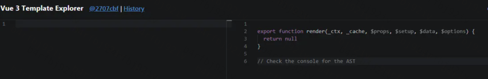
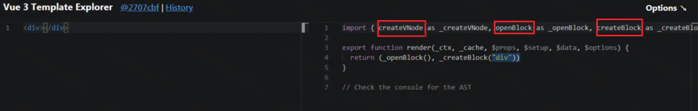
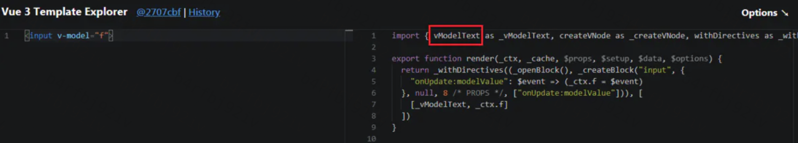
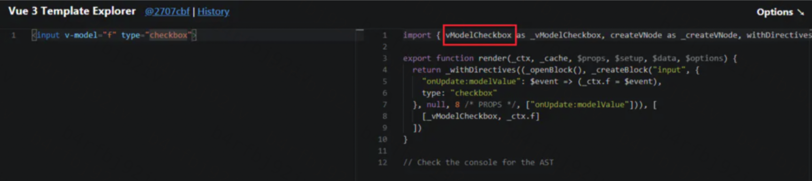
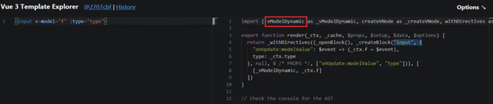
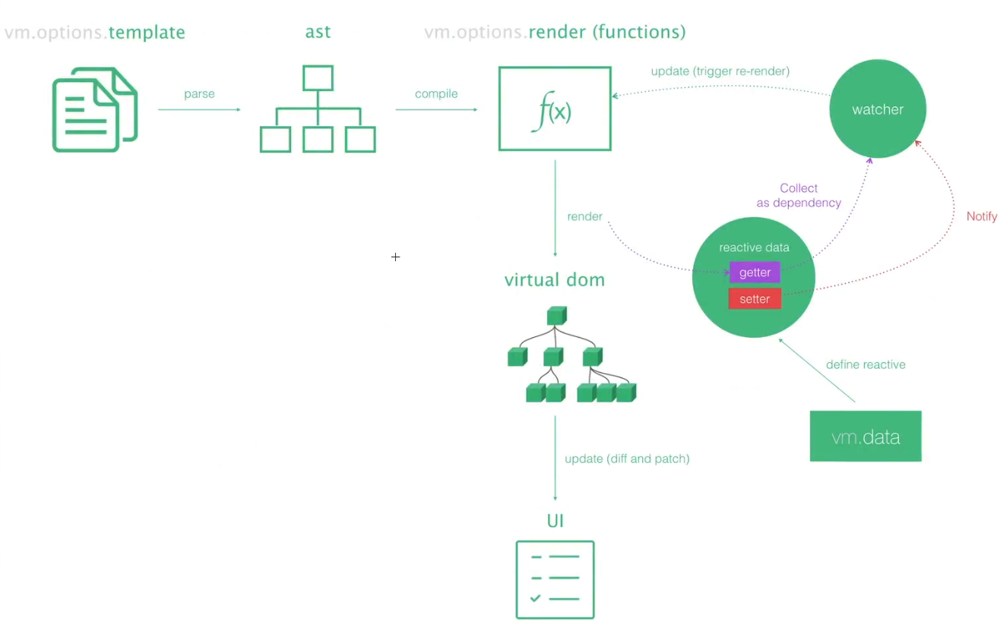

[toc]

# Vue3.0的新特性

+ performance
+ tree- shaking support
+ composition API
+ TS support
+ Fragment
+ Suspense
+ Teleport
+ custom render API

# vue3起步

文档

```
composition API:https://vuejs.org/guide/extras/composition-api-faq.html
```

安装

```
npm config set registry https://registry.npm.taobao.org
npm i -g @vue/cli
vue create vue3-demo
```

启动

```
code vue3-demo  //用vscode打开
npm run serve
```

# vue2升vue3的动机

+ 更小：移除不常用api，引入tree shaking,打包体积更小
+ 更快：性能提升：diff算法优化，静态提升，事件监听缓存，ssr优化
+ 更友好：兼顾vue2的options API的同时，推出了composition API，增加了代码维护和组织能力
+ 提高自身可维护性：源码通过monorepo维护的，根据功能把不同的模块拆分到package目录下不同子目录下，模块拆分更明确，模块之间的依赖关系也更明确，而且比如响应式库reactive可以单独引入而不需要引入整个vue库
+ 开放更多底层功能，便于社区的二次开发
+ 进行了一些优化：体积优化，编译优化，数据劫持优化

# Performance优化

## 体积优化

源码体积变小，与Vue2相比较，Vue3整体体积变小了

+ 移除了一些比较冷门的feature：如 keyCode 支持作为 v-on 的修饰符、on、off 和 $once 实例方法、filter过滤、内联模板等。
+ 在 vue2 中，很多函数都挂载到全局 Vue 对象上，如：nextTick、set 函数等，虽然我们不常用，但打包时只要引入 Vue 这些全局函数会打包进 bundle 中。而 vue3 中，引入tree-shaking，所有的 API 都通过 ES6 模块化的方式引入，这样就能够让 webpack 或 rollup 等打包工具在打包时，就会自动对没有用到的 API 进行剔除，最小化 bundle 体积。

## 编译优化

### 静态标记（PatchFlag）

+ Vue2 中的虚拟dom是进行全量的对比（实际上有的节点是静态的，比如固定的文字，不需要进行对比更新的）
+ Vue3 新增了静态标记（PatchFlag），只比对带有 PF 的节点（在编译阶段进行分析，判断出节点是动态的还是静态的），并且通过 Flag 的信息得知 当前节点要比对的具体内容。如果是负数，不需要再对其子节点进行diff

例子：

```
<div>
  <span>hello</span>
  <span>{{ msg }}</span>
</div>
```

编译之后

```
import { createElementVNode as _createElementVNode, toDisplayString as _toDisplayString, openBlock as _openBlock, createElementBlock as _createElementBlock } from "vue"

export function render(_ctx, _cache, $props, $setup, $data, $options) {
  return (_openBlock(), _createElementBlock("div", null, [
    _createElementVNode("span", null, "hello"),
    _createElementVNode("span", null, _toDisplayString(_ctx.msg), 1 /* TEXT */)
  ]))
}
```

div-->createElementBlock

动态绑定`msg`属性的`span`，编译后_createVNode会生成`PacthFlag`（相当于编译时生成一个hint）,只会对带有`PacthFlag`的结点进行真正的追踪。在真正的更新的时候，会直接跳到该结点，比较该结点文字的变化。不需要去关注其他属性和绑定的变化。(vue2是连 hello也需要进行diff的)

PatchFlags有哪些标识？

```
export const enum PatchFlags {
  TEXT = 1,// 动态文本节点
  CLASS = 1 << 1, // 2  // 动态 class
  STYLE = 1 << 2, // 4 // 动态 style
  。。。
}
```

无论层级嵌套多深，它的动态节点都直接与`Block`根节点绑定，无需再去遍历静态节点

### (2)静态提升

+ Vue2中无论元素是否参与更新, 每次都会重新创建, 然后再渲染
+ Vue3中对于不参与更新的元素, 会做静态提升, 只会被创建一次, 在渲染时直接复用即可


### (3)cacheHandlers 事件侦听器缓存

+ 默认情况下onClick会被视为动态绑定, 所以每次都会去追踪它的变
+ 但是因为是同一个函数，所以没有追踪变化, 直接缓存起来复用即可

第一次渲染


第二次渲染：会从缓存中读同一个函数，因为是同一个函数，也就没有追踪变化的必要，这样就会避免一些没必要的更新。


### (4)ssr渲染

+ 当有大量静态的内容时候，这些内容会被当做纯字符串推进一个buffer里面，即使存在动态的绑定，会通过模板插值嵌入进去。这样会比通过虚拟dmo来渲染的快上很多很多。
+ 当静态内容大到一定量级时候，会用_createStaticVNode方法在客户端去生成一个static node， 这些静态node，会被直接innerHtml，就不需要创建对象，然后根据对象渲染。


## 数据劫持优化

### vue2数据劫持

#### Object.defineProperty

数据劫持是Object.defineProperty,在MDN中的定义

> `Object.defineProperty()`方法会直接在一个对象上定义一个新属性，或者修改一个对象的现有属性，并返回此对象。

它的语法是传入三个参数：

>Object.defineProperty(obj, prop, descriptor)
>
>- obj：要定义属性的对象。
>- prop：要定义或修改的属性的名称或 Symbol 。
>- descriptor：要定义或修改的属性描述符。

第三个参数可以取值

+ configurable：用来描述属性是否可配置（改变和删除），为true才可以被修改和删除,不设置时默认值为false
+ enumerable：用来描述属性是否能出现在`for in`或者`Object.keys()`的遍历中,不设置时默认值为false
+ writable：用来描述属性的值是否可以被重写，值为false时属性只能读取,不设置时默认值为false
+ value：属性的值
+ get：属性的getter函数，当访问该属性时，会调用此函数,不设置时，默认值为undefined。
+ set：当属性值被修改时，会调用此函数。该方法接受一个参数，会传入赋值时的 this 对象,不设置时，默认值为undefined.

```js
var user = {};
Object.defineProperty(user, "name", {
    value: "xyf",
    writable: false,
    enumerable: false,
    configurable: false,
});
```

```js
var user = {};

var initName = ''
Object.defineProperty(user, "name", {
    get: function(){
        console.log('get name')
        return initName
    },
    set: function(val){
        console.log('set name')
        initName = val
    }
});
// get name
console.log(user.name)
// set name
user.name = 'new'

```

**劫持数组**：可以把数组的索引看成是属性进行劫持

```js
var list = [1,2,3]

list.map((elem, index) => {
    Object.defineProperty(list, index, {
        get: function () {
            console.log("get index:" + index);
            return elem;
        },
        set: function (val) {
            console.log("set index:" + index);
            elem = val;
        }
    });
});

// set index:2
list[2] = 6
// get index:1
console.log(list[1])
```

如果要对数组新增元素push方法，那么就是新增的元素并不会触发监听事件，为此，Vue的解决方案是劫持`Array.property`原型链上的7个函数，我们通过下面的函数简单进行劫持：

```js
const arrayProto = Array.prototype
export const arrayMethods = Object.create(arrayProto)

/**
 * Intercept mutating methods and emit events
 */
;[
  'push',
  'pop',
  'shift',
  'unshift',
  'splice',
  'sort',
  'reverse'
]
.forEach(function (method) {
  // cache original method
  const original = arrayProto[method]
  def(arrayMethods, method, function mutator (...args) {
    const result = original.apply(this, args)
    const ob = this.__ob__
    let inserted
    switch (method) {
      case 'push':
      case 'unshift':
        inserted = args
        break
      case 'splice':
        inserted = args.slice(2)
        break
    }
    if (inserted) ob.observeArray(inserted)
    // notify change
    ob.dep.notify()
    return result
  })
})

在Array.__proto__上 进行了方法重写或者添加
并且对添加属性的方法如push，unshift，splice所添加进来的新属性进行手动观察， if (inserted) ob.observeArray(inserted)
```

另外，由于 JavaScript 的限制， Vue 不能检测以下变动的数组：

> 当你利用索引直接设置一个项时，例如： vm.items[indexOfItem] = newValue
> 当你修改数组的长度时，例如： vm.items.length = newLength


#### 缺陷

+ 虽然`Object.defineProperty`能够劫持对象的属性，但是需要对对象的每一个属性进行遍历劫持；
+ 如果对象上有新增的属性，则需要对新增的属性再次进行劫持，这也是为什么Vue给对象新增属性需要通过`$set`的原因，其原理也是通过`Object.defineProperty`对新增的属性再次进行劫持。
+ 如果属性是对象，还需要深度遍历。
+ 无法检测数组元素的变化，需要进行数组方法的重写
+ 无法检测数组的长度的修改
+ defineProperty 会污染原对象，修改时是修改原对象

### vue3

#### Proxy

相较于Object.defineProperty劫持某个属性，Proxy则更彻底，不在局限某个属性，而是直接对整个对象进行代理

```js
var target = {}

var proxyObj = new Proxy(
    target,
    {
        get: function (target, propKey, receiver) {
            console.log(`getting ${propKey}!`);
            return Reflect.get(target, propKey, receiver);
        },
        set: function (target, propKey, value, receiver) {
            console.log(`setting ${propKey}!`);
            return Reflect.set(target, propKey, value, receiver);
        },
        deleteProperty: function (target, propKey) {
            console.log(`delete ${propKey}!`);
            delete target[propKey];
            return true;
        }
    }
);
//setting count!
proxyObj.count = 1;
//getting count!
//1
console.log(proxyObj.count)
//delete count!
delete proxyObj.count

```

Proxy直接代理了`target`整个对象,不仅能够监听到属性的增加，还能监听属性的删除,不管是数组下标或者数组长度的变化，还是通过函数调用，Proxy都能很好的监听到变化.

## 优化结果


整体上，比`Vue 2.x` 内存占用少一半以上，总体速度快一倍以上。

+ 相比vue 2有1.3到2倍的性能优势。
+ 服务器渲染也完全重写，从模板编译到服务器渲染生成完全不同的渲染函数，可以比vue 2快2~3倍。

# Tree-shaking support 

Vue3最重要的变化之一就是引入了Tree-Shaking，

+ 在2.x版本中，很多函数都挂载在全局Vue对象上，比如nextTick、nextTick、nextTick、set等函数，因此虽然我们可能用不到，但打包时只要引入了vue这些全局函数仍然会打包进bundle中
+ 而在Vue3中，所有的API都通过ES6模块化的方式引入，这样就能让webpack或rollup等打包工具在打包时对没有用到API进行剔除，最小化bundle体积；

## 什么是Tree-shaking

tree-shaking可以理解为通过工具"摇"我们的JS文件，将其中用不到的代码"摇"掉，是一个性能优化的范畴。具体来说，在 webpack 项目中，有一个入口文件，相当于一棵树的主干，入口文件有很多依赖的模块，相当于树枝。实际情况中，虽然依赖了某个模块，但其实只使用其中的某些功能。通过 tree-shaking，将没有使用的模块摇掉，这样来达到删除无用代码的目的。

## Tree-shaking的原理

**主要原理：依赖`es6`的模块化的语法，将无用的代码(`dead-code`)进行剔除!**

Tree-shaking的本质是消除无用的js代码，由于treeShaking是基于[ES6](https://so.csdn.net/so/search?q=ES6&spm=1001.2101.3001.7020)的import和export静态编辑思想确定模块依赖关系的，所以treeShaking在编译阶段会判断模块的加载状态，判断未使用的相关变量，进行移除。

vue3在浏览器里依然会有一个全局的Vue对象，但是当你用了一个bundler时（比如webpack），它就没有default export，你就不能import xxx from vue，然后把vue本身当一个对象去操作。那所有的这些API全部要用import的方式import进来，这样的结果就是使得一些可能不会用到的一些功能就可以被tree shaking掉。比如说 v-model、<transition>这些功能，如果你不用的话，就不会引用到最后的包里。

举个例子：空的渲染函数没有从`vue`中引入任何东西



此时加入一个div



可以看见它引入一些东西，比如createVNode, openBlock, createBlock。这些东西只有我们引入的时候，才会被打包进去。

但默认的还是会保留一些最低的限制，比如Virtual DOM的更新算法以及响应式系统，无论如何这两个都是会包含在你得包里的。但是很多常用或者非常用的功能，只有当你用到时才会被import进来，比如v-model



当input类型改成checkbox，就会引入的是vModelCheckbox



改成动态的type就会引入动态的v-model，即vModelDynamic



Tree-shaking本质并不是Vue3的东西，而是打包工具的功能。只是Vue3代码结构调整，当用webpack等打包工具打包项目时，webpack会将那些没用用到的代码不打包到最后的项目中，这样使得项目体积更小

## Tree-shaking优势

- 帮助开发者减小web app应用体积
- 减少程序打包时间
- 便于维护优化项目框架

# Custom Renderer API

+ Custom Renderer API 是什么？

>自定义渲染器API,用于自定义render函数,其实就是createRenderer API

+ Custom Renderer API 的意义？

> 跨平台，虚拟dom优点之一就是便于实现跨平台，只要使用不同的虚拟dom到真实dom的渲染过程，就可以实现一套代码，多个平台使用的目的，因此不再需要为了自定义一些功能而 fork Vue 的代码。这个特性给 Weex 和 NativeScript Vue 这样的项目提供了很多便利。

## vue3渲染流程

```js
import { createApp } from "vue";
import App from "./App.vue";
console.log("APP", App);
console.log("APP.render", App.render());
createApp(App).mount("#app");
```

https://vue-next-template-explorer.netlify.app/#eyJzcmMiOiI8ZGl2PlxuICA8c3Bhbi8+XG4gIDxzcGFuPnt7IG1zZyB9fTwvc3Bhbj5cbjwvZGl2PiIsIm9wdGlvbnMiOnt9fQ==


template-->render()-->vnode-->**渲染为真实的dom元素(createApp)**-->挂载到根节点上(mount)

