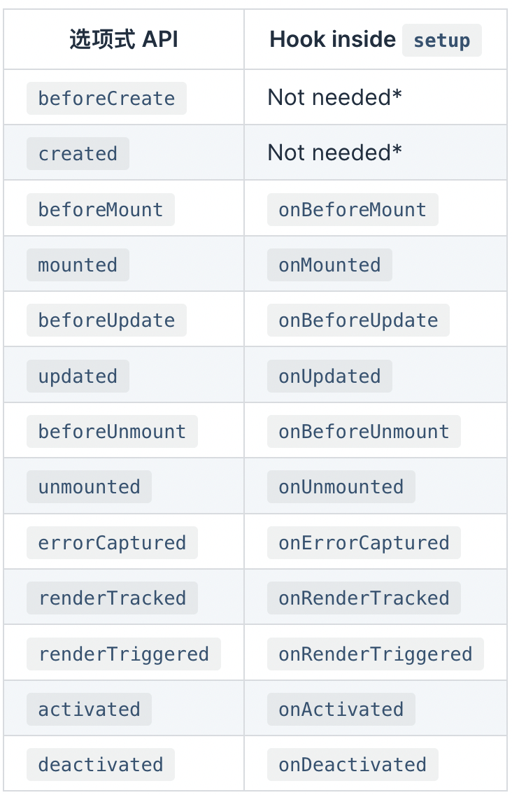

[toc]


# vue3起步

文档

```
composition API:https://vuejs.org/guide/extras/composition-api-faq.html
```

安装

```
npm config set registry https://registry.npm.taobao.org
npm i -g @vue/cli
vue create vue3-demo
```

启动

```
code vue3-demo  //用vscode打开
npm run serve
```

# vue3 详细介绍

## 组件

### defineComponent

用于定义组件

```
import { defineComponent } from "vue";
...
const MyComponent = defineComponent({
  data() {
    return { count: 1 }
  },
  methods: {
    increment() {
      this.count++
    }
  }
})
```

## props限制类型

```js
// 原来的
props: {
    msg: String
},
//vue3+ts
import { defineComponent, PropType} from "vue";
...
 props: {
    msg: {
      type: String as PropType<string>,
    }
  },
```


```js
//自定义类型限制
interface Config {
  name: string;
}
...
config: {
      type: Object as PropType<Config>,
      required: true,
    },
```

## composition API

### 1.为什么要用composition API

+ vue2的复杂逻辑分散在data,method,computed等各个部分，不好维护，使用后可以把各个散落的代码整合在setup或者单独的js文件里再进行引入
+ vue2中已有的代码复用的方法，mixin,filters存在缺陷
+ vue2对ts的支持不充分

### 2.setup

+ 在组件创建**之前**执行,也就是在method、computed等之前被调用(===>避免在setup中使用this)
+ 返回普通的变量,此时只会在初始化的时候执行一次

```js
 <p>{{ name }}</p>
 ...
 setup() {
    return {
      name: "nihao",
    };
  },
```

### 3.响应式变量

+ Ref:接受一个内部值并返回一个响应式且可变的 ref 对象。ref 对象仅有一个 `.value` property，指向该内部值（相当于是把变量要封装一层为对象，对象内部只有一个value的属性,这样就可以一直保持响应式）。

```js
import { defineComponent, ref } from "vue";
...
setup() {
    let nameRef = ref("NIHAO"); // nameRef:{value:"NIHAO"}
    setInterval(() => {
      nameRef.value += 1;
    }, 1000);
    return {
      name: nameRef,
    };
  },
```

+ reactive:返回对象的响应式副本,`reactive` 将解包所有深层的 [refs](https://v3.cn.vuejs.org/api/refs-api.html#ref)，同时维持 ref 的响应性

```js
import { defineComponent, reactive } from "vue";
...
setup() {
    let nameReactive = reactive({
      name: "nihao",
    });
    setInterval(() => {
      nameReactive.name += 1;
    }, 1000);
    return {
      nameReactive,
    };
  },
...
 <p>{{ nameReactive.name }}</p>
```

+ Computed：返回一个不可变的响应式 [ref](https://v3.cn.vuejs.org/api/refs-api.html#ref) 对象

```js
import { defineComponent, ref, computed } from "vue";
...
setup() {
    let nameRef = ref("NIHAO");
    setInterval(() => {
      nameRef.value += 1;
    }, 1000);
    let nameRef2 = computed(() => {
      return nameRef.value + 2;
    });
    return {
      name: nameRef,
      name2: nameRef2,
    };
  },
```

+ watchEffect:立即执行传入的一个函数，同时响应式追踪其依赖，并在其依赖变更时重新运行该函数。

```js
import { defineComponent, ref, watchEffect } from "vue";
...
setup() {
    let nameRef = ref("NIHAO");
    setInterval(() => {
      nameRef.value += 1;
    }, 1000);
    watchEffect(() => {
      console.log("jiantin", nameRef.value);
    });
    return {
      name: nameRef,
    };
  },
```

### 4.生命周期钩子

在setup中内嵌的生命周期钩子函数如下




