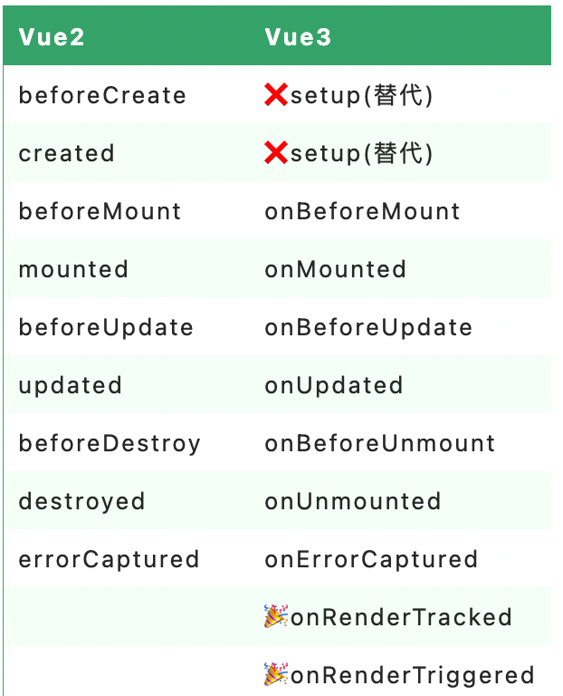
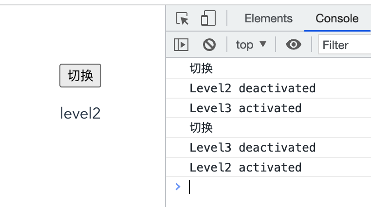

[toc]

学习资料：

https://juejin.cn/post/6909247394904702984#heading-22

https://www.yuque.com/nxtt7g/kompdt/snbu3x

# vue3起步

文档

```
composition API:https://vuejs.org/guide/extras/composition-api-faq.html
```

安装

```
npm config set registry https://registry.npm.taobao.org
npm i -g @vue/cli
vue create vue3-demo
```

启动

```
code vue3-demo  //用vscode打开
npm run serve
```


## 组件

### defineComponent

用于定义组件

```
import { defineComponent } from "vue";
...
const MyComponent = defineComponent({
  data() {
    return { count: 1 }
  },
  methods: {
    increment() {
      this.count++
    }
  }
})
```

## props限制类型

```js
// 原来的
props: {
    msg: String
},
//vue3+ts
import { defineComponent, PropType} from "vue";
...
 props: {
    msg: {
      type: String as PropType<string>,
    }
  },
```


```js
//自定义类型限制
interface Config {
  name: string;
}
...
config: {
      type: Object as PropType<Config>,
      required: true,
    },
```


## composition API

### 1.为什么要用composition API

+ vue2的复杂逻辑分散在data,method,computed等各个部分，不好维护，使用后可以把各个散落的代码整合在setup或者单独的js文件里再进行引入
+ vue2中已有的代码复用的方法，mixin,filters存在缺陷
+ vue2对ts的支持不充分

### 2.setup

+ 在组件创建**之前**执行,也就是在method、computed等之前被调用(===>避免在setup中使用this)
+ 返回普通的变量,此时只会在初始化的时候执行一次

```js
 <p>{{ name }}</p>
 ...
 setup() {
    return {
      name: "nihao",
    };
  },
```

### 3.响应式变量

+ Ref:接受一个内部值并返回一个响应式且可变的 ref 对象。ref 对象仅有一个 `.value` property，指向该内部值（相当于是把变量要封装一层为对象，对象内部只有一个value的属性,这样就可以一直保持响应式）。

```js
import { defineComponent, ref } from "vue";
...
setup() {
    let nameRef = ref("NIHAO"); // nameRef:{value:"NIHAO"}
    setInterval(() => {
      nameRef.value += 1;
    }, 1000);
    return {
      name: nameRef,
    };
  },
```

+ reactive:返回对象的响应式副本,`reactive` 将解包所有深层的 [refs](https://v3.cn.vuejs.org/api/refs-api.html#ref)，同时维持 ref 的响应性

```js
import { defineComponent, reactive } from "vue";
...
setup() {
    let nameReactive = reactive({
      name: "nihao",
    });
    setInterval(() => {
      nameReactive.name += 1;
    }, 1000);
    return {
      nameReactive,
    };
  },
...
 <p>{{ nameReactive.name }}</p>
```

+ Computed：返回一个不可变的响应式 [ref](https://v3.cn.vuejs.org/api/refs-api.html#ref) 对象

```js
import { defineComponent, ref, computed } from "vue";
...
setup() {
    let nameRef = ref("NIHAO");
    setInterval(() => {
      nameRef.value += 1;
    }, 1000);
    let nameRef2 = computed(() => {
      return nameRef.value + 2;
    });
    return {
      name: nameRef,
      name2: nameRef2,
    };
  },
```

+ watchEffect:立即执行传入的一个函数，同时响应式追踪其依赖，并在其依赖变更时重新运行该函数。

```js
import { defineComponent, ref, watchEffect } from "vue";
...
setup() {
    let nameRef = ref("NIHAO");
    setInterval(() => {
      nameRef.value += 1;
    }, 1000);
    watchEffect(() => {
      console.log("jiantin", nameRef.value);
    });
    return {
      name: nameRef,
    };
  },
```

***************

# 生命周期钩子



+ vue3生命周期只是unmounted系列发生了变化，相对vue2有新增
+ 在composition API中，setup里采取加on前缀，且setup替代了beforeCreate和created

## 总体生命周期作用

+ beforeCreate

  ```
  创建一个空白的vue实例
  此时data,method都没有被初始化，不可以使用
  ```

+ created

  ```
  vue实例初始化完成，响应式绑定完成
  method初始化，可以使用
  
  但是这个时候还没有开始渲染模板，页面不可见
  ```

+ beforeMount

  ```
  编译模板，生成vdom
  
  但是还没开始渲染生成真实的dom
  ```

+ mounted

  ```
  完成了DOM的渲染，组件创建完成了
  ```

+ beforeUpdate

  ```
  data发生了变化，准备更新DOM
  ```

+ updated

  ```
  data发生了变化，并且DOM已经更新完成
  ```

+ beforeUnmounted

  ```
  组件准备销毁但是还没有销毁，还是可以正常使用
  可以在这个阶段进行自定义事件的解绑
  ```

+ unmounted

  ```
  组件被销毁，且所有子组件也被销毁
  ```

## keep-alive组件的生命周期

被 keep-alive 缓存的组件激活时调用。

+ activated 缓存组件被激活的时候使用
+ deactivated 缓存组件呗隐藏的时候调用

如下所示：

```vue
//Level1有两个子组件Level2和Level3,可以通过按钮切换两个组件的展示与隐藏
<template>
  <!-- eslint-disable -->
  <div class="container">
    <button @click="checkBtn">切换</button>
    <keep-alive>
       <Level2  v-if="level===2"/>
       <Level3  v-else/>
    </keep-alive>
  </div>
</template>

<script lang="ts">
/* eslint-disable */
import { defineComponent, computed} from "vue";
import Level2 from "./Level2.vue";
import Level3 from "./Level3.vue";
export default defineComponent({
  name: "Level1",
  components: {
    Level2,
    Level3
  },
  data(){
    return {
      level: 2
    }
  },
  methods:{
    checkBtn(){
      console.log('切换')
      if(this.level === 2){
        this.level=3
      }else{
        this.level=2
      }
    }
  }
});
</script>
```

```vue
//Level2两个生命周期函数进行监听
<template>
  <!-- eslint-disable -->
  <div class="container">
    <p>level2</p>
  </div>
</template>

<script lang="ts">
/* eslint-disable */
import { defineComponent, onDeactivated} from "vue";
export default defineComponent({
  name: "Level2",
  activated(){
    console.log('Level2 activated')
  },
  deactivated(){
    console.log('Level2 deactivated')
  }
});
</script>
```

```vue
//Level3类似实现
<template>
  <!-- eslint-disable -->
  <div class="container" >
     <p>level3</p>
  </div>
</template>

<script lang="ts">
/* eslint-disable */
import { defineComponent} from "vue";

export default defineComponent({
  name: "Level3",
  activated(){
    console.log('Level3 activated')
  },
  deactivated(){
    console.log('Level3 deactivated')
  }
});
</script>
```

那么切换的时候就可以看到keep-alive触发的生命周期函数



## 其他问题

+ created和 mounted有什么区别?

```
created只是Vue实例化，还没有渲染
Mounted是tenmplate已经渲染完成了
```
+ 父子组件顺序

加载渲染过程

```
父beforeCreate->父created->父beforeMount->子beforeCreate->子created->子beforeMount->子mounted->父mounted
```

子组件更新过程

```
父beforeUpdate->子beforeUpdate->子updated->父updated
```

父组件更新过程

```
父beforeUpdate->父updated
```
销毁过程

```
父beforeDestroy->子beforeDestroy->子destroyed->父destroyed
```
从外到内，再从内到外

+ vue什么时候操作DOM方便

  ```
  mounted和updated都不能保证子组件完全挂载完成
  应该使用$nextTick
  mounted(){
    this.$nextTick(function(){
      //处理DOM操作
    })
  }
  ```

+ ajax应该在哪个生命周期使用

  ```
  created和mounted使用
  但是推荐mounted，因为created此时在处理一些method初始化
  ```

  

# vue组件通信

## 1.父子通信，props & emit

Level1为父组件，Level2为子组件

+ 父组件->子组件  props
+ 子组件->父组件 事件+emit（传递出去要用到this,传递回来的事件在setup）
+ vue2不需要单独写emits:['showChildMsg'],

```vue
// Level1父组件
<template>
  <!-- eslint-disable -->
  <div class="container">
    level1
    <Level2 :msg="state.parentMsg" @showChildMsg="showChildMsg"/>
  </div>
</template>

<script lang="ts">
/* eslint-disable */
import { defineComponent, reactive, ref} from "vue";
import Level2 from "./Level2.vue";

export default defineComponent({
  name: "Level1",
  components: {
    Level2
  },
  setup() {
    // @ts-ignore
    const state = reactive({
      parentMsg:'你好，这里是level1'
    });
    const showChildMsg= (childMsg:String)=>{
      console.log('childMsg', childMsg)
    }
    return {
      state,
      showChildMsg
    };
  },
  method:{
  }
});
</script>
<!-- Add "scoped" attribute to limit CSS to this component only -->
<style scoped>
</style>
```

```vue
// Level2子组件
<template>
  <!-- eslint-disable -->
  <div class="container">
    level2, {{ msg }}
    <button @click="sendMsgToParent('这里是level2')">传递信息给level</button>
  </div>
</template>

<script lang="ts">
/* eslint-disable */
import { defineComponent, reactive, ref} from "vue";
export default defineComponent({
  name: "Level2",
  props:{
    msg:{
      type: String,
      default: 'hello'
    }
  },
  setup() {
    // @ts-ignore
    const state = reactive({
    });
    return {
      state,
    };
  },
  emits:['showChildMsg'],
  methods:{
    sendMsgToParent(toParentContent:String){
      this.$emit('showChildMsg',toParentContent)
    }
  }
});
</script>
<!-- Add "scoped" attribute to limit CSS to this component only -->
<style scoped>
</style>

```

## 2.父子，祖孙通信 $attrs

+ $attrs可以获取上一级传递过来的所有属性
+ inheritAttrs:false,避免属性附着到单节点上
+ v-bind="$attrs"把当前以及上级的attrs都透传到下一级
+ vue3补在有$listeners

```vue
//父组件Level1，传递了参数A\B\C,和对应的方法getA,getB,getC
<template>
  <!-- eslint-disable -->
  <div class="container">
    <Level2 :A="A" 
            :B="B"
            :C="C"
            @getA="getA"
            @getB="getB"
            @getC="getC"
    />
  </div>
</template>

<script lang="ts">
/* eslint-disable */
import { defineComponent, reactive} from "vue";
import Level2 from "./Level2.vue";

export default defineComponent({
  name: "Level1",
  components: {
    Level2
  },
  data(){
    return {
      A:'level1A',
      B:'level1B',
      C:'level1C'
    }
  },
  methods:{
    getA(){
      console.log('A')
    },
    getB(){
      console.log('B')
    },
    getC(){
      console.log('C')
    }
  }
});
</script>
<!-- Add "scoped" attribute to limit CSS to this component only -->
<style scoped>
</style>

```

```vue
子组件Level2只接收A和getA,那么其他参数可以在this.$attrs里获取的到
<template>
  <!-- eslint-disable -->
  <div class="container">
    <p>level2</p>
  </div>
</template>

<script lang="ts">
/* eslint-disable */
import { defineComponent, reactive, ref} from "vue";
export default defineComponent({
  name: "Level2",
  props:{
    A:{
      type: String,
      default: 'a'
    }
  },
  emits:['getA'],
  // inheritAttrs:false,
  created(){
    console.log('$attrs',Object.keys(this.$attrs))
  }
});
</script>
<!-- Add "scoped" attribute to limit CSS to this component only -->
<style scoped>
</style>
```

此时created的this.$attrs可以获取到['B', 'C', 'onGetB', 'onGetC']，而且此时Level2只有一个节点（有多个节点不会出现此现象），其他没有被接收的节点都附着在该节点上

```vue
<div class="container" b="level1B" c="level1C">      <p>level2</p>
</div>
```

此时也可以通过设置使得其他没有引入的属性不能附着在节点上

```js
inheritAttrs:false,
```

假设Level2有另一个子组件Level3,那么在Level3上可以通过v-bind="$attrs"把Level1和Level2的属性都传递过去

```js
<template>
  <!-- eslint-disable -->
  <div class="container">
    <p>level2</p>
    <Level3 v-bind="$attrs"></Level3>
  </div>
</template>
```

## 3.父子通信$parent

通过this.$parent获取父组件

```
 mounted(){
     console.log('parent',this.$parent)
  }
 ...
 结果
 Proxy {getA: ƒ, getB: ƒ, getC: ƒ, …}
```

## 4.ref通信

ref可以获取到子组件的引用

```Vue
// Level1组件有Level2和Level3两个子组件
<template>
  <!-- eslint-disable -->
  <div class="container">
    <Level2 ref="l2"
    />
    <Level3 ref="l3"/>
  </div>
</template>

<script lang="ts">
/* eslint-disable */
import { defineComponent} from "vue";
import Level2 from "./Level2.vue";
import Level3 from "./Level3.vue";
export default defineComponent({
  name: "Level1",
  components: {
    Level2,
    Level3
  },
  data(){
    return {
    }
  },
  methods:{
  },
  mounted(){
     console.log('level1',this.$refs)
  }
});
</script>
<!-- Add "scoped" attribute to limit CSS to this component only -->
<style scoped>
</style>

```

可以拿到level2和level3的引用

```
level1 Proxy {l2: Proxy, l3: Proxy}
```

## 5.祖孙多层级通信provide

+ provide注入元素，inject引用元素，可以跨层级,Level1,Level2,Level3是层层嵌套的三层，level1注入，level3可以不通过level2直接拿到
+ provide有两种方法传递，一种只传值，provide:{helllo:this.hello}一种通过函数的方式传递引用，可以实现响应式

```vue
//Level1
<template>
  <!-- eslint-disable -->
  <div class="container">
    <Level2 />
  </div>
</template>

<script lang="ts">
/* eslint-disable */
import { defineComponent, computed} from "vue";
import Level2 from "./Level2.vue";
export default defineComponent({
  name: "Level1",
  components: {
    Level2
  },
  data(){
    return {
      hello: '这里是l1'
    }
  },
  provide(){
    return {
      l1Content: computed(()=>this.hello)
    }
  },
});
</script>

```

```vue
//Level2
<template>
  <!-- eslint-disable -->
  <div class="container">
    <p>level2</p>
    <Level3/>
  </div>
</template>

<script lang="ts">
/* eslint-disable */
import { defineComponent} from "vue";
import Level3 from "./Level3.vue";
export default defineComponent({
  name: "Level2",
  components: {
    Level3
  }
});
</script>
```

```vue
//Level3
<template>
  <!-- eslint-disable -->
  <div class="container" >
    level3,{{l1Content}}
  </div>
</template>

<script lang="ts">
/* eslint-disable */
import { defineComponent} from "vue";

export default defineComponent({
  name: "Level3",
  components: {
  },
  inject:['l1Content'],
  methods:{
  },
  mounted(){
  }
});
</script>
```

## 6.任意组件通信自定义事件

- 一个在method里自定义事件

```js
addTitleHandler(title) {
    // eslint-disable-next-line
    console.log('on add title', title)
}
...
mounted() {
    // 绑定自定义事件
    event.$on('onAddTitle', this.addTitleHandler)
},
```

- 另一个组件里使用

```js
event.$emit('onAddTitle', this.title)
```

- 其中的event

```js
import event from './event'
// Vue本身可以自定义事件
import Vue from 'vue'
export default new Vue()
```

```js
beforeDestroy() {
    // 及时销毁，否则可能造成内存泄露
    event.$off('onAddTitle', this.addTitleHandler)
}
```

+ 在vue3，没有new Vue(),需要使用第三方插件，比如mitt,npm install mitt --save

```
// utils/event.js
import mitt from 'mitt'
export default new mitt()
```

组件使用，emit触发事件，on监听，off销毁,且注意函数名相同，不能用箭头函数

```js
import event from '../utils/event.js';
 mounted(){
    event.emit('Level1show','hhhh')
  }
...
另一个组件
import event from '../utils/event.js';

export default defineComponent({
  name: "Level3",
  methods:{
    showMsg(msg:any){
      console.log('Level1Content',msg)
    }
  },
  mounted(){
    event.on('Level1show',this.showMsg)
  },
  unmounted(){
     event.off('Level1show',this.showMsg)
  }
});
```

## 7.vuex

