[toc]

# 总结vue3

## vue3新功能

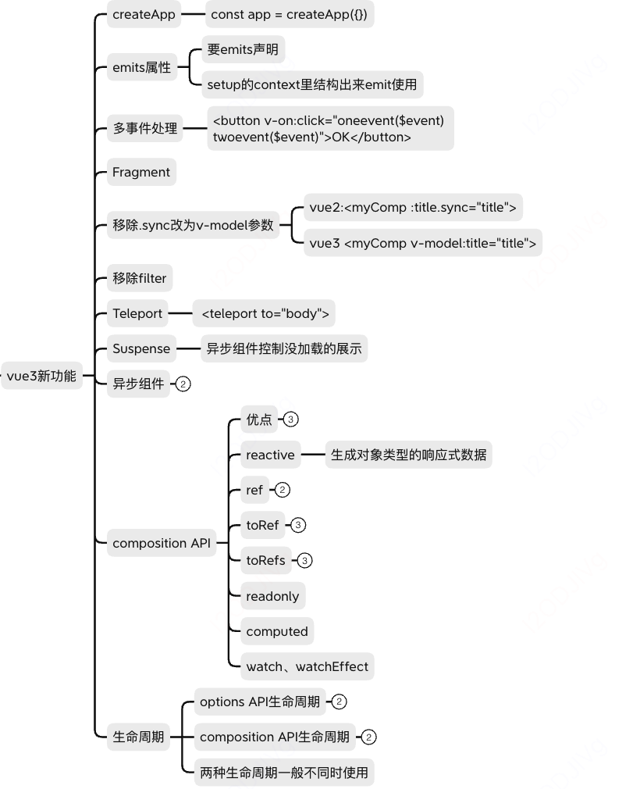


### 生命周期

Options API的生命周期：

>beforeDestory修改为beforeUnmount
>
>destoryed修改为unmounted

compisition API的生命周期：

>setup等效于beforeCreate和created的作用
>
>onBeforeMount(()=>{})
>
>onMounted
>
>onBeforeUpdate
>
>onUpdated
>
>onBeforeUnmount
>
>onUnmounted

### composition API

#### setup如何获取组件实例

setup里没有this，包括onMounted()也不能使用，只能用getCurrentInstance(), 并且data里初始化的变量在setup里直接拿也拿不到，因为setup自己生命周期早于data, 只能在onMounted拿到

```js
export default{
  data: {
    return {
      name: 'yoly'
    }
  }
  setup(){
    onMounted(()=>{
      const currentInstance = getCurrentInstance()
      console.log('name', currentInstance.data.name)
    })
  }
}
```

#### 和react hooks的区别

>Coposition api里的setup只会被调用一次，而react hooks可能被调用多次
>
>composition里没有useMemo、useCallback, 因为setup只会被调用一次
>
>composition里不需要考虑调用顺序，而hooks需要考虑调用顺序
>
>composition的reactive+ref比react hooks的useState难以理解

#### 比options API好处

>+ 更好的代码组织： vue2的复杂逻辑分散在data,method,computed等各个部分，不好维护，使用后可以把各个散落的代码整合在setup或者单独的js文件里再进行引入
>+ 更好的逻辑复用：vue2中已有的代码复用的方法，mixin,filters存在缺陷
>+ 更好的类型推导： vue2对ts的支持不充分

#### ref

+ 生成值类型的响应式数据
+ 可以直接用于模版和reactive
+ 其他情况赋值和获取都要加nameRef.value=, 一般推荐命名方式为nameRef， 变量后加Ref

```js
import { defineComponent, ref } from "vue";
...
setup() {
    let nameRef = ref("NIHAO"); // nameRef:{value:"NIHAO"}
    setInterval(() => {
      nameRef.value += 1;
    }, 1000);
    return {
      name: nameRef,
    };
  },
```

#### toRef

+ 针对响应式对象(被reactive封装的对象)的prop,  可以创建一个ref, 新的ref和对象的属性之间会保持引用的关系
+ 针对普通对象则不具有响应式

```js
import { defineComponent, ref, reactive, toRef } from "vue";
...
setup() {
  cosnt state = reactive({
    name: 'yoly',
    age: 18
  })
  const nameAgeRef = toRef(state, name)
  
  setTimeout(()=>{
    state.name = "Bod"
  },1000)
    return {
      state,
      nameAgeRef
    };
  },
```

state的name改动了，那么nameAgeRef也改动，两者保持引用关系

#### toRefs

+ 将响应式对象(reactive)转化为普通对象
+ 对象的每个prop都变为Ref
+ 两者保持引用关系

```js
import { defineComponent, ref, reactive, toRefs } from "vue";
...
setup() {
  cosnt state = reactive({
    name: 'yoly',
    age: 18
  })
  const stateRefs = toRefs(state)
  
  const {age , name} =stateRefs
  setTimeout(()=>{
    state.name = "Bod"
  },1000)
   return {
      stateRefs,
    };
  },
```

在使用时， 针对stateRefs就可以解构时候而不会失去响应, 在模板里可以直接使用{{age}}, {{name}}

#### watch和watchEffect的区别

都可以监听数据变化， watch需要明确监听哪一个属性,watchEffect会自动根据写的代码监听对应的属性

```js
export default{
  setup(){
    const numRef = ref(200)
    
    const stateRef = reactive({
      name: 'yoly',
      age: 18
    })
    
    watch(numRef,(newVal,oldVal)=>{
      cosnole.log('newVal,oldVal', newVal,oldVal)
    },{
      imediate: true // 初始化之前就监听，可选项
    })
    
    watch(
      ()=> stateRef.name, // 指定监听属性
      
      (newVal,oldVal)=>{
      cosnole.log('newVal,oldVal', newVal,oldVal)
    },{
      imediate: true // 初始化之前就监听，可选项
    })
    
    // watchEffect自动监听
    watchEffect(()=>{
      // 初始化时候自动监听一次，搜集需要监听的数据
      console.log('stateRef', stateRef.name)
    })
    
  }
}
```


### createApp

```js
// vue3
import { createApp } from 'vue'
const app = createApp({})
app.use()
app.mixin()
app.component()
app.directive()

// vue2
const app = new Vue({})
Vue.use()
Vue.mixin()
Vue.component()
Vue.directive()
```

### emits属性

要在emits里声明， 然后setup里使用

```vue
// vue3
<template>
  <div>
    <p>{{ text }}</p>
    <button v-on:click="$emit('accepted', )">OK</button>
  </div>
</template>
<script>
  export default {
    props: ['text'],
    emits: ['accepted'],
    setup(props, {emit}){
      emit('accepted', '传递的参数')
    }
  }
</script>
// vue2
this.$emit('accepted', '传递的参数')
```

### 多事件处理

```vue
<button v-on:click="oneevent($event) twoevent($event)">OK</button>
```

### Fragments（碎片）

Vue 3 支持 Fragments，允许组件返回多个根节点而无需包装额外的 HTML 元素, 不在dom树中出现。

+ 在vue2中，每个组件只能有一个根节点，如果有多个节点，必须外层使用一个div进行全部的包裹
+ vue 3.x中，vue template支持多个根节点,减少标签层级, 减小内存占用

```vue
<template>
  <div>hello</div>
  <div>hello2</div>
</template>
```

### 移除.sync

```vue
// vue2
<myComp :title.sync="title">
// vue3
<myComp v-model:title="title">
```

### 移除filter

```vue
<template>
  <h1>Bank Account Balance</h1>
  <p>{{ accountBalance | currencyUSD }}</p>
</template>

<script>
  export default {
    props: {
      accountBalance: {
        type: Number,
        required: true
      }
    },
    filters: {
      currencyUSD(value) {
        return '$' + value
      }
    }
  }
</script>
```

### 异步组件

```js
// vue2通过将组件定义为返回 Promise 的函数来创建
const asyncModal = () => import('./Modal.vue')

const asyncModal = {
  component: () => import('./Modal.vue'),
  delay: 200,
  timeout: 3000,
  error: ErrorComponent,
  loading: LoadingComponent
}

// vue3
const asyncModal = defineAsyncComponent(() => import('./Modal.vue'))
const asyncModalWithOptions = defineAsyncComponent({
  loader: () => import('./Modal.vue'),
  delay: 200,
  timeout: 3000,
  errorComponent: ErrorComponent,
  loadingComponent: LoadingComponent
})
```

### Teleport（传送门)

用于将组件的内容渲染到 DOM 中的不同位置。希望逻辑上在当前位置，但是实际位置在DOM上的其他位置,  这在处理模态框等需要在组件外部渲染的情况下非常有用。它不受父级`style`、`v-show`等属性影响，但`data`、`prop`数据依旧能够共用。

```vue
<template>
  <div>hello</div>
  <teleport to="body">这里是teleport</teleport>
</template>

//编译后
function render(_ctx, _cache) {
  with (_ctx) {
    const { createVNode, openBlock, createBlock, Teleport } = Vue
    return (openBlock(), createBlock(Teleport, { to: "body" }, [
      createVNode("div", null, " teleport to body ", -1 /* HOISTED */)
    ]))
  }
}
```

+ 如果设置:disabled 为true,则不会移动位置
+ 在同一目标上使用多个 teleport：挂载多个teleport，则是按顺序挂载
+ 如果 `<teleport>` 包含 Vue 组件，则它仍将是 `<teleport>` 父组件的逻辑子组件

### Suspense

场景：加载组件的时候，需要时间，那么我们希望在加载完成之前显示loading，加载完成后显示组件

```vue
<template>
  <div v-if="loading">loading...</div>
  <div v-else>...组件内容</div>
</template>
```

自带两个 slot 分别为 default、fallback。当要加载的组件不满足状态时,Suspense 将处于 fallback状态一直到加载的组件满足条件，才会进行渲染。

<Suspense>的出现让我们在vue中需要去处理异步的时候更加方便，**不需要自己手动控制全局的变量或者是一个isLoading的变量**。当#defaut内部有多个异步组件，则需要等待全部异步组件加载完成才进行显示，全部加载完成之前显示的是loading状态,  可以使用onErrorCapurted来配合处理加载错误的情况。

```vue
<div v-if="error">error</div>
<Suspense v-else>
    <template #default>
    </template>
    <template #fallback>
      loading...
    </template>
 </Suspense>


async setup() {
    let res = await getUserInfo()
    const error = ref(null);
    onErrorCaptured(e => {
      error.value = e;
      return false;
    });
    return { res, error };
  },
```

异步组件可以设置suspensible:false摆脱suspense的控制

## vue3实现响应式

### proxy

相较于Object.defineProperty劫持某个属性，Proxy则更彻底，不在局限某个属性，而是直接对整个对象进行代理

```js
function reactive(target={}){
  if(typeof target!==object || target===null){
    // 不是对象则不处理
    return target
  }
  
  const proxyConf = {
    {
        get: function (target, propKey, receiver) {
            // 只代理本身的属性，不代理原型上的属性， 比如数组get的时候就不去代理length这个属性
            const ownKeys =  Reflect.ownKeys(target)
            if(ownKeys.includes(key)){
               console.log(`getting ${propKey}!`);
            }
            const result = Reflect.get(target, propKey, receiver);
            // 处理嵌套对象，并且是在get的时候采取深度监听
            // Object.defineProperty是需要一次性递归
            return reactive(result)
        },
        set: function (target, propKey, value, receiver) {
            console.log(`setting ${propKey}!`);
            // 两次set的数据相同则不处理
            if(value === target[key]){
              return true
            }
            return Reflect.set(target, propKey, value, receiver); //结果为true或者false
        },
        deleteProperty: function (target, propKey) {
            console.log(`delete ${propKey}!`);
            delete target[propKey];
            return true;
        }
  }
  
  return new Proxy(target, proxyConf)
}

var target = {}
```

Proxy直接代理了`target`整个对象,不仅能够监听到属性的增加，还能监听属性的删除,不管是数组下标或者数组长度的变化，还是通过函数调用，Proxy都能很好的监听到变化.

优化结果

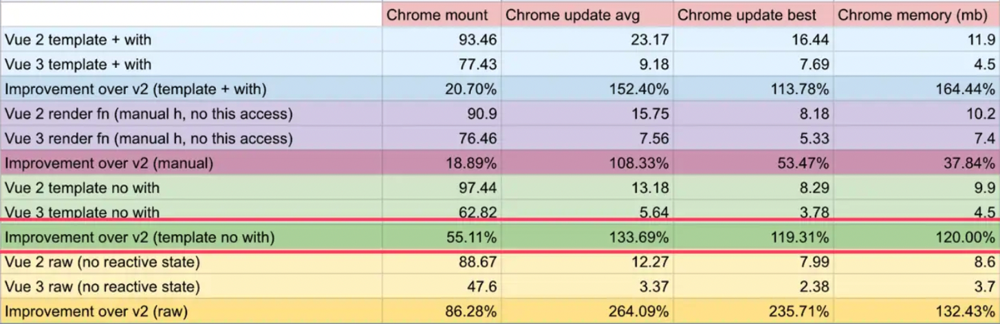

整体上，比`Vue 2.x` 内存占用少一半以上，总体速度快一倍以上。

+ 相比vue 2有1.3到2倍的性能优势。
+ 服务器渲染也完全重写，从模板编译到服务器渲染生成完全不同的渲染函数，可以比vue 2快2~3倍。

### Reflect

+ 和Proxy的能力对应
+ 规范化标准化， Object.defineProperty等方法应该慢慢调整为Reflect.ownKeys

## vite

前端打包工具， 开发环境不需要打包为es5，直接使用es module启动非常快, 但是生产环境还是得使用rollup

es module的用法

```js
// export default的例子
<script type="module">
  import add from 'xxx'
  add(10,20)
</script>

// export多个的例子
<script type="module">
  import {add1, add2} from 'xxx'
</script>

// 外链
<script type="module" src="index.js">
</script>

//mjs远程文件
<script type="module">
  import {createStore } from 'http://xxxx.mjs'
</script>

// 动态按需引入
<script type="module">
  document.getElementById('btn1').addEventListener(async()=>{
    const add = await import('xxxx')
})
</script>
```

## jsx

可以在vue的setup里直接写render函数返回， 也可以直接新建后缀为.jsx的文件

```js
<scritp>
export default{
  setup(){
     const countRef = ref(0)
     const render=()=>{
       return <p>demo {countRef.value}</p>  // 单括号
     }
     return render
  }
}
</script>
```

defineComponent里可以写vue组件配置，也可以直接写setup

```js
//vue组件配置
export default defineComponent{
  name: 'ChildrenComp',
  props: ['a']
  setup(){
  }
}
// 直接写setup
export default defineComponent{
  const countRef = ref(0)
  const render=()=>{
    return <p>demo {countRef.value}</p>  // 单括号
  }
  return render
}
```

### jsx和templte的区别

语法上有很大区别，但是本质是一样的

>jsx本质上是js，可以使用js的任何能力， template是vue的规范，只能嵌入简单的js表达式，更复杂的需要指令完成，比如v-if, v-for
>
>jsx是ES规范，template只是vue的规范
>
>jsx和template都会被编译为js代码（render函数）

#### 插值

jsx是单引号插入，template要用双引号, 如以下countRef

```vue
<template>
  <p>{{countRef}}</p>
</template>

<scritp>
export default{
  setup(){
     const countRef = ref(0)
     const render=()=>{
       return <p>demo {countRef.value}</p>  // 单括号
     }
     return render
  }
}
</script>
```

#### 自定义组件的引入

jsx里必须引入什么组件名字就写成什么名字，但是template里可以把组件名改为横线

#### 组件传值

简单的属性直接属性等于字符串

动态属性，template要有冒号和双引号， jsx不需要冒号，需要单括号

```vue
<template>
  <children-comp :name="value"  age="132323"></children-comp>
</template>

<scritp>
export default{
  setup(){
     const countRef = ref(0)
     const render=()=>{
       return <ChildrenComp name={value} age="132323"><ChildrenComp> // 单括号
     }
     return render
  }
}
</script>
```

#### 事件

template里需要@， 而jsx不需要区分直接是变量名=单引号，引号内是事件

```vue
<template>
  <children-comp @change="handlechange"></children-comp>
</template>

<scritp>
export default{
  setup(){
     const countRef = ref(0)
     const render=()=>{
       return <ChildrenComp change={onChange}><ChildrenComp> // 单括号
     }
     return render
  }
}
</script>
```

#### 条件和循环

条件判断在template里用v-if， 在jsx里直接单括号里表达式

循环在template里用v-for， 在jsx里直接单括号里表达式

```vue
<template>
  <p v-if="flag">demo</p>
</template>

<scritp>
export default{
  setup(){
     const render=()=>{
       return {flag.value && <p>demo<p>} 
     }
     return render
  }
}
</script>
```

```vue
<template>
  <p v-for="(item, index) in list" :key="item">{{item}}</p>
</template>

<scritp>
export default{
  setup(){
     const render=()=>{
       return {list.map((item)=>{
          return <p>{item}</p>
      })} 
     }
     return render
  }
}
</script>
```

### 插槽

是vue发明的概念，为了完善template的能力，因为template本身只能插入简单的js

以下是作用域插槽的不同实现

```vue
// 子组件
<template>
  <p>child</p>
  <slot :msg="msg"></slot>
</template>

// 父组件需要子组件的msg
<template>
  <p>parent</p>
  <child>
   <template v-slot:default="slotPtops">
     {{slotPtops.msg}}
   </template>
  </child>
</template>
```

用jsx实现： 直接通过函数去拿取子组件的值

```js
// 子组件
export default defineCoponent(()=>{
   props: ['render']
   return ()=>{
     return <>
        <p>{props.render('2342342')}</p>
     </>
   }
})

// 父组件
export default defineCoponent(()=>{
   cunction render(msg){
      return <p>msg: {msg}</p>
   }
   return ()=>{
     return <>
        <p>parent</p>
        <child render={render}></child>
     </>
   }
})
```

### Vue3的script setup

使用方法是<script setup>里面的代码实际上就是setup内执行的代码

+ 顶级变量、自定义组件可以直接用于模版不需要return

+ 可以正常使用ref.reactive等能力

+ 可以和其他script同时使用

+ 属性和事件使用defineProps和defineEmits

  ```js
  const props = defineProps({
     name: String
   })
  
  const emit = defineEmits(['change', 'click'])
  function handleClick(){
    emit('click')
  }
  <p @change="$emit('change')" @clicl="handleClick"> {{props.name}}</p>
  ```

+ defineExpose暴露数据给父组件

# 问题

## 1.vue3比vue2优势

>+ 性能更好
>+ 体积更小
>+ 更好的ts支持
>+ 更好的代码组织：composition API
>+ 更好的逻辑抽离: composition API
>+ 更多的新功能

## 2.vue3生命周期

>Composition API: onBeforeUpdate..., setup
>
>options API： beforeDestory-->beforeUnmount, destroyed-->unmounted

## 3.composition API VS options API

>不是必须抛弃options API
>
>composition API 的代码组织好、实现复用可以解决mixins等方法的缺点、ts支持好

## 4.如何理解ref、toRef、toRefs

>ref是基础类型包装为响应式
>
>toRef是响应式对象的属性包装为响应式
>
>toRefs是响应式对象的属性一次性都包装为响应式

## 5.vue3新功能

>createApp、Fragment、defineAsyncComponent、suspense、teleport、composition API、v-model:title、

## 6.composition API如何实现代码逻辑复用

>抽象方法出去，返回响应式对象

## 7.vue3如何实现响应式

>proxy代理get和set、深度响应式、不监听原生的length方法， 不重复监听相同的改动

## 8.watch和watchEffect的区别

>watch必须指定属性，watchEffect根据内容自动监听

## 9. setup如何获取组件实例

>getCurrentInstance()

## 10.vue3为什么比vue2快

>编译优化
>
>+ proxy响应式
>+ patchFlag
>+ hoistStatic
>+ cacheHandler
>+ SSR优化
>+ tree shaking

## 11.vite是什么

>打包工具，开发环境利用浏览器原生的es module, 不需要打包速度快

## 12.composition和react hooks的对比

>composition的setup只能执行一次，没有useMemo和useCallback, 不需要考虑顺序，但是reactive和ref比useState的理解成本更大


# vue3 VS vue2

## vue2升vue3的动机

+ 体积更小：移除不常用api，引入tree shaking,打包体积更小
+ 性能更好：diff算法优化，静态提升，事件监听缓存，ssr优化， 数据劫持优化
+ 更友好：兼顾vue2的options API的同时，推出了composition API，增加了代码维护和组织能力
+ 提高自身可维护性：源码通过monorepo维护的，根据功能把不同的模块拆分到package目录下不同子目录下，模块拆分更明确，模块之间的依赖关系也更明确，而且比如响应式库reactive可以单独引入而不需要引入整个vue库
+ 开放更多底层功能，便于社区的二次开发

## (1)性能提升

### 体积优化

源码体积变小，与Vue2相比较，Vue3整体体积变小了

+ 移除了一些比较冷门的feature：如 keyCode 支持作为 v-on 的修饰符、on、off 和 $once 实例方法、filter过滤、内联模板等。
+ 在 vue2 中，很多函数都挂载到全局 Vue 对象上，如：nextTick、set 函数等，虽然我们不常用，但打包时只要引入 Vue 这些全局函数会打包进 bundle 中。而 vue3 中，引入tree-shaking，所有的 API 都通过 ES6 模块化的方式引入，这样就能够让 webpack 或 rollup 等打包工具在打包时，就会自动对没有用到的 API 进行剔除，最小化 bundle 体积。

### 编译优化

#### 静态标记（PatchFlag）

+ Vue2 中的虚拟dom是进行全量的对比（实际上有的节点是静态的，比如固定的文字，不需要进行对比更新的）
+ Vue3 新增了静态标记（PatchFlag），只比对带有 PatchFlag 的节点（在编译阶段进行分析，判断出节点是动态的还是静态的），并且通过 Flag 的信息得知 当前节点要比对的具体内容，比如是class还是文本。如果是负数，不需要再对其子节点进行diff

#### 静态提升（hoistStatic）

+ Vue2中无论元素是否参与更新, 每次都会重新创建, 然后再渲染
+ Vue3中对于不参与更新的元素, 会做静态提升, 只会被创建一次, 在渲染时直接复用即可
+ 存在临近的静态节点的合并

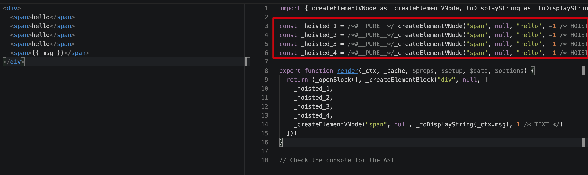

#### cacheHandlers 事件侦听器缓存

+ 默认情况下onClick会被视为动绑定, 所以每次都会去追踪它的变化
+ 但是因为是同一个函数，所以没有追踪变化, 直接缓存起来复用即可

第一次渲染

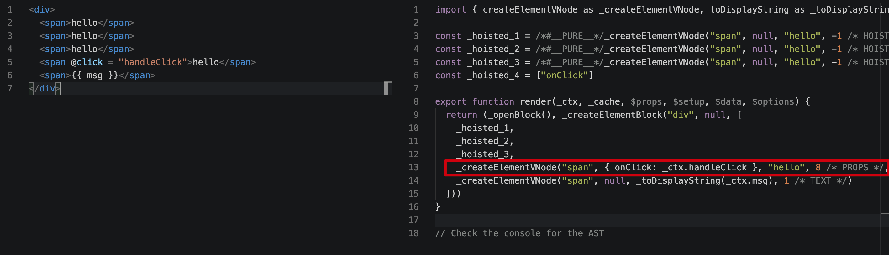

第二次渲染：会从缓存中读同一个函数，因为是同一个函数，也就没有追踪变化的必要，这样就会避免一些没必要的更新。

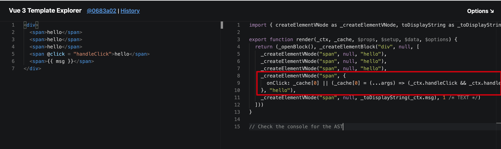

#### ssr渲染

+ 当有大量静态的内容时候，这些内容会被当做纯字符串推进一个buffer里面，即使存在动态的绑定，会通过模板插值嵌入进去。这样会比通过虚拟dom来渲染的快上很多很多。
+ 当静态内容大到一定量级时候，会用_createStaticVNode方法在客户端去生成一个static node， 这些静态node，会被直接innerHtml，就不需要创建对象，然后根据对象渲染。

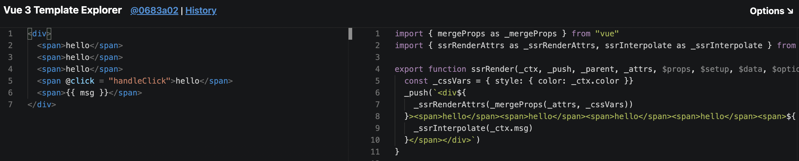

### 数据劫持优化

Proxy 对象以及优化过的响应式系统, 详细见上述分析

## (2)Composition API

### setup

setup就是在vue3中要使用 composition api 的地方，在setup里组织我们的代码。在组件创建之前执行,也就是在method、computed等之前被调用(===>避免在setup中使用this),  setup提供以下几个函数：

```js
// 1.ref、reactive：定义响应式变量, 变量值要通过xx.value获取，在模版中访问不需要使用.value 进行访问

// (1)ref
import { defineComponent, ref } from "vue";
...
setup() {
    let nameRef = ref("NIHAO"); // nameRef:{value:"NIHAO"}
    setInterval(() => {
      nameRef.value += 1;
    }, 1000);
    return {
      name: nameRef,
    };
  },
  
// (2)reactive: 返回对象的响应式副本,reactive将解包所有深层的 refs，同时维持 ref 的响应性（引用类型）
    
import { defineComponent, reactive } from "vue";
...
setup() {
    let nameReactive = reactive({
      name: "nihao",
    });
    setInterval(() => {
      nameReactive.name += 1;
    }, 1000);
    return {
      nameReactive,
    };
  },
...
 <p>{{ nameReactive.name }}</p>

// 2.toRefs：解构响应式对象数据
// 3.watch、watchEffect：监听data变化
// (1)watch: deep深度监听, immediate直接监听
import { watch } from 'vue'
export default {
  setup (props) {
    watch(age, (currentValue, preValue) => {
      console.log(currentValue, preValue)
    },{
      deep:true,
      immediate:true
    })
  }
}
// (2)watchEffect:立即执行传入的一个函数，同时响应式追踪其依赖，并在其依赖变更时重新运行该函数。
watchEffect(() => {
  getList(id.value)  
})

watch与watchEffect相比：

+ 两者都可以监听data属性的变化
+ watch需要明确监听的是哪个属性，可以访问被侦听状态的先前值和当前值
+ watchEffect 会根据其中的属性自动监听其变化，写了哪个就会监听哪个，没写就不监听watch是惰性执行：即回调仅在侦听源发生变化时被调用，除非设置了初始化监听；watchEffect在初始化时，一定会执行一次。

// 4/computed：计算属性生命周期钩子, 返回一个不可变的响应式ref对象
import { defineComponent, ref, computed } from "vue";
...
setup() {
    let nameRef = ref("NIHAO");
    setInterval(() => {
      nameRef.value += 1;
    }, 1000);
    let nameRef2 = computed(() => {
      return nameRef.value + 2;
    });
    return {
      name: nameRef,
      name2: nameRef2,
    };
  },
```

### props、context

第一个参数：props是一个对象，包含父组件传递给子组件的所有数据setup函数中的props是响应式的，当传入新的prop时，它将被更新

因为props是响应式的，不能使用ES6解构，因为它会消除prop的响应式。可以通过使用setup函数中的toRefs来安全的完成

```js
export default {
  props: {
    title: String
  },
  setup(props) {
    console.log(props.title)
  }
}

import { toRefs } from 'vue'
setup(props) {
	const { title } = toRefs(props)
	console.log(title.value)
}
```

第二个参数：context对象,暴露三个属性:

+ attrs等同于$attrs，获取在当前组件上定义的所有属性的对象。
+ 非响应式对象slots：等同于$slots，
+ 插槽emit：等同于$emit，触发事件 (事件分发,传递给父组件需要使用该事件)

```js
export default {
  setup(props, context) 
    // Attribute (获取当前标签上的所有属性的对象。非响应式对象)
    console.log(context.attrs)
    // 插槽 (非响应式对象)
    console.log(context.slots)
    // 触发事件 (emit事件分发,传递给父组件需要使用该事件。)
    console.log(context.emit)
  }
}
```

context不是响应式的，所以可以直接解构使用

```js
export default {
  setup(props, { attrs, slots, emit }) {
    ...
  }
}
```

## (3)Teleport（传送门)

用于将组件的内容渲染到 DOM 中的不同位置。希望逻辑上在当前位置，但是实际位置在DOM上的其他位置,  这在处理模态框等需要在组件外部渲染的情况下非常有用。它不受父级`style`、`v-show`等属性影响，但`data`、`prop`数据依旧能够共用。

```vue
<template>
  <div>hello</div>
  <teleport to="body">这里是teleport</teleport>
</template>

//编译后
function render(_ctx, _cache) {
  with (_ctx) {
    const { createVNode, openBlock, createBlock, Teleport } = Vue
    return (openBlock(), createBlock(Teleport, { to: "body" }, [
      createVNode("div", null, " teleport to body ", -1 /* HOISTED */)
    ]))
  }
}
```

+ 如果设置:disabled 为true,则不会移动位置
+ 在同一目标上使用多个 teleport：挂载多个teleport，则是按顺序挂载
+ 如果 `<teleport>` 包含 Vue 组件，则它仍将是 `<teleport>` 父组件的逻辑子组件

原理

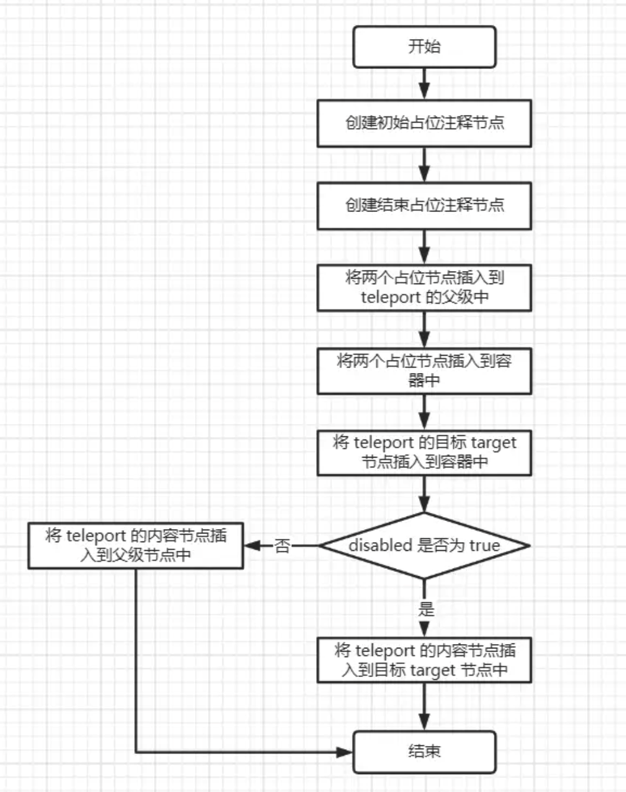

## (4)Fragments（碎片）

Vue 3 支持 Fragments，允许组件返回多个根节点而无需包装额外的 HTML 元素, 不在dom树中出现。

+ 在vue2中，每个组件只能有一个根节点，如果有多个节点，必须外层使用一个div进行全部的包裹
+ vue 3.x中，vue template支持多个根节点,减少标签层级, 减小内存占用

```vue
<template>
  <div>hello</div>
  <div>hello2</div>
</template>
```

## (5)Suspense

场景：加载组件的时候，需要时间，那么我们希望在加载完成之前显示loading，加载完成后显示组件

```vue
<template>
  <div v-if="loading">loading...</div>
  <div v-else>...组件内容</div>
</template>
```

自带两个 slot 分别为 default、fallback。当要加载的组件不满足状态时,Suspense 将处于 fallback状态一直到加载的组件满足条件，才会进行渲染。

<Suspense>的出现让我们在vue中需要去处理异步的时候更加方便，**不需要自己手动控制全局的变量或者是一个isLoading的变量**。当#defaut内部有多个异步组件，则需要等待全部异步组件加载完成才进行显示，全部加载完成之前显示的是loading状态,  可以使用onErrorCapurted来配合处理加载错误的情况。

```vue
<div v-if="error">error</div>
<Suspense v-else>
    <template #default>
    </template>
    <template #fallback>
      loading...
    </template>
 </Suspense>


async setup() {
    let res = await getUserInfo()
    const error = ref(null);
    onErrorCaptured(e => {
      error.value = e;
      return false;
    });
    return { res, error };
  },
```

异步组件可以设置suspensible:false摆脱suspense的控制

## (6)Custom Renderer API

+ Custom Renderer API 是什么？

>自定义渲染器API,用于自定义render函数,其实就是createRenderer API

+ Custom Renderer API 的意义？

> 跨平台，虚拟dom优点之一就是便于实现跨平台，只要使用不同的虚拟dom到真实dom的渲染过程，就可以实现一套代码，多个平台使用的目的，因此不再需要为了自定义一些功能而 fork Vue 的代码。这个特性给 Weex 和 NativeScript Vue 这样的项目提供了很多便利。

## vue3渲染流程

```js
import { createApp } from "vue";
import App from "./App.vue";
console.log("APP", App);
console.log("APP.render", App.render());
createApp(App).mount("#app");
```

https://vue-next-template-explorer.netlify.app/#eyJzcmMiOiI8ZGl2PlxuICA8c3Bhbi8+XG4gIDxzcGFuPnt7IG1zZyB9fTwvc3Bhbj5cbjwvZGl2PiIsIm9wdGlvbnMiOnt9fQ==

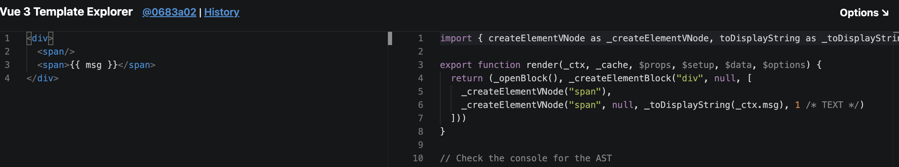

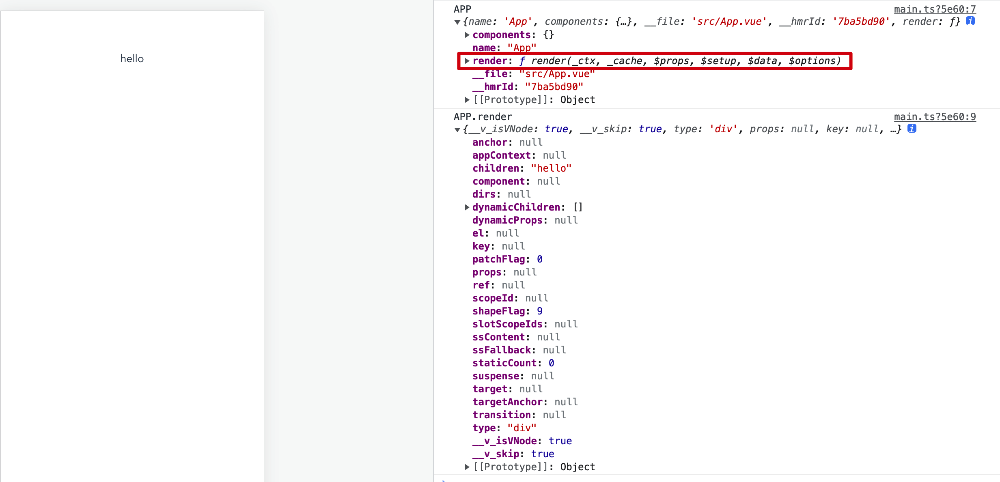

template-->render()-->vnode-->**渲染为真实的dom元素(createApp)**-->挂载到根节点上(mount)


# vue3相对vue2在使用上的差异

## 1.代码组织方案

使用composition Api代替options Api

## 2.逻辑复用方案

使用组合式函数hooks代替mixin,

 Vue2的旧项目里抽取重复利用的代码时，一般使用mixin。

而Vue3的项目中，使用Hooks代替mixin。Vue3 Hooks是一种函数式的API，可以在组件之间复用状态逻辑。函数包括setup、reactive、ref等，以及一系列生命周期函数如onMounted、onUpdated等。

hooks相比于mixin, 属性来源一目了然，有效避免命名冲突， 复杂度更低，更清晰

## 3.新特性

- fragments片段：组件支持有多个根节点
- Teleport组件：支持将模版移动到DOM中Vue app之外的其他位置
- suspense：等待异步组件时额外渲染一些内容

## 4.**非兼容变更**

+ Events API的弃用。Vue实例再也不能作为事件总线做事件通信
+ setup()中不能使用this

- 移除filter过滤 => 替代方案：方法调用或者计算属性

- 移除on、off和$once实例方法

  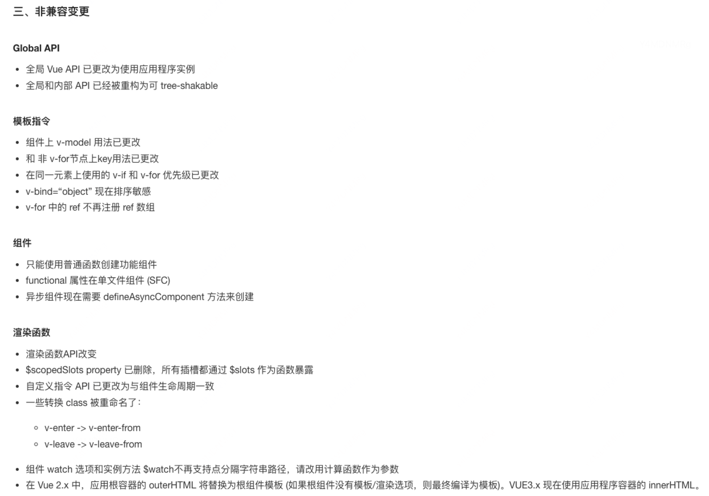

.png)

# vuex VS pina

## 状态管理为什么选择Pinia？

Pinia是Vue官方推荐的默认状态管理库，是Vuex的替代者。与 Vuex 相比，Pinia 提供了一个更简单的 API，具有更少的仪式，提供了 Composition-API 风格的 API。最重要的是，在与 TypeScript 一起使用时具有可靠的类型判断支持。

## Pinia的优势

- 抛弃传统的Mutation，只有state、getter和action，更简单，少写代码，降低心智负担
- 不需要modules嵌套结构，更加扁平化
- 更友好的TS支持，有可靠的类型判断
- 更加轻量和简便，体积小
- 性能比vuex更出色，打包时自动拆分
- Vue devtools支持调试

## Pinia与Vuex代码分割机制对比

旧的项目使用Vuex状态管理，多页面使用多个store是这样组织代码的：

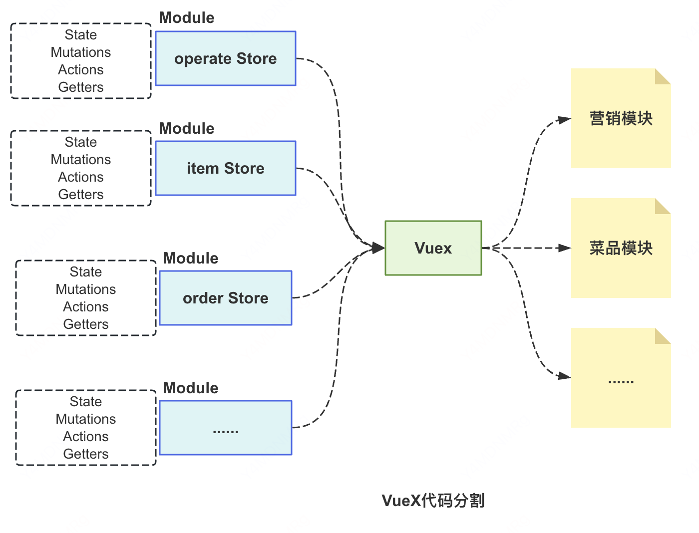

Vuex需要嵌套module，并且打包时会出现资源浪费，需要做按需加载的优化。

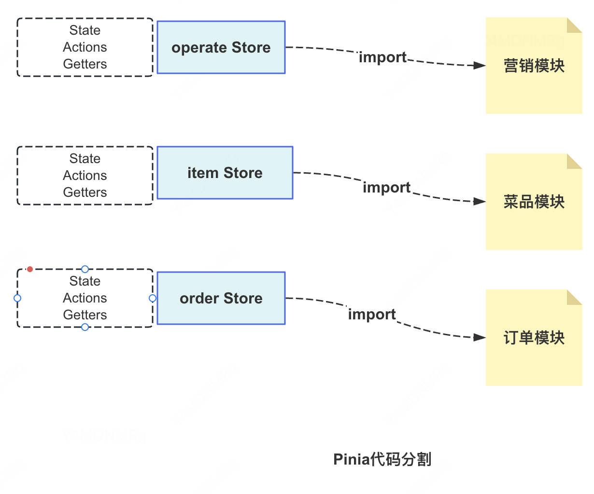

Pinia不需要嵌套module，有更扁平化的结构，并且打包时，只会把用到的store和页面进行打包，不会耦合其他store。

# 国际化

vue3需要更新vue-i18n到9.x版本。