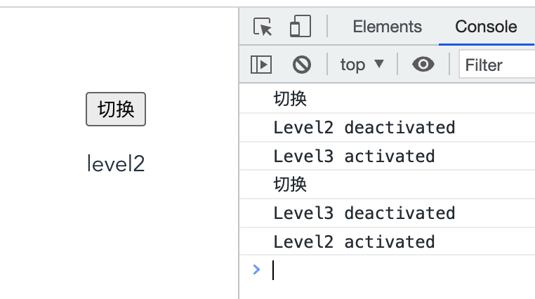

[toc]

# composition API

## 1.为什么要用composition API

+ vue2的复杂逻辑分散在data,method,computed等各个部分，不好维护，使用后可以把各个散落的代码整合在setup或者单独的js文件里再进行引入
+ vue2中已有的代码复用的方法，mixin,filters存在缺陷
+ vue2对ts的支持不充分

## 2.setup

setup就是在vue3中要使用 composition api 的地方，在setup里组织我们的代码。setup提供以下几个函数：

+ ref、reactive：定义响应式变量
+ toRefs：解构响应式对象数据
+ watch、watchEffect：监听data变化
+ computed：计算属性生命周期钩子

在组件创建**之前**执行,也就是在method、computed等之前被调用(===>避免在setup中使用this)

返回普通的变量,此时只会在初始化的时候执行一次

```js
 <p>{{ name }}</p>
 ...
 setup() {
    return {
      name: "nihao",
    };
  },
```

## 3.响应式变量 

ref、reactivesetup里直接定义变量是非响应式的，vue3可以通过一个新的ref函数使任何响应式变量在任何地方起作用。简单理解就是 ref 对我们的值创建了一个响应式引用。

注：变量值要通过xx.value获取，在模版中访问不需要使用.value 进行访问

```js
import { defineComponent, ref } from "vue";
...
setup() {
    let nameRef = ref("NIHAO"); // nameRef:{value:"NIHAO"}
    setInterval(() => {
      nameRef.value += 1;
    }, 1000);
    return {
      name: nameRef,
    };
  },
```

+ reactive:返回对象的响应式副本,`reactive` 将解包所有深层的 [refs](https://v3.cn.vuejs.org/api/refs-api.html#ref)，同时维持 ref 的响应性（引用类型）

```js
import { defineComponent, reactive } from "vue";
...
setup() {
    let nameReactive = reactive({
      name: "nihao",
    });
    setInterval(() => {
      nameReactive.name += 1;
    }, 1000);
    return {
      nameReactive,
    };
  },
...
 <p>{{ nameReactive.name }}</p>
```

+ Computed：返回一个不可变的响应式 [ref](https://v3.cn.vuejs.org/api/refs-api.html#ref) 对象

```js
import { defineComponent, ref, computed } from "vue";
...
setup() {
    let nameRef = ref("NIHAO");
    setInterval(() => {
      nameRef.value += 1;
    }, 1000);
    let nameRef2 = computed(() => {
      return nameRef.value + 2;
    });
    return {
      name: nameRef,
      name2: nameRef2,
    };
  },
```

+ watch就像 vue2 中的 watch 选项监听变量一样，我们也可以使用从 vue3 中导入 watch 函数执行相同的操作。

```vue
import { watch } from 'vue'
export default {
  setup (props) {
    watch(age, (currentValue, preValue) => {
      console.log(currentValue, preValue)
    },{
      deep:true,
      immediate:true
    })
  }
}
```

一个响应式引用

一个回调可选的配置选项(deep深度监听, immediate直接监听)

+ watchEffect:

  立即执行传入的一个函数，同时响应式追踪其依赖，并在其依赖变更时重新运行该函数。

  ```
  watchEffect(() => {
    getList(id.value)  
  })
  ```

  watch与watchEffect相比：

  + 两者都可以监听data属性的变化
  + watch需要明确监听的是哪个属性，可以访问被侦听状态的先前值和当前值
  + watchEffect 会根据其中的属性自动监听其变化，写了哪个就会监听哪个，没写就不监听watch是惰性执行：即回调仅在侦听源发生变化时被调用，除非设置了初始化监听；watchEffect在初始化时，一定会执行一次。

## 4.参数props、context

第一个参数：props是一个对象，包含父组件传递给子组件的所有数据setup函数中的props是响应式的，当传入新的prop时，它将被更新

```
export default {
  props: {
    title: String
  },
  setup(props) {
    console.log(props.title)
  }
}
```

注：因为props是响应式的，不能使用ES6解构，因为它会消除prop的响应式。可以通过使用setup函数中的toRefs来安全的完成

```
import { toRefs } from 'vue'
setup(props) {
	const { title } = toRefs(props)
	console.log(title.value)
}
```

第二个参数：contextcontext对象,暴露三个属性:

+ attrs等同于$attrs，获取在当前组件上定义的所有属性的对象。
+ 非响应式对象slots：等同于$slots，
+ 插槽emit：等同于$emit，触发事件 (事件分发,传递给父组件需要使用该事件)

```js
export default {
  setup(props, context) 
    // Attribute (获取当前标签上的所有属性的对象。非响应式对象)
    console.log(context.attrs)
    // 插槽 (非响应式对象)
    console.log(context.slots)
    // 触发事件 (emit事件分发,传递给父组件需要使用该事件。)
    console.log(context.emit)
  }
}
```

context不是响应式的，所以可以直接解构使用

```js
export default {
  setup(props, { attrs, slots, emit }) {
    ...
  }
}
```

# 生命周期


+ vue3生命周期只是unmounted系列发生了变化，相对vue2有新增
+ 在composition API中，setup里采取加on前缀，且setup替代了beforeCreate和created

## 总体生命周期作用

+ beforeCreate

  ```
  创建一个空白的vue实例
  此时data,method都没有被初始化，不可以使用
  ```

+ created

  ```
  vue实例初始化完成，响应式绑定完成
  method初始化，可以使用
  
  但是这个时候还没有开始渲染模板，页面不可见
  ```

+ beforeMount

  ```
  编译模板，生成vdom
  
  但是还没开始渲染生成真实的dom
  ```

+ mounted

  ```
  完成了DOM的渲染，组件创建完成了
  ```

+ beforeUpdate

  ```
  data发生了变化，准备更新DOM
  ```

+ updated

  ```
  data发生了变化，并且DOM已经更新完成
  ```

+ beforeUnmounted

  ```
  组件准备销毁但是还没有销毁，还是可以正常使用
  可以在这个阶段进行自定义事件的解绑
  ```

+ unmounted

  ```
  组件被销毁，且所有子组件也被销毁
  ```

## keep-alive组件的生命周期

被 keep-alive 缓存的组件激活时调用。

+ activated 缓存组件被激活的时候使用
+ deactivated 缓存组件呗隐藏的时候调用

如下所示：

```vue
//Level1有两个子组件Level2和Level3,可以通过按钮切换两个组件的展示与隐藏
<template>
  <!-- eslint-disable -->
  <div class="container">
    <button @click="checkBtn">切换</button>
    <keep-alive>
       <Level2  v-if="level===2"/>
       <Level3  v-else/>
    </keep-alive>
  </div>
</template>

<script lang="ts">
/* eslint-disable */
import { defineComponent, computed} from "vue";
import Level2 from "./Level2.vue";
import Level3 from "./Level3.vue";
export default defineComponent({
  name: "Level1",
  components: {
    Level2,
    Level3
  },
  data(){
    return {
      level: 2
    }
  },
  methods:{
    checkBtn(){
      console.log('切换')
      if(this.level === 2){
        this.level=3
      }else{
        this.level=2
      }
    }
  }
});
</script>
```

```vue
//Level2两个生命周期函数进行监听
<template>
  <!-- eslint-disable -->
  <div class="container">
    <p>level2</p>
  </div>
</template>

<script lang="ts">
/* eslint-disable */
import { defineComponent, onDeactivated} from "vue";
export default defineComponent({
  name: "Level2",
  activated(){
    console.log('Level2 activated')
  },
  deactivated(){
    console.log('Level2 deactivated')
  }
});
</script>
```

```vue
//Level3类似实现
<template>
  <!-- eslint-disable -->
  <div class="container" >
     <p>level3</p>
  </div>
</template>

<script lang="ts">
/* eslint-disable */
import { defineComponent} from "vue";

export default defineComponent({
  name: "Level3",
  activated(){
    console.log('Level3 activated')
  },
  deactivated(){
    console.log('Level3 deactivated')
  }
});
</script>
```



## 其他问题

+ created和 mounted有什么区别?

```
created只是Vue实例化，还没有渲染
Mounted是tenmplate已经渲染完成了
```

+ 父子组件顺序

加载渲染过程

```
父beforeCreate->父created->父beforeMount->子beforeCreate->子created->子beforeMount->子mounted->父mounted
```

子组件更新过程

```
父beforeUpdate->子beforeUpdate->子updated->父updated
```

父组件更新过程

```
父beforeUpdate->父updated
```

销毁过程

```
父beforeDestroy->子beforeDestroy->子destroyed->父destroyed
```

从外到内，再从内到外

+ vue什么时候操作DOM方便

  ```
  mounted和updated都不能保证子组件完全挂载完成
  应该使用$nextTick
  mounted(){
    this.$nextTick(function(){
      //处理DOM操作
    })
  }
  ```

+ ajax应该在哪个生命周期使用

  ```
  created和mounted使用
  但是推荐mounted，因为created此时在处理一些method初始化
  ```


# Fragment

Fragments 作为vue3 的新特性之一，允许一个vue组件可以有多个根节点

+ 在vue2中，每个组件只能有一个根节点，如果有多个节点，必须外层使用一个div进行全部的包裹（目前可以在vue2中使用vue-fragments库来使用Fragments）
+ vue 3.x中，vue template支持多个根节点,减少标签层级, 减小内存占用

## Demo演示

```
<template>
  <div>hello</div>
  <div>hello2</div>
</template>
```


## 简单原理

Fragments用起来像一个普通的DOM元素，但它是虚拟的，根本不会在DOM树中呈现。所以Vue3组件可以没有根标签, 其内部会自动将多个标签包含在一个Fragment虚拟元素中。

# Teleport(portal)

 Portals(传送门) ，它的功能是将模板HTML移动到DOM不同地方的方法。希望逻辑上在当前位置，但是实际位置在DOM上的其他位置。比如模态框、对话框等，它不受父级`style`、`v-show`等属性影响，但`data`、`prop`数据依旧能够共用。

Portals是React中的一个常见特性，Vue2 中可以使用portal-vue库。Vue3 中，现在提供了 Teleport 来支持这一功能。

## 应用场景

像 modals,toast 等这样的元素，很多情况下，我们将它完全的和我们的 Vue 应用的 DOM 完全剥离，管理起来反而会方便容易很多，原因在于

+ 这些组件一般都是相对于浏览器窗口来定位，但是如果父元素的 `transform`, `perspective` 或 `filter` 属性不为 `none` 时，`fixed` 元素就会相对于父元素来进行定位，他们就会相对于父元素来定位了。还有任意的父元素下面的子元素如果z-index的层级比它们高，那么这些组件就会受到约束，这并不是我们希望的结果。
+ teleport不影响现有的父子组件关系，像 modals,toast 等这样的元素需要使用到 Vue 组件的状态（data 或者 props）的值，我们可以在组件的逻辑位置写模板代码，这意味着我们可以使用组件的 `data` 或 `props`。然后在 `Vue` 应用的范围之外渲染它

## 例子：

+ 基础用法

在组件<APP/>(应该挂载到#app节点)中，写一个teleport

```
<template>
  <div>hello</div>
  <teleport to="body">这里是teleport</teleport>
</template>
```

渲染完成后，发现teleport被挂载到body下


+ 如果设置:disabled 为true,则不会移动位置


+ 在同一目标上使用多个 teleport：挂载多个teleport，则是按顺序挂载

+ 如果 `<teleport>` 包含 Vue 组件，则它仍将是 `<teleport>` 父组件的逻辑子组件

```vue
const app = Vue.createApp({
  template: `
    <h1>Root instance</h1>
    <parent-component />
  `
})
 
app.component('parent-component', {
  template: `
    <h2>This is a parent component</h2>
    <teleport to="#endofbody">
      <child-component name="John" />
    </teleport>
  `
})
 
app.component('child-component', {
  props: ['name'],
  template: `
    <div>Hello, {{ name }}</div>
  `
})
```

在这种情况下，即使在不同的地方渲染 `child-component`，它仍将是 `parent-component` 的子级，并将从中接收 `name` prop。

## 简单原理

```Vue
Vue.createApp({
  template: `
    <Teleport to="body">
      <div> teleport to body </div>  
    </Teleport>
  `
})
```

编译之后

```
function render(_ctx, _cache) {
  with (_ctx) {
    const { createVNode, openBlock, createBlock, Teleport } = Vue
    return (openBlock(), createBlock(Teleport, { to: "body" }, [
      createVNode("div", null, " teleport to body ", -1 /* HOISTED */)
    ]))
  }
}
```


+ 使用createBlock创建Teleport
+ `createBlock` 的第一个参数为 `Teleport`，最后得到的 vnode 中会有一个 `shapeFlag` 属性，该属性用来表示 vnode 的类型。`isTeleport(type)` 得到的结果为 `true`，所以 `shapeFlag` 属性最后的值为 `ShapeFlags.TELEPORT`（`1 << 6`）。
+ 在组件的 render 节点，会依据 `type` 和 `shapeFlag` 走不同的逻辑,在处理 `Teleport` 时，最后会调用 `Teleport.process`
+ Teleport.process处理逻辑：
  + 创建并挂载注释节点：创建两个注释 `VNode`，插入此时 `teleport` 组件在页面中的对应位置，即插入到 `teleport` 的父节点 `container` 中
  + 挂载 target 节点和占位节点：判断 `teleport` 组件对应 `target` 的 `DOM` 节点是否存在，存在则插入一个**空的文本节点**，也可以称为**占位节点**：
  + 定义挂载函数 mount：定义 `mount` 方法来为 `teleport` 组件进行特定的挂载操作
  + 根据 disabled 处理不同逻辑：`teleport` 组件提供了一个 `props` 属性 `disabled` 来控制是否将内容显示在目标 `target` 中。所以，最后会根据 `disabled` 来进行不同逻辑的处理，为true就作为注释节点，为false就作为空的文本节点

# Suspense

场景：加载组件的时候，需要时间，那么我们希望在加载完成之前显示loading，加载完成后显示组件

```vue
<template>
  <div v-if="loading">loading...</div>
  <div v-else>...组件内容</div>
</template>
```

如果一个页面组件内部引入了多个组件，需要等待多个子组件全部加载完成，在此之前，要一直显示为loading状态，那么需要一个全局的变量来维护loading状态

suspense 是 vue3 中新增的组件，类似于 keep-alive 不需要任何的引入，可以直接进行使用。自带两个 slot 分别为 default、fallback。顾名思义，当要加载的组件不满足状态时,Suspense 将处于 fallback状态一直到加载的组件满足条件，才会进行渲染。

<Suspense>的出现让我们在vue中需要去处理异步的时候更加方便，**不需要自己手动控制全局的变量或者是一个isLoading的变量**。可以使用onErrorCapurted来配合处理加载错误的情况。

## suspense用法

+ #default内部放一个异步组件，或者setup返回的promise

  ```
  async setup() {
      let res = await getUserInfo()
      return { res  };
    },
  ```

+ #fallback内部用于展示处于loading状态时的展示内容

  ```
  <Suspense>
      <template #default>
      </template>
      <template #fallback>
        loading...
      </template>
   </Suspense>
  ```

+ 当#defaut内部有多个异步组件，则需要等待全部异步组件加载完成才进行显示，全部加载完成之前显示的是loading状态

+ onErrorCapurted来配合处理加载错误的情况

  ```
  setup() {
      const error = ref(null);
      onErrorCaptured(e => {
        error.value = e;
        return false;
      });
      return { error };
    },
  ```

  ```
  <div v-if="error">error</div>
  <Suspense v-else>
      <template #default>
      </template>
      <template #fallback>
        loading...
      </template>
   </Suspense>
  ```

+ 异步组件可以设置suspensible:false摆脱suspense的控制

## 异步组件

在大型应用中，我们可能需要将应用分割成小一些的代码块，并且只在需要的时候才从服务器加载一个模块。

```js
import { defineAsyncComponent } from 'vue'

const AsyncComp = defineAsyncComponent(() =>
  import('./components/AsyncComponent.vue')
)

app.component('async-component', AsyncComp)
```

# ts支持

## Vue3使用TS的原因

随着应用的增长，静态类型系统可以帮助防止许多潜在的运行时错误，这就是为什么 Vue 3 是用 TypeScript 编写的。这意味着在 Vue 中使用 TypeScript 不需要任何其他工具——它具有一等公民支持。

webpack中配置ts-loader进行转换

## 项目创建

**Node ^12.0.0 || >= 14.0.0.**

webpack中配置ts-loader进行转换

```js
module: {
    rules: [
      {
        test: /\.tsx?$/,
        loader: 'ts-loader',
        options: {
          appendTsSuffixTo: [/\.vue$/],
        },
        exclude: /node_modules/,
      },
```

tsconfig.json配置

```json
{
  "compilerOptions": {
    "target": "esnext",
    "module": "esnext",
    // 这样就可以对 `this` 上的数据属性进行更严格的推断
    "strict": true,
    "jsx": "preserve",
    "moduleResolution": "node",
    "allowJs": true,
    "skipLibCheck": true,
    "esModuleInterop": true,
    "allowSyntheticDefaultImports": true,
    "forceConsistentCasingInFileNames": true,
    "useDefineForClassFields": true,
    "sourceMap": true,
    "baseUrl": ".",
    "types": [
      "webpack-env"
    ],
    "paths": {
      "@/*": [
        "src/*"
      ]
    },
    "lib": [
      "esnext",
      "dom",
      "dom.iterable",
      "scripthost"
    ]
  },
  "include": [
    "src/**/*.ts",
    "src/**/*.tsx",
    "src/**/*.vue",
    "tests/**/*.ts",
    "tests/**/*.tsx"
  ],
  "exclude": [
    "node_modules"
  ]
}
```

参考：

Vue3 新特性 Teleport Suspense实现原理https://juejin.cn/post/7044880716793905183

Vue3 内置组件 teleport 是什么“来头”？| 源码解读 https://juejin.cn/post/6876858941280616461