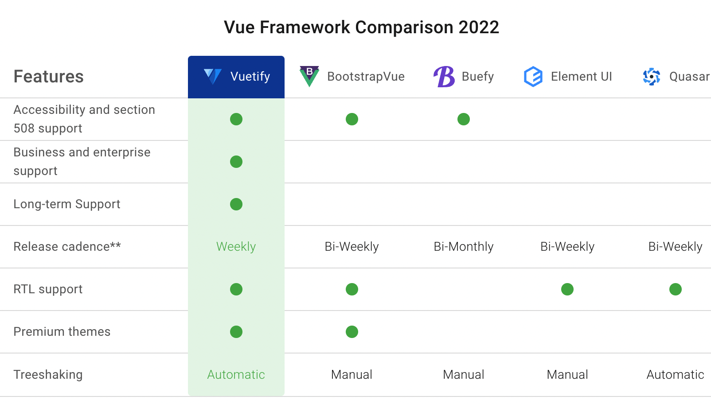

[toc]

# vue-router

## 原理

**改变视图的同时不会向后端发出请求**

### hash模式

通过url的哈希值来进行路由，加载不同组件

```
http://localhost/#/a
http://localhost/#/b
```

此时#/a，#/b是哈希值，但是url发送请求不会带这个哈希值，所以不会重新加载页面

### history模式

```
http://localhost/a
http://localhost/b
```

利用 HTML5 History Interface 中新增的 `pushState()` 和 `replaceState()` 方法，此时虽然改变了当前的 URL，但浏览器不会立即向后端发送请求。

### MemoryHistory(abstract history)模式

相当于一个tab，一直在当前页面

## vue-router v4.x

官网https://router.vuejs.org/zh/introduction.html

### 简单应用

```vue
<script src="https://unpkg.com/vue@3"></script>
<script src="https://unpkg.com/vue-router@4"></script>

<div id="app">
  <h1>Hello App!</h1>
  <p>
    <!--使用 router-link 组件进行导航 -->
    <!--通过传递 `to` 来指定链接 -->
    <!--`<router-link>` 将呈现一个带有正确 `href` 属性的 `<a>` 标签-->
    <router-link to="/">Go to Home</router-link>
    <router-link to="/about">Go to About</router-link>
  </p>
  <!-- 路由出口 -->
  <!-- 路由匹配到的组件将渲染在这里 -->
  <router-view></router-view>
</div>
```

router-link: 请注意，我们没有使用常规的 `a` 标签，而是使用一个自定义组件 `router-link` 来创建链接。这使得 Vue Router 可以在不重新加载页面的情况下更改 URL，处理 URL 的生成以及编码,默认是把router-link渲染成a标签，但是也可以渲染成其他标签

js

```js
// 1. 定义路由组件.
// 也可以从其他文件导入
const Home = { template: '<div>Home</div>' }
const About = { template: '<div>About</div>' }

// 2. 定义一些路由
// 每个路由都需要映射到一个组件。
// 我们后面再讨论嵌套路由。
const routes = [
  { path: '/', component: Home },
  { path: '/about', component: About },
]

// 3. 创建路由实例并传递 `routes` 配置
// 你可以在这里输入更多的配置，但我们在这里
// 暂时保持简单
const router = VueRouter.createRouter({
  // 4. 内部提供了 history 模式的实现。为了简单起见，我们在这里使用 hash 模式。
  history: VueRouter.createWebHashHistory(),
  routes, // `routes: routes` 的缩写
})

// 5. 创建并挂载根实例
const app = Vue.createApp({})
//确保 _use_ 路由实例使
//整个应用支持路由。
app.use(router)

app.mount('#app')

// 现在，应用已经启动了！
```

通过调用 `app.use(router)`，我们可以在任意组件中以 `this.$router` 的形式访问它，并且以 `this.$route` 的形式访问当前路由：

```vue
// Home.vue
export default {
  computed: {
    username() {
      // 我们很快就会看到 `params` 是什么
      return this.$route.params.username
    },
  },
  methods: {
    goToDashboard() {
      if (isAuthenticated) {
        this.$router.push('/dashboard')
      } else {
        this.$router.push('/login')
      }
    },
  },
}
```

### 其他用法

+ 动态路由

+ 路由匹配语法（正则、可重复的参数、Sensitive 与 strict 路由配置、可选参数）

+ 嵌套路由

+ 编程式导航（用**`this.$router.push`**而不是<router-link>）

+ 命名路由（<router-link :to="{ name: 'user', params: { username: 'erina' }}">）

+ 重定向和别名

+ 路由组件传参（直接将参数放在路由里配置，不需要通过this.$route.params才能获取）

+ 导航守卫（一些钩子，可以判断路由跳转前、后然后做一些操作）

  ```vue
   router.beforeEach(async (to, from) => {
     if (
       // 检查用户是否已登录
       !isAuthenticated &&
       // ❗️ 避免无限重定向
       to.name !== 'Login'
     ) {
       // 将用户重定向到登录页面
       return { name: 'Login' }
     }
   })
  ```

+ 路由元信息（meta,限制满足一定条件才能进入页面）

  ```
  {
  	path: 'new',
  	component: PostsNew,
  	// 只有经过身份验证的用户才能创建帖子
  	meta: { requiresAuth: true }
  },
  ```

+ 过渡动画

+ 滚动行为

+ 路由懒加载(webpack里可以进一步使用chunk name便于打包的组合)

  ```js
  const UserDetails = () => import('./views/UserDetails')
  // webpack里
  // const UserDetails = () =>import(/* webpackChunkName: "group-user" */ './UserDetails.vue')
  const router = createRouter({
    // ...
    routes: [{ path: '/users/:id', component: UserDetails }],
  })
  ```

### vue3中的使用

#### 在composition API中使用

不能在setup里使用this,因此要用useRouter,还有其他的API，vue3中单独暴露出来

```js
setup() {
    const router = useRouter()
    const route = useRoute()

    function pushWithQuery(query) {
      router.push({
        name: 'search',
        query: {
          ...route.query,
        },
      })
    }
```

vue2与vue3里配置的区别

```
// VUE2
const router = new VueRouter({
  mode: 'history',
  base: process.env.BASE_URL,
  routes 
})
//VUE3
const router = createRouter({
  history: createWebHistory(process.env.BASE_URL), // createWebHashHistory
  routes
})
```


# vuex v4.x

## action和mutation的区别

action里可以有异步操作，mutation里必须是同步的操作

## pinia

 https://pinia.vuejs.org/introduction.html#basic-example

### Pinia 核心特性

- Pinia 没有 `Mutations`
- `Actions` 支持同步和异步
- 没有模块的嵌套结构
  - Pinia 通过设计提供扁平结构，就是说每个 store 都是互相独立的，谁也不属于谁，也就是扁平化了，更好的代码分割且没有命名空间。当然你也可以通过在一个模块中导入另一个模块来隐式嵌套 store，甚至可以拥有 store 的循环依赖关系
- 更好的 TypeScript支持
  - 不需要再创建自定义的复杂包装器来支持 TypeScript 所有内容都类型化，并且 API 的设计方式也尽可能的使用 TS 类型推断
- 不需要注入、导入函数、调用它们，享受自动补全，让我们开发更加方便
- 无需手动添加 store，它的模块默认情况下创建就自动注册的
- Vue2 和 Vue3 都支持
  - 除了初始化安装和SSR配置之外，两者使用上的API都是相同的
- 支持 `Vue DevTools`
  - 跟踪 actions, mutations 的时间线
  - 在使用了模块的组件中就可以观察到模块本身
  - 支持 time-travel 更容易调试
  - 在 Vue2 中 Pinia 会使用 Vuex 的所有接口，所以它俩不能一起使用
  - 但是针对 Vue3 的调试工具支持还不够完美，比如还没有 time-travel 功能
- 模块热更新
  - 无需重新加载页面就可以修改模块
  - 热更新的时候会保持任何现有状态
- 支持使用插件扩展 Pinia 功能
- 支持服务端渲染

# 组件库

## Element Plus

官网： https://element-plus.gitee.io/zh-CN/

PC端

element-plus 是一个使用 `TypeScript + Composition API` 重构的全新项目。官方列出了下面几项主要更新:

+ 使用 TypeScript 开发,比如alert组件的实现

  ```js
  import { PropType } from 'vue'
  export default defineComponent({
    name: 'ElAlert',
    props: {
      type: {
        type: String as PropType<'success' | 'info' | 'error' | 'warning'>,
        default: 'info',
      }
    }
  })
  ```

+ 使用 Vue 3.0 Composition API 降低耦合，简化逻辑

  ```
  采用一部分hooks代替原有的mixin
  mixin缺点：
  +  渲染上下文中公开的属性的来源不清楚。 例如，当使用多个 mixin 读取组件的模板时，可能很难确定从哪个 mixin 注入了特定的属性。
  +  命名空间冲突。 Mixins 可能会在属性和方法名称上发生冲突
  ```

+ 使用 Vue 3.0 Teleport 新特性重构挂载类组件

  ```
  采用teleport挂载的新特性
  替代原有的直接挂载到body，采用document.body.appendChild的方法
  ```

+ Vue 2.0 全局 API 切换为 Vue 3.0 实例API

  ````
  Vue2
  ```
  import Vue from 'vue'
  import App from './App.vue'
  new Vue({()=> h(App)}).$mount('#app')
  ```
  
  vue3
  ```
  const { createApp }  from 'vue'
  import App from "./src/App"
  createApp(App).mount(('#app')
  ```
  ````

  因此原有的Vue.component 方法绑定全局组件，Vue.use 绑定全局自定义指令，Vue.prototype 绑定全局变量和全局方法都要改为挂载到实例上

+ 国际化处理

  ```
  element-plus 中引入了 day.js 替换原来的 moment.js 来做时间的格式化和时区信息等的处理。
  ```
  
+ 组件库和样式打包

  ```
  除了使用 webpack 来打包组件之外，element-plus 还提供了另外一种 es-module 的打包方式，最后发布到 npm 的既有 webpack 打包的成果物，也有 rollup 打包的 es-module bundle。
  ```

element ui与element plus

+ 由于 Vue 3 不再支持 IE11，Element Plus 也不再支持 IE 浏览器。
+ 新组件功能

## quasar

官网：https://quasar.dev/introduction-to-quasar

- 开箱即用，对桌面和**移动浏览器**（包括 iOS Safari！）的最佳支持
- Quasar 的座右铭是：**编写一次代码，同时将其部署**为网站、移动应用程序和/或电子应用程序。

## vuetifyjs

官网：https://vuetifyjs.com/en/

Vue.js 的 Material Design 组件框架

+ Vuetify 采用移动优先的设计方法，这意味着您的应用程序开箱即用——无论是在手机、平板电脑还是台式电脑上。
+ 整套 UI 设计为 Material 风格。能够让没有任何设计技能的开发者创造出时尚的 Material 风格界面。 （Material Design 是 Google 推出的设计语言，颜色鲜艳、动画效果突出，旨在为手机、平板电脑、台式机和“其他平台”提供更一致、更广泛的“外观和感觉”。）
+ 几乎不需要任何CSS代码，而element-ui许多布局样式需要我们来编写



## Primevue

官网：https://primefaces.org/primevue/

+ 响应式设计:PrimeVue 组件针对不同的屏幕尺寸进行了优化。
+ PrimeVue 是一个与设计无关的库，与其他UI库不同，它不强制使用某种样式（例如：material 或者 bootstrap）。实现原理是将样式分为 core 和 theme。core 驻留在 PrimeVue 内部，以实现和组件结构相关的效果，例如定位，而 theme 实现颜色，填充和边距。
+ 同时 PrimeVue 提供各种免费开源的主题和高级主题，我们可以从各种主题中进行选择，也可以使用官方提供 Theme Designer 工具轻松开发自己的主题。

## 其他

https://www.jianshu.com/p/f98a14effc81

# vueuse

官网： https://vueuse.org/

一款基于Vue组合式API的函数工具集，基于Vue Composition Api (组合式API)，只有在支持组合式API的环境下，才可以正常使用它，它是一款函数工具集。

## 能做什么？

- 动画
- 浏览器
- 组件
- 格式化
- 传感器
- State(状态机)
- 公共方法
- 监听
- 杂项


# vue组件通信

## 1.父子通信，props & emit

Level1为父组件，Level2为子组件

+ 父组件->子组件  props
+ 子组件->父组件 事件+emit（传递出去要用到this,传递回来的事件在setup）
+ vue2不需要单独写emits:['showChildMsg'],

```vue
// Level1父组件
<template>
  <!-- eslint-disable -->
  <div class="container">
    level1
    <Level2 :msg="state.parentMsg" @showChildMsg="showChildMsg"/>
  </div>
</template>

<script lang="ts">
/* eslint-disable */
import { defineComponent, reactive, ref} from "vue";
import Level2 from "./Level2.vue";

export default defineComponent({
  name: "Level1",
  components: {
    Level2
  },
  setup() {
    // @ts-ignore
    const state = reactive({
      parentMsg:'你好，这里是level1'
    });
    const showChildMsg= (childMsg:String)=>{
      console.log('childMsg', childMsg)
    }
    return {
      state,
      showChildMsg
    };
  },
  method:{
  }
});
</script>
<!-- Add "scoped" attribute to limit CSS to this component only -->
<style scoped>
</style>
```

```vue
// Level2子组件
<template>
  <!-- eslint-disable -->
  <div class="container">
    level2, {{ msg }}
    <button @click="sendMsgToParent('这里是level2')">传递信息给level</button>
  </div>
</template>

<script lang="ts">
/* eslint-disable */
import { defineComponent, reactive, ref} from "vue";
export default defineComponent({
  name: "Level2",
  props:{
    msg:{
      type: String,
      default: 'hello'
    }
  },
  setup() {
    // @ts-ignore
    const state = reactive({
    });
    return {
      state,
    };
  },
  emits:['showChildMsg'],
  methods:{
    sendMsgToParent(toParentContent:String){
      this.$emit('showChildMsg',toParentContent)
    }
  }
});
</script>
<!-- Add "scoped" attribute to limit CSS to this component only -->
<style scoped>
</style>

```

## 2.父子，祖孙通信 $attrs

+ $attrs可以获取上一级传递过来的所有属性
+ inheritAttrs:false,避免属性附着到单节点上
+ v-bind="$attrs"把当前以及上级的attrs都透传到下一级
+ vue3补在有$listeners

```vue
//父组件Level1，传递了参数A\B\C,和对应的方法getA,getB,getC
<template>
  <!-- eslint-disable -->
  <div class="container">
    <Level2 :A="A" 
            :B="B"
            :C="C"
            @getA="getA"
            @getB="getB"
            @getC="getC"
    />
  </div>
</template>

<script lang="ts">
/* eslint-disable */
import { defineComponent, reactive} from "vue";
import Level2 from "./Level2.vue";

export default defineComponent({
  name: "Level1",
  components: {
    Level2
  },
  data(){
    return {
      A:'level1A',
      B:'level1B',
      C:'level1C'
    }
  },
  methods:{
    getA(){
      console.log('A')
    },
    getB(){
      console.log('B')
    },
    getC(){
      console.log('C')
    }
  }
});
</script>
<!-- Add "scoped" attribute to limit CSS to this component only -->
<style scoped>
</style>

```

```vue
子组件Level2只接收A和getA,那么其他参数可以在this.$attrs里获取的到
<template>
  <!-- eslint-disable -->
  <div class="container">
    <p>level2</p>
  </div>
</template>

<script lang="ts">
/* eslint-disable */
import { defineComponent, reactive, ref} from "vue";
export default defineComponent({
  name: "Level2",
  props:{
    A:{
      type: String,
      default: 'a'
    }
  },
  emits:['getA'],
  // inheritAttrs:false,
  created(){
    console.log('$attrs',Object.keys(this.$attrs))
  }
});
</script>
<!-- Add "scoped" attribute to limit CSS to this component only -->
<style scoped>
</style>
```

此时created的this.$attrs可以获取到['B', 'C', 'onGetB', 'onGetC']，而且此时Level2只有一个节点（有多个节点不会出现此现象），其他没有被接收的节点都附着在该节点上

```vue
<div class="container" b="level1B" c="level1C">      <p>level2</p>
</div>
```

此时也可以通过设置使得其他没有引入的属性不能附着在节点上

```js
inheritAttrs:false,
```

假设Level2有另一个子组件Level3,那么在Level3上可以通过v-bind="$attrs"把Level1和Level2的属性都传递过去

```js
<template>
  <!-- eslint-disable -->
  <div class="container">
    <p>level2</p>
    <Level3 v-bind="$attrs"></Level3>
  </div>
</template>
```

## 3.父子通信$parent

通过this.$parent获取父组件

```
 mounted(){
     console.log('parent',this.$parent)
  }
 ...
 结果
 Proxy {getA: ƒ, getB: ƒ, getC: ƒ, …}
```

## 4.ref通信

ref可以获取到子组件的引用

```Vue
// Level1组件有Level2和Level3两个子组件
<template>
  <!-- eslint-disable -->
  <div class="container">
    <Level2 ref="l2"
    />
    <Level3 ref="l3"/>
  </div>
</template>

<script lang="ts">
/* eslint-disable */
import { defineComponent} from "vue";
import Level2 from "./Level2.vue";
import Level3 from "./Level3.vue";
export default defineComponent({
  name: "Level1",
  components: {
    Level2,
    Level3
  },
  data(){
    return {
    }
  },
  methods:{
  },
  mounted(){
     console.log('level1',this.$refs)
  }
});
</script>
<!-- Add "scoped" attribute to limit CSS to this component only -->
<style scoped>
</style>

```

可以拿到level2和level3的引用

```
level1 Proxy {l2: Proxy, l3: Proxy}
```

## 5.祖孙多层级通信provide

+ provide注入元素，inject引用元素，可以跨层级,Level1,Level2,Level3是层层嵌套的三层，level1注入，level3可以不通过level2直接拿到
+ provide有两种方法传递，一种只传值，provide:{helllo:this.hello}一种通过函数的方式传递引用，可以实现响应式

```vue
//Level1
<template>
  <!-- eslint-disable -->
  <div class="container">
    <Level2 />
  </div>
</template>

<script lang="ts">
/* eslint-disable */
import { defineComponent, computed} from "vue";
import Level2 from "./Level2.vue";
export default defineComponent({
  name: "Level1",
  components: {
    Level2
  },
  data(){
    return {
      hello: '这里是l1'
    }
  },
  provide(){
    return {
      l1Content: computed(()=>this.hello)
    }
  },
});
</script>

```

```vue
//Level2
<template>
  <!-- eslint-disable -->
  <div class="container">
    <p>level2</p>
    <Level3/>
  </div>
</template>

<script lang="ts">
/* eslint-disable */
import { defineComponent} from "vue";
import Level3 from "./Level3.vue";
export default defineComponent({
  name: "Level2",
  components: {
    Level3
  }
});
</script>
```

```vue
//Level3
<template>
  <!-- eslint-disable -->
  <div class="container" >
    level3,{{l1Content}}
  </div>
</template>

<script lang="ts">
/* eslint-disable */
import { defineComponent} from "vue";

export default defineComponent({
  name: "Level3",
  components: {
  },
  inject:['l1Content'],
  methods:{
  },
  mounted(){
  }
});
</script>
```

## 6.任意组件通信自定义事件

- 一个在method里自定义事件

```js
addTitleHandler(title) {
    // eslint-disable-next-line
    console.log('on add title', title)
}
...
mounted() {
    // 绑定自定义事件
    event.$on('onAddTitle', this.addTitleHandler)
},
```

- 另一个组件里使用

```js
event.$emit('onAddTitle', this.title)
```

- 其中的event

```js
import event from './event'
// Vue本身可以自定义事件
import Vue from 'vue'
export default new Vue()
```

```js
beforeDestroy() {
    // 及时销毁，否则可能造成内存泄露
    event.$off('onAddTitle', this.addTitleHandler)
}
```

+ 在vue3，没有new Vue(),需要使用第三方插件，比如mitt,npm install mitt --save

```
// utils/event.js
import mitt from 'mitt'
export default new mitt()
```

组件使用，emit触发事件，on监听，off销毁,且注意函数名相同，不能用箭头函数

```js
import event from '../utils/event.js';
 mounted(){
    event.emit('Level1show','hhhh')
  }
...
另一个组件
import event from '../utils/event.js';

export default defineComponent({
  name: "Level3",
  methods:{
    showMsg(msg:any){
      console.log('Level1Content',msg)
    }
  },
  mounted(){
    event.on('Level1show',this.showMsg)
  },
  unmounted(){
     event.off('Level1show',this.showMsg)
  }
});
```

## 7.vuex


参考：

https://www.jianshu.com/p/f4144fe1c5ac

Element-ui和Element-Plus的区别_Element2和Element3的区别http://www.qianduanheidong.com/blog/article/318191/5d63ce82942aaa19f35b/

Vue 3 组件库：element-plus 源码分析https://juejin.cn/post/6914598983205847053