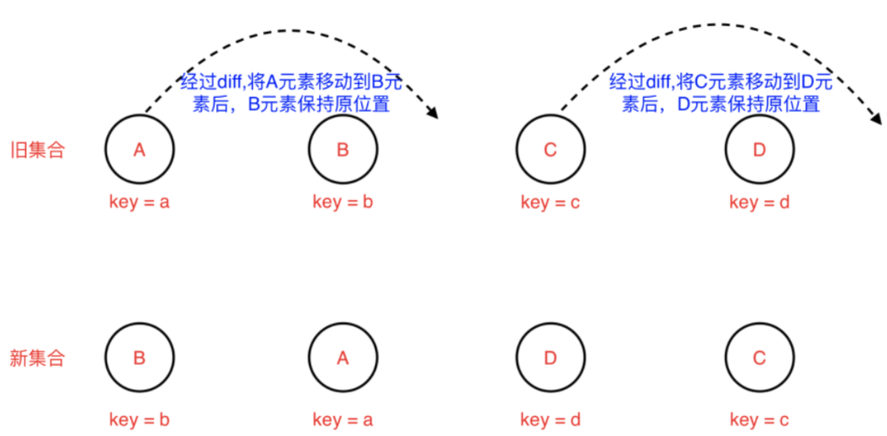
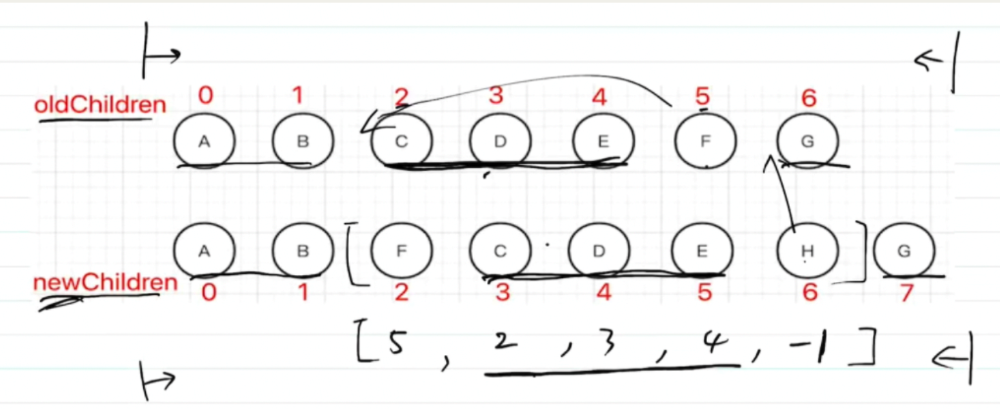

[toc]

## 1.computed与watch的区别

+ computed是用于产生一个新的数据，且有缓存
+ watch用于监听已有数据，然后去做操作

## 2.vdom一定会快？

不是，只是对于传统的js，对于页面的操作是先获取到真实的dom,然后再去进行改动，而对于vue等，是用js来模拟dom结构，每次更改时，获取到前后两次vdom树，然后进行diff算法比较，最后再更新dom

```
vdom并不快，直接操作dom才是最快的
vdom使得开发人员只需要关注业务的变化，而不再需要关注DOM的变化，不需要手动获取dom去做改动，“数据驱动视图”，数据变更就可以使得视图变更
目前而言，“数据驱动视图”比较合适的方案就是使用vdom(不是因为快，而是合适)
```

## 3.vue2、vue3、react的diff算法

diff算法是为了进行前后vdom树的比较，并且在其他领域就已经用到过

+ 严格对比两棵树，时间复杂度会达到O(n^3)

  ```
  遍历老的虚拟 DOM树
  遍历新的虚拟DOM树
  比较，查找完差异后，计算最小转换方式
  ```

+ diff算法的优化：只需要遍历一次

  ```
  1.只进行同层的比较，不进行跨层比较
  2.同层比较标签名tag（比如div和p），不同就删除重建，不再去比较内部细节
  3.如果标签名相同，key 也相同，就会认为是相同节点，也不继续按这个树状结构做深度比较
  ```

+ react的diff:仅向右移

  ```
  新旧dom进行对比时，仅仅进行向右移动的diff，比如：
  新集合B在旧集合里有，但需要左移，所以该元素保持不动
  新集合A在旧集合里有，需要右移，所以该元素右移动
  遍历重复操作直到最后一个元素
  对于新集合里新的元素，直接添加
  对于旧集合里不再存在的元素，直接删除
  ```



+ vue2的diff算法：双端比较

  ```
  新旧dom进行对比时，存在4个指针，进行对比，这种做法相比于仅右移，可以减少节点移动的次数
  old头与new头对比
  old头与new尾对比
  old尾与new头对比
  old尾与new尾对比
  对比之后进行移动，都不相同则使用key进行对比移动
  如果还是没有，就进行节点的新建和删除
  然后四个指针向中间移动，一旦StartIdx>EndIdx表明oldCh和newCh至少有一个已经遍历完了，就会结束比较
  ```

  

+ Vue3的diff算法：最长递增子序列

  ```
  什么是最长递增子序列，比如[3,5,7,1,2,3]，则它的最长递增子序列就是[3,5,7,8]那么就可以不移动这个最长递增子序列，而去移动其他元素
  以下图为例，还是存在4个指针，移动到四个指针两两对比都无法匹配的时候，查找最长递增子序列进行移动，新的集合最长递增子序列是[2,3,4],那么保持这三个不动，其他元素进行新增，移动，删除
  ```

  

# vue2与vue3变动

翻译自Vue RFCs：https://github.com/vuejs/rfcs

## 插槽

改动：

- 使用渲染函数的组件作者不再需要担心同时处理 `$slots`和`$scopedSlots`.`this.$scopedSlots`被删除。
- 普通插槽在父级渲染周期内渲染。当插槽的依赖项发生更改时，会导致父组件和子组件重新渲染。另一方面，作用域插槽被编译为内联函数并在子组件的渲染周期中调用。这意味着作用域插槽所依赖的任何数据依赖项都由子组件收集，从而产生更精确的更新。VUE3将它们统一，将所有插槽编译为函数。

在渲染函数中使用

```
h(Comp, [
  h('div', this.msg)
])

// equivalent:
h(Comp, () => [
  h('div', this.msg)
])
```

`Comp`在这两种情况下，内部的`this.$slots.default`都是一个函数，并返回相同的 VNode。但是，第二种情况会更高效，因为`this.msg`它只注册为子组件的依赖项。

具名插槽的使用改动

```
// 2.x
h(Comp, [
  h('div', { slot: 'foo' }, this.foo),
  h('div', { slot: 'bar' }, this.bar)
])
// 3.0,NULL是必须的，避免插槽被误认为是prop
h(Comp, null, {
  foo: () => h('div', this.foo),
  bar: () => h('div', this.bar)
})
```

手动优化

请注意，当父组件更新时，`Comp`总是被迫也更新，因为没有编译步骤 Vue 没有足够的信息来判断是否`slots`可能已经改变。

编译器可以检测到v-slot并编译为函数，但在渲染函数中这不会自动发生。我们也可以在我们的 JSX babel 插件中执行类似的优化。但是对于编写直接渲染函数的用户，他们需要在性能敏感的用例中手动完成。

插槽可以手动注解，这样 Vue 就不会在父更新时强制子更新：
