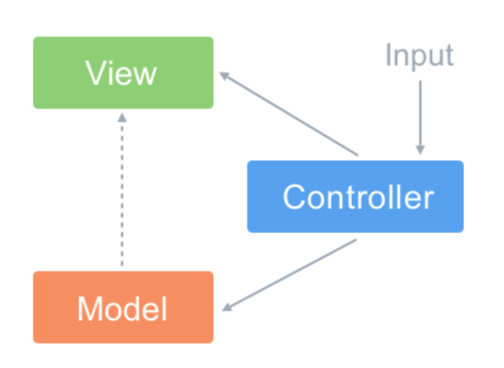
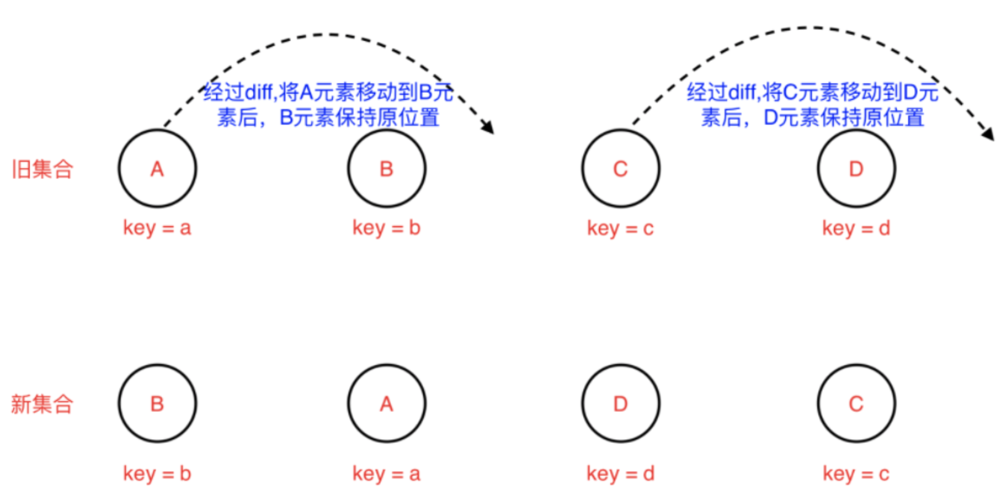
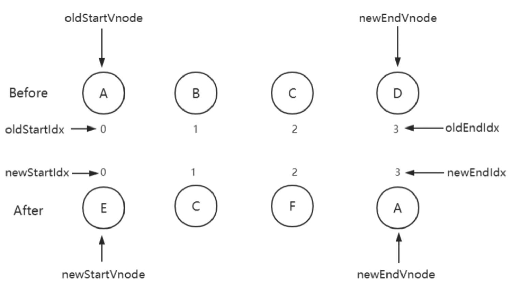

[toc]

# MVC 和 MVVM 区别

Vue 没有完全遵循 MVVM 

+ MVC

  

+ Model（模型）：通常模型对象负责在数据库中存取数据

+ View（视图）：是应用程序中处理数据显示的部分。

+ Controller（控制器）：控制更新，是应用程序中处理用户交互的部分。当用户有输入时，会通过控制器去更新数据，并且通知视图 进行更新。==》控制器承担的责任太大

MVVM


+ ViewModel 层：做了两件事达到了数据的双向绑定
  + 将【模型】转化成【视图】，即将后端传递的数据转化成所看到的页面。实现的方式是：数据绑定。
  + 将【视图】转化成【模型】，即将所看到的页面转化成后端的数据。实现的方式是：DOM 事件监听。
+ 以 Vue 框架来举例，ViewModel 就是组件的实例。View 就是模板，Model 的话在引入 Vuex 的情况下是完全可以和组件分离的

MVVM 与 MVC 最大的区别就是：它实现了 View 和 Model 的自动同步，也就是当 Model 的属性改变时，我们不用再自己手动操作 Dom 元素，来改变 View 的显示，而是改变属性后该属性对应 View 层显示会自动改变（对应Vue数据驱动的思想）

## Vue 没有完全遵循 MVVM 

- 严格的 MVVM 要求 View 不能和 Model 直接通信，而 Vue 提供了$refs 这个属性，让 Model 可以直接操作 View，违反了这一规定，所以说 Vue 没有完全遵循 MVVM。

+++++++++++

# 命令式和声明式

+ 命令式：强调每一个过程中的操作， 比如jq和js原生的实现

  >比如要实现这么一个功能：
  >
  >- 获取 id 为 app 的标签
  >- 把标签的文本内容设置为 'click me'
  >- 给标签添加点击事件，点击后弹出提示 'hello'
  >
  >$('#app')
  >  .text('click me')
  >    .on('click', () => { alert('hello') })
  >
  >

+ 声明式： 关注结果，基本不感知过程，比如vue

  ```vue
  <div @click="alert('hello')">click me</div>
  ```

+ 优缺点(jq和vue哪个更好)

  >+ 命令式的代码在性能上优于声明式的代码，声明式也在内部做很多操作来实现命令式的功能, 比如vue的虚拟dom成本就包括：找出差异的性能消耗+直接修改的性能消耗
  >+ 一般人无法一直写出最优的代码，而声明式可以以最小的成本计算虚拟dom的差异，减少心智负担
  >+ 声明式的维护成本更低

++++++++++

# 运行时和编译时

+ 运行时就是render函数接收的内容，一个树形结构，把树形结构通过render可以转化为真实的dom
  + 没办法分析用户输入的内容
+ 编译时：把html代码通过compiler直接转化为js版本的实现（利用createElement等),完全不支持树形结构
  + 缺少灵活性
+ 编译运行时：由compiler+render组成，既可以把树形结构直接传入render，也支持把html通过compiler转化为树形结构，再传入render

# 三大框架数据驱动的简单对比

+ angular:脏检查，组件每次更新检查所有依赖，会产生大量冗余的检查

+ vue响应式

  ```
  数据劫持 & 依赖搜集
  vue1:页面中每使用一个{{}}，就创建一个监听器，监听这个变量，数据变化，通知页面
  vue2:引入虚拟dom，而且响应式是组件级别的，减少监听器的数量
  ```

+ react

  ```
  采用了不可变数据：始终保持state的原值不变，要改变就需要copy一份出去
  而vue是在原值上直接修改的
  ```

# vue和react有什么异同

Vue 的表单可以使用 v-model支持双向绑定，相比于 React 来说开发上更加方便，当然了 v-model 其实就是个语法糖，本质上和 React 写表单 的方式没什么区别。

改变数据方式不同，Vue 修改状态相比来说要简单许多，React 需要使用 setState 来改变状态，并且使用这个 API 也有一些坑点。并且 Vue 的底层使用了依赖追踪，页面更新渲染已经是最优的了，但是 React 还是需要用户手动去优化这方面的问题。

React 16以后，有些钩子函数会执行多次，这是因为引入 Fiber 的原因，这在后续的章节中会讲到。
 React 需要使用 JSX，有一定的上手成本，并且需要一整套的工具链支持，但是完全可以通过 JS 来控制页面，更加的灵活。Vue 使用了模

板语法，相比于 JSX 来说没有那么灵活，但是完全可以脱离工具链，通过直接编写 render 函数就能在浏览器中运行。 在生态上来说，两者其实没多大的差距，当然 React 的用户是远远高于 Vue 的。

在上手成本上来说，Vue 一开始的定位就是尽可能的降低前端开发的门槛，然而 React 更多的是去改变用户去接受它的概念和思想，相较于 Vue 来说上手成本略高。

# 虚拟 DOM 

注：新生代svetle不再使用虚拟dom

由于在浏览器中操作 DOM 是很昂贵的。频繁的操作 DOM，会产生一定的性能问题。Virtual DOM 本质就是用一个原生的 JS 对象去描述一个 DOM 节点，是对真实 DOM 的一层抽象。

**优点：**

1. 保证性能下限： 框架的虚拟 DOM 需要适配任何上层 API 可能产生的操作，它的一些 DOM 操作的实现必须是普适的，所以它的性能并不是最优的；但是比起粗暴的 DOM 操作性能要好很多，因此框架的虚拟 DOM 至少可以保证在你不需要手动优化的情况下，依然可以提供还不错的性能，即保证性能的下限；
2. 无需手动操作 DOM： 我们不再需要手动去操作 DOM，只需要写好 View-Model 的代码逻辑，框架会根据虚拟 DOM 和 数据双向绑定，帮我们以可预期的方式更新视图，极大提高我们的开发效率；
3. 跨平台： 虚拟 DOM 本质上是 JavaScript 对象,而 DOM 与平台强相关，相比之下虚拟 DOM 可以进行更方便地跨平台操作，例如服务器渲染、weex 开发等等。

**缺点:**

1. 无法进行极致优化： 虽然虚拟 DOM + 合理的优化，足以应对绝大部分应用的性能需求，但在一些性能要求极高的应用中虚拟 DOM 无法进行针对性的极致优化。
2. 首次渲染大量 DOM 时，由于多了一层虚拟 DOM 的计算，会比 innerHTML 插入慢。

# vue2、vue3、react的diff算法

diff算法是为了进行前后vdom树的比较，并且在其他领域就已经用到过

+ 严格对比两棵树，时间复杂度会达到O(n^3)

  ```
  遍历老的虚拟 DOM树
  遍历新的虚拟DOM树
  比较，查找完差异后，计算最小转换方式
  ```

+ diff算法的优化：只需要遍历一次

  ```
  1.只进行同层的比较，不进行跨层比较
  2.同层比较标签名tag（比如div和p），不同就删除重建，不再去比较内部细节
  3.如果标签名相同，key 也相同，就会认为是相同节点，也不继续按这个树状结构做深度比较
  ```

+ react的diff:仅向右移

  ```
  新旧dom进行对比时，仅仅进行向右移动的diff，比如：
  新集合B在旧集合里有，但需要左移，所以该元素保持不动
  新集合A在旧集合里有，需要右移，所以该元素右移动
  遍历重复操作直到最后一个元素
  对于新集合里新的元素，直接添加
  对于旧集合里不再存在的元素，直接删除
  ```

  [

+ vue2的diff算法：双端比较

  ```
  新旧dom进行对比时，存在4个指针，进行对比，这种做法相比于仅右移，可以减少节点移动的次数
  old头与new头对比
  old头与new尾对比
  old尾与new头对比
  old尾与new尾对比
  对比之后进行移动，都不相同则使用key进行对比移动
  如果还是没有，就进行节点的新建和删除
  然后四个指针向中间移动，一旦StartIdx>EndIdx表明oldCh和newCh至少有一个已经遍历完了，就会结束比较
  ```

  

+ Vue3的diff算法：最长递增子序列

  ```
  什么是最长递增子序列，比如[3,5,7,1,2,3]，则它的最长递增子序列就是[3,5,7,8]那么就可以不移动这个最长递增子序列，而去移动其他元素
  以下图为例，还是存在4个指针，移动到四个指针两两对比都无法匹配的时候，查找最长递增子序列进行移动，新的集合最长递增子序列是[2,3,4],那么保持这三个不动，其他元素进行新增，移动，删除
  ```


## v-for 为什么要加 key

**更准确**：因为带 key 就不是就地复用了，在 sameNode 函数 a.key === b.key 对比中可以避免就地复用的情况。所以会更加准确。

**更快速**：利用 key 的唯一性生成 map 对象来获取对应节点，比遍历方式更快

# 源码文件

- https://github.com/vuejs/vue

```js
├─ src                         // 主要源码所在位置，核心内容
│   ├─ compiler                // 模板编译相关文件，将 template 编译为 render 函数
│       ├─ codegen             // 把AST(抽象语法树)转换为Render函数
│       ├─ directives          // 生成Render函数之前需要处理的东西
│       ├─ parser              // 模板编译成AST
│   ├─ core                    // Vue核心代码，包括了内置组件、全局API封装、Vue实例化、响应式原理、vdom(虚拟DOM)、工具函数等等。
│       ├─ components          // 组件相关属性，包含抽象出来的通用组件 如：Keep-Alive
│       ├─ global-api          // Vue全局API，如Vue.use(),Vue.nextTick(),Vue.config()等，包含给Vue构造函数挂载全局方法(静态方法)或属性的代码。 链接：https://012-cn.vuejs.org/api/global-api.html
│       ├─ instance            // 实例化相关内容，生命周期、事件等，包含Vue构造函数设计相关的代码
│       ├─ observer            // 响应式核心目录，双向数据绑定相关文件。包含数据观测的核心代码
│       ├─ util                // 工具方法
│       └─ vdom                // 虚拟DOM相关的代码，包含虚拟DOM创建(creation)和打补丁(patching)的代码
│   ├─ platforms               // vue.js和平台构建有关的内容 不同平台的不同构建的入口文件也在这里 （Vue.js 是一个跨平台的MVVM框架）
│       ├── web                // web端 （渲染，编译，运行时等，包括部分服务端渲染）
│       │   ├── compiler       // web端编译相关代码，用来编译模版成render函数basic.js
│       │   ├── entry-compiler.js               // vue-template-compiler 包的入口文件
│       │   ├── entry-runtime-with-compiler.js  // 独立构建版本的入口，它在 entry-runtime 的基础上添加了模板(template)到render函数的编译器
│       │   ├── entry-runtime.js                // 运行时构建的入口，不包含模板(template)到render函数的编译器，所以不支持 `template` 选项，我们使用vue默认导出的就是这个运行时的版本。
│       │   ├── entry-server-basic-renderer.js  // 输出 packages/vue-server-renderer/basic.js 文件
│       │   ├── entry-server-renderer.js        // vue-server-renderer 包的入口文件
│       │   ├── runtime        // web端运行时相关代码，用于创建Vue实例等
│       │   ├── server         // 服务端渲染（ssr）
│       │   └── util           // 工具类相关内容
│       └─ weex                // 混合运用 weex框架 (一端开发，三端运行: Android、iOS 和 Web 应用) 2016年9月3日~4日 尤雨溪正式宣布以技术顾问的身份加盟阿里巴巴Weex团队， 做Vue和Weex的整合 让Vue的语法能跨三端
│   ├─ server                  // 服务端渲染相关内容（ssr）
│   ├─ sfc                     // 转换单文件组件（*.vue）
│   └─ shared                  // 共享代码 全局共享的方法和常量

```
