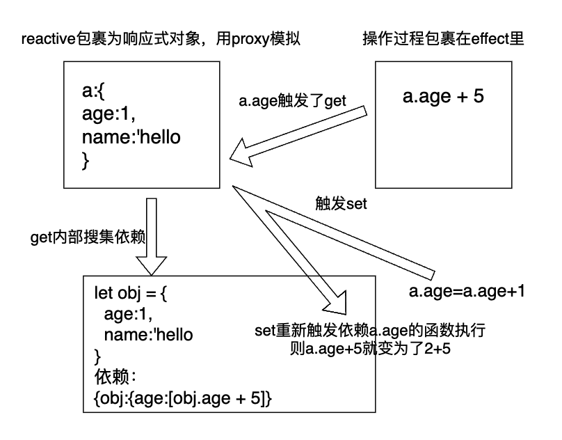

[toc]

# vue2的响应式

数据劫持+观察者模式

对象内部通过 defineReactive 方法，使用 Object.defineProperty 将属性进行劫持（只会劫持已经存在的属性），数组则是通过重写数组方法来实现。当页面使用对应属性时，每个属性都拥有自己的 dep 属性，存放他所依赖的 watcher（依赖收集），当属性变化后会通知自己对应的 watcher 去更新(派发更新)。

```js
class Observer {
  // 观测值
  constructor(value) {
    this.walk(value);
  }
  walk(data) {
    // 对象上的所有属性依次进行观测
    let keys = Object.keys(data);
    for (let i = 0; i < keys.length; i++) {
      let key = keys[i];
      let value = data[key];
      defineReactive(data, key, value);
    }
  }
}
// Object.defineProperty数据劫持核心 兼容性在ie9以及以上
function defineReactive(data, key, value) {
  observe(value); // 递归关键
  // --如果value还是一个对象会继续走一遍odefineReactive 层层遍历一直到value不是对象才停止
  //   思考？如果Vue数据嵌套层级过深 >>性能会受影响
  Object.defineProperty(data, key, {
    get() {
      console.log("获取值");
      //需要做依赖收集过程 这里代码没写出来
      return value;
    },
    set(newValue) {
      if (newValue === value) return;
      console.log("设置值");
      //需要做派发更新过程 这里代码没写出来
      value = newValue;
    },
  });
}
export function observe(value) {
  // 如果传过来的是对象或者数组 进行属性劫持
  if (
    Object.prototype.toString.call(value) === "[object Object]" ||
    Array.isArray(value)
  ) {
    return new Observer(value);
  }
}

```

## 如何监测数组变化

数组考虑性能原因没有用 defineProperty 对数组的每一项进行拦截，而是选择对 7 种数组（push,shift,pop,splice,unshift,sort,reverse）方法进行重写(AOP 切片思想)

所以在 Vue 中修改数组的索引和长度是无法监控到的。需要通过以上 7 种变异方法修改数组才会触发数组对应的 watcher 进行更新

```js
// src/obserber/array.js
// 先保留数组原型
const arrayProto = Array.prototype;
// 然后将arrayMethods继承自数组原型
// 这里是面向切片编程思想（AOP）--不破坏封装的前提下，动态的扩展功能
export const arrayMethods = Object.create(arrayProto);
let methodsToPatch = [
  "push",
  "pop",
  "shift",
  "unshift",
  "splice",
  "reverse",
  "sort",
];
methodsToPatch.forEach((method) => {
  arrayMethods[method] = function (...args) {
    //   这里保留原型方法的执行结果
    const result = arrayProto[method].apply(this, args);
    // 这句话是关键
    // this代表的就是数据本身 比如数据是{a:[1,2,3]} 那么我们使用a.push(4)  this就是a  ob就是a.__ob__ 这个属性就是上段代码增加的 代表的是该数据已经被响应式观察过了指向Observer实例
    const ob = this.__ob__;

    // 这里的标志就是代表数组有新增操作
    let inserted;
    switch (method) {
      case "push":
      case "unshift":
        inserted = args;
        break;
      case "splice":
        inserted = args.slice(2);
      default:
        break;
    }
    // 如果有新增的元素 inserted是一个数组 调用Observer实例的observeArray对数组每一项进行观测
    if (inserted) ob.observeArray(inserted);
    // 之后咱们还可以在这里检测到数组改变了之后从而触发视图更新的操作--后续源码会揭晓
    return result;
  };
});
```

# Vue3.0 和 2.0 的响应式原理区别

Vue3.x 改用 Proxy 替代 Object.defineProperty。因为 Proxy 可以直接监听对象和数组的变化，并且有多达 13 种拦截方法

# 双向绑定原理

双向数据绑定通常是指我们使用的`v-model`指令的实现，是`Vue`的一个特性，也可以说是一个`input`事件和`value`的语法糖。 `Vue`通过`v-model`指令为组件添加上`input`事件处理和`value`属性的赋值。

##  v-model原理

`v-model` 实际上就是 `$emit('input')` 以及 `props:value` 的组合语法糖，只要组件中满足这两个条件，就可以在组件中使用 `v-model`。

- checkbox 和 radio 使用 props:checked 和 $emit('change') 事件；
- select 使用 props:value和 $emit('change')
- 其他都是使用 props:value和 $emit('input')

在普通标签上

```js
<input v-model="test" />  
==========等效=========
<input v-bind:value="test" v-on:input="test = $event.target.value" />
```

在组件上

组件上使用`v-model`本质上是子父组件通信的语法糖

```vue
<currency-input v-model="price"></currentcy-input>
<!--上行代码是下行的语法糖
 <currency-input :value="price" @input="price = arguments[0]"></currency-input>
-->

<!-- 子组件定义 -->
Vue.component('currency-input', {
 template: `
  <span>
   <input
    ref="input"
    :value="value"
    @input="$emit('input', $event.target.value)"
   >
  </span>
 `,
 props: ['value'],
})
```


# reactive响应式

例子:

```vue
 setup() {
    let a = reactive({
      age: 1,
      name:'hello'
    });
    setInterval(() => {
      a.age += 1;
    }, 500);
    let b = computed(()=>{return a.age + 5 })
    return {
      b,
    };
  },
```

内部原理：

+ reactive可以把一个对象a进行包裹，变成响应式的对象
+ b变量依赖于a变量的age的值
+ 当获取到a的age变化时，b重新执行函数age+5从而实现随着a的变化而变化



## 1.reactive包裹

reactive内主要功能是把原对象利用proxy变成响应式对象，并且要执行依赖搜集和依赖被触发后的操作

```tsx
// reactive.ts
export function reactive(obj:any){
  return new Proxy(obj,{
    get(target,key){
      const res = Reflect.get(target,key)
      // effect内函数触发依赖搜集
      return res
    },
    set(target,key,value){
      const res = Reflect.set(target,key,value)
      // 依赖执行
      return res
    }
  })
}
```

并且可以确认的是，被包裹变为响应式对象后和原对象是不同的,但是还是可以执行get和set操作

```tsx
import {reactive} from './../reactive';
describe('reactive',()=>{
  it('创建reactive对象',()=>{
    const a={name:'yoly',age:1}
    const reactiveA= reactive(a)
    expect(a).not.toBe(reactiveA)
    expect(reactiveA.name).toBe('yoly')
  })
})
```

## 2.effect操作

effect主要操作就是可以触发内部的函数立即执行

```tsx
import {effect} from './../reactive';
import {reactive} from './../reactive';
describe('effect',()=>{
  it('efffect执行',()=>{
    const a={name:'yoly',age:1}
    const reactiveA= reactive(a)
    let nextA
    effect(()=>{
      nextA = reactiveA.age + 5
    })
    expect(nextA).toBe(6)

  })
})
```

```tsx
// effect.ts
export function effect(fn){
 fn()
}
```

可以把立即执行的函数过程抽离出来

```tsx
class ReactiveEffect{
  private _fn:any;
  constructor(fn){
    this._fn = fn
  }
  run(){
    this._fn()
  }
}

export function effect(fn){
 const effectObj = new  ReactiveEffect(fn)
 effectObj.run()
}
```

## 3.依赖搜集

+ reactive.ts在get里触发依赖搜集

```tsx
get(target,key){
      const res = Reflect.get(target,key)
      // effect内函数触发依赖搜集
      track(target,key)
      return res
    },
```

+ effect里写具体的track函数，因为要保存执行的函数，这个函数在effect里才有,考虑为空的情况，最终将依赖搜集为{target:{key:[fn]}}的形式

```tsx
var Fn //全局变量，用于保存可执行对象effectObj

class ReactiveEffect{
  private _fn:any;
  constructor(fn){
    this._fn = fn
  }
  run(){
    Fn = this //指向的就是effectObj
    this._fn()
  }
}

// 依赖搜集
const targetMap = new Map()
export function track(target, key) {
  let depsMap = targetMap.get(target)
  if (!depsMap) {
    depsMap = new Map()
    targetMap.set(target, depsMap)
  }
  let deps = depsMap.get(key)
  if (!deps) {
    deps = new Set()
    depsMap.set(key, deps)
  }
  deps.add(Fn)

export function effect(fn){
 const effectObj = new  ReactiveEffect(fn)
 effectObj.run()
}
```

+ 其中，这个传入进来的fn是需要可以可以立即执行的，这里传入effectObj这个对象，并把它作为依赖搜集里实际保存的值，所以童年过全局变量Fn保存这个effectObj对象，并且存放在依赖里

## 4.触发依赖执行

当函数执行时，a.age=a.age+5, a.age会触发get，依赖搜集之后，紧接着赋值操作，会触发set，此时进行值的更新，从而实现响应式的更新

```tsx
//reactive.ts里进行依赖执行
set(target,key,value){
      const res = Reflect.set(target,key,value)
      // 依赖执行
      trigger(target,key)
      return res
    }
```

那么在effect.ts里进行依赖触发，更新值的操作

```tsx
//执行target对应key上的所有函数
export function trigger(target,key){
  let FnArr = targetMap.get(target).get(key)
  for(const itemFn of FnArr){
    itemFn.run()
  }
}
```

