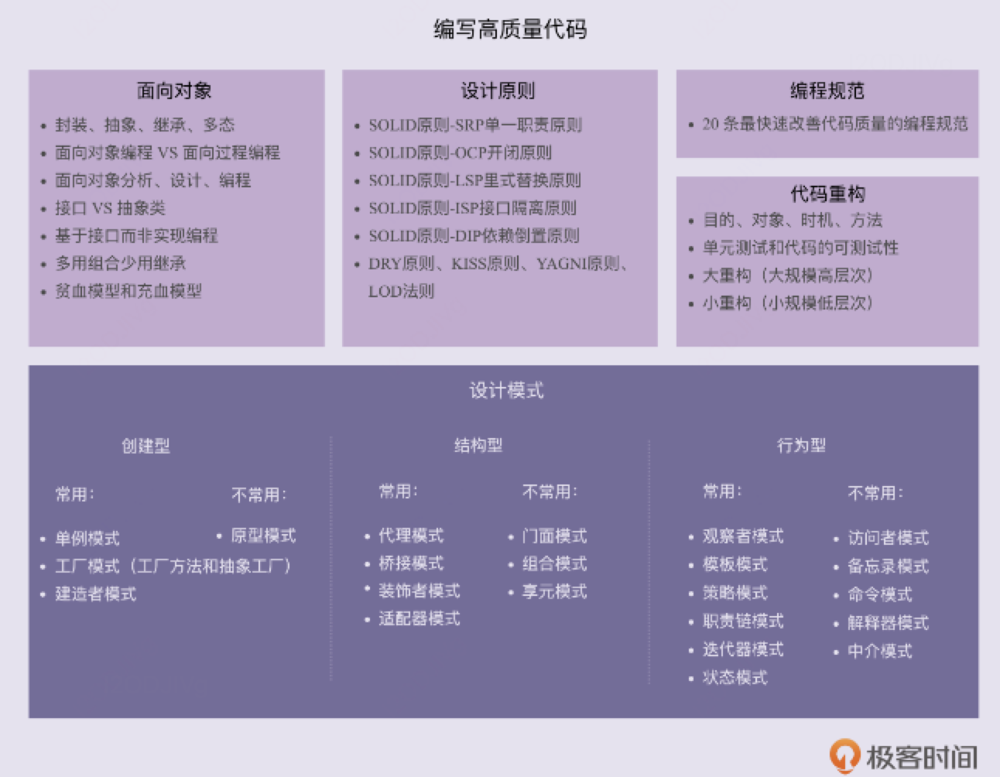

[toc]

# 设计原则与思想



## 面向对象

面向对象编程（Object Oriented Programming、OOP）：就是将对象或类作为代码组织的基本单元，来进行编程的一种编程范式或者编程风格，并不一定需要封装、抽象、继承、多态这四大特性的支持， 所以js也是面向对象编程的。

面向对象编程的四大特性：封装、抽象、继承、多态。

面向对象编程的重要概念：类（class）和对象（object）

UML（Unified Model Language）：统一建模语言，常用它来画图表达面向对象或设计模式的设计思路, 但是学习成本和看懂的成本比较高，实际能表达

### 四大特性

+ 封装：类通过暴露有限的访问接口，授权外部仅能通过类提供的方式（或者叫函数）来访问内部信息或者数据， 需要语言支持访问权限控制的语法机制， 比如private、public 等关键字保证属性只能类本身访问。
+ 抽象： 让调用者只需要关心方法提供了哪些功能，并不需要知道这些功能是如何实现的，一般是通过接口类实现的， 只需要提供“函数”这一非常基础的语法机制，就可以实现抽象特性
+ 继承：假如两个类有一些相同的属性和方法，我们就可以将这些相同的部分，抽取到父类中，让两个子类继承父类。这样，两个子类就可以重用父类中的代码，实现代码复用， 具体又分为单继承和多继承

>public完全开放,protected对子类开放, 子类可以获取，private对自己开放，new之后实例获取会报错
>
>js不支持，ts支持
>
>```
>Class People{
>  Name,
>  Number,
>  protected weight
>  constructor(name, number){}
>
>}
>```
>
>

+ 多态：子类可以替换父类，在实际的代码运行过程中，调用子类的方法实现， 实现方法包括“继承加方法重写”，“利用接口类来实现多态特性”（比如根据传入参数类型不同使用不同的子类方法），“duck-typing”（只要两个类中有相同的方法就可以根据不同场景进行灵活使用）

### 面向过程和面向函数

面向过程编程则是以过程（或方法）作为组织代码的基本单元。它最主要的特点就是数据和方法相分离。相较于面向对象编程语言，面向过程编程语言最大的特点就是不支持丰富的面向对象编程特性，比如继承、多态、封装。

面向对象编程相比起面向过程编程的优势主要有三个。 

+ 对于大规模复杂程序的开发，程序的处理流程并非单一的一条主线，而是错综复杂的网状结构。面向对象编程比起面向过程编程，更能应对这种复杂类型的程序开发。 
+ 面向对象编程相比面向过程编程，具有更加丰富的特性（封装、抽象、继承、多态）。利用这些特性编写出来的代码，更加易扩展、易复用、易维护。 
+ 面向对象编程语言比起面向过程编程语言，更加人性化、更加高级、更加智能。

```java
//面向对象
 public class User {
  private String name;
  private int age;
  private String gender;
  
  public User(String name, int age, String gender) {
    this.name = name;
    this.age = age;
    this.gender = gender;
  }
  
  public static User praseFrom(String userInfoText) {
    // 将text(“小王&28&男”)解析成类User
  }
  
  public String formatToText() {
    // 将类User格式化成文本（"小王\t28\t男"）
  }
}
```

```c
// 面向过程

struct User {
  char name[64];
  int age;
  char gender[16];
};

struct User parse_to_user(char* text) {
  // 将text(“小王&28&男”)解析成结构体struct User
}

char* format_to_text(struct User user) {
  // 将结构体struct User格式化成文本（"小王\t28\t男"）
}
```

### 实例-看起来是面向对象，实际上是面向过程

#### 1.滥用 getter、setter 方法

定义完类的属性之后，就顺手把这些属性的 getter、setter 方法都定义上

违反了面向对象编程的封装特性，相当于将面向对象编程风格退化成了面向过程编程风格

Get返回的是集合array的时候要特别注意，因为返回array， 外部可以擅自修改array， 要进行预防

#### 2.滥用全局变量和全局方法

尽量能做到职责单一，定义一些细化的小类，比如 RedisConstants、FileUtils，而不是定义一个大而全的 Constants 类、Utils 类。因为把所有全局变量和方法定义在一个大的类中，如果我们要在另一个项目中，复用本项目开发的某个类，而这个类又依赖 Constants 类。即便这个类只依赖 Constants 类中的一小部分常量，我们仍然需要把整个 Constants 类也一并引入，也就引入了很多无关的常量到新的项目中

#### 3.基于贫血模型的开发模式

MVC的开发模式是面向过程的，是基于贫血模式的， why？

### 接口&抽象类的区别

抽象类特性：

+ 抽象类不允许被实例化，只能被继承。也就是说，不能 new 一个抽象类的对象出来。 
+ 抽象类可以包含属性和方法。方法既可以包含代码实现，也可以不包含代码实现方法。不包含代码实现的方法叫作抽象方法。
+ 子类继承抽象类，必须实现抽象类中的所有抽象方法

接口特性：

+ 接口不能包含属性（也就是成员变量）。
+ 接口只能声明方法，方法不能包含代码实现。 
+ 类实现接口的时候，必须实现接口中声明的所有方法。

可以用抽象类模拟接口的实现，只要保证类中的方法没有实现就行

如果要表示一种 is-a 的关系，并且是为了解决代码复用问题，我们就用抽象类；“接口”就是一组“协议”或者“约定”，是功能提供者提供给使用者的一个“功能列表”。

js里如何去实现的接口各抽象类？？？

### 基于接口而非实现编程

过度应用，比如为每一个实现类都定义对应的接口

接口实现注意点：

+ 函数的命名不能暴露任何实现细节。比如，前面提到的 uploadToAliyun() 就不符合要求，应该改为去掉 aliyun 这样的字眼，改为更加抽象的命名方式，比如：upload()。 
+ 封装具体的实现细节。比如，跟阿里云相关的特殊上传（或下载）流程不应该暴露给调用者。我们对上传（或下载）流程进行封装，对外提供一个包裹所有上传（或下载）细节的方法，给调用者使用。
+  为实现类定义抽象的接口， 与特定实现有关的方法不要定义在接口中。

如果在我们的业务场景中，某个功能只有一种实现方式，未来也不可能被其他实现方式替换，那我们就没有必要为其设计接口，也没有必要基于接口编程，直接使用实现类就可以了。

### 多用组合少用继承

继承最大的问题就在于：继承层次过深、继承关系过于复杂会影响到代码的可读性和可维护性。

可以利用组合（composition）、接口、委托（delegation）三个技术手段，解决继承存在的问题

```java
public interface Flyable {
  void fly()；
}
public class FlyAbility implements Flyable {
  @Override
  public void fly() { //... }
}
//省略Tweetable/TweetAbility/EggLayable/EggLayAbility

public class Ostrich implements Tweetable, EggLayable {//鸵鸟
  private TweetAbility tweetAbility = new TweetAbility(); //组合
  private EggLayAbility eggLayAbility = new EggLayAbility(); //组合
  //... 省略其他属性和方法...
  @Override
  public void tweet() {
    tweetAbility.tweet(); // 委托
  }
  @Override
  public void layEgg() {
    eggLayAbility.layEgg(); // 委托
  }
}

```

如果类之间的继承结构稳定（不会轻易改变），继承层次比较浅（比如，最多有两层继承关系），继承关系不复杂，就可以大胆地使用继承。反之，系统越不稳定，继承层次很深，继承关系复杂，我们就尽量使用组合来替代继承。

### 基于贫血模型的 MVC开发模式

违反了面向对象编程风格，是一种彻彻底底的面向过程的编程风格

贫血模型: 只包含数据，不包含业务逻辑的类, 贫血模型将数据与操作分离，破坏了面向对象的封装特性，是一种典型的面向过程的编程风格

面向过程编程风格有种种弊端，比如，数据和操作分离之后，数据本身的操作就不受限制了。任何代码都可以随意修改数据。

### 基于充血模型的 DDD 开发模式

充血模型:数据和对应的业务逻辑被封装到同一个类中, 满足面向对象的封装特性

DDD：领域驱动设计， 主要是用来指导如何解耦业务系统，划分业务模块，定义业务领域模型及其交互， 如微服务

## 设计原则

SOLID五大设计原则

### 单一职责原则

一个类或者模块只负责完成一个职责（或者功能）， 如果功能过于复杂就拆开，每个部分保持独立

### O开闭原则：对扩展开放、修改关闭

添加一个新的功能应该是，在已有代码基础上扩展代码（新增模块、类、方法等），而非修改已有代码（修改模块、类、方法等）

### L里式替换原则

子类对象能够替换程序中父类对象出现的任何地方，并且保证原来程序的逻辑行为不变及正确性不被破坏。

几个违反里式替换原则的例子：

+ 子类违背父类声明要实现的功能

  >父类中提供的 sortOrdersByAmount() 订单排序函数，是按照金额从小到大来给订单排序的，而子类重写这个 sortOrdersByAmount() 订单排序函数之后，是按照创建日期来给订单排序的。那子类的设计就违背里式替换原则。

+ 子类违背父类对输入、输出、异常的约定

  >在父类中，某个函数约定：运行出错的时候返回 null, 而子类重载函数之后，实现变了，运行出错返回异常（exception），获取不到数据返回 null。那子类的设计就违背里式替换原则。

+ 子类违背父类注释中所罗列的任何特殊说明

### I接口隔离原则

在设计微服务或者类库接口的时候，如果部分接口只被部分调用者使用，那我们就需要将这部分接口隔离出来，单独给对应的调用者使用，而不是强迫其他调用者也依赖这部分不会被用到的接口。

### D依赖反转原则

面向接口编程，依赖抽象而不依赖具体，使用方只关注接口而不关心具体类的实现

依赖反转原则 依赖反转原则也叫作依赖倒置原则。这条原则跟控制反转有点类似，主要用来指导框架层面的设计。高层模块不依赖低层模块，它们共同依赖同一个抽象。抽象不要依赖具体实现细节，具体实现细节依赖抽象。

### YAGNI原则

不要去设计当前用不到的功能；不要去编写当前用不到的代码。实际上，这条原则的核心思想就是：不要做过度设计。

### KISS原则

满足 KISS 原则

+ 不要使用同事可能不懂的技术来实现代码。
+ 不要重复造轮子，要善于使用已经有的工具类库。
+ 不要过度使用一些奇技淫巧（比如，位运算代替算术运算、复杂的条件语句代替 if-else、使用一些过于底层的函数等）来优化代码，牺牲代码的可读性。

### DRY 原则(Don’t Repeat Yourself)

+ 实现逻辑重复但功能语义不重复的代码不违反DRY原则。
+ 实现逻辑不重复，但功能语义重复的代码违反DRY原则。
+ 代码执行重复违反 DRY 原则

 提高代码可复用性的一些方法：

+ 减少代码耦合、满足单一职责原则、模块化、业务与非业务逻辑分离、通用代码下沉、继承、多态、抽象、封装、应用模板等设计模式。      
+ 复用意识重要，但在初期没有复用需求或复用成本较高时，可暂不考虑复用性。随着开发进行，若发现可复用代码，可重构以提高复用性。
+ DRY原则比代码复用性适用性更强，它强调避免重复

### 迪米特法则

**“高内聚、松耦合”的理解：**

+ 能够有效提高代码的可读性和可维护性，缩小功能改动导致的代码改动范围。   
+ “高内聚”用来指导类本身的设计，“松耦合”用来指导类与类之间依赖关系的设计     
+ 高内聚：相近功能放同一类中，便于集中修改。    
+ 松耦合：类间依赖简单清晰，减少因一类改动导致的其他类改动。   

迪米特法则:  

+  类之间应减少不必要的依赖，只通过必要的接口进行交互。      
+ 减少类之间的耦合，使得一个类修改时，受影响的类尽可能少


## 规范与重构

为什么重构：

>a 保持代码质量可控，避免过度腐化。     
>
>b 锻炼个人代码能力，增强成就感。

重构什么:

>大型重构:
>
>代码分层、模块化、解耦、梳理类之间的交互关系、抽象复用组件等等。
>
>重构难度比较大，需要组织、有计划地进行，分阶段地小步快跑实施。
>
>小型重构:
>
>规范命名、注释、修正函数参数、消除超大类、提取重复代码等等编程细节问题，主要是针对类、函数级别的重构。
>
>影响范围小，改动耗时短，所以可随时进行。

如何保证重构不出错：

>单元测试:研发自行编写的，针对代码逻辑正确性的测试
>
>重要性:
>
>+ 发现bug和代码设计问题
>+ 补充集成测试，帮助熟悉代码
>+ TDD（测试驱动开发）可落地执行的改进方案
>
>如何编写单元测试
>
>+ 对代码设计测试用例，覆盖各种输入、异常、边界情况
>+ 利用测试框架简化编写
>+ 建立正确的认知：不耗时、放低对代码质量的要求、覆盖率非唯一标准、不依赖具体实现逻辑、单元测试框架无法测试，多半是因为代码的可测试性不好。
>
>单元测试为何难落地执行
>
>+ 编写繁琐，技术挑战不大，程序员抵触
>+ 国内研发文化偏向“快、糙、猛”，进度压力大
>+ 团队对单元测试缺乏正确认识


### 改善代码质量的编程规范

+ 代码命名

  >a 准确达意，作用域小的变量可选择短些的命名，也可用缩写。
  >
  >b 借助类或函数信息简化命名,函数名已经有的信息不需要再重复
  >
  >c.命名需可读、可搜索，符合项目规范
  >
  >d 接口有两种命名方式：在接口中带前缀“I”；在接口的实现类中带后缀“Impl”
  >
  >e 抽象类有两种命名方式：一种是带上前缀“Abstract”一种是不带前缀

+ 关于注释

  > a 注释为了提高代码可读性。
  >
  > b 注释内容应包含做什么、为什么、怎么做，复杂的类和接口应说明如何用。
  >
  > c 类和函数注释要全面，函数内部注释应精简。 
  >
  > d 一般要靠好的命名、提炼函数、解释性变量、总结性注释来提高代码可读性。

+  函数、类多大才合适

  > a 函数的代码行数不要超过一屏幕的大小，比如 50 行。类的大小限制比较难确定。

+ 一行代码长度

  >最好不超过IDE显示的宽度，也不应太短，需考虑代码的整洁性
  >
  >

+ 善用空行分割单元块：

  >a 长函数中，用空行分割代码块提高可读性。    
  >
  >b 在类内部，成员变量与函数之间、静态成员变量与普通成员变量之间、函数之间，甚至成员变量之间，都可以通过添加空行的方式，让不同模块的代码之间的界限更加明确。

+ 四格缩进还是两格缩进：

  >推荐使用两格缩进，可以节省空间，但不要用tab键

+ 大括号是否要另起一行

  >建议与上一条语句同行以节省行数，或另起一行以提高可读性

+ 类成员排列

  >a 依赖类按字母序从小到大排列
  >
  >b  先成员变量后函数，静态成员在前，并且按照作用域大小依次排列

+ 编码技巧

  >a 拆分复杂逻辑为函数和类
  >
  >b 处理多参数：拆分成函数或封装为对象。
  >
  >c 避免用参数做代码执行逻辑的控制。
  >
  >d 函数职责应单一。
  >
  >e 减少嵌套：去掉多余if/else，用continue/break/return，调整执行顺序来减少嵌套，将部分嵌套逻辑抽象成函数。
  >
  >f 字面常量替代魔法数。
  >
  >g 用解释性变量提高可读性。
  >
  >h 统一编码规范：制定项目、团队、公司统一的编码规范，并且通过 Code Review 督促执行

## 常用的设计模式

> 创建型模式：解决“对象的创建”， 共五种：工厂方法模式、抽象工厂模式、单例模式、建造者模式、原型模式。
>
> 结构型模式：主要解决“类或对象的组合或组装”问题，共七种：适配器模式、装饰器模式、代理模式、外观模式、桥接模式、组合模式、享元模式。
>
> 行为型模式：主要解决的就是“类或对象之间的交互”问题，共十一种：策略模式、模板方法模式、观察者模式、迭代子模式、责任链模式、命令模式、备忘录模式、状态模式、访问者模式、中介者模式、解释器模式。INTERNAL 


### 单例模式

一个类只允许创建一个对象（或者叫实例），只允许一个实例存在，比如一些全局管理，要设置一个管理员，无论调用多少次，只会设置一次，

==》只能被new一次

==>需要有一个构造函数用于被new，还需要闭包记录状态

需要使用到java里的private

```java
public SingleObject{
  // 注意，私有化构造函数，外部不能new
  private SingleObject(){
  }
  // 唯一被new出来的对象
  private SingleObject instance = null;
  // 获取对象的唯一接口
  private SingleObject getInstance(){
    if(instance==null){
      instance = new SingleObject()
    }
    return instance
  }
  // public对象方法
  public void login(username){
      System.out.printIn('username', username)
  }
}
```

用js去模拟

```js
class SingleState {
    data={}
    get(key){
        return this.data[key]||''
    }
    set(key,value){
        return  this.data[key]=value
    }
    // 外部调用此静态函数实例化, 但是没办法强制约束不能new getInstance
    static getInstance() {
        let instance = null
        if (!instance) {
            instance = new SingleState()
        }
        return instance
    }
}
const state_1 = SingleState.getInstance()
const state_2 = SingleState.getInstance()
console.log(state_1 === state_2) //true
```

实现方式

+ 饿汉式

  >在类加载的期间，就已经将 instance 静态实例初始化好了，所以，instance 实例的创建是线程安全的。不过，这样的实现方式不支持延迟加载实例。

+ 懒汉式

  > 支持延迟加载。这种实现方式会导致频繁加锁、释放锁，以及并发度低等问题，频繁的调用会产生性能瓶颈。
  >
  > ```
  > public class IdGenerator { 
  >   private AtomicLong id = new AtomicLong(0);
  >   private static IdGenerator instance;
  >   private IdGenerator() {}
  >   public static synchronized IdGenerator getInstance() {
  >     if (instance == null) {
  >       instance = new IdGenerator();
  >     }
  >     return instance;
  >   }
  >   public long getId() { 
  >     return id.incrementAndGet();
  >   }
  > }
  > ```

+ 双重检测

  >既支持延迟加载、又支持高并发的单例实现方式

+ 静态内部类

  >利用 Java 的静态内部类来实现单例。这种实现方式，既支持延迟加载，也支持高并发，实现起来也比双重检测简单。

+ 枚举

  >```
  >public enum IdGenerator {
  >  INSTANCE;
  >  private AtomicLong id = new AtomicLong(0);
  > 
  >  public long getId() { 
  >    return id.incrementAndGet();
  >  }
  >}
  >```

单例存在的问题

>a 对 OOP 特性的支持不友好  
>
>b 隐藏类之间的依赖关系
>
>c 对代码扩展性和可测试性不友好  
>
>d 不支持有参数的构造函数

单例的替代解决方案：

> 静态方法可以作为简单的替代，但不解决所有问题。

单例模式的唯一性理解：

> a “进程唯一”指的是在一个进程内只存在一个实例，但不同进程间可以有不同实例。

应用场景

+ 登录

+ Vuex(全局使用同一份vuex的store，不能出现不一致的情况，==》需要通过actions去修改全局统一的值)

+ JQ只有一个$

  ```js
  if(window.jQuery!=null){
    return window.jQuery
  }else{
    // 初始化xxx
  }
  ```

  


### 工厂模式

将new操作单独封装，遇到new的时候就要考虑是否使用工厂模式

隐藏创建实例的复杂性，提供一个接口取调用得到一个实例，而不关心内部逻辑实现，不使用new来实现

```js
function createPerson(name,age,job){
    var obj = new Object();
    obj.name = name;
    obj.age = age;
    obj.job = job;
    obj.speak = function(){
        console.log(this.name);
    };
    return obj
}
var person1 = createPerson('panrui',20,'前端工程师')
// 内部较为复杂，但是只需要一个接口就能得到实例
```

使用示例

```js
// react createElement
var test = React.createElement('div', null, React.createElement('img', {src: 'xxxx.png'})

// vue异步组件
Vue.component('async-example',function(resolve, reject){
  setTimeout(function(){
    resolve({
      template:'<div>test</div>'
    })
  },1000)
})
```


**主要用于处理对象创建逻辑复杂的场景，将对象的创建和使用分离。其中，简单工厂和工厂方法模式较为常用。**     

> a 工厂模式：当代码中存在大量if-else分支，用于根据不同的条件创建不同类型的对象&不需要创建不同类型的对象，但若单个对象的创建过程涉及多个步骤或依赖其他对象     
>
>  b 简单工厂模式：适用于创建逻辑相对简单且类型不多的场景，可以将多个对象的创建逻辑集中在一个工厂类中。     
>
>  c 工厂方法模式：当每个对象的创建逻辑都较为复杂，或者需要创建多种类型的对象时，推荐使用工厂方法模式，将创建逻辑分散到各自的工厂类中。

工厂模式的作用

>  a 封装变化：将创建逻辑封装在工厂类中，使得创建逻辑的变更对调用者透明。      
>
> b 代码复用：将创建代码从业务逻辑中分离出来，实现代码的复用。      
>
> c 隔离复杂性：隐藏复杂的创建过程，使得调用者无需关心对象的创建细节。     
>
>  d 控制复杂度：降低类或函数的复杂度，使代码更简洁、职责更单一。

何时不用工程模式：

> 如果对象的创建逻辑简单且固定，通常不需要使用工厂模式，直接使用new关键字创建对象即可。

依赖注入容器的实现原理的核心逻辑主要包括

>配置文件解析，以及根据配置文件通过“反射”语法来创建对象。

建造者模式旨在简化复杂对象的构建过程，通过分步构建来避免构造函数参数过多导致的可读性和易用性问题。

 建造者模式应用场景

> a 构造函数参数过多：当类的必填属性过多时，使用构造函数会导致参数列表过长，影响代码的可读性和易用性。    
>
>   b 属性依赖和约束：如果类的属性之间存在复杂的依赖关系或约束条件，使用构造函数配合set()方法难以管理这些逻辑。      
>
> c 创建不可变对象：如果希望创建的对象在创建后不可变，即属性值不能修改，那么不能暴露set()方法，因此不能使用构造函数配合set()方法。

建造者模式与工厂模式的区别：

>  a 工厂模式是用来创建不同但是相关类型的对象（继承同一父类或者接口的一组子类），由给定的参数来决定创建哪种类型的对象。    
>
>   b 建造者模式是用来创建一种类型的复杂对象，可以通过设置不同的可选参数，“定制化”地创建不同的对象。


### 代理模式

主要目的是控制访问，而非加强功能

概念：

> 在不改变原始类（或叫被代理类）代码的情况下，通过引入代理类来给原始类附加功能。
>
> 一般情况下，让代理类和原始类实现同样的接口

应用场景：

> 1.业务系统的非功能性需求开发:  比如：监控、统计、鉴权、限流、事务、幂等、日志。可以将这些附加功能与业务功能解耦，放到代理类中统一处理
>
> 2.远程代理：vpn通过远程代理，将网络通信、数据编解码等细节隐藏起来

如事件代理, 如proxy代理，使用者无法访问目标

```js
<ul id="ul"> 
  <li>1</li>
  <li>2</li> 
  <li>3</li>
</ul>
<script> 
let ul = document.querySelector('#ul') 
ul.addEventListener('click', (event) => { 
    console.log(event.target);  })
</script> 
```

如方法的代理

```js
class readImg{
  constructor(filename){
    this.fileName = filename
  }
  display(){
    cosnole.log('[log]readImg')
  }
}

class proxyImg{
    constructor(img){
      this.img = new readImg(img)
    }
    display(){
      this.img.display()
    } 
}

const test = new  proxyImg('xxx.png')
test.display()
```

ES6 proxy代理

### 装饰器模式

不改变原对象的基础上添加功能和属性

```js
class Circle {
	draw() {
		console.log('我要画一个圆')
	}
}

class Decorator {
	constructor(circle) {
		this.circle = circle
	}
	draw() {
		this.circle.draw()
		this.setBorder(circle)
	}
	setBorder(circle) {
		console.log('我还画了条线')
	}
}
// 测试

// 想引用某个类的时候将他实例化，以参数的形式进行传递进去
let circle = new Circle()
circle.draw()
console.log('+++++')
let dec = new Decorator(circle)
dec.draw()
```

es7方法

```js
@decorator
class A{}
//  等同于
class A{}
A = decorator(A) || A

@test
class A{}

function test(target){
  target.isDesc = true
}
cosnole.log(A.isDesc) // true
```


```js
function readonly(target, name, descriptor){
  // descriptor对象原来的值如下
  // {
  //   value: specifiedFunction,
  //   enumerable: false,
  //   configurable: true,
  //   writable: true
  // };
  // 将可写的关闭
  descriptor.writable = false;
  // 将其返回，所有被@readonly装饰过的只可读不可写
  return descriptor;
}

class Person {
    constructor() {
        this.first = 'A'
        this.last = 'B'
    }

    @readonly
    // name()是Person里面的一个方法，我们想要只能获取不能修改，所以加个@readonly装饰器
    name() { return `${this.first} ${this.last}` }
}

var p = new Person()
console.log(p.name())
p.name = function () {} // 这里会报错，因为 name 加了装饰器，就是只读属性
```

### 适配器模式

适配器模式是一种事后的补救策略。适配器提供跟原始类不同的接口

旧接口和新接口不兼容，新增一个适配器， 将不兼容的接口转换为可兼容的接口， 如USB 转接头, 比如自定义的ajax方法，但由于历史原因都是用的是$ajax,那么可以使用适配器模式进行替换

将旧接口和用户进行了隔离，符合开闭原则

使用场景比如： 

> 封装有缺陷的接口设计：外部SDK的方法没办法直接修改，只能适配
>
> 统一多个类的接口设计: 比如一个方法内部去调用很多外部SDK的接口
>
> 替换依赖的外部系统：把项目中依赖的一个外部系统替换为另一个外部系统的时候，利用适配器模式
>
> 兼容老版本接口：新旧版本兼容
>
> 适配不同格式的数据：把从不同系统拉取的不同格式的数据，统一为相同的格式，以方便存储和使用

```js
class Plug { 
  getName() { 
    return '港版插头'
  }
} 
class Target { 
  constructor() { 
    this.plug = new Plug() 
  } 
  getName() { 
    return this.plug.getName() + ' 适配器转二脚插头' 
  } 
} 
let target = new Target() 
target.getName() // 港版插头 适配器转二脚插头
```

### 桥接模式

抽象化和实现化解耦， 暂时没有js经典应用

******


### 观察者模式

也叫发布-订阅模式，当对象发生改变的时候，订阅者收到通知，是一对多的关系

#### 1.网页事件绑定

绑定click事件，相当于订阅，按钮点击才会进行发布，触发事件

```js
<button id="btn1"></button>

<script>
 $('btn1').click(function(){
    cosnole.log('btn1')
 })
</script>
```

#### 2.promise

Promise.then相当于订阅，promise状态从pending转化为resolve才会执行

```js
cosnt result  = new Promise
result.then(()=>{
  cosnole.log('promise then')
})
```

#### 3.node的Events模块

- on事件搜集回调
- emit事件触发执行

```js
function Events(){
    this.on=function(eventName,callBack){
        if(!this.handles){
            this.handles={};
        }
        if(!this.handles[eventName]){
            this.handles[eventName]=[];
        }
        this.handles[eventName].push(callBack);
    }
    this.emit=function(eventName,obj){
        if(this.handles[eventName]){
            for(var i=0;i<this.handles[eventName].length;i++){
            this.handles[eventName][i](obj);
            }
        }
    }
    return this;
}
var events=new Events();
 events.on('say',function(name){
    console.log('Hello',name)
 });
 events.emit('say','Jony yu');
 //结果就是通过emit调用之后，输出了Jony yu
```

#### 4.nodejs自定义事件

```js
cosnt EventEmitter  = require('event').EventEmitter

const emitter1 = new EventEmitter()
emitter1.on('test1',()=>{
   console.log('test1')
})
emitter1.emit('some')

// 可以继承EventEmitter实现事件监听
// 1.Stream流用到了自定义事件
var fs = require('fs')
var readStream = fs.createReadStream('xxxx/xxx.txt')

var length = 0
readStream.on('data', function(chunk){
  length+=chunk.toString()length
})
readStream.on('end', function(chunk){
  console.log('end')
})
```

****

### 策略模式

不同的策略分开处理，符合开闭原则，避免出现大量if...else和switch

```js
class User{
  constructor(type){
   this.type = type
  }
  buy(){
     if(type === 1){
        cosnole.log('普通用户1')
     }else if(type === 2){
        cosnole.log('普通用户2')
     }else{
        cosnole.log('普通用户3')
     }
  }
}

let u1 = new User(1)
u1.buy()
let u2 = new User(1)
u2.buy()

// 改造为
class User1{
  buy(){
    cosnole.log('普通用户1')
  }
}
class User2{
  buy(){
    cosnole.log('普通用户2')
  }
}
class User3{
  buy(){
    cosnole.log('普通用户3')
  }
}
let u1 = new User1()
User1.buy()
let u2 = new User2()
u2.buy()
```


### 状态模式

一个对象有很多状态变化，每个状态对应很多逻辑， 状态的切换和获取区分开

```js
// 状态
class State{
  constructor(color){
   this.color = color
  }
  handle(context){
     context.setState(this)
  }
}

// 实例
class Context{
  constructor(){
   this.state = null
  }
  // 获取状态
  getState(){
     return this.state
  }
  setState(state){
     this.state = state
  }
}

const context = new Context()
let green = new State('green')
let yellow = new State('yellow')
let red = new State('red')

green.handle(context)
cosnole.log(context.getState())

// 状态的切换和状态的获取是分离的
```

### 模版方法

把方法综合在一起

```js
class Action{
  handle(){
    handle1()
    handle2()
    handle3()
  }
  handle1(){
    cosnole.log('[log]handle1')
  }
  handle2(){
    cosnole.log('[log]handle2')
  }
  handle3(){
    cosnole.log('[log]handle3')
  }
}
```

### 职责链模式

操作分为多个职责角色来完成，然后用一个链串起来， 发起者和各个处理者隔离，各个处理者也隔离

```js
class Action{
  constructor(name){
    this.name = name
    this.nextAction = null
  }
  setNextAction(action){
    this.nextAction = action
  }
  handle(){
    cosnole.log('[log]审批者',this.name)
    if( this.nextAction){
      this.nextAction.handle()
    }
  }
}
// 使用
const a1 = new Action('a1')
const a2 = new Action('a2')
const a3 = new Action('a3')
a1.setNextAction(a2)
a2.setNextAction(a3)
a1.handle()
```

### 迭代器模式

顺序访问一个集合，使用者无需知道集合的内部结构， 迭代器对象和目标对象分离

使用示例

```js
// es6的迭代器: es6中有序集合的数据类型比较多，有[Symbol.iterator]
// array, map, set, arguments, nodelist（object不是有序集合，map可以替代它）
// 需要统一的迭代器进行遍历
// [Symbol.iterator]是一个函数，执行函数返回迭代器，迭代器有next方法顺序迭代子元素

Array.prototype[Symbol.iterator]
// ƒ values() { [native code] }
Array.prototype[Symbol.iterator]()
// Array Iterator {}
Array.prototype[Symbol.iterator]().next()
// {value: undefined, done: true}

function each(data){
  let iterator = data[Symbol.iterator]()
  let item = {done: false}
  while(!item.done){
    item = iterator.next()
    if(!item.done){
      console.log('[log]value', item.value)
    }
  }
}
// 实际上不需要每次单独写迭代器，用for...of即可
function each(data){
  for(let item of data){
    console.log('[log]value', item)
  }
}
// Generator也可以用for..of 遍历

```

### 外观模式：

隐藏内部逻辑，接口调用，比如处理浏览器兼容

```js
function addEvent(elm, evType, fn, useCapture) { 
  if (elm.addEventListener) {
    elm.addEventListener(evType, fn, useCapture) 
    return true
  } 
  else if (elm.attachEvent) { 
    var r = elm.attachEvent("on" + evType, fn) 
    return r
  } 
  else { 
    elm["on" + evType] = fn  
  } 
} 
```

# 示例

>打车可以打专车或者快车，每辆车都有车牌和名称
>
>快车每公里1元， 专车5元
>
>行程开始显示车辆信息
>
>行程结束显示价格

```js
// 车，父类
class Car{
  constructor(number, name){
    this.number= number
    this.name= name
  }
}
// 快车
class kuaiche extends Car{
  constructor(number, name){
    super(number, name)
    this.price = 1
  }
}
// 专车
class zhuanche extends Car{
  constructor(number, name){
    super(number, name)
    this.price = 5
  }
}
// 行程
class Trip{
  constructor(car){
    this.car = car
  }
  start(){
    cosnole.log('[log]行程开始',this.car.number, this.car.name)
  }
  end(){
    cosnole.log('[log]行程开始',this.car.price *5)
  }
}
// test
cosnt car = new kuaiche(10000, 'name')
const trip = new Trip(car)
trip.start()
trip.end()
```

