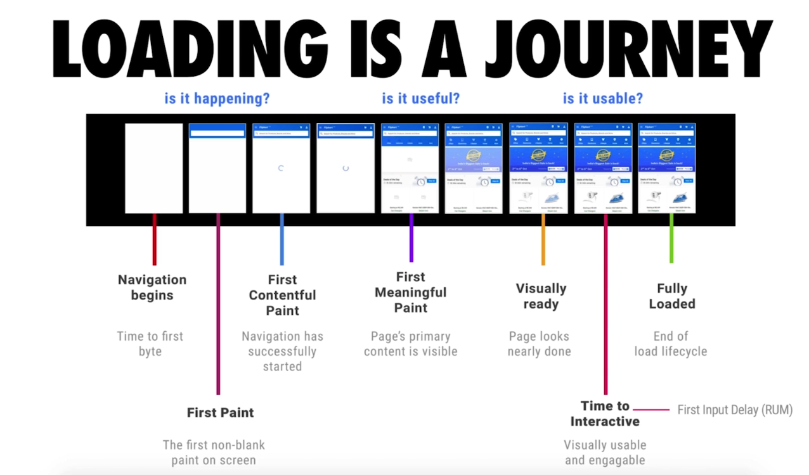
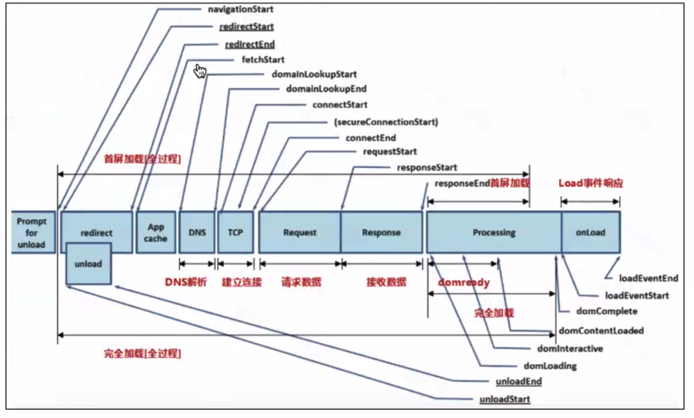
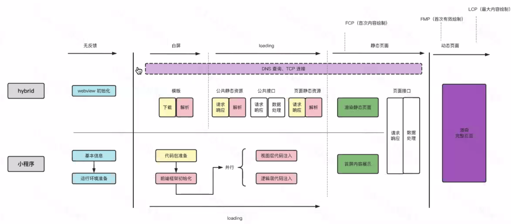
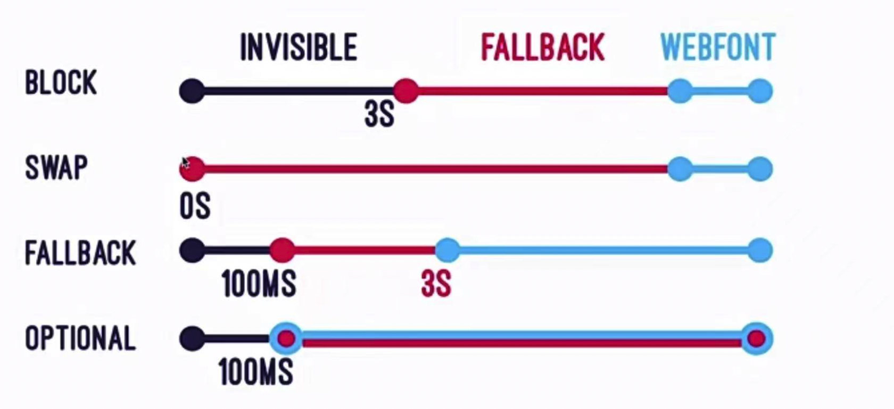
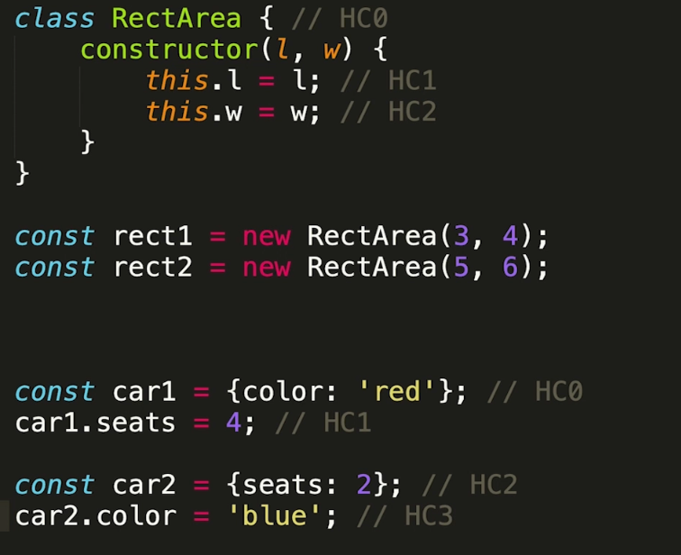
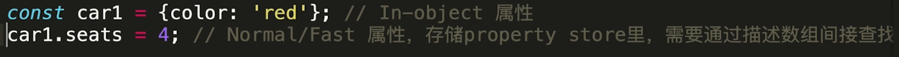
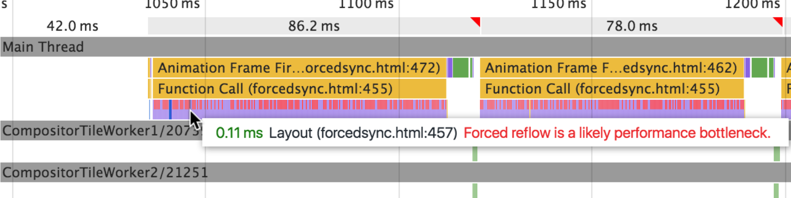
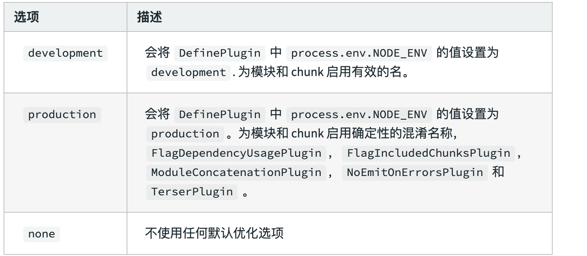
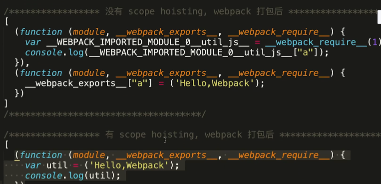

[toc]

# 概览

体验优化： 

+ 包括对于性能的优化，h5层面的优化、离线包、改用跨端flutter优化
+ UI一致性的优化： 组件的复用
+ 白屏优化、首屏优化
+ 开发者的体验： 热启动时间

# 性能优化

总体思路：

加载更快：

+ 减少资源访问： 压缩代码
+ 减少访问次数：合并代码、SSR服务器渲染、缓存
+ 使用更快的网络： CDN

渲染更快

+ CSS放在head, js放在最后
+ 尽早开始执行js， 用DOMContentLoaded触发
+ 图片懒加载
+ 缓存
  + 静态资源加hash后缀，根据内容计算hash
  + 文件内容不变则hash不变，url不变时自动触发http缓存机制，返回304

## 为什么需要性能优化



### 性能优化指标

- FT(first paint):首屏加载时间，如果这个时间长，是因为资源加载慢

- FCP(first contentfull paint):首屏内容加载时间

- DCL(DOM contentLoaded):DOM内容加载时间

- LCP(Largest contentfull paint):最大内容加载时间，是自动来计算的，计算最大块的元素的加载时间，是不那么可靠的指标

- L(Load) 加载时间，则是渲染慢

  

+ FMP(`First Meaningful Paint`)：首次有意义的加载时间，可以我们自己定义在什么位置window.performance.mark(nameEnd)打点计算

### 性能优化检测工具

- chrome的performance Dev

  ```
  chrome的performance工具，开始录制，获取结果，在timing可以看到各个性能指标所需的时间
  ```

  

- chrome的lighthouse,可以分析网页性能，并给出修改的意见

  



### 首屏渲染



#### 对于hybrid: 

+ 无反馈阶段：webview初始化阶段
+ 白屏阶段：进行模版的下载和解析
+ loading阶段：请求公共静态资源，请求公共的接口，请求页面的静态资源
+ 静态页面：根据接口和静态资源，渲染静态页面（首次内容渲染）
+ 请求页面接口， 进行动态页面的渲染（最大内容加载，首次有意义的内容加载）

#### 小程序

+ 无反馈阶段：运行环境加载
+ Loading阶段：代码包的准备和前端框架的初始化， 视图层和逻辑层代码注入

小程序的性能优化

懒加载、减少setData的次数和不必要的setData，列表渲染的时候加上key，合理使用缓存，合理利用事件通信等等。

## 资源优化

### 资源的压缩与合并

- 减少http请求数量
- 减少请求资源的大小

HTML压缩：

>去除注释、空格等
>
>- 使用在线工具进行压缩
>- 使用html-minifier等npm工具

CSS压缩

>+ 使用在线工具进行压缩
>+ 使用clean-css等npm工具

JS压缩

>- 在线JS压缩
>- 使用webpack在构建时压缩

css/js文件合并

>小文件的合并，减少请求次数

### 图片资源优化

+ 图片的格式选择

  >jpg：有损的压缩，压缩比高且色彩还能保持的很好。web常用
  >
  >+ 压缩工具[imagemin](https://github.com/imagemin/imagemin)，可以对jpg图片进行进一步的压缩
  >+ 缺点：压缩比较高，可能有锯齿和边缘（logo一般不用）
  >
  >png：
  >
  >+ 优点：
  >  + 可以做透明背景的图片
  >  + 对jpg的一些缺点进行弥补
  >+ 体积较jpg大
  >+ 常用来做小的图标
  >+ 压缩png：[imagequant](https://github.com/imagemin/imagemin-pngquant)
  >
  >webp:
  >
  >+ 有很多webp转换工具
  >+ 问题：可能有兼容性问题
  >
  >说明：普通网站上面三种都差别不大，主要体现在大小的区别

+ 图片的尺寸选择

  >使用响应式图片
  >
  >srcset的使用
  >
  >```
  >
  >```
  >
  >size属性的使用
  >
  >picture的使用

+ 图片的自适应

  >使用渐进式格式
  >
  >有的图片是一层一层加载出来的，有的是先从不清晰加载到清晰状态的，可以使用工具把图片转换为渐进式加载出来的效果，比如有imagemin工具

+ 图片懒加载

  >原生的懒加载方案
  >
  >```
  >
  >```
  >
  >问题：
  >
  >1. 自定义和可扩展性不是特别好
  >2. 需要浏览器支持
  >
  >第三方图片懒加载方案
  >
  >1. verlok/lazyload
  >2. yall.js
  >3. Blazy

### 字体的优化

字体未下载完成时 ，浏览器隐藏或者自动降级,导致浏览器先隐藏字体对应的位置，再加载出所设置的字体，导致字体闪烁的效果，也就是FOIT（Flash of Invisible Text）

+ auto ，默认值，字体的加载过程由浏览器自行决定，不过基本上和取值为 block 时的处理方式一致。
+ block :隐藏字体--》备用字体--》自定义字体
+ swap ：备用字体--》自定义字体
+ fallback ：阻塞期很短（大约100毫秒），也就是说会有大约 100 毫秒的显示空白的后备字体，然后交换期也有时限（大约 3 秒），在这段时间内如果字体加载成功了就会替换成该字体，如果没有加载成功那么后续会一直使用后备字体渲染文本。
+ optional 。与 fallback 的阻塞期一致，但是没有交换期，如果在阻塞期的 100 毫秒内字体加载完成，那么会使用该字体，否则直接使用后备字体。这个就是说指定的网络字体是可有可无的，如果加载很快那么可以显示，加载稍微慢一点就不会显示了，适合网络情况不好的时候，例如移动网络。



```css
@font-face { 
  font-family: "Open Sans Regular"; 
  font-weight: 400;
  font-style: normal; 
  src: url("fonts/OpenSans-Regular-BasicLatin.woff2") format("woff2");
  font-display: swap; }
```

+ Unicode-range: 只加载常见的字体

传输加载优化：解决搞访问量网站的性能问题

## 减少传输时间

### keep-alive

Keep-alive开启，表示要复用TCP连接，减少由于TCP连接所导致的时间，图中的initial connection就是TCP连接时间


+ 判断是否开启了keep-alive

  ```
  请求的response Header里有一个
  connection: keep-alive表示了开启
  ```

+ ngnix相关配置

  ```js
  keepalive_timeout：65
  //为0表示没有开启，为65表示TCP连接可以持续65秒
  keepalive_requests: 100;
  //表示TCP连接最多只可以支持100个请求
  ```

### Gzip

动态压缩技术，一般不用于压缩图片，图片压缩效果不是太好，而且压缩也会导致耗时

+ ngnix配置, [nginx](https://so.csdn.net/so/search?q=nginx&spm=1001.2101.3001.7020) 的 gzip ，可以分为两种：
  + nginx 动态压缩，对每个请求先压缩再输出。
  + nginx 静态压缩，使用现成的扩展名为 .gz 的预压缩文件。


https://blog.csdn.net/weixin_54931703/article/details/120814273

```js
gzip on | off;
//用于开启或者关闭Gzip 功能。默认为off,关闭
gzip_min_length 1k;
//文件最小为1k时，才开启压缩
gzip_comp_level 6;
//用于设定Gzip压缩程度,包括级别1到级别9。级别1表示压缩程度最低,压缩效率最高;级别9表示压缩程度最高，压缩效率最低，最费时间,所以可以设置一个中间的数值
gzip_types text/plain application/javascript text/css application/xml;
//默认为texthtml,在 gzip指令设置为on时Nginx服务器会对所有的text/html类型页面数据进行Gzip压缩。变量还可以取“*”，表示对所有MIME类型的页面数据进行Gzip压缩
gzip_vary on
//该指令用于设置在使用Gzip功能时是否发送带有“Vary: Accept-Encoding”头域的响应头部。该头域的主要功能是告诉接收方发送的数据经过了压缩处理。开启后的效果是在响应头部添加了Accept-Encoding: gzip，这对于本身不支持Gzip压缩的客户端浏览器是有用的。
gzip_buffers 4 16k;
//number   指定Nginx服务器需要向系统申请缓存空间的个数。size     指定每个缓存空间的大小,
gzip http version 1.1;
//针对不同种类客户端发起的请求，可以选择性地开启和关闭Gzip功能。默认设置为1.1版本，即只有客户端使用1.1及以上版本的HTTP协议时，才使用Gzip 功能对响应输出数据进行压缩。
gzip_static on;
//首先尝试使用静态压缩，如果有则返回 .gz 的预压缩文件，否则尝试动态压缩。（需要使用 ngx_http_gzip_static_module 模块）
```

### HTTP缓存

+ 提高重复访问时资源的加载速度

```
cache-control/expires
last-modified+if-modified-since
etag+if-none-match
```

+ ngnix缓存配置

  ```json
  //对html/htm不进行缓存，每次请求重新请求服务器, 协商缓存
  // 多种设置方法是为了兼容老浏览器
  if ($request_filename ~* .*\.(htm|html)$)
  {
    add_header "Cache-Control" "no-cache must-revalidate";
    add_header "Pragma" "no-cache";
    add_header "Expires" "0"
  }
  ```

  ```
  //设置过期时间
  if ($request_filename ~* .*\.(?:js|css)$)
  {
    expires: 7d
  }
  ```

+ 几个网站的配置

  ```
  cache-control: max-age=0
  cache-control: private must-revalidate no-store
  //private 只能在浏览器中缓存
  ```

### service workers

+ 加速重复访问、离线支持
+ 首屏加载时间会变长，但是页面总加载时间减少
+ 需要考虑兼容性
+ <font color="red">只能在localhost或者https下使用</font>
+ 如果采用了service workers,那么请求中会显示

### HTTP2

+ 头部压缩
+ 二进制传输
+ 多路复用（HTTP1.1必须等待一个请求结束并且返回后才能发起下一个请求，HTTP2可以不需要等上一个请求返回结果就发起下一个请求）
+ 服务端推送

#### HTTPS配置

http2必须在https下才能使用

+ https生成证书（一般需要购买，可以生成自签名证书）

+ 配置证书

  ```
  ssl                      on;
  ssl_certificate          /etc/nginx/certs/example.crt;
  ssl_certificate_key      /etc/nginx/certs/example.key;
  
  ssl_session_timeout  5m;
  
  ssl_ciphers HIGH:!aNULL:!MD5;
  ssl_protocols SSLv3 TLSv1 TLSv1.1 TLSv1.2;
  ```

如果页面由于使用了https而显示无法加载，可以直接在键盘上输入

```
thisisunsafe
```

就可以忽略安全配置直接显示页面

#### 服务端推送配置

服务端http2推送图片

```json
location /{
  root /User/xxx
  index index.html
  #http2_push  /img/img0.jpg
}
```

此时在浏览器的请求调试里initial显示为push


### SSR

服务端渲染

+ 首屏加载速度提高
+ 更好的SEO


## 缩短解析时间

为什么要缩短js解析时间

+ js需要进行加载、解析&编译、执行，开销最大，相同大小的图片资源和js资源，js的开销更大
+ js的加载过程可能会造成阻塞，此时即使用户看到了页面，但是却无法进行交互。

### 代码层面上进行优化

- 外部第三方的JS文件：
  - Code splitting 代码拆分，按需加载
  - Tree shaking 代码减重 （比如lodash，不需要其全部的功能函数）
- 减少主线程工作量：
  - 避免长任务（任务越长、阻塞时间越久）
  - 避免超过1KB的行间脚本
  - 使用rAF和rIC进行时间调度

### 利用V8进行优化

代码==》解析为抽象语法树==》抽象为字节码==》机器码

这个过程V8会自动进行一部分优化工作

利用V8的优化机制：

- 脚本流：脚本正常情况是先下载，再解析，V8优化当脚本下载够30KB，就单独开一个线程解析，一边下载一边解析
- 字节码缓存，多个页面可能使用了相同的逻辑，会被解析为相同的字节码，所以会把字节码缓存起来
- 懒解析：只有当函数真正被调用的时候，才会去解析函数体，如果没有调用，就不会进行解析。这样的解析方式会对性能有很好的提升。
- 比如对于函数的输入参数，最好每次传入的参数类型相同（比如每次都传入数字，避免传入字符串等其他类型）

#### 函数优化

+ V8这样的JS引擎，默认对函数进行**懒解析（lazy parsing）**
+ 实际开发中有的情况需要JS立即去执行，此时如果是懒解析的函数但是发现需要立即执行，于是又快速的进行了一个**饥饿解析（eager parsing）**，这样的话会先进行了一次饥饿解析，然后又进行了一次懒解析，执行效率反而降低了。

+ 那么如何告诉解析器某个函数需要立即解析:

只需加一对括号：

```js
const add = ((a,b) => a+b)    // 这样的作用是告诉解析器，当看到这个函数的时候就对这个函数进行解析
const n1 = 1
const n2 = 2
add(n1,n2)
```

 这样当后面需要调用的时候就可以直接调用了

有个问题：

- 当把代码进行压缩时（uglyfy），可能会把这对括号去掉
- 解决：Optimize.js可以在压缩以后把括号加回来
  - uglyfy后来把这些问题也解决了，需要兼顾老版本的可以添加

#### 对象优化

js是一个弱类型的语言，在声明的时候不会声明这个变量的类型。但是对于编译器而言，还是需要一个具体的类型。如何做：v8在解析的时候会给这个变量进行推断，赋一个具体的类型（隐藏类型HC，隐藏类型会有顺序）

对象优化可以做的事：

- 以相同顺序初始化对象成员，这样初始化时候的隐藏类型可以复用



- 实例化后避免添加新属性，因为查询新属性需要间接查询

  

- 尽量使用Array代替array-like对象（如argument）

  ```json
  //array-like 只是有length等类似数组的属性，但是没有数组本身的一些方法，比如forEach等
  可以先把类数组转换为数组，再调用数组原生的方法
  Array.prototype.slice.call(arraylike, 0)
  ```

- 避免读取超过数组的长度

  - 会造成沿原型链的查找，会增加开销（据统计会相差六倍）

- 避免元素类型转换，如[1,2,3]push了一个1.2的元素，数组默认的类型会被更改

  - 即类型给的越具体，编译器能做的优化越多
  - 越通用，能做的优化越少

### HTML的优化

HTML的大小占比较小，可以做的优化也小，但是也能做：

- 减少iframes的使用。iframes会阻塞父文档的加载。要用的话可以使用延迟加载，不影响初始时页面加载。
- 压缩空白符，空行，删除注释
- 避免节点深层级嵌套，dom树占用内存更多，并且遍历更耗时，常见的是div的无效嵌套
- 避免使用table布局
- CSS&JS尽量外链，不要写在行间
- 删除元素默认属性，不用添加多余的字符，造成多余的传输

借助工具：

- html-minifier
- ...

### CSS的优化

- 降低CSS对渲染的阻塞　　

  - 对目前用不到的CSS，可以延迟加载

- 利用GPU进行完成动画(transform和opacity优化)

- 使用[contain](https://developer.mozilla.org/zh-CN/docs/Web/CSS/contain)属性进行布局

  ```
  CSS** contain** 属性允许开发者声明当前元素和它的内容尽可能的独立于 DOM 树的其他部分。这使得浏览器在重新计算布局、样式、绘图、大小或这四项的组合时，只影响到有限的 DOM 区域，而不是整个页面，可以有效改善性能。
  contain: layout; //表示元素外部无法影响元素内部的布局，反之亦然。
  contain:size
  表示这个元素的尺寸计算不依赖于它的子孙元素的尺寸。
  xxx
  ```

- 使用font-display属性,使得文字更早进行显示，并且减少文字闪烁


## 渲染优化

### 浏览器渲染原理

js下载==》解析为style==》cssDOM/DOM==》renderDOM==》布局layout==》绘制==》复合

### 避免Layout thrashing

例如

```js
for(var i=0;i<elements.length;i++){
    var blockWidth=baseElement.Width;
    elements[i].style.width=blockWidth;
}
```

当开发者设置了一个CSS样式，浏览器会继续等待看有没有更多的样式改变，然后在接下来的一帧来个批处理。

例子中让浏览器去读一个Layout，这样浏览器就不能等待多个样式的批处理，而是强制让它先把刚才的样式做渲染，这样一读一写地循环下去，性能是非常低的，叫做“Forced Synchonous Layout”。



改进

```js
var blockWidth=baseElement.Width;
for(var i=0;i<elements.length;i++){
    elements[i].style.width=blockWidth;
}
```

如何避免：

+ Fastdom

### 如何变为layer

把需要不断重绘和回流的部分抽离为单独的一层，可以避免回流造成的消耗

```
.layer{transform:translate3d(0,0,0)}
.layer{transform:translateZ(0)}
```

## webpack里如何进行性能优化

### 配置优化

webpack提供了两种模式，production模式和dev模式，这两种模式默认已经启动了一些性能优化的方式



### tree-shaking(pro)

pro环境自动启用

一种性能优化的方法，在webpack入口有很多依赖的文件，但是有很多文件是没有用的文件或者只用到了这些依赖的一部分模块，tree shaking可以帮助我们删除没有用的部分

（1）DCE消除

+ 删除不能执行的代码
+ 删除代码结果没有被使用到的代码
+ 删除只会影响死变量的代码（let a=1,但是a没有被使用）

消除的原理：抽象语法树

（2）js里的DCE

需要在js到达浏览器之前，由uglify来完成，但是uglify无法跨文件执行

（3）tree shaking消除法

更关注于无用模块的消除，消除那些引用了但并没有被使用的模块（有的代码是生产环境不会执行的代码，比如提示信息）

消除原理：依赖于ES6的模块特性，因为ES module，只能作为模块顶层的语句出现，而且import 的模块名只能是字符串常量，所以可以提前知道模块之间的依赖关系，然后做静态分析, tree shaking就是当我们在项目中引入其他模块时，他会自动将我们用不到的代码，或者永远不会执行的代码摇掉，在Uglify阶段查出，不打包到bundle中。

+ 注意，它<font color="red">基于ES6的import export机制</font>

配置注意项

```json
//bable里必须开启module的机制，在bable.config.js里需要配置
//表示 ECMAScript模块不需要首先转换为CommonJS模块
{
  presets: [["es2015", { "modules": false }]]
}
```

+ <font color="red">sideEffects配置</font>

  在package.json中配置，哪些文件不可以被摇掉

  ```js
  //表示css文件不可以被摇掉
  "sideEffects": [
    "*.css"
   ]
  ```

  对于在js里引入的css全局文件，不配置的话默认会被摇掉

  ```js
  import "./styles/reset.css"
  ```

  也可以在webpack里去做配置

  ```js
  // webpack.config.js
  module.exports = {
    // ...
      module: {
      rules: [
        {
          test: /\.css$/i,
          use: ["style-loader", "css-loader"],
          sideEffects: true //true表示不可以被摇掉
        }
      ]
    },
  };
  ```

### terser-webpack-plugin(pro)

减小js文件体积，生产环境默认引入

+ webpack4后引入了unglifyjs-webpack-plugin
+ 支持es6替换为terser-webpack-plugin

uglify消除

原理：把原代码解析为AST，然后压缩为更小的AST，再还原出代码，从而优化，需要在js到达浏览器之前，由uglify来完成，但是uglify无法跨文件执行

### 作用域提升（pro）

作用域提升可以把代码尽量做一个合并，这样可以减小代码体积，执行效率也会更高，这里要注意babel的`modules:false`的配置，因为所有的这些也是要基于es6的import，export的语法，在生产模式中webpack会自动帮我们做一个作用域提升。



### bable的配置优化（按需引入polyfill）

在webpack中，babel只能转换新的语法，如将es6转为es5，jsx转为js等，但但是无法处理新的api，如promise等，这时候就需要依赖babel-polyfill，但是可能会把所有polyfill引入，所以需要进行按需引入(babel-plugin-transform-runtime完成),减小文件的体积。

```json
//配置babel.config.js，使用babel-polyfill
preset: [
    ["@babel/preset-env", {
       "targets": {
          "chrome": "70",
          "ie": "11"
        },
        useBuiltIns: "usage"'
        corejs: 3.8
    }]
]


```

useBuiltIns有三个属性值

+ false : 打包的文件不需要polyfill来进行适配

+ usage : 根据源代码中出现的语言特性，自动检测所需要的polyfill，设置corejs属性来确定使用corejs的版本

+ entry : 当我们依赖的某个库本身就用了polyfill，如果使用usage可能会导致浏览器报错，这时候就可以使用entry，并且入口文件处添加

```
import ‘core-js/stable’;
import 'regenerator-runtime/runtime';
```

targets: 兼容哪些浏览器

+ <font color="red">babel-plugin-transform-runtime</font>

  ```
  //.babelrc 里配置
  plugins:["tranform-runtime"]
  ```


## vue的性能优化

+ 对象层级不要过深，否则性能就会差

+ 不需要响应式的数据不要放到 data 中（可以用 Object.freeze() 冻结数据）

+ v-if 和 v-show 区分使用场景

+ computed 和 watch 区分使用场景

+ v-for 遍历必须加 key，key 最好是 id 值，且避免同时使用 v-if

+ 大数据列表和表格性能优化-虚拟列表/虚拟表格

+ 防止内部泄漏，组件销毁后把全局变量和事件销毁

+ 图片懒加载

+ 路由懒加载

+ 第三方插件的按需引入

+ 适当采用 keep-alive 缓存组件

  > （比如tab组件的切换）

+ 防抖、节流运用

+ 服务端渲染 SSR or 预渲染


# 开发者体验优化

## webpack构建优化

提高webpack本身的构建速度，使得webpack的打包速度更快

###  noParse

希望哪些库不进行解析: 模块化了的文件必须被解析，而那些没有模块化的文件不需要被解析，或者说，尽量不要被解析。

这些库的特点：比较大、独立、甚至没有使用模块化的方法,比如lodash就不需要进行解析

```json
//webpack.config.js

module.exports = {
    module:{
        noParse:/lodash/,      
        rules:[]
    }
}
```

### DLLPlugin

https://blog.csdn.net/riddle1981/article/details/114345250

Dynamic Link Library的缩写,动态链接库

避免打包时对一些不变的库进行重复的构建，比如vue库，可以构建一次，然后之后直接引用

+ 生成dll文件
+ 生成dll的描述文件
+ 引用

配置方法：

```js
const path = require('path')
const webpack = require('webpack')
const { CleanWebpackPlugin } = require('clean-webpack-plugin')

// dll文件存放的目录
const dllPath = 'dll'

module.exports = {
  entry: {
    // 需要提取的库文件
    vendor: ['vue', 'vue-router', 'core-js']
  },
  output: {
    path: path.join(__dirname, dllPath),
    filename: '[name]-dll.[hash:8].js',
    // 这会将你的 library bundle 暴露为名为[name]_[hash]的全局变量
    // 保持与 webpack.DllPlugin 插件配置中name名称一致
    library: '[name]_[hash]'
  },
  plugins: [
    // 清除之前的dll文件
    new CleanWebpackPlugin(),
    // 该插件为webpack自带插件无需单独引用
    // 设置环境变量
    new webpack.DefinePlugin({
      'process.env': {
        NODE_ENV: JSON.stringify('production')
      }
    }),
    // manifest.json 描述动态链接库包含了哪些内容
    new webpack.DllPlugin({
      path: path.join(__dirname, dllPath, '[name]-manifest.json'),
      // 这里的name需要保持与 output.library中名称一致
      name: '[name]_[hash]',
      context: process.cwd()
    })
  ]
}
```

生成dll文件以及描述文件

```js
//package.json
"dll": "webpack --progress --config ./build/webpack.dllconf.js"
```

引用dll文件,使得构建过程中可以找到描述文件

```js
 new webpack.DllReferencePlugin({
     context: process.cwd(),
     manifest: require('./build/dll/vendor-manifest.json')
}),
```

动态库文件还需要注入进index.html

```js
const AddAssetHtmlPlugin = require('add-asset-html-webpack-plugin')

new AddAssetHtmlPlugin({
    // dll文件位置
    filepath: path.resolve(__dirname, './build/dll/*.js'),
    // dll 引用路径
    publicPath: './vendor',
    // dll最终输出的目录
    outputPath: './vendor'
 })
```

### 资源压缩

+ js压缩terser, 原理： AST树优化
+ css压缩：
  + mini-css-extract-plugin： 提取css，把写在style等的样式提取出来
  + optimize-css-assets-[webpack](https://so.csdn.net/so/search?q=webpack&spm=1001.2101.3001.7020)-plugin压缩css
+ html压缩：HtnlWebpackPlugin不仅可以压缩HTML代码（去除空格注释等），还可以自动帮我们生产模板文件，在生产环境下自动开启压缩

# 小程序性能优化做了哪些事

> 小程序本身是双线程架构，渲染层和逻辑层相互独立，通过微信原生中的`JSBridge`进行通信，因此性能的损耗主要花费在通信过程中。而在通信过程中影响性能的点最主要的则是`setData`的`频率`和`数据量`。 
> 所以主要做的优化手段就是去减少`setData`的次数，同时当`setData`数据量过大时对数据量进行拆分，分为多个`setData`去执行，从这两者中找到一个平衡。 
>
> 除此之外，还利用了Wxml节点压缩，CSS样式合并，以及请求预加载等方式进行性能优化。
