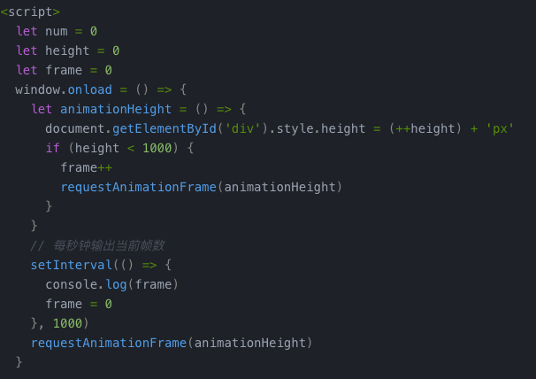

[toc]

# 之前的监控告警是怎么做的

> 分为两部分，第一部分为日志的埋点和上传，包含了代码日志和业务日志。主要是自己实现了一个基于`WebSocket`的日志服务，在客户端项目加载的时候启动`WebSocket`，然后通过提供的log方法在代码中去进行日志打点。服务端收到上传的日志之后传入到公司内的数仓，之后通过数仓的API实现日志的查询。 
> 对于业务数据的埋点则是在对应的用户操作时进行埋点上报。 
>
> 另一部分则是告警的实现，这部分利用公司的统一基础设施去做。在拿到前面的埋点信息之后，在公司的告警平台可以看到对应的埋点数据的趋势图，根据趋势可以设置告警阈值。告警阈值主要是通过人工去指定告警策略并根据实际情况进行调整和优化，以实现更准确的告警。

# 有没有在质量和稳定性上做一些事情

> 包含两部分，一部分是开发过程中的质量保障，主要有两点一个是单元测试，通过`Jest`去实现，另一个则是UI的自动化测试，通过`cypress`实现。第二部分是对线上稳定性的监控，这个是基于开源项目加二次开发实现的。具体可以分为以下几个步骤：
>
> 1. 异常捕获：对异常进行分类，不同分类通过不同的方式进行捕获，如`addEventListener('error')`监听JS代码异常，`window.onerror`监听资源加载异常，`xhr.addEventListener('error')`监听请求异常等
> 2. 异常上报：可以通过`WebSocket`进行上报，或者直接通过`HTTP`请求上报，在上报的时候需要考虑到弱网的缓存，以及高并发的数据合并情况
> 3. 数据接收：启动一个`Node`服务，在接收到异常数据之后直接存在数据库中即可
> 4. 数据使用：对上传的异常和监控数据进行分类查询，并提供对应的监控告警机制，当超出阈值范围时发送告警邮件


# 卡顿检测

卡顿通常是指应用程序在执行过程中出现响应延迟或停滞的现象，表现为页面渲染更新缓慢、动画帧率下降、操作反馈延迟等

## 卡顿原因

- **资源消耗过大**：如CPU占用过高、内存泄漏、磁盘IO瓶颈等。
- **主线程阻塞**：长时间的同步操作、大量计算任务未异步化等导致主线程无法继续处理后续事件。
- **网络延迟**：对于依赖网络通信的应用，网络状况不佳也可能间接造成卡顿感。
- **渲染性能问题**：DOM操作过于频繁、CSS样式计算复杂度过高、GPU过度渲染等。

卡顿主要从页面的FPS来进行检测和评估。FPS（Frames Per Second）是指画面每秒传输的帧数，通俗来讲就是指动画或视频的画面数。较高的 FPS 值通常表示运动更平滑、更流畅，而较低的 FPS 值可能会导致动画不连贯且视觉吸引力较差。通常动作出现不流畅在30以下。对网页来说30-60之间即为可接受范围，60fps为理想情况，在此区间不会出现明显卡顿。

## 卡顿检测方案

window.requestAnimationFrame() 该方法接受一个回调函数作为参数，回调函数会在浏览器下一次重绘之前执行。由于浏览器每帧刷新都会调用该回调，所以可以通过调用次数用来统计动画帧数，进而推断出当前页面的FPS。

基于连续多次FPS低于电影帧单帧数，比如连续三次低于24，则判断为卡顿，进行数据上报。

> ps：电影帧率(18-24)，一般是24帧。电影帧单帧耗时：1000ms/24≈41.67ms。电影帧率是一个临界点。低于这个帧率，人眼基本能感觉画面不连续性，也就是感觉到了卡顿。



<div class="hljs-button signin active" data-title="登录复制" data-report-click="{&quot;spm&quot;:&quot;1001.2101.3001.4334&quot;}"></div></code>

# Vue错误监控

搬运https://www.jb51.net/article/245438.htm

## window.onerror

能监听到全局的错误，一般放在APP.vue里

- message： 错误信息
- source：发生错误的资源
- line：发生错误的行号
- column：发生错误的列数
- error：Error错误对象

```js
window.onerror = function(message,source,line,column,error) {
    // do something
};
```

## element.onerror

针对一些资源加载失败的情况，例如img、script，将会触发该元素的onerror()处理函数，并且error不会冒泡到window。遇到这种情况，可以手动抛出异常，就可以被全局异常监听到是资源加载失败了。

```js
// child.vue
// 图片资源加载失败
 handleError(event)" />
...
handleError(event) {
    console.log('handleError-----', event);
    throw new Error('图片加载失败了'); // 手动抛出异常，以便全局事件可以监听到
}
```

## errorHandler

Vue全局错误监听处理，所有组件的错误信息默认都会汇总到此。
由于errorHandler是全局配置的，因此window.onerror将会“失效”，即errorHandler能捕获的错误，onerror将不能捕获；

```js
// main.js
...
const app = createApp(App)
app.config.errorHandler = (err, vm info) => {
    console.log('errorHandle', err, vm, info);
    // err，错误对象
    // vm，发生错误的组件实例
    // info，Vue特定的错误信息，例如错误发生的生命周期、错误发生的事件
}
```

## errorCaptured

errorCaptured是Vue生命周期中的一个，用于捕获当前组件的所有后代组件产生的错误。函数如果返回为false，则会阻止error继续上传，全局的错误监听将不能捕获该error；否则，全局的错误监听也会再处理error。

## 总结

+ 在Vue环境中，大多数错误可使用errorHandler配置和errorCaptured钩子解决，但是不能处理异步错误
+ 监听异步错误，多采用window.onerror
+ 默认情况下，如果定义了全局的errorHandler，所有的error都将最终汇总到errorHandler中做统一处理
+ 如果一个组件的继承链或父链存在多个errorCaptured钩子，则这些钩子将会被相同的错误逐级唤起。

# node的错误监控

通过自定义中间件进行异常处理: 此时需要请求发生之后再通过中间件进行异常处理

```js
app.get('/', function(req, res) {
  throw new Error('something has error...')
})

const errorHandler = function (err, req, res, next) {
  console.log('errorHandler...', err)
  res.status(500).json({
    error: '--',
    msg: '服务端报错'
  })
  res.send('down...')
}

app.use(errorHandler)
```

