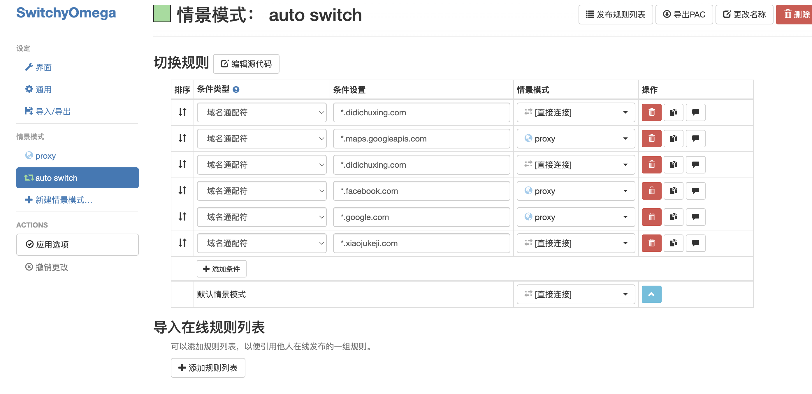
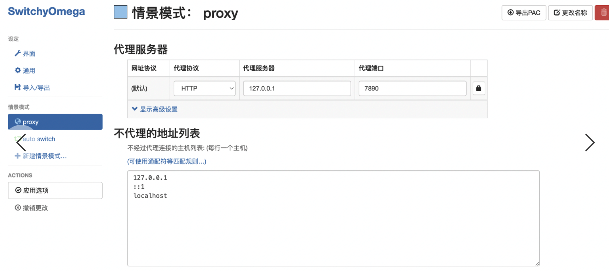

[toc]

# 画流程图

推荐使用软件diagrams.net.Desktop

脑图：xmind

# markdown编辑器

typera

# vscode插件

+ gitlens:可以看到每一行代码的git提交记录
+ view in browser: 可以文件直接右键打开浏览器
+ jest：jest单测调试工具，可以debug
+ import cost 可以显示引入包的体积

# github工具

GitHub Desktop

chrome开发者网站：https://developer.chrome.com/docs  

chrome web优化：https://web.dev/

# charles

网站在手机上调试，使用charles进行配置https://blog.csdn.net/Moonlight_16/article/details/118726585

# 科学上网

在资源下载里面，有一个网址（https://dl.trojan-cdn.com/trojan/），进这里下载一个叫 clashX的

如何配置使得特定网站可以访问外网，其他网站访问内网

Proxy SwitchyOmega

