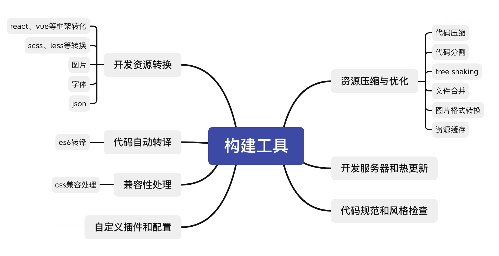
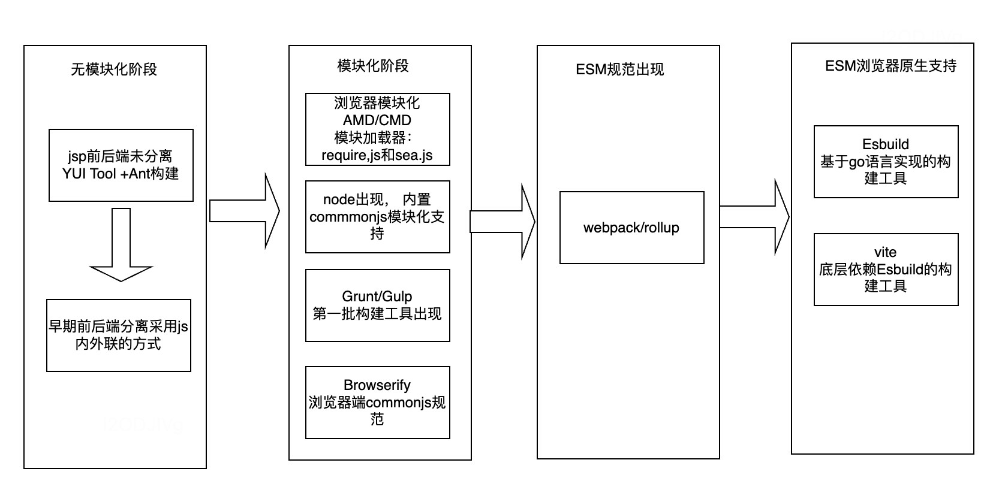
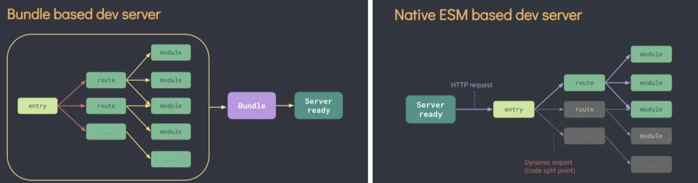

[toc]


# 什么是构建

将**源代码**转换为生产环境**可以用来部署的代码**

# 构建工具可以做什么



# 前端构建工具进化史



## 1.无模块化阶段

前后端未分离： 使用JSP模式开发， 利用java的工具YUI tools完成代码压缩和混淆

前后端分离：代码不需要构建， 直接写在script里或者进行文件抽取， 使用内外联方式引入

```html
<html>
  <head>
    <title>JQuery</title>
  </head>
  <body>
    <div id="app"/>
    // 第三方库js
    <script src="https://cdn.bootcdn.net/ajax/libs/jquery/3.6.4/jquery.js"></script>
    // 项目业务js
    <script src="./scripts/utils.js"></script>
    // 内联
    <script type="text/javascript">
      $(document).ready(function(){
        $('#app')[0].innerText = 'Hello World'
      })
    </script>
  </body>
</html>
 
 
// util.js
function calculate(x, y) {
  return x + y
}
```

### 技术痛点问题：

- 全局作用域污染：大量的绑定window全局变量，可能导致变量和函数的命名冲突和污染（后引入的模块方法会覆盖先引入的同名模块方法，包括 **IIFE、命名空间**等解决方案）
- 依赖管理困难：手动管理依赖和加载顺序容易出错
- 性能问题：大量的外联脚本文件可能导致多次HTTP请求，影响页面加载性能

附录：

+ 命名函数方式

  ```js
  <script type="text/javascript" src="module1.js"></script>
  <script type="text/javascript" src="module2.js"></script>
  <script type="text/javascript">
    module1.foo()
    module2.foo()
   
    module1.data = 'hello' 
    module1.foo()
  </script>
  ```

  ```js
  //module1
  let module1 = {
    data: 'module1',
    foo() {
      console.log(`foo() ${this.data}`)
    },
  }
  //module2
  let module2 = {
    data: 'module2',
    foo() {
      console.log(`foo() ${this.data}`)
    }
  }
  ```

  执行结果，分别输出了module1和module2，解决了上述的命名冲突问题，但是存在的问题是数据不安全，可以在当前引入该模块的页面直接修改模块内的内容

+ 匿名函数模式

  将所有逻辑写在自动执行函数内, 通过给window添加属性来向外暴露接口，这样内部变量是私有的，只能使用暴露出来的方法

  结果为foo,undefined,foo

  ==>问题：模块内部如何引用其他模块

  ```html
  <script type="text/javascript" src="module1.js"></script>
  <script type="text/javascript">
        myModule.foo()
        console.log(myModule.data) 
        myModule.data = 'xxxx' 
        myModule.foo() 
  </script>
  
  //module1.js
  ;(function(window) {
    let data = 'foo'
    function foo() {
      console.log(`foo() ${data}`)
    }
    window.myModule = { foo }
  })(window)
  ```

  

### 构建演进

基本上都是通过在线压缩工具、YUI tools，完成基本的代码压缩、混淆，甚至不需要构建

## 2.模块化阶段

解决上述技术问题思路：模块化
当时浏览器端缺少模块化机制，出现了模块规范：通过引入相关 **模块加载器** 来解决这一问题

+ 服务端模块规范：CommonJS，同步加载模块。 node.js诞生：标志着前端进入了现代工程化的时代，它让前端不仅可以在浏览器中运行，还可以在服务器端进行文件操作等任务
+ 浏览器模块规范：AMD、CMD，异步加载模块

### CommonJS

node内置加载器， 运行时加载，而在浏览器中使用时，需要提前打包编译好

+ 每个模块都有自己的作用域，不会造成全局污染
+ 在运行时才进行加载，所以模块运行的顺序就是加载的顺序，而不是受引入顺序的影响
+ 第一次加载后模块会缓存，之后再次使用该模块，使用的是缓存中的方法

```JS
// math.js
function add(a, b) {
  return a + b
}
module.exports = {
  add
}
// app.js
const math = require('./math')
const result1 = math.add(5, 3)
```

### AMD&CMD

不再需要手动维护代码引入顺序， 以及闭包解决了全局变量污染问题

+ AMD模块加载器: require.js[**依赖前置、提前执行**]

```JS
  <script src='https://cdn.bootcdn.net/ajax/libs/require.js/2.3.6/require.js' />
   
  // moduleA.js
  define(function() {
    return {
      sayHello: function() {
        console.log('module A')
      }
    }
  })
  // moduleB.js
  define(function() {
    return {
      sayHello: function() {
        console.log('module B')
      }
    }
  })
   
  // main.js
  require(["moduleA", "moduleB"], function(moduleA, moduleB) {
    moduleA.sayHello()
    moduleB.sayHello()
  })
```

+ CMD模块加载器: sea.js **[依赖就近、延迟执行]**

```js
  <script src='https://cdn.bootcdn.net/ajax/libs/seajs/3.0.3/sea.js' />
   
  // moduleA.js
  define(function(require, exports, module) {
    exports.sayHello = function() {
      console.log('module A')
    }
  })
  // moduleB.js
  define(function(require, exports, module) {
    exports.sayHello = function() {
      console.log('module B')
    }
  })
   
   
  // main.js
  define(function(require, exports, module) {
    var moduleA = require('./moduleA')
    moduleA.sayHello()
    var moduleB = require('./moduleB')
    moduleB.sayHello()
  })
```

### 技术痛点问题

- 回调函数复杂：模块加载需要编写回调函数，使代码难以理解和维护
- 兼容性差：非ECMAScript的官方标准，因此在不同环境中的兼容性和可移植性问题仍然存在
- 加载器复杂：通常需要额外的加载器实现模块规范
- 依赖解析时机：依赖关系在运行时解析，不利于静态代码分析和检查

### 构建演进

前端项目变得越来越复杂。这包括了大量的文件处理诉求：JavaScript 合并、压缩，lint、CSS 预处理器的编译等

第一批基于node构建工具诞生：Grunt 、Gulp、Browserify

#### (1)Grunt

基于任务的构建工具，通过配置文件中定义的任务，来执行自动化工作

```js
module.exports = function(grunt) {
  grunt.initConfig({
    uglify: {
      build: {
        src: 'src/*.js',
        dest: 'dist/<%= pkg.name %>.min.js'
      }
    },
    eslint: {
      target: ['src/*.js', 'other-folder/*.js']
    }
  })
  grunt.loadNpmTasks('grunt-contrib-uglify')
  grunt.loadNpmTasks('grunt-eslint')
  grunt.registerTask('default', ['uglify', 'eslint'])
};
```

grunt痛点问题：每个任务执行结束后都会将文件写入磁盘，下个任务执行时再将文件从磁盘中读出，运行速度慢

#### (2)Gulp

基于任务的构建工具，它通过编写JavaScript代码来定义任务，来执行自动化工作

流式处理方式：每个任务使用管道（pipe）将文件流从一个插件传递到下一个插件

```js
const gulp = require('gulp');
const uglify = require('gulp-uglify')
const eslint = require('gulp-eslint')
 
gulp.task('uglify', function () {
  return gulp.src('src/*.js')
    .pipe(uglify())
    .pipe(gulp.dest('dist'))
})
gulp.task('lint', function () {
  return gulp.src(['src/*.js'])
    .pipe(eslint())
    .pipe(eslint.format())
})
 
gulp.task('default', gulp.series('uglify', 'lint'))
```

#### (3)Browserify

实现CommonJS代码浏览器端复用， 跟gulp结合使用

```JS
const gulp = require('gulp')
const browserify = require('browserify')
const source = require('vinyl-source-stream')
 
gulp.task('bundle', function () {
  return browserify('src/main.js')
    .bundle()
    .pipe(source('bundle.js')) // 将打包后的文件转换为 Gulp 可处理的 vinyl 流
    .pipe(gulp.dest('dist'))
})
gulp.task('uglify', function () {
  return gulp.src('src/*.js')
    .pipe(uglify())
    .pipe(gulp.dest('dist'))
})
gulp.task('default', gulp.series('bundle', 'uglify'))
```

构建痛点问题：

- 有限的模块化支持：非面向模块化构建工具，很难处理复杂模块依赖关系
- 配置复杂性：针对多文件合并、拆分，配置复杂

## 3.ESM规范出现阶段

ESM(ECMAScript Modules，模块化系统)

+ 默认严格模式，顶级模块this为undefined，而不是window，var声明也不会挂载到wndow
+ ES6模块异步加载与执行，只能加载后执行
+ 模块只能加载一次

```js
// module.js
export function greet(name) {
  return `Hello, ${name}!`
}
 
// main.js
import { greet } from './module.mjs'
const message = greet('Alice')
```

### 技术痛点问题

官方只阐述如何实现该规范，浏览器少有支持

### 构建演进

任务处理方式 → 模块化处理方式、任务脚本 → 配置化： Webpack、Rollup

#### (1)Webpack

```js
const path = require('path');
const HtmlWebpackPlugin = require('html-webpack-plugin');
 
module.exports = {
  entry: './src/index.js',
  output: {
    filename: 'bundle.js',
    path: path.resolve(__dirname, 'dist')
  },
  module: {
    rules: [
      {
        test: /\.js$/,
        exclude: /node_modules/,
        use: {
          loader: 'babel-loader'
        }
      }
    ]
  },
  plugins: [
    new HtmlWebpackPlugin({
      template: './src/index.html'
    })
  ]
}
```

痛点问题：构建产物大、配置复杂

#### (2)Rollup

轻量完全基于 ESM 模块规范进行打包，配置简单，适合JS 库打包工具

```JS
import resolve from 'rollup-plugin-node-resolve';
import babel from 'rollup-plugin-babel';
 
export default {
  input: 'src/main.js',
  output: {
    file: 'bundle.js',
    format: 'esm'
  },
  plugins: [
    resolve(),
    babel({
      exclude: 'node_modules/**'
    })
  ]
}
```

webpack、Rollup痛点问题：随着项目规模逐渐庞大，代码量也呈指数级增长，构建工具能力 → 构建工具性能：Esbuild

#### (3)Esbuild

使用go语言并大量使用了其高并发的特性，构建速度比JavaScript 编写的打包器预构建依赖快 10-100 倍。

```JS
const esbuild = require("esbuild")
esbuild.build({
  entryPoints: ["main.js"],
  bundle: true,
  outfile: "bundle.js",
})
```

## 4.ESM浏览器原生支持阶段

服务端：Node.js 13.2.0 开始原生支持ESM语法

浏览器：现在浏览器开始原生支持ESM规范，无需借助构建工具进行转化

```JS
// module.js
export function greet(name) {
  return `Hello, ${name}!`
}
// index.html
<!DOCTYPE html>
<body>
  <script type="module">
    import { greet } from './module.js'
 
    const message = greet('Alice')
  </script>
</body>
</html>
```

### 构建演进



传统构建方式：完成整个依赖树构建生成bundle后，提供页面加载服务

no-bundle方式：无需等待构建，直接提供服务

- 依赖：通过esBuild在首次启动、依赖变化时进行构建，转换ESM模块

- 源码：

  - 基于ESM加载代码，提供服务

  - 按需编译，只需要在浏览器请求源码时进行转换并按需提供源码

    

**生产模式下：仍需要打包，使用Rollup**

- ESM浏览器兼容性
- ESM资源需要 资源压缩优化

痛点问题：开发、生产环境 打包过程、产物不一致，存在代码风险