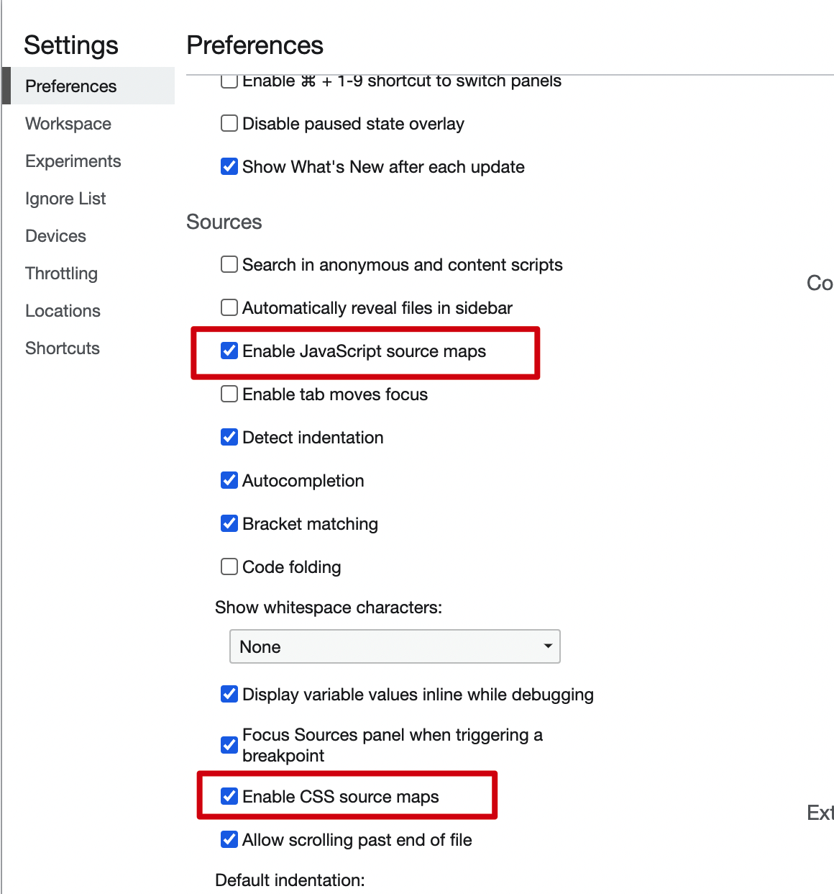
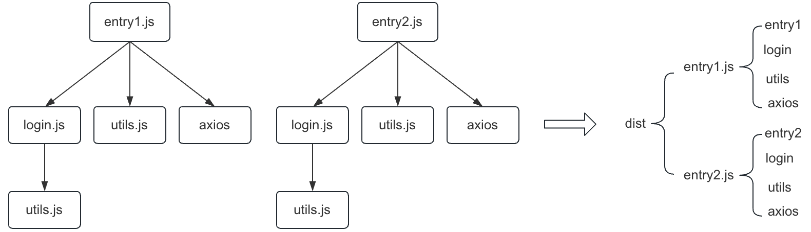
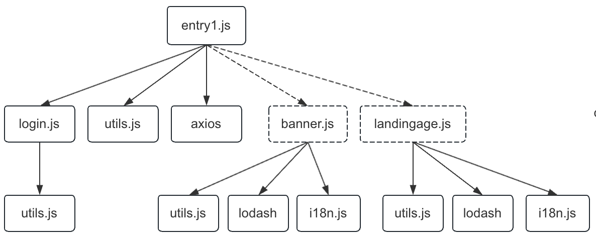
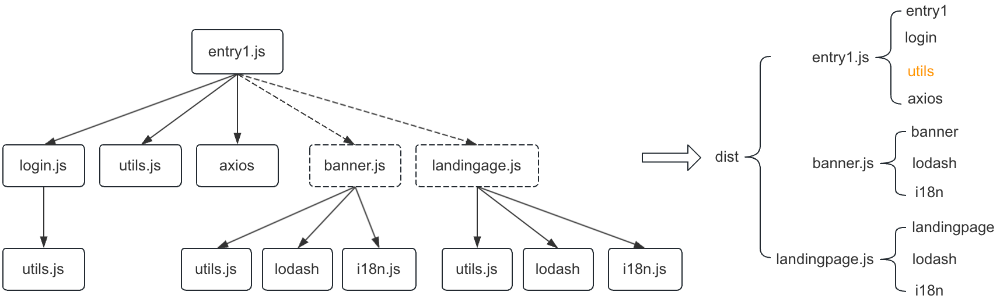
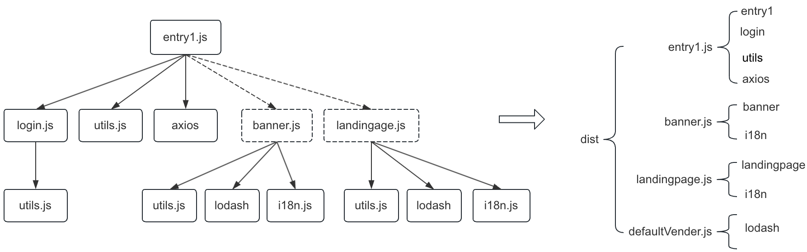
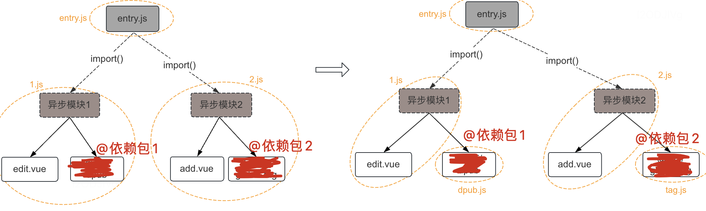
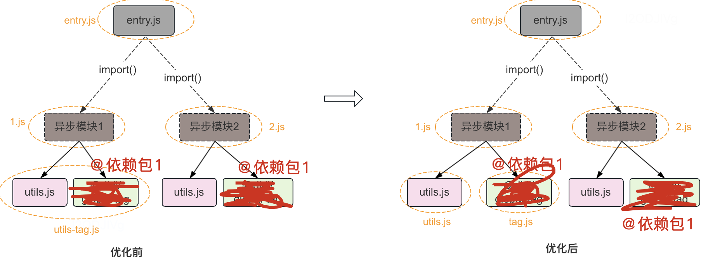
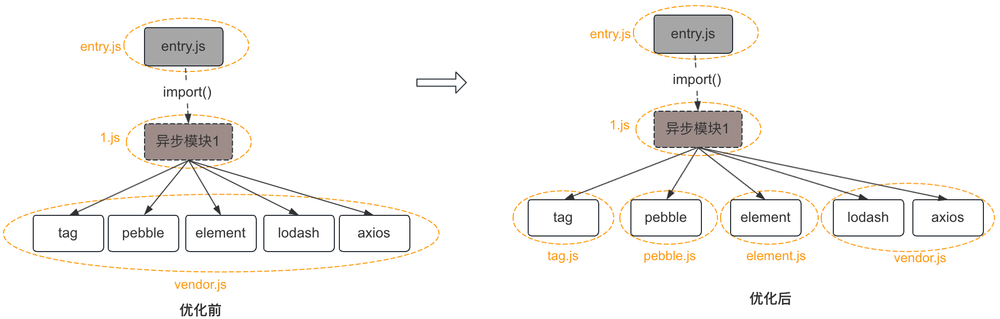
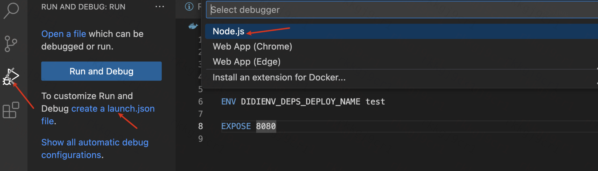

[toc]

# webpack 原理

## webpack构建原理

https://developer.aliyun.com/article/61047

https://juejin.cn/post/6844904094281236487

+ 初始化参数：将webpack.config.js里的参数与脚本文件里的参数合并为最终参数options

  >这里options的生成具体分为几个步骤：
  >1.命令行输入webpack --hot -w
  >2.命令行输入webpack后就会调用./node_modules/.bin/webpack这个shell脚本，这个脚本可以使用optimist，通过optimist，可以获取到node命令行的参数并保存起来，如下：
  >{
  >  hot: true,
  >  profile: false,
  >  watch: true,
  >  ...
  >}
  >3.生成options参数对象，这个对象中拷贝有webpack.config.js的所有内容，然后再根据optimist获取到的参数进行判断，加载哪些webpack.config.js中配置的plugins，比如有hot，那么才去加载"../lib/HotModuleReplacementPlugin"插件

+ 开始编译：用options参数初始化 Compiler 对象，加载 Plugin，执行对象的 run 方法开始执行编译与构建流程

  ```
  compile.run事件构建出Compilation对象，包含了每个构建环节及输出环节所对应的方法
  ```

+ 确定入口：通过options（也就是webpack.config.js的entry）确定所有入口文件

+ 编译模块：从入口文件出发，调用所有配置的 Loader 对模块进行翻译（通过抽象语法树），再找出该模块依赖的模块，然后得到了每个模块被翻译后的最终内容（每个模块都有build方法进行构建，build里就包含AST分析）以及它们之间的依赖关系

+ 打包输出：根据入口和模块之间的依赖关系，组装成一个个包含多个模块的 Chunk，再把每个 Chunk 转换成一个单独的文件加入到输出列表，这步是可以修改输出内容的最后机会

+ 输出完成：在确定好输出内容后，根据配置确定输出的路径和文件名，把文件内容写入到文件系统

​	简略版

```js
初始化：启动构建，读取与合并配置参数，加载 Plugin，实例化 Compiler
编译：从 Entry 出发，针对每个 Module 串行调用对应的 Loader 去翻译文件的内容，再找到该 Module 依赖的 Module，递归地进行编译处理
输出：将编译后的 Module 组合成 Chunk，将 Chunk 转换成文件，输出到文件系统中
```

## 手写plugin

+ Webpack.config.js

```js
const HelloWorldPlugin = require('./plugins/basic.js')
...
plugins: [
		...
		new HelloWorldPlugin({ a: 1 }),
	]
```

+ 自己编写的plugin

```js
class HelloWorldPlugin {
  constructor(options) {
    console.log(options)
  }

  apply(compiler) {
    compiler.hooks.done.tap('HelloWorldPlugin', compilation => {
      console.log('helllo world!!!!')
    })
  }
}

module.exports = HelloWorldPlugin
```

+ 结果，运行npm run webpack的过程中，打印出{ a: 1 }和helllo world!!!!
+ 参数说明

```js
1.plugin本质上是一个类，有apply方法，接收compiler参数，compilercompiler对象包含了 Webpack 环境所有的的配置信息,提供了很多钩子函数，在webpack运行的各个阶段插入自己的处理
2.options可以得到插件传入的自定义参数
3.compilation.assets写入文件
```

另一个例子，把文件名称写入到文件中，并打包到dist(https://juejin.cn/post/6888936770692448270#heading-9)

```js
class FileListPlugin {
  apply (compiler) {
    compiler.hooks.emit.tapAsync('FileListPlugin', (compilation, callback) => {
      var filelist = 'In this build:\n\n';
      // 遍历所有编译过的资源文件，
      // 对于每个文件名称，都添加一行内容。
      for (var filename in compilation.assets) {
        filelist += '- ' + filename + '\n';
      }
      // 将这个列表作为一个新的文件资源，插入到 webpack 构建中：
      compilation.assets['filelist.md'] = {
        source: function () {
          return filelist;
        },
        size: function () {
          return filelist.length;
        }
      };
      callback();
    })
  }
}

module.exports = FileListPlugin;
```

## 手写loader

将文件从一种形式转换为另一种形式

```
 module: {
        rules: [{
            test: /\.js$/,
            use: [{
                loader: path.resolve('src/js/test.js')
            }],
        }]
    },
```

然后在自己写的test.js内部，使用source接收, 然后做一些转换处理

```js
module.exports = function (source) {
  const regExp = new RegExp("love", "ig")
  const result = source.replace(regExp, "*")
  return result
}
```

## 常用的loader和plugin

loader

```
处理css： css-loader,style-loader,stylus-loader，MiniCssExtractPlugin
处理图片：file-loader，html-withimg-loader，url-loader
处理js: babel-loader
优化性能：
```

plugin

```
html文件：html-webpack-plugin
优化性能：
terser-webpack-plugin
paralleIUglifyPlugin
IgnorePlugin
```

## loader和plugin的区别

loader: 只能接收源文件之后进行一些处理和转化

plugin：扩展功能, 能够使用到webpack提供的一些钩子进行处理

  loader运行在打包文件之前（loader为在模块加载时的预处理文件）  plugins在整个编译周期都起作用。

# sourceMap

参考资料：阮一峰http://www.ruanyifeng.com/blog/2013/01/javascript_source_map.html

## 为什么需要使用sourceMap

JavaScript脚本正变得越来越复杂。大部分源码（尤其是各种函数库和框架）都要经过转换，才能投入生产环境。转换的原因可能是

```
（1）压缩，减小体积。比如jQuery 1.9的源码，压缩前是252KB，压缩后是32KB。
（2）多个文件合并，减少HTTP请求数。
（3）其他语言编译成JavaScript。最常见的例子就是CoffeeScript。
```

这三种情况，都使得实际运行的代码不同于开发代码，除错（debug）变得困难重重。

通常，JavaScript的解释器会告诉你，第几行第几列代码出错。但是，这对于转换后的代码毫无用处。

Source map可以解决这个问题

> 简单说，Source map就是一个信息文件，里面储存着位置信息。也就是说，转换后的代码的每一个位置，所对应的转换前的位置。有了它，出错的时候，除错工具将直接显示原始代码，而不是转换后的代码。

目前，暂时只有Chrome浏览器支持这个功能。在Developer Tools的Setting设置中。



在混淆后的源文件最后有标识map文件的地址，map文件如下格式：

```
....
/*# sourceMappingURL=app.9b048ef726300e989a01e54ad2734883.css.map */
```

```json
{"version":3,"sources":["app.9b048ef726300e989a01e54ad2734883.css"],"names":[],"mappings":"AAeA,wCACE,eACF,CACA,oBACE,oBAAqB,CACrB,SACF,CACA,oBACE,oBAAqB,CACrB,aACF,CACA,mBACE,aACF","file":"app.9b048ef726300e989a01e54ad2734883.css","sourcesContent":["\n\n\n\n\n\n\n\n\n\n\n\n\n\n\nh1[data-v-97c374ba], h2[data-v-97c374ba] {\n  font-weight: normal;\n}\nul[data-v-97c374ba] {\n  list-style-type: none;\n  padding: 0;\n}\nli[data-v-97c374ba] {\n  display: inline-block;\n  margin: 0 10px;\n}\na[data-v-97c374ba] {\n  color: #42b983;\n}\n"]}
```

## 如何生成sourceMap文件

在webpack的output中进行配置,默认vue配置的是

```
// dev
devtool: 'cheap-module-eval-source-map',
//production
productionSourceMap: true,
devtool: '#source-map',
```

+ source-map:生成单独的map文件，并指明名称与保存位置
+ eval: map关系在js的eval(...)中，不生成单独的map文件
+ eval-source-map: map关系在js的eval(...)中，map文件内嵌
+ Inline-source-map:map文件内嵌到js中
+ cheap-source-map:只有行信息，没有列信息

注意：

+ 开源项目也需要开源sourcemap文件，非开源文件不公开sourcemap文件
+ 开发环境一般使用：eval-source-map或者cheap-source-map,线上环境一般使用source-map

## 调试

调试的时候需要设置为source-map，在浏览器的调试效果是可以看到全部的源码，但是每次修改都需要重新生成map文件，如果需要加快构建时间，那么选择eval-source-map


# webpack性能优化

## 分析工具

speed-measure-webpack-plugin

用于分析构建速度

https://www.cnblogs.com/zhurong/p/12603887.html

安装方法：

```
npm i speed-measure-webpack-plugin -D
```

使用方法：

```js
在vue里
const SpeedMeasurePlugin = require('speed-measure-webpack-plugin')
const smp = new SpeedMeasurePlugin({
})
...
module.exports = {
...
 configureWebpack: smp.wrap(
    ...其他插件配置
 )
}
```

关注参数,  首次本地构建、 开发中本地构建

## 编译方式

编译方式包括：

- 普通打包
- 后编译
- 后编译 & 按需引入
- 后编译 & 按需引入 & babel-preset-env

后编译：指的是应用依赖的 NPM 包并不需要在发布前编译，而是随着应用编译打包的时候一块编译。

## 加快构建速度

### happyPack多进程打包(生产环境)

JS单线程，开启多进程(多核CPU)打包, 项目很大，打包很慢，可以开启多进程，如果项目较小，不要启动多进程打包，这样反而会减慢速度，因为多进程之间需要通信销毁

```js
const HappyPack = require('happypack')
...
 module: {
        rules: [
            {
                test: /\.js$/,
                // 把对 .js 文件的处理转交给 id 为 babel 的 HappyPack 实例
                use: ['happypack/loader?id=babel'],
                exclude: /node_modules/
            },
...

 plugins: [
.......
        // happyPack 开启多进程打包
        new HappyPack({
            // 用唯一的标识符 id 来代表当前的 HappyPack 是用来处理一类特定的文件
            id: 'babel',
            // 如何处理 .js 文件，用法和 Loader 配置中一样
            loaders: ['babel-loader?cacheDirectory']
      }),
```

### paralleIUglifyPlugin压缩(生产环境)

```js
plugins: [
...
// 使用 ParallelUglifyPlugin 并行压缩输出的 JS 代码

new ParallelUglifyPlugin({
    // 传递给 UglifyJS 的参数
    // （还是使用 UglifyJS 压缩，只不过帮助开启了多进程）
    uglifyJS: {
        output: {
            beautify: false, // 最紧凑的输出
            comments: false, // 删除所有的注释
        },
        compress: {
            // 删除所有的 `console` 语句，可以兼容ie浏览器
            drop_console: true,
            // 内嵌定义了但是只用到一次的变量
            collapse_vars: true,
            // 提取出出现多次但是没有定义成变量去引用的静态值
            reduce_vars: true,
        }
    }
})
```

### IgnorePlugin(生产环境)

避免某些模块打包

### DllPlugin(动态链接库插件，开发环境)

+ 前端插件如vue,react体积大，构建慢
+ 版本稳定，不常更新

```
不需要每次都打包vue,react构建
```

webpack已经内置了

```
DllPlugin先对vue,react进行预打包出dll文件
DllReferencePlugin 使用dll文件
一般用在开发环境
```

### 热更新(一定要开发环境)

dev环境的自动刷新：整个页面全部刷新，速度可能较慢

热更新：新代码生效，页面不刷新

```js
//生产环境使用
const HotModuleReplacementPlugin = require('webpack/lib/HotModuleReplacementPlugin');
...
 entry: {
        // index: path.join(srcPath, 'index.js'),
        index: [
            'webpack-dev-server/client?http://localhost:8080/',
            'webpack/hot/dev-server',
            path.join(srcPath, 'index.js')
        ],
        other: path.join(srcPath, 'other.js')
    },
...
plugins: [
...
        new HotModuleReplacementPlugin()
    ],
devServer: {
...
        hot: true,
```

js文件里，意思是'./math'里文件改变才会启动热更新，再执行回调里的代码

```js
// 增加，开启热更新之后的代码逻辑
if (module.hot) {
    module.hot.accept(['./math'], () => {
        const sumRes = sum(10, 30)
        console.log('sumRes in hot', sumRes)
    })
}
```

hot-module-replacement-plugin 包给 webpack-dev-server 提供了热更新的能力，它们两者是结合使用的

+ webpack-dev-server(WDS)的功能可以使得生成的 bundle.js 文件通过 localhost://xxx 的方式去访问，而且实现了浏览器自动更新。
+ hot-module-replacement-plugin 的作用是提供 HMR 的 runtime，并且将 runtime 注入到 bundle.js 代码里面去。一旦磁盘里面的文件修改，那么 HMR server 会将有修改的 js module 信息发送给 HMR runtime，然后 HMR runtime 去局部更新页面的代码。因此这种方式可以不用刷新浏览器。

### uglify消除

原理：把原代码解析为AST，然后压缩为更小的AST，再还原出代码，从而优化

## 缓存

+ cache-loader
+ Threadloader

## 组件异步加载

就是组件用到的时候再加载，没用到就先不加载，表现为异步加载的组件，在用到的时候才会进行```<script src="xxx.js"></script>```

### 使用方法

+ import按需引入

  ```js
  const App = () => import('./pages/app')
  const routes = [
      {
          path: '/',
          name: 'app',
          meta: {
              title: '下属报表'
          },
          component: App
      }
  ]
  ```

+ Vue式异步加载组件 - AMD风格

  ```JS
  const App = resolve => require(['./pages/app'], resolve)
  ```

+ webpack的require.ensuire() - CMD风格

      const App = r => require.ensure([], () => r(require('./pages/app')), 'app')

### 实现原理

被异步加载的文件,被 ``` __webpack_require__.e```包裹

```js
 return __webpack_require__.e(/*! import() | HelloWorld */ \"HelloWorld\").then(__webpack_require__.bind(null, /*! ./components/HelloWorld.vue */ \"./src/components/HelloWorld.vue\"));
```

 ``` __webpack_require__.e```函数原理

+ 先判断这个chunkId是否被加载过
+ 没有被加载过就去创建一个Promise，在Promise里面去创建一个script标签，然后设置src的路径
+ 当代码被加载完成，通过`webpackJsonpCallback`执行。

# 缓存

Webpack缓存分为内存缓存和持久缓存：

内存缓存

- 内存缓存本质是由`Map`内存存储数据，可分为普通缓存和带GC策略缓存
- 普通缓存：由`Map`实现存储，不考虑缓存淘汰
- 带GC策略缓存：使用`cache`、`oldCache`实现LRU变种缓存淘汰算法

- 持久缓存
  - 相比于内存缓存，持久缓存设计上更加复杂，从架构设计上可以将其分为**插件接入层、缓存策略层以及****序列化层**
  - 插件接入层：提供缓存策略接入编译器能力
  - 缓存策略层：提供缓存Pack管理能力以及缓存有效性检测能力
  - 序列化层：提供内存对象与磁盘文件的存储、还原能力

## webpack5 cache原理

Snapshot（快照）：Snapshot是Webpack 5中的一种中间状态的表示，用于记录模块和Chunk之间的依赖关系以及其他构建信息。

Cache是Webpack 5中的缓存机制，用于存储构建过程中的中间结果与构建结果，包括模块的解析结果、转换结果、依赖图等。

Snapshot记录构建状态，Cache存储构建结果，二者共同工作以实现持久缓存和增量构建的优化效果。


# 优化打包体积与性能

## 1.背景问题

+ 启动项目时， 可能会存在下载的文件过大（2M以上），从而影响页面加载时长的情况

+ 大文件的缓存利用率低， 改动了文件缓存会失效

## 2.目标

+ 减少 http 请求次数，避免单个文件过大影响页面的响应速度 (拆包时尽量实现文件个数更少、单个文件体积更小)
+ 把更新频率低的代码和内容频繁变动的代码分离，把共用率较高的资源也拆出来，最大限度利用浏览器缓存

## 3.方案

问题分析：

+ node_modules大文件里有业务代码
+ node_modules大文件

https://webpack.docschina.org/guides/code-splitting/

### (1)入口起点：entry

使用entry配置手动低分离代码

```
module.exports = {
    entry: {
      entry1: './entry1.js',
      entry2: './entry2.js',
    }
}
```

适用场景： 多入口拆分

存在问题：



- 多入口 之间包含一些重复的模块，那么这些重复模块都会被引入到打包文件中
- 这种方法不够灵活，并且不能动态地拆分应用程序逻辑中的核心代码

### (2)动态导入:import()

通过模块的内联函数([import()](https://webpack.docschina.org/api/module-methods/#import-1))调用分离代码




```js
import login from './login.js'
import utils from './utils.js'
import axios from '@didi/dajax'


console.log(login, utils, axios)

import(/* webpackChunkName: 'banner' */ './banner.js')
import(/* webpackChunkName: 'landingPage' */ './landingPage.js')

```

```JS
module.exports = {
    entry: {
      entry1: './debug/entry1.js'
    }

```

拆分效果：



适用场景：

- 路由懒加载：在使用路由进行页面切换时，可以使用动态导入来按需加载路由组件
- 条件加载：根据特定条件或用户交互，决定是否加载某些模块

存在问题：

- 多入口 之间包含一些重复的模块，那么这些重复模块都会被引入到打包文件中

### ()防止重复:[`SplitChunksPlugin`](https://webpack.docschina.org/plugins/split-chunks-plugin) 

使用[`SplitChunksPlugin`](https://webpack.docschina.org/plugins/split-chunks-plugin) 去重和分离 chunk

webpack内置默认splitChunk配置：webpack-5.74.0/lib/config/defaults.js

```json
module.exports = {
  optimization: {
    splitChunks: {
      chunks: 'async', // 表示哪些代码块参与代码拆分，'initial':只会处理入口代码块；'async': 只会处理异步代码块；'all':所有的代码块
      minSize: 20000, // 规定一个分割后的代码块的最小大小，小于该大小的代码块可能不会被分割
      maxSize: 0, // 规定一个分割后的代码块的最大大小。默认为 0，表示没有大小限制
      minRemainingSize: 0,
      maxAsyncRequests: 30,
      maxInitialRequests: 30,
      enforceSizeThreshold: 30000,
      cacheGroups: {
        defaultVendors: {
          idHint:'vendors'
          test: /[\\/]node_modules[\\/]/, // 表示用于匹配模块的规则。可以是一个正则表达式、字符串、函数或条件语句。满足规则的模块将会被分割到该缓存组中
          priority: -10, // 表示匹配多个缓存组时的优先级。当一个模块满足多个缓存组的规则时，将根据优先级确定其归属的缓存组。数字越大，优先级越高。默认为 0
          reuseExistingChunk: true, // 表示是否复用已经存在的代码块。默认为 true，表示允许复用
        },
        default: {
          idHint:'',
          minChunks: 2, // 表示一个模块被引用的最小次数，满足次数的模块将会被分割到该缓存组中
          priority: -20,
          reuseExistingChunk: true,
        }
      },
      defaultSizeTypes: ['javascript', 'unknown'],
      usedExports:false
    }
  }
}
```

拆分效果：



疑问：

- 有minChunks: 2配置，为什么i18n未被提取？

  > i18n拆分代码块不符合minSize: 20000，小于该大小的代码块不会被分割

- 有test: /[\\/]node_modules[\\/]/配置，为什么axios未被提取？

  > chunks: 'async', 入口代码块不参与代码拆分

- lodash 即符合test: /[\\/]node_modules[\\/]/， 又符合minChunks: 2，为什么会被执行defaultVender中？

  >由于优先级priority: -10。当一个模块满足多个缓存组的规则时，将根据优先级确定其归属的缓存组。数字越大，优先级越高


[优化方法]

- 聚合逻辑

  - 入口、异步拆分

  - 入口、异步之间的公共文件

  - 入口、异步同层文件拆分

    - 不是重复依赖：第三方依赖 独立拆分

      

    - 是重复依赖：第三方依赖交集 独立聚合

      

- 大文件拆成小文件



# 依赖包管理

- **减少重复依赖（npm）**

使用npm ls分析依赖关系, npm dedupe 重复依赖合并,npm install的时候会自动执行，项目中尽量使用兼容版本号。

- **减少打包的依赖体积（webpack）** 

配置external，第三方库通过CDN的形式引入

尽量使用es模式的库。eg:lodash-es

使用按需引入的方式导入，而不是全部导入


# webpack源码断点调试

webpack本身是一个Node.js应用，可以使用Node.js的调试器来调试



## 设置.vscode/launch.json 调试配置

```json
{
    "version": "0.2.0",
    "configurations": [
      {
        "type": "node",
        "request": "launch",
        "name": "Debug Webpack",
        // node安装目录
        "runtimeExecutable": "/Users/xxxxxx/.nvm/versions/node/v16.15.1/bin/node",
        "program": "${workspaceFolder}/node_modules/webpack/bin/webpack.js",
        // 执行参数
        "args": ["--config", "webpack.config.js", "--mode", "development"],
        // 启动node调试器
        "runtimeArgs": ["--inspect-brk"], 
        "sourceMaps": true,
        "cwd": "${workspaceFolder}"
      }
    ]
  }
```

## webpack源码配置

```json
{
    "version": "0.2.0",
    "configurations": [
        {
            "type": "node",
            "request": "launch",
            "name": "Debug Webpack",
            "runtimeExecutable": "/Users/xxxx/.nvm/versions/node/v16.15.1/bin/node",
            "program": "${workspaceFolder}/debug/start-debug.js"
            "runtimeArgs": ["--inspect-brk"]
        }
    ]
}
```

参考： 官网 https://code.visualstudio.com/docs/editor/debugging#_launch-configurations


# webpack5相比webpack4内置的

##  tree-shaking

如果我们的项目中引入了 lodash 包，但是我只有了其中的一个方法。此时 tree-shaking 就可以把没有用的那些东西剔除掉，来减少最终的bundle体积。

tree shaking 只支持 esmodule , 所以babel-loader 编译要进行配置调整，保证打包出来的是es，而不是commonjs

```JS
module.exports = {
     optimization: {
       usedExports: true, //只导出被使用的模块
       minimize : true // 启动压缩
     }
  }
```

webpack5的 mode=“production” 自动开启 tree-shaking。

## 压缩代码

+ webpack4需要安装terser-webpack-plugin 插件并进行配置
+ Webpack5开发环境内置了 terser-webpack-plugin

## 缓存

+ webpack需要进行缓存配置 hard-source-webpack-plugin
+ webpack5内置了缓存


## loader的优化

+ webpack4处理文件需要不同的loader
+ Webpack5 改为了type

## 冷启动

+ webpack4使用webpack-dev-server 启动服务
+ webpack4使用webpack server 启动服务

## 参考

+ webpack5 和 webpack4 的区别有哪些 ？https://juejin.cn/post/6990869970385109005


# webpack概念

## webpack的作用

静态资源模块打包

+ 静态资源：本地资源，而通过链接获取的是动态资源，只可以打包静态资源
+ 模块：既包括js模块，也包括css模块，图片模块等

### 前端代码为什么要打包

```js
优化压缩代码，编译转换语法,减少io请求，前端流程化
```

+ 文件的压缩，合并，tree Shaking,会使得打包出来的文件体积更小，加载速度更快
+ 可以编译高级的语言与语法，如ES6
+ 兼容性，语法检查
+ 前端的流程化，团队合作，标准化，在统一的生产环境

## module chunk bundle的区别

- module各个源码文件，webpack里一切皆模块，src里除了html为输出模板，其它都是模块
- chunk是code splitting 后的产物，也就是按需加载的分块，装载了不同的 module，相当于是在内存中的处理

- bundle最终的输出文件

# webpack的使用

## 1.基本使用

+ 新建文件夹，初始化项目

  ```js
  npm init
  ```

+ 安装webpack（开发需要，上线不需要）

  ```js
  npm install --save-dev webpack
  npm install --save-dev webpack-cli
  可以看到package.json里已经显示安装包和版本
   "devDependencies": {
      "webpack": "^5.68.0",
      "webpack-cli": "^4.9.2"
    }
  ```

+ 配置文件（默认为webpack.config.js），制定入口出口文件

  ```js
  const path = require('path');
  
  module.exports = {
    mode: 'development', // 开发模式
    entry: './index.js',
    output: {
      path: path.resolve(__dirname, 'dist'),
      filename: 'my-first-webpack.bundle.js'
    }
  };
  ```

+ 配置启动命令

  ```js
  package.json
  "scripts": {
      "dev": "webpack --config webpack.config.js"
    },
  ```

+ 运行npm run dev 生成打包后的文件，新建index.html引入打包后的文件进行验证

  ```html
  <!DOCTYPE html>
  <html lang="en">
  <head>
    <meta charset="UTF-8">
    <meta http-equiv="X-UA-Compatible" content="IE=edge">
    <meta name="viewport" content="width=device-width, initial-scale=1.0">
    <title>Document</title>
  </head>
  <body>
    <script src="./dist/my-first-webpack.bundle.js"></script>
  </body>
  </html>
  ```

##  2.配置入口与出口

### 单入口出口

```js
entry: './src/index.js',
module.exports = {
  mode: 'development',
  entry: './src/index.js',
  output: {
    path: path.resolve(__dirname, 'dist'),
    filename: 'main.js'
  }
};
```

path.resolve:拼接路径，__dirname，当前文件的绝对路径（不包含当前文件）

### 多入口多出口

```js
module.exports = {
  mode: 'development',
  entry: {
    main: './src/index.js',
    test: './src/test.js'
  },
  output: {
    path: path.resolve(__dirname, 'dist'),
    filename: '[name].[contentHash:8].js'
  }
};
```

这里的配置：```filename: "[name][hash:8][ext]```

[name].[contentHash:8]是webpack提供的方法，这样打包后dist下生成的是main.15df1f46.js文件,这样做的好处是每次打包生成新的文件，不会受到缓存的影响

[hash]有三种

- **hash** ：任何一个文件改动，整个项目的构建 hash 值都会改变；
- **chunkhash**：文件的改动只会影响其所在 chunk 的 hash 值；
- **contenthash**：每个文件都有单独的 hash 值，文件的改动只会影响自身的 hash 值；

配置多入口的好处：

多页面应用程序，分别打包，一些公共的部分可以共用

## 3.loader

将文件从一种形式转换为另一种形式，本来webpack本身是只能处理js的，loader可以让webpack去处理其他各种各样的其他模块，比如css，图片等，使用方法：

+ 安装对应loader
+ webpack.config.js

```js
module: {
    rules: [
      {
        test: /\.js$/,
        exclude: /node_modules/,
        loader: 'babel-loader'
      }
    ]
  }
```

## 4.plugin

扩展webpack的功能，执行更多的功能，使用方法：

+ 安装对应plugin
+ webpack.config.js

```js
const HtmlWebpackPlugin = require('html-webpack-plugin');
...
plugins: [
        new HtmlWebpackPlugin({
            template: 'src/index.html',
            filename: 'index.html'
        })
    ]
```

## 5.resolve

resolve里可以进行别名的配置

```js
resolve: {
    alias: {
        componets: './src/components/'
    }
}
```

mainFields:有一些第三方模块会针对不同环境提供几份代码。例如分别提供采用ES5 和 ES6的2份代码

```
mainFields: ['browser', 'main']
```

webpack会按照数组里的顺序去package.json文件里面找，只会使用找到的第一个

extensions:在导入语句没带文件后缀时，webpack会自动带上后缀去尝试访问文件是否存在。

```
extensions: ['.js', '.vue', '.json'],
```


# webpack应用

## 1.处理入口文件

### html-webpack-plugin

因为需要查看打包完成后的最终文件，也就是需要一个打包过后生成好的html文件，且把生成的js文件以script的方式引入，每次手动引入非常耗时

安装

```
npm install --save-dev html-webpack-plugin
```

配置，需要在src下新建index.html作为模板

```js
plugins: [
        new HtmlWebpackPlugin({
            template: 'src/index.html',
            filename: 'index.html'
        })
    ]
```

dist下生成一个新的index.html，<script src="main.js">引入了打包完成后的js文件

+ 多入口:需要设置chunks，否则生成的index.html会把两个js文件都引入进去，chunks可以配置引入哪个

```js
entry: {
    index: './src/index.js',
    search: './src/search.js'
  },
 ...
  plugins: [
    // 多入口
    new HtmlWebpackPlugin({
      template: './index.html',
      filename: 'index.html',
      chunks: ['index'],
      minify: {
        // 删除 index.html 中的注释
        removeComments: true,
        // 删除 index.html 中的空格
        collapseWhitespace: true,
        // 删除各种 html 标签属性值的双引号
        removeAttributeQuotes: true
      }
    }),
    new HtmlWebpackPlugin({
      template: './search.html',
      filename: 'search.html',
      chunks: ['search']
    })
  ]
```

## 2.处理js

### babel-loader

babel本身可以编译各种es6语法，比如箭头函数转换，但是对于es6新引入的API，比如promise，Set, Object.assign等不能直接去编译，需要借助其他模块

```js
// 安装 babel-loader
npm install --save-dev babel-loader@8.1.0
// 安装 Babel
npm install --save-dev @babel/core@7.11.0 @babel/preset-env@7.11.0
//编译es6新增的API
npm install --save-dev core-js@3.6.5
代码中import "core-js/stable";
```

配置

```js
module: {
    rules: [
      {
        test: /\.js$/,
        exclude: /node_modules/,
        loader: 'babel-loader'
      }
    ]
  }
```

### 格式校验eslint-loader

配置eslint-loader

## 3.处理css

比如在index.js里引入了css文件, webpack无法识别css模块

```js
import './index.css';
```

### css-loader

让webpack可以识别css模块

```js
module: {
    rules: [
      {
        test: /\.css$/,
        loader: 'css-loader',
      }
    ]
  },
```

### style-loader

webpack识别css模快后，如何去处理，一种方法是识别的css模块以```<style>...</style>```的方式被引入到html的title里去

```js
module: {
    rules: [
      {
        test: /\.css$/,
        //多个loader，从右到左执行，先识别css模块，再引入
        use: ['style-loader', 'css-loader']
      }
    ]
  },
```

### postcss-loader

用来给CSS文件加一些前缀

###  MiniCssExtractPlugin

识别的css文件以link的形式引入，并且css模块单独打包生成，防止把CSS文件打包到js文件中，导致打包文件过大

```js
const MiniCssExtractPlugin = require('mini-css-extract-plugin');
...
module: {
    rules: [
      {
        test: /\.css$/,
        use: [MiniCssExtractPlugin.loader, 'css-loader']
      }
    ]
  },
...
plugins: [
    new HtmlWebpackPlugin({
      template: './index.html',
      filename: 'index.html'
    }),
    new MiniCssExtractPlugin({
      filename: 'css/[name].css'
    })
  ]
```

###  terser-webpack-plugin

css文件压缩

```js
npm install terser-webpack-plugin --save-dev
// css文件压缩，自动去除console.log
npm install optimize-css-assets-webpack-plugin --save-dev
```

```js
const TerserJSPlugin = require('terser-webpack-plugin')
const MiniCssExtractPlugin = require('mini-css-extract-plugin')
const OptimizeCSSAssetsPlugin = require('optimize-css-assets-webpack-plugin')
...
plugins: [
...
optimization: {
        // 压缩 css
     minimizer: [new TerserJSPlugin({}), new OptimizeCSSAssetsPlugin({})],
 }
```

## 4.处理图片

外部资源，以链接形式引入的，那么可以正常显示，只有本地图片，才需要webpack进行处理

### file-loader

可以处理CSS里的图片,首先把背景图片复制一份到打包后的dist目录，然后将源码中的图片路径转换为打包后的路径,默认是认为图片在生成的CSS相同目录下，但是这里CSS打包完成后在css目录下，img打包后在img目录下，所以需要为CSS配置一个路径，上移一层，便于找到图片文件

```js
 {
        test: /\.css$/,
        use: [
          {
            loader: MiniCssExtractPlugin.loader,
            options: {
              publicPath: '../'
            }
          },
          'css-loader'
        ]
},

{
        test: /\.(jpg|png|gif)$/,
        use: {
          loader: 'file-loader',
          options: {
            name: 'img/[name].[ext]'
            esModule: false  //处理js里的图片
          }
        }
  }
```

### html-withimg-loader

处理html里的图片,主要用于解析与发现html里的图片，但是发现后的处理还是需要依靠file-loader，而且处理后设置不导出为模块

```js
{
        test: /\.(jpg|png|gif)$/,
        use: {
          loader: 'file-loader',
          options: {
            name: 'img/[name].[ext]',
            esModule: false
          }
        }
 },

{
   test: /\.(htm|html)$/,
   loader: 'html-withimg-loader'
}
```


###  url-loader

file-loader功能单一，所以需要url-loader,url-loader底层还是可能会使用file-loader,url-loader可以生成base64的图片并且直接嵌入html或者js文件中

```js
{
        test: /\.(jpg|png|gif)$/,
        use: {
          loader: 'url-loader',
          options: {
            name: 'img/[name].[ext]',
            esModule: false,
            // 小于 50kb 的图片用 base64 格式产出
            // 否则，依然延用 file-loader
            limit:  50 * 1024
          }
        }
      }
```

## 5.webpack-dev-server搭建开发环境

webpack-dev-server主要是启动了一个使用express的Http服务器。它的作用主要是,原始文件作出改动后，webpack-dev-server会实时的编译，但是最后的编译的文件并没有输出到目标文件夹，而是保存在了内存当中

+ 安装

```
npm  install webpack-dev-server
npm install cross-env 
```

+ 配置修改package.json

```
"dev": "cross-env NODE_ENV=development webpack-dev-server --config webpack.dev.js"
```

+ npm run dev,成功，默认端口8080，可以在浏览器打开localhost:8080查看编译之后的页面

+ devserver的其它配置

```js
devServer: {
        port: 8080,
        progress: true,  // 显示打包的进度条
        contentBase: 'owndist',  // 根目录
        open: true,  // 自动打开浏览器
        compress: true,  // 启动 gzip 压缩

        // 设置代理
        proxy: {
            // 将本地 /api/xxx 代理到 localhost:3000/api/xxx
            '/api': 'http://localhost:3000',

            // 将本地 /api2/xxx 代理到 localhost:3000/xxx
            '/api2': {
                target: 'http://localhost:3000',
                pathRewrite: {
                    '/api2': ''
                }
            }
        }
    }
```

## 6.代码拆分

定义3个文件，一个用于公共配置，一个用于开发环境配置，一个用于生产环境配置，通过smart来将公共配置引入开发和生产环境

公共配置webpack.common.js

本地环境的配置webpack.dev.js

```js
const webpack = require('webpack')
const webpackCommonConf = require('./webpack.common.js')
const WebpackMerge = require('webpack-merge')

module.exports = WebpackMerge.merge(webpackCommonConf, {
    mode: 'development',
    plugins: [
        new webpack.DefinePlugin({
            // window.ENV = 'development'
            ENV: JSON.stringify('development')
        })
    ],
})
```

```js
"dev": "cross-env NODE_ENV=development webpack-dev-server --config webpack.dev.js"
```

生产环境的配置webpack.pro.js

+ webpack.pro.js配置

```js
const webpack = require('webpack')
const webpackCommonConf = require('./webpack.common.js')
const WebpackMerge = require('webpack-merge')

module.exports = WebpackMerge.merge(webpackCommonConf, {
    mode: 'production',
    plugins: [
        new webpack.DefinePlugin({
            ENV: JSON.stringify('production')
        })
    ]

})
```

## 7.清空之前的输出信息

+ 安装

```
npm i clean-webpack-plugin --save-dev
```

+ webpack.pro.js

```
const { CleanWebpackPlugin } = require('clean-webpack-plugin')
..
plugins: [
        new CleanWebpackPlugin(), // 会默认清空输出文件夹
        new webpack.DefinePlugin({
            ENV: JSON.stringify('production')
        })
    ]
```

## 8.抽离公共的部分与第三方代码

之前把所有js打包到了一个js文件里，现在把第三方代码，公共代码，其它部分代码分别打包到三个js文件里

```
optimization: {
    // 分割代码块
    splitChunks: {
        chunks: 'all',
        /**
         * initial 入口 chunk，对于异步导入的文件不处理
           async 异步 chunk，只对异步导入的文件处理
           all 全部 chunk
         */

        // 缓存分组
        cacheGroups: {
            // 第三方模块
            vendor: {
                name: 'vendor', // chunk 名称
                priority: 1, // 权限更高，优先抽离，重要，先抽离第三方代码！！！
                test: /node_modules/,
                minSize: 0,  // 大小限制，较小的js公共或者第三方代码可以不抽离
                minChunks: 1  // 最少复用过几次
            },

            // 公共的模块
            common: {
                name: 'common', // chunk 名称
                priority: 0, // 优先级
                minSize: 0,  // 公共模块的大小限制
                minChunks: 2  // 公共模块最少复用过几次
            }
        }
    }
}
```


