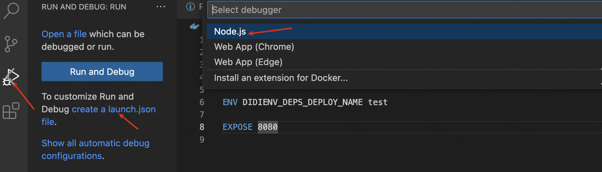

[toc]

# webpack源码断点调试

webpack本身是一个Node.js应用，可以使用Node.js的调试器来调试



## 设置.vscode/launch.json 调试配置

```json
{
    "version": "0.2.0",
    "configurations": [
      {
        "type": "node",
        "request": "launch",
        "name": "Debug Webpack",
        // node安装目录
        "runtimeExecutable": "/Users/xxxxxx/.nvm/versions/node/v16.15.1/bin/node",
        "program": "${workspaceFolder}/node_modules/webpack/bin/webpack.js",
        // 执行参数
        "args": ["--config", "webpack.config.js", "--mode", "development"],
        // 启动node调试器
        "runtimeArgs": ["--inspect-brk"], 
        "sourceMaps": true,
        "cwd": "${workspaceFolder}"
      }
    ]
  }
```

## webpack源码配置

```json
{
    "version": "0.2.0",
    "configurations": [
        {
            "type": "node",
            "request": "launch",
            "name": "Debug Webpack",
            "runtimeExecutable": "/Users/xxxx/.nvm/versions/node/v16.15.1/bin/node",
            "program": "${workspaceFolder}/debug/start-debug.js"
            "runtimeArgs": ["--inspect-brk"]
        }
    ]
}
```


参考： 官网 https://code.visualstudio.com/docs/editor/debugging#_launch-configurations

