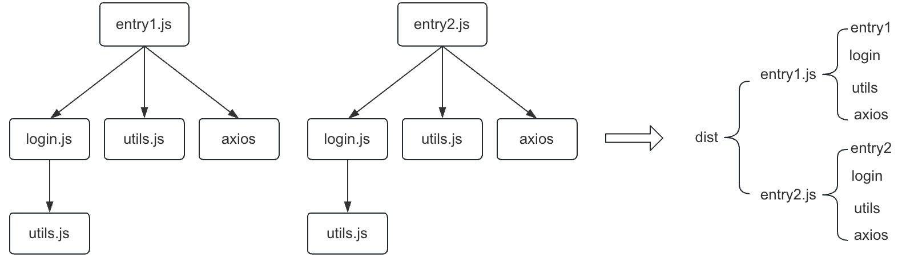
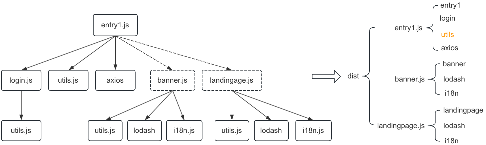
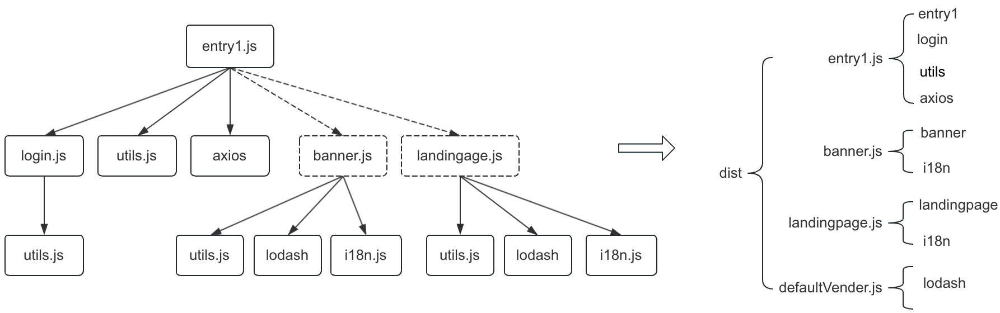

[toc]

# 代码分离

## 1.背景问题

启动项目时， 可能会存在下载的文件过大（2M以上），从而影响页面加载时长的情况

## 2.目标

+ 减少 http 请求次数，避免单个文件过大影响页面的响应速度 (拆包时尽量实现文件个数更少、单个文件体积更小)
+ 把更新频率低的代码和内容频繁变动的代码分离，把共用率较高的资源也拆出来，最大限度利用浏览器缓存

## 3.方案

https://webpack.docschina.org/guides/code-splitting/

### (1)入口起点：entry

使用entry配置手动低分离代码

```
module.exports = {
    entry: {
      entry1: './entry1.js',
      entry2: './entry2.js',
    }
}
```

适用场景： 多入口拆分

存在问题：



- 多入口 之间包含一些重复的模块，那么这些重复模块都会被引入到打包文件中
- 这种方法不够灵活，并且不能动态地拆分应用程序逻辑中的核心代码

### ()动态导入:import()

通过模块的内联函数([import()](https://webpack.docschina.org/api/module-methods/#import-1))调用分离代码


```js

import login from './login.js'
import utils from './utils.js'
import axios from '@didi/dajax'


console.log(login, utils, axios)

import(/* webpackChunkName: 'banner' */ './banner.js')
import(/* webpackChunkName: 'landingPage' */ './landingPage.js')

```

```JS

module.exports = {
    entry: {
      entry1: './debug/entry1.js'
    }

```

拆分效果：



适用场景：

- 路由懒加载：在使用路由进行页面切换时，可以使用动态导入来按需加载路由组件
- 条件加载：根据特定条件或用户交互，决定是否加载某些模块

存在问题：

- 多入口 之间包含一些重复的模块，那么这些重复模块都会被引入到打包文件中

### (2)防止重复:[`SplitChunksPlugin`](https://webpack.docschina.org/plugins/split-chunks-plugin) 

使用[`SplitChunksPlugin`](https://webpack.docschina.org/plugins/split-chunks-plugin) 去重和分离 chunk

webpack内置默认splitChunk配置：webpack-5.74.0/lib/config/defaults.js

```json
module.exports = {
  optimization: {
    splitChunks: {
      chunks: 'async', // 表示哪些代码块参与代码拆分，'initial':只会处理入口代码块；'async': 只会处理异步代码块；'all':所有的代码块
      minSize: 20000, // 规定一个分割后的代码块的最小大小，小于该大小的代码块可能不会被分割
      maxSize: 0, // 规定一个分割后的代码块的最大大小。默认为 0，表示没有大小限制
      minRemainingSize: 0,
      maxAsyncRequests: 30,
      maxInitialRequests: 30,
      enforceSizeThreshold: 30000,
      cacheGroups: {
        defaultVendors: {
          idHint:'vendors'
          test: /[\\/]node_modules[\\/]/, // 表示用于匹配模块的规则。可以是一个正则表达式、字符串、函数或条件语句。满足规则的模块将会被分割到该缓存组中
          priority: -10, // 表示匹配多个缓存组时的优先级。当一个模块满足多个缓存组的规则时，将根据优先级确定其归属的缓存组。数字越大，优先级越高。默认为 0
          reuseExistingChunk: true, // 表示是否复用已经存在的代码块。默认为 true，表示允许复用
        },
        default: {
          idHint:'',
          minChunks: 2, // 表示一个模块被引用的最小次数，满足次数的模块将会被分割到该缓存组中
          priority: -20,
          reuseExistingChunk: true,
        }
      },
      defaultSizeTypes: ['javascript', 'unknown'],
      usedExports:false
    }
  }
}
```

拆分效果：



疑问：

- 有minChunks: 2配置，为什么i18n未被提取？

  > i18n拆分代码块不符合minSize: 20000，小于该大小的代码块不会被分割

- 有test: /[\\/]node_modules[\\/]/配置，为什么axios未被提取？

  > chunks: 'async', 入口代码块不参与代码拆分

- lodash 即符合test: /[\\/]node_modules[\\/]/， 又符合minChunks: 2，为什么会被执行defaultVender中？

  >由于优先级priority: -10。当一个模块满足多个缓存组的规则时，将根据优先级确定其归属的缓存组。数字越大，优先级越高


[优化方法]

可以改变包的拆分方式， 比如把拆分由按照异步组件拆分，改为入口处全部文件拆分， 比如可以改变包拆分的规则和优先级