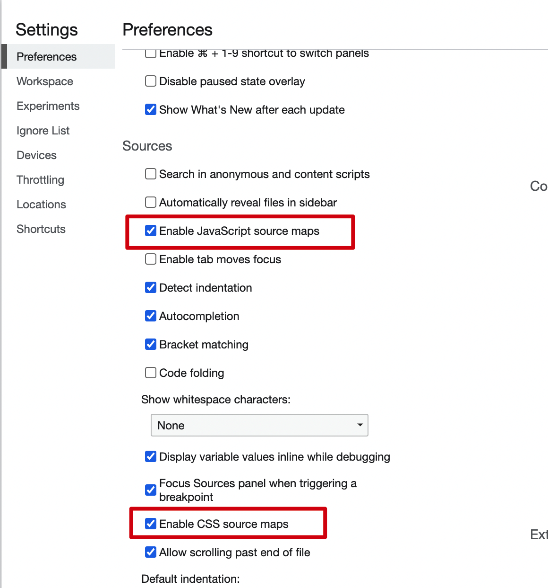

[toc]

# webpack 原理

## webpack构建原理

https://developer.aliyun.com/article/61047

https://juejin.cn/post/6844904094281236487

+ 初始化参数：将webpack.config.js里的参数与脚本文件里的参数合并为最终参数options

  ```js
  这里options的生成具体分为几个步骤：
  1.命令行输入webpack --hot -w
  2.命令行输入webpack后就会调用./node_modules/.bin/webpack这个shell脚本，这个脚本可以使用optimist，通过optimist，可以获取到node命令行的参数并保存起来，如下：
  {
    hot: true,
    profile: false,
    watch: true,
    ...
  }
  3.生成options参数对象，这个对象中拷贝有webpack.config.js的所有内容，然后再根据optimist获取到的参数进行判断，加载哪些webpack.config.js中配置的plugins，比如有hot，那么才去加载"../lib/HotModuleReplacementPlugin"插件
  ```

+ 开始编译：用options参数初始化 Compiler 对象，加载 Plugin，执行对象的 run 方法开始执行编译与构建流程

  ```
  compile.run事件构建出Compilation对象，包含了每个构建环节及输出环节所对应的方法
  ```

+ 确定入口：通过options（也就是webpack.config.js的entry）确定所有入口文件

+ 编译模块：从入口文件出发，调用所有配置的 Loader 对模块进行翻译（通过抽象语法树），再找出该模块依赖的模块，然后得到了每个模块被翻译后的最终内容（每个模块都有build方法进行构建，build里就包含AST分析）以及它们之间的依赖关系

+ 打包输出：根据入口和模块之间的依赖关系，组装成一个个包含多个模块的 Chunk，再把每个 Chunk 转换成一个单独的文件加入到输出列表，这步是可以修改输出内容的最后机会

+ 输出完成：在确定好输出内容后，根据配置确定输出的路径和文件名，把文件内容写入到文件系统

​	简略版

```js
初始化：启动构建，读取与合并配置参数，加载 Plugin，实例化 Compiler
编译：从 Entry 出发，针对每个 Module 串行调用对应的 Loader 去翻译文件的内容，再找到该 Module 依赖的 Module，递归地进行编译处理
输出：将编译后的 Module 组合成 Chunk，将 Chunk 转换成文件，输出到文件系统中
```

## 手写plugin

## 使用方法

+ Webpack.config.js

```
const HelloWorldPlugin = require('./plugins/basic.js')
...
plugins: [
		...
		new HelloWorldPlugin({ a: 1 }),
	]
```

+ 自己编写的plugin

```js
class HelloWorldPlugin {
  constructor(options) {
    console.log(options)
  }

  apply(compiler) {
    compiler.hooks.done.tap('HelloWorldPlugin', compilation => {
      console.log('helllo world!!!!')
    })
  }
}

module.exports = HelloWorldPlugin
```

+ 结果，运行npm run webpack的过程中，打印出{ a: 1 }和helllo world!!!!
+ 参数说明

```
1.plugin本质上是一个类，有apply方法，接收compiler参数，compilercompiler对象包含了 Webpack 环境所有的的配置信息,提供了很多钩子函数，在webpack运行的各个阶段插入自己的处理
2.options可以得到插件传入的自定义参数
3.compilation.assets是
```

另一个例子，把文件名称写入到文件中，并打包到dist(https://juejin.cn/post/6888936770692448270#heading-9)

```js
class FileListPlugin {
  apply (compiler) {
    compiler.hooks.emit.tapAsync('FileListPlugin', (compilation, callback) => {
      var filelist = 'In this build:\n\n';
      // 遍历所有编译过的资源文件，
      // 对于每个文件名称，都添加一行内容。
      for (var filename in compilation.assets) {
        filelist += '- ' + filename + '\n';
      }
      // 将这个列表作为一个新的文件资源，插入到 webpack 构建中：
      compilation.assets['filelist.md'] = {
        source: function () {
          return filelist;
        },
        size: function () {
          return filelist.length;
        }
      };
      callback();
    })
  }
}

module.exports = FileListPlugin;
```

## 手写loader

将文件从一种形式转换为另一种形式

```
 module: {
        rules: [{
            test: /\.js$/,
            use: [{
                loader: path.resolve('src/js/test.js')
            }],
        }]
    },
```

然后在自己写的test.js内部，使用source接收, 然后做一些转换处理

```js
module.exports = function (source) {
  const regExp = new RegExp("love", "ig")
  const result = source.replace(regExp, "*")
  return result
}
```

# sourceMap

参考资料：阮一峰http://www.ruanyifeng.com/blog/2013/01/javascript_source_map.html

## 为什么需要使用sourceMap

JavaScript脚本正变得越来越复杂。大部分源码（尤其是各种函数库和框架）都要经过转换，才能投入生产环境。转换的原因可能是

```
（1）压缩，减小体积。比如jQuery 1.9的源码，压缩前是252KB，压缩后是32KB。
（2）多个文件合并，减少HTTP请求数。
（3）其他语言编译成JavaScript。最常见的例子就是CoffeeScript。
```

这三种情况，都使得实际运行的代码不同于开发代码，除错（debug）变得困难重重。

通常，JavaScript的解释器会告诉你，第几行第几列代码出错。但是，这对于转换后的代码毫无用处。

Source map可以解决这个问题

> 简单说，Source map就是一个信息文件，里面储存着位置信息。也就是说，转换后的代码的每一个位置，所对应的转换前的位置。有了它，出错的时候，除错工具将直接显示原始代码，而不是转换后的代码。

目前，暂时只有Chrome浏览器支持这个功能。在Developer Tools的Setting设置中。



在混淆后的源文件最后有标识map文件的地址，map文件如下格式：

```
....
/*# sourceMappingURL=app.9b048ef726300e989a01e54ad2734883.css.map */
```

```json
{"version":3,"sources":["app.9b048ef726300e989a01e54ad2734883.css"],"names":[],"mappings":"AAeA,wCACE,eACF,CACA,oBACE,oBAAqB,CACrB,SACF,CACA,oBACE,oBAAqB,CACrB,aACF,CACA,mBACE,aACF","file":"app.9b048ef726300e989a01e54ad2734883.css","sourcesContent":["\n\n\n\n\n\n\n\n\n\n\n\n\n\n\nh1[data-v-97c374ba], h2[data-v-97c374ba] {\n  font-weight: normal;\n}\nul[data-v-97c374ba] {\n  list-style-type: none;\n  padding: 0;\n}\nli[data-v-97c374ba] {\n  display: inline-block;\n  margin: 0 10px;\n}\na[data-v-97c374ba] {\n  color: #42b983;\n}\n"]}
```

## 如何生成sourceMap文件

在webpack的output中进行配置,默认vue配置的是

```
// dev
devtool: 'cheap-module-eval-source-map',
//production
productionSourceMap: true,
devtool: '#source-map',
```

+ source-map:生成单独的map文件，并指明名称与保存位置
+ eval: map关系在js的eval(...)中，不生成单独的map文件
+ eval-source-map: map关系在js的eval(...)中，map文件内嵌
+ Inline-source-map:map文件内嵌到js中
+ cheap-source-map:只有行信息，没有列信息

注意：

+ 开源项目也需要开源sourcemap文件，非开源文件不公开sourcemap文件
+ 开发环境一般使用：eval-source-map或者cheap-source-map,线上环境一版使用source-map

