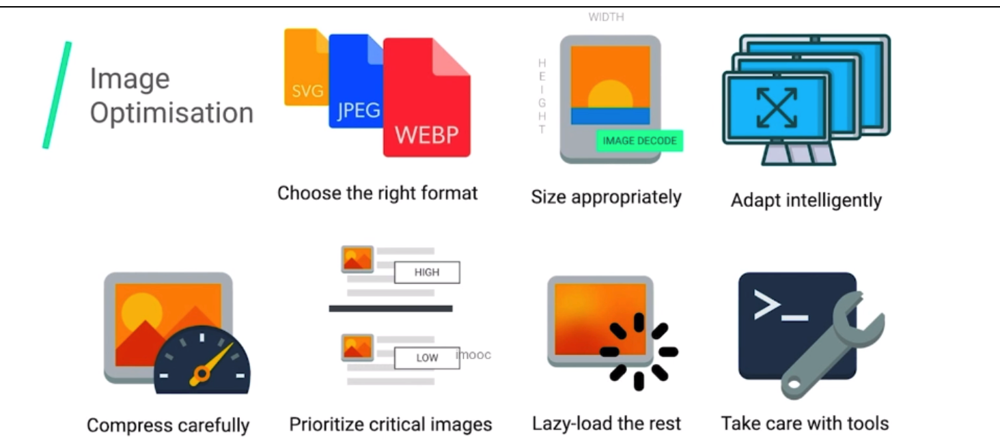

[toc]

# 资源的压缩与合并

## 1）为什么要压缩&合并

- 减少http请求数量
- 减少请求资源的大小

## 2）HTML压缩：

去除注释、空格等

- 使用在线工具进行压缩
- 使用html-minifier等npm工具

## 3）CSS压缩

+ 使用在线工具进行压缩
+ 使用clean-css等npm工具

## 4）JS压缩

- 在线JS压缩
- 使用webpack在构建时压缩

# css/js文件合并

+ 小文件的合并，减少请求次数

  

# 图片资源优化

## （1）图片优化的方案



+ 图片的格式选择
+ 图片的尺寸选择
+ 图片的自适应
+ 图片懒加载

## （2）图片格式的比较

+ jpg：有损的压缩，压缩比高且色彩还能保持的很好。web常用
  + 压缩工具[imagemin](https://github.com/imagemin/imagemin)，可以对jpg图片进行进一步的压缩
  + 缺点：压缩比较高，可能有锯齿和边缘（logo一般不用）

+ png：
  + 优点：
    + 可以做透明背景的图片
    + 对jpg的一些缺点进行弥补
  + 体积较jpg大
  + 常用来做小的图标
  + 压缩png：[imagequant](https://github.com/imagemin/imagemin-pngquant)

+ webp:
  + 有很多webp转换工具
  + 问题：可能有兼容性问题

说明：普通网站上面三种都差别不大，主要体现在大小的区别

## （3）图片加载优化

### 图片的懒加载

1. 原生的懒加载方案

   ```
   
   ```

   问题：

   1. 自定义和可扩展性不是特别好
   2. 需要浏览器支持

2. 第三方图片懒加载方案

   1. verlok/lazyload
   2. yall.js
   3. Blazy

### 使用渐进式格式

有的图片是一层一层加载出来的，有的是先从不清晰加载到清晰状态的，可以使用工具把图片转换为渐进式加载出来的效果，比如有imagemin工具

### 使用响应式图片

+ srcset的使用

  ```
  
  ```

+ size属性的使用

+ picture的使用

## 字体的优化

### 字体的问题

字体未下载完成时 ，浏览器隐藏或者自动降级,导致浏览器先隐藏字体对应的位置，再加载出所设置的字体，导致字体闪烁的效果，也就是FOIT（Flash of Invisible Text）

+ auto ，默认值，字体的加载过程由浏览器自行决定，不过基本上和取值为 block 时的处理方式一致。
+ block :隐藏字体--》备用字体--》自定义字体
+ swap ：后备字体--》自定义字体
+ fallback ：阻塞期很短（大约100毫秒），也就是说会有大约 100 毫秒的显示空白的后备字体，然后交换期也有时限（大约 3 秒），在这段时间内如果字体加载成功了就会替换成该字体，如果没有加载成功那么后续会一直使用后备字体渲染文本。
+ optional 。与 fallback 的阻塞期一致，但是没有交换期，如果在阻塞期的 100 毫秒内字体加载完成，那么会使用该字体，否则直接使用后备字体。这个就是说指定的网络字体是可有可无的，如果加载很快那么可以显示，加载稍微慢一点就不会显示了，适合网络情况不好的时候，例如移动网络。


```css
@font-face { 
  font-family: "Open Sans Regular"; 
  font-weight: 400;
  font-style: normal; 
  src: url("fonts/OpenSans-Regular-BasicLatin.woff2") format("woff2");
  font-display: swap; }
```

+ Unicode-range: 只加载常见的字体