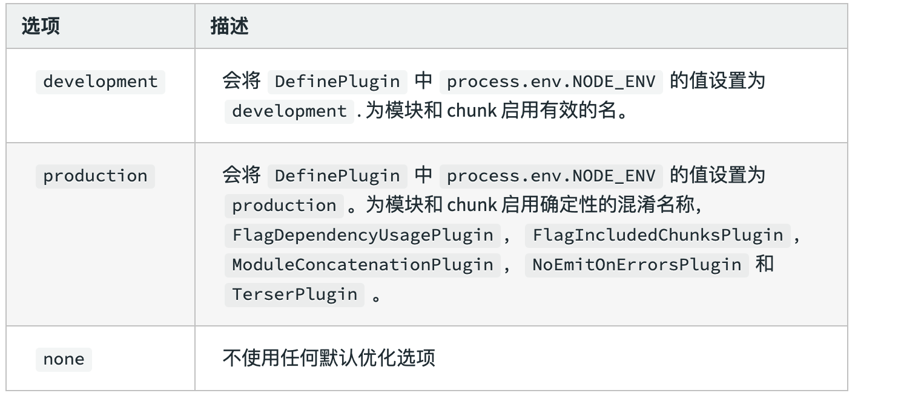
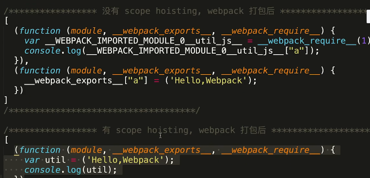

[toc]

# 配置优化

webpack提供了两种模式，production模式和dev模式，这两种模式默认已经启动了一些性能优化的方式




## 1.tree-shaking(pro)

pro环境自动启用

一种性能优化的方法，在webpack入口有很多依赖的文件，但是有很多文件是没有用的文件或者只用到了这些依赖的一部分模块，tree shaking可以帮助我们删除没有用的部分

（1）DCE消除

+ 删除不能执行的代码
+ 删除代码结果没有被使用到的代码
+ 删除只会影响死变量的代码（let a=1,但是a没有被使用）

消除的原理：抽象语法树

（2）js里的DCE

需要在js到达浏览器之前，由uglify来完成，但是uglify无法跨文件执行

（3）tree shaking消除法

更关注于无用模块的消除，消除那些引用了但并没有被使用的模块（有的代码是生产环境不会执行的代码，比如提示信息）

消除原理：依赖于ES6的模块特性，因为ES module，只能作为模块顶层的语句出现，而且import 的模块名只能是字符串常量，所以可以提前知道模块之间的依赖关系，然后做静态分析, tree shaking就是当我们在项目中引入其他模块时，他会自动将我们用不到的代码，或者永远不会执行的代码摇掉，在Uglify阶段查出，不打包到bundle中。

+ 注意，它<font color="red">基于ES6的import export机制</font>

配置注意项

```json
//bable里必须开启module的机制，在bable.config.js里需要配置
//表示 ECMAScript模块不需要首先转换为CommonJS模块
{
  presets: [["es2015", { "modules": false }]]
}
```

+ <font color="red">sideEffects配置</font>

  在package.json中配置，哪些文件不可以被摇掉

  ```js
  //表示css文件不可以被摇掉
  "sideEffects": [
    "*.css"
   ]
  ```

  对于在js里引入的css全局文件，不配置的话默认会被摇掉

  ```js
  import "./styles/reset.css"
  ```

  也可以在webpack里去做配置

  ```js
  // webpack.config.js
  module.exports = {
    // ...
      module: {
      rules: [
        {
          test: /\.css$/i,
          use: ["style-loader", "css-loader"],
          sideEffects: true //true表示不可以被摇掉
        }
      ]
    },
  };
  ```


## 2.terser-webpack-plugin(pro)

减小js文件体积，生产环境默认引入

+ webpack4后引入了unglifyjs-webpack-plugin
+ 支持es6替换为terser-webpack-plugin

uglify消除

原理：把原代码解析为AST，然后压缩为更小的AST，再还原出代码，从而优化，需要在js到达浏览器之前，由uglify来完成，但是uglify无法跨文件执行

## 3.作用域提升（pro）

作用域提升可以把代码尽量做一个合并，这样可以减小代码体积，执行效率也会更高，这里要注意babel的`modules:false`的配置，因为所有的这些也是要基于es6的import，export的语法，在生产模式中webpack会自动帮我们做一个作用域提升。



## 4.bable的配置优化（按需引入polyfill）

在webpack中，babel只能转换新的语法，如将es6转为es5，jsx转为js等，但但是无法处理新的api，如promise等，这时候就需要依赖babel-polyfill，但是可能会把所有polyfill引入，所以需要进行按需引入(babel-plugin-transform-runtime完成),减小文件的体积。

```
//配置babel.config.js，使用babel-polyfill
preset: [
    ["@babel/preset-env", {
       "targets": {
          "chrome": "70",
          "ie": "11"
        },
        useBuiltIns: "usage"'
        corejs: 3.8
    }]
]


```

useBuiltIns有三个属性值

+ false : 打包的文件不需要polyfill来进行适配

+ usage : 根据源代码中出现的语言特性，自动检测所需要的polyfill，设置corejs属性来确定使用corejs的版本

+ entry : 当我们依赖的某个库本身就用了polyfill，如果使用usage可能会导致浏览器报错，这时候就可以使用entry，并且入口文件处添加

```
import ‘core-js/stable’;
import 'regenerator-runtime/runtime';
```

targets: 兼容哪些浏览器

+ <font color="red">babel-plugin-transform-runtime</font>

  ```
  //.babelrc 里配置
  plugins:["tranform-runtime"]
  ```

  

# webpack构建优化

提高webpack本身的构建速度，使得webpack的打包速度更快

## noParse

希望哪些库不进行解析: 模块化了的文件必须被解析，而那些没有模块化的文件不需要被解析，或者说，尽量不要被解析。

这些库的特点：比较大、独立、甚至没有使用模块化的方法,比如lodash就不需要进行解析

```json
//webpack.config.js

module.exports = {
    module:{
        noParse:/lodash/,      
        rules:[]
    }
}
```

## DLLPlugin

https://blog.csdn.net/riddle1981/article/details/114345250

Dynamic Link Library的缩写,动态链接库

避免打包时对一些不变的库进行重复的构建，比如vue库，可以构建一次，然后之后直接引用

+ 生成dll文件
+ 生成dll的描述文件
+ 引用

配置方法：

```js
const path = require('path')
const webpack = require('webpack')
const { CleanWebpackPlugin } = require('clean-webpack-plugin')

// dll文件存放的目录
const dllPath = 'dll'

module.exports = {
  entry: {
    // 需要提取的库文件
    vendor: ['vue', 'vue-router', 'core-js']
  },
  output: {
    path: path.join(__dirname, dllPath),
    filename: '[name]-dll.[hash:8].js',
    // 这会将你的 library bundle 暴露为名为[name]_[hash]的全局变量
    // 保持与 webpack.DllPlugin 插件配置中name名称一致
    library: '[name]_[hash]'
  },
  plugins: [
    // 清除之前的dll文件
    new CleanWebpackPlugin(),
    // 该插件为webpack自带插件无需单独引用
    // 设置环境变量
    new webpack.DefinePlugin({
      'process.env': {
        NODE_ENV: JSON.stringify('production')
      }
    }),
    // manifest.json 描述动态链接库包含了哪些内容
    new webpack.DllPlugin({
      path: path.join(__dirname, dllPath, '[name]-manifest.json'),
      // 这里的name需要保持与 output.library中名称一致
      name: '[name]_[hash]',
      context: process.cwd()
    })
  ]
}
```

生成dll文件以及描述文件

```js
//package.json
"dll": "webpack --progress --config ./build/webpack.dllconf.js"
```

引用dll文件,使得构建过程中可以找到描述文件

```js
 new webpack.DllReferencePlugin({
     context: process.cwd(),
     manifest: require('./build/dll/vendor-manifest.json')
}),
```

动态库文件还需要注入进index.html

```js
const AddAssetHtmlPlugin = require('add-asset-html-webpack-plugin')

new AddAssetHtmlPlugin({
    // dll文件位置
    filepath: path.resolve(__dirname, './build/dll/*.js'),
    // dll 引用路径
    publicPath: './vendor',
    // dll最终输出的目录
    outputPath: './vendor'
 })
```

# 资源压缩

+ js压缩terser, 原理： AST树优化
+ css压缩：
  + mini-css-extract-plugin： 提取css，把写在style等的样式提取出来
  + optimize-css-assets-[webpack](https://so.csdn.net/so/search?q=webpack&spm=1001.2101.3001.7020)-plugin压缩css
+ html压缩：HtnlWebpackPlugin不仅可以压缩HTML代码（去除空格注释等），还可以自动帮我们生产模板文件，在生产环境下自动开启压缩

