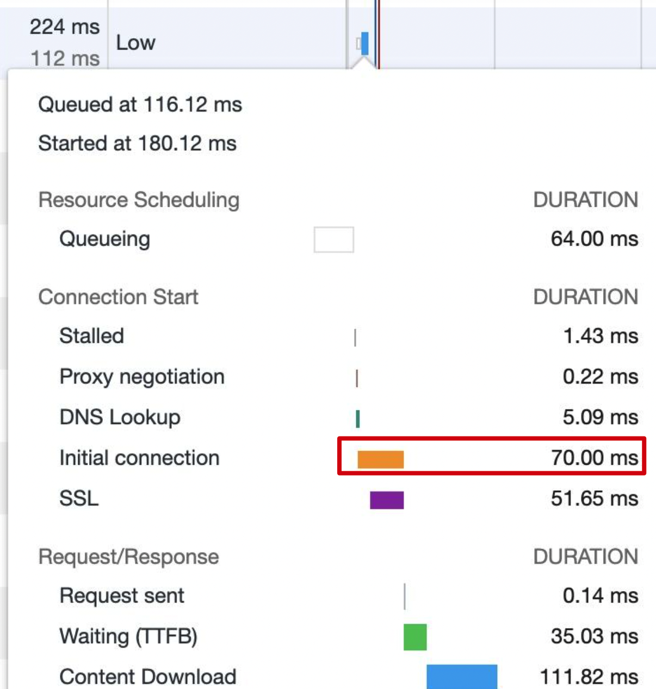
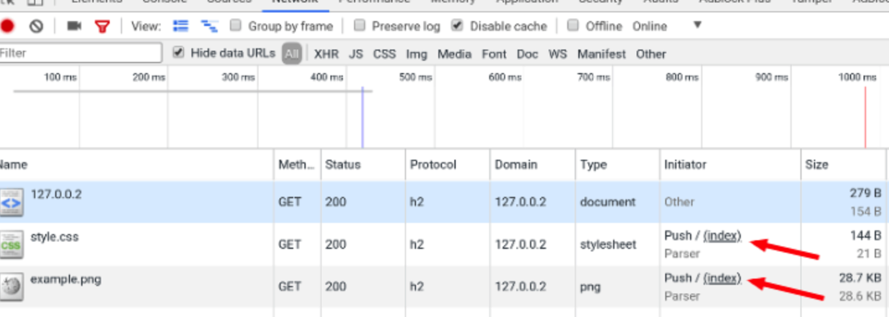

[toc]

传输加载优化：解决搞访问量网站的性能问题

## 1.keep-alive

Keep-alive开启，表示要复用TCP连接，减少由于TCP连接所导致的时间，图中的initial connection就是TCP连接时间



+ 判断是否开启了keep-alive

  ```
  请求的response Header里有一个
  connection: keep-alive表示了开启
  ```

+ ngnix相关配置

  ```js
  keepalive_timeout：65
  //为0表示没有开启，为65表示TCP连接可以持续65秒
  keepalive_requests: 100;
  //表示TCP连接最多只可以支持100个请求
  ```

## 2.Gzip

动态压缩技术，一般不用于压缩图片，图片压缩效果不是太好，而且压缩也会导致耗时

+ ngnix配置, [nginx](https://so.csdn.net/so/search?q=nginx&spm=1001.2101.3001.7020) 的 gzip ，可以分为两种：
  1. nginx 动态压缩，对每个请求先压缩再输出。
  2. nginx 静态压缩，使用现成的扩展名为 .gz 的预压缩文件。

https://blog.csdn.net/weixin_54931703/article/details/120814273

```js
gzip on | off;
//用于开启或者关闭Gzip 功能。默认为off,关闭
gzip_min_length 1k;
//文件最小为1k时，才开启压缩
gzip_comp_level 6;
//用于设定Gzip压缩程度,包括级别1到级别9。级别1表示压缩程度最低,压缩效率最高;级别9表示压缩程度最高，压缩效率最低，最费时间,所以可以设置一个中间的数值
gzip_types text/plain application/javascript text/css application/xml;
//默认为texthtml,在 gzip指令设置为on时Nginx服务器会对所有的text/html类型页面数据进行Gzip压缩。变量还可以取“*”，表示对所有MIME类型的页面数据进行Gzip压缩
gzip_vary on
//该指令用于设置在使用Gzip功能时是否发送带有“Vary: Accept-Encoding”头域的响应头部。该头域的主要功能是告诉接收方发送的数据经过了压缩处理。开启后的效果是在响应头部添加了Accept-Encoding: gzip，这对于本身不支持Gzip压缩的客户端浏览器是有用的。
gzip_buffers 4 16k;
//number   指定Nginx服务器需要向系统申请缓存空间的个数。size     指定每个缓存空间的大小,
gzip http version 1.1;
//针对不同种类客户端发起的请求，可以选择性地开启和关闭Gzip功能。默认设置为1.1版本，即只有客户端使用1.1及以上版本的HTTP协议时，才使用Gzip 功能对响应输出数据进行压缩。
gzip_static on;
//首先尝试使用静态压缩，如果有则返回 .gz 的预压缩文件，否则尝试动态压缩。（需要使用 ngx_http_gzip_static_module 模块）
```

## 3.HTTP缓存

+ 提高重复访问时资源的加载速度

```
cache-control/expires
last-modified+if-modified-since
etag+if-none-match
```

+ ngnix缓存配置

  ```json
  //对html/htm不进行缓存，每次请求重新请求服务器, 协商缓存
  // 多种设置方法是为了兼容老浏览器
  if ($request_filename ~* .*\.(htm|html)$)
  {
    add_header "Cache-Control" "no-cache must-revalidate";
    add_header "Pragma" "no-cache";
    add_header "Expires" "0"
  }
  ```

  ```
  //设置过期时间
  if ($request_filename ~* .*\.(?:js|css)$)
  {
    expires: 7d
  }
  ```

+ 几个网站的配置

  ```
  cache-control: max-age=0
  cache-control: private must-revalidate no-store
  //private 只能在浏览器中缓存
  ```

## 4.service workers

+ 加速重复访问、离线支持
+ 首屏加载时间会变长，但是页面总加载时间减少
+ 需要考虑兼容性
+ <font color="red">只能在localhost或者https下使用</font>
+ 如果采用了service workers,那么请求中会显示

## 5.HTTP2

+ 头部压缩
+ 二进制传输
+ 多路复用（HTTP1.1必须等待一个请求结束并且返回后才能发起下一个请求，HTTP2可以不需要等上一个请求返回结果就发起下一个请求）
+ 服务端推送

### HTTPS配置

http2必须在https下才能使用

+ https生成证书（一般需要购买，可以生成自签名证书）

+ 配置证书

  ```
  ssl                      on;
  ssl_certificate          /etc/nginx/certs/example.crt;
  ssl_certificate_key      /etc/nginx/certs/example.key;
  
  ssl_session_timeout  5m;
  
  ssl_ciphers HIGH:!aNULL:!MD5;
  ssl_protocols SSLv3 TLSv1 TLSv1.1 TLSv1.2;
  ```

如果页面由于使用了https而显示无法加载，可以直接在键盘上输入

```
thisisunsafe
```

就可以忽略安全配置直接显示页面

### 服务端推送配置

服务端http2推送图片

```json
location /{
  root /User/xxx
  index index.html
  #http2_push  /img/img0.jpg
}
```

此时在浏览器的请求调试里initial显示为push



## 6.SSR

服务端渲染

+ 首屏加载速度提高
+ 更好的SEO
