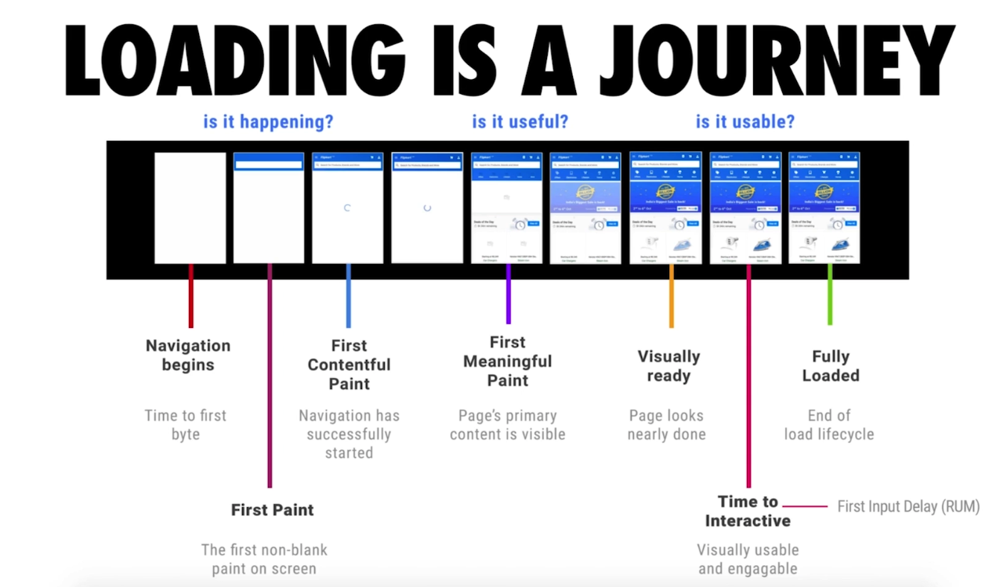
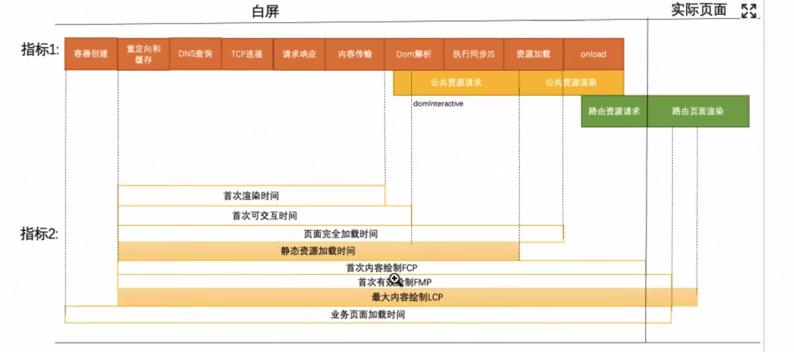
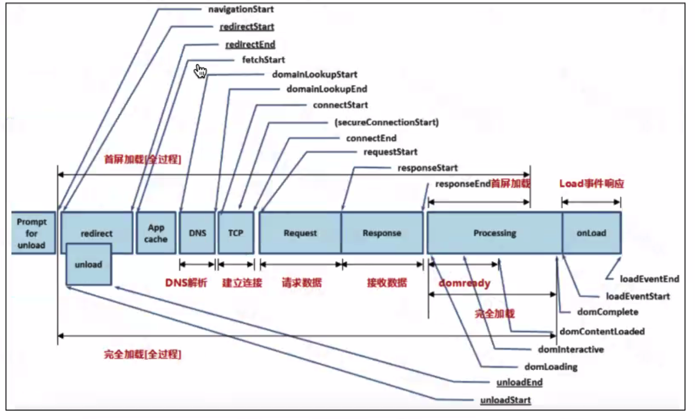

[toc]

# 性能优化指标

- FT(first paint):首屏加载时间，如果这个时间长，是因为资源加载慢

- FCP(first contentfull paint):首屏内容加载时间

- DCL(DOM contentLoaded):DOM内容加载时间

- LCP(Largest contentfull paint):最大内容加载时间，是自动来计算的，计算最大块的元素的加载时间，是不那么可靠的指标

- L(Load) 加载时间，则是渲染慢

  

+ FMP(`First Meaningful Paint`)：首次有意义的加载时间，可以我们自己定义在什么位置window.performance.mark(nameEnd)打点计算

## 性能优化检测工具

- chrome的performance Dev

  ```
  chrome的performance工具，开始录制，获取结果，在timing可以看到各个性能指标所需的时间
  ```

  

- chrome的lighthouse,可以分析网页性能，并给出修改的意见

  



# 首屏渲染


## 对于hybrid: 

+ 无反馈阶段：webview初始化阶段
+ 白屏阶段：进行模版的下载和解析
+ loading阶段：请求公共静态资源，请求公共的接口，请求页面的静态资源
+ 静态页面：根据接口和静态资源，渲染静态页面（首次内容渲染）
+ 请求页面接口， 进行动态页面的渲染（最大内容加载，首次有意义的内容加载）

## 小程序

+ 无反馈阶段：运行环境加载
+ Loading阶段：代码包的准备和前端框架的初始化， 视图层和逻辑层代码注入

## 小程序的性能优化
懒加载、减少setData的次数和不必要的setData，列表渲染的时候加上key，合理使用缓存，合理利用事件通信等等。