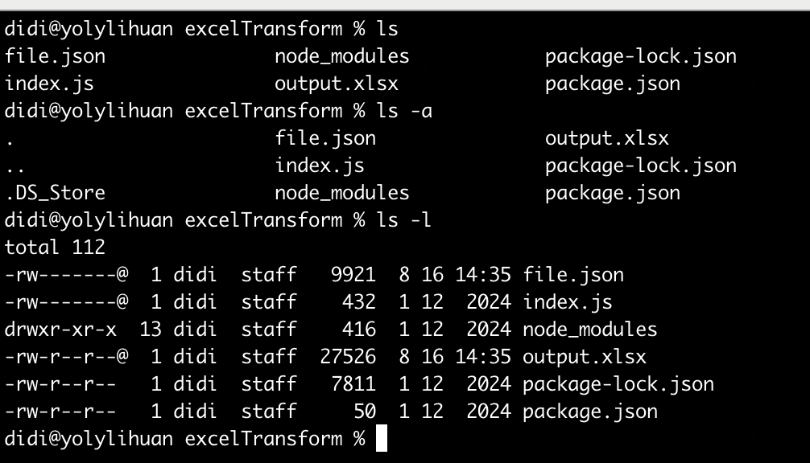

[toc]

# 机器操作场景命令

## 登录机器

```
ssh work@192.XXX.XX.XX
```

## 查看文件夹

```js
// 查看目录下的文件
ls 
// 查看目录下的文件，包括隐藏文件
ls -a
// 查看目录下文件的详细信息
ll 或者 ls -l
```



## 新建文件夹

```js
mkdir XXX
```

## 新建文件

```js
// 新建a.js
touch a.js
// 新建b.js并使用vim打开
vim b.js
```

## 编辑文件

```js
// 使用vim编辑器打开a.js
vi a.js
// 输入模式
点击键盘上i进入输入模式
// 保存写入
esc先退出输入模式， 再输入:w表示写入
// 退出
esc先退出输入模式， 再输入:q表示写入
```

## 查看文件

```js
// 查看文件
cat xxx
// 查看文件头部
head xxx
// 查看文件尾部
tail xxx
```

## 删除文件

```js
// -rf是指强制遍历文件夹下所有文件进行删除
rm -rf xxx
// 单独的文件删除可以不使用-rf
rm XXX
```

## 移动文件

```js
 mv output.xlsx test/output1.xlsx
```

## 文件重命名

```js
// 实际上就是移动文件
mv output1.xlsx output.xlsx
```

## 复制文件

```
cp output.xlsx  output2.xlsx
```

## 搜索文件内容

```
grep require index.js
```


# curl命令

测试连接的命令，支持文件的上传和下载

## **通过-o/-O选项保存下载的文件到指定的文件中**

-o：将文件保存为命令行中指定的文件名的文件中
-O：使用URL中默认的文件名保存文件到本地

```
# 将文件下载到本地并命名为mygettext.html
curl -o mygettext.html http://www.gnu.org/software/gettext/manual/gettext.html
```

## 传递请求信息

```js
# GET
curl -u username https://api.github.com/user?access_token=XXXXXXXXXX
# POST
curl -u username --data "param1=value1&param2=value" https://api.github.com
```

