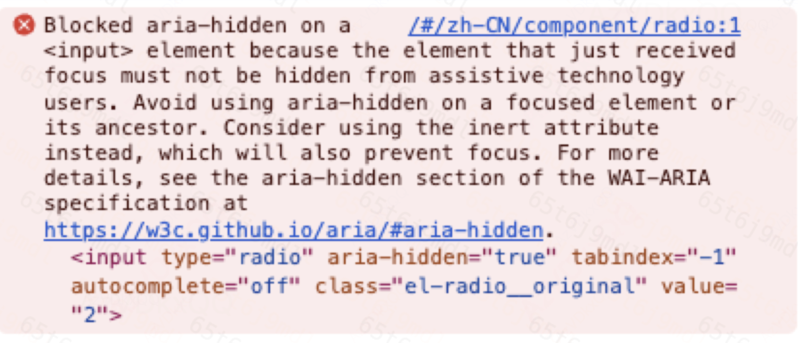
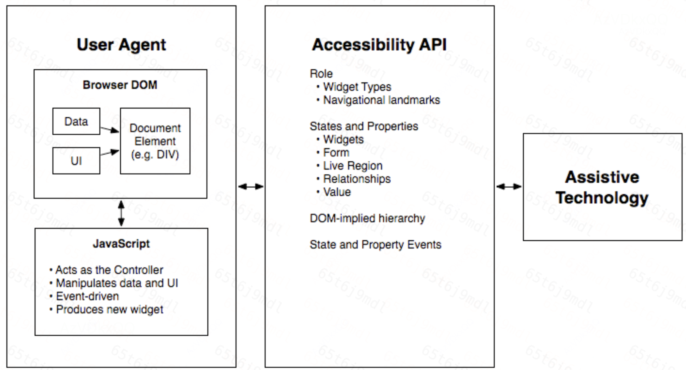

# 一、报错

新版浏览器的 element UI的radio有以下报错，ant-design的model组件也出现类似报错。翻译过来的意思是 “被<input>元素的aria-hidden阻塞，因为处于焦点的元素不能对辅助技术用户隐藏，避免在焦点元素或其祖先上使用aria-hidden， 应该考虑使用阻止获得焦点的惰性属性（简单理解， `inert`是 HTMLElement 的一个布尔属性，可以禁用一切交互，包括鼠标点击、选中、拖拽、键盘操作等等）， 详细信息请参阅https://w3c.github.io/aria/#aria-hidden的WAI-ARIA”



# 

# 二、什么是WAI-ARIA

无障碍的网页应用技术（Web Accessibility Initiative - Accessible Rich Internet Applications）是为了便于辅助技术能够向残障人士传达适当的信息， 它也是一项技术规范，提供了一个框架来改善 Web 内容和应用程序的可访问性和互操作性， 一些编程语言如HTML是缺乏语义化的，因此需要使用WAI-ARIA技术以便于残障人士更容易理解，如图所示为用户代理（例如浏览器）、辅助功能API和辅助技术之间的关系， DOM （通常是HTML）在典型的MVC关系中充当数据模型和视图，而 JavaScript 通过操纵显示数据的样式和内容充当控制器。用户代理将相关信息传达给操作系统的辅助功能API，任何辅助技术（例如屏幕阅读器）都可以使用这些信息。



WAI-ARIA将语义分为[角色](https://w3c.github.io/aria/#dfn-role)（定义用户界面元素的类型）以及角色支持的[状态](https://w3c.github.io/aria/#dfn-state)和属性（aria-*属性）。作者需要在文档的生命周期内将[元素与](https://dom.spec.whatwg.org/#concept-element)WAI-ARIA角色以及适当的状态和属性关联起来，除非元素已经具有适当的隐式WAI-ARIA状态和属性语义[。](https://w3c.github.io/aria/#dfn-property)

角色： 

```
<li role="menuitem">Open file…</li>
```

状态和属性

```
<li role="menuitemcheckbox" aria-checked="true">Sort by Last Modified</li>
```

# 三、 aria-hidden报错原因

简单说： 由于新版本chrome浏览器规范的调整，不再允许aria-hidden=true

aria-hidden是WAI-ARIA中的状态和属性中的一种，当设置为时`true`，元素及其整个子树对于辅助技术都是隐藏[的](https://dom.spec.whatwg.org/#concept-element)，无论它是否可见地呈现。作者*可以*谨慎使用 aria-hidden对辅助技术隐藏可见内容，*但*前提是隐藏此内容的行为旨在通过删除冗余或无关内容来改善辅助技术用户的体验。使用 aria-hidden 隐藏可见内容的作者*必须*确保向辅助技术展示相同或等效的含义和功能。

组件库为什么使用aria-hidden=true？

例如弹窗场景，点击展示出弹窗后，通过键盘操作时，我们期望是只有弹窗中的元素能够获取焦点，但是实际上是弹窗外的元素也能获取焦点，为了优化交互，此时可以对弹窗外的元素使用aria-hidden=true或者inert ，可以保证键盘操作焦点只在弹窗内容中进行切换

例如上述的radio场景，el-radio组件的aria-hidden作用在input元素上, 但是这个元素实际上是隐藏不会展示出来的， 所以它获取焦点的时候对残障用户隐藏式出于优化交互的角度考虑的。

```
<input
          ref="radio"
          class="pb-radio__original"
          :value="label"  // 绑定值为父组件调用传来的label
          type="radio"
          aria-hidden="true"
          v-model="model"
          @focus="focus = true"
          @blur="focus = false"
          @change="handleChange"
          :name="name"
          :disabled="isDisabled"
          tabindex="-1"
          autocomplete="off"
        />
```

```
@include e(original) {
    opacity: 0;
    outline: none;
    position: absolute;
    z-index: -1;
    top: 0;
    left: 0;
    right: 0;
    bottom: 0;
    margin: 0;
  }
```


# 四、解决方法

参考ant-design和react的issue解法，直接删除了aria-hidden = true即可解决

[ant-design/ant-design#50170 (comment)](https://github.com/ant-design/ant-design/issues/50170#issuecomment-2263385601)
[react-component/dialog@df21b0e](https://github.com/react-component/dialog/commit/df21b0ebcc103bebf081242452a91d7524769b1e)


# 参考

https://blog.csdn.net/xiao_ju_ju/article/details/140763539

https://w3c.github.io/aria/#aria-hidden

https://segmentfault.com/a/1190000042595978?utm_source=sf-hot-article

https://www.jianshu.com/p/e295809af4b2