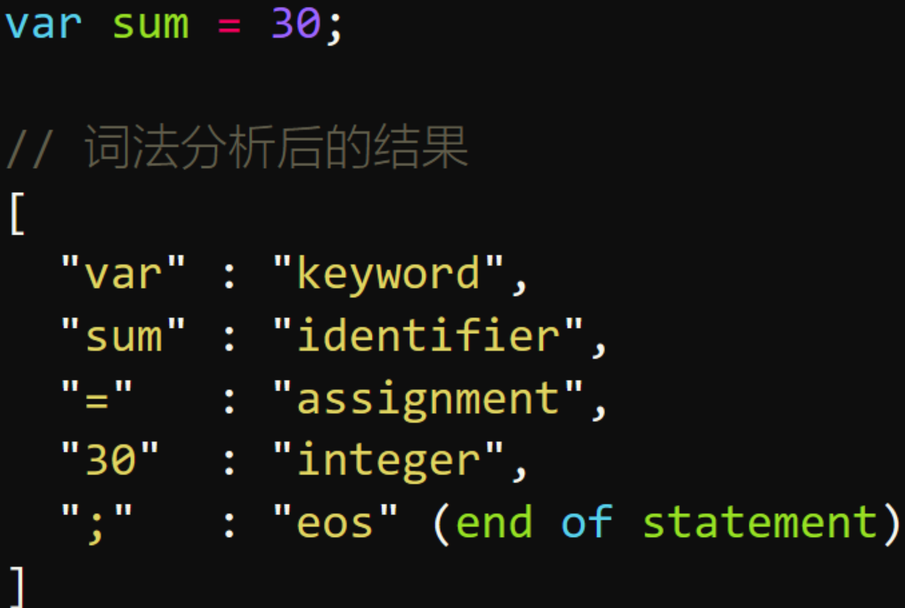
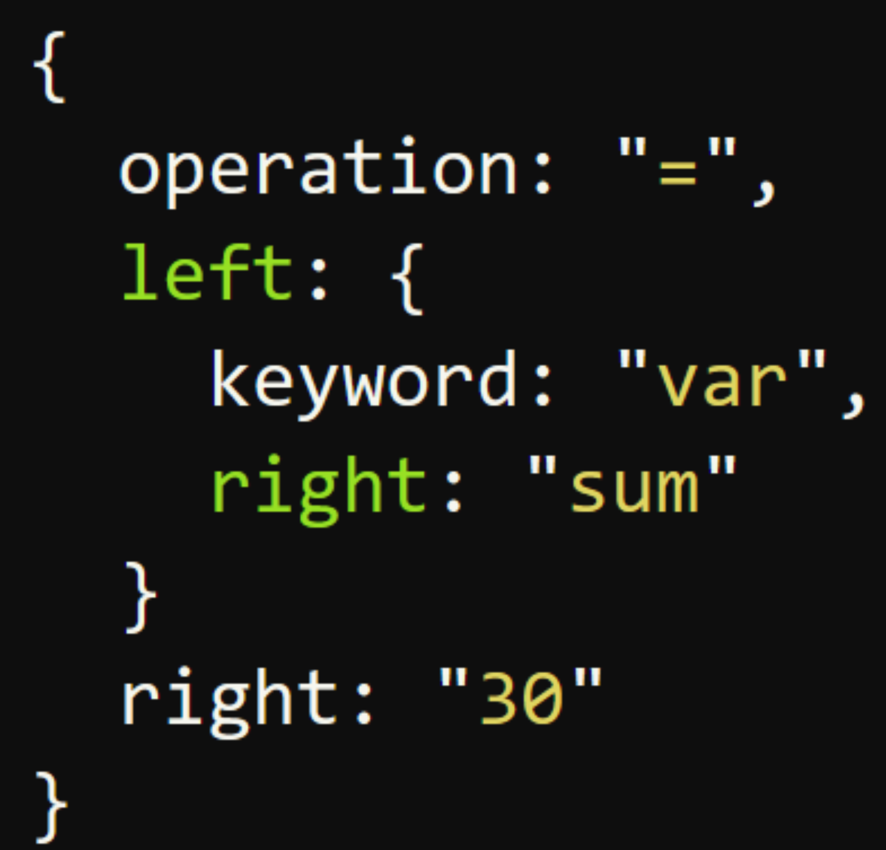

[toc]


js是解释型语言，所以它无需提前编译，而是由解释器实时运行

# 引擎对JS的处理原理

即时编译器将源码编译成机器码运行

+ 读取代码，进行词法分析，然后将代码分解成词元（token）



+ 对词元进行语法分析，然后将代码整理成抽象语法树(AST)



+ 使用翻译器（translator），将代码转为字节码（bytecode）

- 使用字节码解释器（bytecode interpreter），将字节码转为机器码

最终计算机执行的就是机器码。为了提高运行速度，，不同浏览器策略可能还不同，有的浏览器就省略了字节码的翻译步骤，直接转为机器码（如chrome的v8）

### JS的预处理阶段

在正式执行JS前，还会有一个预处理阶段

- 分号补全,如果不写分号在代码压缩为一行的时候可能会导致出错

```
function buquan(){
    return
    {
        'a':'a'
    }
}
//分号补全
function buquan(){
    return;
    {
        'a':'a'
    };
}
//结果为undefined
```

- 变量提升，在代码执行前先进行解析

```js
var a=9;
console.log(a)
var class='12'
```

```js
function fn(){
//var web 变量提升，在这里声明了，if语句还是起了作用
   if(false){
     var web='hh' 
   }
console.log(web)//undefined
}
```

### JS的执行阶段

- 1.执行上下文

```
JS有执行上下文
1.浏览器首次载入脚本，它将创建全局执行上下文，并压入执行栈栈顶（不可被弹出）
2.然后每进入其它作用域就创建对应的执行上下文并把它压入执行栈的顶部
3.一旦对应的上下文执行完毕，就从栈顶弹出，并将上下文控制权交给当前的栈。
这样依次执行（最终都会回到全局执行上下文）
```

每一个执行上下文，都有三个重要属性:

```
+ 变量对象(Variable object ， VO)
+ 作用域链(Scopechain)
+ this
```

- 2.VO（变量对象）和AO（活动对象）

```
VO中会存放一些变量信息（如声明的变量，函数， arguments参数等等
AO（ activationobject)，当函数被调用者激活，AO就被创建了。
```

- 3.作用域链
- 4.this this是执行上下文环境的一个属性，而不是某个变量对象的属性

### a.b.c.d 和 a['b']['c']['d']，哪个性能更高？

a.b.c.d 比 a['b']['c']['d'] 性能高点，后者还要考虑 [ ] 中是变量的情况，再者，从两种形式的结构来看，显然编译器解析前者要比后者容易些，自然也就快一点。

# 内存简介

内存是用来存放对象的空间与资源，V8引擎会给js，nodejs分配一块固定大小的内存区，mac约为1.4G， window约为0.8G，用来存储变量, 内存大小有限，当内存不够的时候，就发生了内存泄漏问题。

## 内存泄漏

内存泄漏对于内存非常有限的移动设备是非常重要的

### 场景与解决方法

#### 1.意外的全局变量

```js
function foo(arg) {
    bar = "this is a hidden global variable";
}
//或者this
function foo() {
    this.variable = "potential accidental global";
}
// foo 调用自己，this 指向了全局对象（window）
foo();
```

此时，全局变量挂载到了window下，只要window对象没有被清除，这些变量就一直存在

```
1.使用 'use strict'，可以避免此类错误发生
2.函数内部尽量使用let,const,不要使用全局变量
3.使用完之后手动设置为null或者undefined
```

#### 2.被遗忘的计时器或回调函数

如果id为Node的元素从DOM中移除，该定时器仍会存在，同时，因为回调函数中包含对someResource的引用，定时器外面的someResource也不会被释放。

```js
var someResource = getData();
setInterval(function() {
    var node = document.getElementById('Node');
    if(node) {
        // 处理 node 和 someResource
        node.innerHTML = JSON.stringify(someResource));
    }
}, 1000);
```

解决方法

```js
var someResource = getData();
var fn = function() {
    var node = document.getElementById('Node');
    if(node) {
        // 处理 node 和 someResource
        node.innerHTML = JSON.stringify(someResource));
    }
}
var timeCount = setInterval(fn, 1000);

if( timeCount){
   clearInterval(fn)
}
```

#### 3.闭包

name的引用一直存在

```js
let outer = function(){
  let name = "yoly"
  return function(){
    return name
  }
}
```

outer()的时候返回了一个函数，函数里有name的调用，所以outer的作用于一直存在，不会被销毁

#### 4.没有清理的DOM元素引用

有时，保存 DOM 节点内部数据结构很有用。
假如你想快速更新表格的几行内容，把每一行 DOM 存成字典（JSON 键值对）或者数组很有意义。此时，同样的 DOM 元素存在两个引用：一个在 DOM 树中，另一个在字典中。将来你决定删除这些行时，需要把两个引用都清除

```
var elements = {
    button: document.getElementById('button'),
    image: document.getElementById('image'),
    text: document.getElementById('text')
};
function doStuff() {
    image.src = 'http://some.url/image';
    button.click();
    console.log(text.innerHTML);
}
function removeButton() {
    document.body.removeChild(document.getElementById('button'));
    // 此时，仍旧存在一个全局的 #button 的引用
    // elements 字典。button 元素仍旧在内存中，不能被 GC 回收。
}
```

## vue中的场景

+ 组件销毁时全局变量、函数未清除
+ 自定义事件未清除
+ 被全局事件、计时器引用未清除  setInterval，clearInterval，addEventListener,removeEventListener
+ 解决方法，在beforeDestroy/beforeUnmount清除

### 识别方法

在chrome的performance中查看，如果是一直上升的，就存在内存泄漏，如果是周期性增加与减少就是正常在执行垃圾回收机制

## weakMap/weakSet

弱引用，也就是引用不计数，所以它们本身也没有size方法，不能用for...of遍历，因为它们不确定自己有多少个元素是可以获取到的,例如:当函数fn执行后，函数内部obj引用此时直接销毁，wMap不作为引用次数

```js
  const wMap = new WeakMap()
  function fn(){
    const obj = {name:'yoly'}
    wMap.set(obj,'Bob')
  }
  fn()
  console.log('wMap', wMap)
```

# v8的垃圾回收机制

### 性能

JS具有自动垃圾回收机制，也就是，执行环境会负责管理代码执行过程中使用的内存，哪个变量不再使用就释放它的内存，将内存占用保持在一个较小的值可以让页面性能更好，而且这个垃圾回收是一个周期性的过程，不是实时去搜集与清除的，因为js因为是单线程，垃圾回收会占用主线程，导致页面卡顿，所以需要一个算法进行垃圾回收

### 分代回收机制

垃圾回收分为新老生代，新生代存放的是存活时间比较短的对象，老生代存放的是存活时间比较长的对象。

#### 新生代

在新生代里有一个算法，将新生代分成了两个区，一个FORM,一个TO，刚开始变量先放在from区， 然后to区空闲， 然后第一次新生代垃圾回收， 会把依然存活的对象放到to区，from区清空， 然后from区变为to区， to区变为from区，循环反复。

新生代如何迁移到老生代

+ 经过from到to的转化过程， 证明对象存活时间是比较长的
+ to区内存超过25%，from区仍然有需要放到to区的旧直接放到老生代里去，因为to区过满的话，to区转化为from区，影响新的变量放到from区的内存分配

#### 老生代

而老生代，采用标记清除和标记整理，但标记清除会造成内存不连续，影响后续的内存分配，所以也会进行标记整理，把老生代里依旧存活的变量赋值到内存的左边，右边的删除，而且一次性进行老生代的垃圾回收，会占用进程，影响性能，所以现在也有一些措施进行分片处理，一段时间清理老生代的一部分

+ 引用计数

  刚开始一些浏览器所使用的垃圾回收方式，主要思路是

  ```
  跟踪记录每个值被引用的次数，引用次数为0，删除释放
  ```

  但是可能存在循环应用的情况，引用次数永远不为0，此时只能将存在循环饮用的值手动设置为null

+ 标记清除(常用)

  > 垃圾收集器在运行的时候会给存储在内存中的**所有变量**都加上标记（可以使用任何标记方式）。然后，它会去掉**环境中的变量以及被环境中的变量引用的变量的标记**。而在此之后再被加上标记的变量将被视为准备删除的变量，原因是环境中的变量已经无法访问到这些变量了。最后，垃圾收集器完成内存清除工作，销毁那些带标记的值并回收它们所占用的内存空间。

  垃圾回收会构建一个根列表，从根节点去访问那些变量，可访问到位活动，不可就是垃圾

  简单理解就是会执行完成之后把值类型的变量都删掉，然后对于引用类型，如果引用来一个被删掉的值，那么它本身就是应该被删掉的


## node的内存管理

浏览器环境分配给V8的内存一般情况下是足够使用的，但是node作为服务端可能存在内存不够的情况， node的内存分为堆内存（一般处理字符串相关），和额外内存（buffer等使用这部分内存）

### 常用命令

+ 查看内存使用情况

  ```
  node process memory
  ```

+ 设置新生代老生代的内存（刚开始就设置，后续无法动态更改）

  ```
  ```

+ 查看垃圾回收性能

  ```
  ```

  


