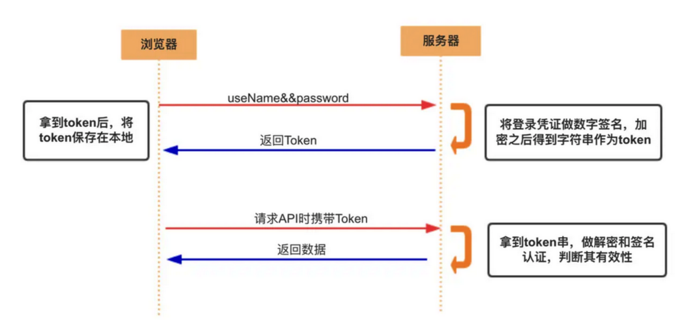
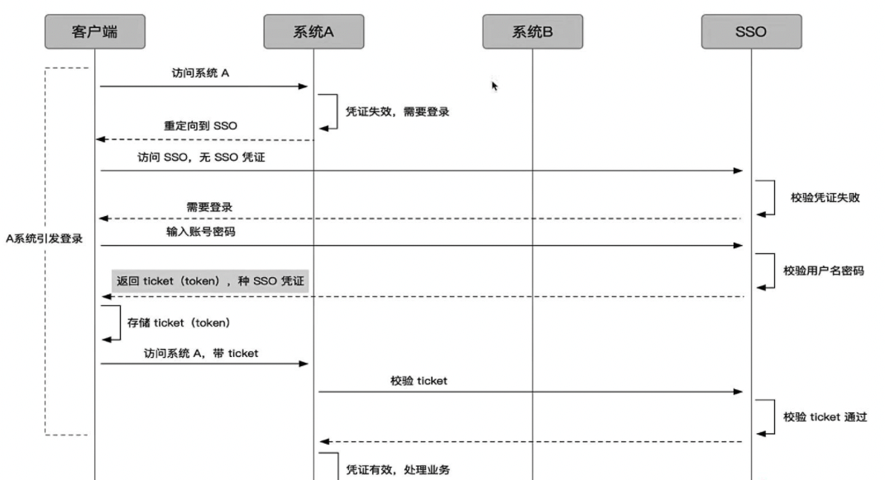

[toc]

# 浏览器缓存

## 原因

对于一个数据请求来说，可以分为发起网络请求、后端处理、浏览器响应三个步骤。浏览器缓存可以帮助我们在第一和第三步骤中优化性 能。比如说直接使用缓存而不发起请求，或者发起了请求但后端存储的数据和前端一致，那么就没有必要再将数据回传回来，这样就减少了 响应数据 （有缓存不发起请求，请求后内容一致就不再传输回来了）

- 优点

```
+ 减少冗余数据的传输
+ 提高页面的加载速度
```

为了解决HTTP协议无状态的这个缺点（无状态是指无法记住请求的状态，比如登录了一个网站，然后访问网站提交其他信息时，它无法判别你的身份，需要你每次都得带上自己的用户名密码才判别是否有资格发送请求）,本地存储可以协助进行身份认证

## 本地存储方式

### localStorage 和 sessionStorage 以及 cookie 的区别

| 比较     | cookie                     | localstorage               | sessionstorage                               |
| -------- | -------------------------- | -------------------------- | -------------------------------------------- |
| 生命周期 | expires/max-age            | 长期存储                   | 会话关闭消失                                 |
| 容量     | 4kb                        | 5M                         | 5M                                           |
| API      | 一般需要JSON.stringify     | 友好                       | 友好                                         |
| 跨域     | 在所有同源窗口中都是共享的 | 在所有同源窗口中都是共享的 | 不在不同的浏览器窗口中共享，即使是同一个页面 |

### 1.cookie

https://www.codenong.com/10570347/

cookie的使用大小限制

#### Cookie使用

- JS里

```
document.cookie='name:yoly'
```

- 服务端

```
setCookie来设置，要设置多个cookie时，得多写几个setCookie。
客户端会在请求头自动带上Cookies
```

+ 用法：
  + cookie可以用于本地存储，但是每次都携带同样的内容，请求时间会增加，存储现在还是更推荐localstorage和sessionstorage
  + cookie可用于身份认证的过程

#### cookie的属性


- name:cookie的名称
- value:需要进行编码处理
- domain:cookie生效的域名，二级域名可以使用一级域名cookie，但是不能使用三级域名的cookie

```
像淘宝首页设置的 Domain 就是 .taobao.com，这样无论是a.taobao.com还是b.taobao.com都可以使用 Cookie。
```

​      注意不能跨域设置cookie

```
//比如阿里域名下的页面把 Domain 设置成百度是无效的：
Set-Cookie: qwerty=219ffwef9w0f; Domain=baidu.com; Path=/; Expires=Wed, 30 Aug 2020 00:00:00 GMT
```

- path:cookie生效的路径，一般默认当前路径/，这个路径必须出现在要请求的资源的路径中才可以发送 Cookie 首部

```
比如设置Path=/docs，
/docs/Web/下的资源会带 Cookie 首部，
/test则不会携带 Cookie 首部。
```

- expires:cookie的过期时间

```
Set-Cookie: id=a3fWa; Expires=Wed, 21 Oct 2015 07:28:00 GMT;
缺省的时候，值为session,会话性缓存，值保存在客户端内存当中，浏览器关闭的时候失效
Expires=Wed, 21 Oct 2015 07:28:00 GMT;
保存在硬盘当中，直到过期的时候才会被清理，是持久性的缓存
Set-Cookie: id=a3fWa; Max-Age=604800;
表示还有多久失效，失效的秒数
// Max-Age 可以为正数、负数、甚至是 0。
当max-Age 属性为正数时，浏览器会将其持久化，即写到对应的 Cookie 文件中。
当 max-Age 属性为负数，则表示该 Cookie 只是一个会话性 Cookie。
当 max-Age 为 0 时，则会立即删除这个 Cookie。
假如 Expires 和 Max-Age 都存在，Max-Age 优先级更高。
```

- httpOnly:用户端不可更改，不能通过 JS 访问 Cookie，减少 XSS 攻击
- secure 只能在协议为 HTTPS 的请求中携带
- same-site规定浏览器不能在跨站请求中携带 Cookie，减少 CSRF 攻击

```
跨站与跨域区别
Cookie中的「同站」判断就比较宽松：只要两个 URL 的 eTLD+1 相同即可，不需要考虑协议和端口。其中，eTLD 表示有效顶级域名，注册于 Mozilla 维护的公共后缀列表（Public Suffix List）中，例如，.com、.co.uk、.github.io 等。eTLD+1 则表示，有效顶级域名+二级域名，例如taobao.com等。

举几个例子，www.taobao.com和www.baidu.com是跨站，www.a.taobao.com和www.b.taobao.com是同站，a.github.io和b.github.io是跨站(注意是跨站)。
Strict仅允许一方请求携带 Cookie，即浏览器将只发送相同站点请求的 Cookie，即当前网页 URL 与请求目标 URL 完全一致。
Lax允许部分第三方请求携带 Cookie
None无论是否跨站都会发送 Cookie

之前默认是 None 的，Chrome80 后默认是 Lax。
```

修改之后会影响

```
//跨域
Post表单，iframe跨站，AJAX，Image
```

**注意**

```
HTTP 接口不支持 SameSite=none,需要在https下
部分浏览器不能加 SameSite=none，需要提前检测
```

#### 作用

```
会话状态管理（如用户登录状态、购物车、游戏分数或其它需要记录的信息）
个性化设置（如用户自定义设置、主题等）
浏览器行为跟踪（如跟踪分析用户行为等）
性能优化
```

#### 优缺点

- 存储量太小，只有4kb
- 所有http请求都带着cookie,影响资源获取的效率
- API简单，需要封装才能满足不同的需求document.cookie=...

优化

- 在同域名的资源请求时，浏览器会默认带上本地的cookie，针对这种情况，在某些场景下是需要 优化的。

```
1.客户端在域名A下有cookie（这个可以是登陆时由服务端写入的）
2.然后在域名A下有一个页面，页面中有很多依赖的静态资源（都是域名A的，譬如有20个静态资源） 此时就有一个问题，页面加载，请求这些静态资源时，浏览器会默认带上cookie 也就是说，这20个静态资源的http请求，每一个都得带上cookie，而实际上静态资源并不需要cookie验证 此时就造成了较为严重的浪费，而且也降低了访问速度（因为内容更多了）
```

解决方案：多域名拆分

```
1.将静态资源分组，分别放到不同的子域名下 2.子域名请求时，是不会带上父级域名的cookie的，所以就避免了浪费
```

#### 如果浏览器中禁止了 Cookie

如何保障整个机制的正常运转。

```
1.请求URL携带，URL重写
xxx?SessionID=123456...
如果客户端支持Cookie，又通过URL重写，Tomcat仍然会解析Cookie中的SessionID并覆盖URL中的SessionID
2.Token与JWT
```

------

### 2.webstorage

（1）提供一种在cookie之外存储会话数据的路径。（2）提供一种存储大量可以跨会话存在的数据的机制。

#### localStorage

- 生命周期

```
可以为localstorage设置当前时间与设置过期时间，然后通过比较localstorage的时间决定是否删除，实现cookie短期存储
```

cookie在每次请求的时候将所有信息带入HTTP，但是有一部分是不需要的，比如样式文件，放在本地即可

#### session Storage

与localStorage相似，但是有生命周期，而且只要浏览器关闭，就会被清空，因此localStorage用的比较多

- 设置

> 添加：window.localStorage.setItem('name':'yoly')
> 查看：window.localStorage.getItem('name')
> 删除：window.localStorage.removeItem('name')

- 注意： window.localStorage.setItem('name':JSON.stringify({name:yoly}))

## 缓存位置

```
Service worker-->内存-->硬盘-->push cache-->发起请求
```

当依次查找缓存且都没有命中的时候，才会去请求网络。

### Service Worker

是运行在浏览器背后的独立线程，一般可以用来实现缓存功能。使用 Service Worker的话，传输协议必须为 HTTPS。因为 Service Worker 中涉及到请求拦截，所以必须使用 HTTPS 协议来保障安全。Service Worker 的缓存与浏览器其他内建的缓存机制不同，**它可以让我们自由控制缓存哪些文件、如何匹配缓存、如何读取缓存，并且缓存是持续性的。**

Service Worker 实现缓存功能一般分为三个步骤：首先需要先注册 Service Worker，然后监听到 install 事件以后就可以缓存需要的文件，那么在下次用户访问的时候就可以通过拦截请求的方式查询是否存在缓存，存在缓存的话就可以直接读取缓存文件，否则就去请求数据。

当 Service Worker 没有命中缓存的时候，我们需要去调用 fetch 函数获取数据。也就是说，如果我们没有在 Service Worker 命中缓存的话，会根据缓存查找优先级去查找数据。但是不管我们是从 Memory Cache 中还是从网络请求中获取的数据，浏览器都会显示我们是从 Service Worker 中获取的内容。

### Memory Cache内存

读取内存中的数据肯定比磁盘快,内存缓存虽然读取高效，可是缓存持续性很短，**会随着进程的释放而释放**。 一旦我们关闭 Tab 页面，内存中的缓存也就被释放了。

需要注意的事情是，内存缓存在缓存资源时**并不关心返回资源的HTTP缓存头Cache-Control是什么**值，同时资源的匹配也并非仅仅是对URL做匹配，还可能会对Content-Type，CORS等其他特征做校验。

### Disk Cache硬盘：

它**会根据 HTTP Herder 中的字段判断哪些资源需要缓存**，哪些资源可以不请求直接使用，哪些资源已经过期需要重新请求。并且即使在跨站点的情况下，相同地址的资源一旦被硬盘缓存下来，就不会再次去请求数据。绝大部分的缓存都来自 Disk Cache。

### Push Cache推送缓存：

当以上三种缓存都没有命中时，它才会被使用。它只在**会话**（Session）中存在，一旦会话结束就被释放，并且缓存时间也很短暂，在Chrome浏览器中只有5分钟左右，同时它也并非严格执行HTTP头中的缓存指令。


## 缓存策略

强缓存：不会向服务器发送请求，直接从缓存中读取资源，在chrome控制台的Network选项中可以看到该请求返回**200**的状态码，并且**Size显示from disk cache或from memory cache**强缓存可以通过设置两种 HTTP Header 实现：Expires 和 Cache-Control

### 强缓存

- **Expires**

缓存过期时间，用来指定资源到期的时间，是服务器端的具体的时间点。在响应http请求时告诉浏览器在过期时间前浏览器可以直接从浏览器缓存取数据，而无需再次请求。

Expires 是 HTTP/1 的产物，**受限于本地时间**，如果修改了本地时间，可能会造成缓存失效。Expires: Wed, 22 Oct 2018 08:41:00 GMT表示资源会在 Wed, 22 Oct 2018 08:41:00 GMT 后过期，需要再次请求。

- **Cache-Control**

Cache-Control 可以在请求头或者响应头中设置，并且可以组合使用多种指令：


> 客户端缓存内容，是否使用缓存则需要经过协商缓存来验证决定。表示不使用 Cache-Control的缓存控制方式做前置验证，而是**依然缓存，但要使用 Etag 或者Last-Modified字段来控制缓存**。需要注意的是，no-cache这个名字有一点误导。设置了no-cache之后，并不是说浏览器就不再缓存数据，只是浏览器在使用缓存数据时，需要先确认一下数据是否还跟服务器保持一致。

no-store：

> 所有内容都不会被缓存，即不使用强制缓存，也不使用协商缓存

### 协商缓存

Last-Modified和If-Modified-Since

> 浏览器在第一次访问资源时，服务器返回资源的同时，在response header中添加 Last-Modified的header，值是这个资源在服务器上的最后修改时间，浏览器接收后缓存文件和header；浏览器下一次请求这个资源，浏览器检测到有 Last-Modified这个header，于是添加If-Modified-Since这个header，**值就是Last-Modified中的**值；服务器再次收到这个资源请求，会根据 If-Modified-Since 中的值与服务器中这个资源的最后修改时间对比，如果没有变化，返回304和空的响应体，直接从缓存读取，如果If-Modified-Since的时间小于服务器中这个资源的最后修改时间，说明文件有更新，于是返回新的资源文件和200

缺点

- 因为 Last-Modified 只能以秒计时，如果在不可感知的时间内修改完成文件，那么服务端会认为资源还是命中了，不会返回正确的资源
- 如果本地打开缓存文件，即使没有对文件进行修改，但还是会造成 Last-Modified 被修改，服务端不能命中缓存导致发送相同的资源

ETag和If-None-Match

> Etag是服务器响应请求时，返回**当前资源文件的一个唯一标识**(由服务器生成)，只要资源有变化，Etag就会重新生成。浏览器在下一次加载资源向服务器发送请求时，会将上一次返回的Etag值放到request header里的If-None-Match里，服务器只需要比较客户端传来的If-None-Match跟自己服务器上该资源的ETag是否一致，就能很好地判断资源相对客户端而言是否被修改过了。

Etag与Last-Modified的比较

```
1.Etag优先级高
2.Etag压迫根据文件计算hash值，Last-Modified只需要记录时间，计算性能更优
3.在精确度上，Etag要优于Last-Modified。
```

### 缓存优先级

- 先判断Cache-Control，在Cache-Control的max-age之内，直接返回200 from cache；
- 没有Cache-Control再判断Expires，再Expires之内，直接返回200 from cache； Cache-Control=no-cache或者不符合Expires，浏览器向服务器发送请求；
- 服务器同时判断ETag和Last-Modified，都一致，返回304，有任何一个不一致，返回200。

## 实际使用缓存场景

- 对于某些不需要缓存的资源，可以使用 Cache-control: no-store ，表示该资源不需要缓存
- 对于频繁变动的资源，可以使用 Cache-Control: no-cache 并配合 ETag 使用，表示该资源已被缓存，但是每次都会发送请求询问资源是否更新
- 对于代码文件来说，通常使用 Cache-Control: max-age=31536000 并配合策略缓存使用，然后对文件进行指纹处理，一旦文件名变动就会立刻下载新的文件

## 用户行为对浏览器缓存的影响

所谓用户行为对浏览器缓存的影响，指的就是用户在浏览器如何操作时，会触发怎样的缓存策略。主要有 3 种：

- 打开网页，地址栏输入地址： 查找 disk cache 中是否有匹配。如有则使用；如没有则发送网络请求。
- 普通刷新 (F5)：因为 TAB 并没有关闭，因此 memory cache 是可用的，会被优先使用(如果匹配的话)。其次才是 disk cache。
- 强制刷新 (Ctrl + F5)：浏览器不使用缓存，因此发送的请求头部均带有 Cache-control: no-cache(为了兼容，还带了 Pragma: no-cache),服务器直接返回 200 和最新内容。


# 登录方案

原因：HTTP无状态，每次都要重新认证用户身份，会比较麻烦

## 1.方案1：cookie+session方案

其实就是用户的真实内容存在服务端，只给用户一个key， 校验的时候通过id去服务端存储的地方去做判断有没有这个key, 这种方案能够实现比较方便的用户管理，

+ 优点：可以直接在session里保存某个用户，实现该用户的封禁效果

+ 缺点：多进程、多服务器的时候，不好同步，需要使用第三方缓存，比如redis
+ 默认有跨域限制

### cookie

使用方法：

+ 每次请求的时候自动带上cookie

+ 服务端向客户端set-cookie,大小限制在4kb

+ cookie有跨域的限制，不能跨域去共享、传递cookie

  (比如，内嵌iframe的场景互相之间cookie不能共享、前端向后端发送ajax请求的时候cookie也不能跨域，所以需要后端设置```withcredential = true```)

注意事项

+ 现代浏览器开始禁止引入的第三方js设置cookie，主要目的是为了保护用户隐私，打击第三方广告

  例如，以下场景，有人发布了一篇博文，关于手机的，内部内嵌了JD的广告，那么当一个用户访问了这一篇博文，此时JD的js把手机这个内容写到了cookie里，当用户打开自己设备上的JD软件时，JD读取自己写入的手机这个cookie，从而在JD页面给用户推荐大量关于手机的广告

+ cookie新增了属性```SameSite:Strict/Lax/None``` 值可以自己选择

### session

- Session机制：当服务器收到请求需要创建session对象时，首先会检查客户端请求中是否包含sessionid。如果有sessionid，服务器将根据该id返回对应session对象。如果客户端请求中没有sessionid，服务器会创建新的session对象
- 如果用户禁用cookie，则要使用URL重写，可以通过response.encodeURL(url) 进行实现；API对encodeURL的结果为，当浏览器支持Cookie时，url不做任何处理；当浏览器不支持Cookie的时候，将会重写URL将SessionID拼接到访问地址后。

### cookie与session的不同

Cookie 和 Session 的区别

- 安全性： Session 比 Cookie 安全，Session 是存储在服务器端的，Cookie 是存储在客户端的。
- 存取值的类型不同：Cookie 只支持存字符串数据，想要设置其他类型的数据，需要将其转换成字符串，Session 可以存任意数据类型。
- 有效期不同： Cookie 可设置为长时间保持，比如我们经常使用的默认登录功能，Session 一般失效时间较短，客户端关闭（默认情况下）或者 Session 超时都会失效。
- 存储大小不同： 单个 Cookie 保存的数据不能超过 4K，Session 可存储数据远高于 Cookie，但是当访问量过多，会占用过多的服务器资源。

### 具体流程


1.在登陆页面，用户登陆了此时，服务端会生成一个session，session中有对于用户的信息（如用户名、密码等） 
2.然后会有一个sessionid（相当于是服务端的这个session对应的key）
3.然后服务端在返回信息中写入set-cookie:sessionid=xxx,... 然后浏览器本地就有这个cookie了
4.以后访问同域名下的页面时，自动带上cookie，自动检验，在有效时间内无需二次登陆

## 2.方案2: token方案

token是自定义的，需要自己进行存储， 没有跨域限制

Authorization: "Basic 用户名和密码的base64加密字符串"



```
一般token可以产生随机数来生成，但是为了防止单点失败，可以使用

uid(用户唯一的身份标识)、time(当前时间的时间戳)、sign（签名，token 的前几位以哈希算法压缩成的一定长度的十六进制字符串）
```

请求过程

```
1.客户端使用用户名跟密码请求登录
2.服务端收到请求，去验证用户名与密码
3.验证成功后，服务端会生成一个随机数，利用secret和加密算法(如：HMAC-SHA256)对payload(如账号密码)生成一个字符串(token)，返回前端
4.客户端收到 token 以后，会把它存储起来，比如放在 cookie 里或者 localStorage 里
5.客户端每次向服务端请求资源的时候需要带着服务端签发的 token
6.服务端收到请求，用同样的算法解密，查看token是否过期,也可以通过token中的uid和其他参数比较验证用户的合法性
```

特点

```
服务端无状态化、可扩展性好，服务端不需要保存用户信息，但是需要计算
支持移动端设备
安全
支持跨程序调用
```

## 3.方案3： JWT方案

JWT(JSON Web Token),JSON格式的令牌，不保存 session 数据了，所有数据都保存在客户端

+ 优点：不占据服务端内存
+ 缺点：
  + 无法快速封禁某个用户，除非在服务端设置白名单
  + 万一服务端秘钥丢失了，那么用户信息就全部丢失了
  + 体积比较大

```
{
	“姓名”: “张三”,
	“角色”: “管理员”,
	“到期时间”: “2018年7月1日0点0分”
}
```

- JWT的原理是，服务器认证以后，生成一个 JSON 对象，发回给用户，以后，用户与服务端通信的时候，都要发回这个 JSON 对象。服务器完全只靠这个对象认定用户身份。为了防止用户篡改数据，服务器在生成这个对象的时候，会加上签名，客户端收到服务器返回的 JWT，可以储存在 Cookie 里面，也可以储存在 localStorage。此后，客户端每次与服务器通信，都要带上这个 JWT。你可以把它放在 Cookie 里面自动发送，但是这样不能跨域，所以更好的做法是放在 HTTP 请求的头信息Authorization字段里面。

```
Authorization: Bearer 
另一种做法是，跨域的时候，JWT 就放在 POST 请求的数据体里面。
```

- JWT的格式

```
JWT 的三个部分依次如下。

Header（头部）

    {
      "alg": "HS256",//加密算法
      "typ": "JWT"//类型
    }

Payload（负载）（用户一些信息存放）
Signature（签名）：需要指定一个密钥（secret）。这个密钥只有服务器才知道，不能泄露给用户。然后，使用 Header 里面指定的签名算法（默认是 HMAC SHA256）
```

JWT 的最大缺点是，由于服务器不保存 session 状态，因此无法在使用过程中废止某个 token，或者更改 token 的权限。也就是说，一旦 JWT 签发了，在到期之前就会始终有效，除非服务器部署额外的逻辑。

## 4.如何实现单点登录

> session存在问题：单机当然没有问题，如果是服务器集群，或者是跨域的服务导向架构，就要求 session 数据共享，每台服务器都能够读取 session。
>
> 举例来说，A 网站和 B 
> 网站是同一家公司的关联服务。现在要求，用户只要在其中一个网站登录，再访问另一个网站就会自动登录，请问怎么实现

### (1)session

数据持久化，写入数据库或别的持久层。各种服务收到请求后，都向持久层请求数据。这种方案的优点是架构清晰，缺点是工程量比较大。另外，持久层万一挂了，就会单点失败。

### (2)cookie设置document.domain解决

A与B在同一域名，a.c.com与b.c.com可以用cookie设置document.domain解决

### (3)SSO



### (4)OAuth 2.0


OAuth（Open Authorization）是一个关于授权（authorization）的开放网络标准，允许用户授权第三 方应用访问他们存储在另外的服务提供者上的信息，而不需要将用户名和密码提供给第三方移动应用或分享他们数据的所有内容。

应用场景

+ 原生app授权：app登录请求后台接口，为了安全认证，所有请求都带token信息，如果登录验证、请求后台数据。
+ 前后端分离单页面应用：前后端分离框架，前端请求后台数据，需要进行oauth2安全认证，比如使用vue、react后者h5开发的app
+ 第三方应用授权登录，比如QQ，微博，微信的授权登录。

### Service Worker

#### 1.是什么

Service Worker 是运行在浏览器背后的独立线程，脱离浏览器窗体的JS线程

- window以及DOM都是不能访问的，此时我们可以使用self访问全局上下文。
- 设计为完全异步，同步API（如XHR和localStorage）不能在Service Worker中使用
- 必须是https协议或者localhost

#### 作为消息中转站页面间通信

- 注册serviceWorker

```
navigator.serviceWorker.register('../util.sw.js').then(function () {
    console.log('Service Worker 注册成功');
});
/* ../util.sw.js Service Worker 逻辑 */
self.addEventListener('message', function (e) {
    console.log('service worker receive message', e.data);
    e.waitUntil(
        self.clients.matchAll().then(function (clients) {
            if (!clients || clients.length === 0) {
                return;
            }
            clients.forEach(function (client) {
                client.postMessage(e.data);
            });
        })
    );
});
```

在 Service Worker 中监听了message事件，获取页面（从 Service Worker 的角度叫 client）发送的信息。然后通过self.clients.matchAll()获取当前注册了该 Service Worker 的所有页面，通过调用每个client（即页面）的postMessage方法，向页面发送消息。这样就把从一处（某个Tab页面）收到的消息通知给了其他页面。

- 页面监听 Service Worker 发送来的消息：

```
/* 页面逻辑 */
navigator.serviceWorker.addEventListener('message', function (e) {
    const data = e.data;
    const text = '[receive] ' + data.msg + ' —— tab ' + data.from;
    console.log('[Service Worker] receive message:', text);
});
navigator.serviceWorker.controller.postMessage(mydata);
```

