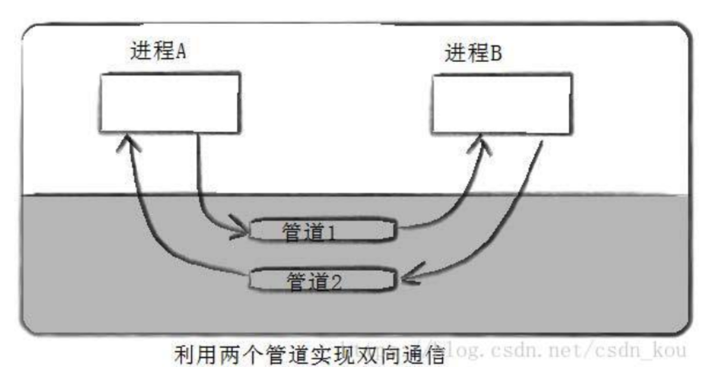

[toc]


# 浏览器多进程架构

不同浏览器采用不同的架构方式，没有标准

+ 在进程和线程上执行程序

启动应用时会创建一个进程。操作系统为进程提供了一个可以使用的“一块”内存，所有应用程序状态都保存在该私有内存空间中。关闭应用程序时，相应的进程也会消失，操作系统会释放内存。

+ 进程间通信

进程可以请求操作系统启动另一个进程来执行不同的任务。此时，内存中的不同部分会分给新进程。如果两个进程需要对话，他们可以通过进程间通信（IPC）来进行。

## 浏览器多进程之间的关系

> 进程可能包括主控进程，插件进程，GPU，tab页（浏览器内核）等等。

- Browser进程：浏览器的主进程（负责协调、主控），只有一个 ,负责浏览器的TAB的前进、后退、地址栏、书签栏的工作和处理浏览器的一些不可见的底层操作，比如网络请求和文件访问。
- 第三方插件进程：每种类型的插件对应一个进程，仅当使用该插件时才创建
- GPU进程：最多一个，用于3D绘制
- 浏览器渲染进程（内核）：默认每个Tab页面一个渲染进程，互不影响，控制页面渲染，脚本执行，事件处理等（有时候会 优化，如多个空白tab会合并成一个进程）

```
//几个进程的关系
首先，当我们是要浏览一个网页，我们会在浏览器的地址栏里输入URL，这个时候浏览器进程会向这个URL发送请求，获取这个URL的HTML内容，然后将HTML交给渲染进程解析HTML内容，解析遇到需要请求网络的资源又返回来交给主进程进行加载，同时通知主进程，需要插件加载插件资源，执行插件代码。解析完成后，渲染进程计算得到图像帧，并将这些图像帧交给GPU进程。
```

## chrome浏览器的tab进程模式

为了节省内存，Chrome提供了四种进程模式，不同的进程模式会对 tab 进程做不同的处理。

```js
Process-per-site-instance (default) - 同一个 site-instance 使用一个进程
Process-per-site - 同一个 site 使用一个进程
Process-per-tab - 每个 tab 使用一个进程
Single process - 所有 tab 共用一个进程
```

**site**是指站点，比如a.baidu.com和b.baidu.com就可以理解为同一个 site（注意这里要和 Same-origin policy 区分开来，同源策略还涉及到子域名和端口）。

**site-instance** 指的是一组 connected pages from the same site，比如同一个site，用户通过这种方式点击打开的新页面 JS代码打开的新页面（比如 window.open)

```
Process-per-site-instance 是最重要的，因为这个是 Chrome 默认使用的模式，也就是几乎所有的用户都在用的模式。当你打开一个 tab 访问 a.baidu.com ，然后再打开一个 tab 访问 b.baidu.com，这两个 tab 会使用两个进程。而如果你在 a.baidu.com 中，通过JS代码打开了 b.baidu.com 页面，这两个 tab 会使用同一个进程。 相较于 Process-per-tab，能够少开很多进程，就意味着更少的内存占用 相较于 Process-per-site，能够更好的隔离相同域名下毫无关联的 tab，更加安全
```

### 一个tab页面崩溃会不会影响另一个tab页面

```
单独的渲染进程，不影响不崩溃
火狐影响，会弹出警告是否关闭
```

## 多线程的浏览器内核

每一个tab页面可以看作是浏览器内核进程，然后这个进程是多线程的，它有几大类子线程：

- JS引擎线程
- 事件触发线程
- 定时器线程
- 网络请求线程
- GUI渲染线程

里面的JS引擎是内核进程中的一个线程，这也是为什么常说JS引擎是单线程的。

+ GUI线程

主要负责页面的渲染，解析 HTML、CSS，构建 DOM 树，布局和绘制等。

- 当界面需要重绘或者由于某种操作引发回流时，将执行该线程。
- 该线程与 JS 引擎线程互斥，当执行 JS 引擎线程时，GUI 渲染会被挂起，当任务队列空闲时，JS 引擎才会去执行 GUI 渲染。

## 导航过程浏览器进程线程发生了什么

tab以外的大部分工作由浏览器进程Browser Process负责，针对工作的不同，Browser Process 划分出不同的工作线程：

```
UI thread：控制浏览器上的按钮及输入框；
network thread：处理网络请求，从网上获取数据；
storage thread： 控制文件等的访问；
```

**在浏览器的地址栏输入内容按下回车时**

UI thread会判断输入的内容是搜索关键词（search query）还是URL，如果是搜索关键词，跳转至默认搜索引擎对应的搜索URL，如果输入的内容是URL，则开始请求URL。

**开始导航**

回车按下后，UI thread将关键词搜索对应的URL或输入的URL交给网络线程Network thread，此时UI线程使Tab前的图标展示为加载中状态，然后网络进程进行一系列诸如DNS寻址，建立TLS连接等操作进行资源请求，如果收到服务器的301重定向响应，它就会告知UI线程进行重定向然后它会再次发起一个新的网络请求。

**读取响应**

network thread接收到服务器的响应后，开始解析HTTP响应报文，然后根据响应头中的Content-Type字段来确定响应主体的媒体类型（MIME Type），如果媒体类型是一个HTML文件，则将响应数据交给渲染进程（renderer process）来进行下一步的工作，如果是 zip 文件或者其它文件，会把相关数据传输给下载管理器。

与此同时，浏览器会进行 Safe Browsing 安全检查，如果域名或者请求内容匹配到已知的恶意站点，network thread 会展示一个警告页。除此之外，网络线程还会做 CORB（Cross Origin Read Blocking）检查来确定那些敏感的跨站数据不会被发送至渲染进程。

**查找渲染进程**

各种检查完毕以后，network thread 确信浏览器可以导航到请求网页，network thread 会通知 UI thread 数据已经准备好，UI thread 会查找到一个 renderer process 进行网页的渲染。

**提交导航**

数据和渲染进程都准备好了，主进程会向 渲染进程 发送IPC消息来确认导航，此时，浏览器进程将准备好的数据发送给渲染进程，渲染进程接收到数据之后，又发送IPC消息给浏览器进程，告诉浏览器进程导航已经提交了，页面开始加载。这个时候导航栏会更新，安全指示符更新（地址前面的小锁），访问历史列表（history tab）更新，即可以通过前进后退来切换该页面。

**初始化加载完成**

当导航提交完成后，渲染进程开始加载资源及渲染页面（详细内容下文介绍），当页面渲染完成后（页面及内部的iframe都触发了onload事件），会向浏览器进程发送IPC消息，告知浏览器进程，这个时候UI thread会停止展示tab中的加载中图标。

## 多进程架构的好处

第一**，更高的容错性**。当今WEB应用中，HTML，JavaScript和CSS日益复杂，这些跑在渲染引擎的代码，频繁的出现BUG，而有些BUG会直接导致渲染引擎崩溃，多进程架构使得每一个渲染引擎运行在各自的进程中，相互之间不受影响，也就是说，当其中一个页面崩溃挂掉之后，其他页面还可以正常的运行不收影响。(chrome浏览器)

第二，**更高的安全性和沙盒性**（沙盒是一种安全机制,为运行中的程序提供的隔离环境。通常是作为一些来源不可信、具破坏力或无法判定程序意图的程序提供实验之用。 沙盒通常严格控制其中的程序所能访问的资源,比如,沙盒可以提供用后即回收的磁盘及内存空间。在沙盒中,网络访问、对真实系统的访问、对输入设备的读取通常被禁止或是严格限制。从这个角度来说,沙盒属于虚拟化的一种。 沙盒中的所有改动对操作系统不会造成任何损失。）。渲染引擎会经常性的在网络上遇到不可信、甚至是恶意的代码，它们会利用这些漏洞在你的电脑上安装恶意的软件，针对这一问题，浏览器对不同进程限制了不同的权限，并为其提供沙盒运行环境，使其更安全更可靠

第三，**更高的响应速度**。在单进程的架构中，各个任务相互竞争抢夺CPU资源，使得浏览器响应速度变慢，而多进程架构正好规避了这一缺点。


参考：溪饱鱼 https://juejin.cn/post/7193979904458195005


# node的进程

js的处理是在单进程的单线程上， 与UI的渲染是共用一个线程的，所以js加载解析会阻塞UI的渲染， 所以在js中会新启动工作线程service worker, 

单进程单线程的缺点：

+ 无法重复利用多核cpu的进程资源

## node的多进程

node可以通过child-process创建多进程，主要有spawn的方法创建，创建的时候就建立了进程之间的IPC管道

进程之间的通信在应用层上看是通过on和send message事件就可以实现，但是底层采用了不同的策略，比如建立匿名管道或者其他方法

+ 主从多进程

  独立建立的多个进程无法监听同一个端口， 因为在tcp层，有一个套接字是不同的，但是主从结构的多进程是可以实现的，由主进程创建子进程，把主进程的tcp相关服务通过套接字的方式发给子进程，子进程根据发送的内容复原一个tcp服务，这时候主进程和子进程复用了tcp套接字，所以可以监听同一个端口， 但是这个套接字同一时间只能被一个服务所使用，所以在一定程度上实现了负载均衡

+ 集群

# 进程与线程

## 进程

### 进程之间的通信

因为进程是分配系统资源的单位（包括内存地址空间），因此各进程拥有的内存地址空间相互独立。进程1的地址空间，进程2的地址空间，...，但是为了保证安全，一个进程不能直接访问另一个进程的地址空间，要进行信息交换有以下方法

#### 共享内存

共享内存是最快的进程间通讯的方式

```
因为两个进程的存储空间不能相互访问，所以操作系统就提供的一个内存空间让彼此都能访问，这就是共享存储的原理。 
在内存中画出一块共享存储区，数据的形式、存放位置都是由进程控制，而不是操作系统，不再通过执行进入内核的系统调用来传递彼此的数据。
```

优点缺点

```
能够很容易控制容量，速度快
但要保持同步，比如一个进程在写的时候，另一个进程要注意读写的问题，相当于线程中的线程安全，解决这些问题的常用方法是通过使用信号量进行同步。
```

#### 管道



在内存中开辟出的大小固定的缓存区，只能进行写操作和读操作

- 管道满时，写阻塞；空时，读阻塞。当管道中没有信息的话，从管道中读取的进程会等待，直到另一端的进程放入信息。当管道被放满信息的时候，尝试放入信息的进程会等待，直到另一端的进程取出信息。当两个进程都终结的时候，管道也自动消失
- 匿名管道与命名管道的区别

```
匿名管道由pipe函数创建并打开。
命名管道由mkfifo函数创建，打开用open
FIFO（命名管道）与pipe（匿名管道）之间唯一的区别在它们创建与打开的方式不同，一但这些工作完成之后，它们具有相同的语义。
```

#### 消息队列

```
进程间的数据交换以格式化的消息为单位。进程通过操作系统提供的"发送消息/接收消息"两个原语进行数据交换。
间接通信的方式（类似发布订阅模式）
```

#### 信号量

在内核中创建一个信号量集合（本质是个数组），数组的元素（信号量）都是1，使用P操作进行-1，使用V操作+1，

```
P(sv)：如果sv的值⼤大于零，就给它减1；如果它的值为零，就挂起该进程的执⾏ 。
V(sv)：如果有其他进程因等待sv而被挂起，就让它恢复运⾏，如果没有进程因等待sv⽽挂起，就给它加1。

PV操作用于同一进程，实现互斥。
PV操作用于不同进程，实现同步。
```

信号量的本质就是一个计数器，用来实现进程之间的互斥与同步。例如信号量的初始值是 1，然后 a 进程来访问内存1的时候，我们就把信号量的值设为 0，然后进程b 也要来访问内存1的时候，看到信号量的值为 0 就知道已经有进程在访问内存1了，这个时候进程 b 就会访问不了内存1。

#### Socket

最常用，如我们的微信APP跟微信服务器通信，其实就是使用的Socket套接字进行通信的


### 进程的状态

```
1.运行态：占有CPU并运行 链表，PCB1
2.就绪态：可以运行但没有空闲CPU，PCB1--PCB2--PCB3...
3.阻塞态：等待态,PCB1--PCB2--PCB3...
4.创建态：进程正在被创建，系统正在分配资源，PCB初始化
5.中止态：进程被撤销，操作系统回收资源，PCB撤销
```

#### 进程间状态转换

原语采用关中断指令和开中断指令实现。

```
首先执行关中断指令
然后外部来了中断信号，不予以处理
等到开中断指令执行后，其他中断信号才有机会处理。
```

------

### 死锁

死锁是指两个或两个以上的进程在执行过程中，由于竞争资源或者由于彼此通信而造成的一种阻塞的现象，若无外力作用，它们都将无法推进下去。此时称系统处于死锁状态或系统产生了死锁，这些永远在互相等待的进程称为死锁进程。

#### 死锁的四个条件

- 互斥使用，即当资源被一个线程使用(占有)时，别的线程不能使用
- 不可抢占，资源请求者不能强制从资源占有者手中夺取资源，资源只能由资源占有者主动释放。
- 请求和保持，即当资源请求者在请求其他的资源的同时保持对原有资源的占有。
- 循环等待，即存在一个等待队列：P1占有P2的资源，P2占有P3的资源，P3占有P1的资源。这样就形成了一个等待环路。

#### 怎么解决死锁

A：死锁预防

- 打破互斥条件：改造独占性资源为虚拟资源，大部分资源已无法改造。
- 打破不可抢占条件：当一进程占有一独占性资源后又申请一独占性资源而无法满足，则退出原占有的资源。
- 打破占有且申请条件：采用资源预先分配策略，即进程运行前申请全部资源，满足则运行，不然就等待，这样就不会占有且申请。
- 打破循环等待条件：实现资源有序分配策略，对所有设备实现分类编号，所有进程只能采用按序号递增的形式申请资源。

B:解决方法

- 死锁预防
- 死锁避免

```
系统对进程发出的每一个系统能够满足的资源申请进行动态检查，并根据检查结果决定是否分配资源；如果分配后系统可能发生死锁，则不予分配，否则予以分配。这是一种保证系统不进入死锁状态的动态策略。 
```

- 死锁检测和解除

## 线程

### 线程同步的方法

在多线程中线程的执行顺序是依靠哪个线程先获得到CUP的执行权谁就先执行，虽然说可以通过线程的优先权进行设置，但是他只是获取CUP执行权的概率高点，但是也不一定必须先执行。在这种情况下如何保证线程按照一定的顺序进行执行，今天就来一个大总结，分别介绍一下几种方式。

```
通过Object的wait和notify
通过Condition的awiat和signal
通过一个阻塞队列
通过两个阻塞队列
通过SynchronousQueue 
通过线程池的Callback回调
通过同步辅助类CountDownLatch
通过同步辅助类CyclicBarrier
```

## 进程与线程的联系与区别

- 联系：

```
+ 一个线程只属于一个进程，一个进程可以拥有多个线程，但至少有一个线程，称为主线程
+ 资源统一分配给进程，同一进程中的线程共享该进程的所有资源
+ 线程在执行过程中，需要协作同步，不同进程之间线程需要通过消息通信来达到同步
```

- 区别：

```
+ 线程作为调度和分配的基本单位，进程作为分配资源的基本单位
+ 并发性：不仅进程之间可以并发执行，同一进程中的不同线程之间也能进行并发执行
+ 拥有资源：进程是拥有资源的独立单位，线程不拥有资源，但可以访问隶属于进程的所有资源
```

## 避免多线程中死锁

```
+ 加锁顺序（线程按照一定的顺序加锁）
+ 加锁时限（线程尝试获取锁的时候加上一定的时限，超过时限则放弃对该锁的请求，并释放自己占有的锁）
+ 死锁检测
```