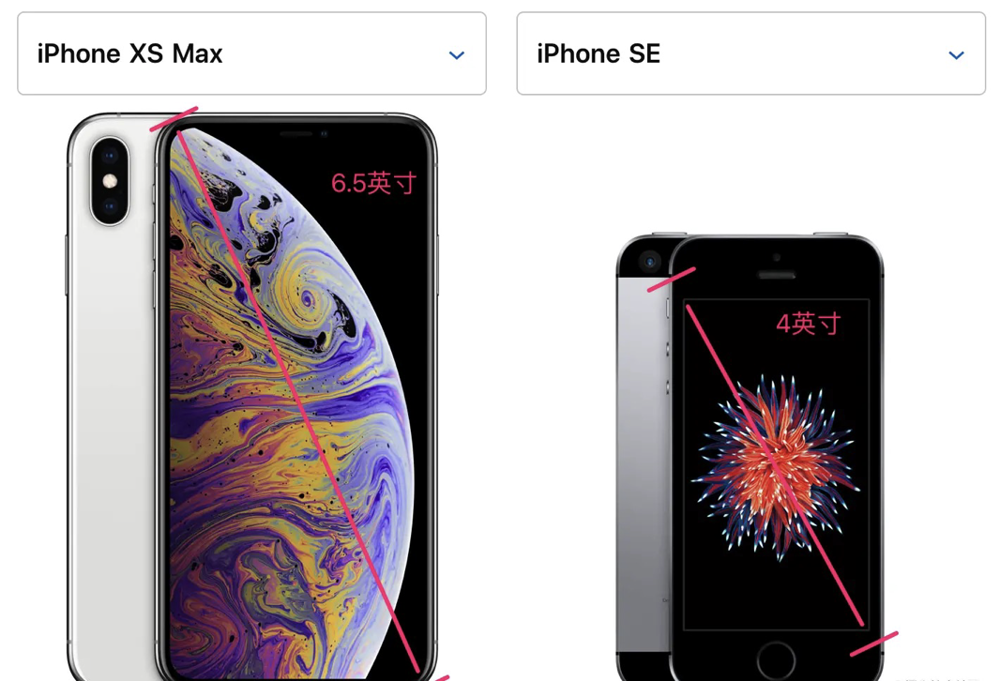
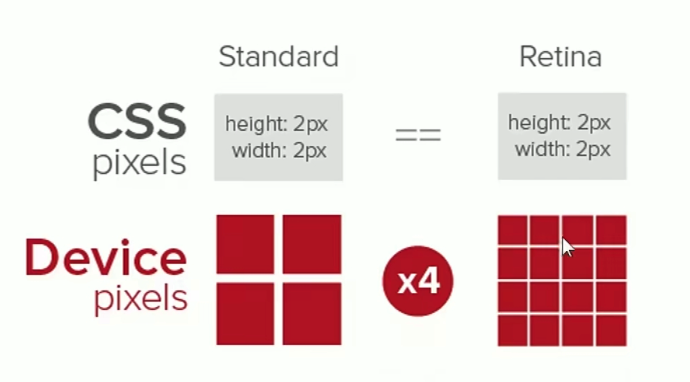
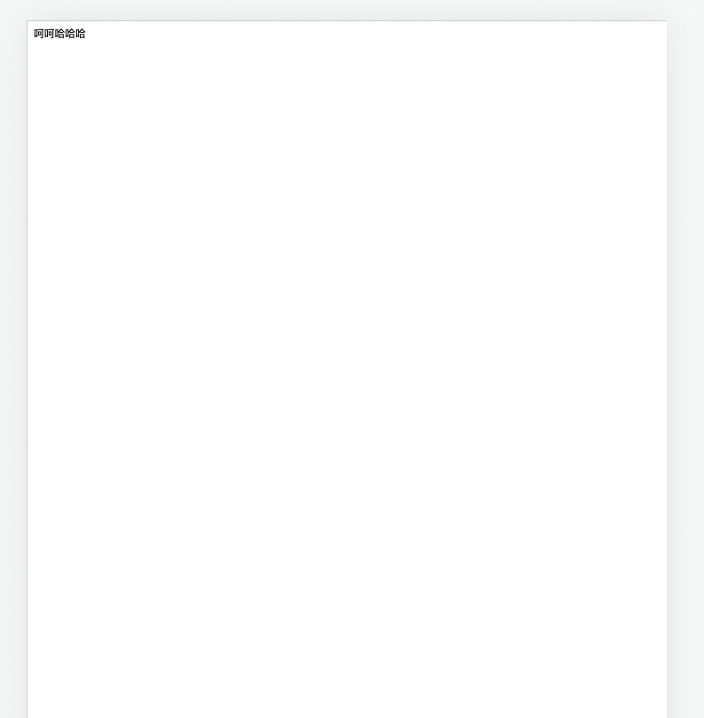

[toc]

# 移动端基础概念介绍

## 基本概念

### 1.英寸

手机的斜对角线，单位为英寸




### 2.分辨率

iPhone XS Max 和 iPhone SE的分辨率分别为2688 x 1242和1136 x 640。这表示手机分别在垂直和水平上所具有的像素点数。不一定分辨率越高就越清晰，还与设备实际的尺寸有关。高清屏的分辨率要高于标清屏。

### 3.物理像素

也叫做设备像素，就是移动设备实际的像素点数，分辨率分别为2688 x 1242，那么表示在垂直方向实际上有2688 个物理像素点，它是不可改变的。

### 4.CSS像素

也叫逻辑像素，独立设备像素，也就是我们实际写代码的时候写的width:120px的这个px

### 5.设备像素比（dpr）

取值为设备像素/css像素（缩放比为1的情况下）



借用一张图，同样的css像素为2px，在标清屏下用2个实际的物理像素来显示，dpr=1,在高清屏下，需要用4个实际的物理像素点来表示，dpr=2,这个转换浏览器可以代替我们来自动完成

在web中，浏览器为我们提供了window.devicePixelRatio来帮助我们获取dpr。

在css中，可以使用媒体查询min-device-pixel-ratio，区分dpr：

```
@media (-webkit-min-device-pixel-ratio: 2),(min-device-pixel-ratio: 2){ }
```

### 6.缩放

缩放是缩放的css像素，物理像素是不能进行改变的，当缩放值为2时，也就是把css像素放大了2倍，在标清屏下，dpr=1,原本1个px用1个实际的设备像素表示就行，现在缩放之后，1个px就相当于放大了两倍，变成了2px，需要2个实际的物理像素来表示

### 7.每英寸的物理像素点（PPI/DPI）

可以通过斜对角线计算得到，6.5英寸，2688 x 1242，那么斜对角线的像素点数可以通过勾股定理计算得到，然后除以6.5英寸，即可,PPI越大，表示屏幕越清晰

## 视口viewport

视口是相对于移动端来说的，PC端的页面展示在移动端的时候，默认的视口是980px。然后PC端的内容会以980px进行换算与展示，导致PC端的页面在移动端展示会看起来很小



那么对于移动端，可以把视口的宽度设置为设备的宽度，这样页面可以自动根据设备宽度进行转换，从而适应移动端对额大小

```html
<meta name="viewport" content="width=device-width">
```

还有一些其他属性

+ initial-scale=1和width=device-width的作用相同，initial-scale=2则表示css像素被放大，页面元素会被放大两倍

  ```
  <meta name="viewport" content="initial-scale=1">
  ```

+ 不允许用户缩放

  ```
  <meta name="viewport" content="initial-scale=1;user-scale=no;maximum-scale=1;minmun-scale=1">
  ```

### 获取视口的方法

+ document.documentElement.clientWidth
+ document.documentElement.getBoundingClientReact().width
+ Window.innerWidth

## 移动端事件

### touch事件

对一个div元素可以绑定touch事件，当touchstart在div上的时候，还可以接着触发touchmove和touchend,但是当touchstart不是在div上开始的时候，就算此时再移动到div上,也不会触发touchmove和touchend

```js
const divEle = document.getElementById('test')
divEle.addEventListener('touchstart',function(){
  console.log('touchStart')
})
divEle.addEventListener('touchmove',function(){
  console.log('touchmove')
})
divEle.addEventListener('touchend',function(){
  console.log('touchend')
})
//touchcancel一般是由于设备突然接到电话等打断当前的操作才会触发的
```

### 300ms延迟

这是由于在移动端某些设备有双击放大的功能，那么click一次之后，需要等待300ms去判断是不是双击操作

解决方法：

+ fastClick库：touch事假不需要等待，所以touchend之后立即触发一个自定义的DOM事件，然后阻拦原本300ms之后才会触发的方法
+ 现代浏览器根据width=device-width，直接判断是移动端，不等待300ms