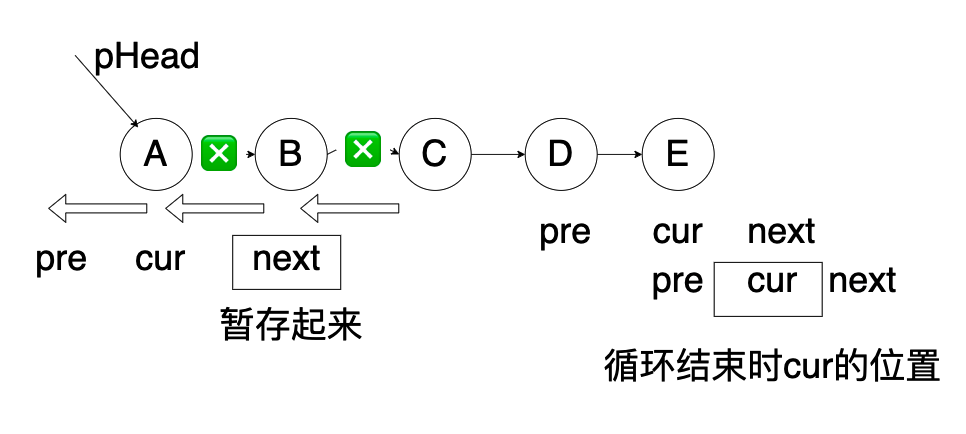
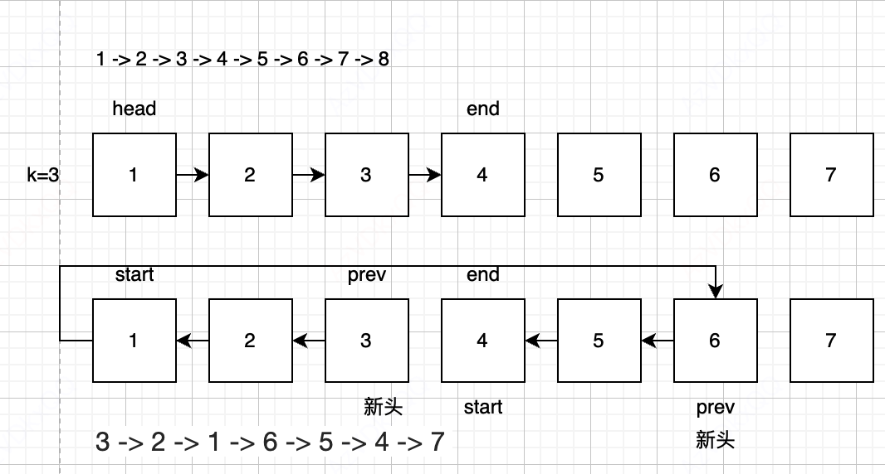
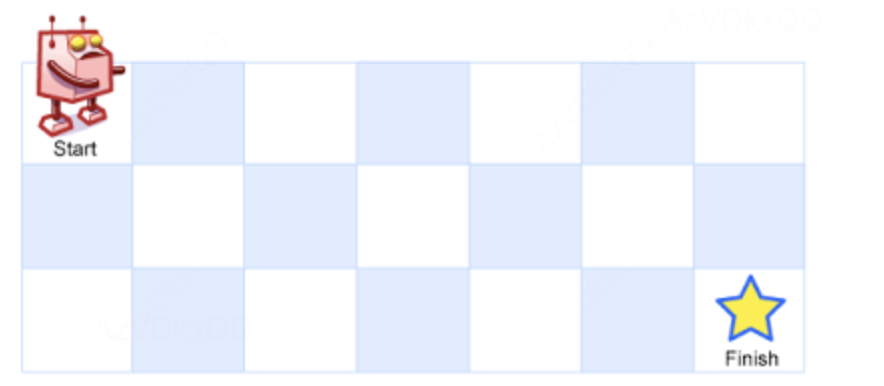
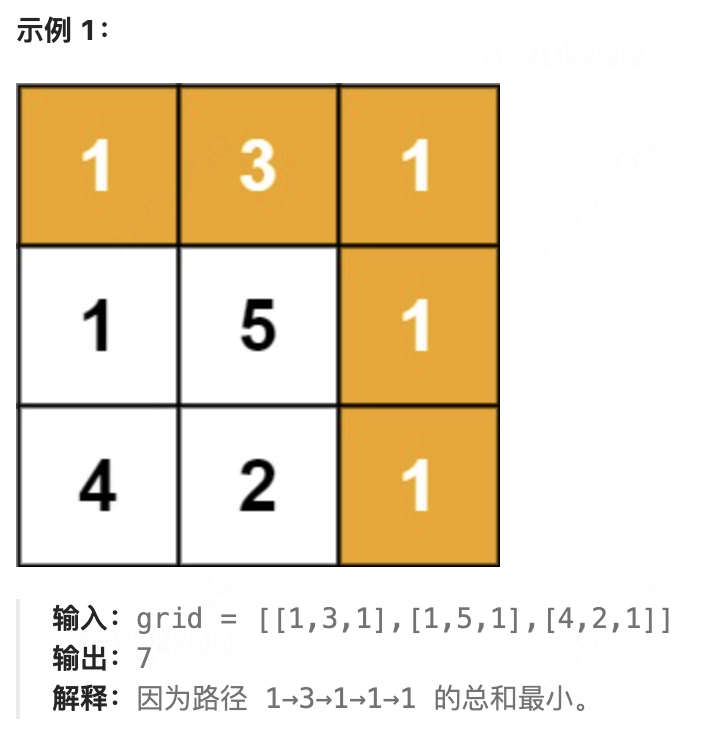
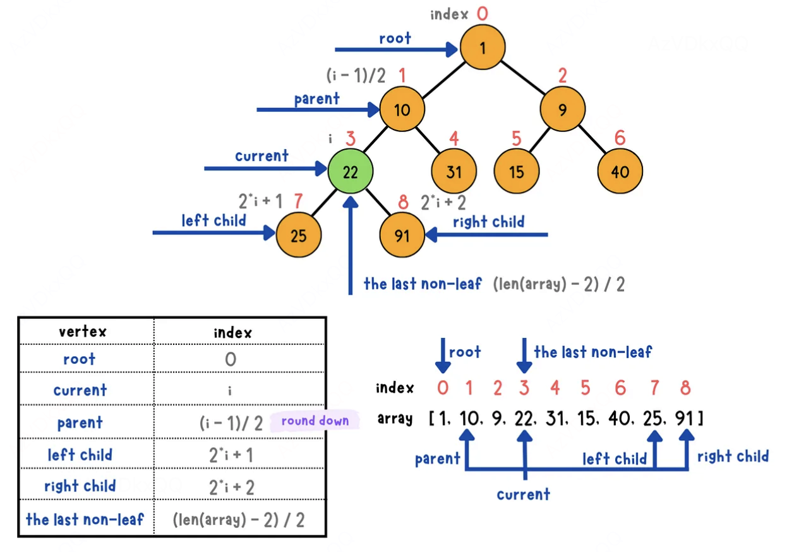
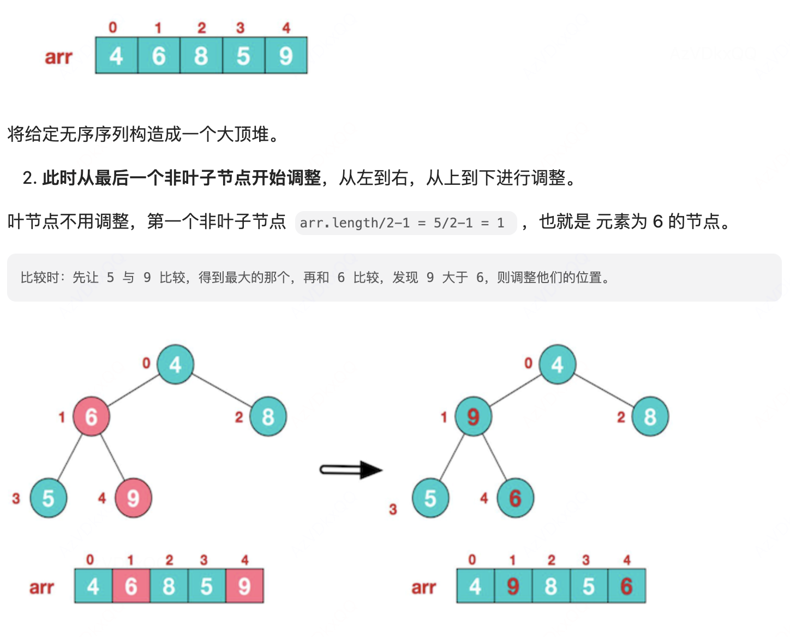
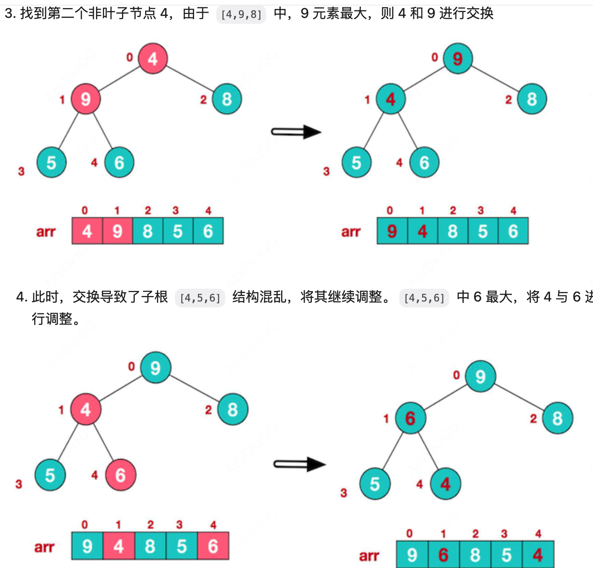
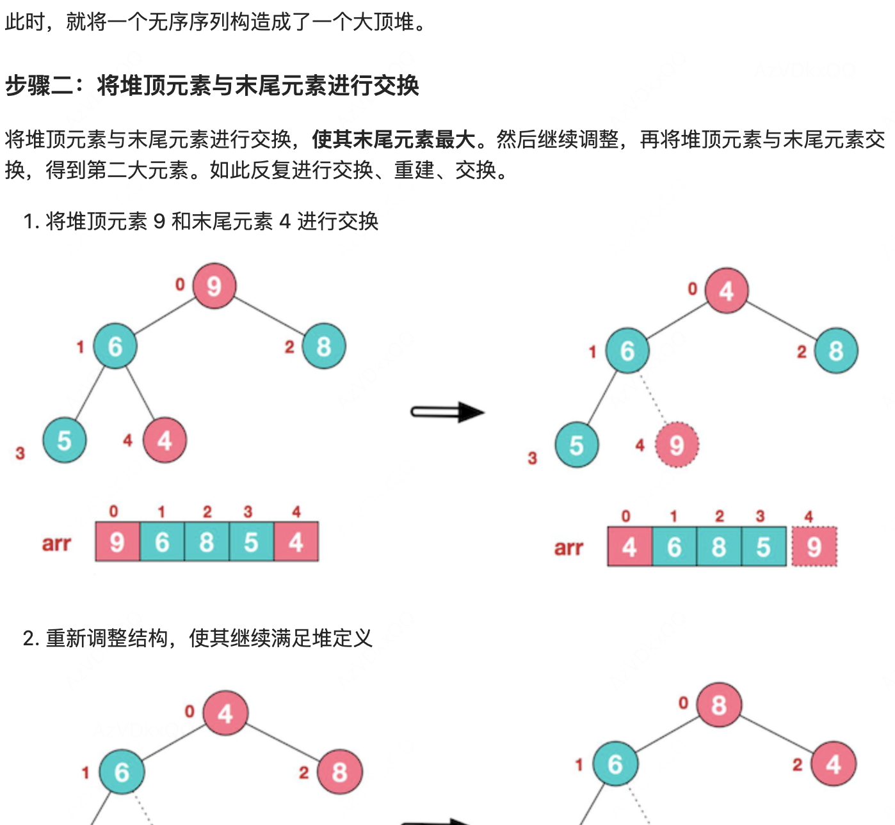
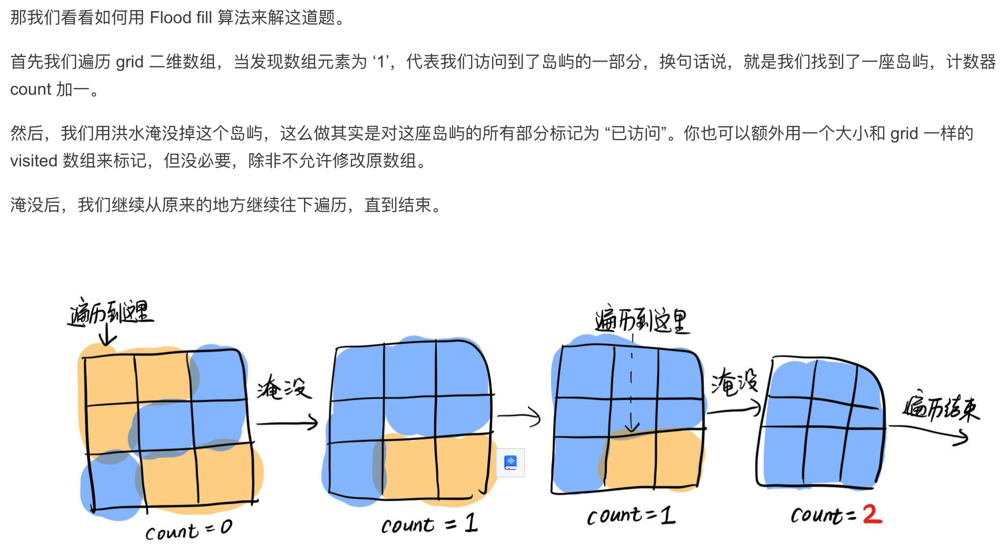

[toc]

https://codetop.cc/home

+ 两数之和

+ 字母异位词分组

  ```
  优化建议
  1.数组循环用for..of
  2.map尽量用map.set(key,value), map.get(key)
  3.一次性获取map的所有的value，m不需要for..in获取，只需要Array.from(map.values())
  ```

+ 无序数组查找最长序列

  ```
  1.寻找最长最短：哈希，此处使用new Set()
  2.每次寻找之前判断是不是序列起点，也就是存不粗在num-1的数字，是才执行后续操作
  3.是序列起点，则循环查找num+1的元素
  ```

# 哈希表

## 两数之和

https://leetcode.cn/problems/two-sum/description/

没有规律的数组，给定一个整数数组 `nums` 和一个整数目标值 `target`，请你在该数组中找出 **和为目标值** *`target`* 的那 **两个** 整数, 比如

```
输入：nums = [3,2,4], target = 6
输出：[1,2]
```

思路： 可以直接两层循环进行查找,  如果是递增序列，可以使用双指针

优化：建立哈希表, 值为key， index为value

```JS
var twoSum = function(nums, target) {
    let map = new Map();
    for(let i = 0, len = nums.length; i < len; i++){
        if(map.has(target - nums[i])){
            return [map.get(target - nums[i]), i];
        }else{
            map.set(nums[i], i);
        }
    }
    return [];
};
```


# 移动窗口-指针

## 无重复字符的最长子串

https://leetcode.cn/problems/longest-substring-without-repeating-characters/

给定一个字符串 `s` ，请你找出其中不含有重复字符的 **最长连续子字符串** 的长度。

```
输入: s = "abcabcbb"
输出: 3 
解释: 因为无重复字符的最长子字符串是 "abc"，所以其长度为 3。
```

>左右指针滑动窗口：用set存储当前子串，左右指针，用right-left+1表示当前子串的长度，新元素不包含在内，则right++, 否则删除left的元素，left++(实际上是挨个计算每个元素初始位置开始的最长无重复子串)
>
>abbcsss
>
>left=0 right=0  max = 1  arr =[ a]
>
>left=0 right=1 max=2 arr=[a,b]  以a开头的最长子串就是2， 计算下一个以b开头的
>
>Arr = [b] left=1 right = 1  max=1   以b开头的最长子串就是1， 计算下一个以b开头的
>
>arr=[]  left=2 right=1  max=0    b重复，跳过
>
>arr=[b] left=2 rigjht =2 max=1

```js
var lengthOfLongestSubstring = function(s) {
    const len = s.length
    let max = 0
    let left = 0
    let right = 0
    let arr = new Set()
    while(right<len){
        if (!arr.has(s[right])) {
            max = Math.max(max, right - left + 1)
            arr.add(s[right])
            right++
        } else {
            arr.delete(s[left])
            left++
        }
    }
    return max
};
```


## 三数之和

https://leetcode.cn/problems/3sum/description/

给你一个整数数组 `nums` ，判断是否存在三元组 `[nums[i], nums[j], nums[k]]` 满足 `i != j`、`i != k` 且 `j != k` ，同时还满足 `nums[i] + nums[j] + nums[k] == 0` 。请你返回所有和为 `0` 且不重复的三元组。

+ 外层循环：指针 i 遍历数组。
+ 内层循环：用双指针，去寻找满足三数之和 == 0 的元素
+ 排序，便于跳过重复节点

```JS
const threeSum = (nums) => {
  nums.sort((a, b) => a - b); // 排序

  const res = [];

  for (let i = 0; i < nums.length - 2; i++) { // 外层遍历
    let n1 = nums[i];
    if (n1 > 0) break; // 如果已经爆0，不用做了，break
    if (i - 1 >= 0 && n1 == nums[i - 1]) continue; // 数组最外层遍历到重复的数，跳过    

    let left = i + 1;            // 左指针
    let right = nums.length - 1; // 右指针

    while (left < right) {
      let n2 = nums[left], n3 = nums[right];

      if (n1 + n2 + n3 === 0) {  // 三数和=0，加入解集res
        res.push([n1, n2, n3]);
        // 继续寻找
        while (left < right && nums[left] == n2) left++; // 直到指向不一样的数
        while (left < right && nums[right] == n3) right--; // 直到指向不一样的数
      } else if (n1 + n2 + n3 < 0) { // 三数和小于0，则左指针右移
        left++;
      } else {      // 三数和大于0，则右指针左移
        right--;
      }
    }
  }
  return res;
};
```


# 合并两个有序数组

https://leetcode.cn/problems/merge-sorted-array/

给你两个按 **非递减顺序** 排列的整数数组 `nums1` 和 `nums2`，另有两个整数 `m` 和 `n` ，分别表示 `nums1` 和 `nums2` 中的元素数目。

请你 **合并** `nums2` 到 `nums1` 中，使合并后的数组同样按 **非递减顺序** 排列。

>递增的两个数组合并 ==》双指针
>
>结果直接在nums1中==》引用传值，必须直接改nums1

```js
var merge = function(nums1, m, nums2, n) {
    let head1 = 0
    let head2 =0
    var res = []
    while(head1<m && head2<n){
        if(nums1[head1]<nums2[head2]){
            res.push(nums1[head1])
            head1++
        }else{
            res.push(nums2[head2])
            head2++
        }
    }
    if(head1<m){
        res = res.concat([...nums1.slice(head1)])
    }
    if(head2<n){
        res = res.concat([...nums2.slice(head2)])
    }
    for (let i = 0; i < m + n; i++) {
        nums1[i] = res[i];
    }
    // nums1 = [...res] // 这样不行，创建了新数组，nums1的指向改变了，但是nums1是引用传值
};
```

# [LRU (最近最少使用) 缓存](https://baike.baidu.com/item/LRU) 

LCU容量为一个正整数，有一个get和一个set方法，当没有超出容量时，可以在LCU存入key,value值，超出容量时删除最不长使用的value

https://leetcode.cn/problems/lru-cache/description/

>get的时候，如果有，把get的这个key删除掉，放在最上边，否则返回-1
>
>set的时候，如果有，更新这个key并删除掉放在最上，否则直接放在最上，同时判断set之后有没有超出容量
>
>Map是有序结构，可以满足要求

基础知识点

>this.cache.keys().next().value 获取map的第一个key
>
>`this.cache.keys()` 返回一个包含 `Map` 中所有键的迭代器。
>
>`.next()` 返回迭代器的下一个值，这是一个包含 `value` 和 `done` 属性的对象。
>
>`.value` 获取迭代器的当前键，即第一个键。
>
>`this.cache.delete(firstKey)` 删除与该键对应的项。

```js
/**
 * @param {number} capacity
 */
var LRUCache = function(capacity) {
    this.max=capacity
    this.map = new Map()
};

/** 
 * @param {number} key
 * @return {number}
 */
LRUCache.prototype.get = function(key) {
    let tempVal;
    if(this.map.has(key)){
        tempVal = this.map.get(key)
        this.map.delete(key)
        this.map.set(key, tempVal)
        return tempVal
    }else{
        return -1
    }
};

/** 
 * @param {number} key 
 * @param {number} value
 * @return {void}
 */
LRUCache.prototype.put = function(key, value) {
    if(this.map.has(key)){
        this.map.delete(key)
    }
    this.map.set(key, value)
    if(this.map.size>this.max){
        this.map.delete(this.map.keys().next().value);
    } 
};
```

# 链表

## 反转链表

https://leetcode.cn/problems/reverse-linked-list/

+ 每次把next存储起来
+ 最后返回的是pre



```js
var reverseList = function(head) {
    let pre = null
    let cur = head
    while(cur){
        let next = cur.next
        cur.next = pre
        pre =cur
        cur = next
    }
    return pre  
};
```

## [ K 个一组翻转链表](https://leetcode.cn/problems/reverse-nodes-in-k-group)

不太好理解

给你链表的头节点 `head` ，每 `k` 个节点一组进行翻转，请你返回修改后的链表。

```
输入：head = [1,2,3,4,5], k = 2
输出：[2,1,4,3,5]
```

思路： 

+ 获取k个一组的start和end， 不够k个则不翻转，直接返回头部
+ K个翻转，剩余的end开始再K个翻转，递归
+ 第一个K个翻转之后， 
+ 进行反转链表后，原本 start 指向的头结点，已经被翻转到了尾部，即 end 指针的前面，所以直接 start.next = reverseKGroup(end, k) ，连接起后面需要继续递归翻转的部分



```js
var reverseKGroup = function(head, k) {
  if(!head) return null;
  let start = head, end = head;
  for(let i = 0; i < k; i++) {
        // 如果在还没遍历到第 k 个，end 空了，即 head 链表个数不满足 k 个，直接返回原链表
        if(!end) {
            return head;
        } else {
            end = end.next;
        }
    }
    let newHead = reverse(start, end);
    start.next = reverseKGroup(end, k);  // 翻转以后，原本的 start 指向的结点，变到了 end 的前一个，直接 start.next 继续递归翻转后续的就行
    return newHead;  
};

// 反转区间 [head, end) 的元素，注意是左闭右开
function reverse(head, end) {
  let prev = null; 
  let current = head; 
  let next = null;

  // 遍历从 head 到 end 的节点
  while (current !== end) {
    next = current.next; 
    current.next = prev; 
    prev = current;
    current = next;
  }
  // 返回反转后的链表的新头部
  return prev;
}
```

# 动态规划

## 不同路径

https://leetcode.cn/problems/unique-paths/description/

一个机器人位于一个 `m x n` 网格的左上角 。

机器人每次只能向下或者向右移动一步。机器人试图达到网格的右下角

问总共有多少条不同的路径？



解析： 建立二维列表，计算到每一个格子的路径， 只能向右或者向下，则第一行每个格子都只有一个路径，第一列每个格子也只有一条路径， 然后中间每个格子都是它上边的格子加上左边的格子，最终得到到达所有格子的路径

```
[
[1,1,1,1,1]
[1,1+1=2,2+1=3,3+1=4,4+1=5]
]
```

节约空间的方法，当前的每一行都是上一行加左边，那可以改为一维数组，既是上一行数据，也是当前行数据，进行累加

```js
var uniquePaths = function(m, n) {
    let dp = new Array(m).fill(1)
    for(let j=1;j<n;j++){
        for(let i = 1; i <m; i++){
            dp[i] = dp[i] + dp[i-1]
        }
    }
    return dp[m-1]
};
```

小细节，i,j从1开始循环，最后返回的是m-1

## 最小路径和



```js
var minPathSum = function(grid) {
    const m = grid.length //行
    const n = grid[0].length // 列
    const f = Array.from({length: m}, () => new Array(n));
    f[0][0] = grid[0][0]
    // 初始化第一列（垂直方向累加）
    for (let i = 1; i < m; i++) {
        f[i][0] = f[i-1][0] + grid[i][0];
    }
    
    // 初始化第一行（水平方向累加）
    for (let j = 1; j < n; j++) {
        f[0][j] = f[0][j-1] + grid[0][j];
    }
    
    for (let i = 1; i < m; i++) {
        for (let j = 1; j < n; j++) {
            f[i][j] = Math.min(f[i-1][j], f[i][j-1]) + grid[i][j];
        }
    }
    
    return f[m-1][n-1];
};
```

Array.from({length: m}, () => new Array(n))  创建了m行n列的数组

{length: m} 定义了一个长度为m的类数组

 () => new Array(n)  为每一个元素生成一个数组

# 排序相关

## 堆排序

堆

+ 完全二叉树，子节点左右都有
+ 从根节点开始，每层按从左到右的顺序存入数组
+ 大根堆是任何父节点的值比所有子节点的值大，根节点最大， 小根堆是任何父节点的值比所有子节点的值小，根节点最小

重要性质



```
arr[i]的子节点为arr[2i+1]和arr[2i+2]
第i个元素的父元素 （i-1 ） /  2
最后一个非叶子节点, 最后一个元素的父元素 Math.floor(arr.length/2)-1
```

时间复杂度o(nlogn)

构造大顶堆







最终形成一个递增的数组

### 数组中第K大的元素

```js
var findKthLargest = function(nums, k) {
    const nl = nums.length
    // 交换
    const swap = (max, n) => {
        const t = nums[max]
        nums[max] = nums[n]
        nums[n] = t
    }
    // 建立最大堆， 每个节点和左右节点比校和交换，再更新交换过后的结构
    const heapify = (n, length) => {
        const l = 2 * n + 1, r = l + 1
        let max = n
        if (l < length && nums[l] > nums[max]) max = l
        if (r < length && nums[r] > nums[max]) max = r
        if (max != n) {
            swap(max, n)
            // 递归以下节点，维护最大堆
            heapify(max, length)
        }
    }
     // 建立堆, 从最后一个非叶子节点开始
    for (let i = Math.floor(nl/2) - 1; i >= 0; i--)
        heapify(i, nl)
    //  排序下沉， 把堆顶和最后几个元素交换位置
    for (let i = nl - 1; i >= nl - k; i--) {
        // 最大的与最后一个交换位置
        swap(0, i)
        // 维护最大堆
        heapify(0, i)
    }
    return nums[nl - k]
};
```

# 岛屿数量

https://leetcode.cn/problems/number-of-islands/description/?favorite=2cktkvj

由 `'1'`（陆地）和 `'0'`（水）组成的的二维网格，计算网格中岛屿的数量， 岛屿总是被水包围，并且每座岛屿只能由水平方向和/或竖直方向上相邻的陆地连接形成

```js
输入：grid = [
  ["1","1","1","1","0"],
  ["1","1","0","1","0"],
  ["1","1","0","0","0"],
  ["0","0","0","0","0"]
]
输出：1
```

题解：

> 岛屿问题，固定套路 Flood fill 算法(在一个区域内，从某个点开始往外扩散找到与其联通的所有点，最终获得一个区域块,实现上通常为 DFS 或 BFS。)
>
> 

```js
function numIslands(grid) {
  const m = grid.length; //行
  const n = grid[0].length; //列
  let count = 0;
  for (let i = 0; i < m; i++) {
    for (let j = 0; j < n; j++) {
      if (grid[i][j] === '1') { // 发现岛屿的一部分
        count++;
        floodFill(grid, i, j);
      }
    }
  }
  return count;
};

// 深度遍历，找到的每一个为1的一直往深度扩展为1的全变为0，除非触及到了岛屿边界
function floodFill(grid, i, j) {
  const m = grid.length; //  行
  const n = grid[0].length; // 列
  if (i < 0 || i >= m || j < 0 || j >= n) return; // 跑到地图外了
  if (grid[i][j] === '0') return; // 到达岛屿边缘了

  grid[i][j] = '0'; // 淹没
  floodFill(grid, i - 1, j);
  floodFill(grid, i + 1, j);
  floodFill(grid, i, j - 1);
  floodFill(grid, i, j + 1);
}
```

## 岛屿的最大面积

找到给定的二维数组中最大的岛屿面积。如果没有岛屿，则返回面积为 `0` 。

> 计算每次淹没多少个1

```js
var maxAreaOfIsland = function(grid) {
    const m = grid.length;
    const n = grid[0].length;
    let maxNum =0;
    for(let i=0;i<m;i++){
        for(let j=0;j<n;j++){
          if(grid[i][j]===1){
              let areaOnly = fillflood(grid,i ,j)
              maxNum = areaOnly> maxNum? areaOnly: maxNum
          }
        }
    }
    return maxNum
};

function fillflood(grid,i ,j){
    const m = grid.length;
    const n = grid[0].length;
    if(i<0||i>=m || j<0 ||j>=n) return 0;
    if(grid[i][j]=== 0) return 0;
    grid[i][j] = 0
    return fillflood(grid,i-1 ,j)+ fillflood(grid,i+1 ,j)+ fillflood(grid,i ,j-1) + fillflood(grid,i ,j+1)+1
}
```

