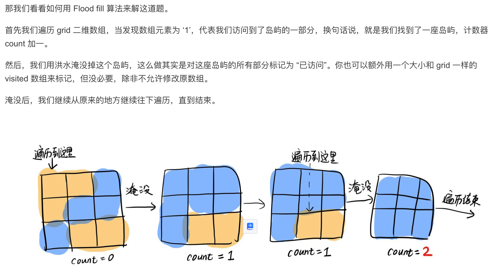

[toc]

# 1.岛屿数量

https://leetcode.cn/problems/number-of-islands/description/?favorite=2cktkvj

由 `'1'`（陆地）和 `'0'`（水）组成的的二维网格，计算网格中岛屿的数量， 岛屿总是被水包围，并且每座岛屿只能由水平方向和/或竖直方向上相邻的陆地连接形成

```js
输入：grid = [
  ["1","1","1","1","0"],
  ["1","1","0","1","0"],
  ["1","1","0","0","0"],
  ["0","0","0","0","0"]
]
输出：1
```

题解：

> 岛屿问题，固定套路 Flood fill 算法(在一个区域内，从某个点开始往外扩散找到与其联通的所有点，最终获得一个区域块,实现上通常为 DFS 或 BFS。)
>
> 

```js
function numIslands(grid) {
  const m = grid.length; //行
  const n = grid[0].length; //列
  let count = 0;
  for (let i = 0; i < m; i++) {
    for (let j = 0; j < n; j++) {
      if (grid[i][j] === '1') { // 发现岛屿的一部分
        count++;
        floodFill(grid, i, j);
      }
    }
  }
  return count;
};

// 深度遍历，找到的每一个为1的一直往深度扩展为1的全变为0，除非触及到了岛屿边界
function floodFill(grid, i, j) {
  const m = grid.length; //  行
  const n = grid[0].length; // 列
  if (i < 0 || i >= m || j < 0 || j >= n) return; // 跑到地图外了
  if (grid[i][j] === '0') return; // 到达岛屿边缘了

  grid[i][j] = '0'; // 淹没
  floodFill(grid, i - 1, j);
  floodFill(grid, i + 1, j);
  floodFill(grid, i, j - 1);
  floodFill(grid, i, j + 1);
}
```

## 岛屿的最大面积

找到给定的二维数组中最大的岛屿面积。如果没有岛屿，则返回面积为 `0` 。

> 计算每次淹没多少个1

```js
var maxAreaOfIsland = function(grid) {
    const m = grid.length;
    const n = grid[0].length;
    let maxNum =0;
    for(let i=0;i<m;i++){
        for(let j=0;j<n;j++){
          if(grid[i][j]===1){
              let areaOnly = fillflood(grid,i ,j)
              maxNum = areaOnly> maxNum? areaOnly: maxNum
          }
        }
    }
    return maxNum
};

function fillflood(grid,i ,j){
    const m = grid.length;
    const n = grid[0].length;
    if(i<0||i>=m || j<0 ||j>=n) return 0;
    if(grid[i][j]=== 0) return 0;
    grid[i][j] = 0
    return fillflood(grid,i-1 ,j)+ fillflood(grid,i+1 ,j)+ fillflood(grid,i ,j-1) + fillflood(grid,i ,j+1)+1
}
```

# 2.[无重复字符的最长子串](https://leetcode.cn/problems/wtcaE1/)

给定一个字符串 `s` ，请你找出其中不含有重复字符的 **最长连续子字符串** 的长度。

```
输入: s = "abcabcbb"
输出: 3 
解释: 因为无重复字符的最长子字符串是 "abc"，所以其长度为 3。
```

