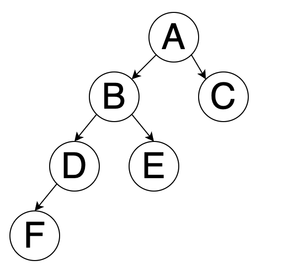

[toc]

总体思路：

+ 凡是需要O（n^2）实现的算法，都可以考虑双指针

+ 尽量不要修改原有的数据结构

# 性能好坏判断

```js
console.time('findNumber')
console.log('findNumber', findNumber(100)) //0.810302734375 ms
console.timeEnd('findNumber')
```

通过console.time和console.timeEnd可以得到中间的执行时间，从而判断好坏


# 1.岛屿数量

https://leetcode.cn/problems/number-of-islands/description/?favorite=2cktkvj

由 `'1'`（陆地）和 `'0'`（水）组成的的二维网格，计算网格中岛屿的数量， 岛屿总是被水包围，并且每座岛屿只能由水平方向和/或竖直方向上相邻的陆地连接形成

```js
输入：grid = [
  ["1","1","1","1","0"],
  ["1","1","0","1","0"],
  ["1","1","0","0","0"],
  ["0","0","0","0","0"]
]
输出：1
```

题解：

> 岛屿问题，固定套路 Flood fill 算法(在一个区域内，从某个点开始往外扩散找到与其联通的所有点，最终获得一个区域块,实现上通常为 DFS 或 BFS。)
>
> 

```js
function numIslands(grid) {
  const m = grid.length; //行
  const n = grid[0].length; //列
  let count = 0;
  for (let i = 0; i < m; i++) {
    for (let j = 0; j < n; j++) {
      if (grid[i][j] === '1') { // 发现岛屿的一部分
        count++;
        floodFill(grid, i, j);
      }
    }
  }
  return count;
};

// 深度遍历，找到的每一个为1的一直往深度扩展为1的全变为0，除非触及到了岛屿边界
function floodFill(grid, i, j) {
  const m = grid.length; //  行
  const n = grid[0].length; // 列
  if (i < 0 || i >= m || j < 0 || j >= n) return; // 跑到地图外了
  if (grid[i][j] === '0') return; // 到达岛屿边缘了

  grid[i][j] = '0'; // 淹没
  floodFill(grid, i - 1, j);
  floodFill(grid, i + 1, j);
  floodFill(grid, i, j - 1);
  floodFill(grid, i, j + 1);
}
```

## 岛屿的最大面积

找到给定的二维数组中最大的岛屿面积。如果没有岛屿，则返回面积为 `0` 。

> 计算每次淹没多少个1

```js
var maxAreaOfIsland = function(grid) {
    const m = grid.length;
    const n = grid[0].length;
    let maxNum =0;
    for(let i=0;i<m;i++){
        for(let j=0;j<n;j++){
          if(grid[i][j]===1){
              let areaOnly = fillflood(grid,i ,j)
              maxNum = areaOnly> maxNum? areaOnly: maxNum
          }
        }
    }
    return maxNum
};

function fillflood(grid,i ,j){
    const m = grid.length;
    const n = grid[0].length;
    if(i<0||i>=m || j<0 ||j>=n) return 0;
    if(grid[i][j]=== 0) return 0;
    grid[i][j] = 0
    return fillflood(grid,i-1 ,j)+ fillflood(grid,i+1 ,j)+ fillflood(grid,i ,j-1) + fillflood(grid,i ,j+1)+1
}
```

# 2.[无重复字符的最长子串](https://leetcode.cn/problems/wtcaE1/)

给定一个字符串 `s` ，请你找出其中不含有重复字符的 **最长连续子字符串** 的长度。

```
输入: s = "abcabcbb"
输出: 3 
解释: 因为无重复字符的最长子字符串是 "abc"，所以其长度为 3。
```

>左右指针
>
>
>
>

```js
var lengthOfLongestSubstring = function(s) {
    const len = s.length
    let max = 0
    let left = 0
    let right = 0
    let arr = new Set()
    while(right<len){
        if (!arr.has(s[right])) {
            max = Math.max(max, right - left + 1)
            arr.add(s[right])
            right++
        } else {
            arr.delete(s[left])
            left++
        }
    }
    return max
};
```

# 3.有效的括号

https://leetcode.cn/problems/valid-parentheses/

```
输入：s = "()[]{}"
输出：true
```

思路：

+ 使用栈，左括号入栈，右括号出栈
+ 注意字符串为空的情况
+ stack.pop操作会直接出栈，造成影响，刚开始判断要用stack[stack.length-1]

```js
isValid = function(s) {
   if(!s.length) return true
   let stack = []
   let leftSymbol = '{[('
   let rightSymbol = '})]'
   for(let i=0;i<s.length;i++){
      if(leftSymbol.includes(s[i])){
        stack.push(s[i])
      }
      else if(rightSymbol.includes(s[i])){
        let res = stack[stack.length-1]
        if(judgeMatch(res,s[i])){
            stack.pop()
        }else{
            return false
        }
      }
   }
   return stack.length===0
};

function judgeMatch(a,b){
    if(a==='(' && b===')') return true
    if(a==='{' && b==='}') return true
    if(a==='[' && b===']') return true
    return false
}
```

换种数据结构

```js
var isValid = function(s) {
  let mapp={
      '(':-1,
      ')':1,
      '{':-2,
      '}':2,
      '[':-3,
      ']':3,
  }
  let stack=[]
  for(let i=0;i<s.length;i++){
      if(mapp[s[i]]<0){
          stack.push(s[i])
      }
      else{
          let last=stack.pop()
          if(mapp[last]+mapp[s[i]]!=0){
              return false
          }
      }
  }
  if (stack.length>0){
      return false
  }
  return true
};
```

# 4.斐波那契数列

（青蛙跳有几种方式）

输入 n ，求斐波那契（Fibonacci）数列的第 n 项

## 递归

```js
var fib = function(n) {
   if(n<=1){
       return n
   }
   return fib(n-1)+fib(n-2)
};
```

复杂度为O(2^n), 因为f(10)=f(8)+f(9), 而f(8)=f(6)+f(7), f(9)=f(7)+f(8), 每个数都要计算2次


## 优化

> f(3)=f(1)+f(2)
>
> f(4)=f(3)+f(2)
>
> 那么中间的f(2)和f(3)可以保存下来，这样复杂度可以达到o(n)

- 注意：每次计算得到sum2都需要取模

```js
var fib = function(n) {
   if(n<=1){
       return n
   }
   let sum1=0;
   let sum2=1;
   let res = 0
   for(let i=2;i<=n;i++){
       res = sum1+sum2
       sum1=sum2
       sum2=res
   }
   return res
};
```

## 矩形覆盖(斐波那契数列)

+ 找规律

```
我们可以用2*1的小矩形横着或者竖着去覆盖更大的矩形。请问用n个2*1的小矩形无重叠地覆盖一个2*n的大矩形，总共有多少种方法？
比如n=3时，2*3的矩形块有3种覆盖方法：
```

```js
function rectCover(number)
{ 
    if (number < 1) {
        return 0;
    }else if(number===1||number===2){
        return number
    }else{
        return rectCover(number-1)+rectCover(number-2)
    }
}
```


# 5.链表

## 反转链表

【JZ24】反转链表


思想：每次把下一个指向next暂存起来避免指向丢失

```js
/*function ListNode(x){
    this.val = x;
    this.next = null;
}*/
function ReverseList(pHead)
{
    let pre = null
    let cur = pHead
    while(cur){
        let next = cur.next
        cur.next = pre
        pre = cur
        cur = next
    }
    return pre
}
```

## 删除链表重复元素

> 在一个排序的链表中，存在重复的结点，请删除该链表中重复的结点，重复的结点不保留，返回链表头指针。 例如，链表1->2->3->3->4->4->5 处理后为 1->2->5

```js
function deleteDuplication(pHead)
{
   if(!pHead||!pHead.next){
      return pHead;  
   }
   const dummy=new ListNode(0);
   dummy.next=pHead;
   var pre=dummy;
   var cur=dummy.next;
   while(cur){
        if(cur.next&&cur.val===cur.next.val){
            while(cur.next&&cur.val===cur.next.val){
                cur=cur.next;
            }
            pre.next=cur.next;
            cur=cur.next;
        }
        else{
            pre=pre.next;
            cur=cur.next;
        }
    }
    return dummy.next
}
```

## 找到环的入口

```js
function EntryNodeOfLoop(pHead)
{
    let pheader=pHead;
    let arr=[];
    while(pheader.next){
        if(arr.indexOf(pheader)==-1){
            arr.push(pheader)
        }else{
            return pheader
        }
        pheader=pheader.next
    }   
}
```

## 从尾到头打印链表

>输入：head = [1,3,2]
>输出：[2,3,1]

+ 链表格式，记住.val

```js
var reversePrint = function(head) {
   let arr=[];
   while(head){
       arr.unshift(head.val)
       head=head.next
   }
   return arr
};
```

## 输入一个链表，输出该链表中倒数第k个结点

```js
function FindKthToTail(head, k)
{
    let p=head;
    let q=head;
    let i=0;
    while(p){
        if(i>=k){
            q=q.next;
        }
        p=p.next;
        i++;
    }
    return i>=k?q:null
}
```

## 复杂链表的复制

>请实现 copyRandomList 函数，复制一个复杂链表。在复杂链表中，每个节点除了有一个 next 指针指向下一个节点，还有一个 random 指针指向链表中的任意节点或者 null。
>
>输入：head = [[7,null],[13,0],[11,4],[10,2],[1,0]]
>输出：[[7,null],[13,0],[11,4],[10,2],[1,0]]

+ 用map数据格式，然后循环两次，一次复制值，创造新节点，解决next指向。第二次解决random的指向

```js
/*function RandomListNode(x){
    this.label = x;
    this.next = null;
    this.random = null;
}*/
function Clone(pHead)
{
    if(!pHead){
        return null
    };
    let node =pHead;
    let newHead=new RandomListNode(node.label);
    let newnode=newHead;
    let res=new Map();
    res.set(node,newnode);
    while(node.next){
        newnode.next=new RandomListNode(node.next.label);
        node=node.next;
        newnode=newnode.next;
        res.set(node,newnode);
    }
    node=pHead;
    newnode=newHead;
    while(newnode){
        newnode.random=res.get(node.random);
        node=node.next;
        newnode=newnode.next;
    }
   return newHead
}
```

## 打印链表的第一个重复节点

>输入两个链表，找出它们的第一个公共节点。
>如下面的两个链表：
>在节点 c1 开始相交。


+ 遍历两次，计算得到两个链表的长度， 相交后的长度是一样的，所以长的链表多走几步
+ 终止条件，且不用考虑不相交，因为遍历结束，不相交PA1，PA2都为null，退出循环且结果也为null

```js
class ListNode {
  constructor(val, next = null) {
    this.val = val;
    this.next = next;
  }
}

const getIntersectionNode = (headA, headB) => {
  // 计算链表A和链表B的长度
  let lenA = 0,
    lenB = 0;
  let pA = headA,
    pB = headB;
  while (pA) {
    lenA++;
    pA = pA.next;
  }
  while (pB) {
    lenB++;
    pB = pB.next;
  }

  // 让较长链表的指针先走长度差步数
  pA = headA;
  pB = headB;
  if (lenA > lenB) {
    for (let i = 0; i < lenA - lenB; i++) {
      pA = pA.next;
    }
  } else {
    for (let i = 0; i < lenB - lenA; i++) {
      pB = pB.next;
    }
  }

  // 同时遍历两个链表，直到找到第一个相同的节点
  while (pA !== pB) {
    pA = pA.next;
    pB = pB.next;
  }

  // 返回第一个公共节点，如果没有则返回null
  return pA;
};

```


# 6.树与列表转换

list转化为树

```JS
// 原始 list 如下
let list =[
    {id:1,name:'部门A',parentId:0},
    {id:2,name:'部门B',parentId:0},
    {id:3,name:'部门C',parentId:1},
    {id:4,name:'部门D',parentId:1},
    {id:5,name:'部门E',parentId:2},
    {id:6,name:'部门F',parentId:3},
    {id:7,name:'部门G',parentId:2},
    {id:8,name:'部门H',parentId:4}
];
const result = convert(list, ...);
```

- 思路，检查父id对应的对象，是否有children属性，有则直接push进去，没有则创建，list里的item本身就是一个引用类型，所以obj的item改变，list的item也会改变，最终list

```js
const result = convert(list);
function convert(list) {
  const obj = {}
  const res = []
  list.forEach(item => {
    obj[item.id] = item
  })
  list.forEach(item => {
    if (item.parentId !== 0) {        
      obj[item.parentId]['children'] ? obj[item.parentId]['children'].push(item) : obj[item.parentId]['children'] = [item]
    } else {
      res.push(item)
    }
  })
  return res
}
console.log(result)
```

# 7.数组全排列

https://leetcode.cn/problems/permutations/description/

给定一个不含重复数字的数组 `nums` ，返回其 *所有可能的全排列* 

回溯的思想，尝试遍历所有的结果，然后把不满足的删除

```
输入：nums = [1,2,3]
输出：[[1,2,3],[1,3,2],[2,1,3],[2,3,1],[3,1,2],[3,2,1]]
```


```js
const permute = (nums) => {
    const res = [];
    const used = {};

    function dfs(path) {
        if (path.length == nums.length) { // 个数选够了
            res.push(path.slice()); // 拷贝一份path，加入解集res
            return;                 // 结束当前递归分支
        }
        for (const num of nums) { // for枚举出每个可选的选项
            if (used[num]) continue; // 使用过的，跳过
            path.push(num);         // 选择当前的数，加入path
            used[num] = true;       // 记录一下 使用了
            dfs(path);              // 基于选了当前的数，递归
            path.pop();             // 上一句的递归结束，回溯，将最后选的数pop出来
            used[num] = false;      // 撤销这个记录
        }
    }

    dfs([]); // 递归的入口，空path传进去
    return res;
};
```

# 8.数字千分位格式化

> 数字输入123456， 输出123，456

```js
// 方法1： 数组反转
function reverse(num){
  let res = ''
  const arr = String(num).split('').reverse() //[6,5,4,3,2,1]
  for(let i=0;i<num.length; i++){
    if(i%3===0){
      if(i!==0){
        res = res+ ','+ arr[i]
      }else{
         res = res+arr[i]
      }
    }else{
      res = res+arr[i]
    }
  }
}
```

```js
// 方法2： 字符串的反转， 效率更高
function reverse(num){
  let res = ''
  const len = num.length
  let s = String(num)
  
  let j = 0
  for(let i=length-1;i<0; i--){
    j++
    if(j%3===0){
      if(i!==0){
        res =  ','+ s[i] + res
      }else{
         res = s[i] +res
      }
    }else{
      res = s[i] +res
    }
  }
}
```

# 9.二叉树

## 二叉树的遍历

二叉树每个节点最多有两个子节点，每个树的树节点都有value,left,right组成，left，right可能不存在，如下是一棵树的结构表示



### 前序遍历

是指根节点在前，在中还是在后

根-->左-->右

```tsx
function preOrderTraverse(node:TreeNode| null){
  if(node===null) return 
  console.log(node.value)
  preOrderTraverse(node.left)
  preOrderTraverse(node.right)
}
preOrderTraverse(tree)
```

结果：

```
A
B
D
F
E
C
```

如果需要把最终的结果都要保存在一个数组里，那么此时需要一个数组用来存储最终遍历出来的结果，一个数组用来暂存节点


```js
var preorderTraversal = function(root) {
    if(root===null){
        return []
    }
    var results=[]
    var stack=[root]
    while(stack.length){
        var node = stack.pop()
        results.push(node.val)
        if(node.right !==null){
            stack.push(node.right)
        }
        if(node.left !==null){
            stack.push(node.left)
        }
    }
    return results
};
```

### 中序遍历

左-->根-->右

```js
function inOrderTraverse(node:TreeNode| null){
  if(node===null) return 
  inOrderTraverse(node.left)
  console.log(node.value)
  inOrderTraverse(node.right)
}
inOrderTraverse(tree)
结果：
F
D
B
E
A
C
```


```js
var inorderTraversal = function(root) {
    if(root===null){
        return []
    }
    var results=[]
    var stack=[]
    var cur = root
    while(true){
        while(cur!==null){
            stack.push(cur)
            cur=cur.left
        }
        if(stack.length==0){
            break
        }
        var cur=stack.pop()
        results.push(cur.val)
        cur=cur.right
    }
    return results
};
```

### 后序遍历

左-->右-->根

```JS
function postOrderTraverse(node:TreeNode| null){
  if(node===null) return 
  postOrderTraverse(node.left)
  postOrderTraverse(node.right)
  console.log(node.value)
}
postOrderTraverse(tree)
结果：
F
D
E
B
C
A
```


```JS
var postorderTraversal = function(root) {
    if(root===null){
        return []
    }
    var stack=[root]
    var results=[]
    while(stack.length>0){
        let nodes=stack.pop()
        results.unshift(nodes.val)
        if(nodes.left){
            stack.push(nodes.left)
        }
        if(nodes.right){
            stack.push(nodes.right)
        }
    }
    return results
};
```

## 二叉搜索树

二叉搜索树的特点是left.value<toot.value<right.value

### 寻找第K小的数

二叉搜索树可以中序遍历 左-->根-->右， 得到的就是一个从小到大排序的数组，然后直接找第K小的值就行了

```js
let res = []
function inOrderTraverse(node:TreeNode| null){
  if(node===null) return 
  inOrderTraverse(node.left)
  res.push(node.value)
  inOrderTraverse(node.right)
}

export function getKthValue(node: ITreeNode, k: number): number | null {
    inOrderTraverse(node)
    return arr[k - 1] || null
}
```

## 二叉树的最大深度

```
给定一个二叉树，找出其最大深度。
二叉树的深度为根节点到最远叶子节点的最长路径上的节点数。
说明: 叶子节点是指没有子节点的节点。
示例：
给定二叉树 [3,9,20,null,null,15,7]，

    3
   / \
  9  20
    /  \
   15   7

返回它的最大深度 3 。
```

+ 递归，根节点要加上

```js
var maxDepth = function(root) {
    if(root==null){
        return 0
    }
    return 1+Math.max(maxDepth(root.left),maxDepth(root.right))
};
```

## 二叉树层次遍历

```
给定二叉树: [3,9,20,null,null,15,7],

    3
   / \
  9  20
    /  \
   15   7

返回其层次遍历结果：

[
  [3],
  [9,20],
  [15,7]
]

```

+ 注意root为空的情况

```js
var levelOrder = function(root) {
    if(root==null){
        return []
    }
    let queue=[root];
    let temparr=[];
    let res=[];
    let nowsum=1;
    let nextsum=0;
    while(queue.length){
        let vnode=queue.shift();
        temparr.push(vnode.val);
        nowsum--
        if(vnode.left){
            queue.push(vnode.left);
            nextsum++
        }
        if(vnode.right){
            queue.push(vnode.right);
            nextsum++
        }

        if(nowsum==0){
            res.push(temparr);
            nowsum=nextsum;
            nextsum=0;
            temparr=[]
        }
    }
    return res
};
```

## 二叉树中是否存在和为某一值的路径

二叉树中是否存在一条路径，路径之和为给定的值

思路：

+ 路径：一定是需要遍历的，并且每遍历一层，就需要减去当前节点的值
+ 结束条件： 一定是叶子节点
+ 考虑root节点不存在的情况

```js
function hasPathSum( root ,  sum ) {
    if(!root) return false
    if(root.val==sum && !root.left && !root.right) return true
    return hasPathSum( root.left, sum-root.val ) || hasPathSum( root.right, sum-root.val ) 
}
```

### 二叉树中和为某一值的所有路径

给出二叉树中和为某一个值的所有路径


思路：

+ 结束条件是叶子节点，并且路径和满足条件
+ 节点遍历，遍历过程中，左节点不满足条件，要pop出当前节点，去遍历另一边，比如10-5-4这条路径不满足条件，pop出4， 去判断10-5-7
+ 需要两个变量保存最终结果和路径上的节点信息用于最后的返回
+ 需要考虑只有一个根节点的情况
+ 注意路径信息list需要拷贝，因为list是引用类型，后续的变动会影响当前的值，如果不拷贝，结果会变为[[][]]

```JS
let res= []  //存放最终的结果
let list = [] // 存放路径上的节点信息
function FindPath(root, expectNumber)
{
    dfc(root, expectNumber)
    return res
}
function dfc(root, sum){
    if(!root) return []
    list.push(root.val)
    if(root.val===sum && !root.left && !root.right){
        res.push([...list])
    }
   dfc(root.left, sum-root.val)
   dfc(root.right, sum-root.val)
   list.pop()
}
```

### 

# 10.字符串

## 字符串中连续最多的字符，以及次数

比如‘aaabbbbjjjj’, 得到连续最多的字符是b，以及次数4

```js
// 方法1，循环一次保存起来， 再找最多的次数
```


```js
// 方法2：双指针
let res = {
  lenth: 0;
  char: ''
}
function findMaxRepeat(str){
  const len = str.length
  if(len===0) return res
  
  let tempLengthMax = 0 // 暂时记录当前重复长度
  
  for(let i,j=0;i<len;i++){
    if(str[i]===str[j]){
      tempLengthMax++
    }
    if(str[i]!==str[j] || i===len-1){
      if(tempLengthMax > res.length){
        res.length = tempLengthMax
        res.char = str[i]
      }
      tempLengthMax = 0
      if(i< len-1){
         j = i  // j指针移动到i指针的位置
         i--    // i--然后从i++开始重新计数
      }
    }
  }
}
```

## 高效的字符串前缀匹配

单词库有几十万个单词，没输入一个字符，快速判断是不是一个单词的前缀

```js
常规思路：
遍历一遍单词库， 然后每个单词indexOf, 实际复杂度超过了O(n), indexOf也要工作量
```

```js
转变单词库的数据结构为哈希表
const obj = {
   a: {
     a: {xxx},
     b:{ a: {xxx}, b: {xxx}}
     c:xxx
   }
}
则判断单词前缀只需要obj.a.c.d.xxx， 时间复杂度为O(m)， m为单词的长度
```

## 字符串第一个不重复的字符

> 请实现一个函数用来找出字符流中第一个只出现一次的字符。例如，当从字符流中只读出前两个字符"go"时，第一个只出现一次的字符是"g"。当从该字符流中读出前六个字符“google"时，第一个只出现一次的字符是"l"。

思路，存放在数组里，如果第一个从前往后和从后往前的序号相同，就是第一个不重复字符

```js
let arr 
function Init()
{
    arr = []
}
function Insert(ch)
{
    arr.push(ch)
}
function FirstAppearingOnce()
{
    for(let i of arr){
        if(arr.indexOf(i) === arr.lastIndexOf(i)){
            return i
        }
    }
    return '#'
}
```

## 左旋转字符串

【JZ58】S = ”abcXYZdef” , 要求输出循环左移 3 位后的结果，即 “XYZdefabc” ，"aab",10输出"aba"

【思路】：计算需要移动的数量，切割并拼接

```js
function LeftRotateString(str, n)
{
    if (!str){
        return ''
    }
    if(str.length === 0 || n===0){
        return str
    }
    let num = n % str.length
    let leftSubStr = str.slice(0, num)
    let rightSubStr = str.slice(num)
    return rightSubStr+leftSubStr
}
```

# 11.跳台阶(贪心)

一只青蛙一次可以跳上1级台阶，也可以跳上2级……它也可以跳上n级。求该青蛙跳上一个n级的台阶总共有多少种跳法。

+ 如n=50，跳1个台阶，调用剩下49个，跳2个台阶，调用剩下48个...

```js
function jumpFloorII(number)
{
    if(number==0 || number==1){
        return 1; 
    }else{
        var sum = 0;
        for(var i = 1; i <=number; i++){
            sum += jumpFloorII(number-i);
        }
        return sum;
    }
}
```

# 12.打家截舍

leetcode 198

自底向上将问题分解为子问题，并且采用变量存储已经计算得到的值

如果两间相邻的房屋在同一晚上被小偷闯入，系统会自动报警。给定一个代表每个房屋存放金额的非负整数数组，计算你 不触动警报装置的情况下 ，一夜之内能够偷窃到的最高金额。

```
输入：[2,7,9,3,1]
输出：12
解释：偷窃 1 号房屋 (金额 = 2), 偷窃 3 号房屋 (金额 = 9)，接着偷窃 5 号房屋 (金额 = 1)。
     偷窃到的最高金额 = 2 + 9 + 1 = 12 。
```

+ 先找子问题，最大值应该为Math.max(nums[i]+memo[i-2],memo[i-1])，也就是当前值加之前i-2位置所获取的最大值，前1个位置所能获取的累计最大值中间的最大值

```js
var rob = function(nums){
  if(nums.length===0){
    return 0
  }
  if(nums.length===1){
    return nums[0]
  }
  let memo=[];
  memo[0]=nums[0]
  memo[1]=Math.max(nums[0],nums[1])
  for(var i=2;i<nums.length;i++){
    memo[i]= Math.max(nums[i]+memo[i-2],memo[i-1])
  }
  return memo[nums.length-1]
}
```

+ 改进，用变量存储中间值

```js
var rob = function(nums){
  if(nums.length===0){
    return 0
  }
  if(nums.length===1){
    return nums[0]
  }
  let pre2=nums[0]
  let pre1=Math.max(nums[0],nums[1])
  for(var i=2;i<nums.length;i++){
    const temp= Math.max(nums[i]+pre2,pre1);
    pre2=pre1;
    pre1=temp;
  }
  return pre1
}
```

# 13.剪绳子（进阶版）

> 给你一根长度为 n 的绳子，请把绳子剪成整数长的 m 段（ m 、 n 都是整数， n > 1 并且 m > 1 ， m <= n ），每段绳子的长度记为 k[1],...,k[m] 。请问 k[1]*k[2]*...*k[m] 可能的最大乘积是多少？例如，当绳子的长度是 8 时，我们把它剪成长度分别为 2、3、3 的三段，此时得到的最大乘积是 18 。

+ 动态规划<有其他解法更快，但是不太好理解>

```ts
export function cutRope(number: number): number {
    // 边界情况
    if (number < 2) return 0;
    if (number === 2) return 1;
    if (number === 3) return 2;

    // 创建一个数组来存储子问题的最优解
    const products = new Array(number + 1);

    // 0、1、2和3长度的绳子的最大乘积已知
    products[0] = 0;
    products[1] = 1;
    products[2] = 2;
    products[3] = 3;

    // 从底向上计算每个子问题的最优解
    for (let i = 4; i <= number; i++) {
        let max = 0;
        // j表示剪掉的绳子的长度
        for (let j = 1; j <= Math.floor(i / 2); j++) {
            const product = products[j] * products[i - j];
            if (product > max) {
                max = product;
            }
        }
        products[i] = max;
    }

    // 最终结果存储在products[n]中
    return products[number] % 998244353;
}
```

# 14.连续子数组的最大和

思路：存储到目前为止的最大，最小

```
输入: nums = [-2,1,-3,4,-1,2,1,-5,4]
输出: 6
解释: 连续子数组 [4,-1,2,1] 的和最大，为 6。
```

+ 新数组存储到该位置为止的最大和
+ 新数组找最大数

```js
var maxSubArray = function(nums) {
   let memo=[];
   memo[0]=nums[0];
   for(let i=1;i<nums.length;i++){
       memo[i]=Math.max(nums[i]+memo[i-1],nums[i])
   }
   let max=nums[0];
   for(let i=0;i<memo.length;i++){
       max=Math.max(max,memo[i])
   }
   return max
};
```

# 16.和为s的连续正数序列

要写出来具体序列，用滑窗

```
输入：target = 9
输出：[[2,3,4],[4,5]]
```

+ 遇到一个就加进去，大于则修正，temp抛出数字，且sum减去该值

```js
var findContinuousSequence = function (target) {
  let middleIndex = target%2 ? Math.floor(target/2)+1 : target/2;
  let res = [];
  let temp = [];
  let sum = 0;
  for(var i=1;i<=middleIndex;i++){
      temp.push(i);
      sum=sum+ i;
      while(sum > target) {
          sum=sum-temp[0];
          temp.shift();
      }
      if(sum === target && temp.length > 1){
          res.push([...temp]);
      }
  }
  return res;
};
```

### 
