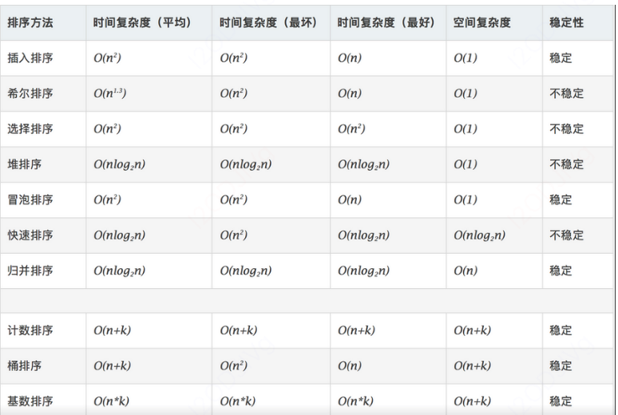

[toc]

# 排序算法



## 快速排序

> 先从数列中取出一个数作为“基准”。
> 分区过程：将比这个“基准”大的数全放到“基准”的右边，小于或等于“基准”的数全放到“基准”的左边。
> 再对左右区间重复第二步，直到各区间只有一个数。

+ 注意：m从1开始，要排除掉本身这个元素

```js
function fastquery(arr){
  if(arr.length<=1){
    return arr
  }
  let left=[];
  let right=[];
  let midval=arr[0];
  for(let m=1;m<arr.length;m++){
    if(arr[m]>midval){
      right.push(arr[m])
    }else{
      left.push(arr[m])
    }
  }
  return fastquery(left).concat([midval],fastquery(right))
}

let arr=[3,7,1,9,56,0,-5,2,-89]
console.log('results',fastquery(arr)) //(9)[-89, -5, 0, 1, 2, 3, 7, 9, 56]
```

+ 时间复杂度最好O(nlogn),最差O(n^2),空间复杂度O(nlogn),不稳定
+ 最差O(n^2),完全有序，取基准为第一个或者最后一个元素，需要进行n次切分区间的工作，每次分区平均需要扫描n/2个元素
+ 空间复杂度最好O(logn)，最坏:O(n)
+ 不稳定

### 三路快排

空间复杂度为1

+ 最后当i 走到 gt 处 即 gt==i 时 ;那就说明 除了第一个元素之外,其余的区间已经分区完毕,只要将首个元素与 lt 处的元素进行交换, 然后lt -1 ;我们就形成了想要的三个区间,小于v,等于v,然后是大于v的.

```js
// 交换元素
function swap(arr, a, b) {
  let temp = arr[a];
  arr[a] = arr[b];
  arr[b] = temp;
}

// 选择基准数字，大于基准数放在右侧，小雨放在左侧，相等则不调整， 返回左右指针的位置， 将基准数交换到正确的位置
function partion(arr, l, r) {
  let v = arr[l];
  let lt = l;
  let gt = r + 1;

  for (let i = l + 1; i < gt; ) {
    if (arr[i] == v) {
      i++;
    } else if (arr[i] > v) {
      swap(arr, gt - 1, i);
      gt--;
    } else {
      swap(arr, lt + 1, i);
      lt++;
      i++;
    }
  }

  swap(arr, l, lt);
  lt--;
  return { lt: lt, gt: gt };
}

function quicksort(arr, l, r) {
  // 只有l<r 才需要对元素进行处理
  if (l >= r) {
    return;
  }
  // 获取左右基准指标位置分别进行快排
  let obj = partion(arr, l, r);
  quicksort(arr, l, obj.lt);
  quicksort(arr, obj.gt, r);
  return arr
}

let arr=[3,7,1,9,56,0,-5,2,-89]
console.log('results',quicksort(arr,0,8)) //(9)[-89, -5, 0, 1, 2, 3, 7, 9, 56]
```

## 冒泡排序

>比较两个相邻的元素，如果后一个比前一个大，则交换位置
>
>第一轮的时候最后一个元素应该是最大的一个
>
>按照第一步的方法进行两个相邻的元素的比较，由于最后一个元素已经是最大的了，所以最后一个元素不用比较。

```js
let arr=[3,7,1,9,56,0,-5,2,-89]
console.log('results',bubblesort(arr))
//[-89, -5, 0, 1, 2, 3, 7, 9, 56]
function bubblesort(arr){
    for(let i=1;i<arr.length;i++){
        for(let j=0;j<arr.length-i;j++){
            if(arr[j+1]<arr[j]){
            //此过程可以简化[arr[j], arr[j+1]] = [arr[j+1], arr[j]];
                let temp=arr[j];
                arr[j]=arr[j+1];
                arr[j+1]=temp
            }
        }
    }
    return arr
}
```

+ 该算法的操作次数是一个等差数列 n + (n - 1) + (n - 2) + 1 ，去掉常数项以后得出时间复杂度是 O(n * n)，最优O(n)
+ 空间复杂度o(1)

## 选择排序

+ (理解)：假设当前位置元素为其后所有元素的最小元素，然后循环判断其后元素最小元素，与本位置元素进行交换，也就是每次未排序区域元素的最小值放在当前位置

```js
var arr = selectionSort([32,12,56,78,76,45,36]);
console.log(arr);   // [12, 32, 36, 45, 56, 76, 78]

function selectionSort(arr) {
    for (var i = 0; i < arr.length - 1; i++) {
        let minIndex = i;
        for (var j = i + 1; j < arr.length; j++) {
            if (arr[j] < arr[minIndex]) {     // 寻找最小的数
                minIndex = j;                 // 将最小数的索引保存
            }
        }
        [arr[i],arr[minIndex]]=[arr[minIndex],arr[i]]
    }
    return arr;
}
```

+ 时间复杂度o(n^2)

## 插入排序

将整个序列当作一个无序的序列，逐步构建有序的序列，把当前值插入到有序序列的合适的位置

```js
var arr = insertSort([32,12,56,78,76,45,36]);
console.log(arr);   // [12, 32, 36, 45, 56, 76, 78]

function insertSort (arr) {
    for (var i = 1;i < arr.length;i++){
        for(var j = i;j > 0;j--){
            // 当前值和之前的每个值进行比较，发现有比当前值小的值就进行交换
            if(arr[j]<arr[j-1]){
              [arr[j],arr[j-1]]=[arr[j-1],arr[j]]
            }
        }
    }
    return arr
}  
```

+ 时间复杂度，最好o(n),最差o(n^2)

## 归并排序

先把数组逐步分为最小的一个一个的元素，然后每两个元素比较大小，排序形成一个两个元素的数组，然后两个两元素的数组比较合并为一个四元素的数组，直到最终合成一个数组

```js
//比较合并的过程
function merge(leftArr, rightArr){  
    var result = [];  
    while (leftArr.length > 0 && rightArr.length > 0){  
      if (leftArr[0] < rightArr[0])  
        result.push(leftArr.shift()); //把最小的最先取出，放到结果集中，下一个元素变为了下表为0的元素  
      else   
        result.push(rightArr.shift());  
    }   
    return result.concat(leftArr).concat(rightArr);  //合并，可能存在左边或者右边有剩余的元素
}  
//数组分为子数组的过程
function mergeSort(array){  
    if (array.length == 1) return array;  
    var middle = Math.floor(array.length / 2);       //求出中点  
    var left = array.slice(0, middle);               //分割数组  
    var right = array.slice(middle);  
    return merge(mergeSort(left), mergeSort(right)); //递归合并与排序  
}  

var arr = mergeSort([32,12,56,78,76,45,36]);
console.log(arr);   // [12, 32, 36, 45, 56, 76, 78]
```

+ 时间复杂度，最优o(n),最差o(nlogn)

## 希尔排序

https://www.cnblogs.com/cc-freiheit/p/10983821.html

+ 选择一个增量序列 t1，t2，……，tk，其中 ti > tj, tk = 1；
+ 按增量序列个数 k，对序列进行 k 趟排序；
  每趟排序，根据对应的增量 ti，将待排序列分割成若干长度为 m 的子序列，分别对各子表进行直接插入排序。
+ 仅增量因子为 1 时，整个序列作为一个表来处理，表长度即为整个序列的长度

```
如步长设置为[5,3,1]
第一个步长为5，整个序列被分成5组数据进行比较，每组内部插入排序，也就是位置0与位置5进行比较，位置1与位置6进行比较直至结束
第二个步长3，新序列被分为3组进行插入排序
也就是新数组，位置0与位置3进行比较，位置1与位置4进行比较，...
最后一个步长为1，直接插入排序
```

```
function shellSort(arr) {
    var len = arr.length,
        temp,
        gap = 1;
    while(gap < len/3) {          //动态定义间隔序列，如第一个步长为gap=7,那么之后就是7，7/3，2/3
        gap = gap*3+1;
    }
    for (gap; gap > 0; gap = Math.floor(gap/3)) {
        //从i=7开始，逐步到arr.length
        for (var i = gap; i < len; i++) {
            temp = arr[i];
            //只与间隔为7的元素比较，也就是7与0比较，14与7比较，21与14比较...
            for (var j = i-gap; j >= 0 && arr[j] > temp; j -= gap) {
                arr[j+gap] = arr[j];
            }
            arr[j+gap] = temp;
        }
    }
    return arr;
}
```

+ 时间复杂度o(n(logn)^2)

# 1.岛屿数量

https://leetcode.cn/problems/number-of-islands/description/?favorite=2cktkvj

由 `'1'`（陆地）和 `'0'`（水）组成的的二维网格，计算网格中岛屿的数量， 岛屿总是被水包围，并且每座岛屿只能由水平方向和/或竖直方向上相邻的陆地连接形成

```js
输入：grid = [
  ["1","1","1","1","0"],
  ["1","1","0","1","0"],
  ["1","1","0","0","0"],
  ["0","0","0","0","0"]
]
输出：1
```

题解：

> 岛屿问题，固定套路 Flood fill 算法(在一个区域内，从某个点开始往外扩散找到与其联通的所有点，最终获得一个区域块,实现上通常为 DFS 或 BFS。)
>
> 

```js
function numIslands(grid) {
  const m = grid.length; //行
  const n = grid[0].length; //列
  let count = 0;
  for (let i = 0; i < m; i++) {
    for (let j = 0; j < n; j++) {
      if (grid[i][j] === '1') { // 发现岛屿的一部分
        count++;
        floodFill(grid, i, j);
      }
    }
  }
  return count;
};

// 深度遍历，找到的每一个为1的一直往深度扩展为1的全变为0，除非触及到了岛屿边界
function floodFill(grid, i, j) {
  const m = grid.length; //  行
  const n = grid[0].length; // 列
  if (i < 0 || i >= m || j < 0 || j >= n) return; // 跑到地图外了
  if (grid[i][j] === '0') return; // 到达岛屿边缘了

  grid[i][j] = '0'; // 淹没
  floodFill(grid, i - 1, j);
  floodFill(grid, i + 1, j);
  floodFill(grid, i, j - 1);
  floodFill(grid, i, j + 1);
}
```

## 岛屿的最大面积

找到给定的二维数组中最大的岛屿面积。如果没有岛屿，则返回面积为 `0` 。

> 计算每次淹没多少个1

```js
var maxAreaOfIsland = function(grid) {
    const m = grid.length;
    const n = grid[0].length;
    let maxNum =0;
    for(let i=0;i<m;i++){
        for(let j=0;j<n;j++){
          if(grid[i][j]===1){
              let areaOnly = fillflood(grid,i ,j)
              maxNum = areaOnly> maxNum? areaOnly: maxNum
          }
        }
    }
    return maxNum
};

function fillflood(grid,i ,j){
    const m = grid.length;
    const n = grid[0].length;
    if(i<0||i>=m || j<0 ||j>=n) return 0;
    if(grid[i][j]=== 0) return 0;
    grid[i][j] = 0
    return fillflood(grid,i-1 ,j)+ fillflood(grid,i+1 ,j)+ fillflood(grid,i ,j-1) + fillflood(grid,i ,j+1)+1
}
```


# 1.求连续最多的字符和次数

(1)嵌套循环

```js
export function findContinuousChar1(str: string): IRes {
    const res: IRes = {
        char: '',
        length: 0
    }
    const length = str.length
    if (length === 0) return res

    let tempLength = 0 // 临时记录当前连续字符的长度
    // O(n)
    for (let i = 0; i < length; i++) {
        tempLength = 0 // 重置
        for (let j = i; j < length; j++) {
            if (str[i] === str[j]) {
                tempLength++
            }
            if (str[i] !== str[j] || j === length - 1) {
                // 不相等，或者已经到了最后一个元素。要去判断最大值
                if (tempLength > res.length) {
                    res.char = str[i]
                    res.length = tempLength
                }

                if (i < length - 1) {
                    i = j - 1 // 跳步
                }

                break
            }
        }
    }

    return res
}

```

(2)双指针

```JS
export function findContinuousChar2(str: string): IRes {
    const res: IRes = {
        char: '',
        length: 0
    }

    const length = str.length
    if (length === 0) return res

    let tempLength = 0 // 临时记录当前连续字符的长度
    let i = 0
    let j = 0

    // O(n)
    for (; i < length; i++) {
        if (str[i] === str[j]) {
            tempLength++
        }

        if (str[i] !== str[j] || i === length - 1) {
            // 不相等，或者 i 到了字符串的末尾
            if (tempLength > res.length) {
                res.char = str[j]
                res.length = tempLength
            }
            tempLength = 0 // reset

            if (i < length - 1) {
                j = i // 让 j “追上” i
                i-- // 细节
            }
        }
    }

    return res
 }
```

# 2.移动0到数组末尾

[leetcode [283. 移动零](https://leetcode.cn/problems/move-zeroes/)]

```
输入: nums = [0,1,0,3,12]
输出: [1,3,12,0,0]
```

要求：在原数组的基础上修改，不能使用新数组

+ 思路1：循环一次，是0则push到数组末尾，然后把当前位置0通过splice删除掉

  ```js
  var moveZeroes = function(nums) {
     for(let i = 0, zerolen = 0; i<nums.length-zerolen;i++){
         if(nums[i]===0){
             nums.push(nums[i])
             nums.splice(i,1)
             i--
             zerolen++
         }
     }
  };
  ```

  + 该方法时间复杂度是O(n^2)，一次是循环，一次是splice，数组是有序存储的，当一个位置元素被删除之后，它后边的元素都要往前挪动一个位置，也就是splice本身在删除的时候复杂度就是O（n）
  + zerolen末尾补0的个数，确定是补进去的0，就不需要再次循环遍历了
  + i--，splice之后要往回挪动一次，抵消splice的影响

+ 考虑另一种思路，双指针，j指向第一个0的位置，i指向j之后第一个不为0的位置，交换位置，然后j继续向后移动，此时时间复杂度为O（n）

  ```js
  var moveZeroes = function(nums) {
     let i;
     let j =-1;
     for(let i=0;i<nums.length;i++){
         if(nums[i]===0 && j<0){
             j=i
         }
         if(nums[i]!==0 && j>=0){
             const n = nums[i]
             nums[i]= nums[j]
             nums[j]=n
             j++
         }
     }
  };
  ```

# 3.**和为S的两个数字**

[**JZ57**]

输入：

```
[1,2,4,7,11,15],15
```

返回值：

```
[4,11]
```

思路：**递增序列**，使用双指针

```js
function FindNumbersWithSum(array, sum)
{
    if(array.length===0){
        return []
    }
    let leftHead = 0
    let rightHead = array.length-1
    while(leftHead<rightHead){
        if(array[leftHead]+array[rightHead]===sum){
            return [array[leftHead],array[rightHead]]
        }
        if(array[leftHead]+array[rightHead]<sum){
        leftHead=leftHead+1
        }
        if(array[leftHead]+array[rightHead]>sum){
            rightHead=rightHead-1
        }
    }
    return []
}
```

# 4.左旋转字符串

【JZ58】S = ”abcXYZdef” , 要求输出循环左移 3 位后的结果，即 “XYZdefabc” ，"aab",10输出"aba"

【思路】：计算需要移动的数量，切割并拼接

```js
function LeftRotateString(str, n)
{
    if (!str){
        return ''
    }
    if(str.length === 0 || n===0){
        return str
    }
    let num = n % str.length
    let leftSubStr = str.slice(0, num)
    let rightSubStr = str.slice(num)
    return rightSubStr+leftSubStr
}
```

# 5.寻找1-100以内所有回文数

回文数：121

解法1：通过字符串判断

```js
function findNumber(max){
       let arr =[]
       for(let i =1;i<=max;i++){
         if((i+'').split('').reverse().join('')===i+''){
            arr.push(i)
         }
       }
       return arr
     }
```

解法2：数字直接反转

```js
function findNumber2(max){
       let arr =[]
       for(let i =1;i<=max;i++){
         // 比如1234直接反转为4321
         let n = i
         let revNumber = 0
         while(n>0){
           revNumber = revNumber*10 + n%10
           n = Math.floor(n/10)
         }
         if(i === revNumber){
           arr.push(i)
         }
       }
       return arr
     }
```

性能比较:

```js
console.time('findNumber')
console.log('findNumber', findNumber(100)) //0.810302734375 ms
console.timeEnd('findNumber')

console.time('findNumber2')
console.log('findNumber2', findNumber2(100)) //0.345947265625 ms
console.timeEnd('findNumber2')
```

结论：尽量不要去改变原有的数据结构

# 6.LRU

```js
export default class LRUCache {
    private length: number
    private data: Map<any, any> = new Map()

    constructor(length: number) {
        if (length < 1) throw new Error('invalid length')
        this.length = length
    }

    set(key: any, value: any) {
        const data = this.data

        if (data.has(key)) {
            data.delete(key)
        }
        data.set(key, value)

        if (data.size > this.length) {
            // 如果超出了容量，则删除 Map 最老的元素
            const delKey = data.keys().next().value
            data.delete(delKey)
        }
    }

    get(key: any): any {
        const data = this.data

        if (!data.has(key)) return null

        const value = data.get(key)

        data.delete(key)
        data.set(key, value)

        return value
    }
}
```


[toc]
# 面试编程题目
## 必看系列

### 继承的实现与比较

#### 原型链继承(一般不用)
+ 主要思想，子类的原型=父类的实例
+ 父类变量用构造函数，方法用原型定义


```
function Father2(){
    this.colors=['1','a']
}
function Child2(){
}
Child2.prototype=new Father2()
var ch=new Child2()
ch.colors.push('9')
var ch2=new Child2()
console.log(ch2.colors)  //['1','a','9']
var fa2=new Father2()
console.log(fa2.colors)  //['1','a']
```

存在的问题
+ 无法向父类传值
+ 子类之间修改某些引用变量的时候，会全部受到影响

#### 构造函数继承
主要思想，子类里：父类.call(this,参数)，方法在父类this.getname=这样定义

```
function Father(name, age){
	this.name = name;
	this.age = age;
	this.getName = function(){
		return this.name;
	}
	this.getAge = function(){
		return this.age;
	}
}
function Child(name, age, skill){
	Father.call(this, name, age);
	this.skill = skill
}
var child = new Child('zhangsan', 20, 'dance');
console.log(child.getName())
```
优点：
+ 子类每次都创建一个新的实例，值互不影响，避免了引用类型的属性被所有实例共享，也解决了不能传参的问题。

缺点：
构造函数，都是this.getitem=function(){}这种，函数无法复用
*****************************
#### 组合继承(常用)
主要思想：
子类里：1.父类.call(this,参数)进行传值,修改某些量; 2.函数定义在原型上，然后子类.原型=父类的实例实现复用,使用父类.call

```
function Father(name){
    this.colors=['1','3','5']
    this.name=name
}
function Child(name){
    Father.call(this,name)
}
Child.prototype=new Father()

Child.prototype.getName=function(){
    console.log(this.name)
}

var ch1=new Child('1')
ch1.colors.push('red')
console.log(ch1.colors) //["1", "3", "5", "red"]
console.log(ch1.getName()) //1

var ch1=new Child('2')
console.log(ch1.colors) //["1", "3", "5"]
console.log(ch1.getName())//2

var fa=new Father()
console.log(fa.getName()) //undefined
```
缺点：Child构造函数执行了两次
#### 原型式继承
主要思想 object.create

```
function object(o){
    function F(){}
    F.prototype=o
    return new F()
}
//创建一个空构造函数，传入的对象作为它的原型，返回新实例，相当于浅拷贝
```
后来把object规范为了object.create()

```
var father={
    name:'li',
    friends:['1','2']
}

father.friends.push('father')
var ch1=Object.create(father)
ch1.name="ch1"
ch1.friends.push('ch1')
console.log(ch1.name,ch1.friends) // ch1 (4)["1", "2", "father", "ch1"]

var ch2=Object.create(father)
ch2.name="ch2"
console.log(ch2.name,ch2.friends)//ch2 (4)["1", "2", "father", "ch1"]
```
+ 引用类型的值会互相影响
**********************
#### 5.寄生式继承
主要思想：object重写，加上对函数的支持

```
var father={
    name:'li',
    friends:['1','2']
}

function createAnother(o){
    var clone=object(o)
    clone.sayhi=function(){
        alert('hi')
    }
    return clone
}

var ch=createAnother(o)
o.sayhi()
```
****************************
#### 寄生组合式(最有效)
主要思想：重写object.create,配合父类.call(this),子类.prototype=父类实例
+ 组合式(call,原型),继承（重写的object.create）
```
//object.create
function inheritObject(o) {
  //声明一个过渡对象
  function F() { }
  //过渡对象的原型继承父对象
  F.prototype = o;
  //返回过渡对象的实例，该对象的原型继承了父对象
  return new F();
}

//新的
function inheritPrototype(subClass,superClass) {
    // 复制一份父类的原型副本到变量中
  var p = inheritObject(superClass.prototype);
  // 修正因为重写子类的原型导致子类的constructor属性被修改
  p.constructor = subClass;
  // 设置子类原型
  subClass.prototype = p;
}
```

```
function SuperClass(name) {
  this.name = name;
  this.books=['js book','css book'];
}
SuperClass.prototype.getName = function() {
  console.log(this.name);
}
function SubClass(name,time) {
  SuperClass.call(this,name);
  this.time = time;
}
inheritPrototype(SubClass,SuperClass);
SubClass.prototype.getTime = function() {
  console.log(this.time);
}
var instance1 = new SubClass('React','2017/11/11')
var instance2 = new SubClass('Js','2018/22/33');

instance1.books.push('test book');

console.log(instance1.books,instance2.books); //["js book", "css book", "test book"] (2)["js book", "css book"]
instance2.getName();//JS
instance2.getTime();//'2018/22/33'
```

```
function Parent(value) { 
  this.val = value
} 
Parent.prototype.getValue = function() {
  console.log(this.val)
} 
function Child(value) { 
  Parent.call(this, value) 
} 
Child.prototype = Object.create(Parent.prototype, {  constructor: { 
  value: Child, 
  enumerable: false, 
  writable: true, 
  configurable: true 
} 
}) 
const child = new Child(1)
child.getValue() // 1 23. 
child instanceof Parent // true
```
*********
### class继承
内部还是原型的继承
+ 方法之间不用逗号
+ 用new实例化
+ 原本属性用this分别为每个实例创建属性，方法在原型上功能共用，减少内存的使用，class的方法则直接放在了原型上
```
class Parent { 
  constructor(value) { 
    this.val = value 
  } 
  getValue() { 
    console.log(this.val) 
  } 
} 
class Child extends Parent { 
  constructor(value) { 
      super(value) 
      this.val = value 
  } 
} 
let child = new Child(1) 
child.getValue() // 1 
child instanceof Parent // tru
```
********************
## 实测其它算法题目
### 2.数组乱序洗牌算法

```
var arr = [1, 2, 3, 4, 5, 6];

function sort(arr) {
    var newArr = [];
    for(var i = 0, len = arr.length; i < len; i++) {
        var j = Math.floor(Math.random() * (len - i));
        newArr[i] = arr[j];
        arr.splice(j, 1)
    }
    return newArr;
}
```

*********************
## 版本号维护
+ sort方法

```
var versions=['1.45.0','1.5','6','3.3.3.3.3'];
function sortVersion(versions){
  let res=versions.sort((a,b)=>{
    let aa=a.split('.');
    let bb=b.split('.');
    let length=Math.max(aa.length,bb.length);
    for(let i=0;i<length;i++){
      let x=aa[i]||0;
      let y=bb[i]||0;
      if(x!==y){
        return x-y
      }
    }
  })
  return res
}
console.log(sortVersion(versions))
```

***********************
## 手写轮播图完整版
大体思路： 先创建一个div，限定其宽度和高度，overflow：hidden，且设置其position为relative。然后创建一个装图片的div，宽度为所有图片的总宽度，且设置其position为absolute，并且使其中的内容浮动，这样所有的图片就处于一行中。然后为了实现无缝滚动，所以需要在首尾分别添加一张过渡图片。 先添加两个按钮， 使其可以手动轮播，然后只需要添加一个定时器使其朝一个方向自动轮播即可，因为用户有时需要查看详情，所以当鼠标进入时就clear定时器，滑出再定时播放。为了更好地用户体验，我们再下面添加了一排小圆点，用户可以清楚地知道现在所处的位置， 最后， 利用闭包使得用户可以直接通过点击小圆点切换图片

```
<!DOCTYPE html>
<html>
<head>
    <meta charset="UTF-8">
    <title>轮播图</title>
    <style>
        * {
            margin:0;
            padding:0;
        }
        a{
            text-decoration: none;
        }
        .container {
            position: relative;
            width: 600px;
            height: 400px;
            margin:100px auto 0 auto;
            box-shadow: 0 0 5px green;
            overflow: hidden;
        }
        .container .wrap {
            position: absolute;
            width: 4200px;
            height: 400px;
            z-index: 1;
        }
        .container .wrap img {
            float: left;
            width: 600px;
            height: 400px;
        }
        .container .buttons {
            position: absolute;
            right: 5px;
            bottom:40px;
            width: 150px;
            height: 10px;
            z-index: 2;
        }
        .container .buttons span {
            margin-left: 5px;
            display: inline-block;
            width: 20px;
            height: 20px;
            border-radius: 50%;
            background-color: green;
            text-align: center;
            color:white;
            cursor: pointer;
        }
        .container .buttons span.on{
            background-color: red;
        }
        .container .arrow {
            position: absolute;
            top: 35%;
            color: green;
            padding:0px 14px;
            border-radius: 50%;
            font-size: 50px;
            z-index: 2;
            display: none;
        }
        .container .arrow_left {
            left: 10px;
        }
        .container .arrow_right {
            right: 10px;
        }
        .container:hover .arrow {
            display: block;
        }
        .container .arrow:hover {
            background-color: rgba(0,0,0,0.2);
        }
    </style>
</head>
<body>
    <div class="container">
        <div class="wrap" style="left: -600px;">
            
            
            
            
            
            
            
        </div>
        <div class="buttons">
            <span class="on">1</span>
            <span>2</span>
            <span>3</span>
            <span>4</span>
            <span>5</span>
        </div>
        <a href="javascript:;" class="arrow arrow_left"><</a>
        <a href="javascript:;" class="arrow arrow_right">></a>
    </div>
    <script>
        var wrap = document.querySelector(".wrap");
        var next = document.querySelector(".arrow_right");
        var prev = document.querySelector(".arrow_left");
        next.onclick = function () {
            next_pic();
        }
        prev.onclick = function () {
            prev_pic();
        }
        function next_pic () {
            index++;
            if(index > 4){
                index = 0;
            }
            showCurrentDot();
            var newLeft;
            if(wrap.style.left === "-3600px"){
                newLeft = -1200;
            }else{
                newLeft = parseInt(wrap.style.left)-600;
            }
            wrap.style.left = newLeft + "px";
        }
        function prev_pic () {
            index--;
            if(index < 0){
                index = 4;
            }
            showCurrentDot();
            var newLeft;
            if(wrap.style.left === "0px"){
                newLeft = -2400;
            }else{
                newLeft = parseInt(wrap.style.left)+600;
            }
            wrap.style.left = newLeft + "px";
        }
        var timer = null;
        function autoPlay () {
            timer = setInterval(function () {
                next_pic();
            },2000);
        }
        autoPlay();

        var container = document.querySelector(".container");
        container.onmouseenter = function () {
            clearInterval(timer);
        }
        container.onmouseleave = function () {
            autoPlay();    
        }

        var index = 0;
        var dots = document.getElementsByTagName("span");
        function showCurrentDot () {
            for(var i = 0, len = dots.length; i < len; i++){
                dots[i].className = "";
            }
            dots[index].className = "on";
        }

        for (var i = 0, len = dots.length; i < len; i++){
            (function(i){
                dots[i].onclick = function () {
                    var dis = index - i;
                    if(index == 4 && parseInt(wrap.style.left)!==-3000){
                        dis = dis - 5;     
                    }
                    //和使用prev和next相同，在最开始的照片5和最终的照片1在使用时会出现问题，导致符号和位数的出错，做相应地处理即可
                    if(index == 0 && parseInt(wrap.style.left)!== -600){
                        dis = 5 + dis;
                    }
                    wrap.style.left = (parseInt(wrap.style.left) +  dis * 600)+"px";
                    index = i;
                    showCurrentDot();
                }
            })(i);            
        }
    </script>
</body>
</html>
```


*************
## 闭包
### 实现一个计数器

```
var count = (function() {
var counter = 0
return function() {
  return (++counter)
}
})()
```

## 其它基础题目
### 4.立即执行函数输出什么

```
var b = 10;
(function b(){
    b = 20;
    console.log(b); 
})();
```

```
//结果
ƒ b(){
    b = 20;
    console.log(b); 
}
```
+ 立即执行函数是**函数表达式**而不是函数声明，开头第一个为（，只有开头为function才是函数表达式。
+ 函数声明的函数名会被绑定在作用域里，而函数表达式的函数命会被绑定在函数自身的函数体内，不会污染外部变量,
+ 在函数表达式内部只能通过函数名访问，不能通过函数名重新赋值，b=20无效，严格模式下会报错。

```
var b = 10;
(function b(){
   "use strict"
    b = 20;
    console.log(b); 
})();
VM9539:4 Uncaught TypeError: Assignment to constant variable
```
+ 内部var

```
var b = 10;
(function b(){
    var b = 20;
    console.log(b); 
})();
//20
```
var b在函数内部声明了一个局部变量,b=20，顺着作用域向上找，在函数内部找到了局部变量b，修改为20，console.log(b)同理，因此为20

b=20,顺着作用域向上找，找到的是函数b，函数表达式的函数名是常量const，不能用20给函数b赋值，只能静默失效或者严格模式下报错。

*******
#### 简单改造，分别输出10和20

```
var b = 10;
(function b(){
    b = 20;
    console.log(b); 
})();
```

```
//输出10
//传入window或者this
var b = 10;
(function b(){
    b = 20;
    console.log(window.b); 
})(window);

//
var b = 10;
(function b(){
    b = 20;
    console.log(this.b); 
})();
```

```
//输出20
var b = 10;
(function b(){
    var b = 20;
    console.log(b); 
})();
```
********
#### 涉及全局变量

```
var a = 10;
(function () {
    console.log(a)
    a = 5
    console.log(window.a)
    var a = 20;
    console.log(a)
})()
```

```
// undefined 
// 10
// 20

var a; // undefined
a = 10;
(function () {
var a; // undefined
console.log(a)
a = 5
console.log(window.a)
a = 20;
console.log(a)
})()
```
扩展

```
var a = 10;
(function () {
    console.log(a)
    a = 5
    console.log(window.a)
    console.log(a)
})()
// 10 5 5
```
***
### 5.涉及原型输出什么
#### 原型链

```
function Foo(){}
let foo=new Foo();
console.log(foo.__proto__);//{constructor:Foo(),__proto__:object}
console.log(foo.__proto__.__proto__)//object
console.log(foo.__proto__.__proto__.__proto__)//null
console.log(Foo.prototype);//{constructor:Foo(),__proto__:object}
```
#### 例子1

```
// 只是 Foo 的构建方法，没有产生实例，此刻也没有执行
function Foo() {
    Foo.a = function() {
        console.log(1)
    }
    this.a = function() {
        console.log(2)
    }
}
//在 Foo 上挂载了原型方法 a ，方法输出值为 3
Foo.prototype.a = function() {
    console.log(3)
}
//在 Foo 上挂载了直接方法 a ，输出值为 4
Foo.a = function() {
    console.log(4)
}
Foo.a(); //4

/* 这里调用了 Foo 的构建方法。Foo 的构建方法主要做了两件事：
1. 产生了Foo的实例，将全局的 Foo 上的直接方法 a 替换为一个输出 1 的方法。
2. 在新对象上挂载直接方法 a ，输出值为 2。
*/
let obj = new Foo();
obj.a(); //2
Foo.a(); //1
```
#### 例子2

```
   var F=function(){};
   Object.prototype.a=function(){console.log('a')}
   Function.prototype.b=function(){console.log('b')}
   var f=new F();
   f.a();//a
   f.b();//不存在,原型是Object
   F.a();//a
   F.b();//b
```
#### 例子3

```
function Person(){
     
}
Person.prototype.name = 'xmi';
Person.age = 21;
var a = new Person();
console.log(a.age); 
//由于age属于构造函数的私有属性，是不能通过new一个新对象去继承的，所以这里应该打印undefined。
```


*****
### 6.setTimeout改进，尽可能多方法及理由
+ 注意要把i传入

```
改造下面的代码，使之输出0 - 9
```

```
//let 变量的特性 — 
//在每一次 for 循环的过程中，let 声明的变量会在当前的块级作用域里面（for 循环的 body 体，也即两个花括号之间的内容区域）创建一个文法环境（Lexical Environment），
该环境里面包括了当前 for 循环过程中的 i


for (let i = 0; i< 10; i++){
	setTimeout(() => {
		console.log(i);
    }, 1000)
}
等价于
for (let i = 0; i < 10; i++) {
  let _i = i;// const _i = i;
  setTimeout(() => {
    console.log(_i);
  }, 1000)
}
//利用 setTimeout 函数的第三个参数，会作为回调函数的第一个参数传入
for (var i = 0; i< 10; i++){
	setTimeout((i) => {
		console.log(i);
    }, 1000,i)
}

for (var i = 0; i< 10; i++){
	(function(i){setTimeout(() => {
		console.log(i);
    }, 1000)
    })(i)
}
```
bind，apply,call都可

```
for (var i = 0; i < 10; i++) {
  setTimeout(console.log.bind(Object.create(null), i), 1000)
}
```
eval

```
for (var i = 0; i < 10; i++) {
  setTimeout(eval('console.log(i)'), 1000)
}
```
try...catch块级作用域

```
for(var i = 0; i < 10; i++){ 
  try{
     throw i;
  }catch(i){
     setTimeout(() => { console.log(i); },1000)    
  }
}
```
用promise相关

```
//利用promise包装setTimeout
for (var i = 0; i < 10; i++) {
    timeoutPromise(i);
}
function timeoutPromise(i) {
    return new Promise((resolve) => {
        setTimeout(() => {
            console.log(i);
            resolve(true);
        }, 1000);
    });
}

// 用generator函数
for (var i = 0; i < 10; i++) {
    timeoutGenerator(i).next();
}
function* timeoutGenerator (i) {
    yield setTimeout(() => {
        console.log(i);
    }, 1000);
}

//  await async
async function init () {
    for (var i = 0; i < 10; i++) {
        await timeoutPromise(i);
    }    
}
function timeoutPromise (i) {
    return new Promise((resolve) => {
        setTimeout(() => {
            console.log(i);
            resolve(true);
        }, 1000);   
    });
}
init();
```
emmm..不用setTimeout

```
for (let i = 0; i< 10; i++){
  console.log(i);
}
```
with延长作用域

```
for (var i = 0; i< 10; i++){
    with(new Number(i)){
        setTimeout(() => {
            console.log(valueOf());
        }, 1000)
    }
}
```
******
### 7.下面代码中 a 在什么情况下会打印 1

```
var a = ?;
if(a == 1 && a == 2 && a == 3){
 	console.log(1);
}
```
+ 因为==会进行隐式类型转换 所以我们重写toString方法就可以了

```
let a = {
  i: 1,
  toString () {
    return a.i++
  }
}

if(a == 1 && a == 2 && a == 3) {
  console.log(1);
}
```

```
let a = {
  i: 1,
  valueOf () {
    return a.i++
  }
}

if(a == 1 && a == 2 && a == 3) {
  console.log(1);
}
```

+ proxy

```
Object.defineProperty(window, 'a', {
    get: function() {
          return this.value = this.value ? (this.value += 1) : 1;
    }
});
if(a == 1 && a == 2 && a == 3) {
  console.log(1);
}
```

****
## 变量提升

```
   var a = 0;
    function B(){
        console.log(a);
        var a = 3;
        console.log(a);
        return function(){
            console.log(a++);
        }
    }
    var C = B();
    C();
```
输出undefined,3,3,a++是先输出再自加，++a则输出4
****
### 8.引用类型的输出
+ 对象的键名只能是字符串和 Symbol 类型。
+ 其他类型的键名会被转换成字符串类型。
+ 对象转字符串默认会调用 toString 方法。

```
//123被转换为‘123’
var a={}, b='123', c=123;  
a[b]='b';
a[c]='c';  
console.log(a)
console.log(a[b]);//c
```

```
var a={}, b=Symbol('123'), c=Symbol('123');  
a[b]='b';
a[c]='c';  
console.log(a) //{Symbol(123): "b", Symbol(123): "c"}
console.log(a[b]);//b
```

```
var a={}, b={key:'123'}, c={key:'456'};  
a[b]='b';
a[c]='c';  
console.log(a) //{[object Object]: "c"}
console.log(a[b]);//c
```

******

## this输出什么
+ 例1
```
var a=2;
var obj={
 a:1,
 b:this.a,
 fun:function(){
   console.log(this);
   console.log(this.b);
}
}
obj.fun();
//{a: 1, b: 2, fun: ƒ}、
//2
```
+ 例2

```
let test={
  name:'zuoyebang',
  age:6,
  say:function(){
    return this.name+this.age
  },
  hello:()=>{this.name+this.age}
}
console.log(test.say(),test.hello())
//zuoyebang6
//undefined
```


*************
## 普通算法


### abbbaca => aaca => ca 
+ 注意点：replace不是在原本的值基础上改的，需要新的变量承载才是改变之后的值
+ 要用break
```
function clearrepeat(str){
    if(str.length<2){
        return str
    };
    for(let i=0;i<str.length;i++){
        let cur=str[i];
        for(let j=i+1;j<str.length;j++){           
            if(str[i]!==str[j]){
                if(j-i>1){
                    let newstr=str.replace(str.substring(i,j),'')
                    str=clearrepeat(newstr);
                }else{
                    break;
                }
            }
        }
    }
    return str
}
let str='abbbaca'
console.log(clearrepeat(str))
```


### 复原IP地址(leetcode 93)
给定一个只包含数字的字符串，复原它并返回所有可能的 IP 地址格式。
有效的 IP 地址正好由四个整数（每个整数位于 0 到 255 之间组成），整数之间用 '.' 分隔。

```
输入: "25525511135"
输出: ["255.255.11.135", "255.255.111.35"]
```

```
var restoreIpAddresses = function(s) {
  let ans=[];
  if(!s){
      return ans
  }
  back(s,0,[],ans)
  return ans
};

function back(s,pos,cur,ans){
    if(cur.length==4){
        if(pos==s.length){
            ans.push(cur.join('.'))
        }
        return;
    }

    for(let i=1;i<=3;i++){
        if(pos+i>s.length){
            break;
        }
        let segment=s.substring(pos,pos+i);
        if(segment.startsWith('0')&& segment.length>1 || i==3 && parseInt(segment)>255){
            continue;
        }
        cur.push(segment)
        back(s,pos+i,cur,ans)
        cur.pop();
    }
}    
   
```
**************
## promise型编程


### Queue编程题

```
new Quene()
  .task(1000, () => {
    console.log(1)
  })
  .task(6000, () => {
    console.log(2)
  })
  .task(1000, () => {
    console.log(3)
  })
  .start()
```
+ 注意的地方
+ return this,因为要实现链式调用
+ list[i].fn()，函数要执行的
```
function Quene(value){
    this.queue=[]
}

Quene.prototype.task=function(delay,fn){
    this.queue.push({delay,fn})
    return this
}

Quene.prototype.start=function(){
    const list=this.queue;
    async function run(){
        for(let i=0;i<list.length;i++){
            await new Promise((resolve,reject)=>{
                setTimeout(function(){
                    resolve(list[i].fn())
                },list[i].delay)
            })
        }
    }
    run()
}
```

### 实现一个chain,

eat函数打印eat，work函数打印work，sleep函数休息 

```
实现一个chain, eat函数打印eat，work函数打印work，sleep函数休息 
```

```
function chain() {
    const list = []
    setTimeout(async() => {
        for (let i = 0; i < list.length; i++) {
            if (list[i].type !== 'sleep') {
                list[i].fn()
            } else {
                await list[i].fn()
            }
        }
    }, 0)
    const obj = {
        eat: () => {
            list.push({
                type: 'eat',
                fn: () => { console.log('eat') }
            })
            return obj
        },
        work: () => {
            list.push({
                type: 'work',
                fn: () => { console.log('work') }
            })
            return obj
        },
        sleep: (time) => {
            list.push({
                type: 'sleep',
                fn: () => new Promise((resolve) => {
                    setTimeout(() => { resolve() }, time * 1000)
                })
            })
            return obj
        }
    }
    return obj
}
```
******
### 实现array的链式操作，数组大于10的值进行累加

```
[19,2,5,7,54].reduce((acc,cur,index,arr)=>{
    if(cur>10){
        acc+=cur
    }
    return acc
},0)
```
******
### node的Events模块
+ on事件搜集回调
+ emit事件触发执行

```
function Events(){
    this.on=function(eventName,callBack){
        if(!this.handles){
            this.handles={};
        }
        if(!this.handles[eventName]){
            this.handles[eventName]=[];
        }
        this.handles[eventName].push(callBack);
    }
    this.emit=function(eventName,obj){
        if(this.handles[eventName]){
            for(var i=0;i<this.handles[eventName].length;i++){
            this.handles[eventName][i](obj);
            }
        }
    }
    return this;
}
var events=new Events();
 events.on('say',function(name){
    console.log('Hello',name)
 });
 events.emit('say','Jony yu');
 //结果就是通过emit调用之后，输出了Jony yu
```

*****************
## 函数柯里化
### 实现一个 add 函数


```
function add(){
	let args = [...arguments];
	let addfun = function(){
		args.push(...arguments);
		return addfun;
	}
	addfun.toString = function(){
		return args.reduce((a,b)=>{
			return a + b;
		});
	}
	return addfun;
}

console.log(add(1))
console.log(add(1)(2))	
console.log(add(1)(2)(3));
console.log(add(1)(2, 3)); 
console.log(add(1, 2)(3)); 
console.log(add(1, 2, 3));
```

### sum(1)(2)(3)...(n).valueOf()

计算从1到n的累加和
> 闭包，柯里化

```
//sum(1)(2)(3)...(n).valueOf() 计算从1到n的累加和
function sum(a){
    let result = a 
    function add(b){
        result += b
        return add
    }
    add.valueOf = function(){
        return result
    }
    return add
}
console.log(sum(1)(2)(4).valueOf())
```
扩展：sum(1)(2)(3)...(n)() 解决方案

```
let sum = function(a){
    return function(b){
        if(b){ // 这里可以过滤掉 b 是0的情况,换成if(b!==undefined)这样就可以接受0了
            return sum(a+b)
        }else{
            return a
        }
    }
}
```

******************
## 数组
### 数组里面有10万个数据，取第一个元素和第10万个元素的时间相差多少


数组可以直接根据索引取的对应的元素，所以不管取哪个位置的元素的时间复杂度都是 O(1)，Chrome 浏览器JS引擎 V8中，数组有两种存储模式，一种是类似C语言中的线性结构存储（索引值连续，且都是正整数的情况下），一种是采用Hash结构存储（索引值为负数，数组稀疏，间隔比较大

得出结论：消耗时间几乎一致，差异可以忽略不计


### 两个数组的交集
+ Array.from()可以把很多类型转换为数组
```
var intersection = function(nums1, nums2) {
    let results=[]
    for(let i=0;i<nums1.length;i++){
        for(let j=0;j<nums2.length;j++){
            if(nums1[i]==nums2[j]){
                results.push(nums1[i])
            }
        }
    }
    
    return Array.from(new Set(results))
};
```
+ 改动：数组里搜索复杂度是O(n),但是Map(),Set()里的.has()复杂度是O(1)

```
var intersection = function(nums1, nums2) {
    let results=new Set();
    let set2=new Set(nums2)
    for(i of nums1){
        if(set2.has(i)){
           results.add(i);
        }
    }
    return Array.from(results)
};
```
******
### 改动：数组交集，包含重复值

```
例如：给定 nums1 = [1, 2, 2, 1]，nums2 = [2, 2]，返回 [2, 2]
```
思路：用一个对象存储个数，当个数大于等于1，才是重复数据，每次比较之后重复数字减一
```
function fn(a,b){
    let results=[];
    let obj={}
    a.map(item=>{
       obj[item]?obj[item]++:obj[item]=1
    })
    for(let i=0;i<b.length;i++){
        if(obj[b[i]]>=1){
            results.push(b[i]);
            obj[b[i]]--
        }
    }
    return results
}
console.log(fn([1, 2, 1], [2, 2, 1])) // [2, 1]
```
****
### 合并区间(leetcode)

```
输入: [[1,3],[2,6],[8,10],[15,18]]
输出: [[1,6],[8,10],[15,18]]
解释: 区间 [1,3] 和 [2,6] 重叠, 将它们合并为 [1,6].
```
思路如下
```
let arr=[[1,3],[2,6],[8,10],[15,18]];

function merge(arr){
    //只有一个区间或者为空
    if(arr.length<2){
        return arr
    }
    //arr数组按第一个升序来排序[[2,6],[1,3]]排序为[[1,3],[2,6]]
    arr.sort(function(a,b){
        return a[0]-b[0]
    })
    //cur用来保存当前的区间范围
    let cur=arr[0]
    let res=[]
    for(item of arr){
        //可以合并,得到新区间cur
        if(item[0]<=cur[1]){
            cur[1]=Math.max(cur[1],item[1])
        }else{
            //旧的push到结果里,新的cur为当前区间
            res.push(cur);
            cur=item
        }
    }
    res.push(cur)
    return res
}

console.log(merge(arr))
```
********
### 两个有序数组的中位数
找出这两个有序数组的中位数，要求算法的时间复杂度为 O(log(m+n))。

```
示例 1：

nums1 = [1, 3]
nums2 = [2]

中位数是 2.0

示例 2：

nums1 = [1, 2]
nums2 = [3, 4]

中位数是(2 + 3) / 2 = 2.5
```

+ 思路，两个有序数组，按照归并排序的思路，得到一个数组，然后取中间的一个或者两个的平均


```
let num1=[1, 3],num2 = [2]

function findmedium(num1,num2){
    let res=[];
    while(num1.length && num2.length){
        if(num1[0]>num2[0]){
            res.push(num2[0]);
            num2.shift()
        }
        if(num1[0]<num2[0]){
            res.push(num1[0]);
            num1.shift()
        }
    }
    if(num1.length==0){
         res=res.concat(num2)
    }
    if(num2.length==0){
         res=res.concat(num1)
    }
    return res.length%2==0?(res[res.length/2]+res[res.length/2-1])/2:res[Math.floor(res.length/2)]
}

console.log(findmedium(num1,num2))
```
+ 注意中位数的概念
+ 当为偶数个时，是res.length/2与res.length/2-1对应值的平均，为奇数个时，要向下取整Math.floor(res.length/2)

*******
### 旋转数组(leetcode 189)
给定一个数组，将数组中的元素向右移动 k 个位置，其中 k 是非负数。

```
输入: [1, 2, 3, 4, 5, 6, 7] 和 k = 3
输出: [5, 6, 7, 1, 2, 3, 4]
解释:
向右旋转 1 步: [7, 1, 2, 3, 4, 5, 6]
向右旋转 2 步: [6, 7, 1, 2, 3, 4, 5]
向右旋转 3 步: [5, 6, 7, 1, 2, 3, 4]
```

```
var rotate = function(nums,k) {
    for(var i = 0;i<k;i++){
        nums.unshift(nums.pop());
    }
}
```
********
### 长度最小的子数组(leetcode 209)

```
给定一个含有 n 个正整数的数组和一个正整数 s ，找出该数组中满足其和 ≥ s 的长度最小的 连续 子数组，并返回其长度。如果不存在符合条件的子数组，返回 0。

输入：s = 7, nums = [2,3,1,2,4,3]
输出：2
解释：子数组 [4,3] 是该条件下的长度最小的子数组。
```

+ 滑动窗口的思想

```
const minSubArrayLen = (s, nums) => {
  let minLen = Infinity;
  let i = 0;
  let j = 0;
  let sum = 0;
  while (j < nums.length) {   // 主旋律是扩张，找可行解
    sum += nums[j];
    while (sum >= s) {        // 间歇性收缩，优化可行解
      minLen = Math.min(minLen, j - i + 1);
      sum -= nums[i];
      i++;
    }
    j++;
  }
  return minLen === Infinity ? 0 : minLen; // 从未找到可行解，返回0
};

```
*****
## 链表
### 链表求和

```
输入：(7 -> 1 -> 6) + (5 -> 9 -> 2)，即617 + 295
输出：2 -> 1 -> 9，即912
```
+ 注意判断值有没有，没有则为0
+ 结束条件，链表都结束且进位为0
+ 新建链表的next设置为新节点

```
var addTwoNumbers = function (l1, l2) {
    let carry = 0;
    let root = new ListNode(null);
    let p = root;

    while (true) {
        let val = (l1 ? l1.val : 0) + (l2 ? l2.val : 0) + carry;
        carry = Math.floor(val / 10);
        val = val % 10;
        p.next = new ListNode(val);
        p = p.next;
        if (l1) l1 = l1.next;
        if (l2) l2 = l2.next;
        if (!l1 && !l2 && !carry)
            break;
    }
    return root.next;
};
```


*************
## 其它题目


### 买卖股票最佳时机(leetcode 122)

```
给定一个数组，它的第 i 个元素是一支给定股票第 i 天的价格。
设计一个算法来计算你所能获取的最大利润。你可以尽可能地完成更多的交易（多次买卖一支股票）。
注意：你不能同时参与多笔交易（你必须在再次购买前出售掉之前的股票）。
。
输入: [7,1,5,3,6,4]
输出: 7
解释: 在第 2 天（股票价格 = 1）的时候买入，在第 3 天（股票价格 = 5）的时候卖出, 这笔交易所能获得利润 = 5-1 = 4 。
     随后，在第 4 天（股票价格 = 3）的时候买入，在第 5 天（股票价格 = 6）的时候卖出, 这笔交易所能获得利润 = 6-3 = 3 。
```
+ 思路:同一天可以卖出再买入，因此直接找上升的时间即可

```
var maxProfit = function(prices) {
    let profit=0;
    for(var i=0;i<prices.length;i++){
        let diff=prices[i]-prices[i-1];
        if(diff>0){
            profit+=diff;
        }
    }
    return profit
};
```

### 模糊匹配


```
<!DOCTYPE html>
<html lang="en">
<head>
  <meta charset="UTF-8">
  <meta name="viewport" content="width=device-width, initial-scale=1.0">
  <meta http-equiv="X-UA-Compatible" content="ie=edge">
  <title>auto complete</title>
  <style>
    bdi {
      color: rgb(0, 136, 255);
    }

    li {
      list-style: none;
    }
  </style>
</head>
<body>
  <input class="inp" type="text">
  <section>
    <ul class="container"></ul>
  </section>
</body>
<script>

  function debounce(fn, timeout = 300) {
    let t;
    return (...args) => {
      if (t) {
        clearTimeout(t);
      }
      t = setTimeout(() => {
        fn.apply(fn, args);
      }, timeout);
    }
  }

  function memorize(fn) {
    const cache = new Map();
    return (name) => {
      if (!name) {
        container.innerHTML = '';
        return;
      }
      if (cache.get(name)) {
        container.innerHTML = cache.get(name);
        return;
      }
      const res = fn.call(fn, name).join('');
      cache.set(name, res);
      container.innerHTML = res;
    }
  }

  function handleInput(value) {
    const reg = new RegExp(`\(${value}\)`);
    const search = data.reduce((res, cur) => {
      if (reg.test(cur)) {
        const match = RegExp.$1;
        res.push(`<li>${cur.replace(match, '<bdi>$&</bdi>')}</li>`);
      }
      return res;
    }, []);
    return search;
  }
  
  const data = ["上海野生动物园", "上饶野生动物园", "北京巷子", "上海中心", "上海黄埔江", "迪士尼上海", "陆家嘴上海中心"]
  const container = document.querySelector('.container');
  const memorizeInput = memorize(handleInput);
  
  document.querySelector('.inp').addEventListener('input', debounce(e => {
    memorizeInput(e.target.value);
  }))
</script>
</html>
```
