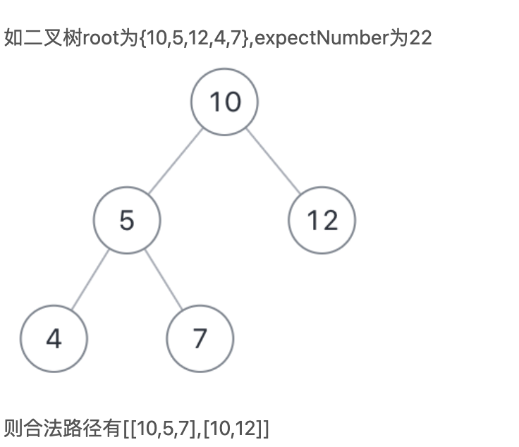
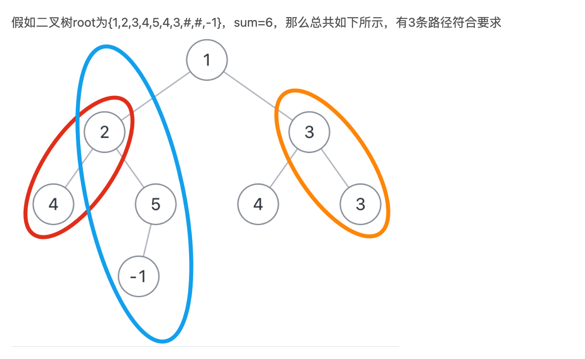
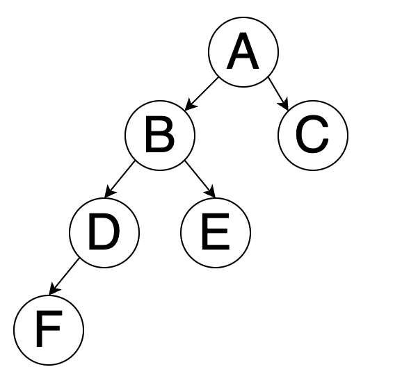
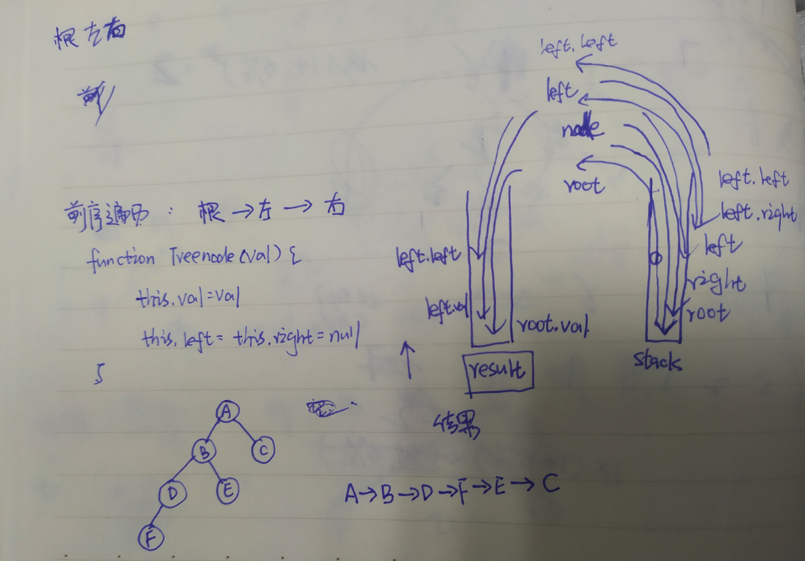
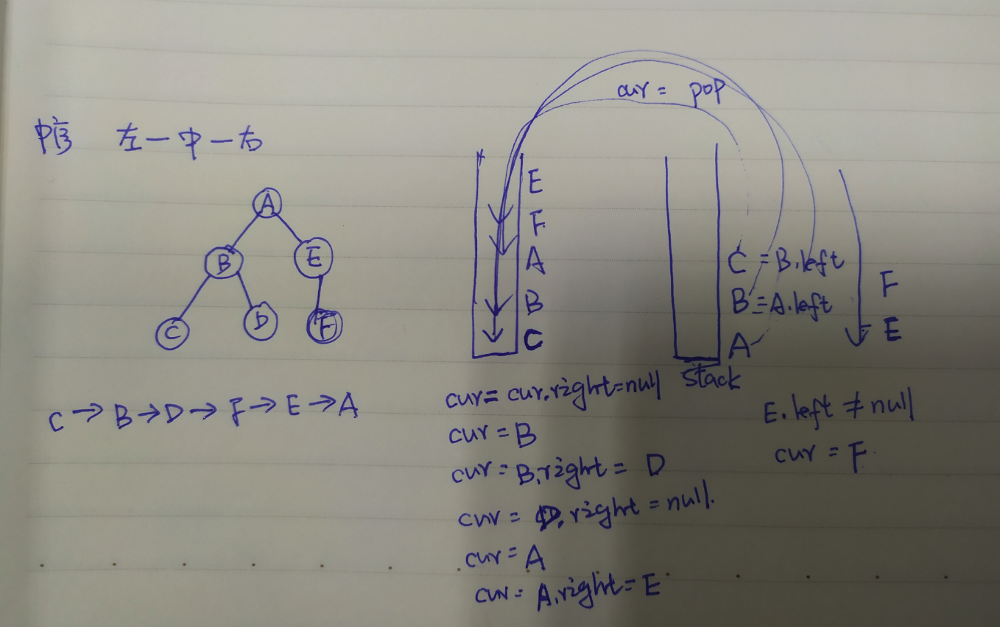
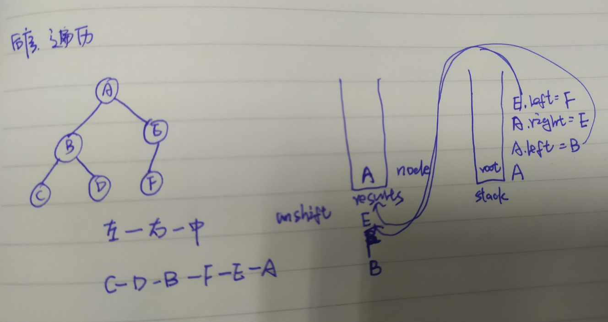

[toc]

总体思路：

+ 凡是需要O（n^2）实现的算法，都可以考虑双指针

+ 尽量不要修改原有的数据结构

# 性能好坏判断

```js
console.time('findNumber')
console.log('findNumber', findNumber(100)) //0.810302734375 ms
console.timeEnd('findNumber')
```

通过console.time和console.timeEnd可以得到中间的执行时间，从而判断好坏

# 二叉树

## 二叉树所有路径

写出二叉树所有的路径

```js
var binaryTreePaths = function(root) {
   let res = []
   let list = []
   function dfs(root){
        if(!root) return
        list.push(root.val)
        if(!root.left && !root.right){
            res.push([...list].join("->"))
        }
     if(!root.left)  { dfs(root.left)  list.pop()}
     if(!root.right)  { dfs(root.right)  list.pop()}
    }
   dfs(root)
   return res
};
```

### JZ82二叉树中是否存在和为某一值的路径

二叉树中是否存在一条路径，路径之和为给定的值

思路：

+ 路径：一定是需要遍历的，并且每遍历一层，就需要减去当前节点的值
+ 结束条件： 一定是叶子节点
+ 考虑root节点不存在的情况

```js
function hasPathSum( root ,  sum ) {
    if(!root) return false
    if(root.val==sum && !root.left && !root.right) return true
    return hasPathSum( root.left, sum-root.val ) || hasPathSum( root.right, sum-root.val ) 
}
```

### JZ34二叉树中和为某一值的所有路径

给出二叉树中和为某一个值的所有路径



思路：

+ 结束条件是叶子节点，并且路径和满足条件
+ 节点遍历，遍历过程中，左节点不满足条件，要pop出当前节点，去遍历另一边，比如10-5-4这条路径不满足条件，pop出4， 去判断10-5-7
+ 需要两个变量保存最终结果和路径上的节点信息用于最后的返回
+ 需要考虑只有一个根节点的情况
+ 注意路径信息list需要拷贝，因为list是引用类型，后续的变动会影响当前的值，如果不拷贝，结果会变为[[][]]

```JS
let res= []  //存放最终的结果
let list = [] // 存放路径上的节点信息
function FindPath(root, expectNumber)
{
    dfc(root, expectNumber)
    return res
}
function dfc(root, sum){
    if(!root) return []
    list.push(root.val)
    if(root.val===sum && !root.left && !root.right){
        res.push([...list])
    }
   dfc(root.left, sum-root.val)
   dfc(root.right, sum-root.val)
   list.pop()
}
```

### JZ84二叉树中和为某一值的路径（不需要起始）




不需要从根节点开始，也不需要在叶子节点结束，但是一定是从父亲节点往下到孩子节点，问有多少条路径满足要求

思路：

+ 从根开始判断是不是存在和为给定值的路径（结束条件不是必须为叶子结点才结束）
+ 把子树看做完整的一棵树，重新执行判断过程

```JS
let res = 0
function FindPath( root ,  sum ) {
    if(!root) return 0
    dfs(root, sum)
    FindPath(root.left,  sum )
    FindPath(root.right, sum )
    return res
}

function dfs(root, sum){
    if(!root) return
    if(root.val===sum){
      res = res+1
    }
    dfs(root.left, sum-root.val)
    dfs(root.right, sum-root.val)
}
```

## 二叉树的遍历

二叉树每个节点最多有两个子节点，每个树的树节点都有value,left,right组成，left，right可能不存在，如下是一棵树的结构表示



### 前序遍历

根-->左-->右

```tsx
function preOrderTraverse(node:TreeNode| null){
  if(node===null) return 
  console.log(node.value)
  preOrderTraverse(node.left)
  preOrderTraverse(node.right)
}
preOrderTraverse(tree)
```

结果：

```
A
B
D
F
E
C
```

如果需要把最终的结果都要保存在一个数组里，那么此时需要一个数组用来存储最终遍历出来的结果，一个数组用来暂存节点



```js
var preorderTraversal = function(root) {
    if(root===null){
        return []
    }
    var results=[]
    var stack=[root]
    while(stack.length){
        var node = stack.pop()
        results.push(node.val)
        if(node.right !==null){
            stack.push(node.right)
        }
        if(node.left !==null){
            stack.push(node.left)
        }
    }
    return results
};
```

### 中序遍历

左-->根-->右

```js
function inOrderTraverse(node:TreeNode| null){
  if(node===null) return 
  inOrderTraverse(node.left)
  console.log(node.value)
  inOrderTraverse(node.right)
}
inOrderTraverse(tree)
结果：
F
D
B
E
A
C
```



```js
var inorderTraversal = function(root) {
    if(root===null){
        return []
    }
    var results=[]
    var stack=[]
    var cur = root
    while(true){
        while(cur!==null){
            stack.push(cur)
            cur=cur.left
        }
        if(stack.length==0){
            break
        }
        var cur=stack.pop()
        results.push(cur.val)
        cur=cur.right
    }
    return results
};
```

### 后序遍历

左-->右-->根

```JS

function postOrderTraverse(node:TreeNode| null){
  if(node===null) return 
  postOrderTraverse(node.left)
  postOrderTraverse(node.right)
  console.log(node.value)
}
postOrderTraverse(tree)
结果：
F
D
E
B
C
A
```



```JS
var postorderTraversal = function(root) {
    if(root===null){
        return []
    }
    var stack=[root]
    var results=[]
    while(stack.length>0){
        let nodes=stack.pop()
        results.unshift(nodes.val)
        if(nodes.left){
            stack.push(nodes.left)
        }
        if(nodes.right){
            stack.push(nodes.right)
        }
    }
    return results
};
```

# 栈

## 有效的括号

https://leetcode.cn/problems/valid-parentheses/

```
输入：s = "()[]{}"
输出：true
```

思路：

+ 使用栈，左括号入栈，右括号出栈
+ 注意字符串为空的情况
+ stack.pop操作会直接出栈，造成影响，刚开始判断要用stack[stack.length-1]

```js
isValid = function(s) {
   if(!s.length) return true
   let stack = []
   let leftSymbol = '{[('
   let rightSymbol = '})]'
   for(let i=0;i<s.length;i++){
      if(leftSymbol.includes(s[i])){
        stack.push(s[i])
      }
      else if(rightSymbol.includes(s[i])){
        let res = stack[stack.length-1]
        if(judgeMatch(res,s[i])){
            stack.pop()
        }else{
            return false
        }
      }
   }
   return stack.length===0
};

function judgeMatch(a,b){
    if(a==='(' && b===')') return true
    if(a==='{' && b==='}') return true
    if(a==='[' && b===']') return true
    return false
}
```

换种数据结构

```js
var isValid = function(s) {
  let mapp={
      '(':-1,
      ')':1,
      '{':-2,
      '}':2,
      '[':-3,
      ']':3,
  }
  let stack=[]
  for(let i=0;i<s.length;i++){
      if(mapp[s[i]]<0){
          stack.push(s[i])
      }
      else{
          let last=stack.pop()
          if(mapp[last]+mapp[s[i]]!=0){
              return false
          }
      }
  }
  if (stack.length>0){
      return false
  }
  return true
};
```

# 其他

# 1.左旋转字符串

【JZ58】S = ”abcXYZdef” , 要求输出循环左移 3 位后的结果，即 “XYZdefabc” ，"aab",10输出"aba"

【思路】：计算需要移动的数量，切割并拼接

```js
function LeftRotateString(str, n)
{
    if (!str){
        return ''
    }
    if(str.length === 0 || n===0){
        return str
    }
    let num = n % str.length
    let leftSubStr = str.slice(0, num)
    let rightSubStr = str.slice(num)
    return rightSubStr+leftSubStr
}
```

# 3.**和为S的两个数字**

[**JZ57**]

输入：

```
[1,2,4,7,11,15],15
```

返回值：

```
[4,11]
```

思路：**递增序列**，使用双指针

```js
function FindNumbersWithSum(array, sum)
{
    if(array.length===0){
        return []
    }
    let leftHead = 0
    let rightHead = array.length-1
    while(leftHead<rightHead){
        if(array[leftHead]+array[rightHead]===sum){
            return [array[leftHead],array[rightHead]]
        }
        if(array[leftHead]+array[rightHead]<sum){
        leftHead=leftHead+1
        }
        if(array[leftHead]+array[rightHead]>sum){
            rightHead=rightHead-1
        }
    }
    return []
}
```

# 4.移动0到数组末尾

[leetcode [283. 移动零](https://leetcode.cn/problems/move-zeroes/)]

```
输入: nums = [0,1,0,3,12]
输出: [1,3,12,0,0]
```

要求：在原数组的基础上修改，不能使用新数组

+ 思路1：循环一次，是0则push到数组末尾，然后把当前位置0通过splice删除掉

  ```js
  var moveZeroes = function(nums) {
     for(let i = 0, zerolen = 0; i<nums.length-zerolen;i++){
         if(nums[i]===0){
             nums.push(nums[i])
             nums.splice(i,1)
             i--
             zerolen++
         }
     }
  };
  ```

  + 该方法时间复杂度是O(n^2)，一次是循环，一次是splice，数组是有序存储的，当一个位置元素被删除之后，它后边的元素都要往前挪动一个位置，也就是splice本身在删除的时候复杂度就是O（n）
  + zerolen末尾补0的个数，确定是补进去的0，就不需要再次循环遍历了
  + i--，splice之后要往回挪动一次，抵消splice的影响

+ 考虑另一种思路，双指针，j指向第一个0的位置，指向j之后第一个不为0的位置，交换位置，然后j继续向后移动，此时时间复杂度为O（n）

  ```js
  var moveZeroes = function(nums) {
     let i;
     let j =-1;
     for(let i=0;i<nums.length;i++){
         if(nums[i]===0 && j<0){
             j=i
         }
         if(nums[i]!==0 && j>=0){
             const n = nums[i]
             nums[i]= nums[j]
             nums[j]=n
             j++
         }
     }
  };
  ```


# 6.寻找1-100以内所有回文数

回文数：121

解法1：通过字符串判断

```js
function findNumber(max){
       let arr =[]
       for(let i =1;i<=max;i++){
         if((i+'').split('').reverse().join('')===i+''){
            arr.push(i)
         }
       }
       return arr
     }
```

解法2：数字直接反转

```js
function findNumber2(max){
       let arr =[]
       for(let i =1;i<=max;i++){
         // 比如1234直接反转为4321
         let n = i
         let revNumber = 0
         while(n>0){
           revNumber = revNumber*10 + n%10
           n = Math.floor(n/10)
         }
         if(i === revNumber){
           arr.push(i)
         }
       }
       return arr
     }
```

性能比较:

```js
console.time('findNumber')
console.log('findNumber', findNumber(100)) //0.810302734375 ms
console.timeEnd('findNumber')

console.time('findNumber2')
console.log('findNumber2', findNumber2(100)) //0.345947265625 ms
console.timeEnd('findNumber2')
```

结论：尽量不要去改变原有的数据结构

## 7.斐波那契数列

（青蛙跳有几种方式）

输入 n ，求斐波那契（Fibonacci）数列的第 n 项

### 递归

```js
var fib = function(n) {
   if(n<=1){
       return n
   }
   return fib(n-1)+fib(n-2)
};
```

### 优化

> f(3)=f(1)+f(2)
>
> f(4)=f(3)+f(2)
>
> 那么中间的f(2)和f(3)可以保存下来，这样复杂度可以达到o(n)

- 注意：每次计算得到sum2都需要取模

```js
var fib = function(n) {
   if(n<=1){
       return n
   }
   let sum1=0;
   let sum2=1;
   let res = 0
   for(let i=2;i<=n;i++){
       res = sum1+sum2
       sum2=sum1
       sum1=res
   }
   return res
};
```

