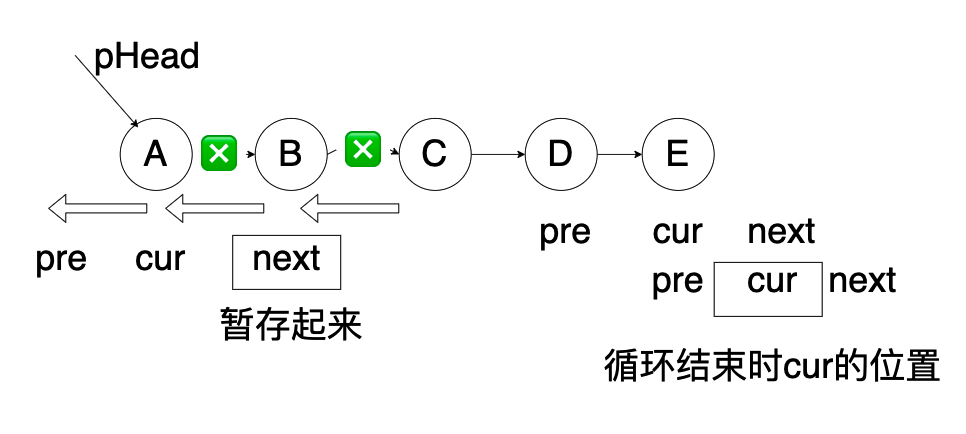

[toc]

总体思路：

+ 凡是需要O（n^2）实现的算法，都可以考虑双指针

+ 尽量不要修改原有的数据结构

# 性能好坏判断

```js
console.time('findNumber')
console.log('findNumber', findNumber(100)) //0.810302734375 ms
console.timeEnd('findNumber')
```

通过console.time和console.timeEnd可以得到中间的执行时间，从而判断好坏

# 二叉树

## 1.二叉树所有路径

写出二叉树所有的路径

```js
var binaryTreePaths = function(root) {
   let res = []
   let list = []
   function dfs(root){
        if(!root) return
        list.push(root.val)
        if(!root.left && !root.right){
            res.push([...list].join("->"))
        }
     if(!root.left)  { dfs(root.left)  list.pop()}
     if(!root.right)  { dfs(root.right)  list.pop()}
    }
   dfs(root)
   return res
};
```

### JZ82二叉树中是否存在和为某一值的路径

二叉树中是否存在一条路径，路径之和为给定的值

思路：

+ 路径：一定是需要遍历的，并且每遍历一层，就需要减去当前节点的值
+ 结束条件： 一定是叶子节点
+ 考虑root节点不存在的情况

```js
function hasPathSum( root ,  sum ) {
    if(!root) return false
    if(root.val==sum && !root.left && !root.right) return true
    return hasPathSum( root.left, sum-root.val ) || hasPathSum( root.right, sum-root.val ) 
}
```

### JZ34二叉树中和为某一值的所有路径

给出二叉树中和为某一个值的所有路径


思路：

+ 结束条件是叶子节点，并且路径和满足条件
+ 节点遍历，遍历过程中，左节点不满足条件，要pop出当前节点，去遍历另一边，比如10-5-4这条路径不满足条件，pop出4， 去判断10-5-7
+ 需要两个变量保存最终结果和路径上的节点信息用于最后的返回
+ 需要考虑只有一个根节点的情况
+ 注意路径信息list需要拷贝，因为list是引用类型，后续的变动会影响当前的值，如果不拷贝，结果会变为[[][]]

```JS
let res= []  //存放最终的结果
let list = [] // 存放路径上的节点信息
function FindPath(root, expectNumber)
{
    dfc(root, expectNumber)
    return res
}
function dfc(root, sum){
    if(!root) return []
    list.push(root.val)
    if(root.val===sum && !root.left && !root.right){
        res.push([...list])
    }
   dfc(root.left, sum-root.val)
   dfc(root.right, sum-root.val)
   list.pop()
}
```

### JZ84二叉树中和为某一值的路径（不需要起始）


不需要从根节点开始，也不需要在叶子节点结束，但是一定是从父亲节点往下到孩子节点，问有多少条路径满足要求

思路：

+ 从根开始判断是不是存在和为给定值的路径（结束条件不是必须为叶子结点才结束）
+ 把子树看做完整的一棵树，重新执行判断过程

```JS
let res = 0
function FindPath( root ,  sum ) {
    if(!root) return 0
    dfs(root, sum)
    FindPath(root.left,  sum )
    FindPath(root.right, sum )
    return res
}

function dfs(root, sum){
    if(!root) return
    if(root.val===sum){
      res = res+1
    }
    dfs(root.left, sum-root.val)
    dfs(root.right, sum-root.val)
}
```

## 2.二叉树的遍历

二叉树每个节点最多有两个子节点，每个树的树节点都有value,left,right组成，left，right可能不存在，如下是一棵树的结构表示


### 前序遍历

根-->左-->右

```tsx
function preOrderTraverse(node:TreeNode| null){
  if(node===null) return 
  console.log(node.value)
  preOrderTraverse(node.left)
  preOrderTraverse(node.right)
}
preOrderTraverse(tree)
```

结果：

```
A
B
D
F
E
C
```

如果需要把最终的结果都要保存在一个数组里，那么此时需要一个数组用来存储最终遍历出来的结果，一个数组用来暂存节点


```js
var preorderTraversal = function(root) {
    if(root===null){
        return []
    }
    var results=[]
    var stack=[root]
    while(stack.length){
        var node = stack.pop()
        results.push(node.val)
        if(node.right !==null){
            stack.push(node.right)
        }
        if(node.left !==null){
            stack.push(node.left)
        }
    }
    return results
};
```

### 中序遍历

左-->根-->右

```js
function inOrderTraverse(node:TreeNode| null){
  if(node===null) return 
  inOrderTraverse(node.left)
  console.log(node.value)
  inOrderTraverse(node.right)
}
inOrderTraverse(tree)
结果：
F
D
B
E
A
C
```


```js
var inorderTraversal = function(root) {
    if(root===null){
        return []
    }
    var results=[]
    var stack=[]
    var cur = root
    while(true){
        while(cur!==null){
            stack.push(cur)
            cur=cur.left
        }
        if(stack.length==0){
            break
        }
        var cur=stack.pop()
        results.push(cur.val)
        cur=cur.right
    }
    return results
};
```

### 后序遍历

左-->右-->根

```JS

function postOrderTraverse(node:TreeNode| null){
  if(node===null) return 
  postOrderTraverse(node.left)
  postOrderTraverse(node.right)
  console.log(node.value)
}
postOrderTraverse(tree)
结果：
F
D
E
B
C
A
```


```JS
var postorderTraversal = function(root) {
    if(root===null){
        return []
    }
    var stack=[root]
    var results=[]
    while(stack.length>0){
        let nodes=stack.pop()
        results.unshift(nodes.val)
        if(nodes.left){
            stack.push(nodes.left)
        }
        if(nodes.right){
            stack.push(nodes.right)
        }
    }
    return results
};
```

## 寻找第K小值

寻找 BST 里的第 K 小值

```JS
export function getKthValue(node: ITreeNode, k: number): number | null {
    inOrderTraverse(node)
    return arr[k - 1] || null
}
```

# 栈

## 有效的括号

https://leetcode.cn/problems/valid-parentheses/

```
输入：s = "()[]{}"
输出：true
```

思路：

+ 使用栈，左括号入栈，右括号出栈
+ 注意字符串为空的情况
+ stack.pop操作会直接出栈，造成影响，刚开始判断要用stack[stack.length-1]

```js
isValid = function(s) {
   if(!s.length) return true
   let stack = []
   let leftSymbol = '{[('
   let rightSymbol = '})]'
   for(let i=0;i<s.length;i++){
      if(leftSymbol.includes(s[i])){
        stack.push(s[i])
      }
      else if(rightSymbol.includes(s[i])){
        let res = stack[stack.length-1]
        if(judgeMatch(res,s[i])){
            stack.pop()
        }else{
            return false
        }
      }
   }
   return stack.length===0
};

function judgeMatch(a,b){
    if(a==='(' && b===')') return true
    if(a==='{' && b==='}') return true
    if(a==='[' && b===']') return true
    return false
}
```

换种数据结构

```js
var isValid = function(s) {
  let mapp={
      '(':-1,
      ')':1,
      '{':-2,
      '}':2,
      '[':-3,
      ']':3,
  }
  let stack=[]
  for(let i=0;i<s.length;i++){
      if(mapp[s[i]]<0){
          stack.push(s[i])
      }
      else{
          let last=stack.pop()
          if(mapp[last]+mapp[s[i]]!=0){
              return false
          }
      }
  }
  if (stack.length>0){
      return false
  }
  return true
};
```

# 树

## 树与列表转换

list转化为树

```JS
// 原始 list 如下
let list =[
    {id:1,name:'部门A',parentId:0},
    {id:2,name:'部门B',parentId:0},
    {id:3,name:'部门C',parentId:1},
    {id:4,name:'部门D',parentId:1},
    {id:5,name:'部门E',parentId:2},
    {id:6,name:'部门F',parentId:3},
    {id:7,name:'部门G',parentId:2},
    {id:8,name:'部门H',parentId:4}
];
const result = convert(list, ...);
```

- 思路，检查父id对应的对象，是否有children属性，有则直接push进去，没有则创建，list里的item本身就是一个引用类型，所以obj的item改变，list的item也会改变，最终list

```js
const result = convert(list);
function convert(list) {
  const obj = {}
  const res = []
  list.forEach(item => {
    obj[item.id] = item
  })
  list.forEach(item => {
    if (item.parentId !== 0) {        
      obj[item.parentId]['children'] ? obj[item.parentId]['children'].push(item) : obj[item.parentId]['children'] = [item]
    } else {
      res.push(item)
    }
  })
  return res
}
console.log(result)
```

# 链表

## 1.反转链表

【JZ24】反转链表



思想：每次把下一个指向next暂存起来避免指向丢失

```js
/*function ListNode(x){
    this.val = x;
    this.next = null;
}*/
function ReverseList(pHead)
{
    let pre = null
    let cur = pHead
    while(cur){
        let next = cur.next
        cur.next = pre
        pre = cur
        cur = next
    }
    return pre
}
```


# 其他

## 1.左旋转字符串

【JZ58】S = ”abcXYZdef” , 要求输出循环左移 3 位后的结果，即 “XYZdefabc” ，"aab",10输出"aba"

【思路】：计算需要移动的数量，切割并拼接

```js
function LeftRotateString(str, n)
{
    if (!str){
        return ''
    }
    if(str.length === 0 || n===0){
        return str
    }
    let num = n % str.length
    let leftSubStr = str.slice(0, num)
    let rightSubStr = str.slice(num)
    return rightSubStr+leftSubStr
}
```


## 6.斐波那契数列

（青蛙跳有几种方式）

输入 n ，求斐波那契（Fibonacci）数列的第 n 项

### 递归

```js
var fib = function(n) {
   if(n<=1){
       return n
   }
   return fib(n-1)+fib(n-2)
};
```

### 优化

> f(3)=f(1)+f(2)
>
> f(4)=f(3)+f(2)
>
> 那么中间的f(2)和f(3)可以保存下来，这样复杂度可以达到o(n)

- 注意：每次计算得到sum2都需要取模

```js
var fib = function(n) {
   if(n<=1){
       return n
   }
   let sum1=0;
   let sum2=1;
   let res = 0
   for(let i=2;i<=n;i++){
       res = sum1+sum2
       sum2=sum1
       sum1=res
   }
   return res
};
```


# 其他
## JZ17 打印从1到最大的n位数
> 描述
输入数字 n，按顺序打印出从 1 到最大的 n 位十进制数。比如输入 3，则打印出 1、2、3 一直到最大的 3 位数 999。
```ts
export function printNumbers(n: number): number[] {
    if(n <=0) return []
    const max = 10**n-1
    const res: number[] = []
    for (let i:number =1;i<=max; i++){
        res.push(i)
    }
    return res
}
```
## JZ83 剪绳子（进阶版）
> 给你一根长度为 n 的绳子，请把绳子剪成整数长的 m 段（ m 、 n 都是整数， n > 1 并且 m > 1 ， m <= n ），每段绳子的长度记为 k[1],...,k[m] 。请问 k[1]*k[2]*...*k[m] 可能的最大乘积是多少？例如，当绳子的长度是 8 时，我们把它剪成长度分别为 2、3、3 的三段，此时得到的最大乘积是 18 。
+ 动态规划<有其他解法更快，但是不太好理解>

```ts
export function cutRope(number: number): number {
    // 边界情况
    if (number < 2) return 0;
    if (number === 2) return 1;
    if (number === 3) return 2;

    // 创建一个数组来存储子问题的最优解
    const products = new Array(number + 1);

    // 0、1、2和3长度的绳子的最大乘积已知
    products[0] = 0;
    products[1] = 1;
    products[2] = 2;
    products[3] = 3;

    // 从底向上计算每个子问题的最优解
    for (let i = 4; i <= number; i++) {
        let max = 0;
        // j表示剪掉的绳子的长度
        for (let j = 1; j <= Math.floor(i / 2); j++) {
            const product = products[j] * products[i - j];
            if (product > max) {
                max = product;
            }
        }
        products[i] = max;
    }

    // 最终结果存储在products[n]中
    return products[number] % 998244353;
}
```
## JZ81 调整数组顺序使奇数位于偶数前面(二)
> 输入：[1,2,3,4]
返回值：
[1,3,2,4]
说明：
[3,1,2,4]或者[3,1,4,2]也是正确答案 

其他思路： 前后各一个指针进行移动
```TS
export function reOrderArrayTwo(array: number[]): number[] {
    // write code here
    if(!array || array.length == 0 || array.length == 1){
        return array;
    }
    let first = 0, last = array.length - 1;
    while(first < last){
        if(array[first] % 2 == 1){
            first++;
        }
        if(array[last] % 2 == 0){
            last--;
        }
        if(array[first] % 2 == 0 && array[last] % 2 == 1){
            let temp = array[first];
            array[first] = array[last];
            array[last] = temp;
            first++;
            last--;
        }
    }
    return array;
}
```


[toc]
## 剑指offer
### 空格替换

```
输入：s = "We are happy."
输出："We%20are%20happy."
```
+ 答案

```
// else一定要有，否则，"We%20 are%20 happy."，20%后边有一个空格
var replaceSpace = function(s) {
  var string='';
  for(var i=0;i<s.length;i++){
      if(s[i]==' '){
          string+='%20'
      }else{
         string+=s[i]
      }
  }
  return string
};
```
********
### 递增序列
思路：存储到目前为止的最大，最小
#### 连续子数组的最大和

```
输入: nums = [-2,1,-3,4,-1,2,1,-5,4]
输出: 6
解释: 连续子数组 [4,-1,2,1] 的和最大，为 6。
```
+ 新数组存储到该位置为止的最大和
+ 新数组找最大数

```
var maxSubArray = function(nums) {
   let memo=[];
   memo[0]=nums[0];
   for(let i=1;i<nums.length;i++){
       memo[i]=Math.max(nums[i]+memo[i-1],nums[i])
   }
   let max=nums[0];
   for(let i=0;i<memo.length;i++){
       max=Math.max(max,memo[i])
   }
   return max
};
```
leetcosw 674最长连续递增序列同理

####  和为s的连续正数序列
要写出来具体序列，用滑窗

```
输入：target = 9
输出：[[2,3,4],[4,5]]
```
+ 遇到一个就加进去，大于则修正，temp抛出数字，且sum减去该值
```
var findContinuousSequence = function (target) {
  let middleIndex = target%2 ? Math.floor(target/2)+1 : target/2;
  let res = [];
  let temp = [];
  let sum = 0;
  for(var i=1;i<=middleIndex;i++){
      temp.push(i);
      sum=sum+ i;
      while(sum > target) {
          sum=sum-temp[0];
          temp.shift();
      }
      if(sum === target && temp.length > 1){
          res.push([...temp]);
      }
  }
  return res;
};
```
*****
### 数字与字符串转换
#### 把数字翻译成字符串

给定一个数字，我们按照如下规则把它翻译为字符串：0 翻译成 “a” ，1 翻译成 “b”，……，11 翻译成 “l”，……，25 翻译成 “z”。一个数字可能有多个翻译。请编程实现一个函数，用来计算一个数字有多少种不同的翻译方法。

```
输入: 12258
输出: 5
解释: 12258有5种不同的翻译，分别是"bccfi", "bwfi", "bczi", "mcfi"和"mzi"
```
+ 用类似指针，考虑一个或者两个元素
```
const translateNum = (num) => {
  const str = num.toString();
  const dfs = (str, pointer) => {            // 随着dfs向下，pointer右移
    if (pointer >= str.length - 1) return 1; // 指针抵达边界和超出边界都返回1
    const temp = Number(str[pointer] + str[pointer + 1]);  // 考察该2位数
    if (temp >= 10 && temp <= 25) {          // 落在[10,25]
      return dfs(str, pointer + 1) + dfs(str, pointer + 2);// 2个分支的结果相加
    } else {                                 // 两位数大于25        
      return dfs(str, pointer + 1);          // 返回1个分支的结果
    }
  }
  return dfs(str, 0); // dfs的入口
}
```
####  把字符串转换成整数

```
输入: "words and 987"
输出: 0
解释: 第一个非空字符是 'w', 但它不是数字或正、负号。
     因此无法执行有效的转换。
```
牛客

```
function StrToInt(str)
{
   return Number(str)? parseInt(str):0
}
```
leetcode

```
var strToInt = function(str) {
    let res = str.trim();
    if(!res) return 0;

    let reg=/^[+-]?\d+/
    res = reg.exec(res)
    if(res >= Math.pow(2,31)) {
        return Math.pow(2,31) - 1;
    } else if (res <= Math.pow(-2,31)) {
        return  Math.pow(-2,31)
    } else {
        return  res;
    }
};
```


*********
### 链表
#### 删除链表重复元素

```
在一个排序的链表中，存在重复的结点，请删除该链表中重复的结点，重复的结点不保留，返回链表头指针。 例如，链表1->2->3->3->4->4->5 处理后为 1->2->5
```

```
function deleteDuplication(pHead)
{
    // write code here
   if(!pHead||!pHead.next){
      return pHead;  
   }
   const dummy=new ListNode(0);
   dummy.next=pHead;
   var pre=dummy;
   var cur=dummy.next;
   while(cur){
        if(cur.next&&cur.val===cur.next.val){
            while(cur.next&&cur.val===cur.next.val){
                cur=cur.next;
            }
            pre.next=cur.next;
            cur=cur.next;
        }
        else{
            pre=pre.next;
            cur=cur.next;
        }
    }
    return dummy.next
}
```

#### 找到环的入口

```
function EntryNodeOfLoop(pHead)
{
    let pheader=pHead;
    let arr=[];
    while(pheader.next){
        if(arr.indexOf(pheader)==-1){
            arr.push(pheader)
        }else{
            return pheader
        }
        pheader=pheader.next
    }   
}
```

#### 从尾到头打印链表

```
输入：head = [1,3,2]
输出：[2,3,1]
```
+ 链表格式，记住.val
```
var reversePrint = function(head) {
   let arr=[];
   while(head){
       arr.unshift(head.val)
       head=head.next
   }
   return arr
};
```
#### 输入一个链表，输出该链表中倒数第k个结点

```
function FindKthToTail(head, k)
{
    let p=head;
    let q=head;
    let i=0;
    while(p){
        if(i>=k){
            q=q.next;
        }
        p=p.next;
        i++;
    }
    return i>=k?q:null
}
```
#### 复杂链表的复制


```
请实现 copyRandomList 函数，复制一个复杂链表。在复杂链表中，每个节点除了有一个 next 指针指向下一个节点，还有一个 random 指针指向链表中的任意节点或者 null。
```

示例 1：


```
输入：head = [[7,null],[13,0],[11,4],[10,2],[1,0]]
输出：[[7,null],[13,0],[11,4],[10,2],[1,0]]
```
+ 用map数据格式，然后循环两次，一次复制值，创造新节点，解决next指向。第二次解决random的指向

```
/*function RandomListNode(x){
    this.label = x;
    this.next = null;
    this.random = null;
}*/
function Clone(pHead)
{
    if(!pHead){
        return null
    };
    let node =pHead;
    let newHead=new RandomListNode(node.label);
    let newnode=newHead;
    let res=new Map();
    res.set(node,newnode);
    while(node.next){
        newnode.next=new RandomListNode(node.next.label);
        node=node.next;
        newnode=newnode.next;
        res.set(node,newnode);
    }
    node=pHead;
    newnode=newHead;
    while(newnode){
        newnode.random=res.get(node.random);
        node=node.next;
        newnode=newnode.next;
    }
   return newHead
}
```
#### 打印链表的第一个重复节点

```
输入两个链表，找出它们的第一个公共节点。
如下面的两个链表：
在节点 c1 开始相交。
```

+ 遍历两次
+ 终止条件，且不用考虑不相交，因为遍历结束，不相交PA1，PA2都为null，退出循环且结果也为null

```
var getIntersectionNode = function(headA, headB) {
    let PA1=headA;
    let PA2=headB;
    while(PA1!==PA2){
        if(PA1===null){
            PA1=headB
        }else{
            PA1=PA1.next
        }

        if(PA2===null){
            PA2=headA
        }else{
            PA2=PA2.next
        }
    }
    return PA1
};
```


***************
### 二叉树
#### 二叉树的深度

```
var maxDepth = function(root) {
   if(root==null){
       return 0
   }
   return 1+Math.max(maxDepth(root.left),maxDepth(root.right))
};
```

```
  function getHeight(tree) {
    if (tree === null) return 0
    let left = getHeight(tree.left)+1
    let right = getHeight(tree.right)+1
    return left > right ? left : right
}
```

#### 二叉树层次遍历

```
给定二叉树: [3,9,20,null,null,15,7],

    3
   / \
  9  20
    /  \
   15   7

返回其层次遍历结果：

[
  [3],
  [9,20],
  [15,7]
]

```
+ 注意root为空的情况

```
var levelOrder = function(root) {
    if(root==null){
        return []
    }
    let queue=[root];
    let temparr=[];
    let res=[];
    let nowsum=1;
    let nextsum=0;
    while(queue.length){
        let vnode=queue.shift();
        temparr.push(vnode.val);
        nowsum--
        if(vnode.left){
            queue.push(vnode.left);
            nextsum++
        }
        if(vnode.right){
            queue.push(vnode.right);
            nextsum++
        }

        if(nowsum==0){
            res.push(temparr);
            nowsum=nextsum;
            nextsum=0;
            temparr=[]
        }
    }
    return res
};
```

#### ==**重建二叉树**==
+ 边界条件

```
输入某二叉树的前序遍历和中序遍历的结果，请重建该二叉树。假设输入的前序遍历和中序遍历的结果中都不含重复的数字。

例如，给出
前序遍历 preorder = [3,9,20,15,7]
中序遍历 inorder = [9,3,15,20,7]
返回如下的二叉树：
    3
   / \
  9  20
    /  \
   15   7
```


+ 创建新节点，然后左右子树递归调用
+ 条件，前序不为空的时候调用
+ 用一个start指针，一个end指针，判断结束条件
```
var buildTree = function(preorder, inorder) {
    if(preorder.length){
        return generation(0,preorder.length-1)
    }
    function generation(start,end){
       if(start>end){
            return null
       }
       var root=preorder.shift()
       var node= new TreeNode(root) 
       var inorderindex=inorder.indexOf(root)
       node.left=generation(start,inorderindex-1)
       node.right=generation(inorderindex+1,end)
       return node
  }
  return null
};
```
#### 判断是否为子树
输入两棵二叉树A，B，判断B是不是A的子结构。（ps：我们约定空树不是任意一个树的子结构

```
function HasSubtree(pRoot1, pRoot2)
{
    if(pRoot1==null || pRoot2==null){
        return false
    }
    return find(pRoot1, pRoot2)|| HasSubtree(pRoot1.left, pRoot2)|| HasSubtree(pRoot1.right, pRoot2)
}

function find(p1, p2){
    if(p2==null)return true;
    if(p1==null)return false;
    return p1.val==p2.val && find(p1.left, p2.left)&& find(p1.right, p2.right)
}
```
#### ==二叉树的镜像==
操作给定的二叉树，将其变换为源二叉树的镜像。

```
例如输入：

     4
   /   \
  2     7
 / \   / \
1   3 6   9
镜像输出：

     4
   /   \
  7     2
 / \   / \
9   6 3   1
```
+ 中止条件，而且没有用循环
```
function Mirror(root)
{
     if(!root){
        return null
    }
    let temp=root.left;
    root.left=root.right;
    root.right=temp;
    Mirror(root.left)
    Mirror(root.right)
    return root
}
```
*******
#### 判断对称二叉树

```
请实现一个函数，用来判断一棵二叉树是不是对称的。如果一棵二叉树和它的镜像一样，那么它是对称的。

例如，二叉树 [1,2,2,3,4,4,3] 是对称的。

    1
   / \
  2   2
 / \ / \
3  4 4  3
```

+ 终止条件，两边都为空，true,一边不为空，false
```
var isSymmetric = function(root) {
    function isMirror(r1, r2) {
        if(!r1 && !r2) return true
        if(!r1 || !r2) return false

        return r1.val === r2.val && isMirror(r1.left, r2.right) && isMirror(r1.right, r2.left)
    }

    return isMirror(root, root)
};
```

*******
#### 二叉树后序遍历序列
输入一个整数数组，判断该数组是不是某二叉搜索树的后序遍历结果。如果是则返回 true，否则返回 false。假设输入的数组的任意两个数字都互不相同。

```
参考以下这颗二叉搜索树：

     5
    / \
   2   6
  / \
 1   3

示例 1：

输入: [1,6,3,2,5]
输出: false

示例 2：

输入: [1,3,2,6,5]
输出: true
```
思路：
+ 牢记，二叉树后序遍历左右中，最后一个元素为根节点
+ 二叉搜索树，左节点永远小于根节点，右节点永远大于根节点

```
function VerifySquenceOfBST(sequence)
{
   //如果为[]，要返回false
   if(!sequence.length){
      return false  
   }
   return helper(sequence)
}
//正常的处理代码
function helper(postorder){
   let len=postorder.length;
   //叶子节点，true
   if(len<2){
       return true
   }
   //根节点与左子树
   let root=postorder[len-1];
   for(var i=0;i<len-1;i++){
       if(postorder[i]>root){
           break;
       }
   }
   //右子树是否都比根节点大，every只有全部为true，结果才是TRUE
   let noderight=postorder.slice(i,len-1).every(x=>x>root);
   if(noderight){
   //递归判断
       return helper(postorder.slice(0,i)) && helper(postorder.slice(i,len-1))
   }else{
       return false
   }
}
```

### 5.跳台阶(贪心)
一只青蛙一次可以跳上1级台阶，也可以跳上2级……它也可以跳上n级。求该青蛙跳上一个n级的台阶总共有多少种跳法。
+ 如n=50，跳1个台阶，调用剩下49个，跳2个台阶，调用剩下48个...

```
function jumpFloorII(number)
{
    if(number==0 || number==1){
        return 1; 
    }else{
        var sum = 0;
        for(var i = 1; i <=number; i++){
            sum += jumpFloorII(number-i);
        }
        return sum;
    }
}
```
### 6.矩形覆盖(斐波那契数列)
+ 找规律

```
我们可以用2*1的小矩形横着或者竖着去覆盖更大的矩形。请问用n个2*1的小矩形无重叠地覆盖一个2*n的大矩形，总共有多少种方法？
比如n=3时，2*3的矩形块有3种覆盖方法：
```


```
function rectCover(number)
{ 
    if (number < 1) {
        return 0;
    }else if(number===1||number===2){
        return number
    }else{
        return rectCover(number-1)+rectCover(number-2)
    }
}
```
### 7.二进制中1的个数

```
输入一个整数，输出该数32位二进制表示中1的个数。其中负数用补码表示
```

```
function NumberOf1(n)
{  
  let count = 0;
     while(n!= 0){
            count++;
            n = n & (n - 1);
     }
        return count;
} 
```
举个例子：一个二进制数1100，从右边数起第三位是处于最右边的一个1。减去1后，第三位变成0，它后面的两位0变成了1，而前面的1保持不变，因此得到的结果是1011.我们发现减1的结果是把最右边的一个1开始的所有位都取反了。这个时候如果我们再把原来的整数和减去1之后的结果做与运算，从原来整数最右边一个1那一位开始所有位都会变成0。如1100&1011=1000.也就是说，把一个整数减去1，再和原整数做与运算，会把该整数最右边一个1变成0.那么一个整数的二进制有多少个1，就可以进行多少次这样的操作。

### 8.数值的整数次方

```
var myPow = function(x, n) {
    return x**n
};
//或者Math.pow(x,n)
```
手写思路：直接循环计算会超出时间限制，

```
所以把比如2^16变为(2^8)*(2^8),2^17变为(2^8)*(2^8)*2,再考虑负指数的情况。
```
```
var myPow = function(x, n) {
    if(n == 0){
        return 1;
    }
    let m=Math.abs(n);
    let re = myPow(x, Math.floor(m/2));
    let results= m %2 === 0 ? re* re : re*re*x;
    return n>=0 ? results : 1 / results;
};
```


### 12.顺时针输出矩阵
输入一个矩阵，按照从外向里以顺时针的顺序依次打印出每一个数字。

```
输入：matrix = [[1,2,3],[4,5,6],[7,8,9]]
输出：[1,2,3,6,9,8,7,4,5]
```


+ 遍历规则
+ 截止条件matrix.length==0和(top>bottom || left>right)

```
var spiralOrder = function(matrix) {
   if(matrix.length==0){
       return []
   }
   let container=[]
   let top=0;
   let right=matrix[0].length-1;
   let bottom=matrix.length-1;
   let left=0;
   while(top<=bottom && left<=right){
     for(let i=left;i<=right;i++){
         container.push(matrix[top][i]);
     };
     top++;
     for(var j=top;j<=bottom;j++){
         container.push(matrix[j][right]);
     }
     right--;
     if(top>bottom || left>right){
         break;
     }
     for(var m=right;m>=left;m--){
         container.push(matrix[bottom][m]);
     }
     bottom--;
     for(var n=bottom;n>=top;n--){
         container.push(matrix[n][left])
     }
     left++;
   }
   return container
};
```
### 13.栈的压入，弹出

```
输入两个整数序列，第一个序列表示栈的压入顺序，请判断第二个序列是否为该栈的弹出顺序。假设压入栈的所有数字均不相等。例如，序列 {1,2,3,4,5} 是某栈的压栈序列，序列 {4,5,3,2,1} 是该压栈序列对应的一个弹出序列，但 {4,3,5,1,2} 就不可能是该压栈序列的弹出序列。
```
+ 思路掌握,index为弹出序列的指针，stack为共同维护的一个栈，当前第一个弹出元素在push里没有的时候，要push进去stack，当恰好stack最后一个元素为弹出的元素，把stack里这个元素弹出，继续弹出的下一个元素判断
```
var validateStackSequences = function(pushed, popped) {
    var stack = [];
    var index = 0
    for(var i = 0; i < pushed.length; i++){
        stack.push(pushed[i]);
        while(stack.length && stack[stack.length - 1] === popped[index]){
            stack.pop();
            index ++;
        }
    }
    return stack.length === 0
};
```
### 14.字符串第一个不重复的字符

```
请实现一个函数用来找出字符流中第一个只出现一次的字符。例如，当从字符流中只读出前两个字符"go"时，第一个只出现一次的字符是"g"。当从该字符流中读出前六个字符“google"时，第一个只出现一次的字符是"l"。
```
+ 思路，存放在数组里，如果第一个从前往后和从后往前的序号相同，就是第一个不重复字符
+ for...of 就表示本元素

```
let arr 
function Init()
{
    arr = []
}
//Insert one char from stringstream
function Insert(ch)
{
    arr.push(ch)
}
//return the first appearence once char in current stringstream
function FirstAppearingOnce()
{
    for(let i of arr){
        if(arr.indexOf(i) === arr.lastIndexOf(i)){
            return i
        }
    }
    return '#'
}
```
leetcode offer50

```
在字符串 s 中找出第一个只出现一次的字符。如果没有，返回一个单空格。 s 只包含小写字母。

s = "abaccdeff"
返回 "b"
```
+ map里数据存储有序，用for...of遍历，['m',1]这种格式，可以直接读取，或者遍历map.keys(),再找对应的map.get(map.keys('m')),**不能用for...in**
```
var firstUniqChar = function(s) {
  let map=new Map();
  for(let i in s){
      if(!map.has(s[i])){
          map.set(s[i],1)
      }else{
          map.set(s[i],map.get(s[i])+1)
      }
  }

  for(let m of map){
      if(m[1]==1){
          return m[0]
      }
  }
  return ' '
};
```
### 15.不用加减乘除做加法

```
写一个函数，求两个整数之和，要求在函数体内不得使用 “+”、“-”、“*”、“/” 四则运算符号。

输入: a = 1, b = 1
输出: 2
```

```
var add = function(a, b) {
    while(a !== 0){
        let temp = (a ^ b); //不进位加法
        a = (a & b) << 1; ////进位部分赋值给a
        b = temp; ////不进位部分赋值给b
    }
    return b //返回不进位部分
};
```
### 16.剪绳子

```
给你一根长度为 n 的绳子，请把绳子剪成整数长度的 m 段（m、n都是整数，n>1并且m>1），每段绳子的长度记为 k[0],k[1]...k[m-1] 。请问 k[0]*k[1]*...*k[m-1] 可能的最大乘积是多少？例如，当绳子的长度是8时，我们把它剪成长度分别为2、3、3的三段，此时得到的最大乘积是18。
```
+ 尽可能分为长度为3的绳子（数学计算规律），牛客不能通过
```
var cuttingRope = function(n) {
    if (n === 2) return 1;
    if (n === 3) return 2;
    // a的含义：n能拆成的3的个数
    const a = Math.floor(n / 3);
    const b = n % 3;

    // n是3的倍数
    if (b === 0) return Math.pow(3, a);
    // n是 3k + 1，例如7。拆成3、3、1。由于有1对结果无法有贡献，所以最后的3、1换成4
    if (b === 1) return Math.pow(3, a - 1) * 4;
    return Math.pow(3, a) * 2;
};
```
****
### 17.构建乘积数组

```
给定一个数组 A[0,1,…,n-1]，请构建一个数组 B[0,1,…,n-1]，其中 B 中的元素 B[i]=A[0]×A[1]×…×A[i-1]×A[i+1]×…×A[n-1]。不能使用除法。

输入: [1,2,3,4,5]
输出: [120,60,40,30,24]
```
+ 暴力法两层循环超时，应该元素左边相乘，右边相乘，再相乘，第二步时直接得到结果
+ 注意边界，因为乘的是i-1,i+1的元素

```
var constructArr = function(a) {
    let B=[1];
    let len=a.length;
    let temp=1;
    for(let i=1;i<len;i++){
        temp=temp*a[i-1]
        B[i]=temp
    }
    temp=1;
    for(let j=len-1-1;j>=0;j--){
        temp=temp*a[j+1];
        B[j]=B[j]*temp
    }
    return B
};
```
******
### 18.二叉树的最大深度(leetcode 104)

```
给定一个二叉树，找出其最大深度。
二叉树的深度为根节点到最远叶子节点的最长路径上的节点数。
说明: 叶子节点是指没有子节点的节点。
示例：
给定二叉树 [3,9,20,null,null,15,7]，

    3
   / \
  9  20
    /  \
   15   7

返回它的最大深度 3 。
```
+ 递归，根节点要加上
```
var maxDepth = function(root) {
    if(root==null){
        return 0
    }
    return 1+Math.max(maxDepth(root.left),maxDepth(root.right))
};
```
******
### 19.左旋转字符串

```
汇编语言中有一种移位指令叫做循环左移（ROL），现在有个简单的任务，就是用字符串模拟这个指令的运算结果。对于一个给定的字符序列S，请你把其循环左移K位后的序列输出。例如，字符序列S=”abcXYZdef”,要求输出循环左移3位后的结果，即“XYZdefabc”。是不是很简单？OK，搞定它！
```
+ 添加判断条件，否则牛客无法通过
```
function LeftRotateString(str, n)
{    
    if(!str || str.length==0){
        return ''
    }
    return str.substring(n)+str.substring(0,n)
}
```
*****
## 20.表示字符的字符串

```
请实现一个函数用来判断字符串是否表示数值（包括整数和小数）。例如，字符串"+100","5e2","-123","3.1416"和"-1E-16"都表示数值。 但是"12e","1a3.14","1.2.3","+-5"和"12e+4.3"都不是。
```

```
function isNumeric(s)
{
    return /^[+-]?(\d+(\.\d*)?|(\.\d+))([Ee][+-]?\d+)?$/.test(s.trim());
}
```
*****
### 21.翻转单词顺序

```
输入: "the sky is blue"
输出: "blue is sky the"
```

```
var reverseWords = function(s) {
    var str = s.trim().split(' ').filter(item => item!=='').reverse().join(' ')
    return str
};
```
*******
### 22.求1+2+…+n

```
求1+2+3+...+n，要求不能使用乘除法、for、while、if、else、switch、case等关键字及条件判断语句（A?B:C）。
```


```
function Sum_Solution(n)
{
    return n && Sum_Solution(n - 1) + n;
}
```
******


[toc]

# 算法
## 时间复杂度
 O(N)
 O(logn)
 O(n^2)
 程序执行的次数
```
for (var i=0;i<n;i++){
    for (var j=i;i<n;i++){
}
//执行n+n-1+n-2+...等差数列O（n^2）
```
## 按位左移右移
+ 32位表示(位操作32位都写出来)
+ 从右开始，比如2表示10, 是 2^1  ， 2^0
+ 负数为正数的反码加一
### 左移右移数学运算
+ 左移右移，<<,>> 右移补符号位，左移补0
，<<<,>>> 把负数的移动当成正数，都补0
```
// 10 在二进制中表示为 1010 ，左移一位后变成 10100 ，转换为十进制也就是 20，右移一位为101，为5
10 << 1 // -> 20 左移相当于 a * (2 ^ b)
10 >> 1 // -> 5  右移动a / (2 ^ b)
13 >> 1 // -> 6 
```
+ 取非

```
取按位非等于-值-1
~25=-26 (反码+1=补码 反码=补码-1=负数-1)
```
+ 按位异或

```
按位异或^就是不进位加法,进位就是普通求和操作
```

+ 按位求和
```
 // a + b = (a ^ b) + ((a & b) << 1) 异或加上进位的部分
 function sum(a, b) {
   if (a == 0) return b 
   if (b == 0) return a 
   let newA = a ^ b 
   let newB = (a & b) << 1 
   return sum(newA, newB)
 }
```
+ NaN与Infinity按位，为0

```
-1 >>> 32 的值为(2^32-1  )
1的二进制代码 00000000 00000000 00000000 00000001
1的反码       11111111 11111111 11111111 11111110
-1的二进制码  11111111 11111111 11111111 11111111
>>>32 无符号右移32位
000000000 0000000000 000000000 000000000 11111111 11111111 11111111 11111111
右移大于32，只保留最低的5位，得到(2^32-1  )
```
### 进制转换
+ 10进制换为二进制toString()
+ 某进制转换为10进制parseInt()

```
parseInt(num,2).toString(16)  //二进制转十六进制
```
### 补码表示
+ JS中求二进制，(number).toString(2)，负数和正数表示除了符号外相同。

```
如(-123).toString(2) == ‘-1111011’, (123).toString(2) == ‘1111011‘
```
+ 负数正码取反（不包括符号位）+1即得到补码表示 

```
func twoComple(num){
    const reg = /1|0/g; 
    var binary = num.toString(2);
    var twoC = binary.replace(reg,(x) => {return x === "0" ? "1" : "0"}); //取反
    twoC = twoC.substr(1); //除去符号位
    num = Number(twoC) + 1; //加一
    twoC = '1' + num.toString(2); //添加符号位
    return twoC
```

***********

## 堆
+ 完全二叉树，子节点左右都有
+ 从根节点开始，每层按从左到右的顺序存入数组
+ 大根堆是任何父节点的值比所有子节点的值大，根节点最大， 小根堆是任何父节点的值比所有子节点的值小，根节点最小
### 重要性质

```
arr
从1开始，那么arr[i]的两个子节点为arr[2i]何arr[2i+1]
==>数组从0开始排
arr[i-1]的子节点为arr[2i+1]和arr[2i+2]
```
### 构造大顶堆
+ 主体部分，从第Math.floor(len/2)的元素开始，从底向上进行比较交换元素。Math.floor(len/2)的元素是完全二叉树的最后一个非叶子节点
```
function buildstack(arr){
  let len=arr.length
  for(var i=Math.floor(len/2);i>=0;i--){
    buildchange(arr,i,len)
  }
  return arr
}
```
+ 每个元素与它的左节点，右节点进行比较，与最大的孩子节点交换位置，注意需要有结束条件与递归调用进行调整，因为是从底向上的，上方节点位置交换之后会影响之前的排列，所以需要再次进行调整
```
function buildchange(arr,i,len){
  var l=2*i+1;
  var r=2*i+2;
  var max=i;
  var temp
  if(arr[l]>arr[max] && l<len){
    max=l
  }
  if(arr[r]>arr[max] && r<len){
    max=r
  }
  if(max!=i){
      temp=arr[i]
      arr[i]=arr[max]
      arr[max]=temp
      buildchange(arr,max,len)
  }
}
```
+ 初始大顶堆的排列
```
var arr=[50,10,90,30,70,40,80,60,20]
console.log(buildstack(arr)) //[90, 70, 80, 60, 10, 40, 50, 30, 20]
```
### 堆排序
+ 按从小到大排序，也就是把堆顶的元素与堆底的元素进行交换，重新再次构造大顶堆，这样所有较大的元素都挪到数组的最后

```
function buildstack(arr){
  let len=arr.length
  for(var i=Math.floor(len/2);i>=0;i--){
    buildchange(arr,i,len)
  }
  var temp
  for(var m=0;m<arr.length;m++){
    temp=arr[0]
    arr[0]=arr[len-1]
    arr[len-1]=temp  
    len--
    buildchange(arr,0,len)
  }
  return arr
}
```
+ 时间复杂度o(nlogn)

```
从小到大排序，构造大顶堆，大的再数组最后
从大到小排序，构造小顶堆
```

### 找到20个数的最大的8个数

```
也可使用其它排序算法，或者sort
```


```
构造8个数数组，使用堆，按从小到大进行排序
其它元素和堆顶元素比大小，比堆顶元素大，则交换位置，重新调整后遭新的排序序列
```

```
// 20个元素，找出8个最大的
arr20=[]
arr8=[]
for(var i=0;i<20;i++){
  var Nm=Math.floor(50*Math.random())
  if(i<8){
    arr8.push(Nm)
  }else{
    arr20.push(Nm)
  }
}

console.log(arr8,arr20)
const InitalNum=buildstack(arr8)
for(var m=0;m<arr20.length;m++){
  if(arr20[m]>InitalNum[0]){
    InitalNum[0]=arr20[m]
    buildstack(InitalNum)
  }
}
console.log('结果',InitalNum)


function buildstack(arr){
  let len=arr.length
  for(var i=Math.floor(len/2);i>=0;i--){
    buildchange(arr,i,len)
  }
  var temp
  for(var m=0;m<arr.length;m++){
    temp=arr[0]
    arr[0]=arr[len-1]
    arr[len-1]=temp  
    len--
    buildchange(arr,0,len)
  }
  return arr
}

function buildchange(arr,i,len){
  var l=2*i+1;
  var r=2*i+2;
  var max=i;
  var temp
  if(arr[l]>arr[max] && l<len){
    max=l
  }
  if(arr[r]>arr[max] && r<len){
    max=r
  }
  if(max!=i){
      temp=arr[i]
      arr[i]=arr[max]
      arr[max]=temp
      buildchange(arr,max,len)
  }
}
```
***********
## 动态规划
自底向上将问题分解为子问题，并且采用变量存储已经计算得到的值
### 打家截舍(leetcode 198)
如果两间相邻的房屋在同一晚上被小偷闯入，系统会自动报警。给定一个代表每个房屋存放金额的非负整数数组，计算你 不触动警报装置的情况下 ，一夜之内能够偷窃到的最高金额。

```
输入：[2,7,9,3,1]
输出：12
解释：偷窃 1 号房屋 (金额 = 2), 偷窃 3 号房屋 (金额 = 9)，接着偷窃 5 号房屋 (金额 = 1)。
     偷窃到的最高金额 = 2 + 9 + 1 = 12 。
```
+ 先找子问题，最大值应该为Math.max(nums[i]+memo[i-2],memo[i-1])，也就是当前值加之前i-2位置所获取的最大值，前1个位置所能获取的累计最大值中间的最大值

```
var rob = function(nums){
  if(nums.length===0){
    return 0
  }
  if(nums.length===1){
    return nums[0]
  }
  let memo=[];
  memo[0]=nums[0]
  memo[1]=Math.max(nums[0],nums[1])
  for(var i=2;i<nums.length;i++){
    memo[i]= Math.max(nums[i]+memo[i-2],memo[i-1])
  }
  return memo[nums.length-1]
}
```
+ 改进，用变量存储中间值

```
var rob = function(nums){
  if(nums.length===0){
    return 0
  }
  if(nums.length===1){
    return nums[0]
  }
  let pre2=nums[0]
  let pre1=Math.max(nums[0],nums[1])
  for(var i=2;i<nums.length;i++){
    const temp= Math.max(nums[i]+pre2,pre1);
    pre2=pre1;
    pre1=temp;
  }
  return pre1
}
```
*************
## 链表

### 链表中倒数第k个节点
+ 双指针法：循环一次，一个指针用于循环至末尾，一个用于指向倒数k的位置


```
var getKthFromEnd = function(head, k) {
    let p=head;
    let q=head;
    let i=0;
    while(p){
        if(i>=k){
            q=q.next;
        }
        p=p.next;
        i++;
    }
    return i>=k?q:null
};
```

*****************
## 栈
### 用数组模拟栈
```
class Stack { 
  constructor() { 
    this.stack = [] 
  } 
  push(item) { 
    this.stack.push(item) 
  } 
  pop() { 
    this.stack.pop() 
  } 
  peek() { 
    return this.stack[this.getCount() - 1] 
  } 
  getCount() { 
    return this.stack.length 
  } 
  isEmpty() { 
    return this.getCount() === 0 
  } 
 } 
```

*******************
## 队列
### 模拟一个队列
```
class Queue { 
  constructor() { 
    this.queue = [] 
  } 
  enQueue(item) { 
    this.queue.push(item) 
  } 
  deQueue() { 
    return this.queue.shift() 
  } 
  getHeader() { 
    return this.queue[0] 
  } 
  getLength() { 
   return this.queue.length 
  } 
  isEmpty() { 
   return this.getLength() === 0 
  } 
```


***************
## 二叉树
### 树的遍历
+ 先序遍历表示先访问根节点，然后访问左节点，后访问右节点。
+ 中序遍历表示先访问左节点，然后访问根节点，后访问右节点。
+ 后序遍历表示先访问左节点，然后访问右节点，后访问根节点。

#### 递归实现
https://blog.csdn.net/zsy_snake/article/details/80353336
```
//此例子为前序遍历，交换顺序可转换为中序遍历和后序遍历
function DLR(tree){
    console.log(tree.value);
    if(tree.left){
        DLR(tree.left);
    }
    if(tree.right){
        DLR(tree.right);
    }
}
//每个节点都会被访问三次
```
#### 非递归实现
```
+ 先序遍历表示先访问根节点，然后访问左节点，后访问右节点。
+ 中序遍历表示先访问左节点，然后访问根节点，后访问右节点。
+ 后序遍历表示先访问左节点，然后访问右节点，后访问根节点。
```
##### 层级遍历(leetcode 102)

```
var levelOrder = function(root) {
   if(root===null){
       return []
   }
   var results=[]
   var temp=[]
   var queue=[root]
   var shiftnum=1
   var nextlevelnum=0
   while(queue.length){
       var shiftnode=queue.shift()
       temp.push(shiftnode.val)
       shiftnum--
       if(shiftnode.left){
           queue.push(shiftnode.left)
           nextlevelnum++
       }
       if(shiftnode.right){
           queue.push(shiftnode.right)
           nextlevelnum++
       }
       if(shiftnum==0){
           results.push(temp)
           temp=[]
           shiftnum=nextlevelnum
           nextlevelnum=0

       }
   }
   return results
};
```
### 构造树
#### 前序+中序(leetcode 105)

+ 要判断没有子树到的情况，null
```
var buildTree = function(preorder, inorder) {
    if(preorder.length){
        return generation(0,preorder.length-1)
    }
    function generation(start,end){
       if(start>end){
            return null
       }
       var root=preorder.shift()
       var node= new TreeNode(root) 
       var inorderindex=inorder.indexOf(root)
       node.left=generation(start,inorderindex-1)
       node.right=generation(inorderindex+1,end)
       return node
  }
  return null
};
```

******************
### 二叉搜索树
+ 节点的左子树只包含小于当前节点的数。 
+ 节点的右子树只包含大于当前节点的数。 
+ 所有左子树和右子树自身必须也是二叉搜索树。

#### 验证是否为二叉搜索树(leetcode 98)
思路：设定上下边界，再限制左节点要小于当前节点，右节点大于当前节点


```
var isValidBST = function(root) {
    //初始的情况
    return vaildate(root,-Infinity,Infinity)
};
function vaildate(node,min,max){
    if(node===null){
        return true;
    }
    if(node.val>=max || node.val<=min){
        return false;
    }
    // 为左右节点更新上下边界
    return vaildate(node.left,min,node.val) && vaildate(node.right,node.val,max)
}
```
#### 平衡二叉树(AVL)(leetcode 108)
平衡二叉树是指一个二叉树每个节点 的左右两个子树的高度差的绝对值不超过 1。

```
将一个按照升序排列的有序数组，转换为一棵高度平衡二叉搜索树。
```
+ 数组是升序的，因此每次选取中间的节点为根节点，小于的为左节点，大于的为右节点
```
var sortedArrayToBST = function(nums) {
    return generation(nums,0,nums.length-1)
};

function generation(nums,start,end){
    if(start>end){
        return null;
    }
    let midindex=start+parseInt((end-start)/2);
    let midnode=nums[midindex];
    let node=new TreeNode(midnode)
    node.left=generation(nums,start,midindex-1)
    node.right=generation(nums,midindex+1,end)
    return node
}
```
#### 二分搜索(用while)(leetcode 704)

```
给定一个 n 个元素有序的（升序）整型数组 nums 和一个目标值 target  ，写一个函数搜索 nums 中的 target，如果目标值存在返回下标，否则返回 -1。

输入: nums = [-1,0,3,5,9,12], target = 9
输出: 4
解释: 9 出现在 nums 中并且下标为 4
```

```
var search = function(nums, target) {
  let start=0;
  let end=nums.length-1;
  while(start<=end){
    let midindex=Math.floor(start+parseInt((end-start)/2));
    let midval=nums[midindex]
    if(midval===target){
      return midindex
    }else if(midval>target){
      end=midindex-1
    }else{
      start=midindex+1
    }
  }
  return -1
};
```

********
### B+树

+ 是多叉而不是二叉了，使用多叉的目的是降低树的高度;
+ 每个节点不再只是存储一个key了，可以存储多个key；
+ 非叶子节点存储key，叶子节点存储key和数据。
+ 叶子节点两两相连，为顺序查询提供了帮助